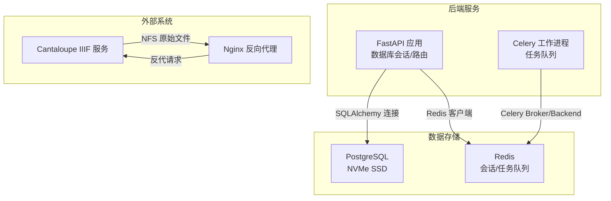
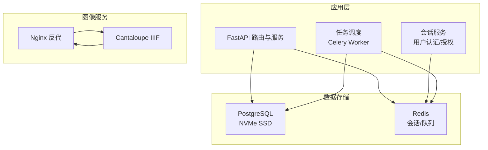
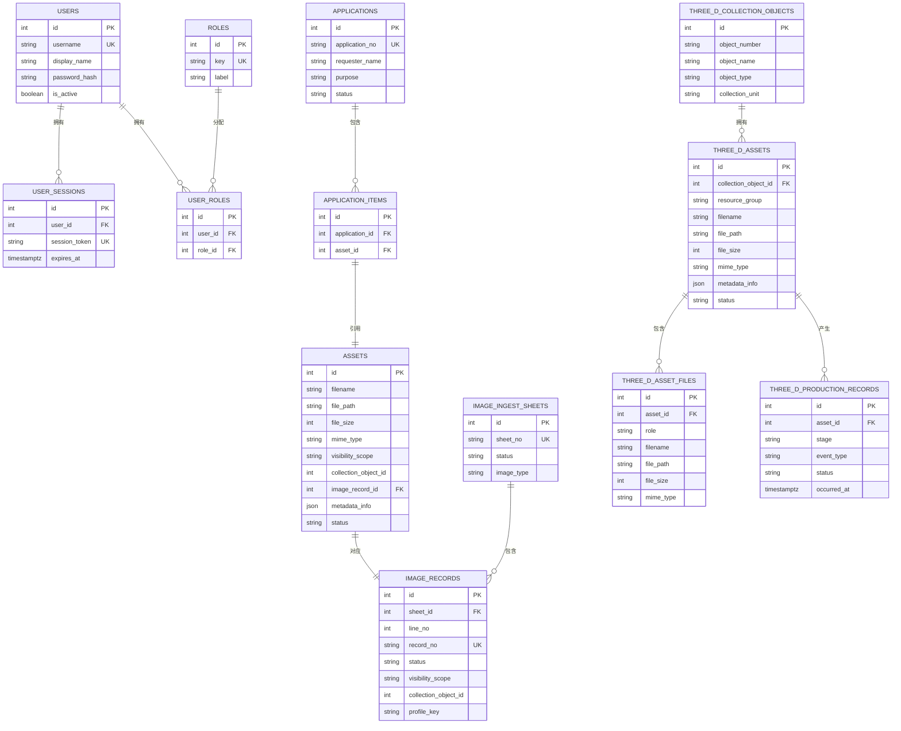
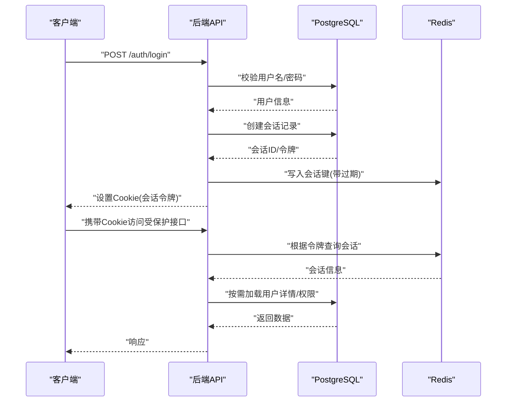
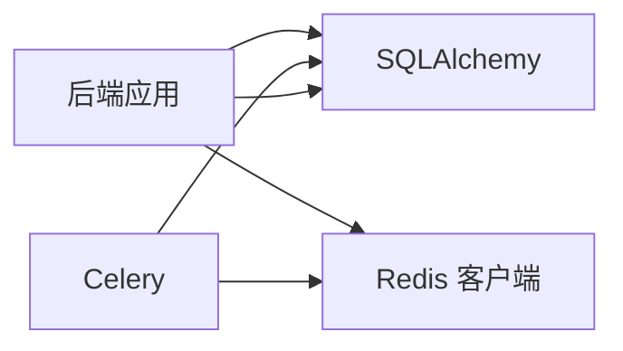

# 数据存储架构

<cite>
**本文引用的文件**
- [backend/app/database.py](file://backend/app/database.py)
- [backend/app/config.py](file://backend/app/config.py)
- [backend/app/models.py](file://backend/app/models.py)
- [docker-compose.yml](file://docker-compose.yml)
- [docker-compose.local-postgres.yml](file://docker-compose.local-postgres.yml)
- [backend/app/celery_app.py](file://backend/app/celery_app.py)
- [backend/app/tasks.py](file://backend/app/tasks.py)
- [backend/requirements.txt](file://backend/requirements.txt)
- [backend/tests/conftest.py](file://backend/tests/conftest.py)
- [DEPLOYMENT.md](file://DEPLOYMENT.md)
- [manage_local_postgres.ps1](file://manage_local_postgres.ps1)
- [backend/app/services/auth.py](file://backend/app/services/auth.py)
- [backend/app/routers/auth.py](file://backend/app/routers/auth.py)
</cite>

## 目录
1. [简介](#简介)
2. [项目结构](#项目结构)
3. [核心组件](#核心组件)
4. [架构总览](#架构总览)
5. [详细组件分析](#详细组件分析)
6. [依赖分析](#依赖分析)
7. [性能考虑](#性能考虑)
8. [故障排查指南](#故障排查指南)
9. [结论](#结论)
10. [附录](#附录)

## 简介
本文件面向MDAMS原型项目的“数据存储架构”，聚焦于PostgreSQL与Redis的混合存储设计。文档从数据库设计模式（实体关系模型、索引策略、查询优化）、PostgreSQL在NVMe SSD上的部署配置与备份恢复策略、连接池管理，到Redis在会话存储与任务队列中的应用、缓存策略与持久化机制进行系统化阐述，并提供数据迁移与版本管理建议、性能监控指标、热/冷数据分离与存储成本优化方案。

## 项目结构
围绕数据存储的关键文件与配置如下：
- 数据库连接与会话：backend/app/database.py
- 配置项（数据库URL、Redis URL等）：backend/app/config.py
- ORM模型定义：backend/app/models.py
- 容器编排（PostgreSQL、Redis、Cantaloupe、前端、后端）：docker-compose.yml
- 本地PostgreSQL测试环境：docker-compose.local-postgres.yml、manage_local_postgres.ps1
- 任务队列（Celery）与Redis集成：backend/app/celery_app.py、backend/app/tasks.py
- 依赖声明（SQLAlchemy、psycopg2、Redis、Celery）：backend/requirements.txt
- 测试数据库准备与URL解析：backend/tests/conftest.py
- 部署与性能优化说明：DEPLOYMENT.md

图表来源
- [docker-compose.yml:1-131](file://docker-compose.yml#L1-L131)
- [backend/app/database.py:1-17](file://backend/app/database.py#L1-L17)
- [backend/app/config.py:42-43](file://backend/app/config.py#L42-L43)
- [backend/app/celery_app.py:1-19](file://backend/app/celery_app.py#L1-L19)

章节来源
- [docker-compose.yml:1-131](file://docker-compose.yml#L1-L131)
- [backend/app/config.py:42-43](file://backend/app/config.py#L42-L43)

## 核心组件
- 数据库连接与会话管理
  - 使用SQLAlchemy创建引擎与会话工厂，通过依赖注入提供数据库会话。
  - 会话在每次请求结束后关闭，避免连接泄漏。
- 配置中心
  - 通过环境变量加载DATABASE_URL与REDIS_URL，支持本地与生产环境切换。
- ORM模型
  - 定义资产、用户、角色、会话、图像记录、申请、三维资源等核心实体及关系。
- 任务队列
  - Celery基于Redis作为Broker与Backend，承载图像派生、人脸识别等异步任务。
- 容器编排
  - PostgreSQL使用本地NVMe SSD卷；Redis提供会话与任务队列；Cantaloupe通过Nginx反代提供IIIF服务。

章节来源
- [backend/app/database.py:1-17](file://backend/app/database.py#L1-L17)
- [backend/app/config.py:42-43](file://backend/app/config.py#L42-L43)
- [backend/app/models.py:1-307](file://backend/app/models.py#L1-L307)
- [backend/app/celery_app.py:1-19](file://backend/app/celery_app.py#L1-L19)
- [docker-compose.yml:65-102](file://docker-compose.yml#L65-L102)

## 架构总览
下图展示MDAMS原型的数据存储与处理路径：后端通过SQLAlchemy访问PostgreSQL，使用Redis支撑会话与任务队列；Cantaloupe通过Nginx反代提供IIIF服务，原始文件挂载自NAS。

图表来源
- [docker-compose.yml:1-131](file://docker-compose.yml#L1-L131)
- [backend/app/services/auth.py:115-134](file://backend/app/services/auth.py#L115-L134)
- [backend/app/routers/auth.py:53-82](file://backend/app/routers/auth.py#L53-L82)
- [backend/app/celery_app.py:1-19](file://backend/app/celery_app.py#L1-L19)

## 详细组件分析

### 数据库设计模式与实体关系模型
- 实体与关系
  - 资产与图像记录：一对一关联，资产记录派生状态与元数据，图像记录承载业务状态与归属。
  - 用户与角色：多对多通过中间表UserRole维护；用户与会话、图像记录的创建/提交/指派关系清晰。
  - 申请与申请项：一对多，申请项指向具体资产。
  - 三维资源：三维资产、文件、生产记录形成完整生命周期追踪。
- 索引策略
  - 主键索引：所有实体主键均为唯一且建立索引。
  - 常用查询字段：username、session_token、record_no、sheet_id、line_no、profile_key、visibility_scope、collection_object_id、image_record_id等建立索引，提升过滤与排序效率。
  - 外键索引：如image_records.sheet_id、application_items.asset_id等，保障关联查询性能。
- 查询优化
  - 使用select_in_bulk/批量查询减少往返。
  - 避免N+1查询，合理使用joined/eager加载策略。
  - 对高频过滤字段（如visibility_scope、status）建立复合索引以优化复杂筛选。
- 元数据存储
  - JSON字段用于存储Exif/IPTC与分层元数据，便于扩展与检索。

图表来源
- [backend/app/models.py:6-307](file://backend/app/models.py#L6-L307)

章节来源
- [backend/app/models.py:1-307](file://backend/app/models.py#L1-L307)

### PostgreSQL在NVMe SSD上的部署配置
- 存储位置
  - PostgreSQL数据目录映射到本地db_data目录，使用NVMe SSD提升I/O性能。
- 内存限制
  - 容器资源限制内存上限，避免过度占用宿主资源。
- 本地测试环境
  - 提供独立的本地PostgreSQL容器，便于本机联调与测试。
- 备份与恢复策略（建议）
  - 备份：定期执行逻辑备份（pg_dump/pg_restore）与物理备份（文件系统快照）。
  - 恢复：制定RTO/RPO目标，验证恢复流程；对关键业务表进行增量备份。
  - 归档：启用WAL归档，支持时间点恢复（PITR）。
- 连接池管理（建议）
  - 使用pgBouncer或同类型连接池中间件，降低连接开销与资源竞争。
  - 配置最大连接数、空闲超时、事务/非事务池分离。
- 监控与告警（建议）
  - 指标：连接数、查询延迟、锁等待、WAL速率、表扫描率、索引使用率。
  - 工具：Prometheus + Grafana + pghero/pg_stat_statements。

章节来源
- [docker-compose.yml:94-101](file://docker-compose.yml#L94-L101)
- [docker-compose.local-postgres.yml:1-19](file://docker-compose.local-postgres.yml#L1-L19)
- [manage_local_postgres.ps1:1-97](file://manage_local_postgres.ps1#L1-L97)
- [DEPLOYMENT.md:55-72](file://DEPLOYMENT.md#L55-L72)

### Redis缓存与任务队列
- 会话存储
  - 用户登录成功后，后端创建会话记录并写入Redis；前端通过Cookie携带会话令牌，后端通过令牌解析当前用户上下文。
- 任务队列
  - Celery使用Redis作为Broker与Backend，任务结果可持久化以便查询与重试。
- 缓存策略设计
  - 热数据：用户会话、近期活跃的图像记录列表、高频查询结果。
  - 冷数据：历史会话、不常访问的派生图清单。
  - 过期策略：基于TTL的主动淘汰；结合LRU逐出策略，避免无限增长。
- 数据持久化机制
  - 生产环境建议开启AOF或RDB持久化，平衡一致性与性能；必要时启用RDB快照与AOF重写。
- 会话清理
  - 过期会话在查询时清理，避免长期堆积。

图表来源
- [backend/app/routers/auth.py:53-82](file://backend/app/routers/auth.py#L53-L82)
- [backend/app/services/auth.py:115-134](file://backend/app/services/auth.py#L115-L134)
- [backend/app/config.py:42-43](file://backend/app/config.py#L42-L43)

章节来源
- [backend/app/routers/auth.py:53-82](file://backend/app/routers/auth.py#L53-L82)
- [backend/app/services/auth.py:115-134](file://backend/app/services/auth.py#L115-L134)
- [backend/app/celery_app.py:1-19](file://backend/app/celery_app.py#L1-L19)
- [backend/app/tasks.py:151-182](file://backend/app/tasks.py#L151-L182)

### 数据迁移与版本管理
- 迁移工具
  - 建议引入Alembic进行数据库迁移，替代启动时的create_all方式，保证演进可控与可回滚。
- 版本管理
  - 迁移脚本按功能模块拆分，遵循“小步快跑、幂等”原则；每次变更均附带测试。
- 回滚策略
  - 保留最近N个版本的迁移；回滚前进行数据备份与一致性校验。
- 兼容性
  - 对历史数据进行清洗与补全，确保新索引与字段可用；对JSON元数据进行结构化演进。

章节来源
- [backend/tests/conftest.py:70-111](file://backend/tests/conftest.py#L70-L111)
- [DEPLOYMENT.md:316-320](file://DEPLOYMENT.md#L316-L320)

### 性能监控指标
- 数据库侧
  - 连接数、查询执行时间、慢查询、锁等待、表扫描次数、索引使用率、WAL写入速率。
- 缓存侧
  - 命中率、过期/驱逐数量、内存使用、命令耗时分布。
- 应用侧
  - 请求延迟、并发连接、任务积压、队列长度、错误率。
- 建议工具
  - Prometheus + Grafana + pghero/pg_stat_statements + Redis监控面板。

章节来源
- [DEPLOYMENT.md:55-72](file://DEPLOYMENT.md#L55-L72)

## 依赖分析
- 组件耦合
  - 后端服务通过SQLAlchemy与PostgreSQL交互，通过Redis与Celery协作；任务执行过程中同时访问数据库与文件系统。
- 外部依赖
  - PostgreSQL驱动（psycopg2）、Redis客户端（redis-py）、任务队列（Celery）。
- 潜在风险
  - 数据库与缓存双写一致性；任务失败重试与死信队列；会话过期与并发清理。

图表来源
- [backend/requirements.txt:1-18](file://backend/requirements.txt#L1-L18)
- [backend/app/database.py:1-17](file://backend/app/database.py#L1-L17)
- [backend/app/config.py:42-43](file://backend/app/config.py#L42-L43)
- [backend/app/celery_app.py:1-19](file://backend/app/celery_app.py#L1-L19)

章节来源
- [backend/requirements.txt:1-18](file://backend/requirements.txt#L1-L18)
- [backend/app/database.py:1-17](file://backend/app/database.py#L1-L17)
- [backend/app/config.py:42-43](file://backend/app/config.py#L42-L43)
- [backend/app/celery_app.py:1-19](file://backend/app/celery_app.py#L1-L19)

## 性能考虑
- 存储分层
  - 热数据（数据库、缩略图缓存）置于NVMe SSD；冷数据（原始PSB/TIFF大图）存放于NAS，通过Cantaloupe按需生成派生图。
- 内存与I/O
  - 后端图像处理（libvips）设置磁盘阈值与流式写入，避免内存峰值；Cantaloupe禁用内存缓存，依赖SSD文件缓存。
- 连接池与并发
  - 使用连接池降低连接开销；Celery工作进程数量与并发度按CPU与I/O能力调优。
- 索引与查询
  - 针对高频过滤字段建立索引；避免SELECT *，仅取必要字段；对大表使用分区或物化视图加速统计查询。

章节来源
- [DEPLOYMENT.md:55-72](file://DEPLOYMENT.md#L55-L72)
- [docker-compose.yml:94-101](file://docker-compose.yml#L94-L101)

## 故障排查指南
- 数据库连接问题
  - 检查DATABASE_URL格式与可达性；确认容器网络与端口映射；查看PostgreSQL日志。
- Redis不可用
  - 检查Redis容器状态与端口；确认连接字符串；验证任务队列Broker/Backend连通性。
- 会话失效
  - 核对Cookie设置与过期时间；检查会话表过期清理逻辑；确认时区与UTC转换。
- 本地测试环境
  - 使用本地PostgreSQL脚本快速启动/重置；确保测试数据库存在且可连接。
- 大图加载缓慢
  - 检查Cantaloupe缓存生成进度；确认Nginx反代配置与Host头传递。

章节来源
- [manage_local_postgres.ps1:1-97](file://manage_local_postgres.ps1#L1-L97)
- [backend/tests/conftest.py:44-67](file://backend/tests/conftest.py#L44-L67)
- [backend/app/services/auth.py:115-134](file://backend/app/services/auth.py#L115-L134)
- [CANTALOUPE_DEPLOY_NOTES.md:72-108](file://CANTALOUPE_DEPLOY_NOTES.md#L72-L108)

## 结论
MDAMS原型采用“PostgreSQL + Redis”的混合存储架构：前者承载结构化业务数据与元数据，后者支撑会话与任务队列。通过NVMe SSD承载热数据、NAS承载冷数据的分层策略，结合连接池与缓存过期机制，在性能与成本之间取得平衡。建议后续引入Alembic迁移、完善备份恢复与监控体系，持续优化索引与查询路径，确保系统稳定与可演进。

## 附录
- 快速参考
  - 数据库URL与Redis URL：通过环境变量配置，支持本地与生产切换。
  - 本地PostgreSQL：一键启动/重置测试库，便于开发与CI。
  - 部署与性能：N100服务器的内存与I/O优化参数已在部署文档中给出。

章节来源
- [backend/app/config.py:42-43](file://backend/app/config.py#L42-L43)
- [docker-compose.local-postgres.yml:1-19](file://docker-compose.local-postgres.yml#L1-L19)
- [manage_local_postgres.ps1:1-97](file://manage_local_postgres.ps1#L1-L97)
- [DEPLOYMENT.md:55-72](file://DEPLOYMENT.md#L55-L72)