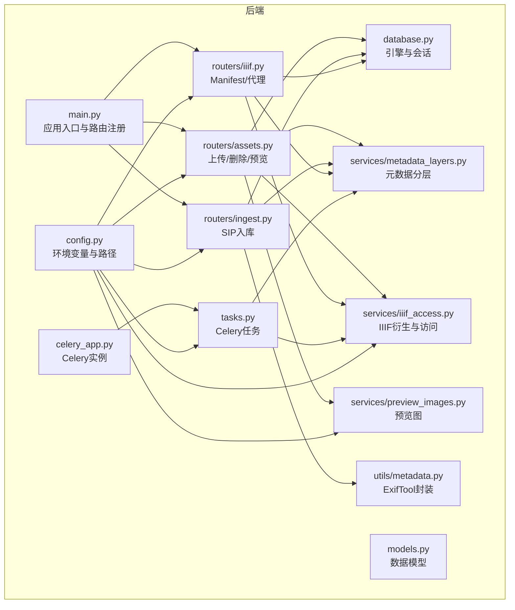
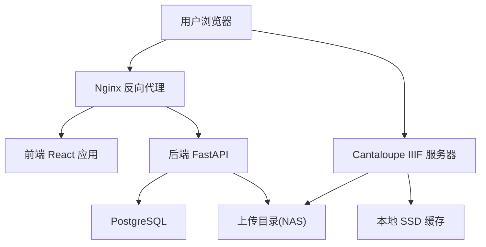
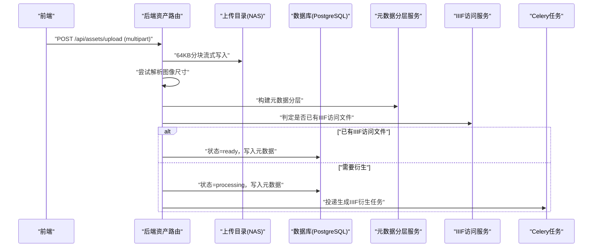
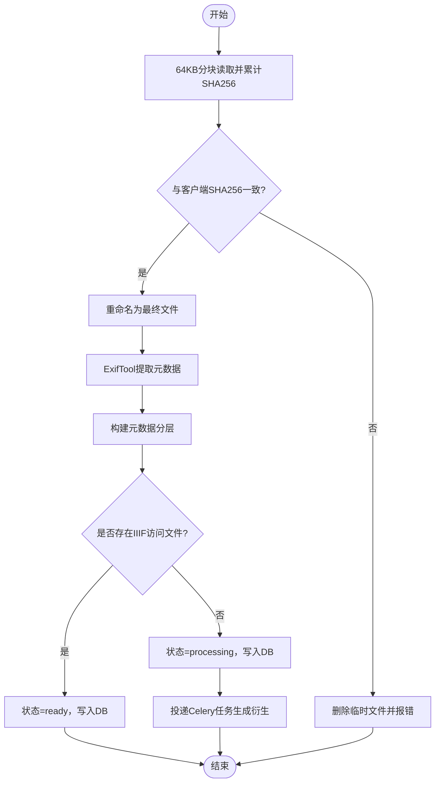
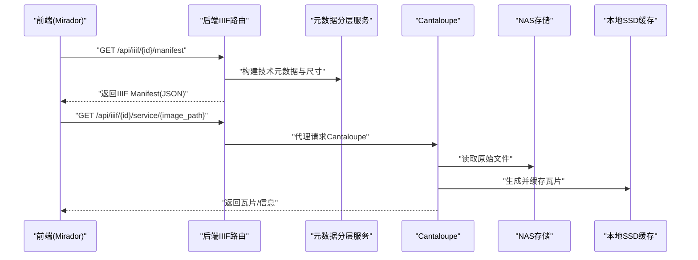
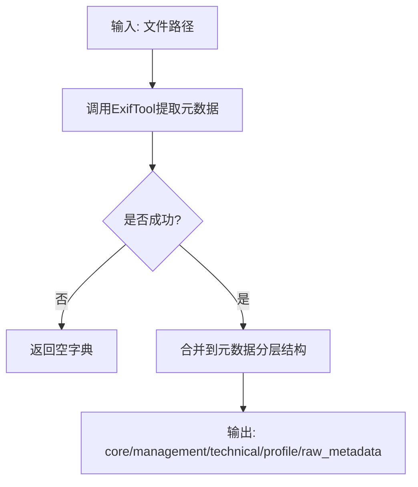
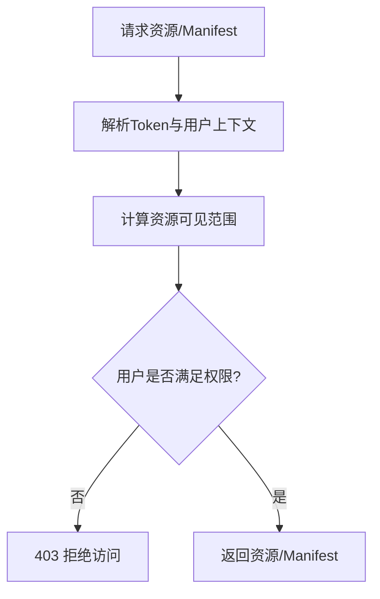
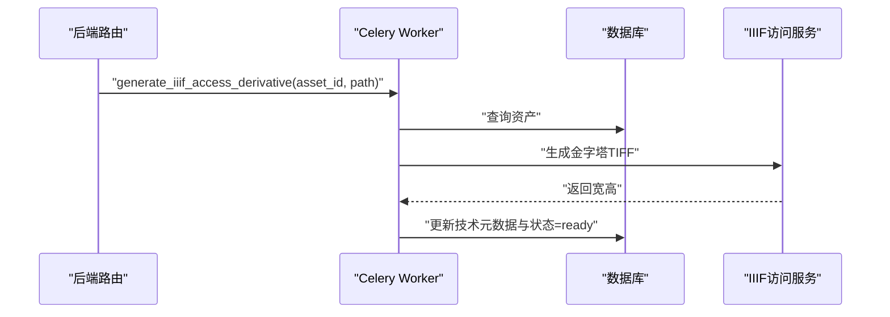
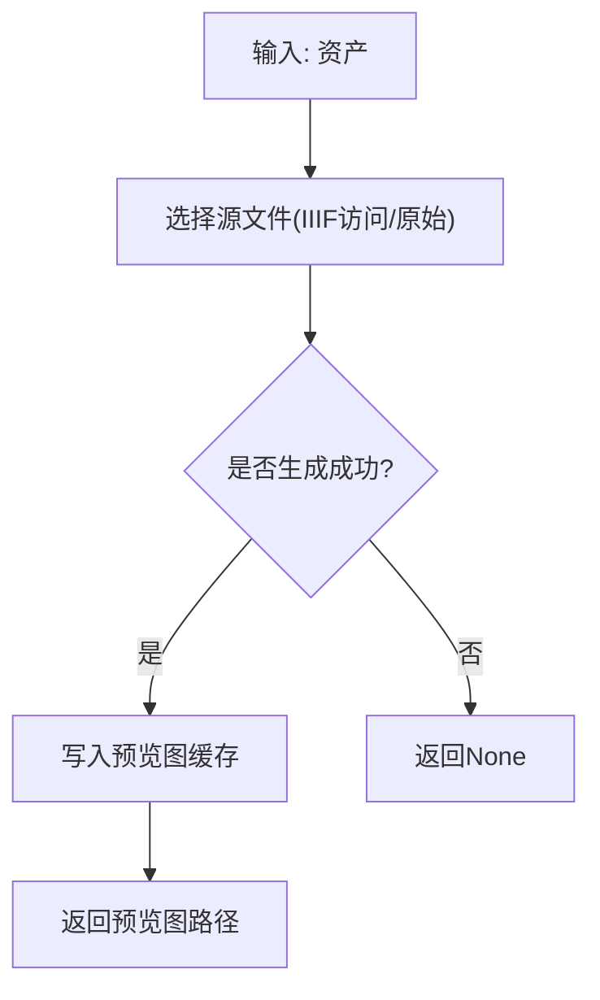
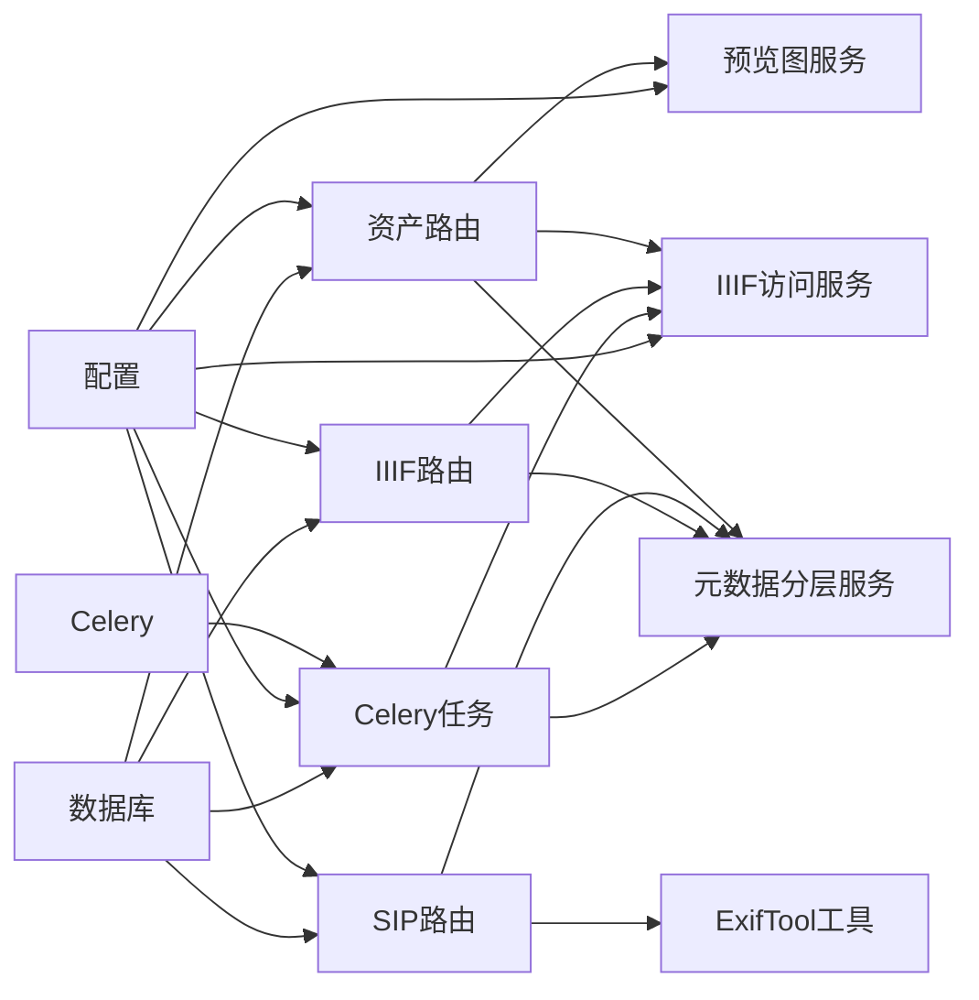

# 数据流设计

<cite>
**本文引用的文件**
- [backend/app/main.py](file://backend/app/main.py)
- [backend/app/config.py](file://backend/app/config.py)
- [backend/app/database.py](file://backend/app/database.py)
- [backend/app/models.py](file://backend/app/models.py)
- [backend/app/celery_app.py](file://backend/app/celery_app.py)
- [backend/app/routers/assets.py](file://backend/app/routers/assets.py)
- [backend/app/routers/ingest.py](file://backend/app/routers/ingest.py)
- [backend/app/routers/iiif.py](file://backend/app/routers/iiif.py)
- [backend/app/tasks.py](file://backend/app/tasks.py)
- [backend/app/services/preview_images.py](file://backend/app/services/preview_images.py)
- [backend/app/services/metadata_layers.py](file://backend/app/services/metadata_layers.py)
- [backend/app/services/iiif_access.py](file://backend/app/services/iiif_access.py)
- [backend/app/utils/metadata.py](file://backend/app/utils/metadata.py)
- [docs/02-架构设计/DATA_INGEST_ARCHITECTURE.md](file://docs/02-架构设计/DATA_INGEST_ARCHITECTURE.md)
- [docs/02-架构设计/AUTH_AND_IIIF_INTEGRATION_PLAN.md](file://docs/02-架构设计/AUTH_AND_IIIF_INTEGRATION_PLAN.md)
- [docs/02-架构设计/SYSTEM_ARCHITECTURE.md](file://docs/02-架构设计/SYSTEM_ARCHITECTURE.md)
</cite>

## 目录
1. [引言](#引言)
2. [项目结构](#项目结构)
3. [核心组件](#核心组件)
4. [架构总览](#架构总览)
5. [详细组件分析](#详细组件分析)
6. [依赖分析](#依赖分析)
7. [性能考虑](#性能考虑)
8. [故障排查指南](#故障排查指南)
9. [结论](#结论)
10. [附录](#附录)

## 引言
本文件面向MDAMS原型项目，系统化梳理数据在系统内的流转路径与处理机制，覆盖用户请求处理、数据存储路径、异步任务处理、图像处理流水线、资产上传与处理、IIIF图像预览、元数据提取、权限控制等核心数据流。同时阐述热/冷数据在SSD与NAS之间的流转策略、缓存策略与性能优化措施，并提供数据流图与时序图，帮助开发者快速理解系统数据处理逻辑。

## 项目结构
后端采用FastAPI + SQLAlchemy + Celery架构，核心模块包括：
- 应用入口与路由注册：main.py
- 配置与数据库连接：config.py、database.py
- 数据模型：models.py
- 路由层：assets.py（上传/删除/预览）、ingest.py（SIP入库）、iiif.py（Manifest与代理）
- 服务层：metadata_layers.py（元数据分层）、iiif_access.py（IIIF衍生与访问路径）、preview_images.py（预览图）
- 异步任务：tasks.py（Celery任务）、celery_app.py（Celery实例）
- 元数据工具：utils/metadata.py（ExifTool封装）

图表来源
- [backend/app/main.py:1-86](file://backend/app/main.py#L1-L86)
- [backend/app/config.py:1-72](file://backend/app/config.py#L1-L72)
- [backend/app/database.py:1-17](file://backend/app/database.py#L1-L17)
- [backend/app/models.py:1-307](file://backend/app/models.py#L1-L307)
- [backend/app/routers/assets.py:1-292](file://backend/app/routers/assets.py#L1-L292)
- [backend/app/routers/ingest.py:1-184](file://backend/app/routers/ingest.py#L1-L184)
- [backend/app/routers/iiif.py:1-303](file://backend/app/routers/iiif.py#L1-L303)
- [backend/app/services/metadata_layers.py:1-636](file://backend/app/services/metadata_layers.py#L1-L636)
- [backend/app/services/iiif_access.py:1-259](file://backend/app/services/iiif_access.py#L1-L259)
- [backend/app/services/preview_images.py:1-105](file://backend/app/services/preview_images.py#L1-L105)
- [backend/app/tasks.py:1-262](file://backend/app/tasks.py#L1-L262)
- [backend/app/celery_app.py:1-19](file://backend/app/celery_app.py#L1-L19)
- [backend/app/utils/metadata.py:1-79](file://backend/app/utils/metadata.py#L1-L79)

章节来源
- [backend/app/main.py:1-86](file://backend/app/main.py#L1-L86)
- [backend/app/config.py:1-72](file://backend/app/config.py#L1-L72)
- [backend/app/database.py:1-17](file://backend/app/database.py#L1-L17)
- [backend/app/models.py:1-307](file://backend/app/models.py#L1-L307)

## 核心组件
- 应用入口与路由注册：初始化数据库、迁移兼容列、注册健康检查、认证、资产、应用、AI Mirador、下载、IIIF、导入、图像记录、三维、平台等路由。
- 配置与数据库：加载.env、设置数据库URL、Redis、上传目录、API与Cantaloupe公共URL；创建SQLAlchemy引擎与会话。
- 数据模型：定义Asset、User、Role、UserRole、UserSession、ImageIngestSheet、ImageRecord、Application、ApplicationItem、ThreeD相关实体及其关系。
- 路由层：
  - 资产路由：上传（64KB分块流式写入）、删除、列表、详情、预览图。
  - SIP入库路由：接收文件流与JSON manifest，进行哈希校验、元数据提取与入库。
  - IIIF路由：生成Manifest、代理Cantaloupe图像服务，结合权限与可见范围控制。
- 服务层：
  - 元数据分层：将原始与来源元数据归并为core/management/technical/profile/raw_metadata五层结构。
  - IIIF访问：判定是否需要衍生、构建衍生输出路径、生成金字塔TIFF、更新技术元数据与状态。
  - 预览图：优先从IIIF衍生或原始文件生成预览图，缓存至上传目录的previews子目录。
- 异步任务：Celery任务队列，执行IIIF衍生生成、PSB转大TIFF、人脸识别等后台处理。
- 元数据工具：调用ExifTool提取EXIF/IPTC/XMP等结构化元数据。

章节来源
- [backend/app/main.py:1-86](file://backend/app/main.py#L1-L86)
- [backend/app/config.py:1-72](file://backend/app/config.py#L1-L72)
- [backend/app/database.py:1-17](file://backend/app/database.py#L1-L17)
- [backend/app/models.py:1-307](file://backend/app/models.py#L1-L307)
- [backend/app/routers/assets.py:54-134](file://backend/app/routers/assets.py#L54-L134)
- [backend/app/routers/ingest.py:29-184](file://backend/app/routers/ingest.py#L29-L184)
- [backend/app/routers/iiif.py:138-303](file://backend/app/routers/iiif.py#L138-L303)
- [backend/app/services/metadata_layers.py:412-508](file://backend/app/services/metadata_layers.py#L412-L508)
- [backend/app/services/iiif_access.py:45-259](file://backend/app/services/iiif_access.py#L45-L259)
- [backend/app/services/preview_images.py:85-105](file://backend/app/services/preview_images.py#L85-L105)
- [backend/app/tasks.py:151-182](file://backend/app/tasks.py#L151-L182)
- [backend/app/utils/metadata.py:19-79](file://backend/app/utils/metadata.py#L19-L79)

## 架构总览
系统采用微服务+容器化编排，前端通过Nginx反向代理访问后端API与静态资源；后端API连接PostgreSQL数据库，文件写入NAS挂载目录；Cantaloupe作为IIIF图像服务器，从NAS读取原始图像，生成瓦片并缓存至本地SSD，以支撑Mirador深度缩放浏览。

图表来源
- [docs/02-架构设计/SYSTEM_ARCHITECTURE.md:22-34](file://docs/02-架构设计/SYSTEM_ARCHITECTURE.md#L22-L34)

章节来源
- [docs/02-架构设计/SYSTEM_ARCHITECTURE.md:1-119](file://docs/02-架构设计/SYSTEM_ARCHITECTURE.md#L1-L119)

## 详细组件分析

### 资产上传与处理流程（64KB分块流式写入策略）
- 前端通过multipart上传文件与表单字段；后端以64KB为粒度读取并写入上传目录，避免大文件导致内存峰值。
- 写入完成后，尝试解析图像尺寸，构建元数据分层（含核心、管理、技术、档案、原始元数据），并根据是否存在IIIF访问文件决定状态为ready或processing。
- 若需要衍生，则投递Celery任务生成金字塔TIFF；若已有IIIF访问文件则直接标记ready。

图表来源
- [backend/app/routers/assets.py:54-134](file://backend/app/routers/assets.py#L54-L134)
- [backend/app/services/metadata_layers.py:412-508](file://backend/app/services/metadata_layers.py#L412-L508)
- [backend/app/services/iiif_access.py:115-141](file://backend/app/services/iiif_access.py#L115-L141)
- [backend/app/tasks.py:151-182](file://backend/app/tasks.py#L151-L182)

章节来源
- [backend/app/routers/assets.py:54-134](file://backend/app/routers/assets.py#L54-L134)
- [backend/app/services/metadata_layers.py:412-508](file://backend/app/services/metadata_layers.py#L412-L508)
- [backend/app/services/iiif_access.py:115-141](file://backend/app/services/iiif_access.py#L115-L141)
- [backend/app/tasks.py:151-182](file://backend/app/tasks.py#L151-L182)

### SIP入库流程（哈希校验与元数据提取）
- 前端上传二进制文件与JSON manifest（包含客户端计算的SHA256与元数据）。
- 后端以64KB分块流式读取，同时计算服务器端SHA256并与客户端比对；通过ExifTool提取EXIF/IPTC/XMP元数据。
- 构建元数据分层，写入数据库；若存在IIIF访问文件则标记ready，否则标记processing并投递Celery任务。

图表来源
- [backend/app/routers/ingest.py:29-184](file://backend/app/routers/ingest.py#L29-L184)
- [backend/app/utils/metadata.py:19-79](file://backend/app/utils/metadata.py#L19-L79)
- [backend/app/services/metadata_layers.py:412-508](file://backend/app/services/metadata_layers.py#L412-L508)
- [backend/app/services/iiif_access.py:115-141](file://backend/app/services/iiif_access.py#L115-L141)
- [backend/app/tasks.py:151-182](file://backend/app/tasks.py#L151-L182)

章节来源
- [backend/app/routers/ingest.py:29-184](file://backend/app/routers/ingest.py#L29-L184)
- [backend/app/utils/metadata.py:19-79](file://backend/app/utils/metadata.py#L19-L79)
- [backend/app/services/metadata_layers.py:412-508](file://backend/app/services/metadata_layers.py#L412-L508)
- [backend/app/services/iiif_access.py:115-141](file://backend/app/services/iiif_access.py#L115-L141)
- [backend/app/tasks.py:151-182](file://backend/app/tasks.py#L151-L182)

### IIIF图像预览流程（Manifest生成、瓦片缓存、深度缩放）
- 前端请求后端生成Manifest，后端根据资产元数据与尺寸构建IIIF Presentation 3.0 Manifest，并指向Cantaloupe图像服务。
- 浏览器加载Mirador，请求info.json与瓦片；Cantaloupe从NAS读取原始文件，生成金字塔瓦片并缓存至SSD，返回浏览器渲染。
- 后端提供代理接口，统一鉴权入口，确保Manifest与图像服务的权限一致性。

图表来源
- [backend/app/routers/iiif.py:138-303](file://backend/app/routers/iiif.py#L138-L303)
- [backend/app/services/metadata_layers.py:572-582](file://backend/app/services/metadata_layers.py#L572-L582)
- [backend/app/services/iiif_access.py:182-200](file://backend/app/services/iiif_access.py#L182-L200)
- [docs/02-架构设计/SYSTEM_ARCHITECTURE.md:80-88](file://docs/02-架构设计/SYSTEM_ARCHITECTURE.md#L80-L88)

章节来源
- [backend/app/routers/iiif.py:138-303](file://backend/app/routers/iiif.py#L138-L303)
- [backend/app/services/metadata_layers.py:572-582](file://backend/app/services/metadata_layers.py#L572-L582)
- [backend/app/services/iiif_access.py:182-200](file://backend/app/services/iiif_access.py#L182-L200)
- [docs/02-架构设计/SYSTEM_ARCHITECTURE.md:80-88](file://docs/02-架构设计/SYSTEM_ARCHITECTURE.md#L80-L88)

### 元数据提取流程
- 使用ExifTool提取EXIF/IPTC/XMP结构化元数据，解析图像尺寸、格式、色彩空间等技术信息。
- 将原始元数据与来源元数据合并，形成core/management/technical/profile/raw_metadata五层结构，便于后续IIIF、权限与导出使用。

图表来源
- [backend/app/utils/metadata.py:19-79](file://backend/app/utils/metadata.py#L19-L79)
- [backend/app/services/metadata_layers.py:412-508](file://backend/app/services/metadata_layers.py#L412-L508)

章节来源
- [backend/app/utils/metadata.py:19-79](file://backend/app/utils/metadata.py#L19-L79)
- [backend/app/services/metadata_layers.py:412-508](file://backend/app/services/metadata_layers.py#L412-L508)

### 权限控制流程
- 应用层认证：登录成功后携带Bearer Token，后端解析当前用户与会话。
- 资源可见范围：结合visibility_scope与collection_object_id，以及用户collection_scope与角色权限矩阵，判断资源是否可见。
- IIIF访问：Manifest入口已受控；建议将Manifest中的图像服务id切换为后端代理路径，统一鉴权入口，避免图像切片访问绕过应用权限。

图表来源
- [docs/02-架构设计/AUTH_AND_IIIF_INTEGRATION_PLAN.md:42-96](file://docs/02-架构设计/AUTH_AND_IIIF_INTEGRATION_PLAN.md#L42-L96)
- [backend/app/routers/iiif.py:57-64](file://backend/app/routers/iiif.py#L57-L64)
- [backend/app/routers/assets.py:209-266](file://backend/app/routers/assets.py#L209-L266)

章节来源
- [docs/02-架构设计/AUTH_AND_IIIF_INTEGRATION_PLAN.md:1-142](file://docs/02-架构设计/AUTH_AND_IIIF_INTEGRATION_PLAN.md#L1-L142)
- [backend/app/routers/iiif.py:57-64](file://backend/app/routers/iiif.py#L57-L64)
- [backend/app/routers/assets.py:209-266](file://backend/app/routers/assets.py#L209-L266)

### 异步任务处理机制
- Celery使用Redis作为broker与backend，任务包括生成IIIF访问衍生、PSB转大TIFF、人脸识别等。
- 任务执行时查询资产状态，生成金字塔TIFF，更新技术元数据与状态为ready；异常时记录错误信息。

图表来源
- [backend/app/tasks.py:151-182](file://backend/app/tasks.py#L151-L182)
- [backend/app/celery_app.py:1-19](file://backend/app/celery_app.py#L1-L19)
- [backend/app/services/iiif_access.py:182-259](file://backend/app/services/iiif_access.py#L182-L259)

章节来源
- [backend/app/tasks.py:151-182](file://backend/app/tasks.py#L151-L182)
- [backend/app/celery_app.py:1-19](file://backend/app/celery_app.py#L1-L19)
- [backend/app/services/iiif_access.py:182-259](file://backend/app/services/iiif_access.py#L182-L259)

### 预览图生成与缓存
- 优先从IIIF访问文件生成预览图；若不存在则回退到原始文件；若仍不可用则返回None。
- 预览图缓存至上传目录的previews子目录，文件名包含源文件指纹，避免重复生成。

图表来源
- [backend/app/services/preview_images.py:85-105](file://backend/app/services/preview_images.py#L85-L105)
- [backend/app/services/iiif_access.py:115-141](file://backend/app/services/iiif_access.py#L115-L141)

章节来源
- [backend/app/services/preview_images.py:85-105](file://backend/app/services/preview_images.py#L85-L105)
- [backend/app/services/iiif_access.py:115-141](file://backend/app/services/iiif_access.py#L115-L141)

## 依赖分析
- 组件耦合与内聚：
  - 路由层依赖服务层（元数据、IIIF访问、预览图）与数据库会话。
  - 服务层依赖配置与元数据工具，相互协作完成元数据分层与访问路径推断。
  - 异步任务依赖Celery与数据库，执行耗时操作并回写状态。
- 外部依赖与集成点：
  - Redis：Celery消息队列。
  - PostgreSQL：持久化数据。
  - ExifTool：元数据提取。
  - Cantaloupe：IIIF图像服务。
  - NAS：原始文件与衍生文件的物理存储。

图表来源
- [backend/app/routers/assets.py:1-292](file://backend/app/routers/assets.py#L1-L292)
- [backend/app/routers/ingest.py:1-184](file://backend/app/routers/ingest.py#L1-L184)
- [backend/app/routers/iiif.py:1-303](file://backend/app/routers/iiif.py#L1-L303)
- [backend/app/services/metadata_layers.py:1-636](file://backend/app/services/metadata_layers.py#L1-L636)
- [backend/app/services/iiif_access.py:1-259](file://backend/app/services/iiif_access.py#L1-L259)
- [backend/app/services/preview_images.py:1-105](file://backend/app/services/preview_images.py#L1-L105)
- [backend/app/tasks.py:1-262](file://backend/app/tasks.py#L1-L262)
- [backend/app/celery_app.py:1-19](file://backend/app/celery_app.py#L1-L19)
- [backend/app/config.py:1-72](file://backend/app/config.py#L1-L72)
- [backend/app/database.py:1-17](file://backend/app/database.py#L1-L17)

章节来源
- [backend/app/routers/assets.py:1-292](file://backend/app/routers/assets.py#L1-L292)
- [backend/app/routers/ingest.py:1-184](file://backend/app/routers/ingest.py#L1-L184)
- [backend/app/routers/iiif.py:1-303](file://backend/app/routers/iiif.py#L1-L303)
- [backend/app/services/metadata_layers.py:1-636](file://backend/app/services/metadata_layers.py#L1-L636)
- [backend/app/services/iiif_access.py:1-259](file://backend/app/services/iiif_access.py#L1-L259)
- [backend/app/services/preview_images.py:1-105](file://backend/app/services/preview_images.py#L1-L105)
- [backend/app/tasks.py:1-262](file://backend/app/tasks.py#L1-L262)
- [backend/app/celery_app.py:1-19](file://backend/app/celery_app.py#L1-L19)
- [backend/app/config.py:1-72](file://backend/app/config.py#L1-L72)
- [backend/app/database.py:1-17](file://backend/app/database.py#L1-L17)

## 性能考虑
- 上传性能：64KB分块流式写入，避免大文件内存峰值；SIP入库同样采用分块流式读取并累计SHA256。
- 元数据提取：ExifTool结构化输出，减少解析开销；仅提取必要字段，避免二进制大字段。
- IIIF瓦片生成：金字塔TIFF+瓦片缓存至SSD，显著降低Cantaloupe读放大与CPU压力。
- 缓存策略：预览图按源文件指纹命名，避免重复生成；Cantaloupe禁用堆内存缓存，完全依赖文件系统缓存。
- 数据库：索引与唯一约束（如assets.image_record_id唯一索引）提升查询与去重效率。

章节来源
- [backend/app/routers/assets.py:68-72](file://backend/app/routers/assets.py#L68-L72)
- [backend/app/routers/ingest.py:60-62](file://backend/app/routers/ingest.py#L60-L62)
- [backend/app/utils/metadata.py:19-79](file://backend/app/utils/metadata.py#L19-L79)
- [backend/app/services/iiif_access.py:187-199](file://backend/app/services/iiif_access.py#L187-L199)
- [docs/02-架构设计/SYSTEM_ARCHITECTURE.md:57-61](file://docs/02-架构设计/SYSTEM_ARCHITECTURE.md#L57-L61)

## 故障排查指南
- 上传失败（哈希不一致）：检查客户端与服务器端SHA256计算一致性，确认临时文件清理与重命名流程。
- 无法生成IIIF衍生：检查源文件是否存在、Celery worker是否运行、Redis连通性；查看任务日志与资产错误信息。
- 预览图为空：确认源文件可读、预览图缓存目录权限、生成函数异常捕获。
- 权限拒绝：核对用户会话、visibility_scope与collection_object_id、角色权限矩阵；确保Manifest中的图像服务id指向后端代理路径。

章节来源
- [backend/app/routers/ingest.py:65-71](file://backend/app/routers/ingest.py#L65-L71)
- [backend/app/tasks.py:23-44](file://backend/app/tasks.py#L23-L44)
- [backend/app/services/preview_images.py:96-102](file://backend/app/services/preview_images.py#L96-L102)
- [docs/02-架构设计/AUTH_AND_IIIF_INTEGRATION_PLAN.md:73-96](file://docs/02-架构设计/AUTH_AND_IIIF_INTEGRATION_PLAN.md#L73-L96)

## 结论
MDAMS原型项目通过64KB分块流式上传、元数据分层、IIIF金字塔衍生与瓦片缓存、Celery异步任务等机制，实现了高吞吐、低内存占用、可扩展的数字资产管理系统。结合SSD热数据与NAS冷数据的混合存储策略，系统在N100低功耗硬件上实现了GB级超大图像的深度缩放浏览。建议后续完善Manifest中图像服务id的代理路径统一，进一步收口图像切片级别的鉴权入口，确保业务权限与图像服务权限一致。

## 附录
- 数据入库架构要点：分离式SIP风格上传、哈希校验、元数据分层、状态管理与导出能力。
- 认证与IIIF集成现状：Manifest入口已受控，图像服务尚未完全统一到应用认证入口。

章节来源
- [docs/02-架构设计/DATA_INGEST_ARCHITECTURE.md:1-107](file://docs/02-架构设计/DATA_INGEST_ARCHITECTURE.md#L1-L107)
- [docs/02-架构设计/AUTH_AND_IIIF_INTEGRATION_PLAN.md:1-142](file://docs/02-架构设计/AUTH_AND_IIIF_INTEGRATION_PLAN.md#L1-L142)