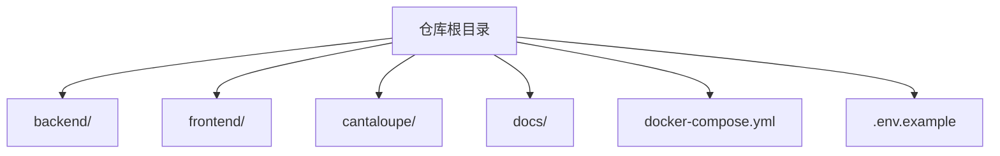
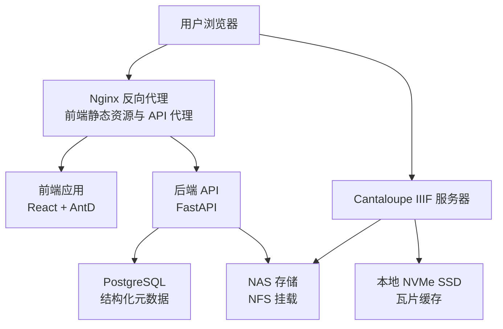
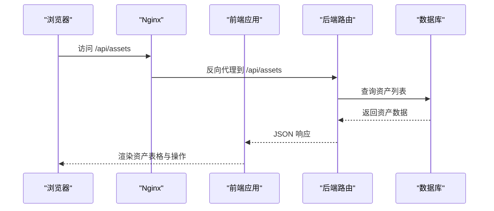
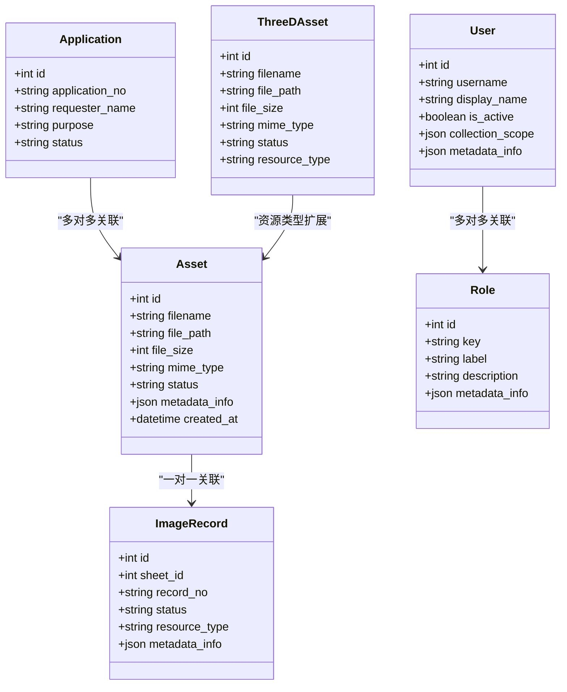
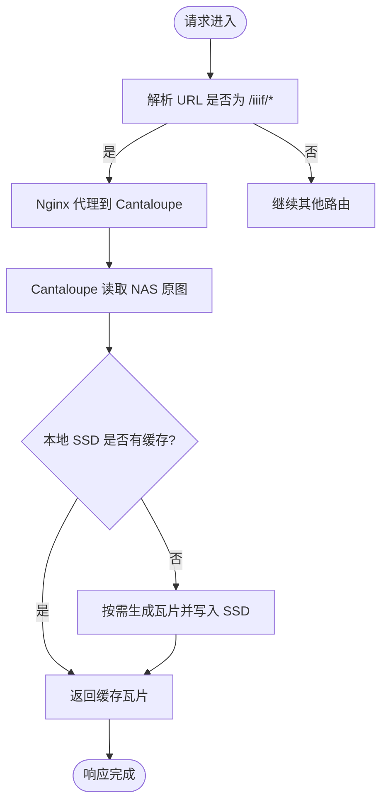
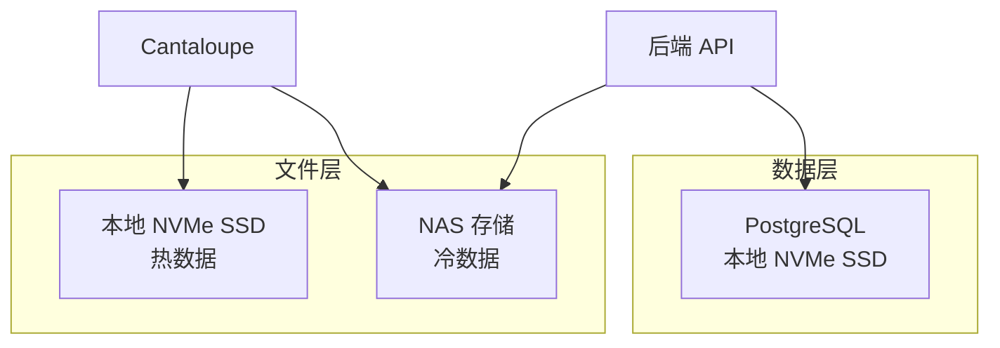
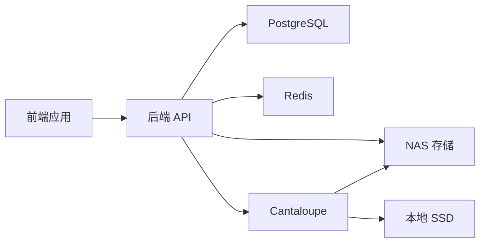

# 整体架构概览

<cite>
**本文引用的文件**
- [README.md](file://README.md)
- [SYSTEM_ARCHITECTURE.md](file://SYSTEM_ARCHITECTURE.md)
- [ARCHITECTURE.md](file://ARCHITECTURE.md)
- [docker-compose.yml](file://docker-compose.yml)
- [backend/Dockerfile](file://backend/Dockerfile)
- [frontend/Dockerfile](file://frontend/Dockerfile)
- [backend/app/main.py](file://backend/app/main.py)
- [backend/app/config.py](file://backend/app/config.py)
- [backend/app/models.py](file://backend/app/models.py)
- [frontend/src/App.tsx](file://frontend/src/App.tsx)
- [docs/01-总览/PROJECT_STATUS.md](file://docs/01-总览/PROJECT_STATUS.md)
- [docs/02-架构设计/SYSTEM_ARCHITECTURE.md](file://docs/02-架构设计/SYSTEM_ARCHITECTURE.md)
- [docs/03-产品与流程/IMAGE_DERIVATIVE_POLICY.md](file://docs/03-产品与流程/IMAGE_DERIVATIVE_POLICY.md)
</cite>

## 目录
1. [引言](#引言)
2. [项目结构](#项目结构)
3. [核心组件](#核心组件)
4. [架构总览](#架构总览)
5. [详细组件分析](#详细组件分析)
6. [依赖分析](#依赖分析)
7. [性能考量](#性能考量)
8. [故障排查指南](#故障排查指南)
9. [结论](#结论)
10. [附录](#附录)

## 引言
本文件为 MDAMS 原型项目的整体架构概览文档，聚焦系统在实验室环境（N100 服务器 + NAS 存储）下的微服务架构、前后端分离设计与容器化部署策略。系统围绕 IIIF 原生支持、混合存储架构与深度缩放预览等核心价值主张进行设计，同时覆盖二维影像、三维资源、统一平台目录、利用申请与权限体系等主业务链路。

## 项目结构
项目采用前后端分离与容器化编排的组织方式，核心目录与职责如下：
- backend：后端服务（FastAPI），包含路由、服务层、任务与数据库模型。
- frontend：前端应用（React + Ant Design），提供仪表盘、资源管理、Mirador 预览等界面。
- cantaloupe：Cantaloupe IIIF 图像服务器的构建与配置。
- docs：正式文档，涵盖架构、部署、流程与参考资料。
- docker-compose.yml：容器编排定义，统一管理后端、前端、数据库、Redis、Cantaloupe 与 NAS 挂载。
- 根目录部署与环境配置：.env 示例、部署脚本与说明文档。

**图表来源**
- [README.md:67-79](file://README.md#L67-L79)
- [docker-compose.yml:1-131](file://docker-compose.yml#L1-L131)

**章节来源**
- [README.md:67-79](file://README.md#L67-L79)
- [docker-compose.yml:1-131](file://docker-compose.yml#L1-L131)

## 核心组件
- 前端服务（Frontend）
  - 技术栈：React 18、Vite、TypeScript、Ant Design
  - 职责：提供仪表盘、资产列表、Mirador 预览、三维管理、统一平台目录、申请车与审批等界面；通过 Nginx 反向代理对外提供静态资源与 API 代理。
- 后端服务（Backend）
  - 技术栈：Python 3.12、FastAPI、SQLAlchemy
  - 职责：提供 REST API、IIIF Manifest 生成、流式上传、异步任务（Celery）、权限与认证、资产与元数据管理。
- 图像服务（Cantaloupe IIIF Server）
  - 职责：按需裁剪与缩放，生成瓦片并缓存至本地 SSD，面向浏览器提供 IIIF TileSource。
- 数据存储（Storage Layer）
  - 数据库：PostgreSQL（本地 NVMe SSD），存放结构化元数据。
  - 文件存储：热数据（缩略图、瓦片缓存）置于本地 SSD；冷数据（原始 TIFF/PSB 大图）置于 NAS（NFS）。
- 缓存与队列：Redis 用于任务队列与会话/令牌存储；Celery Worker 作为异步任务执行器。

**章节来源**
- [SYSTEM_ARCHITECTURE.md:38-68](file://SYSTEM_ARCHITECTURE.md#L38-L68)
- [ARCHITECTURE.md:13-32](file://ARCHITECTURE.md#L13-L32)
- [docker-compose.yml:2-127](file://docker-compose.yml#L2-L127)

## 架构总览
系统采用微服务架构与容器化编排，通过 Nginx 实现前端静态资源与后端 API 的统一入口，后端与数据库、NAS 存储与 Cantaloupe 之间形成清晰的数据与控制流。

**图表来源**
- [SYSTEM_ARCHITECTURE.md:22-34](file://SYSTEM_ARCHITECTURE.md#L22-L34)
- [ARCHITECTURE.md:7-50](file://ARCHITECTURE.md#L7-L50)
- [docker-compose.yml:105-127](file://docker-compose.yml#L105-L127)

**章节来源**
- [SYSTEM_ARCHITECTURE.md:20-34](file://SYSTEM_ARCHITECTURE.md#L20-L34)
- [ARCHITECTURE.md:7-50](file://ARCHITECTURE.md#L7-L50)

## 详细组件分析

### 前端应用（React SPA）
- 角色与权限驱动的菜单与可见性控制，支持登录态持久化与自动上下文加载。
- 主要页面与功能：
  - 仪表盘：统计与状态概览。
  - 二维资源：资产列表、缩略图、状态与操作（详情、预览、下载、删除）。
  - 申请车与申请管理：资源选择、提交、审批与导出交付包。
  - 统一平台目录与详情：跨来源聚合资源的浏览与详情。
  - 三维管理：三维对象与版本管理、Web 预览摘要。
- 与后端交互：
  - 通过 /api/* 路由调用后端 REST 接口。
  - 通过 /iiif/* 路由转发至 Cantaloupe 获取 IIIF 瓦片。

**图表来源**
- [frontend/src/App.tsx:213-231](file://frontend/src/App.tsx#L213-L231)
- [backend/app/main.py:75-86](file://backend/app/main.py#L75-L86)

**章节来源**
- [frontend/src/App.tsx:100-205](file://frontend/src/App.tsx#L100-L205)
- [frontend/src/App.tsx:419-524](file://frontend/src/App.tsx#L419-L524)

### 后端服务（FastAPI）
- 应用入口与中间件：CORS、健康检查、路由注册。
- 主要路由分区：auth、assets、applications、downloads、health、iiif、ingest、image-records、platform、three-d、ai。
- 数据模型：围绕 Asset、User、Role、ImageRecord、Application、ThreeD 等实体，支持二维与三维资源、图像记录、申请与审批、权限与会话等业务域。
- 配置加载：支持 .env 加载与多环境变量注入（数据库、Redis、上传目录、公共 URL、人脸识别等）。

**图表来源**
- [backend/app/models.py:6-26](file://backend/app/models.py#L6-L26)
- [backend/app/models.py:28-111](file://backend/app/models.py#L28-L111)
- [backend/app/models.py:144-173](file://backend/app/models.py#L144-L173)
- [backend/app/models.py:176-213](file://backend/app/models.py#L176-L213)
- [backend/app/models.py:215-254](file://backend/app/models.py#L215-L254)

**章节来源**
- [backend/app/main.py:1-86](file://backend/app/main.py#L1-L86)
- [backend/app/models.py:1-307](file://backend/app/models.py#L1-L307)
- [backend/app/config.py:1-72](file://backend/app/config.py#L1-L72)

### 图像服务（Cantaloupe IIIF Server）
- 通过 NFS 直接读取 NAS 上的原始图像文件，按需裁剪与缩放，生成瓦片并缓存至本地 SSD。
- 针对 N100 内存限制进行优化：禁用堆内存缓存，强制使用 Java2dProcessor，设置合适的 JVM 参数与 UTF-8 支持。
- 前端通过 Nginx 代理访问 Cantaloupe，避免直接暴露端口与跨域问题。

**图表来源**
- [docker-compose.yml:105-127](file://docker-compose.yml#L105-L127)
- [SYSTEM_ARCHITECTURE.md:55-60](file://SYSTEM_ARCHITECTURE.md#L55-L60)

**章节来源**
- [docker-compose.yml:105-127](file://docker-compose.yml#L105-L127)
- [SYSTEM_ARCHITECTURE.md:55-60](file://SYSTEM_ARCHITECTURE.md#L55-L60)

### 数据存储与缓存
- PostgreSQL（本地 SSD）：存放结构化元数据与关系型数据，满足查询与事务需求。
- 文件系统（NAS + 本地 SSD）：热数据（缩略图、瓦片缓存）与冷数据（原始大图）分层存储，兼顾性能与成本。
- Redis：任务队列与会话/令牌存储，配合 Celery Worker 执行异步任务。

**图表来源**
- [ARCHITECTURE.md:24-32](file://ARCHITECTURE.md#L24-L32)
- [SYSTEM_ARCHITECTURE.md:62-68](file://SYSTEM_ARCHITECTURE.md#L62-L68)

**章节来源**
- [ARCHITECTURE.md:24-32](file://ARCHITECTURE.md#L24-L32)
- [SYSTEM_ARCHITECTURE.md:62-68](file://SYSTEM_ARCHITECTURE.md#L62-L68)

## 依赖分析
- 组件耦合与内聚
  - 前端与后端通过 REST API 解耦，Nginx 作为统一入口，降低跨域与端口暴露风险。
  - 后端与数据库、NAS、Redis、Cantaloupe 通过明确的环境变量与挂载点解耦，便于在不同环境中迁移。
- 外部依赖与集成点
  - IIIF 标准：后端动态生成 Manifest，前端通过 Mirador 解析并请求瓦片。
  - 人脸识别（可选）：通过环境变量启用，支持本地或外部提供者。
- 潜在循环依赖
  - 未发现直接循环依赖；路由与服务层职责清晰，模型定义集中于 models.py。

**图表来源**
- [docker-compose.yml:2-127](file://docker-compose.yml#L2-L127)
- [backend/app/config.py:42-46](file://backend/app/config.py#L42-L46)

**章节来源**
- [docker-compose.yml:2-127](file://docker-compose.yml#L2-L127)
- [backend/app/config.py:42-72](file://backend/app/config.py#L42-L72)

## 性能考量
- 针对 N100（16GB 内存）的优化
  - 前端构建：提升 Node 构建内存上限，缓解 OOM 风险。
  - 后端镜像：使用国内镜像源加速安装，放宽 ImageMagick 安全策略以支持超大图像。
  - Cantaloupe：禁用堆内存缓存，仅使用文件系统缓存，设置 JVM 参数与 UTF-8 支持。
- 存储分层
  - 热数据（缩略图、瓦片缓存）走本地 SSD，冷数据（原始 TIFF/PSB）走 NAS，平衡性能与成本。
- 上传与处理
  - 后端采用 64KB 分块流式写入，避免大文件上传时的内存峰值。

**章节来源**
- [frontend/Dockerfile:14-18](file://frontend/Dockerfile#L14-L18)
- [backend/Dockerfile:18-41](file://backend/Dockerfile#L18-L41)
- [SYSTEM_ARCHITECTURE.md:44-60](file://SYSTEM_ARCHITECTURE.md#L44-L60)
- [SYSTEM_ARCHITECTURE.md:73-78](file://SYSTEM_ARCHITECTURE.md#L73-L78)

## 故障排查指南
- 健康检查与就绪检查
  - 后端提供 /health 与 /ready 接口，便于容器编排与运维监控。
- 日志与会话
  - 前端登录态通过 Authorization 头传递，令牌持久化于 localStorage；登出时清理上下文与令牌。
- 配置与环境变量
  - 确认 .env 中 HOST_MUSEUM_PATH、DATABASE_URL、REDIS_URL、API_PUBLIC_URL、CANTALOUPE_PUBLIC_URL 等变量与宿主机环境一致。
- 上传与预览
  - 若上传后状态长时间为 processing，检查 NAS 挂载与后端写入权限；若预览卡顿，检查本地 SSD 缓存与 Cantaloupe 日志。

**章节来源**
- [README.md:111-117](file://README.md#L111-L117)
- [frontend/src/App.tsx:140-181](file://frontend/src/App.tsx#L140-L181)
- [backend/app/config.py:42-46](file://backend/app/config.py#L42-L46)

## 结论
MDAMS 原型项目以微服务与容器化为核心，结合 IIIF 原生支持与混合存储架构，在 N100 实验室环境下实现了高分辨率图像的高效管理与深度缩放预览。系统通过前后端分离与清晰的组件边界，覆盖二维与三维资源、统一平台、利用申请与权限体系等主业务链路，为后续平台化与标准化奠定了坚实基础。

## 附录
- 业务目标与技术目标
  - 业务目标：支撑馆内数字资源的稳定入库、高效检索、合规利用与演示验证。
  - 技术目标：验证混合存储与 IIIF 能力、完善统一平台与跨来源聚合、补齐长期保存与治理能力。
- 关键特性
  - IIIF 原生支持：遵循 Presentation API 3.0，支持跨机构互操作。
  - 混合存储架构：热/冷数据分层，兼顾性能与成本。
  - 深度缩放预览：集成 Mirador，支持 GB 级超大图像流畅缩放与平移。
- 实施要点
  - 明确硬件与网络要求（N100 + NAS），确保 NFS 挂载稳定。
  - 严格管理环境变量与容器编排，保障服务间连通性。
  - 持续完善测试与文档，收敛正式文档入口，消除历史重复文档。

**章节来源**
- [docs/01-总览/PROJECT_STATUS.md:117-136](file://docs/01-总览/PROJECT_STATUS.md#L117-L136)
- [docs/02-架构设计/SYSTEM_ARCHITECTURE.md:9-13](file://docs/02-架构设计/SYSTEM_ARCHITECTURE.md#L9-L13)
- [docs/03-产品与流程/IMAGE_DERIVATIVE_POLICY.md:1-26](file://docs/03-产品与流程/IMAGE_DERIVATIVE_POLICY.md#L1-L26)