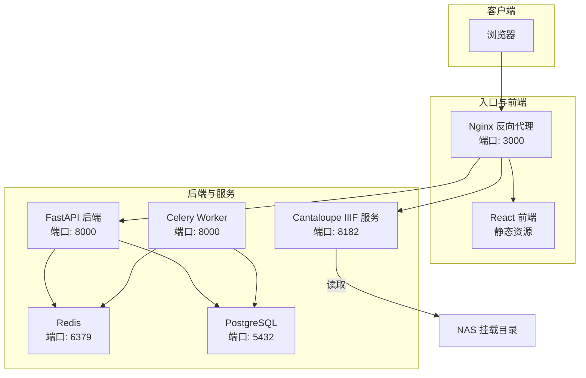
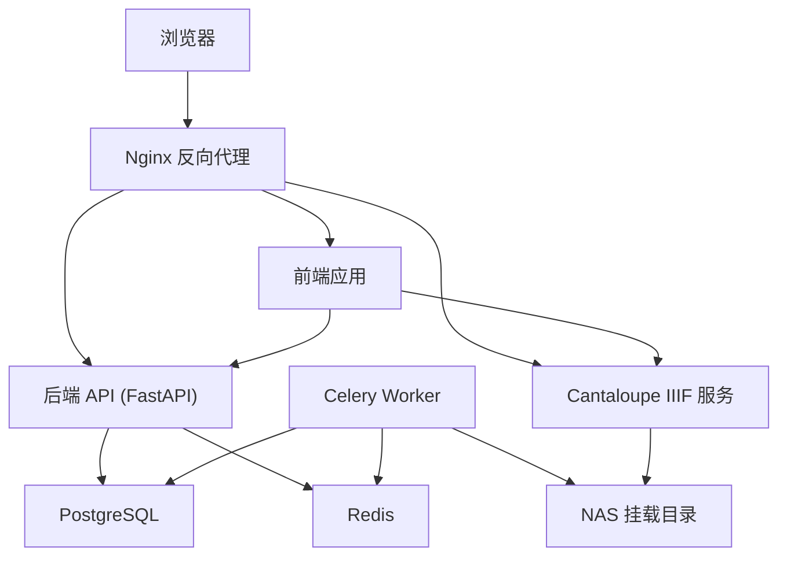
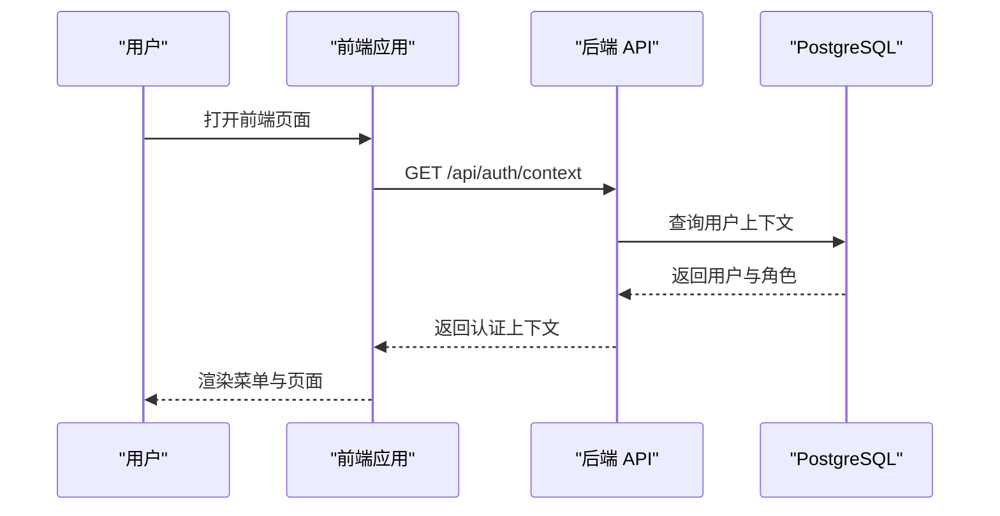
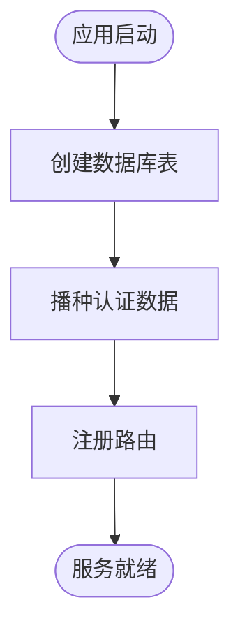
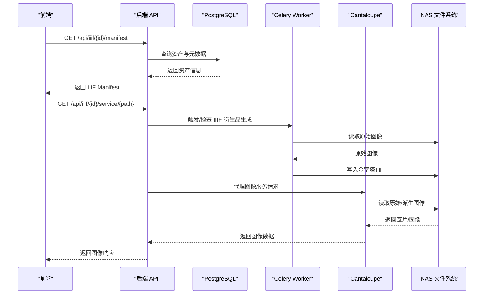
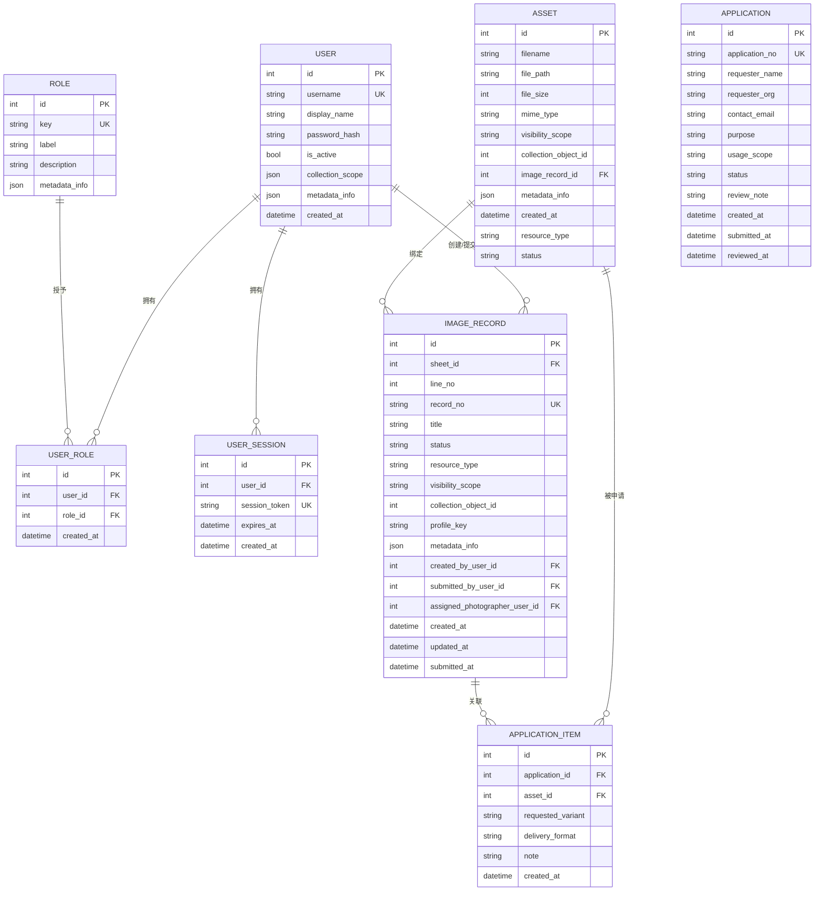
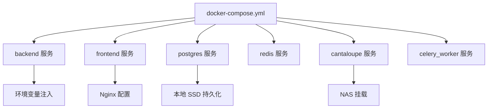
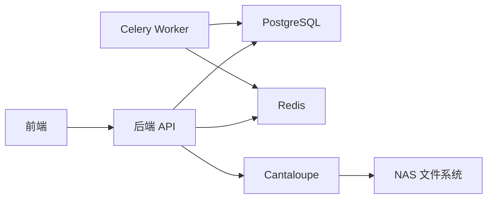

# 系统架构设计

<cite>
**本文引用的文件**
- [SYSTEM_ARCHITECTURE.md](file://SYSTEM_ARCHITECTURE.md)
- [ARCHITECTURE.md](file://ARCHITECTURE.md)
- [README.md](file://README.md)
- [docker-compose.yml](file://docker-compose.yml)
- [backend/app/main.py](file://backend/app/main.py)
- [backend/app/config.py](file://backend/app/config.py)
- [backend/app/routers/iiif.py](file://backend/app/routers/iiif.py)
- [backend/app/models.py](file://backend/app/models.py)
- [backend/app/tasks.py](file://backend/app/tasks.py)
- [backend/app/celery_app.py](file://backend/app/celery_app.py)
- [backend/Dockerfile](file://backend/Dockerfile)
- [frontend/src/main.tsx](file://frontend/src/main.tsx)
- [frontend/Dockerfile](file://frontend/Dockerfile)
- [cantaloupe/Dockerfile](file://cantaloupe/Dockerfile)
</cite>

## 目录
1. [引言](#引言)
2. [项目结构](#项目结构)
3. [核心组件](#核心组件)
4. [架构总览](#架构总览)
5. [详细组件分析](#详细组件分析)
6. [依赖分析](#依赖分析)
7. [性能考虑](#性能考虑)
8. [故障排查指南](#故障排查指南)
9. [结论](#结论)
10. [附录](#附录)

## 引言
本文件面向MDAMS原型项目的系统架构设计，目标是帮助开发者与运维人员快速理解整体技术架构、数据流与部署方式。系统采用前后端分离、微服务化与容器化部署，结合FastAPI后端、React前端、PostgreSQL数据库、Redis缓存、Cantaloupe IIIF图像服务与Celery异步任务，形成可演示、可扩展的数字资产管理原型。

## 项目结构
项目采用分层与子系统并行的组织方式：
- 前端：React + Vite + TypeScript + Ant Design，构建后由Nginx提供静态资源服务
- 后端：FastAPI + SQLAlchemy，提供REST API、IIIF清单生成、权限与业务逻辑
- 数据层：PostgreSQL（容器内持久化至本地SSD）
- 缓存层：Redis（Celery任务队列与结果存储）
- 图像服务层：Cantaloupe IIIF服务，直接从NAS挂载目录读取原始图像
- 异步任务：Celery + Redis，负责生成IIIF金字塔、人脸识别等后台处理
- 配置与编排：Docker Compose统一编排，环境变量集中管理

**图表来源**
- [docker-compose.yml:1-131](file://docker-compose.yml#L1-L131)
- [frontend/Dockerfile:1-28](file://frontend/Dockerfile#L1-L28)
- [backend/Dockerfile:1-52](file://backend/Dockerfile#L1-L52)
- [cantaloupe/Dockerfile:1-43](file://cantaloupe/Dockerfile#L1-L43)

**章节来源**
- [README.md:67-79](file://README.md#L67-L79)
- [docker-compose.yml:1-131](file://docker-compose.yml#L1-L131)

## 核心组件
- 前端服务（React SPA）
  - 技术栈：React 18 + Vite + TypeScript + Ant Design
  - 通过Nginx提供静态资源，统一代理后端API与IIIF图像服务
- 后端服务（FastAPI）
  - 路由模块覆盖认证、资产、申请、下载、健康检查、IIIF、采集、图像记录、平台、三维、AI等
  - 使用SQLAlchemy进行数据库访问，内置CORS中间件
- 数据库（PostgreSQL）
  - 容器内数据持久化至本地SSD，限制内存资源，保障查询性能
- 缓存与消息（Redis）
  - 作为Celery的Broker与Backend，承载异步任务队列
- 图像服务（Cantaloupe IIIF）
  - 直接从NAS挂载目录读取原始图像，按需生成瓦片并缓存至本地
- 异步任务（Celery）
  - 生成IIIF金字塔、人脸识别等离线处理，降低请求延迟

**章节来源**
- [README.md:56-66](file://README.md#L56-L66)
- [backend/app/main.py:1-86](file://backend/app/main.py#L1-L86)
- [backend/app/routers/iiif.py:1-303](file://backend/app/routers/iiif.py#L1-L303)
- [backend/app/tasks.py:1-262](file://backend/app/tasks.py#L1-L262)
- [docker-compose.yml:1-131](file://docker-compose.yml#L1-L131)

## 架构总览
系统采用容器化微服务架构，通过Nginx统一入口，前端与后端解耦，图像服务独立部署。数据与文件存储分离，数据库与缓存分别承担结构化数据与异步任务承载。

**图表来源**
- [ARCHITECTURE.md:7-50](file://ARCHITECTURE.md#L7-L50)
- [SYSTEM_ARCHITECTURE.md:22-34](file://SYSTEM_ARCHITECTURE.md#L22-L34)
- [docker-compose.yml:1-131](file://docker-compose.yml#L1-L131)

## 详细组件分析

### 前端组件（React SPA）
- 启动入口：根节点渲染React应用，使用Ant Design组件体系
- 路由与页面：包含仪表盘、资产列表、Mirador查看器、申请车、统一资源目录与详情、三维管理等
- 认证与权限：基于JWT令牌，菜单与功能根据角色动态裁剪
- 与后端交互：通过Axios调用后端REST API与IIIF服务

**图表来源**
- [frontend/src/main.tsx:1-11](file://frontend/src/main.tsx#L1-L11)
- [backend/app/main.py:1-86](file://backend/app/main.py#L1-L86)

**章节来源**
- [frontend/src/main.tsx:1-11](file://frontend/src/main.tsx#L1-L11)
- [README.md:170-186](file://README.md#L170-L186)

### 后端组件（FastAPI）
- 应用初始化：注册健康检查、认证、资产、申请、下载、IIIF、采集、图像记录、平台、三维、AI等路由
- 数据库：创建表结构，初始化权限数据
- 配置：通过环境变量加载数据库、Redis、上传目录、公开URL等参数

**图表来源**
- [backend/app/main.py:21-63](file://backend/app/main.py#L21-L63)

**章节来源**
- [backend/app/main.py:1-86](file://backend/app/main.py#L1-L86)
- [backend/app/config.py:1-72](file://backend/app/config.py#L1-L72)

### IIIF服务与图像流水线
- IIIF清单生成：后端根据资产元数据动态生成符合Presentation API 3.0的Manifest
- 图像服务代理：后端代理Cantaloupe的图像服务，必要时重写info.json中的@id字段
- 图像访问衍生品：Celery任务生成金字塔TIF作为IIIF访问副本，提升大图缩放性能

**图表来源**
- [backend/app/routers/iiif.py:138-303](file://backend/app/routers/iiif.py#L138-L303)
- [backend/app/tasks.py:151-182](file://backend/app/tasks.py#L151-L182)
- [backend/app/celery_app.py:1-19](file://backend/app/celery_app.py#L1-L19)

**章节来源**
- [backend/app/routers/iiif.py:1-303](file://backend/app/routers/iiif.py#L1-L303)
- [backend/app/tasks.py:1-262](file://backend/app/tasks.py#L1-L262)

### 数据模型与关系
系统围绕资产（Asset）为核心实体，配合用户、角色、会话、图像记录、申请、三维资产等模型，形成完整的数字资产管理数据结构。

**图表来源**
- [backend/app/models.py:6-307](file://backend/app/models.py#L6-L307)

**章节来源**
- [backend/app/models.py:1-307](file://backend/app/models.py#L1-L307)

### 部署与编排
- Docker Compose统一编排：后端、前端、数据库、Redis、Cantaloupe、Celery Worker
- 环境变量：数据库连接、Redis连接、上传目录、公开URL、图像识别开关与参数等
- 端口映射：前端3000、后端8000、数据库5432、Cantaloupe 8182、Redis 6379
- 存储：PostgreSQL数据目录映射至本地SSD；NAS挂载至后端与Cantaloupe容器

**图表来源**
- [docker-compose.yml:1-131](file://docker-compose.yml#L1-L131)

**章节来源**
- [docker-compose.yml:1-131](file://docker-compose.yml#L1-L131)
- [backend/Dockerfile:1-52](file://backend/Dockerfile#L1-L52)
- [frontend/Dockerfile:1-28](file://frontend/Dockerfile#L1-L28)
- [cantaloupe/Dockerfile:1-43](file://cantaloupe/Dockerfile#L1-L43)

## 依赖分析
- 组件耦合
  - 前端仅依赖后端REST API与Cantaloupe IIIF服务，耦合度低
  - 后端依赖数据库与Redis，IIIF服务依赖NAS文件系统
  - Celery Worker与后端共享数据库与Redis，执行离线任务
- 外部依赖
  - Python生态：FastAPI、SQLAlchemy、Celery、Pydantic
  - 前端生态：React、Ant Design、Axios
  - 图像处理：libvips、ImageMagick、ExifTool（容器内安装）

**图表来源**
- [backend/app/main.py:1-86](file://backend/app/main.py#L1-L86)
- [backend/app/celery_app.py:1-19](file://backend/app/celery_app.py#L1-L19)
- [docker-compose.yml:1-131](file://docker-compose.yml#L1-L131)

**章节来源**
- [backend/app/main.py:1-86](file://backend/app/main.py#L1-L86)
- [backend/app/celery_app.py:1-19](file://backend/app/celery_app.py#L1-L19)

## 性能考虑
- 前端构建优化：Node构建内存上限调整，镜像源替换，减少N100内存压力
- 后端图像处理：ImageMagick策略放宽，libvips与pyvips配置优化，适配大图处理
- 数据库性能：PostgreSQL映射至本地SSD，限制容器内存，提升查询性能
- IIIF性能：Celery生成金字塔TIF作为访问副本，Cantaloupe禁用堆缓存，使用文件系统缓存
- 缓存策略：Redis作为任务队列与结果存储，避免后端直连瓶颈

**章节来源**
- [frontend/Dockerfile:1-28](file://frontend/Dockerfile#L1-L28)
- [backend/Dockerfile:1-52](file://backend/Dockerfile#L1-L52)
- [docker-compose.yml:84-102](file://docker-compose.yml#L84-L102)
- [SYSTEM_ARCHITECTURE.md:55-61](file://SYSTEM_ARCHITECTURE.md#L55-L61)

## 故障排查指南
- 健康检查与就绪检查：后端提供健康与就绪端点，便于容器编排与探活
- 日志与错误处理：后端路由中对不存在资产、权限不足等情况返回明确错误码
- IIIF访问衍生品：当衍生品未就绪时，后端返回冲突状态，提示需要等待或触发生成任务
- 人脸识别：当功能关闭或客户端异常时，记录失败状态并更新元数据

**章节来源**
- [backend/app/main.py:12-13](file://backend/app/main.py#L12-L13)
- [backend/app/routers/iiif.py:138-136](file://backend/app/routers/iiif.py#L138-L136)
- [backend/app/tasks.py:190-262](file://backend/app/tasks.py#L190-L262)

## 结论
MDAMS原型采用清晰的前后端分离、微服务化与容器化架构，结合IIIF标准化图像服务与Celery异步任务，实现了在低功耗硬件上的高分辨率图像管理与浏览能力。通过合理的数据流设计与缓存策略，系统具备良好的可扩展性与可维护性，适合在实验室与演示环境中稳定运行与持续迭代。

## 附录
- 快速开始与端口说明：前端3000、后端8000、数据库5432、Cantaloupe 8182、Redis 6379
- 环境变量要点：数据库URL、Redis URL、上传目录、API与Cantaloupe公开URL、图像识别相关参数
- 文档入口：docs/README.md为正式文档入口，建议优先阅读

**章节来源**
- [README.md:81-118](file://README.md#L81-L118)
- [backend/app/config.py:42-72](file://backend/app/config.py#L42-L72)