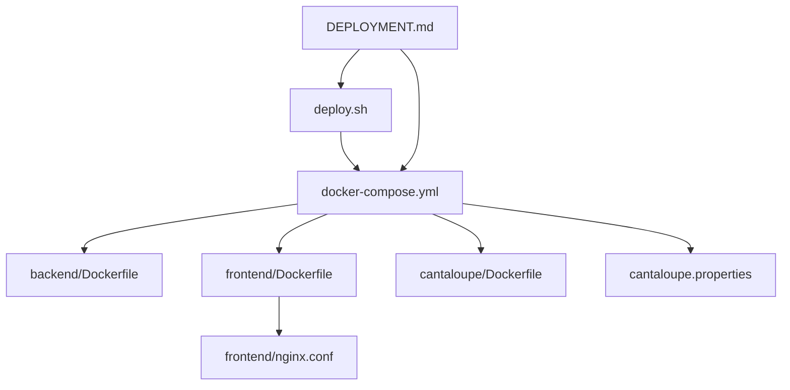
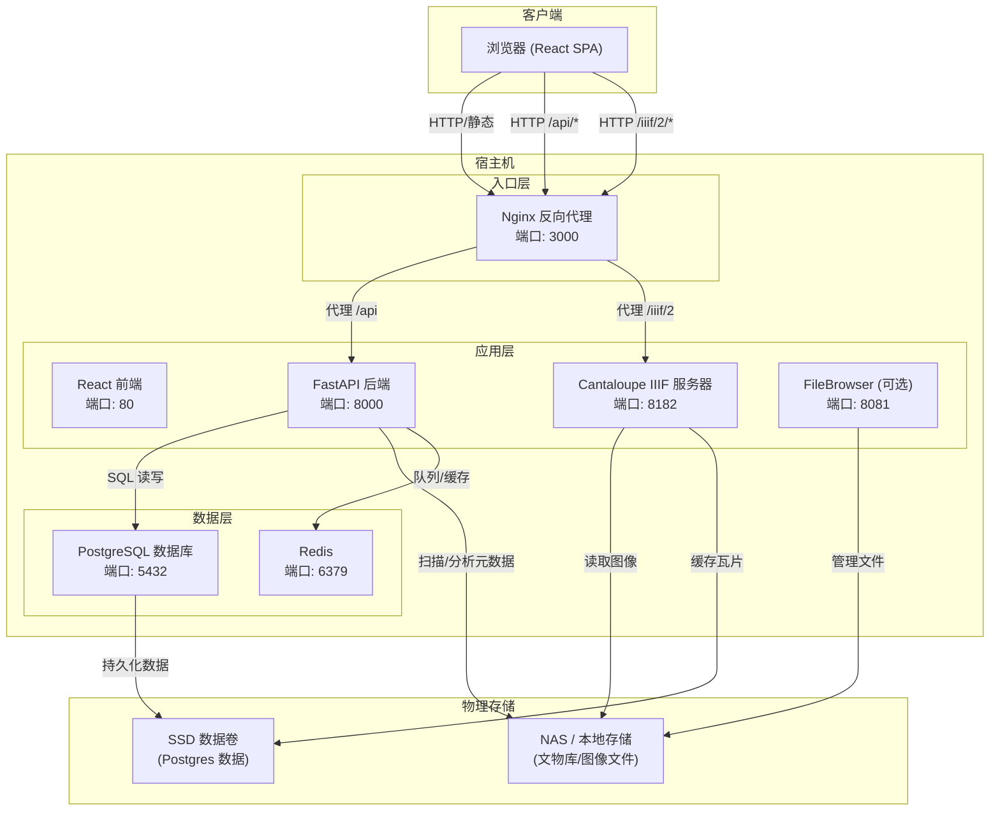
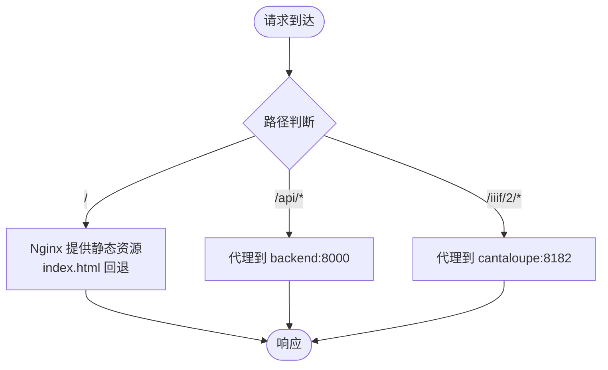
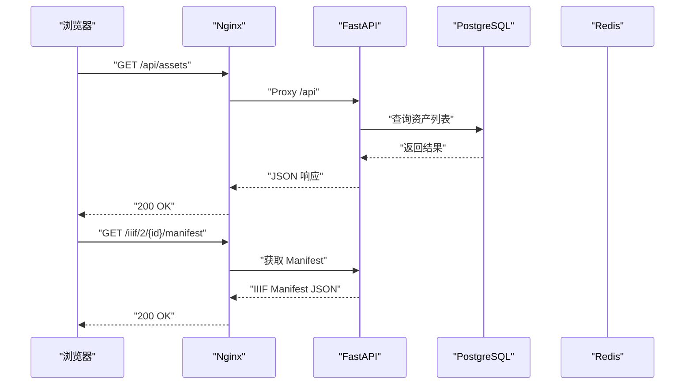
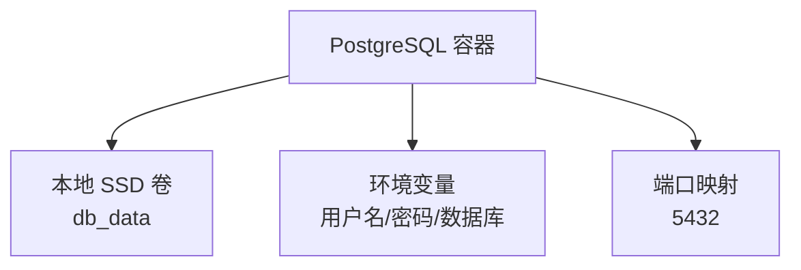
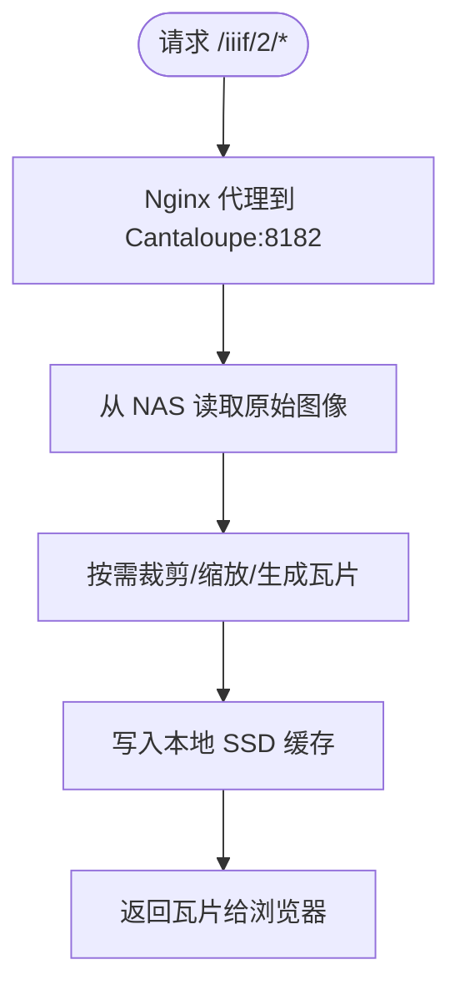
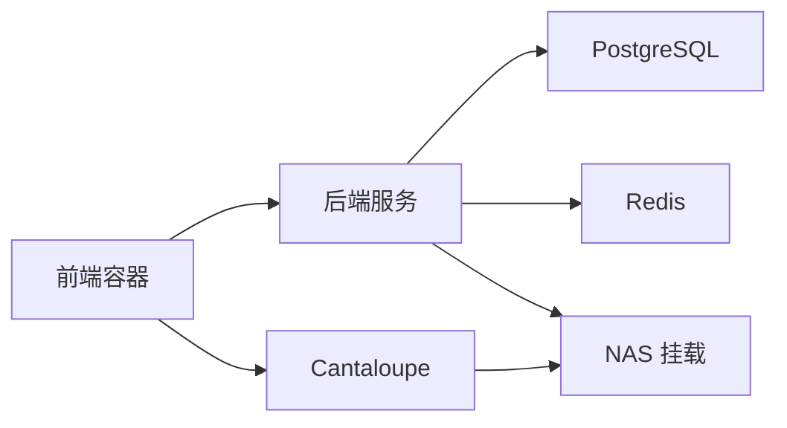

# 部署架构

<cite>
**本文引用的文件**
- [docker-compose.yml](file://docker-compose.yml)
- [docker-compose.local-postgres.yml](file://docker-compose.local-postgres.yml)
- [DEPLOYMENT.md](file://DEPLOYMENT.md)
- [SYSTEM_ARCHITECTURE.md](file://SYSTEM_ARCHITECTURE.md)
- [ARCHITECTURE.md](file://ARCHITECTURE.md)
- [backend/Dockerfile](file://backend/Dockerfile)
- [frontend/Dockerfile](file://frontend/Dockerfile)
- [cantaloupe/Dockerfile](file://cantaloupe/Dockerfile)
- [frontend/nginx.conf](file://frontend/nginx.conf)
- [cantaloupe.properties](file://cantaloupe.properties)
- [deploy.sh](file://deploy.sh)
- [ENVIRONMENT_VARIABLES.md](file://docs/05-部署与运维/ENVIRONMENT_VARIABLES.md)
- [backend/app/config.py](file://backend/app/config.py)
- [backend/requirements.txt](file://backend/requirements.txt)
- [frontend/package.json](file://frontend/package.json)
</cite>

## 目录
1. [简介](#简介)
2. [项目结构](#项目结构)
3. [核心组件](#核心组件)
4. [架构总览](#架构总览)
5. [详细组件分析](#详细组件分析)
6. [依赖分析](#依赖分析)
7. [性能考虑](#性能考虑)
8. [故障排查指南](#故障排查指南)
9. [结论](#结论)
10. [附录](#附录)

## 简介
本文件面向运维与平台工程团队，系统化阐述 MDAMS 原型项目的容器化部署架构与实施细节。重点覆盖：
- Docker Compose 编排与服务间通信
- 前端反向代理、React 前端、FastAPI 后端、PostgreSQL、Cantaloupe 图像服务器、文件存储服务的角色与职责
- 硬件与网络要求（Ubuntu 24.04、Intel N100、16GB RAM）
- 端口映射与存储架构（本地 SSD + QNAP NAS）
- 部署拓扑图与容器关系图，帮助快速理解与落地

## 项目结构
围绕部署与运维的关键文件组织如下：
- 编排与镜像构建：docker-compose.yml、各服务 Dockerfile
- 反向代理与前端静态资源：frontend/nginx.conf
- 图像服务器配置：cantaloupe.properties
- 部署脚本与操作指南：deploy.sh、DEPLOYMENT.md
- 环境变量与端口映射：ENVIRONMENT_VARIABLES.md、backend/app/config.py
- 本地数据库样例编排：docker-compose.local-postgres.yml

图表来源
- [docker-compose.yml:1-131](file://docker-compose.yml#L1-L131)
- [backend/Dockerfile:1-52](file://backend/Dockerfile#L1-L52)
- [frontend/Dockerfile:1-28](file://frontend/Dockerfile#L1-L28)
- [cantaloupe/Dockerfile:1-43](file://cantaloupe/Dockerfile#L1-L43)
- [frontend/nginx.conf:1-33](file://frontend/nginx.conf#L1-L33)
- [cantaloupe.properties:1-162](file://cantaloupe.properties#L1-L162)
- [deploy.sh:1-38](file://deploy.sh#L1-L38)
- [DEPLOYMENT.md:1-90](file://DEPLOYMENT.md#L1-L90)

章节来源
- [docker-compose.yml:1-131](file://docker-compose.yml#L1-L131)
- [DEPLOYMENT.md:1-90](file://DEPLOYMENT.md#L1-L90)

## 核心组件
- 前端反向代理（Nginx）
  - 作用：统一入口、静态资源分发、API 与 IIIF 请求转发
  - 端口：对外暴露 3000，内部监听 80
  - 代理规则：/api → backend:8000；/iiif/2 → cantaloupe:8182
- React 前端应用
  - 构建产物由 Nginx 提供静态服务
  - 通过 /api 与后端交互，通过 /iiif/2 与图像服务器交互
- FastAPI 后端服务
  - 提供 REST API、IIIF Manifest 生成、流式上传、元数据处理
  - 依赖 PostgreSQL 与 Redis，挂载 NAS 作为原始文件存储
- PostgreSQL 数据库
  - 本地 NVMe SSD 存储数据目录，资源限制 2GB 内存
- Cantaloupe 图像服务器
  - IIIF 2.x 服务，直接从 NAS 读取原始大图，缓存至本地 SSD
  - 通过 Nginx 代理暴露，避免直接暴露 8182 端口
- Redis
  - 任务队列与缓存，端口 6379
- 文件存储服务
  - NAS（QNAP）通过 NFS v4 挂载至宿主机，容器内映射到后端与图像服务器

章节来源
- [docker-compose.yml:1-131](file://docker-compose.yml#L1-L131)
- [frontend/nginx.conf:1-33](file://frontend/nginx.conf#L1-L33)
- [cantaloupe.properties:1-162](file://cantaloupe.properties#L1-L162)
- [backend/Dockerfile:1-52](file://backend/Dockerfile#L1-L52)
- [frontend/Dockerfile:1-28](file://frontend/Dockerfile#L1-L28)
- [cantaloupe/Dockerfile:1-43](file://cantaloupe/Dockerfile#L1-L43)

## 架构总览
下图展示系统容器、网络与存储交互关系，以及数据流向。

图表来源
- [ARCHITECTURE.md:7-50](file://ARCHITECTURE.md#L7-L50)
- [SYSTEM_ARCHITECTURE.md:22-34](file://SYSTEM_ARCHITECTURE.md#L22-L34)
- [docker-compose.yml:1-131](file://docker-compose.yml#L1-L131)
- [frontend/nginx.conf:1-33](file://frontend/nginx.conf#L1-L33)

## 详细组件分析

### 前端反向代理与静态资源
- Nginx 配置要点
  - 监听 80，提供静态页面与单页应用路由回退
  - 将 /api 前缀转发至 backend:8000
  - 将 /iiif/2 前缀转发至 cantaloupe:8182，避免直接暴露 8182
  - 设置标准代理头，保留真实客户端信息
- 前端容器
  - 基于 nginx:alpine，构建阶段使用 Node 18，内存上限通过 NODE_OPTIONS 控制
  - 构建产物复制到 /usr/share/nginx/html，由 Nginx 提供服务

图表来源
- [frontend/nginx.conf:1-33](file://frontend/nginx.conf#L1-L33)
- [frontend/Dockerfile:1-28](file://frontend/Dockerfile#L1-L28)

章节来源
- [frontend/nginx.conf:1-33](file://frontend/nginx.conf#L1-L33)
- [frontend/Dockerfile:1-28](file://frontend/Dockerfile#L1-L28)

### FastAPI 后端服务
- 容器构建
  - 基于 python:3.12-slim，安装 libvips 及相关工具，放宽 ImageMagick 资源限制以支持超大图像
  - 使用清华镜像源加速 APT 与 pip 安装
- 运行参数
  - 通过 uvicorn 在 0.0.0.0:8000 启动
  - 读取环境变量进行数据库、Redis、上传目录、人脸识别、CORS 等配置
- 依赖
  - PostgreSQL、Redis、NAS 挂载目录
  - Celery 工作进程通过同一镜像启动，共享环境变量

图表来源
- [frontend/nginx.conf:10-19](file://frontend/nginx.conf#L10-L19)
- [backend/Dockerfile:1-52](file://backend/Dockerfile#L1-L52)
- [docker-compose.yml:2-30](file://docker-compose.yml#L2-L30)

章节来源
- [backend/Dockerfile:1-52](file://backend/Dockerfile#L1-L52)
- [docker-compose.yml:2-30](file://docker-compose.yml#L2-L30)
- [backend/app/config.py:42-46](file://backend/app/config.py#L42-L46)

### PostgreSQL 数据库
- 镜像：postgres:16-alpine
- 端口：5432（通过环境变量映射）
- 存储：本地 NVMe SSD（db_data），限制内存 2GB
- 本地样例编排：使用 Bitnami 镜像，便于快速验证

图表来源
- [docker-compose.yml:84-102](file://docker-compose.yml#L84-L102)
- [docker-compose.local-postgres.yml:1-19](file://docker-compose.local-postgres.yml#L1-L19)

章节来源
- [docker-compose.yml:84-102](file://docker-compose.yml#L84-L102)
- [docker-compose.local-postgres.yml:1-19](file://docker-compose.local-postgres.yml#L1-L19)

### Cantaloupe 图像服务器
- 容器构建
  - 基于 Eclipse Temurin 11 JRE，安装 GraphicsMagick/FFmpeg，构建时下载官方发布包
  - 暴露 8182 端口，启动命令指定配置文件路径
- 配置要点
  - 基本 URI、UTF-8 编码、FilesystemSource 路径映射
  - 缓存策略：启用文件系统缓存，内存缓存按需开启
  - CORS 开启，允许跨域访问，便于前端查看器调用
  - 流式检索策略，避免将整图加载到堆内存
- 与前端/NAS/SSD 的关系
  - 通过 Nginx 代理对外提供 /iiif/2 接口
  - 直接从 NAS 读取原始图像，生成的瓦片缓存到本地 SSD

图表来源
- [frontend/nginx.conf:21-31](file://frontend/nginx.conf#L21-L31)
- [cantaloupe/Dockerfile:1-43](file://cantaloupe/Dockerfile#L1-L43)
- [cantaloupe.properties:1-162](file://cantaloupe.properties#L1-L162)

章节来源
- [cantaloupe/Dockerfile:1-43](file://cantaloupe/Dockerfile#L1-L43)
- [cantaloupe.properties:1-162](file://cantaloupe.properties#L1-L162)
- [docker-compose.yml:105-127](file://docker-compose.yml#L105-L127)

### Redis 与任务队列
- 镜像：redis:7-alpine
- 端口：6379（通过环境变量映射）
- 用途：Celery 任务队列、缓存
- 后端与 Celery Worker 共享同一镜像与环境变量，依赖相同 Redis

章节来源
- [docker-compose.yml:65-71](file://docker-compose.yml#L65-L71)
- [docker-compose.yml:37-63](file://docker-compose.yml#L37-L63)

### 文件存储与挂载
- NAS（QNAP）通过 NFS v4 挂载到宿主机路径（示例：/sunjing/project）
- 容器内映射：
  - 后端：/app/uploads → NAS 原始文件目录
  - Cantaloupe：/var/lib/cantaloupe/images → NAS 图像目录
- 本地 SSD 仅存放数据库数据目录（db_data）

章节来源
- [docker-compose.yml:30-32](file://docker-compose.yml#L30-L32)
- [docker-compose.yml:114-116](file://docker-compose.yml#L114-L116)
- [DEPLOYMENT.md:12-16](file://DEPLOYMENT.md#L12-L16)

## 依赖分析
- 服务耦合与启动顺序
  - backend 与 celery_worker 依赖 db 与 redis
  - frontend 依赖 backend 与 cantaloupe
  - cantaloupe 依赖 NAS 挂载
- 环境变量与配置
  - DATABASE_URL、REDIS_URL、API_PUBLIC_URL、CANTALOUPE_PUBLIC_URL、UPLOAD_DIR、VIPS_*、JAVA_OPTS 等
  - 后端通过 config.py 读取环境变量，决定数据库连接、上传目录、图像处理参数、AI 服务兼容等

图表来源
- [docker-compose.yml:2-30](file://docker-compose.yml#L2-L30)
- [docker-compose.yml:72-82](file://docker-compose.yml#L72-L82)
- [docker-compose.yml:105-127](file://docker-compose.yml#L105-L127)
- [backend/app/config.py:42-46](file://backend/app/config.py#L42-L46)

章节来源
- [docker-compose.yml:1-131](file://docker-compose.yml#L1-L131)
- [backend/app/config.py:42-72](file://backend/app/config.py#L42-L72)

## 性能考虑
- 内存优化
  - 后端 libvips：磁盘阈值与并发数控制，避免 OOM
  - Cantaloupe：JVM 堆上限与流式检索策略，降低内存峰值
  - PostgreSQL：Docker 资源限制 2GB
- 存储 I/O
  - 热数据（缩略图、瓦片缓存）走本地 SSD
  - 冷数据（原始 TIFF/PSB 大图）走 NAS（NFS）
- 端口与网络
  - 仅暴露 3000（前端）、8000（后端 API 文档）、8182（Cantaloupe 控制台）
  - 通过 Nginx 代理隐藏内部端口，减少攻击面

章节来源
- [DEPLOYMENT.md:55-72](file://DEPLOYMENT.md#L55-L72)
- [backend/Dockerfile:18-41](file://backend/Dockerfile#L18-L41)
- [cantaloupe.properties:118-127](file://cantaloupe.properties#L118-L127)
- [docker-compose.yml:98-102](file://docker-compose.yml#L98-L102)

## 故障排查指南
- 权限错误
  - 检查 NAS 挂载点权限，确认宿主机用户对挂载目录具备读写权限
- 服务启动失败
  - 查看容器日志：backend、cantaloupe
- 大图预览卡顿
  - 检查 Cantaloupe 日志，确认是否处于首次缓存生成阶段
- 端口冲突
  - 确认宿主机端口映射未被占用（3000、8000、8182 等）

章节来源
- [DEPLOYMENT.md:73-90](file://DEPLOYMENT.md#L73-L90)

## 结论
本部署架构以 Docker Compose 为核心，结合 Nginx 反向代理、FastAPI 后端、PostgreSQL、Cantaloupe 与 NAS 存储，形成面向 N100 低功耗服务器的混合存储与高性能图像服务方案。通过严格的内存与 I/O 优化、清晰的端口与网络隔离，满足实验室环境下的稳定运行与可维护性需求。

## 附录

### 硬件与网络要求
- 硬件
  - 应用服务器：Ubuntu 24.04、Docker（Rootless）、Intel N100、16GB RAM、NVMe SSD
  - 存储服务器：支持 NFS v4 的 NAS（示例：QNAP）
- 网络
  - 前端：http://192.168.5.13:3000
  - 后端 API：http://192.168.5.13:8000/docs
  - FileBrowser：http://192.168.5.13:8081
  - Cantaloupe：http://192.168.5.13:8182

章节来源
- [DEPLOYMENT.md:3-11](file://DEPLOYMENT.md#L3-L11)
- [DEPLOYMENT.md:46-54](file://DEPLOYMENT.md#L46-L54)

### 端口映射与环境变量
- 端口映射
  - FRONTEND_PORT=3000、BACKEND_PORT=8000、DB_PORT=5432、REDIS_PORT=6379、CANTALOUPE_PORT=8182
- 关键环境变量
  - DATABASE_URL、REDIS_URL、API_PUBLIC_URL、CANTALOUPE_PUBLIC_URL、UPLOAD_DIR、VIPS_DISC_THRESHOLD、VIPS_CONCURRENCY、JAVA_OPTS
  - HOST_MUSEUM_PATH、UPLOAD_DIR（NAS 映射路径）

章节来源
- [ENVIRONMENT_VARIABLES.md:65-74](file://docs/05-部署与运维/ENVIRONMENT_VARIABLES.md#L65-L74)
- [ENVIRONMENT_VARIABLES.md:50-64](file://docs/05-部署与运维/ENVIRONMENT_VARIABLES.md#L50-L64)
- [backend/app/config.py:42-46](file://backend/app/config.py#L42-L46)

### 部署拓扑与容器关系图
- 拓扑图
  - 展示客户端、入口层（Nginx）、应用层（前端、后端、Cantaloupe、FileBrowser）、数据层（PostgreSQL、Redis）、存储层（NAS、SSD）的关系与数据流
- 容器关系图
  - 展示服务间的依赖与启动顺序（backend/worker 依赖 db/redis；frontend 依赖 backend/cantaloupe；cantaloupe 依赖 NAS）

章节来源
- [ARCHITECTURE.md:7-50](file://ARCHITECTURE.md#L7-L50)
- [SYSTEM_ARCHITECTURE.md:22-34](file://SYSTEM_ARCHITECTURE.md#L22-L34)
- [docker-compose.yml:33-35](file://docker-compose.yml#L33-L35)
- [docker-compose.yml:80-82](file://docker-compose.yml#L80-L82)
- [docker-compose.yml:114-116](file://docker-compose.yml#L114-L116)