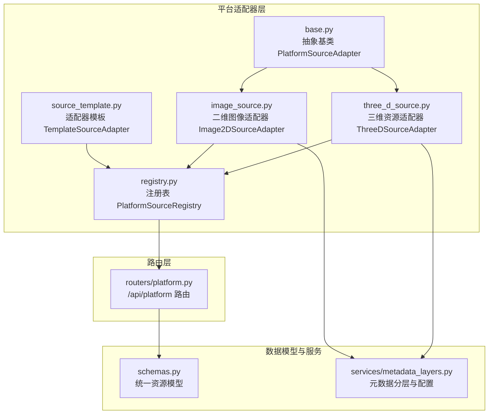
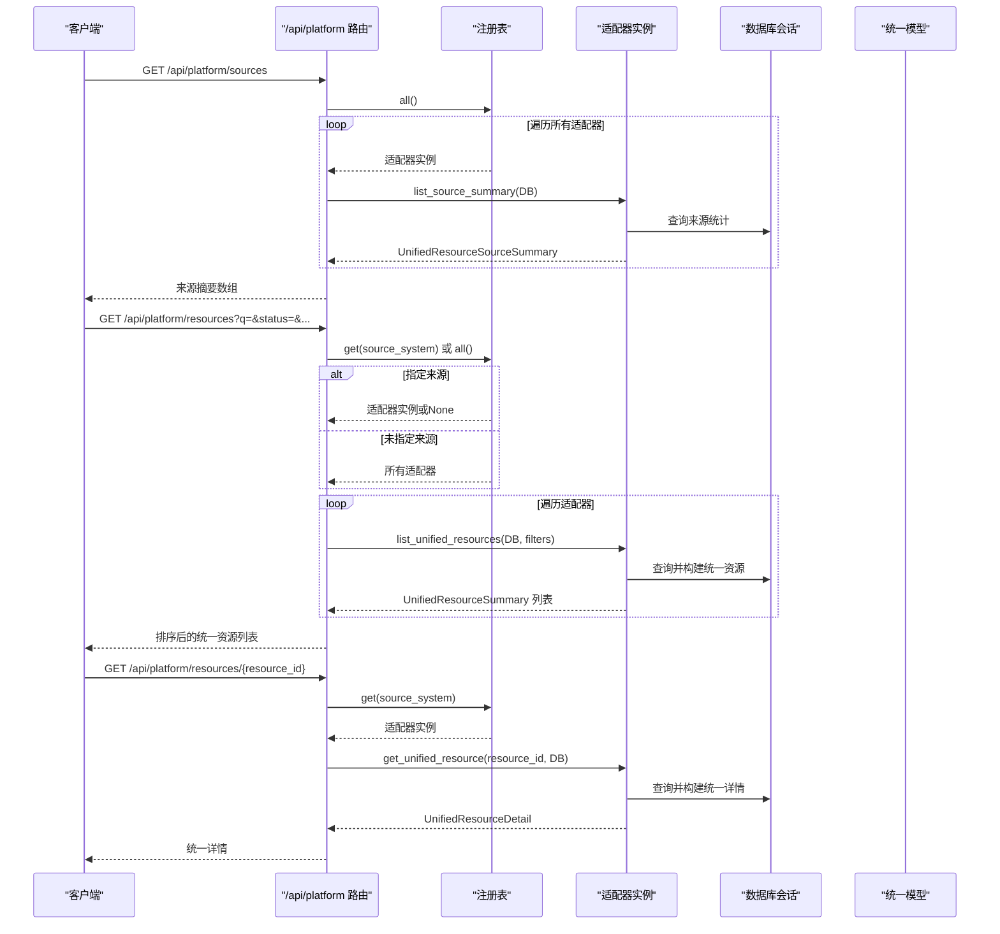
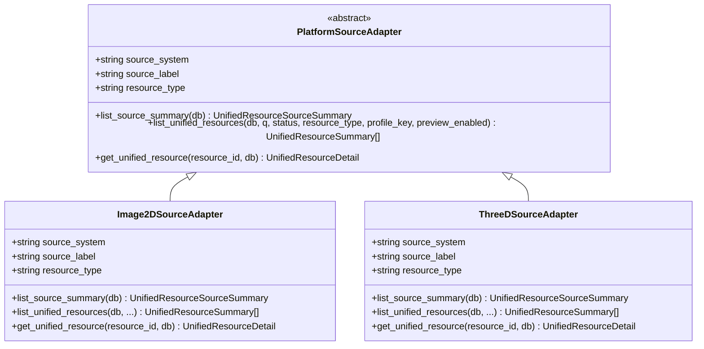
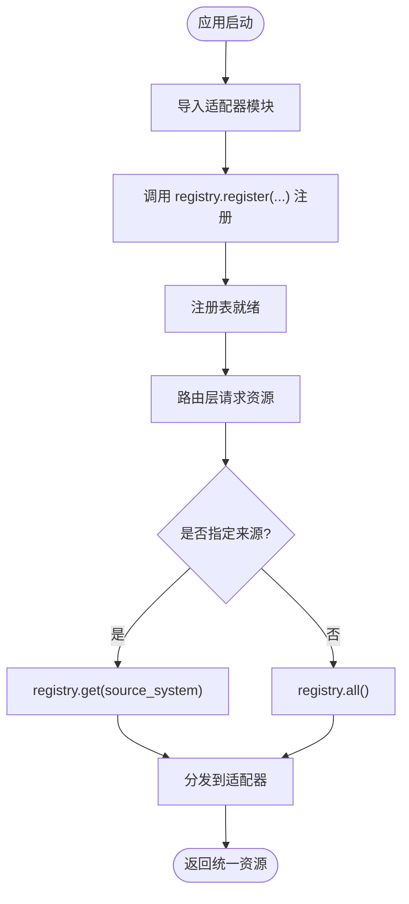
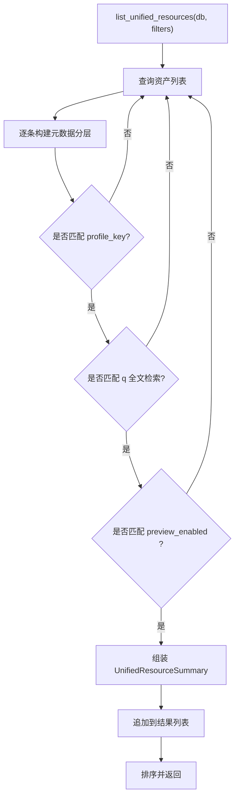
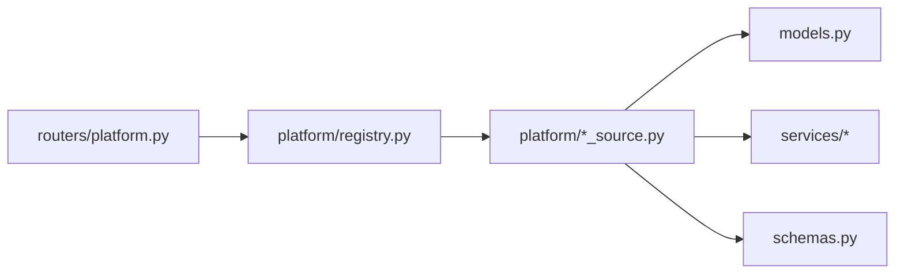

# 平台适配器设计

<cite>
**本文引用的文件**
- [backend/app/platform/base.py](file://backend/app/platform/base.py)
- [backend/app/platform/registry.py](file://backend/app/platform/registry.py)
- [backend/app/platform/source_template.py](file://backend/app/platform/source_template.py)
- [backend/app/platform/image_source.py](file://backend/app/platform/image_source.py)
- [backend/app/platform/three_d_source.py](file://backend/app/platform/three_d_source.py)
- [backend/app/routers/platform.py](file://backend/app/routers/platform.py)
- [backend/app/main.py](file://backend/app/main.py)
- [backend/app/schemas.py](file://backend/app/schemas.py)
- [backend/app/services/metadata_layers.py](file://backend/app/services/metadata_layers.py)
- [docs/02-架构设计/PLATFORM_SOURCE_ADAPTERS.md](file://docs/02-架构设计/PLATFORM_SOURCE_ADAPTERS.md)
- [backend/tests/test_platform_directory.py](file://backend/tests/test_platform_directory.py)
</cite>

## 目录
1. [简介](#简介)
2. [项目结构](#项目结构)
3. [核心组件](#核心组件)
4. [架构总览](#架构总览)
5. [详细组件分析](#详细组件分析)
6. [依赖分析](#依赖分析)
7. [性能考量](#性能考量)
8. [故障排查指南](#故障排查指南)
9. [结论](#结论)
10. [附录](#附录)

## 简介
本文件系统化阐述MDAMS原型项目的“平台适配器”设计，覆盖适配器接口定义、注册机制、模板系统、开发规范与最佳实践，并提供具体实现示例与集成指南。平台适配器的目标是将不同来源系统的资源统一为一致的资源视图，通过注册表集中管理适配器实例，路由层按需调用，实现“平台层只负责调度与聚合”的架构目标。

## 项目结构
平台适配器相关代码集中在后端应用的platform子模块，配合路由层与统一数据模型Schema共同构成适配器体系。

图表来源
- [backend/app/platform/base.py:14-42](file://backend/app/platform/base.py#L14-L42)
- [backend/app/platform/registry.py:8-24](file://backend/app/platform/registry.py#L8-L24)
- [backend/app/platform/source_template.py:16-39](file://backend/app/platform/source_template.py#L16-L39)
- [backend/app/platform/image_source.py:196-228](file://backend/app/platform/image_source.py#L196-L228)
- [backend/app/platform/three_d_source.py:192-224](file://backend/app/platform/three_d_source.py#L192-L224)
- [backend/app/routers/platform.py:12-65](file://backend/app/routers/platform.py#L12-L65)
- [backend/app/schemas.py:147-177](file://backend/app/schemas.py#L147-L177)
- [backend/app/services/metadata_layers.py:88-191](file://backend/app/services/metadata_layers.py#L88-L191)

章节来源
- [backend/app/platform/base.py:14-42](file://backend/app/platform/base.py#L14-L42)
- [backend/app/platform/registry.py:8-24](file://backend/app/platform/registry.py#L8-L24)
- [backend/app/platform/source_template.py:16-39](file://backend/app/platform/source_template.py#L16-L39)
- [backend/app/platform/image_source.py:196-228](file://backend/app/platform/image_source.py#L196-L228)
- [backend/app/platform/three_d_source.py:192-224](file://backend/app/platform/three_d_source.py#L192-L224)
- [backend/app/routers/platform.py:12-65](file://backend/app/routers/platform.py#L12-L65)
- [backend/app/schemas.py:147-177](file://backend/app/schemas.py#L147-L177)
- [backend/app/services/metadata_layers.py:88-191](file://backend/app/services/metadata_layers.py#L88-L191)

## 核心组件
- 抽象基类 PlatformSourceAdapter：定义适配器必须实现的三个抽象方法，统一资源类型标识与标签。
- 注册表 PlatformSourceRegistry：集中管理适配器实例，提供注册、查询与遍历能力。
- 适配器模板 TemplateSourceAdapter：提供新适配器的最小实现模板，便于快速复制与扩展。
- 具体适配器 Image2DSourceAdapter、ThreeDSourceAdapter：分别对接二维图像与三维资源，实现统一资源的摘要、列表与详情。
- 路由层 /api/platform：对外暴露统一资源目录、来源摘要与统一详情接口。
- 统一数据模型：UnifiedResourceSourceSummary、UnifiedResourceSummary、UnifiedResourceDetail等，确保跨来源一致性。

章节来源
- [backend/app/platform/base.py:14-42](file://backend/app/platform/base.py#L14-L42)
- [backend/app/platform/registry.py:8-24](file://backend/app/platform/registry.py#L8-L24)
- [backend/app/platform/source_template.py:16-39](file://backend/app/platform/source_template.py#L16-L39)
- [backend/app/platform/image_source.py:196-228](file://backend/app/platform/image_source.py#L196-L228)
- [backend/app/platform/three_d_source.py:192-224](file://backend/app/platform/three_d_source.py#L192-L224)
- [backend/app/routers/platform.py:12-65](file://backend/app/routers/platform.py#L12-L65)
- [backend/app/schemas.py:147-177](file://backend/app/schemas.py#L147-L177)

## 架构总览
平台适配器采用“抽象接口 + 注册表 + 路由调度”的分层架构。平台层不直接存储资源，而是从各来源系统读取并转换为统一视图；路由层根据请求参数选择适配器或全部适配器进行聚合；适配器内部通过服务层构建元数据分层，保证字段映射与验证规则的一致性。

图表来源
- [backend/app/routers/platform.py:15-65](file://backend/app/routers/platform.py#L15-L65)
- [backend/app/platform/registry.py:8-24](file://backend/app/platform/registry.py#L8-L24)
- [backend/app/platform/base.py:21-41](file://backend/app/platform/base.py#L21-L41)
- [backend/app/schemas.py:147-177](file://backend/app/schemas.py#L147-L177)

## 详细组件分析

### 抽象基类 PlatformSourceAdapter
- 设计理念
  - 通过抽象方法约束适配器必须实现“来源摘要”“统一资源列表”“统一资源详情”三类能力，确保平台层的统一调度。
  - 通过类级字段 source_system、source_label、resource_type 提供来源标识与标签，便于路由层按来源系统过滤。
- 抽象方法规范
  - list_source_summary：返回来源系统摘要，包含健康状态、最后同步时间、入口路径等。
  - list_unified_resources：按过滤条件返回统一资源列表，支持全文检索、状态、资源类型、profile_key、预览开关等。
  - get_unified_resource：按统一资源ID返回统一详情，包含来源详情URL与来源记录。
- 生命周期管理
  - 适配器实例在应用启动时注册到注册表，随后由路由层按需调用，无需显式销毁。
- 错误处理
  - 适配器内部抛出的异常（如参数非法、资源不存在）由路由层捕获并转换为HTTP状态码与错误消息。

图表来源
- [backend/app/platform/base.py:14-42](file://backend/app/platform/base.py#L14-L42)
- [backend/app/platform/image_source.py:196-228](file://backend/app/platform/image_source.py#L196-L228)
- [backend/app/platform/three_d_source.py:192-224](file://backend/app/platform/three_d_source.py#L192-L224)

章节来源
- [backend/app/platform/base.py:14-42](file://backend/app/platform/base.py#L14-L42)

### 注册表 PlatformSourceRegistry
- 工作原理
  - 内部维护字典映射：source_system -> 适配器实例。
  - 提供 register、get、all 三种操作：注册适配器、按来源系统获取、遍历所有适配器。
- 动态加载
  - 通过在适配器模块末尾调用 registry.register(...) 实现“声明式注册”，无需额外导入或初始化。
- 适配器发现
  - 路由层通过 registry.all() 获取全部适配器，或通过 registry.get(source_system) 获取指定来源。
- 版本兼容性
  - 通过 source_system 字段区分来源，避免同名冲突；新增来源只需提供唯一标识即可。

图表来源
- [backend/app/platform/registry.py:8-24](file://backend/app/platform/registry.py#L8-L24)
- [backend/app/platform/image_source.py:227](file://backend/app/platform/image_source.py#L227)
- [backend/app/platform/three_d_source.py:223](file://backend/app/platform/three_d_source.py#L223)

章节来源
- [backend/app/platform/registry.py:8-24](file://backend/app/platform/registry.py#L8-L24)

### 适配器模板 SourceTemplate
- 通用接口
  - 复制模板后，实现三个抽象方法并设置 source_system、source_label、resource_type。
- 数据格式标准化
  - 使用统一模型 UnifiedResourceSourceSummary、UnifiedResourceSummary、UnifiedResourceDetail，确保字段一致性。
- 字段映射与验证规则
  - 通过服务层构建元数据分层，结合 profile_key 与 profile_label 的映射，实现字段标准化与校验。
- 快速上手
  - 模板提供占位符与错误提示，便于开发者快速替换为真实来源。

章节来源
- [backend/app/platform/source_template.py:16-39](file://backend/app/platform/source_template.py#L16-L39)

### 二维图像适配器 Image2DSourceAdapter
- 职责
  - 从资产表读取二维资源，复用元数据分层，生成统一资源摘要与详情。
  - 支持预览能力与IIIF清单链接。
- 关键实现要点
  - 资源ID生成规则：source_system:asset_id。
  - 搜索与过滤：支持全文检索、状态、资源类型、profile_key、预览开关。
  - 预览启用判断：基于IIIF就绪状态。
- 与服务层协作
  - 使用元数据分层服务与IIIF访问服务，确保字段映射与预览状态一致。

图表来源
- [backend/app/platform/image_source.py:50-151](file://backend/app/platform/image_source.py#L50-L151)
- [backend/app/services/metadata_layers.py:88-191](file://backend/app/services/metadata_layers.py#L88-L191)

章节来源
- [backend/app/platform/image_source.py:196-228](file://backend/app/platform/image_source.py#L196-L228)
- [backend/app/platform/image_source.py:50-151](file://backend/app/platform/image_source.py#L50-L151)

### 三维资源适配器 ThreeDSourceAdapter
- 职责
  - 从三维资产表读取对象，汇总标题、profile、版本、预览状态，返回统一详情。
  - 更多面向对象/版本/多文件角色，预览启用与Web预览状态相关。
- 关键实现要点
  - 文件记录标准化：将三维资产的文件记录转换为统一结构。
  - 预览启用判断：综合核心层与资产状态，确保预览可用性。
  - 搜索与过滤：支持更丰富的搜索字段（如版本标签、资源组等）。
- 与服务层协作
  - 使用三维元数据分层服务，确保字段映射与预览状态一致。

章节来源
- [backend/app/platform/three_d_source.py:192-224](file://backend/app/platform/three_d_source.py#L192-L224)
- [backend/app/platform/three_d_source.py:70-158](file://backend/app/platform/three_d_source.py#L70-L158)

### 路由层 /api/platform
- 接口定义
  - GET /api/platform/sources：返回各来源摘要。
  - GET /api/platform/resources：返回统一资源列表，支持多参数过滤。
  - GET /api/platform/resources/{resource_id}：返回统一详情。
- 控制流
  - 按来源系统过滤：若指定 source_system，则仅调用该适配器；否则遍历全部适配器。
  - 异常处理：对未知ID、资源不存在等错误转换为HTTP状态码与错误消息。

章节来源
- [backend/app/routers/platform.py:15-65](file://backend/app/routers/platform.py#L15-L65)

## 依赖分析
- 组件耦合
  - 路由层仅依赖注册表与统一模型，不直接依赖具体适配器实现，降低耦合度。
  - 适配器依赖服务层与模型层，实现业务逻辑与数据转换。
- 外部依赖
  - SQLAlchemy会话用于数据库查询。
  - Pydantic模型用于统一数据结构与序列化。
- 循环依赖
  - 适配器模块在末尾注册，避免了导入循环；路由层仅依赖注册表与统一模型。

图表来源
- [backend/app/routers/platform.py:10](file://backend/app/routers/platform.py#L10)
- [backend/app/platform/registry.py:5](file://backend/app/platform/registry.py#L5)
- [backend/app/platform/image_source.py:17-18](file://backend/app/platform/image_source.py#L17-L18)
- [backend/app/platform/three_d_source.py:11-13](file://backend/app/platform/three_d_source.py#L11-L13)
- [backend/app/schemas.py:147-177](file://backend/app/schemas.py#L147-L177)

章节来源
- [backend/app/routers/platform.py:10](file://backend/app/routers/platform.py#L10)
- [backend/app/platform/registry.py:5](file://backend/app/platform/registry.py#L5)
- [backend/app/platform/image_source.py:17-18](file://backend/app/platform/image_source.py#L17-L18)
- [backend/app/platform/three_d_source.py:11-13](file://backend/app/platform/three_d_source.py#L11-L13)
- [backend/app/schemas.py:147-177](file://backend/app/schemas.py#L147-L177)

## 性能考量
- 查询优化
  - 适配器内部优先使用SQL过滤（状态、资源类型），减少Python侧过滤开销。
  - 对全文检索采用字符串拼接与低频扫描，建议在大规模数据下引入索引或搜索引擎。
- 预览状态判断
  - 二维与三维适配器分别基于IIIF就绪状态与Web预览状态判断，避免不必要的渲染。
- 聚合排序
  - 路由层对聚合结果按更新时间倒序，提升最新资源可见性。
- 缓存与并发
  - 可在适配器层增加缓存策略（如来源摘要缓存），减少重复查询。
  - 注意数据库连接池与事务隔离，避免阻塞。

## 故障排查指南
- 常见问题
  - 未知统一资源ID：检查资源ID格式是否为 source_system:source_id。
  - 资源不存在：确认来源系统与ID是否正确，数据库是否存在对应记录。
  - 适配器未注册：确认适配器模块末尾是否调用了注册表注册。
- 调试建议
  - 使用测试用例验证适配器行为，参考平台目录集成测试。
  - 在路由层捕获异常并输出详细日志，定位适配器内部错误。

章节来源
- [backend/app/routers/platform.py:51-65](file://backend/app/routers/platform.py#L51-L65)
- [backend/tests/test_platform_directory.py:38-107](file://backend/tests/test_platform_directory.py#L38-L107)

## 结论
平台适配器通过抽象接口、注册表与路由层的清晰分工，实现了对多来源资源的统一聚合。适配器模板降低了新来源接入成本，统一模型保障了跨来源一致性。未来可在全文检索索引、缓存策略与异步处理等方面进一步优化，以支撑更大规模的数据与更高并发场景。

## 附录

### 开发规范与最佳实践
- 接口实现要求
  - 必须实现三个抽象方法，严格遵守统一模型字段语义。
  - 正确设置 source_system、source_label、resource_type，确保唯一性与可读性。
- 错误处理策略
  - 参数校验失败抛出值错误，资源不存在抛出查找错误，路由层转换为HTTP状态码。
- 性能优化
  - 尽量在SQL层完成过滤与排序，减少Python侧处理。
  - 对高频查询结果进行缓存，降低数据库压力。
- 安全考虑
  - 输入参数（如q、status、profile_key）应进行白名单校验与长度限制。
  - 预览开关与来源详情URL应遵循权限控制策略。
- 常见陷阱
  - 忘记注册适配器导致路由层无法发现来源。
  - 资源ID格式不规范导致统一详情解析失败。
  - 全文检索未做索引导致性能瓶颈。

### 适配器开发步骤
- 复制模板模块，实现三个抽象方法。
- 设置来源标识与标签，确保唯一且语义明确。
- 在模块末尾注册适配器实例。
- 编写单元/集成测试，验证来源摘要、列表与详情。
- 在路由层验证接口行为，确保过滤参数生效。

章节来源
- [docs/02-架构设计/PLATFORM_SOURCE_ADAPTERS.md:108-116](file://docs/02-架构设计/PLATFORM_SOURCE_ADAPTERS.md#L108-L116)
- [backend/app/platform/source_template.py:16-39](file://backend/app/platform/source_template.py#L16-L39)