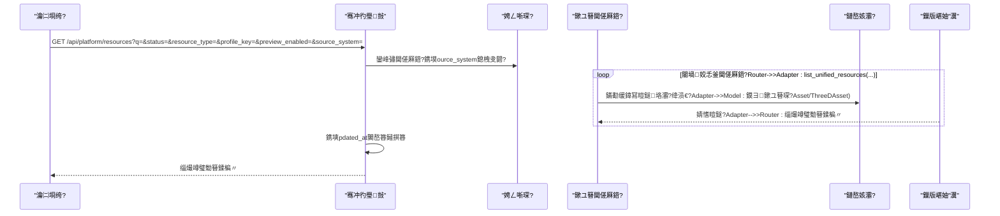
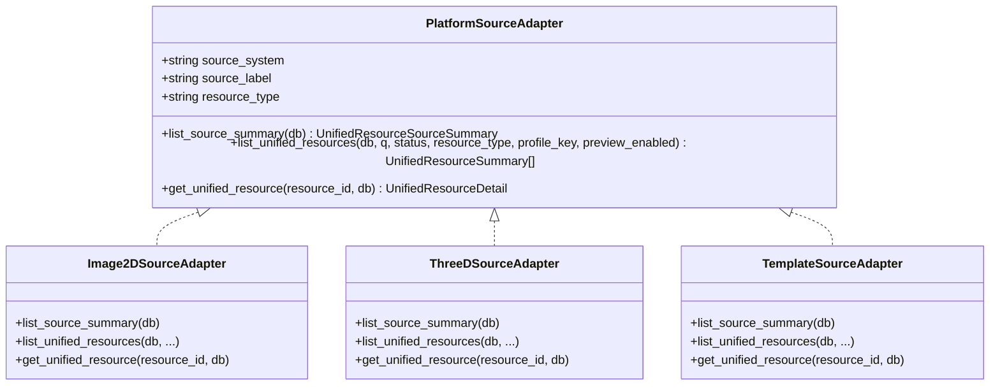
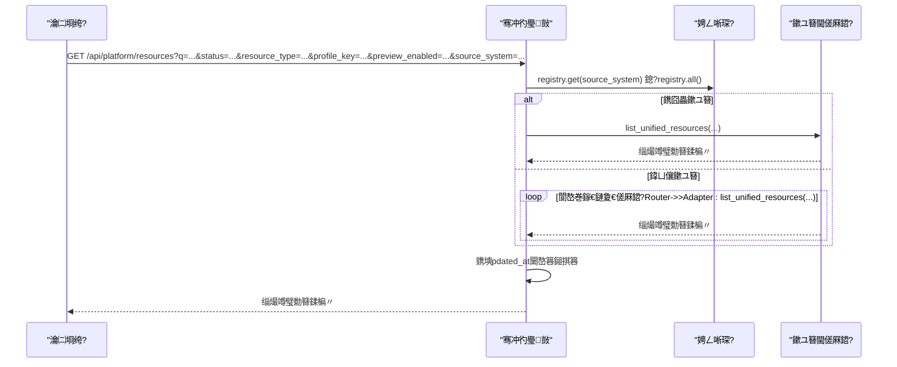
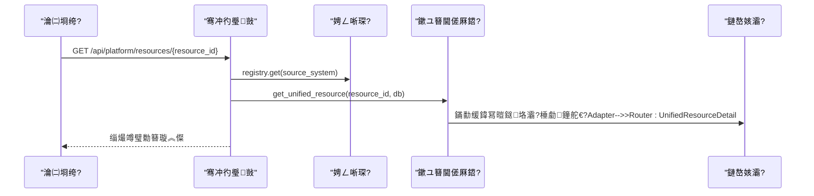

# 缁熶竴骞冲彴鐩綍

<cite>
**鏈枃寮曠敤鐨勬枃浠?*
- [backend/app/platform/base.py](file://backend/app/platform/base.py)
- [backend/app/platform/registry.py](file://backend/app/platform/registry.py)
- [backend/app/platform/source_template.py](file://backend/app/platform/source_template.py)
- [backend/app/platform/image_source.py](file://backend/app/platform/image_source.py)
- [backend/app/platform/three_d_source.py](file://backend/app/platform/three_d_source.py)
- [backend/app/routers/platform.py](file://backend/app/routers/platform.py)
- [backend/app/schemas.py](file://backend/app/schemas.py)
- [backend/app/models.py](file://backend/app/models.py)
- [backend/app/services/metadata_layers.py](file://backend/app/services/metadata_layers.py)
- [backend/app/services/asset_detail.py](file://backend/app/services/asset_detail.py)
- [backend/app/services/three_d_detail.py](file://backend/app/services/three_d_detail.py)
- [docs/02-鏋舵瀯璁捐/PLATFORM_SOURCE_ADAPTERS.md](file://docs/02-鏋舵瀯璁捐/PLATFORM_SOURCE_ADAPTERS.md)
- [docs/04-瀹炴柦鏂规/OBJECT_DETAIL_PHASE2_PLAN.md](file://docs/04-瀹炴柦鏂规/OBJECT_DETAIL_PHASE2_PLAN.md)
- [docs/06-鍙傝€冭祫鏂?UNIFIED_METADATA_EXAMPLE.md](file://docs/06-鍙傝€冭祫鏂?UNIFIED_METADATA_EXAMPLE.md)
</cite>

## 鐩綍
1. [绠€浠媇(#绠€浠?
2. [椤圭洰缁撴瀯](#椤圭洰缁撴瀯)
3. [鏍稿績缁勪欢](#鏍稿績缁勪欢)
4. [鏋舵瀯鎬昏](#鏋舵瀯鎬昏)
5. [璇︾粏缁勪欢鍒嗘瀽](#璇︾粏缁勪欢鍒嗘瀽)
6. [渚濊禆鍒嗘瀽](#渚濊禆鍒嗘瀽)
7. [鎬ц兘鑰冭檻](#鎬ц兘鑰冭檻)
8. [鏁呴殰鎺掓煡鎸囧崡](#鏁呴殰鎺掓煡鎸囧崡)
9. [缁撹](#缁撹)
10. [闄勫綍](#闄勫綍)

## 绠€浠?鏈枃浠堕潰鍚慚DAMS鍘熷瀷椤圭洰鐨勨€滅粺涓€骞冲彴鐩綍绯荤粺鈥濓紝绯荤粺鎬ч槓杩板钩鍙伴€傞厤鍣ㄨ璁°€佸鏉ユ簮骞冲彴鎺ュ叆銆佹暟鎹牸寮忔爣鍑嗗寲銆佺粺涓€API灏佽銆佽祫婧愯仛鍚堟満鍒躲€佺粺涓€妫€绱㈡帴鍙ｈ璁°€佹潵婧愭敞鍐岀鐞嗐€佽祫婧愮洰褰曠粍缁囩粨鏋勩€佺粺涓€璧勬簮璇︽儏灞曠ず銆佸紑鍙戞寚鍗椾笌鏈€浣冲疄璺碉紝骞舵彁渚涢厤缃ず渚嬩笌闆嗘垚鏂规銆傛枃妗ｅ熀浜庡悗绔钩鍙伴€傞厤鍣ㄤ笌璺敱瀹炵幇锛岀粨鍚堝厓鏁版嵁鍒嗗眰涓庢湇鍔″眰鑳藉姏锛屽府鍔╄鑰呭揩閫熺悊瑙ｄ笌鎵╁睍缁熶竴鐩綍鑳藉姏銆?
## 椤圭洰缁撴瀯
缁熶竴骞冲彴鐩綍浣嶄簬鍚庣妯″潡鐨勫钩鍙板眰涓庤矾鐢卞眰锛屽洿缁曗€滈€傞厤鍣ㄦ帴鍙ｂ€旀敞鍐岃〃鈥旇矾鐢辫仛鍚堚€旀湇鍔″眰鈥濈殑鍒嗗眰鏋舵瀯缁勭粐锛屾棦淇濊瘉浜嗗澶氭潵婧愮郴缁熺殑瑙ｈ€︼紝鍙堝疄鐜颁簡缁熶竴妫€绱笌缁熶竴璇︽儏鐨勮仛鍚堝睍绀恒€?
```mermaid
graph TB
subgraph "骞冲彴灞?
A["閫傞厤鍣ㄦ帴鍙?br/>PlatformSourceAdapter"]
B["娉ㄥ唽琛?br/>PlatformSourceRegistry"]
C["閫傞厤鍣ㄦā鏉?br/>TemplateSourceAdapter"]
end
subgraph "鏉ユ簮閫傞厤鍣?
D["浜岀淮褰卞儚閫傞厤鍣?br/>Image2DSourceAdapter"]
E["涓夌淮璧勬簮閫傞厤鍣?br/>ThreeDSourceAdapter"]
end
subgraph "璺敱灞?
F["骞冲彴璺敱<br/>/api/platform/*"]
end
subgraph "鏈嶅姟灞?
G["鍏冩暟鎹垎灞?br/>metadata_layers"]
H["璧勪骇璇︽儏鏋勫缓<br/>asset_detail"]
I["涓夌淮璇︽儏鏋勫缓<br/>three_d_detail"]
end
subgraph "鏁版嵁妯″瀷"
J["璧勪骇妯″瀷<br/>Asset"]
K["涓夌淮璧勪骇妯″瀷<br/>ThreeDAsset"]
end
A --> B
C --> B
D --> B
E --> B
B --> F
D --> G
E --> G
D --> H
E --> I
D --> J
E --> K
```

鍥捐〃鏉ユ簮
- [backend/app/platform/base.py:14-42](file://backend/app/platform/base.py#L14-L42)
- [backend/app/platform/registry.py:8-24](file://backend/app/platform/registry.py#L8-L24)
- [backend/app/platform/source_template.py:16-39](file://backend/app/platform/source_template.py#L16-L39)
- [backend/app/platform/image_source.py:196-228](file://backend/app/platform/image_source.py#L196-L228)
- [backend/app/platform/three_d_source.py:192-224](file://backend/app/platform/three_d_source.py#L192-L224)
- [backend/app/routers/platform.py:12-65](file://backend/app/routers/platform.py#L12-L65)
- [backend/app/services/metadata_layers.py:412-541](file://backend/app/services/metadata_layers.py#L412-L541)
- [backend/app/services/asset_detail.py:189-385](file://backend/app/services/asset_detail.py#L189-L385)
- [backend/app/services/three_d_detail.py:97-201](file://backend/app/services/three_d_detail.py#L97-L201)
- [backend/app/models.py:6-26](file://backend/app/models.py#L6-L26)
- [backend/app/models.py:215-255](file://backend/app/models.py#L215-L255)

绔犺妭鏉ユ簮
- [docs/02-鏋舵瀯璁捐/PLATFORM_SOURCE_ADAPTERS.md:10-122](file://docs/02-鏋舵瀯璁捐/PLATFORM_SOURCE_ADAPTERS.md#L10-L122)

## 鏍稿績缁勪欢
- 閫傞厤鍣ㄦ帴鍙ｄ笌妯℃澘
  - 骞冲彴閫傞厤鍣ㄦ娊璞℃帴鍙ｅ畾涔夌粺涓€鐨勬潵婧愭憳瑕併€佺粺涓€璧勬簮鍒楄〃銆佺粺涓€璧勬簮璇︽儏涓夐」鑳藉姏锛岀‘淇濆钩鍙板眰鍙礋璐ｈ皟搴︿笌鑱氬悎銆?  - 閫傞厤鍣ㄦā鏉挎彁渚涘鍒朵笌瀹炵幇鎸囧紩锛岄檷浣庢柊鏉ユ簮鎺ュ叆鎴愭湰銆?- 娉ㄥ唽琛?  - 鎻愪緵閫傞厤鍣ㄦ敞鍐屻€佹寜鏉ユ簮绯荤粺妫€绱€侀亶鍘嗘墍鏈夐€傞厤鍣ㄧ殑鑳藉姏锛屽舰鎴愬钩鍙板眰涓庡悇鏉ユ簮涔嬮棿鐨勬澗鑰﹀悎銆?- 鏉ユ簮閫傞厤鍣?  - 浜岀淮褰卞儚閫傞厤鍣細浠庤祫浜ц〃璇诲彇鏁版嵁锛屽鐢ㄥ厓鏁版嵁鍒嗗眰锛岀敓鎴愮粺涓€璧勬簮鎽樿涓庤鎯呫€?  - 涓夌淮璧勬簮閫傞厤鍣細浠庝笁缁磋祫浜ц〃璇诲彇鏁版嵁锛屾眹鎬诲璞℃爣棰樸€乸rofile銆佺増鏈€侀瑙堢姸鎬侊紝杩斿洖缁熶竴璇︽儏缁撴瀯銆?- 璺敱灞?  - 鎻愪緵鏉ユ簮鎽樿銆佺粺涓€鐩綍鍒楄〃銆佺粺涓€璇︽儏涓夐」骞冲彴绾ф帴鍙ｏ紝鏀寔鎸夋潵婧愮郴缁熺瓫閫変笌缁熶竴鎺掑簭銆?- 鏈嶅姟灞?  - 鍏冩暟鎹垎灞傦細灏嗗師濮嬪厓鏁版嵁褰掑苟涓篶ore/management/technical/profile/raw_metadata绛夊垎灞傦紝鏀寔profile瑙ｆ瀽涓庡瓧娈垫槧灏勩€?  - 璧勪骇璇︽儏鏋勫缓锛氬皢璧勪骇瀵硅薄杞崲涓哄墠绔弸濂界殑璇︽儏缁撴瀯锛屽寘鍚枃浠跺叧绯汇€佽闂矾寰勩€佽緭鍑哄姩浣溿€佺敓鍛藉懆鏈熺瓑銆?  - 涓夌淮璇︽儏鏋勫缓锛氬皢涓夌淮瀵硅薄杞崲涓哄寘鍚枃浠剁粍銆侀瑙堢姸鎬併€佽闂笌杈撳嚭绛夌殑璇︽儏缁撴瀯銆?- 鏁版嵁妯″瀷
  - 璧勪骇妯″瀷涓庝笁缁磋祫浜фā鍨嬫壙杞芥潵婧愭暟鎹紝缁熶竴涓洪€傞厤鍣ㄤ笌鏈嶅姟灞傛彁渚涙煡璇笌杞崲渚濇嵁銆?
绔犺妭鏉ユ簮
- [backend/app/platform/base.py:14-42](file://backend/app/platform/base.py#L14-L42)
- [backend/app/platform/source_template.py:16-39](file://backend/app/platform/source_template.py#L16-L39)
- [backend/app/platform/registry.py:8-24](file://backend/app/platform/registry.py#L8-L24)
- [backend/app/platform/image_source.py:196-228](file://backend/app/platform/image_source.py#L196-L228)
- [backend/app/platform/three_d_source.py:192-224](file://backend/app/platform/three_d_source.py#L192-L224)
- [backend/app/routers/platform.py:12-65](file://backend/app/routers/platform.py#L12-L65)
- [backend/app/services/metadata_layers.py:412-541](file://backend/app/services/metadata_layers.py#L412-L541)
- [backend/app/services/asset_detail.py:189-385](file://backend/app/services/asset_detail.py#L189-L385)
- [backend/app/services/three_d_detail.py:97-201](file://backend/app/services/three_d_detail.py#L97-L201)
- [backend/app/models.py:6-26](file://backend/app/models.py#L6-L26)
- [backend/app/models.py:215-255](file://backend/app/models.py#L215-L255)

## 鏋舵瀯鎬昏
缁熶竴骞冲彴鐩綍閫氳繃鈥滈€傞厤鍣ㄢ€旀敞鍐岃〃鈥旇矾鐢扁€旀湇鍔♀€旀ā鍨嬧€濈殑鍒嗗眰鍗忎綔锛屽疄鐜帮細
- 澶氭潵婧愮郴缁熸帴鍏ワ細閫氳繃閫傞厤鍣ㄦ娊璞′笌娉ㄥ唽琛ㄧ鐞嗭紝鏂板鏉ユ簮鍙渶瀹炵幇涓夌被鑳藉姏骞舵敞鍐屽嵆鍙嚜鍔ㄨ仛鍚堛€?- 鏁版嵁鏍煎紡鏍囧噯鍖栵細鏈嶅姟灞傚皢鏉ユ簮鏁版嵁缁熶竴涓哄垎灞傚厓鏁版嵁锛屼繚璇佽法鏉ユ簮涓€鑷寸殑灞曠ず涓庢绱€?- 缁熶竴API灏佽锛氳矾鐢卞眰鎻愪緵缁熶竴鐨勬潵婧愭憳瑕併€佺粺涓€鐩綍鍒楄〃銆佺粺涓€璇︽儏鎺ュ彛锛屽睆钄芥潵婧愬樊寮傘€?- 璧勬簮鑱氬悎涓庢绱細骞冲彴灞傛寜鏉ユ簮鍒嗗彂绛涢€夋潯浠讹紝閫傞厤鍣ㄥ湪鍚勮嚜鍐呴儴鎵ц鏌ヨ涓庤繃婊わ紝鏈€缁堢粺涓€鎺掑簭杩斿洖銆?


鍥捐〃鏉ユ簮
- [backend/app/routers/platform.py:20-48](file://backend/app/routers/platform.py#L20-L48)
- [backend/app/platform/registry.py:15-19](file://backend/app/platform/registry.py#L15-L19)
- [backend/app/platform/image_source.py:50-151](file://backend/app/platform/image_source.py#L50-L151)
- [backend/app/platform/three_d_source.py:70-158](file://backend/app/platform/three_d_source.py#L70-L158)
- [backend/app/services/metadata_layers.py:412-541](file://backend/app/services/metadata_layers.py#L412-L541)
- [backend/app/models.py:6-26](file://backend/app/models.py#L6-L26)
- [backend/app/models.py:215-255](file://backend/app/models.py#L215-L255)

## 璇︾粏缁勪欢鍒嗘瀽

### 骞冲彴閫傞厤鍣ㄨ璁?- 鎺ュ彛濂戠害
  - list_source_summary锛氳繑鍥炴潵婧愮郴缁熸憳瑕侊紝鍖呭惈鏉ユ簮鏍囪瘑銆佹爣绛俱€佽祫婧愮被鍨嬨€佸仴搴风姸鎬併€佹渶鍚庡悓姝ユ椂闂淬€佸叆鍙ｇ瓑銆?  - list_unified_resources锛氳繑鍥炵粺涓€璧勬簮鍒楄〃锛屾敮鎸佸叏鏂囨绱€佺姸鎬併€佽祫婧愮被鍨嬨€乸rofile閿€侀瑙堝紑鍏崇瓑绛涢€夈€?  - get_unified_resource锛氳繑鍥炵粺涓€璧勬簮璇︽儏锛屽寘鍚潵婧愯鎯匲RL銆佹潵婧愯褰曠瓑銆?- 妯℃澘涓庡疄鐜?  - 妯℃澘閫傞厤鍣ㄦ彁渚涘鍒朵笌瀹炵幇鎸囧紩锛岃姹傚疄鐜颁笂杩颁笁绫绘柟娉曞苟娉ㄥ唽鍒版敞鍐岃〃銆?  - 浜岀淮涓庝笁缁撮€傞厤鍣ㄥ垎鍒鎺ヨ祫浜т笌涓夌淮璧勪骇琛紝澶嶇敤鍏冩暟鎹垎灞備笌棰勮鐘舵€佸垽鏂€?


鍥捐〃鏉ユ簮
- [backend/app/platform/base.py:14-42](file://backend/app/platform/base.py#L14-L42)
- [backend/app/platform/source_template.py:16-39](file://backend/app/platform/source_template.py#L16-L39)
- [backend/app/platform/image_source.py:196-228](file://backend/app/platform/image_source.py#L196-L228)
- [backend/app/platform/three_d_source.py:192-224](file://backend/app/platform/three_d_source.py#L192-L224)

绔犺妭鏉ユ簮
- [backend/app/platform/base.py:14-42](file://backend/app/platform/base.py#L14-L42)
- [backend/app/platform/source_template.py:16-39](file://backend/app/platform/source_template.py#L16-L39)
- [docs/02-鏋舵瀯璁捐/PLATFORM_SOURCE_ADAPTERS.md:43-51](file://docs/02-鏋舵瀯璁捐/PLATFORM_SOURCE_ADAPTERS.md#L43-L51)

### 鏉ユ簮娉ㄥ唽绠＄悊
- 娉ㄥ唽琛ㄦ彁渚涙敞鍐屻€佹寜鏉ユ簮绯荤粺妫€绱€侀亶鍘嗘墍鏈夐€傞厤鍣ㄧ殑鑳藉姏锛屽钩鍙拌矾鐢辨牴鎹畇ource_system鍙傛暟閫夋嫨鎬ц皟鐢ㄣ€?- 浜岀淮涓庝笁缁撮€傞厤鍣ㄥ湪妯″潡鏈熬瀹屾垚娉ㄥ唽锛岀‘淇濆钩鍙板眰鍙嚜鍔ㄥ彂鐜颁笌鑱氬悎銆?
```mermaid
flowchart TD
Start(["鍒濆鍖?]) --> NewAdapter["瀹炵幇閫傞厤鍣?瀹炵幇涓夌被鏂规硶)"]
NewAdapter --> Register["registry.register(adapter)"]
Register --> Discover["骞冲彴璺敱鎸夐渶鑾峰彇閫傞厤鍣?]
Discover --> Aggregate["缁熶竴鑱氬悎杩斿洖"]
Aggregate --> End(["瀹屾垚"])
```

鍥捐〃鏉ユ簮
- [backend/app/platform/registry.py:12-19](file://backend/app/platform/registry.py#L12-L19)
- [backend/app/platform/image_source.py:227](file://backend/app/platform/image_source.py#L227)
- [backend/app/platform/three_d_source.py:223](file://backend/app/platform/three_d_source.py#L223)

绔犺妭鏉ユ簮
- [backend/app/platform/registry.py:8-24](file://backend/app/platform/registry.py#L8-L24)
- [backend/app/routers/platform.py:30-32](file://backend/app/routers/platform.py#L30-L32)

### 缁熶竴妫€绱㈡帴鍙ｈ璁?- 璺敱灞傜粺涓€鎺ュ彛
  - GET /api/platform/sources锛氳繑鍥炲悇鏉ユ簮鎽樿銆?  - GET /api/platform/resources锛氳繑鍥炵粺涓€璧勬簮鍒楄〃锛屾敮鎸乹/status/resource_type/profile_key/preview_enabled/source_system绛涢€夈€?  - GET /api/platform/resources/{resource_id}锛氳繑鍥炵粺涓€璧勬簮璇︽儏銆?- 绛涢€変笌鎺掑簭
  - 骞冲彴灞傚厛鎸塻ource_system鍒嗗彂锛屽啀鐢遍€傞厤鍣ㄥ湪鍚勮嚜鍐呴儴鎵ц杩囨护涓庢帓搴忋€?  - 鍒楄〃鎸塽pdated_at闄嶅簭杩斿洖锛岀‘淇濇渶鏂拌祫婧愪紭鍏堛€?


鍥捐〃鏉ユ簮
- [backend/app/routers/platform.py:15-48](file://backend/app/routers/platform.py#L15-L48)

绔犺妭鏉ユ簮
- [backend/app/routers/platform.py:15-65](file://backend/app/routers/platform.py#L15-L65)
- [docs/02-鏋舵瀯璁捐/PLATFORM_SOURCE_ADAPTERS.md:87-98](file://docs/02-鏋舵瀯璁捐/PLATFORM_SOURCE_ADAPTERS.md#L87-L98)

### 璧勬簮鑱氬悎鏈哄埗
- 璺ㄥ钩鍙版暟鎹暣鍚?  - 閫傞厤鍣ㄥ湪鍚勮嚜鍐呴儴鎵ц鏌ヨ涓庤繃婊わ紝缁熶竴杩斿洖缁熶竴璧勬簮鎽樿锛屽钩鍙板眰璐熻矗鑱氬悎涓庢帓搴忋€?- 鍘婚噸绛栫暐
  - 缁熶竴璧勬簮ID閲囩敤鈥滄潵婧愮郴缁?鏈湴ID鈥濈殑褰㈠紡锛岄伩鍏嶈法鏉ユ簮ID鍐茬獊銆?- 鍐茬獊瑙ｅ喅
  - 褰撳悓涓€鏉ユ簮鍐呭嚭鐜伴噸澶嶆垨鍐茬獊鏃讹紝閫傞厤鍣ㄥ唴閮ㄦ寜鏉ユ簮瑙勫垯澶勭悊锛堝鎸夋渶鏂癱reated_at鎴杋d闄嶅簭锛夈€?- 鏁版嵁鍚屾
  - 鏉ユ簮鎽樿鍖呭惈last_synced_at锛屽弽鏄犳潵婧愪晶鏈€杩戝悓姝ユ椂闂淬€?
```mermaid
flowchart TD
Q["杈撳叆: q/status/resource_type/profile_key/preview_enabled/source_system"] --> Distribute["骞冲彴灞傛寜source_system鍒嗗彂"]
Distribute --> Filter["閫傞厤鍣ㄥ唴閮ㄦ墽琛岃繃婊や笌鎺掑簭"]
Filter --> Merge["骞冲彴灞傝仛鍚堝垪琛?]
Merge --> Sort["鎸塽pdated_at闄嶅簭鎺掑簭"]
Sort --> Return["杩斿洖缁熶竴璧勬簮鍒楄〃"]
```

鍥捐〃鏉ユ簮
- [backend/app/platform/image_source.py:50-151](file://backend/app/platform/image_source.py#L50-L151)
- [backend/app/platform/three_d_source.py:70-158](file://backend/app/platform/three_d_source.py#L70-L158)
- [backend/app/routers/platform.py:30-48](file://backend/app/routers/platform.py#L30-L48)

绔犺妭鏉ユ簮
- [backend/app/platform/image_source.py:29-47](file://backend/app/platform/image_source.py#L29-L47)
- [backend/app/platform/three_d_source.py:22-67](file://backend/app/platform/three_d_source.py#L22-L67)

### 缁熶竴璧勬簮璇︽儏灞曠ず
- 鍏冩暟鎹悎骞?  - 鏈嶅姟灞傚皢鏉ユ簮鍏冩暟鎹綊骞朵负core/management/technical/profile/raw_metadata绛夊垎灞傦紝鏀寔profile瑙ｆ瀽涓庡瓧娈垫槧灏勩€?- 鏉ユ簮鏍囪瘑涓庣増鏈俊鎭?  - 缁熶竴璇︽儏鍖呭惈鏉ユ簮绯荤粺銆佹潵婧愭爣绛俱€佽祫婧愮被鍨嬨€乸rofile閿?鏍囩銆佺姸鎬併€侀瑙堝紑鍏炽€佹竻鍗昒RL銆佽鎯匲RL绛夈€?- 璁块棶鎺у埗
  - 棰勮寮€鍏充笌娓呭崟URL鐢遍€傞厤鍣ㄤ笌鏈嶅姟灞傚叡鍚屽喅瀹氾紝纭繚璁块棶鎺у埗涓庢潈闄愮瓥鐣ヨ惤鍦般€?


鍥捐〃鏉ユ簮
- [backend/app/routers/platform.py:51-65](file://backend/app/routers/platform.py#L51-L65)
- [backend/app/platform/image_source.py:154-193](file://backend/app/platform/image_source.py#L154-L193)
- [backend/app/platform/three_d_source.py:161-189](file://backend/app/platform/three_d_source.py#L161-L189)
- [backend/app/services/metadata_layers.py:412-541](file://backend/app/services/metadata_layers.py#L412-L541)

绔犺妭鏉ユ簮
- [backend/app/platform/image_source.py:177-193](file://backend/app/platform/image_source.py#L177-L193)
- [backend/app/platform/three_d_source.py:173-189](file://backend/app/platform/three_d_source.py#L173-L189)
- [docs/04-瀹炴柦鏂规/OBJECT_DETAIL_PHASE2_PLAN.md:57-92](file://docs/04-瀹炴柦鏂规/OBJECT_DETAIL_PHASE2_PLAN.md#L57-L92)

### 骞冲彴閫傞厤鍣ㄥ紑鍙戞寚鍗椾笌鏈€浣冲疄璺?- 鏂板鏉ユ簮姝ラ
  - 鏂板缓閫傞厤鍣ㄦā鍧楋紝瀹炵幇閫傞厤鍣ㄦ帴鍙ｄ笁绫绘柟娉曘€?  - 鍦ㄩ€傞厤鍣ㄦ湯灏炬敞鍐屽埌娉ㄥ唽琛ㄣ€?  - 骞冲彴璺敱鑷姩鑱氬悎锛屾棤闇€棰濆淇敼銆?- 鍏冩暟鎹笌鎼滅储
  - 浣跨敤鍏冩暟鎹垎灞傛湇鍔★紝纭繚璺ㄦ潵婧愬瓧娈典竴鑷存€с€?  - 鍦ㄩ€傞厤鍣ㄥ唴閮ㄥ疄鐜板叏鏂囨绱笌绛涢€夛紝骞冲彴灞備粎璐熻矗鍒嗗彂涓庤仛鍚堛€?- 棰勮涓庢竻鍗?  - 渚濇嵁鏉ユ簮鑳藉姏鍐冲畾棰勮寮€鍏充笌娓呭崟URL锛岀‘淇濊闂矾寰勬纭€?- 閿欒澶勭悊
  - 瀵规湭鐭D涓庤祫婧愪笉瀛樺湪杩涜鏄庣‘寮傚父澶勭悊锛岃繑鍥濰TTP鐘舵€佺爜銆?
绔犺妭鏉ユ簮
- [docs/02-鏋舵瀯璁捐/PLATFORM_SOURCE_ADAPTERS.md:108-116](file://docs/02-鏋舵瀯璁捐/PLATFORM_SOURCE_ADAPTERS.md#L108-L116)
- [backend/app/platform/source_template.py:16-39](file://backend/app/platform/source_template.py#L16-L39)
- [backend/app/routers/platform.py:54-64](file://backend/app/routers/platform.py#L54-L64)

## 渚濊禆鍒嗘瀽
- 缁勪欢鑰﹀悎涓庡唴鑱?  - 骞冲彴灞傞€氳繃娉ㄥ唽琛ㄤ笌閫傞厤鍣ㄨВ鑰︼紝閫傞厤鍣ㄥ唴閮ㄤ笌鏈嶅姟灞傘€佹ā鍨嬪眰鑰﹀悎锛屼絾瀵瑰浠呮毚闇茬粺涓€鎺ュ彛銆?- 鐩存帴涓庨棿鎺ヤ緷璧?  - 璺敱灞備緷璧栨敞鍐岃〃锛涢€傞厤鍣ㄤ緷璧栨湇鍔″眰涓庢ā鍨嬪眰锛涙湇鍔″眰渚濊禆鍏冩暟鎹垎灞備笌鏉ユ簮鏁版嵁銆?- 澶栭儴渚濊禆涓庨泦鎴愮偣
  - IIIF璁块棶涓庨瑙堢姸鎬佺敱鏈嶅姟灞傚垽鏂紝涓庡钩鍙扮洰褰曢泦鎴愩€?- 鎺ュ彛濂戠害涓庡疄鐜扮粏鑺?  - 缁熶竴璧勬簮妯″瀷鍦⊿chema涓畾涔夛紝閫傞厤鍣ㄤ笌鏈嶅姟灞傚潎閬靛惊璇ュ绾︺€?
```mermaid
graph LR
Router["骞冲彴璺敱"] --> Registry["娉ㄥ唽琛?]
Registry --> Adapter["閫傞厤鍣?]
Adapter --> Service["鏈嶅姟灞?]
Adapter --> Model["鏁版嵁妯″瀷"]
Service --> Schema["缁熶竴璧勬簮妯″瀷"]
```

鍥捐〃鏉ユ簮
- [backend/app/routers/platform.py:12-65](file://backend/app/routers/platform.py#L12-L65)
- [backend/app/platform/registry.py:8-24](file://backend/app/platform/registry.py#L8-L24)
- [backend/app/platform/image_source.py:196-228](file://backend/app/platform/image_source.py#L196-L228)
- [backend/app/platform/three_d_source.py:192-224](file://backend/app/platform/three_d_source.py#L192-L224)
- [backend/app/schemas.py:147-177](file://backend/app/schemas.py#L147-L177)

绔犺妭鏉ユ簮
- [backend/app/schemas.py:147-177](file://backend/app/schemas.py#L147-L177)

## 鎬ц兘鑰冭檻
- 鏌ヨ涓庤繃婊?  - 閫傞厤鍣ㄥ唴閮ㄦ墽琛岀瓫閫変笌鎺掑簭锛屽噺灏戝钩鍙板眰鑱氬悎寮€閿€锛涘缓璁湪鏉ユ簮琛ㄥ缓绔嬪繀瑕佺储寮曚互鎻愬崌鏌ヨ鏁堢巼銆?- 鍏冩暟鎹垎灞?  - 鍒嗗眰鏋勫缓鍦ㄥ唴瀛樹腑瀹屾垚锛屾敞鎰忛伩鍏嶅澶у璞￠噸澶嶈绠楋紱鍙紦瀛樼儹鐐筽rofile瀹氫箟銆?- 棰勮鐘舵€佸垽鏂?  - 棰勮鐘舵€佷笌娓呭崟URL鐢辨湇鍔″眰鍒ゆ柇锛屽缓璁湪閫傞厤鍣ㄤ腑灏介噺澶嶇敤宸叉湁鐘舵€侊紝閬垮厤閲嶅IO銆?- 鎺掑簭涓庡垎椤?  - 骞冲彴灞傛寜updated_at闄嶅簭鎺掑簭锛屽闇€鍒嗛〉鍙湪璺敱灞傚鍔犲垎椤靛弬鏁板苟闄愬埗杩斿洖鏁伴噺銆?
## 鏁呴殰鎺掓煡鎸囧崡
- 鏈煡缁熶竴璧勬簮ID
  - 褰搑esource_id鏍煎紡涓嶆纭垨鏉ユ簮绯荤粺涓嶅尮閰嶆椂锛岃矾鐢卞眰杩斿洖閿欒鎻愮ず銆?- 璧勬簮涓嶅瓨鍦?  - 閫傞厤鍣ㄦ煡璇笉鍒板搴旀潵婧愯褰曟椂锛屾姏鍑鸿祫婧愪笉瀛樺湪寮傚父锛岃矾鐢卞眰杩斿洖鐩稿簲HTTP鐘舵€佺爜銆?- 閫傞厤鍣ㄦ湭娉ㄥ唽
  - 鎸囧畾source_system鏈敞鍐屾椂锛屽钩鍙板眰杩斿洖绌哄垪琛紱妫€鏌ラ€傞厤鍣ㄦ槸鍚﹀湪妯″潡鏈熬娉ㄥ唽銆?- 鍏冩暟鎹己澶?  - 鑻ュ厓鏁版嵁鍒嗗眰鏃犳硶瑙ｆ瀽profile鎴栧瓧娈电己澶憋紝閫傞厤鍣ㄥ唴閮ㄦ寜榛樿绛栫暐澶勭悊锛岀‘淇濈粺涓€璇︽儏缁撴瀯瀹屾暣銆?
绔犺妭鏉ユ簮
- [backend/app/routers/platform.py:54-64](file://backend/app/routers/platform.py#L54-L64)
- [backend/app/platform/image_source.py:156-161](file://backend/app/platform/image_source.py#L156-L161)
- [backend/app/platform/three_d_source.py:163-168](file://backend/app/platform/three_d_source.py#L163-L168)

## 缁撹
缁熶竴骞冲彴鐩綍閫氳繃閫傞厤鍣ㄦ娊璞′笌娉ㄥ唽琛ㄧ鐞嗭紝瀹炵幇浜嗗鏉ユ簮绯荤粺鐨勭粺涓€鎺ュ叆涓庤仛鍚堬紱閫氳繃鏈嶅姟灞傜殑鍏冩暟鎹垎灞備笌璇︽儏鏋勫缓锛岀‘淇濅簡璺ㄦ潵婧愮殑涓€鑷存€у睍绀猴紱閫氳繃璺敱灞傜殑缁熶竴鎺ュ彛涓庣瓫閫夋満鍒讹紝鎻愪緵浜嗙伒娲荤殑妫€绱㈣兘鍔涖€傝鏋舵瀯涓哄悗缁墿灞曟洿澶氭潵婧愪笌瀹屽杽缁熶竴鍏冩暟鎹綋绯诲瀹氫簡鍧氬疄鍩虹銆?
## 闄勫綍
- 缁熶竴鍏冩暟鎹ず渚?  - 鍙傝€冩枃妗ｆ彁渚涗簡椤跺眰鍏叡鍏冩暟鎹€佸瓙绯荤粺鍏冩暟鎹€佸浘鍍忓璞″畬鏁寸ず渚嬩笌鎺ュ彛杩斿洖绀轰緥锛屾湁鍔╀簬鐞嗚В缁熶竴鍏冩暟鎹殑璁捐涓庤惤鍦般€?- 浜岀淮璧勬簮璇︽儏缁撴瀯澧炲己璁″垝
  - 閫氳繃鍦ㄨ鎯呮帴鍙ｄ腑鏂板缁撴瀯銆佽闂矾寰勪笌杈撳嚭鍔ㄤ綔绛夎仛鍚堢粨鏋勶紝鎻愬崌瀵硅薄琛ㄨ揪鑳藉姏涓庡墠绔睍绀虹ǔ瀹氭€с€?
绔犺妭鏉ユ簮
- [docs/06-鍙傝€冭祫鏂?UNIFIED_METADATA_EXAMPLE.md:1-284](file://docs/06-鍙傝€冭祫鏂?UNIFIED_METADATA_EXAMPLE.md#L1-L284)
- [docs/04-瀹炴柦鏂规/OBJECT_DETAIL_PHASE2_PLAN.md:57-92](file://docs/04-瀹炴柦鏂规/OBJECT_DETAIL_PHASE2_PLAN.md#L57-L92)
