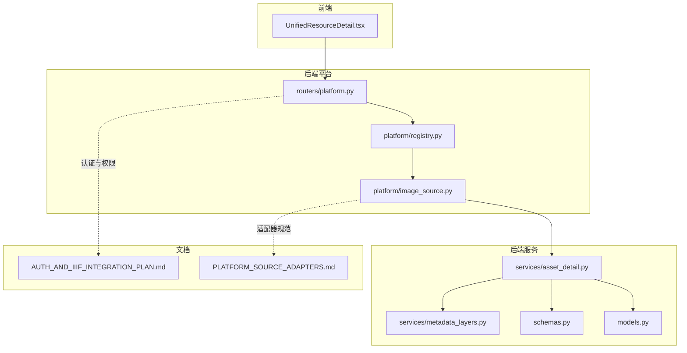
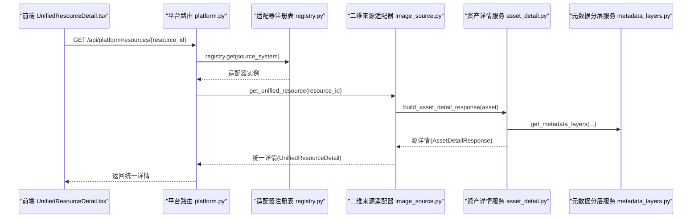
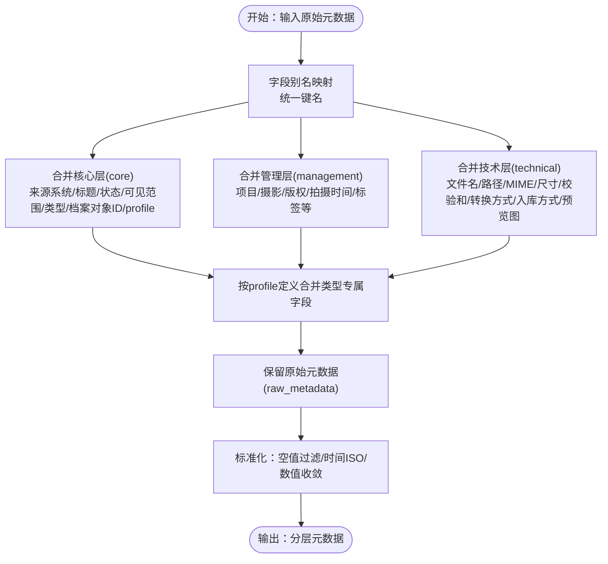
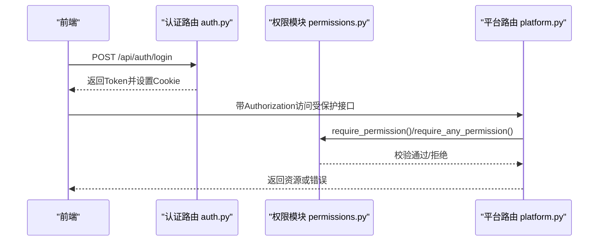
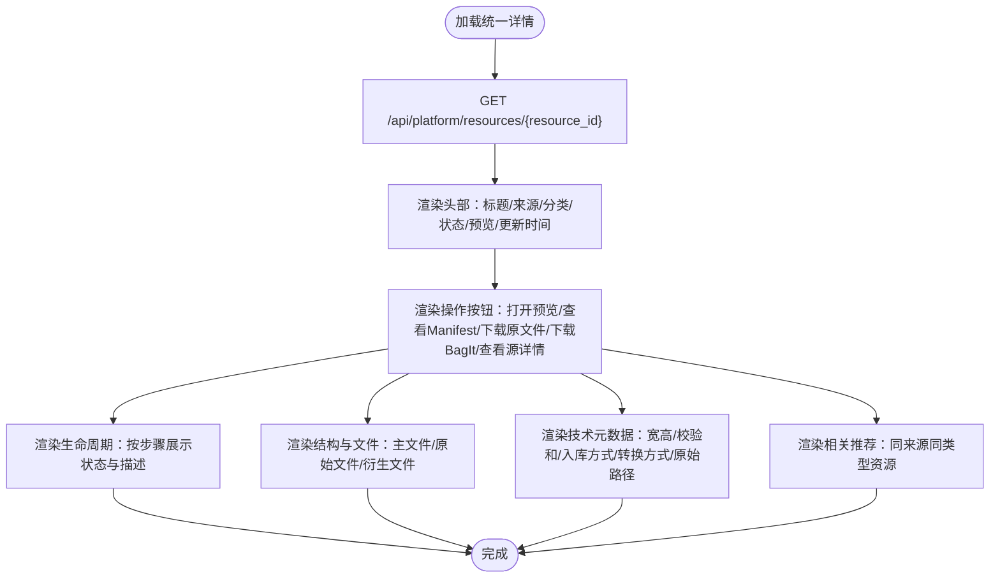
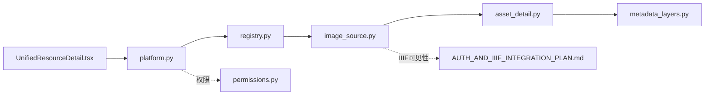

# 统一资源详情展示

<cite>
**本文引用的文件**
- [UnifiedResourceDetail.tsx](file://frontend/src/components/UnifiedResourceDetail.tsx)
- [platform.py](file://backend/app/routers/platform.py)
- [image_source.py](file://backend/app/platform/image_source.py)
- [metadata_layers.py](file://backend/app/services/metadata_layers.py)
- [asset_detail.py](file://backend/app/services/asset_detail.py)
- [schemas.py](file://backend/app/schemas.py)
- [models.py](file://backend/app/models.py)
- [registry.py](file://backend/app/platform/registry.py)
- [AUTH_AND_IIIF_INTEGRATION_PLAN.md](file://docs/02-架构设计/AUTH_AND_IIIF_INTEGRATION_PLAN.md)
- [PLATFORM_SOURCE_ADAPTERS.md](file://docs/02-架构设计/PLATFORM_SOURCE_ADAPTERS.md)
- [metadata.py](file://backend/app/utils/metadata.py)
- [permissions.py](file://backend/app/permissions.py)
- [auth.py](file://backend/app/routers/auth.py)
</cite>

## 目录
1. [简介](#简介)
2. [项目结构](#项目结构)
3. [核心组件](#核心组件)
4. [架构总览](#架构总览)
5. [详细组件分析](#详细组件分析)
6. [依赖分析](#依赖分析)
7. [性能考虑](#性能考虑)
8. [故障排除指南](#故障排除指南)
9. [结论](#结论)
10. [附录](#附录)

## 简介
本文件面向MDAMS原型项目的“统一资源详情展示”，围绕以下目标展开：
- 元数据合并策略：字段映射、数据转换、冲突处理、优先级规则
- 来源标识机制：来源系统标注、原始ID保留、来源链接、版权信息等
- 版本信息管理：版本历史、变更记录、版本对比、回滚机制
- 访问控制集成：权限继承、细粒度控制、动态授权、审计追踪
- 详情页面渲染逻辑与组件设计：UI布局、交互流程、数据绑定
- 展示配置示例与用户界面说明

## 项目结构
统一资源详情由“平台层适配器 + 源系统详情 + 前端详情页”三层协作完成：
- 平台层路由：统一入口聚合来源系统资源与详情
- 适配器层：将源系统资源转换为统一视图
- 源系统详情：基于资产元数据构建平台层“源详情”
- 前端详情页：渲染统一详情与源详情，提供预览、下载、相关推荐等功能

图表来源
- [platform.py:15-65](file://backend/app/routers/platform.py#L15-L65)
- [registry.py:8-24](file://backend/app/platform/registry.py#L8-L24)
- [image_source.py:50-194](file://backend/app/platform/image_source.py#L50-L194)
- [asset_detail.py:189-385](file://backend/app/services/asset_detail.py#L189-L385)
- [metadata_layers.py:412-541](file://backend/app/services/metadata_layers.py#L412-L541)
- [schemas.py:147-177](file://backend/app/schemas.py#L147-L177)
- [models.py:6-26](file://backend/app/models.py#L6-L26)
- [AUTH_AND_IIIF_INTEGRATION_PLAN.md:1-59](file://docs/02-架构设计/AUTH_AND_IIIF_INTEGRATION_PLAN.md#L1-L59)
- [PLATFORM_SOURCE_ADAPTERS.md:1-71](file://docs/02-架构设计/PLATFORM_SOURCE_ADAPTERS.md#L1-L71)

章节来源
- [platform.py:15-65](file://backend/app/routers/platform.py#L15-L65)
- [image_source.py:50-194](file://backend/app/platform/image_source.py#L50-L194)
- [registry.py:8-24](file://backend/app/platform/registry.py#L8-L24)
- [asset_detail.py:189-385](file://backend/app/services/asset_detail.py#L189-L385)
- [metadata_layers.py:412-541](file://backend/app/services/metadata_layers.py#L412-L541)
- [schemas.py:147-177](file://backend/app/schemas.py#L147-L177)
- [models.py:6-26](file://backend/app/models.py#L6-L26)
- [AUTH_AND_IIIF_INTEGRATION_PLAN.md:1-59](file://docs/02-架构设计/AUTH_AND_IIIF_INTEGRATION_PLAN.md#L1-L59)
- [PLATFORM_SOURCE_ADAPTERS.md:1-71](file://docs/02-架构设计/PLATFORM_SOURCE_ADAPTERS.md#L1-L71)

## 核心组件
- 平台路由与适配器
  - 平台路由提供统一资源目录与详情入口，按来源系统调度适配器
  - 二维来源适配器负责从资产表读取并生成统一摘要与详情
- 元数据分层服务
  - 将原始元数据按“核心/管理/技术/类型专属/原始”分层，支持字段别名映射与优先级覆盖
- 资产详情服务
  - 构建资产层面的结构、生命周期、访问路径、输出链接等
- 前端统一详情组件
  - 渲染统一标题、来源、状态、生命周期、结构与文件、技术元数据、相关推荐等

章节来源
- [platform.py:15-65](file://backend/app/routers/platform.py#L15-L65)
- [image_source.py:50-194](file://backend/app/platform/image_source.py#L50-L194)
- [metadata_layers.py:412-541](file://backend/app/services/metadata_layers.py#L412-L541)
- [asset_detail.py:189-385](file://backend/app/services/asset_detail.py#L189-L385)
- [UnifiedResourceDetail.tsx:86-470](file://frontend/src/components/UnifiedResourceDetail.tsx#L86-L470)

## 架构总览
统一资源详情的关键流程：
- 前端调用平台路由获取统一详情
- 平台路由根据统一ID解析来源系统与源ID
- 适配器查询源系统并构建统一摘要与详情
- 适配器同时返回“源详情”（资产详情），前端在详情页内展示

图表来源
- [platform.py:51-65](file://backend/app/routers/platform.py#L51-L65)
- [registry.py:15-24](file://backend/app/platform/registry.py#L15-L24)
- [image_source.py:154-194](file://backend/app/platform/image_source.py#L154-L194)
- [asset_detail.py:189-385](file://backend/app/services/asset_detail.py#L189-L385)
- [metadata_layers.py:510-541](file://backend/app/services/metadata_layers.py#L510-L541)

## 详细组件分析

### 元数据合并策略与字段映射
- 字段别名与优先级
  - 使用别名映射表将多语言/多来源字段归一化到统一键
  - 优先级：显式提供的“分层元数据”覆盖原始元数据，技术元数据可由派生策略自动填充
- 分层结构
  - 核心层：统一资源ID、来源系统、标题、状态、可见范围、类型、档案对象ID、profile键与标签
  - 管理层：项目类型、摄影师、版权归属、拍摄时间、影像类别、标签、记录人与时间等
  - 技术层：原始/访问文件名、路径、MIME、尺寸、校验和、转换方式、入库方式、预览图等
  - 类型专属层：按profile定义的字段集合
  - 原始元数据层：保留未归一化的原始字段
- 冲突处理
  - 若同一字段在多处出现，采用“显式覆盖隐式”的策略，即分层元数据覆盖原始元数据
  - 对空值进行标准化处理，避免None与空字符串混用
- 数据转换
  - 时间字段统一为ISO格式
  - 数值字段进行类型收敛（如宽高、文件大小）
  - 摘要与标签等采用结构化渲染

图表来源
- [metadata_layers.py:13-191](file://backend/app/services/metadata_layers.py#L13-L191)
- [metadata_layers.py:274-291](file://backend/app/services/metadata_layers.py#L274-L291)
- [metadata_layers.py:412-508](file://backend/app/services/metadata_layers.py#L412-L508)

章节来源
- [metadata_layers.py:13-191](file://backend/app/services/metadata_layers.py#L13-L191)
- [metadata_layers.py:274-291](file://backend/app/services/metadata_layers.py#L274-L291)
- [metadata_layers.py:412-508](file://backend/app/services/metadata_layers.py#L412-L508)

### 来源标识机制
- 来源系统标注
  - 统一详情包含来源系统标识与来源标签，便于用户识别数据来源
- 原始ID保留
  - 统一ID采用“来源系统:源ID”的形式，前端可据此打开源详情或跳转到源系统
- 来源链接
  - 统一详情提供“源详情URL”与“平台详情URL”，支持在统一页与源系统间跳转
- 版权信息
  - 管理层包含版权归属字段，适配器在统一摘要中可展示版权相关信息

章节来源
- [image_source.py:177-193](file://backend/app/platform/image_source.py#L177-L193)
- [schemas.py:147-177](file://backend/app/schemas.py#L147-L177)

### 版本信息管理
- 版本历史
  - 在二维影像记录中，替换资产时会记录替换历史，包含替换时间、操作人、备注与关联记录ID
- 变更记录
  - 影像记录支持审计追踪，记录操作、操作人、时间与备注
- 版本对比与回滚
  - 当前实现聚焦于替换历史与审计追踪，未提供通用的版本对比与回滚API；建议在统一平台层扩展版本契约后再实现

章节来源
- [image_source.py:439-463](file://backend/app/platform/image_source.py#L439-L463)
- [image_records.py:154-178](file://backend/app/routers/image_records.py#L154-L178)

### 访问控制集成
- 权限继承
  - 平台层路由与关键接口均依赖权限依赖，确保只有具备相应权限的用户才能访问
- 细粒度控制
  - 通过角色到权限映射实现菜单与接口级别的细粒度控制
- 动态授权
  - 前端登录后携带Bearer Token，后端基于会话解析用户角色与权限
- 审计追踪
  - 影像记录的审计追踪记录关键操作与操作人，便于追溯

图表来源
- [auth.py:53-83](file://backend/app/routers/auth.py#L53-L83)
- [permissions.py:214-237](file://backend/app/permissions.py#L214-L237)
- [platform.py:15-65](file://backend/app/routers/platform.py#L15-L65)

章节来源
- [AUTH_AND_IIIF_INTEGRATION_PLAN.md:1-59](file://docs/02-架构设计/AUTH_AND_IIIF_INTEGRATION_PLAN.md#L1-L59)
- [permissions.py:17-94](file://backend/app/permissions.py#L17-L94)
- [auth.py:53-83](file://backend/app/routers/auth.py#L53-L83)

### 详情页面渲染逻辑与组件设计
- 页面布局
  - 左侧大图预览区，右侧卡片区展示标题、来源、分类、状态、预览、更新时间与操作按钮
  - 生命周期与结构文件卡片展示处理轨迹与文件层次
  - 技术元数据卡片展示宽高、校验和、入库/转换方式、原始文件路径等
  - 相关推荐卡片按来源系统与类型筛选，展示相似资源
- 渲染要点
  - 状态标签与颜色映射，预览开关与下载按钮的可用性
  - 技术元数据的复制与格式化显示
  - 相关推荐的懒加载与错误兜底

图表来源
- [UnifiedResourceDetail.tsx:99-150](file://frontend/src/components/UnifiedResourceDetail.tsx#L99-L150)
- [UnifiedResourceDetail.tsx:191-467](file://frontend/src/components/UnifiedResourceDetail.tsx#L191-L467)

章节来源
- [UnifiedResourceDetail.tsx:86-470](file://frontend/src/components/UnifiedResourceDetail.tsx#L86-L470)

### 展示配置示例与用户界面说明
- 统一资源列表筛选
  - 支持按关键字、状态、预览状态、资源类型、profile键筛选
- 统一详情字段
  - 统一标题、来源系统/标签、资源类型、状态、预览可用性、生命周期、结构与文件、技术元数据、相关推荐
- 操作入口
  - 打开预览（Mirador）、查看Manifest、下载原文件、下载BagIt、查看源详情

章节来源
- [image_source.py:20-47](file://backend/app/platform/image_source.py#L20-L47)
- [image_source.py:50-151](file://backend/app/platform/image_source.py#L50-L151)
- [schemas.py:147-177](file://backend/app/schemas.py#L147-L177)
- [UnifiedResourceDetail.tsx:306-351](file://frontend/src/components/UnifiedResourceDetail.tsx#L306-L351)

## 依赖分析
- 组件耦合
  - 平台路由依赖适配器注册表；适配器依赖资产详情服务与元数据分层服务
  - 前端统一详情组件依赖后端统一详情模型与HTTP客户端
- 外部依赖
  - 认证与权限模块提供统一的鉴权与授权能力
  - IIIF访问控制与可见范围策略影响预览可用性

图表来源
- [platform.py:15-65](file://backend/app/routers/platform.py#L15-L65)
- [registry.py:8-24](file://backend/app/platform/registry.py#L8-L24)
- [image_source.py:50-194](file://backend/app/platform/image_source.py#L50-L194)
- [asset_detail.py:189-385](file://backend/app/services/asset_detail.py#L189-L385)
- [metadata_layers.py:412-541](file://backend/app/services/metadata_layers.py#L412-L541)
- [permissions.py:214-237](file://backend/app/permissions.py#L214-L237)
- [AUTH_AND_IIIF_INTEGRATION_PLAN.md:42-59](file://docs/02-架构设计/AUTH_AND_IIIF_INTEGRATION_PLAN.md#L42-L59)

章节来源
- [platform.py:15-65](file://backend/app/routers/platform.py#L15-L65)
- [registry.py:8-24](file://backend/app/platform/registry.py#L8-L24)
- [image_source.py:50-194](file://backend/app/platform/image_source.py#L50-L194)
- [asset_detail.py:189-385](file://backend/app/services/asset_detail.py#L189-L385)
- [metadata_layers.py:412-541](file://backend/app/services/metadata_layers.py#L412-L541)
- [permissions.py:214-237](file://backend/app/permissions.py#L214-L237)
- [AUTH_AND_IIIF_INTEGRATION_PLAN.md:42-59](file://docs/02-架构设计/AUTH_AND_IIIF_INTEGRATION_PLAN.md#L42-L59)

## 性能考虑
- 前端
  - 列表与详情采用懒加载与分页，避免一次性渲染大量数据
  - 预览图片使用缩略图与占位符，提升首屏体验
- 后端
  - 适配器查询时按条件过滤（状态、类型、预览可用性），减少无关数据传输
  - 元数据分层在服务层集中处理，避免重复计算

## 故障排除指南
- 统一详情加载失败
  - 检查统一ID格式（来源系统:源ID），确认适配器存在且可解析
  - 查看后端错误响应中的detail字段，定位具体问题
- 预览不可用
  - 确认IIIF访问准备状态与访问源文件是否存在
  - 检查权限与可见范围策略是否允许当前用户访问
- 相关推荐为空
  - 确认同来源同类型的资源是否存在，或筛选条件是否过于严格

章节来源
- [platform.py:51-65](file://backend/app/routers/platform.py#L51-L65)
- [image_source.py:154-194](file://backend/app/platform/image_source.py#L154-L194)
- [AUTH_AND_IIIF_INTEGRATION_PLAN.md:42-59](file://docs/02-架构设计/AUTH_AND_IIIF_INTEGRATION_PLAN.md#L42-L59)

## 结论
统一资源详情通过“平台适配器 + 源系统详情 + 前端详情页”的分层设计，实现了来源聚合、元数据归一与可视化展示。元数据分层服务提供了完善的字段映射、优先级与冲突处理机制；访问控制与IIIF策略保障了安全与可见性；前端组件提供了直观的交互与丰富的展示能力。版本管理与审计追踪在二维影像记录中已有实践基础，可在统一平台层逐步扩展。

## 附录
- 术语
  - 统一资源ID：来源系统:源ID
  - 分层元数据：core/management/technical/profile/raw_metadata
- 参考文档
  - 平台来源适配器规范
  - 认证与IIIF访问控制方案

章节来源
- [PLATFORM_SOURCE_ADAPTERS.md:1-71](file://docs/02-架构设计/PLATFORM_SOURCE_ADAPTERS.md#L1-L71)
- [AUTH_AND_IIIF_INTEGRATION_PLAN.md:1-59](file://docs/02-架构设计/AUTH_AND_IIIF_INTEGRATION_PLAN.md#L1-L59)