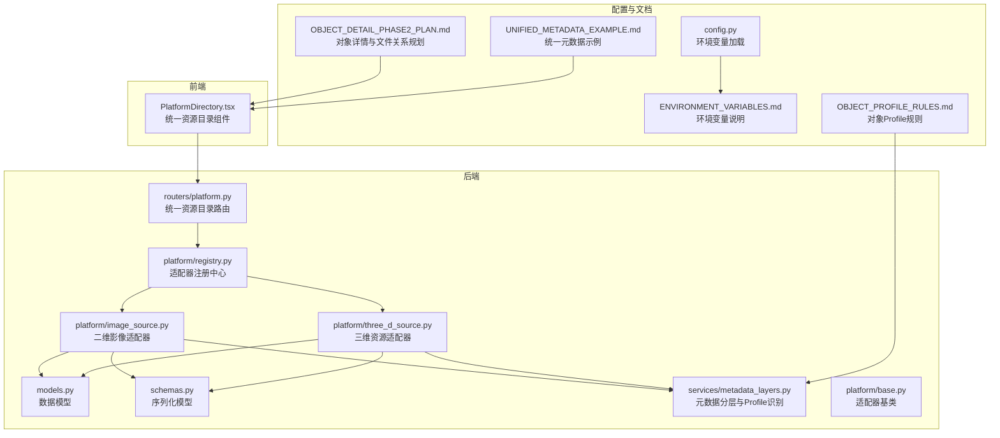
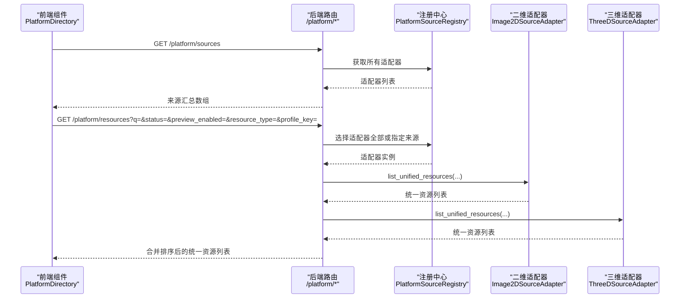
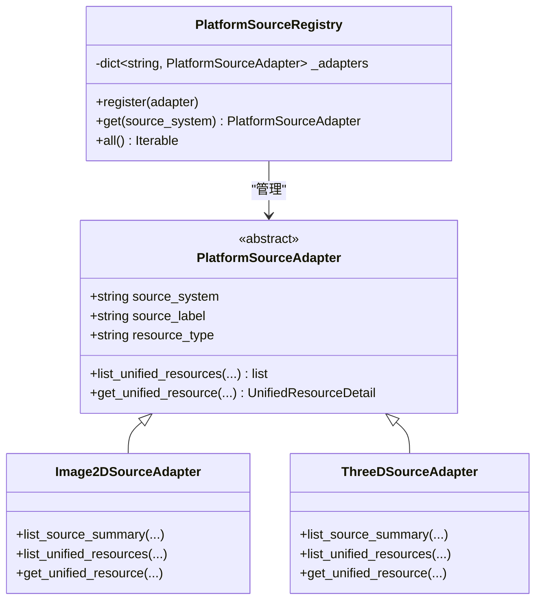
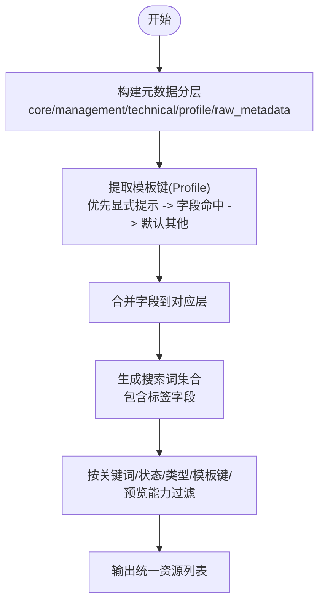
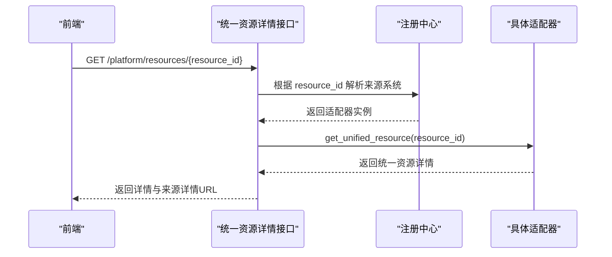
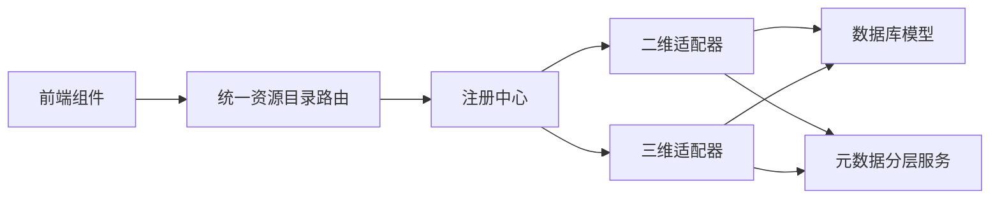

# 资源目录组织

<cite>
**本文引用的文件**
- [backend/app/models.py](file://backend/app/models.py)
- [backend/app/schemas.py](file://backend/app/schemas.py)
- [backend/app/platform/base.py](file://backend/app/platform/base.py)
- [backend/app/platform/registry.py](file://backend/app/platform/registry.py)
- [backend/app/platform/image_source.py](file://backend/app/platform/image_source.py)
- [backend/app/platform/three_d_source.py](file://backend/app/platform/three_d_source.py)
- [backend/app/routers/platform.py](file://backend/app/routers/platform.py)
- [backend/app/services/metadata_layers.py](file://backend/app/services/metadata_layers.py)
- [frontend/src/components/PlatformDirectory.tsx](file://frontend/src/components/PlatformDirectory.tsx)
- [backend/app/config.py](file://backend/app/config.py)
- [docs/03-产品与流程/OBJECT_PROFILE_RULES.md](file://docs/03-产品与流程/OBJECT_PROFILE_RULES.md)
- [docs/04-实施方案/OBJECT_DETAIL_PHASE2_PLAN.md](file://docs/04-实施方案/OBJECT_DETAIL_PHASE2_PLAN.md)
- [docs/06-参考资料/UNIFIED_METADATA_EXAMPLE.md](file://docs/06-参考资料/UNIFIED_METADATA_EXAMPLE.md)
- [docs/05-部署与运维/ENVIRONMENT_VARIABLES.md](file://docs/05-部署与运维/ENVIRONMENT_VARIABLES.md)
</cite>

## 目录
1. [简介](#简介)
2. [项目结构](#项目结构)
3. [核心组件](#核心组件)
4. [架构总览](#架构总览)
5. [详细组件分析](#详细组件分析)
6. [依赖分析](#依赖分析)
7. [性能考量](#性能考量)
8. [故障排查指南](#故障排查指南)
9. [结论](#结论)
10. [附录](#附录)

## 简介
本文件面向 MDAMS 原型项目的“资源目录组织”主题，系统化阐述资源的分类体系、标签管理、层级关系维护、导航设计原则、配置与维护策略，并提供可操作的配置示例与目录结构图解。文档以平台适配器与统一资源目录为核心，结合元数据分层、对象 Profile 识别、前端目录组件与后端路由，形成从数据模型到用户界面的完整说明。

## 项目结构
围绕资源目录组织的关键模块分布如下：
- 后端数据模型与服务
  - 数据模型：资产、二维影像、三维资源等
  - 元数据分层服务：统一元数据构建、对象 Profile 识别
  - 平台适配器：二维影像、三维资源等子系统适配器
  - 路由：统一资源目录的聚合接口
- 前端组件
  - 平台目录组件：统一资源目录的筛选、查询与操作入口
- 配置与运维
  - 环境变量与部署说明

图表来源
- [backend/app/models.py:1-307](file://backend/app/models.py#L1-L307)
- [backend/app/schemas.py:1-652](file://backend/app/schemas.py#L1-L652)
- [backend/app/platform/base.py:1-42](file://backend/app/platform/base.py#L1-L42)
- [backend/app/platform/registry.py:1-24](file://backend/app/platform/registry.py#L1-L24)
- [backend/app/platform/image_source.py:1-228](file://backend/app/platform/image_source.py#L1-L228)
- [backend/app/platform/three_d_source.py:1-224](file://backend/app/platform/three_d_source.py#L1-L224)
- [backend/app/routers/platform.py:1-65](file://backend/app/routers/platform.py#L1-L65)
- [backend/app/services/metadata_layers.py:1-636](file://backend/app/services/metadata_layers.py#L1-L636)
- [frontend/src/components/PlatformDirectory.tsx:1-273](file://frontend/src/components/PlatformDirectory.tsx#L1-L273)
- [backend/app/config.py:1-72](file://backend/app/config.py#L1-L72)
- [docs/03-产品与流程/OBJECT_PROFILE_RULES.md:1-26](file://docs/03-产品与流程/OBJECT_PROFILE_RULES.md#L1-L26)
- [docs/04-实施方案/OBJECT_DETAIL_PHASE2_PLAN.md:1-192](file://docs/04-实施方案/OBJECT_DETAIL_PHASE2_PLAN.md#L1-L192)
- [docs/06-参考资料/UNIFIED_METADATA_EXAMPLE.md:182-264](file://docs/06-参考资料/UNIFIED_METADATA_EXAMPLE.md#L182-L264)
- [docs/05-部署与运维/ENVIRONMENT_VARIABLES.md:1-86](file://docs/05-部署与运维/ENVIRONMENT_VARIABLES.md#L1-L86)

章节来源
- [backend/app/models.py:1-307](file://backend/app/models.py#L1-L307)
- [backend/app/schemas.py:1-652](file://backend/app/schemas.py#L1-L652)
- [backend/app/platform/base.py:1-42](file://backend/app/platform/base.py#L1-L42)
- [backend/app/platform/registry.py:1-24](file://backend/app/platform/registry.py#L1-L24)
- [backend/app/platform/image_source.py:1-228](file://backend/app/platform/image_source.py#L1-L228)
- [backend/app/platform/three_d_source.py:1-224](file://backend/app/platform/three_d_source.py#L1-L224)
- [backend/app/routers/platform.py:1-65](file://backend/app/routers/platform.py#L1-L65)
- [backend/app/services/metadata_layers.py:1-636](file://backend/app/services/metadata_layers.py#L1-L636)
- [frontend/src/components/PlatformDirectory.tsx:1-273](file://frontend/src/components/PlatformDirectory.tsx#L1-L273)
- [backend/app/config.py:1-72](file://backend/app/config.py#L1-L72)
- [docs/03-产品与流程/OBJECT_PROFILE_RULES.md:1-26](file://docs/03-产品与流程/OBJECT_PROFILE_RULES.md#L1-L26)
- [docs/04-实施方案/OBJECT_DETAIL_PHASE2_PLAN.md:1-192](file://docs/04-实施方案/OBJECT_DETAIL_PHASE2_PLAN.md#L1-L192)
- [docs/06-参考资料/UNIFIED_METADATA_EXAMPLE.md:182-264](file://docs/06-参考资料/UNIFIED_METADATA_EXAMPLE.md#L182-L264)
- [docs/05-部署与运维/ENVIRONMENT_VARIABLES.md:1-86](file://docs/05-部署与运维/ENVIRONMENT_VARIABLES.md#L1-L86)

## 核心组件
- 平台适配器与注册中心
  - 适配器基类定义统一接口：来源汇总、统一资源列表、统一资源详情
  - 注册中心集中管理适配器实例，支持按来源系统查询
- 统一资源目录路由
  - 提供来源系统列表与统一资源列表接口，支持按关键词、状态、资源类型、模板键、预览能力等过滤
- 元数据分层与对象 Profile
  - 将元数据划分为 core、management、technical、profile、raw_metadata 等层，自动识别对象模板键（Profile）
- 前端平台目录组件
  - 支持关键词搜索、状态筛选、预览能力筛选、资源类型筛选、模板键筛选，展示来源汇总与统一资源列表

章节来源
- [backend/app/platform/base.py:14-42](file://backend/app/platform/base.py#L14-L42)
- [backend/app/platform/registry.py:8-24](file://backend/app/platform/registry.py#L8-L24)
- [backend/app/routers/platform.py:15-65](file://backend/app/routers/platform.py#L15-L65)
- [backend/app/services/metadata_layers.py:412-540](file://backend/app/services/metadata_layers.py#L412-L540)
- [frontend/src/components/PlatformDirectory.tsx:10-273](file://frontend/src/components/PlatformDirectory.tsx#L10-L273)

## 架构总览
统一资源目录通过适配器模式聚合多子系统资源，后端路由将请求分发给各适配器，适配器根据各自数据模型与元数据服务构建统一资源摘要与详情。前端组件负责交互与筛选，最终形成“统一检索—统一展示—统一入口”的目录体验。

图表来源
- [backend/app/routers/platform.py:15-65](file://backend/app/routers/platform.py#L15-L65)
- [backend/app/platform/registry.py:8-24](file://backend/app/platform/registry.py#L8-L24)
- [backend/app/platform/image_source.py:50-151](file://backend/app/platform/image_source.py#L50-L151)
- [backend/app/platform/three_d_source.py:70-158](file://backend/app/platform/three_d_source.py#L70-L158)
- [frontend/src/components/PlatformDirectory.tsx:45-76](file://frontend/src/components/PlatformDirectory.tsx#L45-L76)

## 详细组件分析

### 分类体系设计
- 分类维度
  - 资源类型：二维文化对象、三维包、点云、倾斜摄影等
  - 模板键（Profile）：可移动文物、不可移动文物、艺术摄影、业务活动、全景、古树、考古、其他
  - 状态：处理中、就绪、异常
  - 预览能力：可预览/仅可下载
- 分类规则
  - 二维资源：依据资产状态与 IIIF 就绪状态确定预览能力
  - 三维资源：依据 Web 预览状态与整体状态确定预览能力
  - 模板键识别：优先显式提示，其次字段命中，最后默认为“其他”
- 继承关系
  - 适配器继承统一基类，注册中心集中管理
  - 路由层按来源系统选择适配器，实现“多来源统一聚合”

图表来源
- [backend/app/platform/base.py:14-42](file://backend/app/platform/base.py#L14-L42)
- [backend/app/platform/image_source.py:196-227](file://backend/app/platform/image_source.py#L196-L227)
- [backend/app/platform/three_d_source.py:192-223](file://backend/app/platform/three_d_source.py#L192-L223)
- [backend/app/platform/registry.py:8-24](file://backend/app/platform/registry.py#L8-L24)

章节来源
- [docs/03-产品与流程/OBJECT_PROFILE_RULES.md:13-26](file://docs/03-产品与流程/OBJECT_PROFILE_RULES.md#L13-L26)
- [backend/app/platform/image_source.py:50-151](file://backend/app/platform/image_source.py#L50-L151)
- [backend/app/platform/three_d_source.py:70-158](file://backend/app/platform/three_d_source.py#L70-L158)
- [backend/app/platform/base.py:14-42](file://backend/app/platform/base.py#L14-L42)
- [backend/app/platform/registry.py:8-24](file://backend/app/platform/registry.py#L8-L24)

### 标签管理系统
- 标签定义
  - 管理层字段包含“标签”字段，用于承载资源标签
- 标签关联
  - 标签随资源元数据一起存储，统一在管理层暴露
- 标签查询
  - 统一资源列表接口支持按关键词模糊匹配，标签值参与搜索词拼接
- 标签统计
  - 通过统一资源列表与来源汇总，可统计各来源资源数量与状态分布

图表来源
- [backend/app/services/metadata_layers.py:412-540](file://backend/app/services/metadata_layers.py#L412-L540)
- [backend/app/platform/image_source.py:110-130](file://backend/app/platform/image_source.py#L110-L130)
- [backend/app/platform/three_d_source.py:110-135](file://backend/app/platform/three_d_source.py#L110-L135)

章节来源
- [backend/app/services/metadata_layers.py:40-86](file://backend/app/services/metadata_layers.py#L40-L86)
- [backend/app/platform/image_source.py:110-130](file://backend/app/platform/image_source.py#L110-L130)
- [backend/app/platform/three_d_source.py:110-135](file://backend/app/platform/three_d_source.py#L110-L135)

### 层级关系维护
- 父子关系
  - 统一资源 ID 采用“来源系统:资源ID”的形式，便于跨子系统唯一标识
- 兄弟关系
  - 同一来源内的资源通过统一字段进行排序与对比
- 循环依赖检测
  - 统一资源 ID 解析与来源系统校验，避免非法 ID 引发的循环引用
- 关系变更
  - 通过适配器的统一资源详情接口返回来源详情 URL，确保关系变更时入口稳定

图表来源
- [backend/app/routers/platform.py:51-65](file://backend/app/routers/platform.py#L51-L65)
- [backend/app/platform/registry.py:15-19](file://backend/app/platform/registry.py#L15-L19)
- [backend/app/platform/image_source.py:154-193](file://backend/app/platform/image_source.py#L154-L193)
- [backend/app/platform/three_d_source.py:161-189](file://backend/app/platform/three_d_source.py#L161-L189)

章节来源
- [backend/app/routers/platform.py:51-65](file://backend/app/routers/platform.py#L51-L65)
- [backend/app/platform/image_source.py:154-193](file://backend/app/platform/image_source.py#L154-L193)
- [backend/app/platform/three_d_source.py:161-189](file://backend/app/platform/three_d_source.py#L161-L189)

### 导航设计原则
- 用户体验
  - 提供关键词搜索、状态/预览能力/资源类型/模板键等多维筛选
  - 统一资源列表展示来源、标题、模板、状态、更新时间与操作按钮
- 性能考虑
  - 路由层对适配器结果进行排序与合并，减少前端重复计算
  - 适配器内部按需查询与过滤，避免全量扫描
- 可扩展性
  - 适配器基类与注册中心解耦，新增来源只需实现适配器并注册
- 国际化支持
  - 元数据分层中提供英文标签渲染示例，便于国际化扩展

章节来源
- [frontend/src/components/PlatformDirectory.tsx:10-273](file://frontend/src/components/PlatformDirectory.tsx#L10-L273)
- [backend/app/services/metadata_layers.py:608-635](file://backend/app/services/metadata_layers.py#L608-L635)

### 配置指南与维护策略
- 环境变量
  - 数据库、Redis、API 公网地址、Cantaloupe 地址、AI 服务参数、上传目录、图像处理参数等
- 维护策略
  - 优先通过 .env 调整，容器内路径保持稳定
  - 对外 URL 通过环境变量统一控制，便于多环境部署
  - 适配器注册与路由扩展遵循现有模式，确保统一资源 ID 与来源系统一致

章节来源
- [backend/app/config.py:42-72](file://backend/app/config.py#L42-L72)
- [docs/05-部署与运维/ENVIRONMENT_VARIABLES.md:10-86](file://docs/05-部署与运维/ENVIRONMENT_VARIABLES.md#L10-L86)

### 目录结构图解
- 统一资源目录的字段与来源系统
  - 统一资源 ID、来源系统与来源标签、标题、资源类型、模板键与标签、状态、预览能力、更新时间、详情与清单链接
- 统一元数据示例
  - 列表与详情接口返回统一字段风格，便于跨系统聚合展示

章节来源
- [docs/06-参考资料/UNIFIED_METADATA_EXAMPLE.md:205-264](file://docs/06-参考资料/UNIFIED_METADATA_EXAMPLE.md#L205-L264)
- [backend/app/platform/image_source.py:134-150](file://backend/app/platform/image_source.py#L134-L150)
- [backend/app/platform/three_d_source.py:141-157](file://backend/app/platform/three_d_source.py#L141-L157)

## 依赖分析
- 组件耦合
  - 路由层依赖注册中心与适配器接口，适配器依赖数据模型与元数据服务
  - 前端组件依赖后端统一接口，不直接依赖具体子系统
- 外部依赖
  - 数据库、Redis、Cantaloupe、AI 服务等通过环境变量注入
- 潜在风险
  - 统一资源 ID 解析失败会导致 400/404 错误
  - 适配器未注册或来源系统不匹配会导致空列表

图表来源
- [backend/app/routers/platform.py:15-65](file://backend/app/routers/platform.py#L15-L65)
- [backend/app/platform/registry.py:8-24](file://backend/app/platform/registry.py#L8-L24)
- [backend/app/platform/image_source.py:1-228](file://backend/app/platform/image_source.py#L1-L228)
- [backend/app/platform/three_d_source.py:1-224](file://backend/app/platform/three_d_source.py#L1-L224)
- [backend/app/services/metadata_layers.py:1-636](file://backend/app/services/metadata_layers.py#L1-L636)

章节来源
- [backend/app/routers/platform.py:15-65](file://backend/app/routers/platform.py#L15-L65)
- [backend/app/platform/registry.py:8-24](file://backend/app/platform/registry.py#L8-L24)
- [backend/app/platform/image_source.py:1-228](file://backend/app/platform/image_source.py#L1-L228)
- [backend/app/platform/three_d_source.py:1-224](file://backend/app/platform/three_d_source.py#L1-L224)
- [backend/app/services/metadata_layers.py:1-636](file://backend/app/services/metadata_layers.py#L1-L636)

## 性能考量
- 查询优化
  - 适配器内部按关键词、状态、类型、模板键、预览能力进行过滤，减少无效数据传输
  - 路由层对结果按更新时间倒序合并，保证最新资源优先展示
- 渲染优化
  - 前端组件使用分页与懒加载，降低首屏压力
- 存储与缓存
  - 通过 Redis 与数据库连接池优化并发访问

## 故障排查指南
- 统一资源 ID 解析失败
  - 现象：返回 400 错误
  - 排查：确认 resource_id 是否为“来源系统:资源ID”的格式
- 来源系统不存在
  - 现象：返回 404 错误
  - 排查：确认来源系统是否已在注册中心注册
- 资源不存在
  - 现象：返回 404 错误
  - 排查：确认资源 ID 是否正确，数据库是否存在对应记录
- 预览能力异常
  - 现象：预览按钮禁用或无法打开
  - 排查：检查资产状态与 IIIF 就绪状态（二维）或 Web 预览状态（三维）

章节来源
- [backend/app/routers/platform.py:51-65](file://backend/app/routers/platform.py#L51-L65)
- [backend/app/platform/image_source.py:154-193](file://backend/app/platform/image_source.py#L154-L193)
- [backend/app/platform/three_d_source.py:161-189](file://backend/app/platform/three_d_source.py#L161-L189)

## 结论
MDAMS 的资源目录组织以“统一资源 ID + 适配器 + 元数据分层”为核心，实现了多来源资源的统一检索与展示。通过模板键识别与标签管理，系统在通用性与对象语义之间取得平衡；通过前端目录组件与后端路由，形成了良好的用户体验与可扩展架构。建议在后续迭代中进一步完善事件边界表达与跨模态关联，以支撑更复杂的资源编排与研究场景。

## 附录
- 配置示例
  - 数据库连接：DATABASE_URL
  - API 公网地址：API_PUBLIC_URL
  - IIIF 服务地址：CANTALOUPE_PUBLIC_URL
  - 上传目录：UPLOAD_DIR
  - 图像处理参数：VIPS_DISC_THRESHOLD、VIPS_CONCURRENCY、JAVA_OPTS
- 维护建议
  - 优先通过 .env 调整，避免硬编码
  - 统一对外 URL，便于多环境部署
  - 新增来源系统时，遵循适配器基类与注册中心模式

章节来源
- [backend/app/config.py:42-72](file://backend/app/config.py#L42-L72)
- [docs/05-部署与运维/ENVIRONMENT_VARIABLES.md:10-86](file://docs/05-部署与运维/ENVIRONMENT_VARIABLES.md#L10-L86)