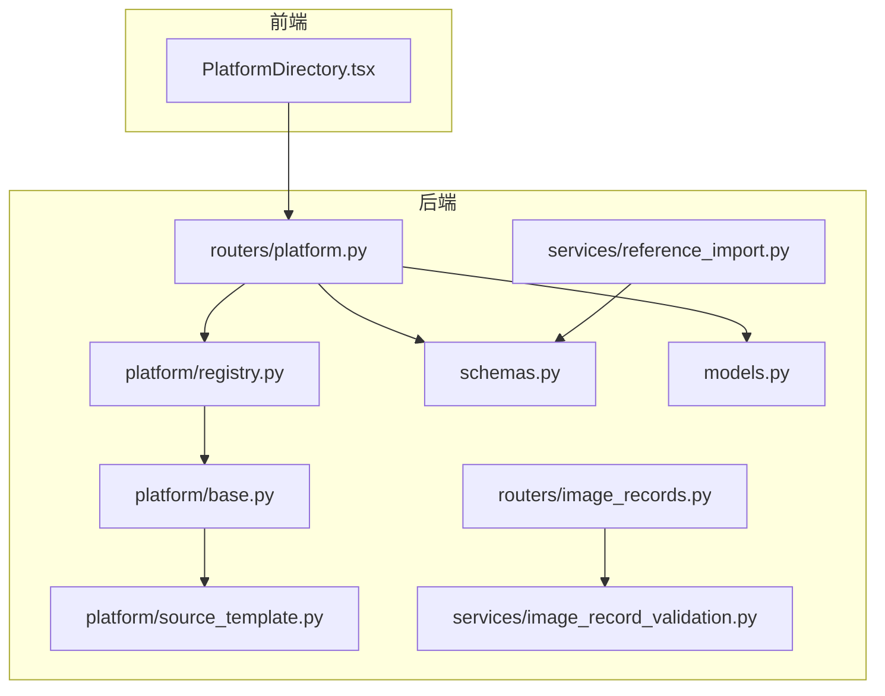
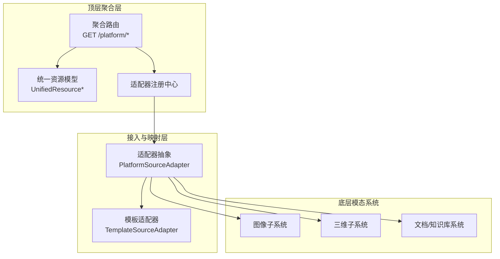
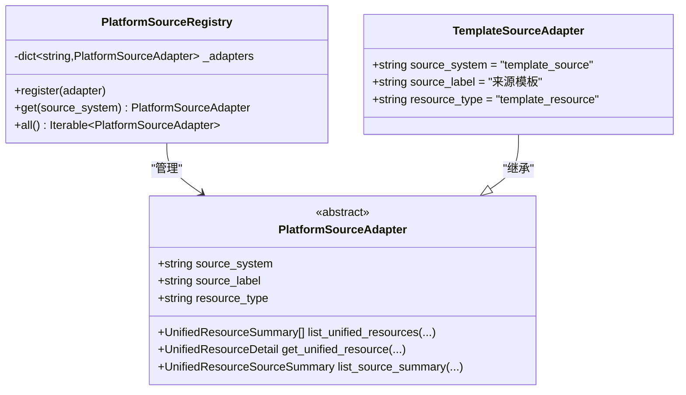
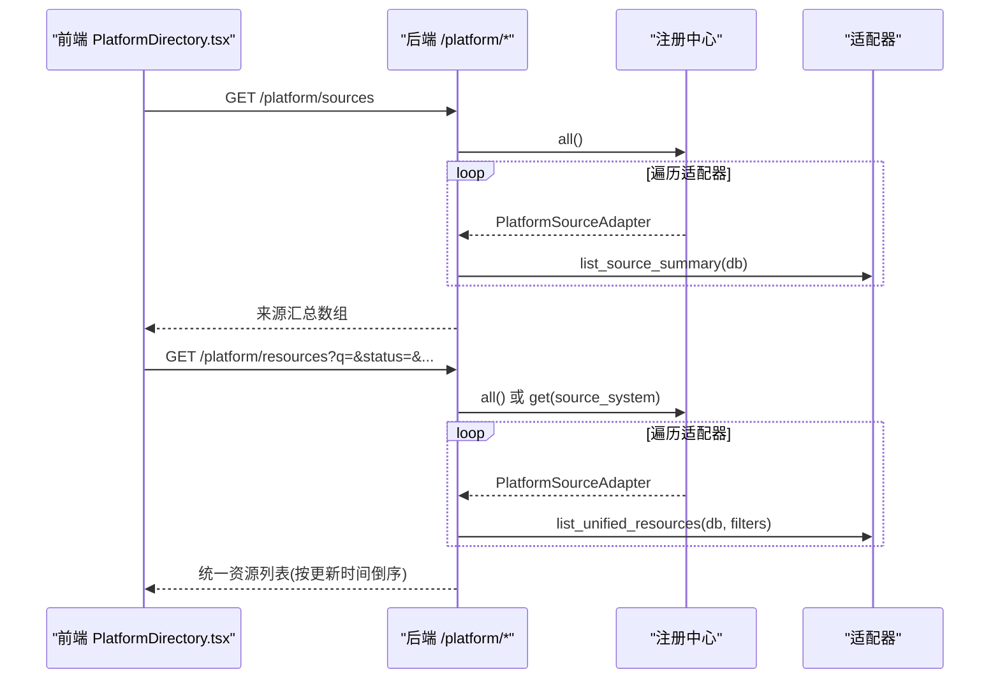
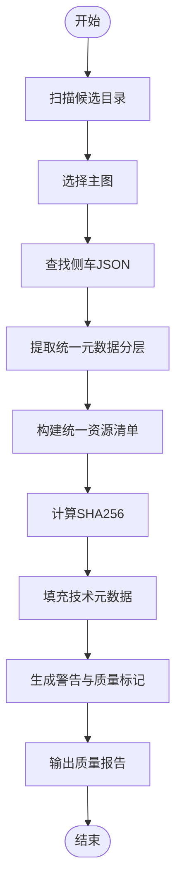
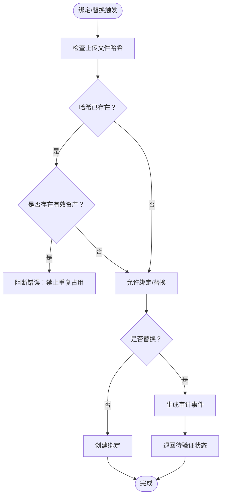
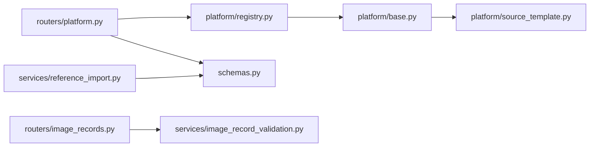

# 资源聚合机制

<cite>
**本文引用的文件**
- [DATA_INGEST_ARCHITECTURE.md](file://docs/02-架构设计/DATA_INGEST_ARCHITECTURE.md)
- [PROJECT_DIRECTION_AGGREGATION_ARCHITECTURE.md](file://docs/02-架构设计/PROJECT_DIRECTION_AGGREGATION_ARCHITECTURE.md)
- [platform/base.py](file://backend/app/platform/base.py)
- [platform/registry.py](file://backend/app/platform/registry.py)
- [platform/source_template.py](file://backend/app/platform/source_template.py)
- [routers/platform.py](file://backend/app/routers/platform.py)
- [schemas.py](file://backend/app/schemas.py)
- [models.py](file://backend/app/models.py)
- [services/reference_import.py](file://backend/app/services/reference_import.py)
- [routers/image_records.py](file://backend/app/routers/image_records.py)
- [services/image_record_validation.py](file://backend/app/services/image_record_validation.py)
- [IMAGE_RECORD_MATCHING_PHASE1_PLAN.md](file://docs/04-实施方案/IMAGE_RECORD_MATCHING_PHASE1_PLAN.md)
- [IMAGE_RECORD_VALIDATION_PHASE1_PLAN.md](file://docs/04-实施方案/IMAGE_RECORD_VALIDATION_PHASE1_PLAN.md)
- [PlatformDirectory.tsx](file://frontend/src/components/PlatformDirectory.tsx)
- [dashboard.spec.ts](file://frontend/tests/dashboard.spec.ts)
- [CROSS_SYSTEM_EVENT_BOUNDARY.md](file://docs/08-研究/跨子系统最小事件边界（CROSS_SYSTEM_EVENT_BOUNDARY）.md)
</cite>

## 目录
1. [简介](#简介)
2. [项目结构](#项目结构)
3. [核心组件](#核心组件)
4. [架构总览](#架构总览)
5. [详细组件分析](#详细组件分析)
6. [依赖分析](#依赖分析)
7. [性能考量](#性能考量)
8. [故障排查指南](#故障排查指南)
9. [结论](#结论)
10. [附录](#附录)

## 简介
本文件系统化阐述 MDAMS 原型项目的资源聚合机制，聚焦跨平台数据整合策略、统一模型、去重与冲突处理、同步与一致性保障、性能优化与监控指标，并给出可操作的聚合算法与配置要点。文档以“顶层聚合检索服务 + 多个独立模态资源系统”的架构为指导，围绕统一资源对象模型、适配器注册中心、路由聚合与详情解析、以及参考资源导入与质量评估等关键路径展开。

## 项目结构
- 后端采用 FastAPI + SQLAlchemy，按功能域划分模块：
  - 平台适配层：适配器抽象、注册中心、模板适配器
  - 路由层：统一聚合 API（来源概览、资源聚合、详情）
  - 服务层：参考资源导入、图像记录校验等
  - 模型与模式：统一资源模型、资产与图像记录模型
- 前端提供平台目录卡片，展示来源系统汇总与统一资源列表，支撑聚合入口与跳转。

图表来源
- [routers/platform.py:1-65](file://backend/app/routers/platform.py#L1-L65)
- [platform/registry.py:1-24](file://backend/app/platform/registry.py#L1-L24)
- [platform/base.py:1-42](file://backend/app/platform/base.py#L1-L42)
- [platform/source_template.py:1-39](file://backend/app/platform/source_template.py#L1-L39)
- [schemas.py:147-177](file://backend/app/schemas.py#L147-L177)
- [models.py:6-26](file://backend/app/models.py#L6-L26)
- [services/reference_import.py:1-420](file://backend/app/services/reference_import.py#L1-L420)
- [routers/image_records.py:340-379](file://backend/app/routers/image_records.py#L340-L379)
- [services/image_record_validation.py:463-500](file://backend/app/services/image_record_validation.py#L463-L500)

章节来源
- [routers/platform.py:1-65](file://backend/app/routers/platform.py#L1-L65)
- [platform/registry.py:1-24](file://backend/app/platform/registry.py#L1-L24)
- [platform/base.py:1-42](file://backend/app/platform/base.py#L1-L42)
- [platform/source_template.py:1-39](file://backend/app/platform/source_template.py#L1-L39)
- [schemas.py:147-177](file://backend/app/schemas.py#L147-L177)
- [models.py:6-26](file://backend/app/models.py#L6-L26)
- [services/reference_import.py:1-420](file://backend/app/services/reference_import.py#L1-L420)
- [routers/image_records.py:340-379](file://backend/app/routers/image_records.py#L340-L379)
- [services/image_record_validation.py:463-500](file://backend/app/services/image_record_validation.py#L463-L500)

## 核心组件
- 统一资源模型
  - 统一来源摘要、统一资源摘要、统一资源详情模型定义了聚合层对外的最小公共字段集，包括全局资源标识、来源系统、资源类型、标题、状态、预览与详情入口、更新时间等。
- 平台适配器与注册中心
  - 抽象适配器定义了来源概览、统一资源列表、统一资源详情三项能力；注册中心负责适配器的注册与获取；模板适配器提供新增适配器的骨架。
- 聚合路由
  - 提供来源系统列表、统一资源聚合列表、统一资源详情解析，支持按关键字、状态、类型、画像键、预览开关等筛选，并按更新时间倒序。
- 参考资源导入与质量评估
  - 从参考资源包扫描候选、提取主图、构建统一元数据分层、生成校验清单与质量标记，支撑批量导入与质量报告。
- 图像记录与去重策略
  - 基于哈希的重复检测、绑定规则与替换流程、状态机推进，确保 1:1 绑定与重复占用防护。

章节来源
- [schemas.py:147-177](file://backend/app/schemas.py#L147-L177)
- [platform/base.py:14-42](file://backend/app/platform/base.py#L14-L42)
- [platform/registry.py:8-24](file://backend/app/platform/registry.py#L8-L24)
- [platform/source_template.py:16-39](file://backend/app/platform/source_template.py#L16-L39)
- [routers/platform.py:15-65](file://backend/app/routers/platform.py#L15-L65)
- [services/reference_import.py:221-357](file://backend/app/services/reference_import.py#L221-L357)
- [routers/image_records.py:340-379](file://backend/app/routers/image_records.py#L340-L379)
- [services/image_record_validation.py:463-500](file://backend/app/services/image_record_validation.py#L463-L500)

## 架构总览
MDAMS 采用“顶层聚合 + 底层保留专业系统”的架构，统一资源模型与适配器模式实现跨系统聚合检索与统一视图；参考资源导入与质量评估为批量数据接入提供标准化流程；图像记录与去重策略保障数据一致性与可追溯性。

图表来源
- [PROJECT_DIRECTION_AGGREGATION_ARCHITECTURE.md:102-204](file://docs/02-架构设计/PROJECT_DIRECTION_AGGREGATION_ARCHITECTURE.md#L102-L204)
- [platform/base.py:14-42](file://backend/app/platform/base.py#L14-L42)
- [platform/registry.py:8-24](file://backend/app/platform/registry.py#L8-L24)
- [platform/source_template.py:16-39](file://backend/app/platform/source_template.py#L16-L39)
- [routers/platform.py:15-65](file://backend/app/routers/platform.py#L15-L65)

## 详细组件分析

### 统一资源模型与元数据分层
- 统一资源对象最小模型包含：全局资源标识、来源系统、来源对象标识、资源类型、标题、摘要、关键词、作者/责任者、权利与访问说明、访问级别、预览入口、统一详情入口、原系统详情入口、状态、最近更新时间等。
- 元数据分层（二维资源）：core、management、technical、profile、raw_metadata，分别承载平台统一目录、管理信息、技术与处理信息、对象类型语义、原始来源字段，支撑统一视图与专业系统内深字段并存。

章节来源
- [PROJECT_DIRECTION_AGGREGATION_ARCHITECTURE.md:348-376](file://docs/02-架构设计/PROJECT_DIRECTION_AGGREGATION_ARCHITECTURE.md#L348-L376)
- [DATA_INGEST_ARCHITECTURE.md:41-57](file://docs/02-架构设计/DATA_INGEST_ARCHITECTURE.md#L41-L57)
- [schemas.py:147-177](file://backend/app/schemas.py#L147-L177)

### 平台适配器与注册中心
- 适配器抽象定义三项能力：来源概览、统一资源列表、统一资源详情；适配器需声明 source_system、source_label、resource_type。
- 注册中心以 source_system 为键管理适配器实例，支持按系统筛选与全量遍历。
- 模板适配器提供新增适配器的最小实现骨架，便于快速接入新系统。

图表来源
- [platform/base.py:14-42](file://backend/app/platform/base.py#L14-L42)
- [platform/registry.py:8-24](file://backend/app/platform/registry.py#L8-L24)
- [platform/source_template.py:16-39](file://backend/app/platform/source_template.py#L16-L39)

章节来源
- [platform/base.py:14-42](file://backend/app/platform/base.py#L14-L42)
- [platform/registry.py:8-24](file://backend/app/platform/registry.py#L8-L24)
- [platform/source_template.py:16-39](file://backend/app/platform/source_template.py#L16-L39)

### 聚合路由与统一资源解析
- 聚合路由提供：
  - 来源系统列表：遍历注册中心，调用各适配器的来源概览。
  - 统一资源聚合：按筛选条件调用各适配器的统一资源列表，合并后按更新时间倒序。
  - 统一资源详情：解析 resource_id（source_system:source_id），路由到对应适配器的详情方法。
- 前端平台目录组件展示来源汇总与统一资源列表，提供统一检索与详情入口。

图表来源
- [routers/platform.py:15-65](file://backend/app/routers/platform.py#L15-L65)
- [platform/registry.py:8-24](file://backend/app/platform/registry.py#L8-L24)
- [schemas.py:147-177](file://backend/app/schemas.py#L147-L177)
- [PlatformDirectory.tsx:243-269](file://frontend/src/components/PlatformDirectory.tsx#L243-L269)

章节来源
- [routers/platform.py:15-65](file://backend/app/routers/platform.py#L15-L65)
- [PlatformDirectory.tsx:243-269](file://frontend/src/components/PlatformDirectory.tsx#L243-L269)

### 参考资源导入与质量评估
- 导入流程要点：
  - 扫描候选目录，选择主图，查找侧车 JSON，提取统一元数据分层，构建统一资源清单。
  - 计算 SHA256，填充技术元数据，保留原始侧车与模态来源记录。
  - 生成警告与质量标记，输出质量报告。
- 质量评估：
  - 按字段规则统计缺失项，计算完整性比率，输出缺失字段清单。

图表来源
- [services/reference_import.py:221-357](file://backend/app/services/reference_import.py#L221-L357)
- [services/reference_import.py:380-420](file://backend/app/services/reference_import.py#L380-L420)

章节来源
- [services/reference_import.py:221-357](file://backend/app/services/reference_import.py#L221-L357)
- [services/reference_import.py:380-420](file://backend/app/services/reference_import.py#L380-L420)

### 去重策略与冲突检测
- 唯一标识与去重
  - 使用 SHA256 哈希作为文件级唯一标识，避免重复内容占用。
  - 绑定规则：记录与资产严格 1:1，禁止二次有效绑定；替换为唯一允许的变更路径。
- 冲突检测与处理
  - 若上传文件哈希已存在于系统且为有效资产，则判定为阻断错误。
  - 文件名与记录号/藏品号一致性检查作为强告警提示。
- 替换流程
  - 替换后旧文件仅保留审计历史，新文件成为当前有效绑定，记录退回“待验证”状态。

图表来源
- [routers/image_records.py:364-371](file://backend/app/routers/image_records.py#L364-L371)
- [services/image_record_validation.py:463-500](file://backend/app/services/image_record_validation.py#L463-L500)
- [IMAGE_RECORD_VALIDATION_PHASE1_PLAN.md:142-153](file://docs/04-实施方案/IMAGE_RECORD_VALIDATION_PHASE1_PLAN.md#L142-L153)

章节来源
- [routers/image_records.py:364-371](file://backend/app/routers/image_records.py#L364-L371)
- [services/image_record_validation.py:463-500](file://backend/app/services/image_record_validation.py#L463-L500)
- [IMAGE_RECORD_VALIDATION_PHASE1_PLAN.md:104-153](file://docs/04-实施方案/IMAGE_RECORD_VALIDATION_PHASE1_PLAN.md#L104-L153)

### 冲突解决机制与审计
- 优先级与合并策略
  - 1:1 绑定优先，哈希冲突阻断；替换流程受控并生成审计事件。
- 人工干预
  - 显式确认绑定/替换，避免自动绑定导致误判。
- 审计日志
  - 替换生成审计事件，生命周期与处理轨迹在资产详情中体现；最小事件边界在二维生命周期、三维生产记录与输出层中逐步沉淀。

章节来源
- [IMAGE_RECORD_MATCHING_PHASE1_PLAN.md:46-87](file://docs/04-实施方案/IMAGE_RECORD_MATCHING_PHASE1_PLAN.md#L46-L87)
- [CROSS_SYSTEM_EVENT_BOUNDARY.md:175-201](file://docs/08-研究/跨子系统最小事件边界（CROSS_SYSTEM_EVENT_BOUNDARY）.md#L175-L201)

### 数据同步机制
- 同步方式
  - 聚合层通过适配器拉取来源系统摘要与资源列表；支持按来源系统筛选与全量聚合。
- 增量与全量
  - 增量：按来源系统定期拉取变更；全量：初始化或重置索引时执行。
- 一致性保障
  - 统一资源 ID 与来源系统/对象 ID 映射；状态字段与更新时间用于排序与刷新；哈希去重与替换流程降低重复与冲突。
- 前端入口
  - 平台目录展示来源健康状态、资源数量与入口地址，统一资源列表支持分页与筛选。

章节来源
- [routers/platform.py:15-65](file://backend/app/routers/platform.py#L15-L65)
- [schemas.py:147-177](file://backend/app/schemas.py#L147-L177)
- [PlatformDirectory.tsx:229-272](file://frontend/src/components/PlatformDirectory.tsx#L229-L272)
- [dashboard.spec.ts:606-636](file://frontend/tests/dashboard.spec.ts#L606-L636)

## 依赖分析
- 组件耦合
  - 路由层依赖注册中心与适配器抽象；适配器实现依赖统一资源模型；参考导入服务依赖元数据分层与质量评估规则。
- 外部依赖
  - 前端通过路由与适配器实现跨系统聚合；适配器实现需对接底层系统 API 或数据源。

图表来源
- [routers/platform.py:1-65](file://backend/app/routers/platform.py#L1-L65)
- [platform/registry.py:1-24](file://backend/app/platform/registry.py#L1-L24)
- [platform/base.py:1-42](file://backend/app/platform/base.py#L1-L42)
- [platform/source_template.py:1-39](file://backend/app/platform/source_template.py#L1-L39)
- [schemas.py:147-177](file://backend/app/schemas.py#L147-L177)
- [services/reference_import.py:1-420](file://backend/app/services/reference_import.py#L1-L420)
- [routers/image_records.py:340-379](file://backend/app/routers/image_records.py#L340-L379)
- [services/image_record_validation.py:463-500](file://backend/app/services/image_record_validation.py#L463-L500)

章节来源
- [routers/platform.py:1-65](file://backend/app/routers/platform.py#L1-L65)
- [platform/registry.py:1-24](file://backend/app/platform/registry.py#L1-L24)
- [platform/base.py:1-42](file://backend/app/platform/base.py#L1-L42)
- [platform/source_template.py:1-39](file://backend/app/platform/source_template.py#L1-L39)
- [schemas.py:147-177](file://backend/app/schemas.py#L147-L177)
- [services/reference_import.py:1-420](file://backend/app/services/reference_import.py#L1-L420)
- [routers/image_records.py:340-379](file://backend/app/routers/image_records.py#L340-L379)
- [services/image_record_validation.py:463-500](file://backend/app/services/image_record_validation.py#L463-L500)

## 性能考量
- 聚合排序与筛选
  - 统一资源列表按更新时间倒序，减少前端二次排序开销；按来源系统筛选可缩小适配器调用范围。
- 哈希去重
  - 通过 SHA256 快速识别重复文件，避免无效入库与冗余存储。
- 批量导入与质量评估
  - 参考资源导入支持限制候选数量与质量标记，便于批量处理与质量控制。
- 前端渲染
  - 平台目录采用分页表格与描述项展示，降低一次性渲染压力。

章节来源
- [routers/platform.py:47-48](file://backend/app/routers/platform.py#L47-L48)
- [services/reference_import.py:364-377](file://backend/app/services/reference_import.py#L364-L377)
- [PlatformDirectory.tsx:259-269](file://frontend/src/components/PlatformDirectory.tsx#L259-L269)

## 故障排查指南
- 统一资源 ID 解析失败
  - 现象：统一资源详情返回未知 ID 错误。
  - 排查：确认 resource_id 格式为 source_system:source_id，且适配器已注册。
- 适配器未找到
  - 现象：统一资源详情返回未找到。
  - 排查：确认 source_system 正确且已注册；检查适配器实现。
- 哈希冲突阻断
  - 现象：绑定/替换被阻断，提示重复占用。
  - 排查：确认上传文件哈希是否已存在有效资产；如需替换，请使用替换流程并确认。
- 前端来源与资源列表为空
  - 现象：平台目录来源或资源列表为空。
  - 排查：检查前端路由拦截与 mock 数据；确认后端适配器来源概览与资源列表返回值。

章节来源
- [routers/platform.py:51-65](file://backend/app/routers/platform.py#L51-L65)
- [services/image_record_validation.py:463-500](file://backend/app/services/image_record_validation.py#L463-L500)
- [dashboard.spec.ts:606-636](file://frontend/tests/dashboard.spec.ts#L606-L636)

## 结论
MDAMS 原型通过统一资源模型与适配器注册中心实现了跨系统聚合检索与统一视图；参考资源导入与质量评估提供了标准化批量接入流程；基于哈希的去重与严格的绑定/替换规则保障了数据一致性与可追溯性。后续可在统一模型、聚合检索、接入适配器、权限协同与索引一致性等方面持续演进，逐步形成“图像原生能力 + 多模态聚合能力”的组合架构。

## 附录
- 配置示例（概念性说明）
  - 适配器注册：在应用启动时注册各来源系统的适配器实例。
  - 聚合筛选：通过查询参数 q、status、resource_type、profile_key、preview_enabled、source_system 控制聚合范围与排序。
  - 参考资源导入：设置可见性范围、限制候选数量、启用质量评估与报告输出。
- 算法实现要点（概念性说明）
  - 去重：计算文件 SHA256，比较已存在有效资产集合。
  - 冲突检测：阻断重复占用，替换流程生成审计事件。
  - 同步：按来源系统定时拉取摘要与资源列表，维护映射关系与状态。