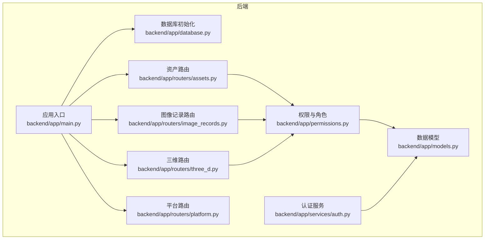
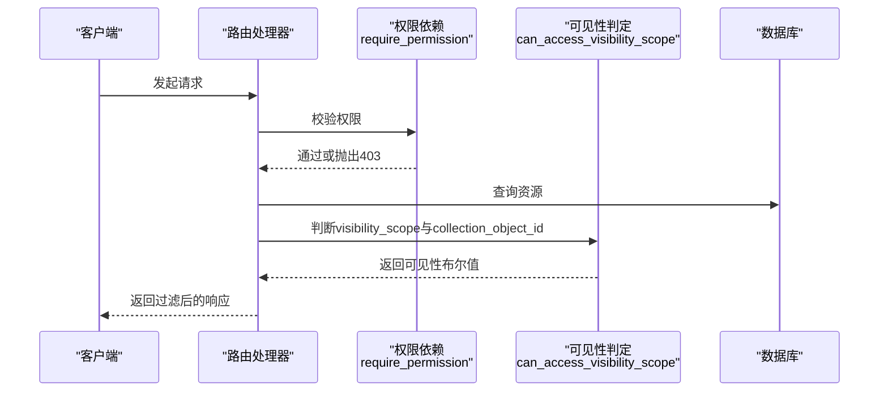
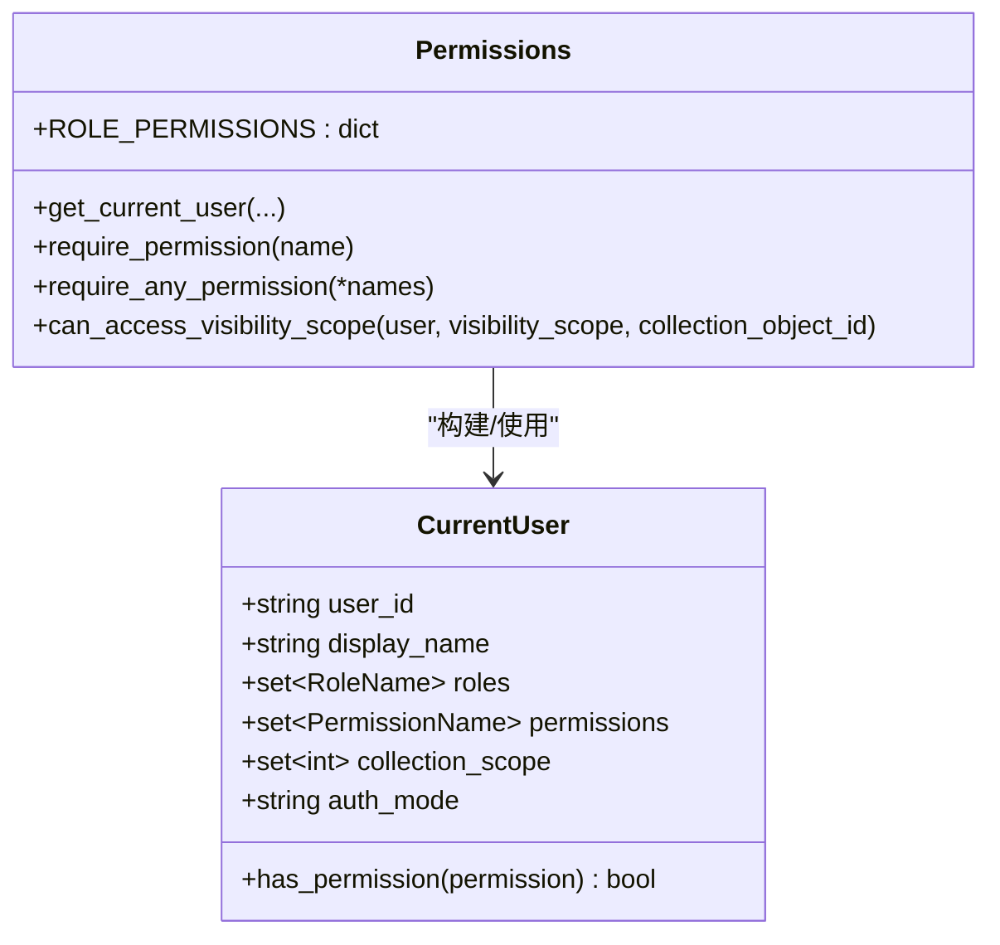
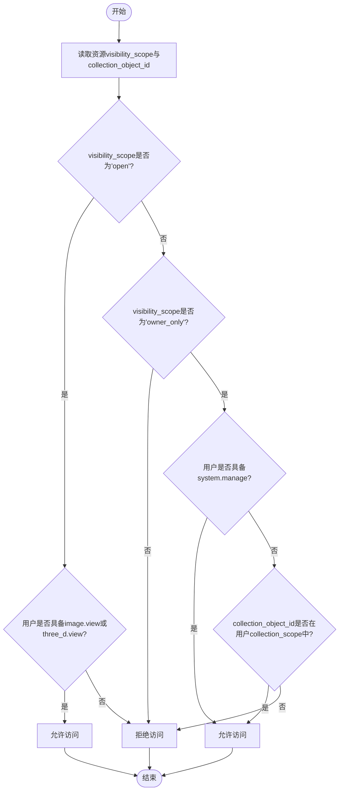
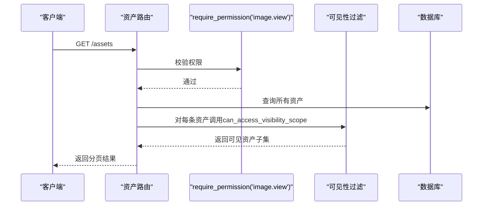
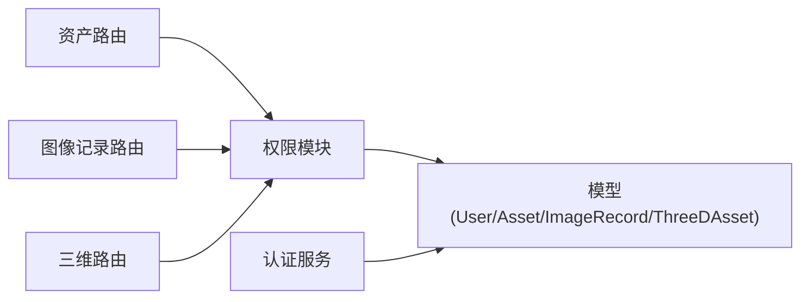

# 数据权限过滤

<cite>
**本文引用的文件**
- [backend/app/permissions.py](file://backend/app/permissions.py)
- [backend/app/models.py](file://backend/app/models.py)
- [backend/app/main.py](file://backend/app/main.py)
- [backend/app/database.py](file://backend/app/database.py)
- [backend/app/routers/assets.py](file://backend/app/routers/assets.py)
- [backend/app/routers/image_records.py](file://backend/app/routers/image_records.py)
- [backend/app/routers/three_d.py](file://backend/app/routers/three_d.py)
- [backend/app/routers/platform.py](file://backend/app/routers/platform.py)
- [backend/app/services/auth.py](file://backend/app/services/auth.py)
- [backend/tests/test_permissions.py](file://backend/tests/test_permissions.py)
- [docs/03-产品与流程/USER_ROLE_PERMISSION_MATRIX.md](file://docs/03-产品与流程/USER_ROLE_PERMISSION_MATRIX.md)
- [frontend/src/auth/permissions.ts](file://frontend/src/auth/permissions.ts)
</cite>

## 目录
1. [简介](#简介)
2. [项目结构](#项目结构)
3. [核心组件](#核心组件)
4. [架构总览](#架构总览)
5. [详细组件分析](#详细组件分析)
6. [依赖分析](#依赖分析)
7. [性能考虑](#性能考虑)
8. [故障排查指南](#故障排查指南)
9. [结论](#结论)
10. [附录](#附录)

## 简介
本文件面向MDAMS原型项目，系统化阐述数据权限过滤机制，重点覆盖：
- 用户集合范围限制与资源访问权限控制
- 数据可见性管理与集合范围字段的使用
- 权限过滤器的实现原理（SQL查询过滤、API响应过滤）
- 不同角色的数据访问权限差异（只读、编辑、管理）
- 性能优化策略（索引、查询优化、缓存）
- 配置示例与使用场景
- 后端权限过滤的代码实现与最佳实践

## 项目结构
后端采用FastAPI + SQLAlchemy架构，权限控制贯穿认证上下文构建、路由依赖注入、以及具体资源列表/详情接口的可见性判定。关键模块包括：
- 权限与角色定义：backend/app/permissions.py
- 数据模型：backend/app/models.py（含collection_scope、visibility_scope字段）
- 路由层：assets、image-records、three-d、platform等
- 认证与种子数据：backend/app/services/auth.py
- 应用入口与数据库初始化：backend/app/main.py、backend/app/database.py
- 前端权限矩阵与菜单可见性：frontend/src/auth/permissions.ts

图表来源
- [backend/app/main.py:1-86](file://backend/app/main.py#L1-L86)
- [backend/app/database.py:1-17](file://backend/app/database.py#L1-L17)
- [backend/app/permissions.py:1-255](file://backend/app/permissions.py#L1-L255)
- [backend/app/models.py:1-307](file://backend/app/models.py#L1-L307)
- [backend/app/routers/assets.py:1-292](file://backend/app/routers/assets.py#L1-L292)
- [backend/app/routers/image_records.py:1-800](file://backend/app/routers/image_records.py#L1-L800)
- [backend/app/routers/three_d.py:1-742](file://backend/app/routers/three_d.py#L1-L742)
- [backend/app/routers/platform.py:1-65](file://backend/app/routers/platform.py#L1-L65)
- [backend/app/services/auth.py:1-143](file://backend/app/services/auth.py#L1-L143)

章节来源
- [backend/app/main.py:1-86](file://backend/app/main.py#L1-L86)
- [backend/app/database.py:1-17](file://backend/app/database.py#L1-L17)

## 核心组件
- 权限与角色
  - 角色到权限映射集中于backend/app/permissions.py，包含多类业务权限与系统管理权限。
  - 当前内置角色与权限矩阵详见docs/03-产品与流程/USER_ROLE_PERMISSION_MATRIX.md。
- 认证上下文
  - get_current_user支持多种认证方式（Bearer Token、Cookie、Legacy Header），解析会话并构建CurrentUser对象，包含roles、permissions、collection_scope等。
- 可见性判定
  - can_access_visibility_scope根据visibility_scope与collection_object_id进行判定，结合用户权限与集合范围决定是否可见。

章节来源
- [backend/app/permissions.py:17-94](file://backend/app/permissions.py#L17-L94)
- [backend/app/permissions.py:179-204](file://backend/app/permissions.py#L179-L204)
- [backend/app/permissions.py:239-254](file://backend/app/permissions.py#L239-L254)
- [docs/03-产品与流程/USER_ROLE_PERMISSION_MATRIX.md:1-194](file://docs/03-产品与流程/USER_ROLE_PERMISSION_MATRIX.md#L1-L194)

## 架构总览
权限过滤在后端的典型调用链：
- 请求进入路由处理器
- 通过require_permission依赖注入校验用户是否具备所需权限
- 若涉及资源可见性，调用can_access_visibility_scope进行范围判定
- 返回过滤后的结果集或抛出403

图表来源
- [backend/app/routers/assets.py:209-220](file://backend/app/routers/assets.py#L209-L220)
- [backend/app/routers/three_d.py:639-662](file://backend/app/routers/three_d.py#L639-L662)
- [backend/app/permissions.py:214-236](file://backend/app/permissions.py#L214-L236)
- [backend/app/permissions.py:239-254](file://backend/app/permissions.py#L239-L254)

## 详细组件分析

### 权限与角色体系
- 角色到权限映射集中定义，覆盖仪表盘、平台、二维资源、图像记录、三维资源、利用申请等维度。
- CurrentUser封装了用户身份、角色集合、权限集合与集合范围，提供has_permission快速判定。
- Legacy模式支持通过X-MDAMS-User与X-MDAMS-Collection-Scope头进行演示与测试。

图表来源
- [backend/app/permissions.py:102-113](file://backend/app/permissions.py#L102-L113)
- [backend/app/permissions.py:17-94](file://backend/app/permissions.py#L17-L94)
- [backend/app/permissions.py:179-204](file://backend/app/permissions.py#L179-L204)
- [backend/app/permissions.py:214-236](file://backend/app/permissions.py#L214-L236)
- [backend/app/permissions.py:239-254](file://backend/app/permissions.py#L239-L254)

章节来源
- [backend/app/permissions.py:17-94](file://backend/app/permissions.py#L17-L94)
- [backend/app/permissions.py:102-113](file://backend/app/permissions.py#L102-L113)
- [backend/app/permissions.py:179-204](file://backend/app/permissions.py#L179-L204)
- [backend/app/permissions.py:214-236](file://backend/app/permissions.py#L214-L236)
- [backend/app/permissions.py:239-254](file://backend/app/permissions.py#L239-L254)
- [docs/03-产品与流程/USER_ROLE_PERMISSION_MATRIX.md:80-96](file://docs/03-产品与流程/USER_ROLE_PERMISSION_MATRIX.md#L80-L96)

### 集合范围与可见性管理
- 集合范围字段
  - User.collection_scope为JSON类型，存储整数集合，表示该用户可访问的collection_object_id集合。
  - 资源模型（Asset、ImageRecord、ThreeDAsset）均包含collection_object_id字段，用于与用户集合范围关联。
- 可见性范围
  - 资源模型与元数据层均包含visibility_scope字段，默认“open”，支持“owner_only”。
  - can_access_visibility_scope判定规则：
    - “open”：具备image.view或three_d.view即可
    - “owner_only”：系统管理员直接可见；否则需collection_object_id在用户collection_scope中
- 路由层应用
  - 资产列表与三维资源列表在返回前进行可见性过滤
  - 详情接口在返回前进行可见性检查，不满足则返回403

图表来源
- [backend/app/permissions.py:239-254](file://backend/app/permissions.py#L239-L254)
- [backend/app/models.py:36](file://backend/app/models.py#L36)
- [backend/app/models.py:14](file://backend/app/models.py#L14)
- [backend/app/models.py:154](file://backend/app/models.py#L154)
- [backend/app/models.py:219](file://backend/app/models.py#L219)
- [backend/app/routers/assets.py:209-220](file://backend/app/routers/assets.py#L209-L220)
- [backend/app/routers/three_d.py:639-662](file://backend/app/routers/three_d.py#L639-L662)

章节来源
- [backend/app/models.py:14](file://backend/app/models.py#L14)
- [backend/app/models.py:36](file://backend/app/models.py#L36)
- [backend/app/models.py:154](file://backend/app/models.py#L154)
- [backend/app/models.py:219](file://backend/app/models.py#L219)
- [backend/app/permissions.py:239-254](file://backend/app/permissions.py#L239-L254)
- [backend/app/routers/assets.py:209-220](file://backend/app/routers/assets.py#L209-L220)
- [backend/app/routers/three_d.py:639-662](file://backend/app/routers/three_d.py#L639-L662)

### 路由层权限过滤实现
- 资产路由
  - 列表接口：先按权限过滤，再按可见性过滤
  - 详情接口：先按权限过滤，再按可见性检查
- 图像记录路由
  - 列表/详情可见性：除系统管理员外，需满足“list”或“view_ready_for_upload”权限，或与摄影师分配相关
- 三维路由
  - 列表接口：遍历资源，逐条调用can_access_visibility_scope进行过滤
  - 详情接口：按权限检查后返回

图表来源
- [backend/app/routers/assets.py:209-220](file://backend/app/routers/assets.py#L209-L220)
- [backend/app/routers/assets.py:254-266](file://backend/app/routers/assets.py#L254-L266)
- [backend/app/permissions.py:214-236](file://backend/app/permissions.py#L214-L236)
- [backend/app/permissions.py:239-254](file://backend/app/permissions.py#L239-L254)

章节来源
- [backend/app/routers/assets.py:209-220](file://backend/app/routers/assets.py#L209-L220)
- [backend/app/routers/assets.py:254-266](file://backend/app/routers/assets.py#L254-L266)
- [backend/app/routers/image_records.py:578-596](file://backend/app/routers/image_records.py#L578-L596)
- [backend/app/routers/three_d.py:639-662](file://backend/app/routers/three_d.py#L639-L662)

### 角色与权限差异
- 只读权限
  - image.view / three_d.view：用于资源浏览
  - image.record.view / image.record.list：用于图像记录浏览与列表
- 编辑权限
  - image.edit / image.delete：用于二维资源编辑与删除
  - three_d.edit：用于三维资源编辑
  - image.edit_scope / three_d.edit_scope：用于编辑集合范围
- 管理权限
  - system.manage：超级权限，绕过集合范围与部分可见性限制
  - application.review / application.export：用于申请管理
- 责任范围
  - collection_owner：通过collection_scope限定可访问的collection_object_id集合

章节来源
- [docs/03-产品与流程/USER_ROLE_PERMISSION_MATRIX.md:30-96](file://docs/03-产品与流程/USER_ROLE_PERMISSION_MATRIX.md#L30-L96)
- [backend/app/permissions.py:17-94](file://backend/app/permissions.py#L17-L94)
- [backend/app/permissions.py:239-254](file://backend/app/permissions.py#L239-L254)

### 前端权限与菜单联动
- 前端根据权限矩阵控制菜单可见性，菜单键与权限存在一一或多对多映射关系
- 前端权限工具函数提供canAccessMenu、getVisibleMenuKeys等能力

章节来源
- [frontend/src/auth/permissions.ts:84-102](file://frontend/src/auth/permissions.ts#L84-L102)

## 依赖分析
- 模块耦合
  - 路由层依赖permissions进行权限校验与可见性判定
  - permissions依赖models中的User与资源模型字段
  - services.auth负责用户会话与默认角色/用户的播种
- 外部依赖
  - FastAPI依赖注入机制
  - SQLAlchemy ORM查询与关系映射

图表来源
- [backend/app/routers/assets.py:10-11](file://backend/app/routers/assets.py#L10-L11)
- [backend/app/routers/image_records.py:15-16](file://backend/app/routers/image_records.py#L15-L16)
- [backend/app/routers/three_d.py:14-15](file://backend/app/routers/three_d.py#L14-L15)
- [backend/app/permissions.py:9-11](file://backend/app/permissions.py#L9-L11)
- [backend/app/services/auth.py:9](file://backend/app/services/auth.py#L9)

章节来源
- [backend/app/routers/assets.py:10-11](file://backend/app/routers/assets.py#L10-L11)
- [backend/app/routers/image_records.py:15-16](file://backend/app/routers/image_records.py#L15-L16)
- [backend/app/routers/three_d.py:14-15](file://backend/app/routers/three_d.py#L14-L15)
- [backend/app/permissions.py:9-11](file://backend/app/permissions.py#L9-L11)
- [backend/app/services/auth.py:9](file://backend/app/services/auth.py#L9)

## 性能考虑
- 索引设计
  - User.collection_scope为JSON字段，查询时无法直接走索引；建议在需要频繁过滤的场景下，将collection_object_id独立为整型列并建立索引，或在应用层进行预过滤
  - 资源模型中visibility_scope、collection_object_id、resource_type等字段已建立索引，有助于过滤与排序
- 查询优化
  - 列表接口先按权限过滤，再按可见性过滤，避免不必要的ORM加载
  - 三维资源列表采用逐条可见性判定，建议在高并发场景下引入缓存或批量判定优化
- 缓存机制
  - 可对常用角色权限映射、用户会话信息进行缓存，减少数据库查询
  - 对集合范围命中率高的场景，可缓存用户collection_scope集合

章节来源
- [backend/app/models.py:14](file://backend/app/models.py#L14)
- [backend/app/models.py:154](file://backend/app/models.py#L154)
- [backend/app/models.py:219](file://backend/app/models.py#L219)
- [backend/app/routers/three_d.py:639-662](file://backend/app/routers/three_d.py#L639-L662)

## 故障排查指南
- 常见问题
  - 401未认证：检查Authorization头或Cookie是否正确传递
  - 403权限不足：确认用户是否具备所需权限或是否属于集合范围
  - 资源不可见：检查visibility_scope与collection_object_id是否匹配
- 单元测试参考
  - 测试演示用户权限解析与collection_owner集合范围判定
  - 测试资源使用者缺少application.review权限时被拒绝

章节来源
- [backend/tests/test_permissions.py:14-43](file://backend/tests/test_permissions.py#L14-L43)

## 结论
MDAMS原型的权限体系以角色-权限映射为核心，结合集合范围与资源可见性策略，实现了对二维资产、图像记录与三维资源的细粒度访问控制。通过路由层的权限依赖与可见性过滤，确保API响应符合安全策略。建议在生产环境中进一步完善集合范围索引、引入缓存与批量判定优化，并持续完善角色管理与权限矩阵文档。

## 附录

### 配置示例与使用场景
- 场景一：馆藏责任人仅可见其责任范围内的资源
  - 将collection_owner的collection_scope设置为其负责的collection_object_id集合
  - 资源visibility_scope设为“owner_only”，系统管理员可跨范围访问
- 场景二：普通浏览者仅可见公开资源
  - 资源visibility_scope保持“open”，用户具备image.view或three_d.view即可
- 场景三：图像记录工作流
  - 录入员具备image.record.create/view/edit/list
  - 摄影上传人员具备image.record.view_ready_for_upload与image.file.upload/match
  - 审核员具备image.ingest_review

章节来源
- [docs/03-产品与流程/USER_ROLE_PERMISSION_MATRIX.md:114-127](file://docs/03-产品与流程/USER_ROLE_PERMISSION_MATRIX.md#L114-L127)
- [docs/03-产品与流程/USER_ROLE_PERMISSION_MATRIX.md:154-178](file://docs/03-产品与流程/USER_ROLE_PERMISSION_MATRIX.md#L154-L178)