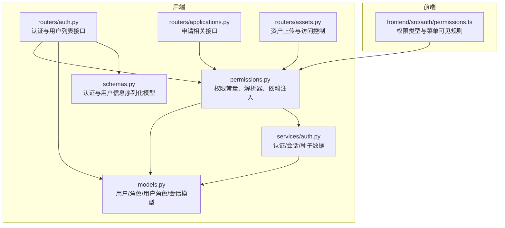
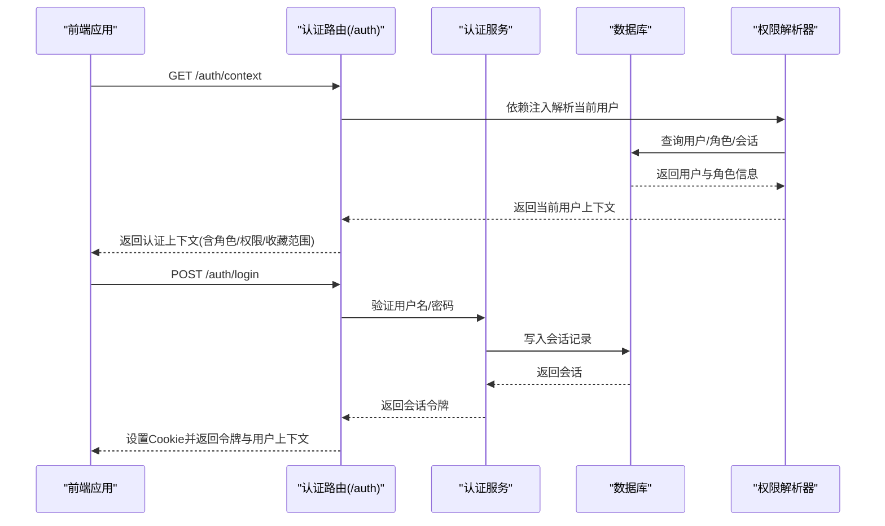
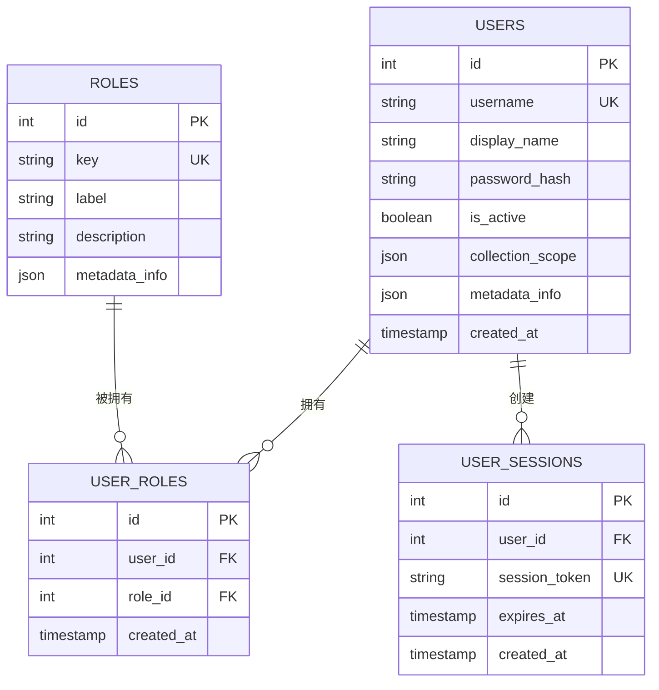
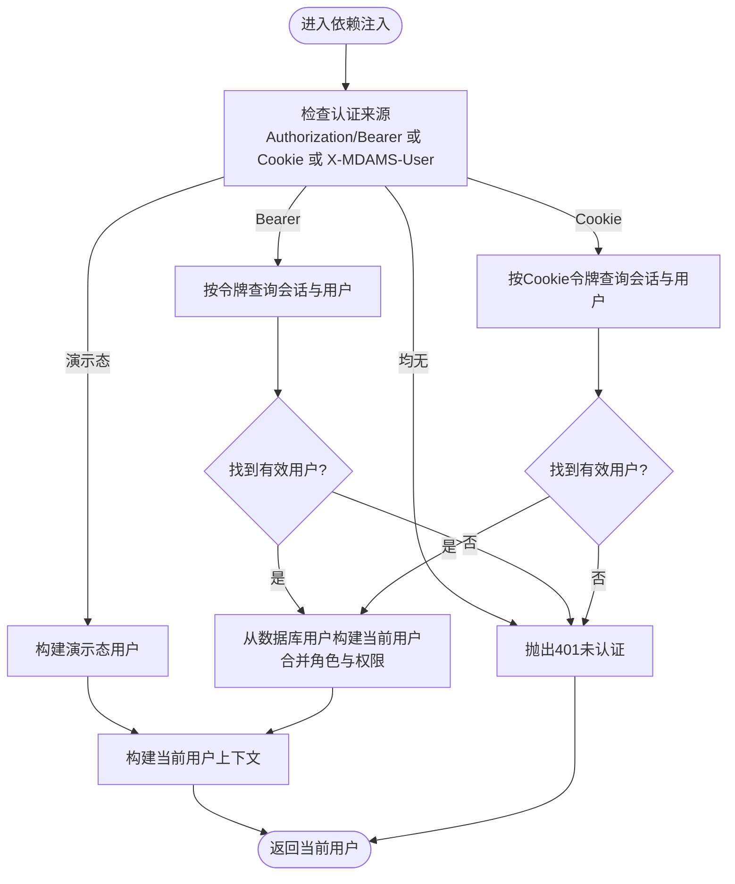
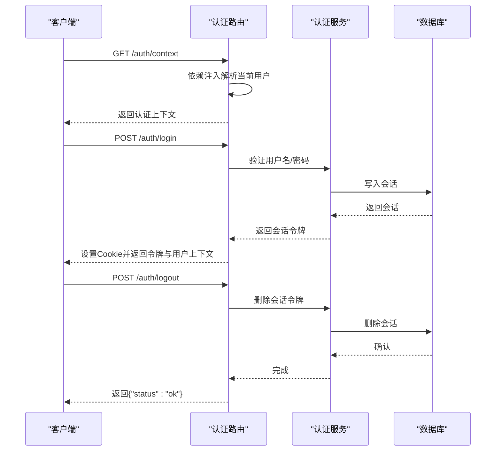
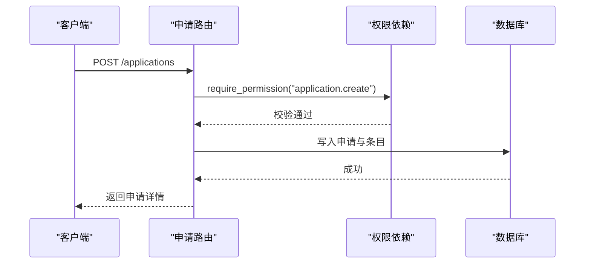
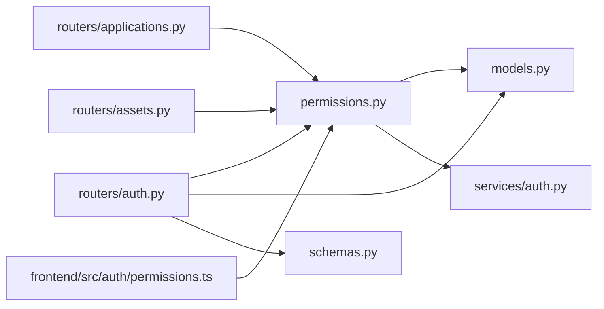

# 权限配置管理

<cite>
**本文引用的文件**
- [backend/app/permissions.py](file://backend/app/permissions.py)
- [backend/app/models.py](file://backend/app/models.py)
- [backend/app/schemas.py](file://backend/app/schemas.py)
- [backend/app/routers/auth.py](file://backend/app/routers/auth.py)
- [backend/app/services/auth.py](file://backend/app/services/auth.py)
- [backend/app/routers/applications.py](file://backend/app/routers/applications.py)
- [backend/app/routers/assets.py](file://backend/app/routers/assets.py)
- [backend/tests/test_permissions.py](file://backend/tests/test_permissions.py)
- [frontend/src/auth/permissions.ts](file://frontend/src/auth/permissions.ts)
- [docs/03-产品与流程/USER_ROLE_PERMISSION_MATRIX.md](file://docs/03-产品与流程/USER_ROLE_PERMISSION_MATRIX.md)
- [docs/03-产品与流程/FRONTEND_MENU_VISIBILITY_MATRIX.md](file://docs/03-产品与流程/FRONTEND_MENU_VISIBILITY_MATRIX.md)
</cite>

## 目录
1. [简介](#简介)
2. [项目结构](#项目结构)
3. [核心组件](#核心组件)
4. [架构总览](#架构总览)
5. [详细组件分析](#详细组件分析)
6. [依赖分析](#依赖分析)
7. [性能考虑](#性能考虑)
8. [故障排查指南](#故障排查指南)
9. [结论](#结论)
10. [附录](#附录)

## 简介
本文件面向MDAMS原型项目的权限配置管理，系统性阐述权限模型、角色与权限映射、用户角色分配与继承、权限API接口、安全策略与审计、批量操作与模板管理、以及最佳实践与操作示例。文档以代码为依据，结合前后端实现与配套文档，帮助开发者与运维人员快速理解并正确使用权限配置管理能力。

## 项目结构
权限配置管理涉及后端权限解析与依赖注入、认证与会话、数据库模型与种子数据、API路由与鉴权保护、前端菜单与权限判定等模块。下图展示与权限相关的关键文件与交互关系：

**图表来源**
- [backend/app/permissions.py:17-94](file://backend/app/permissions.py#L17-L94)
- [backend/app/models.py:28-111](file://backend/app/models.py#L28-L111)
- [backend/app/schemas.py:622-652](file://backend/app/schemas.py#L622-L652)
- [backend/app/routers/auth.py:10-83](file://backend/app/routers/auth.py#L10-L83)
- [backend/app/services/auth.py:15-143](file://backend/app/services/auth.py#L15-L143)
- [backend/app/routers/applications.py:14-21](file://backend/app/routers/applications.py#L14-L21)
- [backend/app/routers/assets.py:10-23](file://backend/app/routers/assets.py#L10-L23)
- [frontend/src/auth/permissions.ts:1-111](file://frontend/src/auth/permissions.ts#L1-L111)

**章节来源**
- [backend/app/permissions.py:17-94](file://backend/app/permissions.py#L17-L94)
- [backend/app/models.py:28-111](file://backend/app/models.py#L28-L111)
- [backend/app/schemas.py:622-652](file://backend/app/schemas.py#L622-L652)
- [backend/app/routers/auth.py:10-83](file://backend/app/routers/auth.py#L10-L83)
- [backend/app/services/auth.py:15-143](file://backend/app/services/auth.py#L15-L143)
- [frontend/src/auth/permissions.ts:1-111](file://frontend/src/auth/permissions.ts#L1-L111)

## 核心组件
- 权限常量与解析器
  - 角色到权限映射字典，集中定义各角色拥有的权限集合。
  - 当前用户对象封装用户身份、角色、权限集、收藏范围与认证模式，并提供权限检查方法。
  - 解析器负责将角色集合展开为权限集合，支持系统管理员“超级权限”豁免。
- 认证与会话
  - 支持多种认证来源：Bearer Token、Cookie会话、演示态请求头。
  - 提供当前用户依赖注入，自动构建用户上下文。
- 数据模型
  - 用户、角色、用户角色关联、用户会话等模型，支撑角色分配与权限继承。
- API与前端
  - 认证上下文与用户列表接口，配合前端权限类型与菜单可见规则，实现UI层面的权限裁剪。

**章节来源**
- [backend/app/permissions.py:17-94](file://backend/app/permissions.py#L17-L94)
- [backend/app/permissions.py:102-151](file://backend/app/permissions.py#L102-L151)
- [backend/app/permissions.py:179-204](file://backend/app/permissions.py#L179-L204)
- [backend/app/models.py:28-111](file://backend/app/models.py#L28-L111)
- [backend/app/routers/auth.py:25-51](file://backend/app/routers/auth.py#L25-L51)
- [frontend/src/auth/permissions.ts:16-63](file://frontend/src/auth/permissions.ts#L16-L63)

## 架构总览
权限配置管理采用“角色驱动权限”的分层架构：
- 表现层：前端根据权限类型与菜单规则渲染UI；后端API通过依赖注入强制校验权限。
- 控制层：权限解析器与当前用户依赖注入，统一生成用户上下文。
- 服务层：认证服务负责会话生命周期与种子数据播种。
- 数据层：用户、角色、用户角色、会话模型，支撑权限继承与作用域控制。

**图表来源**
- [backend/app/routers/auth.py:25-68](file://backend/app/routers/auth.py#L25-L68)
- [backend/app/services/auth.py:136-143](file://backend/app/services/auth.py#L136-L143)
- [backend/app/permissions.py:179-204](file://backend/app/permissions.py#L179-L204)

**章节来源**
- [backend/app/routers/auth.py:25-68](file://backend/app/routers/auth.py#L25-L68)
- [backend/app/services/auth.py:102-143](file://backend/app/services/auth.py#L102-L143)
- [backend/app/permissions.py:179-204](file://backend/app/permissions.py#L179-L204)

## 详细组件分析

### 权限数据结构与继承
- 角色表
  - 字段：主键、唯一键、标签、描述、扩展元数据。
  - 关系：与用户角色关联表一对多。
- 权限表
  - 权限以字符串标识，集中定义于角色到权限映射字典。
- 用户角色关联表
  - 字段：主键、用户ID、角色ID、创建时间。
  - 关系：与用户、角色双向关联。
- 用户表
  - 字段：用户名唯一索引、显示名、密码哈希、激活状态、收藏范围JSON、元数据JSON。
  - 关系：与用户角色、会话、图像记录等多维关联。
- 会话表
  - 字段：会话令牌唯一索引、过期时间、创建时间。
  - 关系：与用户一对一。

**图表来源**
- [backend/app/models.py:28-111](file://backend/app/models.py#L28-L111)

**章节来源**
- [backend/app/models.py:28-111](file://backend/app/models.py#L28-L111)

### 权限解析与当前用户依赖
- 角色到权限映射
  - 通过字典集中维护，便于统一管理与审计。
- 当前用户对象
  - 包含用户ID、显示名、角色集合、权限集合、收藏范围、认证模式。
  - 提供权限检查方法，支持系统管理员“超级权限”。
- 依赖注入
  - 支持从Header(Bearer)、Cookie(mdams.session)、演示态请求头(X-MDAMS-User)解析用户。
  - 未认证时抛出401错误；认证后构建当前用户上下文。

**图表来源**
- [backend/app/permissions.py:179-204](file://backend/app/permissions.py#L179-L204)
- [backend/app/permissions.py:137-151](file://backend/app/permissions.py#L137-L151)
- [backend/app/services/auth.py:115-126](file://backend/app/services/auth.py#L115-L126)

**章节来源**
- [backend/app/permissions.py:179-204](file://backend/app/permissions.py#L179-L204)
- [backend/app/permissions.py:137-151](file://backend/app/permissions.py#L137-L151)
- [backend/app/services/auth.py:115-126](file://backend/app/services/auth.py#L115-L126)

### 认证与用户管理API
- 认证上下文
  - 接口：GET /auth/context
  - 返回：用户ID、显示名、角色、权限、收藏范围、认证模式。
- 用户列表
  - 接口：GET /auth/users
  - 返回：用户ID、用户名、显示名、角色列表、收藏范围。
- 登录/登出
  - 接口：POST /auth/login、POST /auth/logout
  - 登录成功写入会话并设置Cookie；登出删除会话并清理Cookie。

**图表来源**
- [backend/app/routers/auth.py:25-82](file://backend/app/routers/auth.py#L25-L82)
- [backend/app/services/auth.py:102-143](file://backend/app/services/auth.py#L102-L143)

**章节来源**
- [backend/app/routers/auth.py:25-82](file://backend/app/routers/auth.py#L25-L82)
- [backend/app/services/auth.py:102-143](file://backend/app/services/auth.py#L102-L143)

### 权限API与业务保护
- 申请管理
  - 创建申请需具备“application.create”权限。
  - 列表/详情需具备“application.view_all”或“application.view_own”之一。
  - 审核/导出需分别具备“application.review”、“application.export”。
- 资产上传
  - 上传需具备“image.upload”权限。
  - 访问控制结合“image.view”与“owner_only”收藏范围判断。

**图表来源**
- [backend/app/routers/applications.py:132-174](file://backend/app/routers/applications.py#L132-L174)
- [backend/app/routers/applications.py:177-200](file://backend/app/routers/applications.py#L177-L200)
- [backend/app/permissions.py:214-223](file://backend/app/permissions.py#L214-L223)

**章节来源**
- [backend/app/routers/applications.py:132-174](file://backend/app/routers/applications.py#L132-L174)
- [backend/app/routers/applications.py:177-200](file://backend/app/routers/applications.py#L177-L200)
- [backend/app/routers/assets.py:54-133](file://backend/app/routers/assets.py#L54-L133)
- [backend/app/permissions.py:214-223](file://backend/app/permissions.py#L214-L223)

### 前端权限与菜单可见性
- 权限类型
  - 定义角色、权限、菜单键、权限到菜单的规则映射。
- 菜单可见性
  - 依据权限集合判断菜单是否显示；进入页面后仍以权限控制内部动作。
- 与后端协同
  - 前端仅做UI裁剪，后端接口继续做最终兜底校验。

**章节来源**
- [frontend/src/auth/permissions.ts:16-111](file://frontend/src/auth/permissions.ts#L16-L111)
- [docs/03-产品与流程/FRONTEND_MENU_VISIBILITY_MATRIX.md:28-42](file://docs/03-产品与流程/FRONTEND_MENU_VISIBILITY_MATRIX.md#L28-L42)

### 角色与权限矩阵
- 角色清单与说明
  - 内置角色覆盖二维/三维资源、图像记录、申请管理、平台目录、系统管理等场景。
- 权限清单
  - 通用、二维资源、图像记录、三维资源、申请、范围相关等权限分类。
- 角色到权限映射
  - 以字典形式集中维护，便于审计与变更。

**章节来源**
- [docs/03-产品与流程/USER_ROLE_PERMISSION_MATRIX.md:14-96](file://docs/03-产品与流程/USER_ROLE_PERMISSION_MATRIX.md#L14-L96)
- [backend/app/permissions.py:17-94](file://backend/app/permissions.py#L17-L94)

## 依赖分析
- 组件耦合
  - 权限解析器依赖角色到权限映射与用户模型；认证路由依赖权限解析器与认证服务；业务路由依赖权限依赖注入。
- 外部依赖
  - 数据库ORM、FastAPI依赖注入、Pydantic模型序列化。
- 循环依赖
  - 文件间为单向依赖，未发现循环。

**图表来源**
- [backend/app/permissions.py:17-94](file://backend/app/permissions.py#L17-L94)
- [backend/app/models.py:28-111](file://backend/app/models.py#L28-L111)
- [backend/app/schemas.py:622-652](file://backend/app/schemas.py#L622-L652)
- [backend/app/routers/auth.py:10-83](file://backend/app/routers/auth.py#L10-L83)
- [backend/app/services/auth.py:15-143](file://backend/app/services/auth.py#L15-L143)
- [backend/app/routers/applications.py:14-21](file://backend/app/routers/applications.py#L14-L21)
- [backend/app/routers/assets.py:10-23](file://backend/app/routers/assets.py#L10-L23)
- [frontend/src/auth/permissions.ts:1-111](file://frontend/src/auth/permissions.ts#L1-L111)

**章节来源**
- [backend/app/permissions.py:17-94](file://backend/app/permissions.py#L17-L94)
- [backend/app/models.py:28-111](file://backend/app/models.py#L28-L111)
- [backend/app/routers/auth.py:10-83](file://backend/app/routers/auth.py#L10-L83)
- [backend/app/routers/applications.py:14-21](file://backend/app/routers/applications.py#L14-L21)
- [backend/app/routers/assets.py:10-23](file://backend/app/routers/assets.py#L10-L23)
- [frontend/src/auth/permissions.ts:1-111](file://frontend/src/auth/permissions.ts#L1-L111)

## 性能考虑
- 权限解析复杂度
  - 角色到权限映射为常量查找，展开权限集合为集合合并，整体为线性复杂度。
- 依赖注入开销
  - 每次请求进行一次会话查询与用户关系加载，建议在网关或中间件层缓存短期上下文。
- 数据库查询
  - 用户列表与会话查询使用索引字段，注意在高并发下控制批量查询规模。
- 建议
  - 对高频接口启用轻量缓存；对角色/权限映射变更进行灰度发布与监控。

## 故障排查指南
- 401 未认证
  - 检查请求头Authorization是否为Bearer Token且有效；或Cookie mdams.session是否存在且未过期；或演示态请求头是否正确传递。
- 403 权限不足
  - 确认当前用户角色是否具备所需权限；检查角色到权限映射是否正确；确认业务路由是否正确挂载权限依赖。
- 收藏范围访问异常
  - “owner_only”访问需满足系统管理员豁免或目标对象ID在收藏范围内；检查收藏范围解析逻辑与传参。
- 登录失败
  - 核对用户名/密码是否正确；确认用户处于激活状态；检查会话是否过期并被清理。

**章节来源**
- [backend/app/permissions.py:179-204](file://backend/app/permissions.py#L179-L204)
- [backend/app/permissions.py:214-236](file://backend/app/permissions.py#L214-L236)
- [backend/app/permissions.py:239-254](file://backend/app/permissions.py#L239-L254)
- [backend/app/services/auth.py:136-143](file://backend/app/services/auth.py#L136-L143)
- [backend/tests/test_permissions.py:14-43](file://backend/tests/test_permissions.py#L14-L43)

## 结论
MDAMS原型的权限配置管理以角色驱动权限为核心，通过集中映射、依赖注入与多源认证，实现了从前端菜单裁剪到后端接口保护的全链路权限控制。现有实现具备清晰的数据模型、完善的API与测试覆盖，适合在此基础上扩展批量操作、模板管理与审计回滚等高级能力。

## 附录

### 权限配置管理最佳实践
- 角色与权限设计
  - 以业务域划分权限，避免“上帝角色”；优先使用组合权限而非单一大权限。
  - 为敏感操作保留“system.manage”或特定业务权限，确保系统管理员可审计与兜底。
- 用户角色分配
  - 严格遵循最小权限原则；定期审查用户角色与收藏范围；对临时角色设置明确有效期。
- 权限变更审计
  - 记录角色/权限变更、用户登录/登出、关键业务操作；对异常访问与权限滥用进行告警。
- 权限冲突检测
  - 在角色映射中避免互相排斥的权限组合；对“owner_only”与公开访问进行一致性校验。
- 权限回滚机制
  - 变更前备份角色映射与用户角色快照；变更失败时快速回滚；对影响面较大的变更进行灰度发布。
- 批量操作
  - 用户导入：提供标准化模板与字段校验；批量角色分配：支持按条件筛选与差异对比；权限模板：预设常用角色组合并可复制/克隆。

### 操作示例与步骤指引
- 查看认证上下文
  - 请求路径：GET /auth/context
  - 返回字段：user_id、display_name、roles、permissions、collection_scope、auth_mode
- 列出用户与角色
  - 请求路径：GET /auth/users
  - 返回字段：id、username、display_name、roles(key/label)、collection_scope
- 登录并获取会话
  - 请求路径：POST /auth/login
  - 请求体：username、password
  - 成功后设置Cookie mdams.session，响应体包含token与用户上下文
- 登出
  - 请求路径：POST /auth/logout
  - 清理Cookie并删除会话
- 申请管理
  - 创建申请：POST /applications（需要“application.create”）
  - 列表/详情：GET /applications、GET /applications/{id}（需要“application.view_all”或“application.view_own”）
  - 审核/导出：POST /applications/{id}/approve、POST /applications/{id}/export（需要“application.review”、“application.export”）

**章节来源**
- [backend/app/routers/auth.py:25-82](file://backend/app/routers/auth.py#L25-L82)
- [backend/app/routers/applications.py:132-200](file://backend/app/routers/applications.py#L132-L200)
- [docs/03-产品与流程/FRONTEND_MENU_VISIBILITY_MATRIX.md:28-42](file://docs/03-产品与流程/FRONTEND_MENU_VISIBILITY_MATRIX.md#L28-L42)