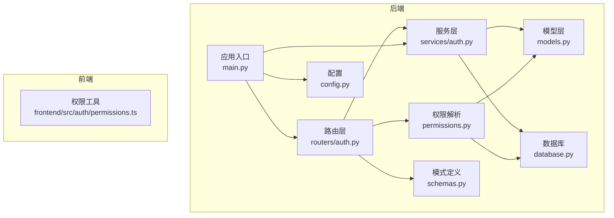
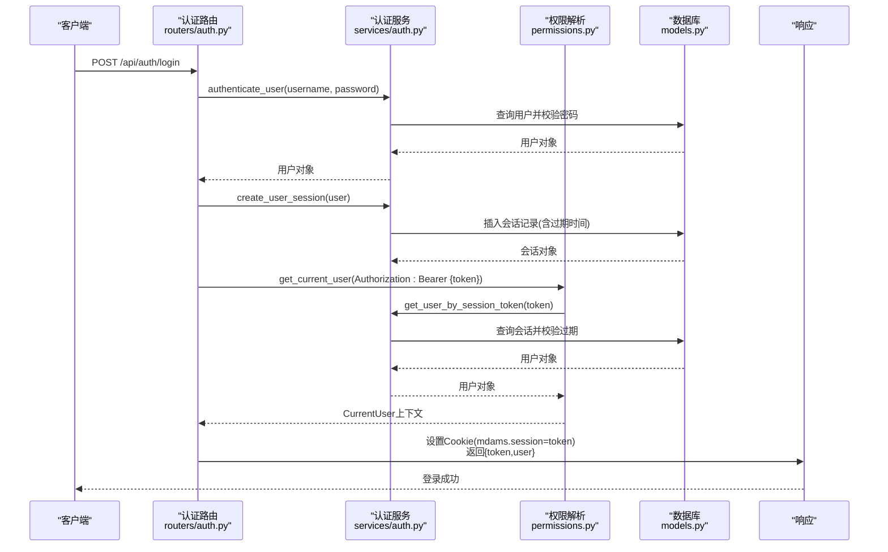
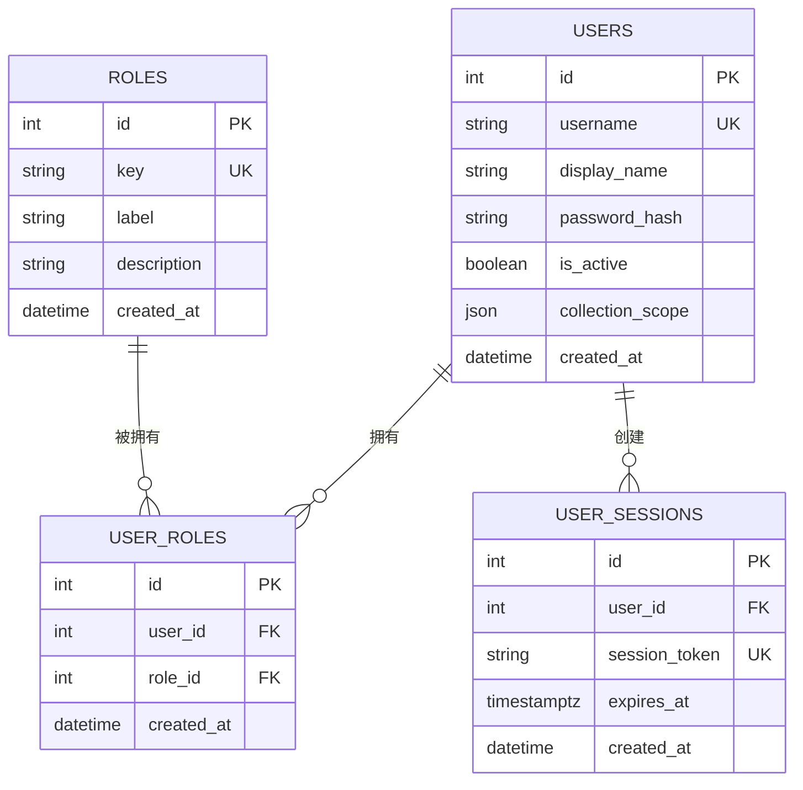
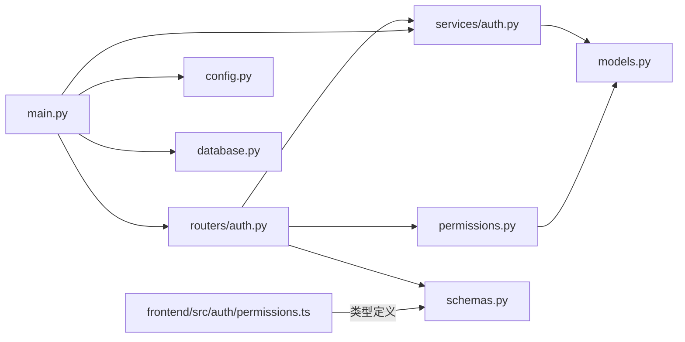

# 用户认证流程

<cite>
**本文引用的文件**
- [backend/app/routers/auth.py](file://backend/app/routers/auth.py)
- [backend/app/services/auth.py](file://backend/app/services/auth.py)
- [backend/app/permissions.py](file://backend/app/permissions.py)
- [backend/app/schemas.py](file://backend/app/schemas.py)
- [backend/app/models.py](file://backend/app/models.py)
- [backend/app/main.py](file://backend/app/main.py)
- [backend/app/database.py](file://backend/app/database.py)
- [backend/app/config.py](file://backend/app/config.py)
- [frontend/src/auth/permissions.ts](file://frontend/src/auth/permissions.ts)
- [docs/02-架构设计/AUTH_AND_IIIF_INTEGRATION_PLAN.md](file://docs/02-架构设计/AUTH_AND_IIIF_INTEGRATION_PLAN.md)
- [docs/03-产品与流程/USER_ROLE_PERMISSION_MATRIX.md](file://docs/03-产品与流程/USER_ROLE_PERMISSION_MATRIX.md)
- [backend/tests/test_auth_service.py](file://backend/tests/test_auth_service.py)
</cite>

## 目录
1. [简介](#简介)
2. [项目结构](#项目结构)
3. [核心组件](#核心组件)
4. [架构概览](#架构概览)
5. [详细组件分析](#详细组件分析)
6. [依赖分析](#依赖分析)
7. [性能考量](#性能考量)
8. [故障排查指南](#故障排查指南)
9. [结论](#结论)
10. [附录](#附录)

## 简介
本文件面向MDAMS原型项目的用户认证流程，系统性阐述登录机制、会话创建与管理、令牌处理与Cookie设置、认证上下文与权限判定、以及会话生命周期与安全策略。文档同时给出认证请求/响应数据模型的定义与用途说明，并提供API调用示例与代码实现细节的定位路径，帮助开发者与测试人员快速理解与验证认证功能。

## 项目结构
认证相关代码主要分布在后端的路由、服务、权限、模型与模式定义中，前端提供权限类型与菜单可见性工具。整体采用FastAPI + SQLAlchemy的典型分层架构，认证流程贯穿路由层、服务层与数据库层。

图表来源
- [backend/app/routers/auth.py:1-83](file://backend/app/routers/auth.py#L1-L83)
- [backend/app/services/auth.py:1-143](file://backend/app/services/auth.py#L1-L143)
- [backend/app/permissions.py:1-255](file://backend/app/permissions.py#L1-L255)
- [backend/app/models.py:1-307](file://backend/app/models.py#L1-L307)
- [backend/app/database.py:1-17](file://backend/app/database.py#L1-L17)
- [backend/app/config.py:1-72](file://backend/app/config.py#L1-L72)
- [backend/app/schemas.py:622-652](file://backend/app/schemas.py#L622-L652)
- [backend/app/main.py:1-86](file://backend/app/main.py#L1-L86)
- [frontend/src/auth/permissions.ts:1-111](file://frontend/src/auth/permissions.ts#L1-L111)

章节来源
- [backend/app/routers/auth.py:1-83](file://backend/app/routers/auth.py#L1-L83)
- [backend/app/main.py:1-86](file://backend/app/main.py#L1-L86)

## 核心组件
- 路由层：提供认证相关接口，包括登录、登出、获取认证上下文、列出用户等。
- 服务层：实现用户凭据验证、会话令牌生成与存储、会话查询与删除、默认角色与用户播种等。
- 权限层：解析当前用户上下文，支持从Header的Bearer Token、Cookie中的会话Token、以及兼容的X-MDAMS头进行认证。
- 模型层：定义用户、角色、用户会话等实体及关系。
- 模式定义：定义认证请求/响应、上下文、角色与用户摘要等数据模型。
- 数据库与配置：提供数据库连接、会话工厂、环境变量配置等基础设施。

章节来源
- [backend/app/routers/auth.py:1-83](file://backend/app/routers/auth.py#L1-L83)
- [backend/app/services/auth.py:1-143](file://backend/app/services/auth.py#L1-L143)
- [backend/app/permissions.py:1-255](file://backend/app/permissions.py#L1-L255)
- [backend/app/models.py:28-111](file://backend/app/models.py#L28-L111)
- [backend/app/schemas.py:622-652](file://backend/app/schemas.py#L622-L652)
- [backend/app/database.py:1-17](file://backend/app/database.py#L1-L17)
- [backend/app/config.py:1-72](file://backend/app/config.py#L1-L72)

## 架构概览
认证系统采用“会话令牌 + Cookie”的方式实现用户状态持久化，后端通过会话令牌解析当前用户上下文，结合角色与权限矩阵进行访问控制。登录成功后，后端将会话令牌写入HTTPOnly Cookie，并返回包含令牌与用户上下文的响应体。

图表来源
- [backend/app/routers/auth.py:53-68](file://backend/app/routers/auth.py#L53-L68)
- [backend/app/services/auth.py:102-142](file://backend/app/services/auth.py#L102-L142)
- [backend/app/permissions.py:179-204](file://backend/app/permissions.py#L179-L204)
- [backend/app/models.py:101-111](file://backend/app/models.py#L101-L111)

## 详细组件分析

### 认证路由与接口
- 登录接口：接收用户名与密码，验证通过后创建会话并设置Cookie，返回令牌与用户上下文。
- 登出接口：解析Authorization头中的Bearer Token并删除对应会话，同时删除Cookie。
- 获取认证上下文：基于当前用户依赖注入返回上下文信息。
- 列出用户：返回激活用户的摘要信息，包含角色与集合范围。

章节来源
- [backend/app/routers/auth.py:25-82](file://backend/app/routers/auth.py#L25-L82)

### 认证服务与会话管理
- 凭据验证：根据用户名查找激活用户，使用PBKDF2哈希比对密码。
- 会话令牌：使用URL安全随机数生成令牌，设置固定时长的过期时间。
- 会话存储：将用户ID、令牌与过期时间写入数据库，支持按令牌查询与删除。
- 默认数据播种：初始化角色与默认用户，确保开发环境可用。

章节来源
- [backend/app/services/auth.py:44-142](file://backend/app/services/auth.py#L44-L142)

### 权限解析与上下文构建
- 多源认证：优先解析Authorization头中的Bearer Token，其次读取Cookie中的会话Token，最后兼容X-MDAMS头进行演示场景。
- 上下文构建：从用户角色计算权限集合，解析集合范围，形成CurrentUser对象。
- 权限校验：提供装饰器与辅助函数，按权限或任一权限进行校验。

章节来源
- [backend/app/permissions.py:179-255](file://backend/app/permissions.py#L179-L255)

### 数据模型与关系
- 用户：包含用户名、显示名、密码哈希、激活状态、集合范围与角色关系。
- 角色：键值标签描述，与用户通过中间表关联。
- 用户会话：唯一令牌、过期时间与用户外键关系。

图表来源
- [backend/app/models.py:28-111](file://backend/app/models.py#L28-L111)

### 认证请求/响应数据模型
- AuthLoginRequest：登录请求体，包含用户名与密码。
- AuthLoginResponse：登录响应体，包含会话令牌与用户上下文。
- AuthContextResponse：认证上下文，包含用户ID、显示名、角色、权限、集合范围与认证模式。
- AuthRoleResponse：角色摘要，包含键与标签。
- AuthUserSummary：用户摘要，包含ID、用户名、显示名、角色列表与集合范围。

章节来源
- [backend/app/schemas.py:622-652](file://backend/app/schemas.py#L622-L652)

### 会话生命周期与安全策略
- 会话时长：固定12小时，到期后自动失效并清理。
- Cookie设置：名称为mdams.session，HttpOnly、SameSite=lax、路径/、最大生存时间12小时。
- 登出清理：删除Cookie并删除对应的会话令牌。
- 密码策略：使用PBKDF2-HMAC-SHA256，迭代次数100000，带固定盐值，确保不可逆存储。

章节来源
- [backend/app/services/auth.py:11-13](file://backend/app/services/auth.py#L11-L13)
- [backend/app/routers/auth.py:60-67](file://backend/app/routers/auth.py#L60-L67)
- [backend/app/services/auth.py:102-112](file://backend/app/services/auth.py#L102-L112)

### 错误处理与安全考虑
- 登录失败：用户名或密码错误返回401。
- 会话无效：解析会话令牌失败或过期返回401。
- 缺少认证：未提供有效认证信息返回401。
- 权限不足：缺少所需权限返回403。
- 安全建议：生产环境建议启用HTTPS、Secure Cookie标志、更严格的SameSite策略、短会话与自动续期机制、日志审计与异常监控。

章节来源
- [backend/app/routers/auth.py:56-57](file://backend/app/routers/auth.py#L56-L57)
- [backend/app/permissions.py:189-198](file://backend/app/permissions.py#L189-L198)
- [backend/app/permissions.py:214-236](file://backend/app/permissions.py#L214-L236)

### API调用示例与实现细节
- 登录
  - 请求：POST /api/auth/login
  - 请求体：AuthLoginRequest
  - 成功响应：AuthLoginResponse
  - 实现定位：[backend/app/routers/auth.py:53-68](file://backend/app/routers/auth.py#L53-L68)
- 登出
  - 请求：POST /api/auth/logout
  - 头部：Authorization: Bearer {token}
  - 成功响应：{"status":"ok"}
  - 实现定位：[backend/app/routers/auth.py:71-82](file://backend/app/routers/auth.py#L71-L82)
- 获取认证上下文
  - 请求：GET /api/auth/context
  - 成功响应：AuthContextResponse
  - 实现定位：[backend/app/routers/auth.py:25-27](file://backend/app/routers/auth.py#L25-L27)
- 列出用户
  - 请求：GET /api/auth/users
  - 成功响应：AuthUserSummary数组
  - 实现定位：[backend/app/routers/auth.py:30-50](file://backend/app/routers/auth.py#L30-L50)

章节来源
- [backend/app/routers/auth.py:25-82](file://backend/app/routers/auth.py#L25-L82)
- [backend/app/schemas.py:622-652](file://backend/app/schemas.py#L622-L652)

## 依赖分析
认证流程涉及的模块耦合关系如下：

图表来源
- [backend/app/routers/auth.py:1-83](file://backend/app/routers/auth.py#L1-L83)
- [backend/app/services/auth.py:1-143](file://backend/app/services/auth.py#L1-L143)
- [backend/app/permissions.py:1-255](file://backend/app/permissions.py#L1-L255)
- [backend/app/schemas.py:622-652](file://backend/app/schemas.py#L622-L652)
- [backend/app/main.py:1-86](file://backend/app/main.py#L1-L86)
- [backend/app/config.py:1-72](file://backend/app/config.py#L1-L72)
- [backend/app/database.py:1-17](file://backend/app/database.py#L1-L17)
- [frontend/src/auth/permissions.ts:1-111](file://frontend/src/auth/permissions.ts#L1-L111)

章节来源
- [backend/app/main.py:1-86](file://backend/app/main.py#L1-L86)

## 性能考量
- 密码哈希成本：PBKDF2迭代次数较高，提升安全性的同时增加CPU开销，建议在高并发场景下评估服务器资源与缓存策略。
- 会话查询：按令牌查询会话需索引支持，当前模型已为session_token建立唯一索引，满足高频查询需求。
- Cookie大小：会话令牌较短，对网络传输影响有限。
- 并发登录：同一用户多设备登录将产生多个会话记录，建议定期清理过期会话以控制表规模。

## 故障排查指南
- 登录失败
  - 检查用户名是否存在且激活状态为真。
  - 确认密码与哈希一致。
  - 参考测试用例定位问题：[backend/tests/test_auth_service.py:27-39](file://backend/tests/test_auth_service.py#L27-L39)
- 会话无效
  - 检查Cookie mdams.session 是否正确设置且未过期。
  - 确认Authorization头中的Bearer Token是否与数据库中会话一致。
  - 查看会话过期逻辑与删除行为：[backend/app/services/auth.py:115-134](file://backend/app/services/auth.py#L115-L134)
- 权限不足
  - 核对用户角色与权限映射，确认是否具备所需权限。
  - 参考权限矩阵文档：[docs/03-产品与流程/USER_ROLE_PERMISSION_MATRIX.md:80-96](file://docs/03-产品与流程/USER_ROLE_PERMISSION_MATRIX.md#L80-L96)
- IIIF访问控制
  - 当前Manifest入口已受控，但切片访问尚未完全统一到应用认证入口，建议按计划逐步收口。
  - 参考认证与IIIF集成计划：[docs/02-架构设计/AUTH_AND_IIIF_INTEGRATION_PLAN.md:73-95](file://docs/02-架构设计/AUTH_AND_IIIF_INTEGRATION_PLAN.md#L73-L95)

章节来源
- [backend/tests/test_auth_service.py:1-39](file://backend/tests/test_auth_service.py#L1-L39)
- [backend/app/services/auth.py:115-134](file://backend/app/services/auth.py#L115-L134)
- [docs/03-产品与流程/USER_ROLE_PERMISSION_MATRIX.md:80-96](file://docs/03-产品与流程/USER_ROLE_PERMISSION_MATRIX.md#L80-L96)
- [docs/02-架构设计/AUTH_AND_IIIF_INTEGRATION_PLAN.md:73-95](file://docs/02-架构设计/AUTH_AND_IIIF_INTEGRATION_PLAN.md#L73-L95)

## 结论
MDAMS原型的认证系统以会话令牌为核心，结合Cookie与Bearer Token两种认证方式，实现了从登录到上下文解析、权限校验的完整闭环。系统通过角色-权限映射与集合范围控制，为资源访问提供了细粒度的安全保障。后续可在会话续期、Cookie安全属性强化、以及IIIF切片统一鉴权等方面持续优化，以进一步提升安全性与一致性。

## 附录
- 默认测试用户与密码
  - 默认密码：mdams123
  - 默认用户：包含多种角色的测试账户，便于快速验证。
  - 参考播种逻辑与用户清单：[docs/03-产品与流程/USER_ROLE_PERMISSION_MATRIX.md:128-150](file://docs/03-产品与流程/USER_ROLE_PERMISSION_MATRIX.md#L128-L150)