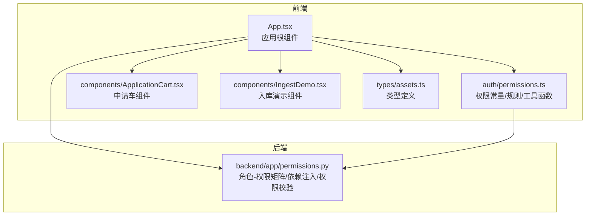
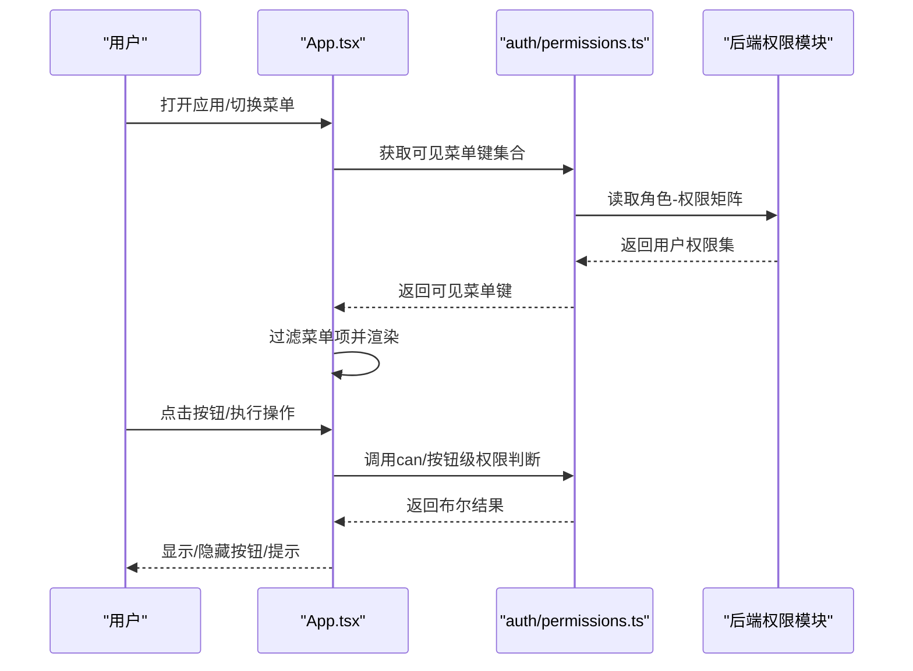
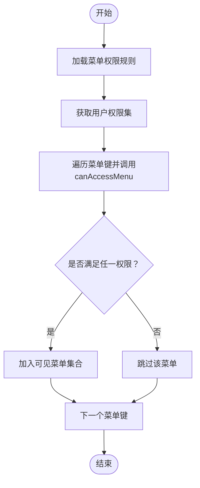
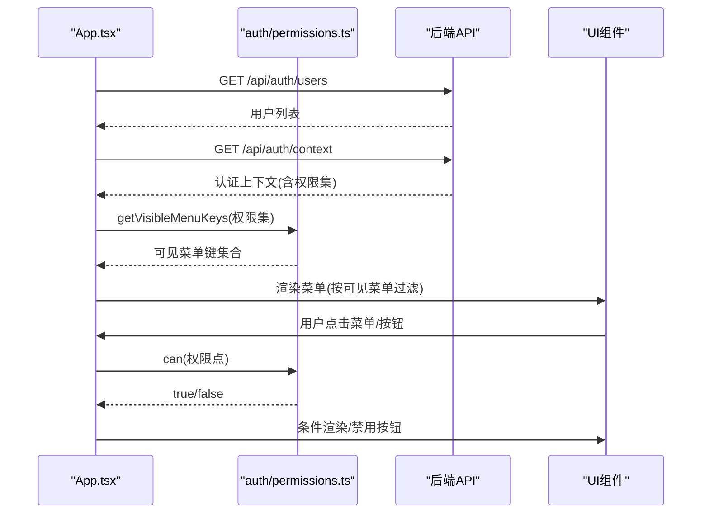
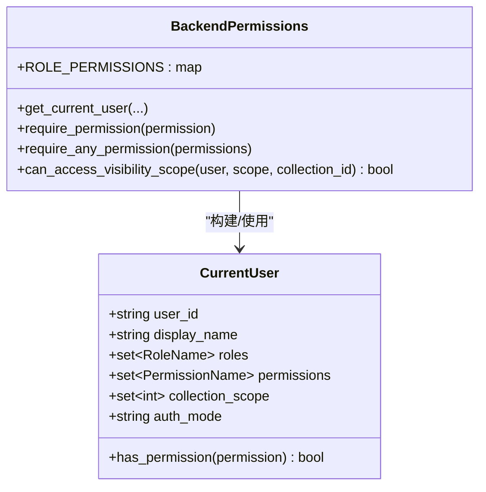
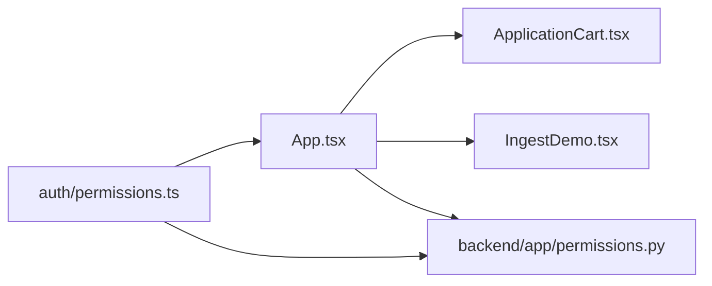

# 菜单权限控制

<cite>
**本文档引用的文件**
- [frontend/src/auth/permissions.ts](file://frontend/src/auth/permissions.ts)
- [frontend/src/App.tsx](file://frontend/src/App.tsx)
- [frontend/src/components/ApplicationCart.tsx](file://frontend/src/components/ApplicationCart.tsx)
- [frontend/src/components/IngestDemo.tsx](file://frontend/src/components/IngestDemo.tsx)
- [frontend/src/main.tsx](file://frontend/src/main.tsx)
- [frontend/src/types/assets.ts](file://frontend/src/types/assets.ts)
- [backend/app/permissions.py](file://backend/app/permissions.py)
</cite>

## 目录
1. [引言](#引言)
2. [项目结构](#项目结构)
3. [核心组件](#核心组件)
4. [架构总览](#架构总览)
5. [详细组件分析](#详细组件分析)
6. [依赖分析](#依赖分析)
7. [性能考虑](#性能考虑)
8. [故障排查指南](#故障排查指南)
9. [结论](#结论)
10. [附录](#附录)

## 引言
本文件面向MDAMS原型项目的前端菜单权限控制，系统性阐述前端侧的权限控制机制，包括：
- 路由守卫与菜单动态渲染
- 按钮级权限控制与功能开关
- 权限验证工具函数（如canAccess、checkPermission等）的设计与应用
- 菜单项的权限配置（菜单层级、权限标识、显示条件）
- 前端路由安全控制（页面访问限制、功能按钮隐藏、操作权限验证）
- 权限状态管理（权限缓存、权限更新、权限同步）
- 实际配置示例与最佳实践
- 前端权限控制的代码实现与使用指南

## 项目结构
本项目采用前后端分离架构，权限控制在前端以“菜单+按钮”双层策略实现，后端提供统一的权限模型与校验接口。前端通过获取认证上下文，动态计算可访问菜单与可用功能，确保界面元素与后端权限一致。

图表来源
- [frontend/src/App.tsx:100-205](file://frontend/src/App.tsx#L100-L205)
- [frontend/src/auth/permissions.ts:84-111](file://frontend/src/auth/permissions.ts#L84-L111)
- [frontend/src/components/ApplicationCart.tsx:1-131](file://frontend/src/components/ApplicationCart.tsx#L1-L131)
- [frontend/src/components/IngestDemo.tsx:1-200](file://frontend/src/components/IngestDemo.tsx#L1-L200)
- [frontend/src/types/assets.ts:163-187](file://frontend/src/types/assets.ts#L163-L187)
- [backend/app/permissions.py:17-94](file://backend/app/permissions.py#L17-L94)

章节来源
- [frontend/src/App.tsx:100-205](file://frontend/src/App.tsx#L100-L205)
- [frontend/src/auth/permissions.ts:84-111](file://frontend/src/auth/permissions.ts#L84-L111)
- [backend/app/permissions.py:17-94](file://backend/app/permissions.py#L17-L94)

## 核心组件
- 权限常量与规则
  - 角色枚举与权限枚举：定义系统内所有角色与权限点，用于后端角色-权限映射与前端权限判断。
  - 菜单权限规则：将每个菜单键映射到一组权限点，用于判断菜单是否对当前用户可见。
- 权限工具函数
  - canAccessMenu：基于菜单规则判断菜单是否可访问。
  - getVisibleMenuKeys：根据当前用户权限计算可见菜单集合。
  - can：通用权限判断函数，用于按钮级与页面级权限控制。
  - getRoleLabels：将角色键转换为中文标签。
- 应用根组件（App.tsx）
  - 初始化认证上下文与用户列表，动态计算可见菜单与角色标签。
  - 在页面渲染与交互中广泛使用can函数进行按钮级与页面级权限控制。
  - 通过菜单项过滤实现菜单动态渲染。

章节来源
- [frontend/src/auth/permissions.ts:1-111](file://frontend/src/auth/permissions.ts#L1-L111)
- [frontend/src/App.tsx:116-139](file://frontend/src/App.tsx#L116-L139)

## 架构总览
前端权限控制采用“菜单规则 + 权限工具函数”的双层策略：
- 菜单规则层：通过菜单键到权限点的映射，决定菜单是否显示。
- 权限工具层：通过can函数判断具体功能按钮与页面内容的可用性。

图表来源
- [frontend/src/App.tsx:116-139](file://frontend/src/App.tsx#L116-L139)
- [frontend/src/auth/permissions.ts:84-111](file://frontend/src/auth/permissions.ts#L84-L111)
- [backend/app/permissions.py:17-94](file://backend/app/permissions.py#L17-L94)

## 详细组件分析

### 权限常量与规则（auth/permissions.ts）
- 菜单键与权限映射
  - 使用字典将菜单键映射到一组权限点，实现“菜单可见性”控制。
  - 示例：菜单键'2'映射到'image.view'，表示只有拥有该权限的用户才能看到“二维资源”菜单。
- 工具函数
  - canAccessMenu：判断某菜单键是否对当前用户可见。
  - getVisibleMenuKeys：计算当前用户可见的所有菜单键。
  - can：通用权限判断，用于按钮级与页面级控制。
  - getRoleLabels：角色键转中文标签，提升界面可读性。

图表来源
- [frontend/src/auth/permissions.ts:84-102](file://frontend/src/auth/permissions.ts#L84-L102)

章节来源
- [frontend/src/auth/permissions.ts:84-111](file://frontend/src/auth/permissions.ts#L84-L111)

### 应用根组件（App.tsx）中的权限控制
- 初始化与认证上下文
  - 从本地存储恢复令牌，拉取可用用户列表与认证上下文。
  - 若本地令牌有效则自动登录；否则引导用户登录。
- 可见菜单计算
  - 使用getVisibleMenuKeys根据当前用户权限动态过滤菜单项。
  - 若当前选中菜单不在可见菜单集中，则重置为第一个可见菜单。
- 页面与按钮级权限控制
  - 通过can函数判断各功能权限，如canViewImages、canUploadImages、canDeleteImages、canCreateApplications、canManageApplications、canView3D、canViewPlatform、canUseImageRecords等。
  - 在表格列、按钮、表单提交等场景中进行条件渲染与交互控制。
- 菜单项构建与渲染
  - 定义菜单标签与图标，结合visibleMenuKeys进行过滤渲染。

图表来源
- [frontend/src/App.tsx:116-139](file://frontend/src/App.tsx#L116-L139)
- [frontend/src/App.tsx:526-550](file://frontend/src/App.tsx#L526-L550)
- [frontend/src/App.tsx:160-205](file://frontend/src/App.tsx#L160-L205)

章节来源
- [frontend/src/App.tsx:116-139](file://frontend/src/App.tsx#L116-L139)
- [frontend/src/App.tsx:526-550](file://frontend/src/App.tsx#L526-L550)
- [frontend/src/App.tsx:160-205](file://frontend/src/App.tsx#L160-L205)

### 申请车组件（ApplicationCart.tsx）中的权限控制
- 场景说明
  - 申请车仅在用户具备“application.create”权限时可见。
  - 表单提交按钮在canCreateApplications为true时启用。
- 权限控制点
  - 组件接收onSubmit等回调，但不直接进行can判断；在父组件App.tsx中已进行canCreateApplications判断并传入。
  - 组件内部通过props触发业务逻辑，避免在UI层重复判断。

章节来源
- [frontend/src/components/ApplicationCart.tsx:1-131](file://frontend/src/components/ApplicationCart.tsx#L1-L131)
- [frontend/src/App.tsx:130-131](file://frontend/src/App.tsx#L130-L131)

### 入库演示组件（IngestDemo.tsx）中的权限控制
- 场景说明
  - 入库流程涉及文件上传、元数据清洗、SIP上传等步骤。
  - 组件内部未直接进行can判断，权限控制主要在父组件App.tsx中通过canUploadImages等进行页面级控制。
- 关联点
  - 组件通过props接收视图预览回调，在父组件中已根据canUploadImages决定是否渲染该页面。

章节来源
- [frontend/src/components/IngestDemo.tsx:1-200](file://frontend/src/components/IngestDemo.tsx#L1-L200)
- [frontend/src/App.tsx:793-800](file://frontend/src/App.tsx#L793-L800)

### 类型定义（types/assets.ts）
- 与权限相关的类型
  - ApplicationCartItem：申请车条目，包含资产ID、资源ID、标题、清单URL等，用于申请车组件的数据流转。
  - ApplicationSummary：申请单摘要，用于申请管理页面的数据展示。
- 作用
  - 为权限控制提供稳定的类型支撑，确保在权限判断后的数据传递与渲染正确性。

章节来源
- [frontend/src/types/assets.ts:163-187](file://frontend/src/types/assets.ts#L163-L187)

### 后端权限模型（backend/app/permissions.py）
- 角色-权限矩阵
  - 定义各角色拥有的权限集合，如image_structured_editor、application_reviewer、system_admin等。
- 当前用户解析
  - 支持多种认证方式（Bearer Token、Cookie、兼容头），解析用户角色与权限集。
- 权限校验依赖
  - 提供require_permission与require_any_permission依赖，用于路由/接口级别的权限校验。
- 可见性范围控制
  - can_access_visibility_scope用于判断资源可见性与所有权范围。

图表来源
- [backend/app/permissions.py:102-151](file://backend/app/permissions.py#L102-L151)
- [backend/app/permissions.py:179-204](file://backend/app/permissions.py#L179-L204)
- [backend/app/permissions.py:214-236](file://backend/app/permissions.py#L214-L236)
- [backend/app/permissions.py:239-254](file://backend/app/permissions.py#L239-L254)

章节来源
- [backend/app/permissions.py:17-94](file://backend/app/permissions.py#L17-L94)
- [backend/app/permissions.py:102-151](file://backend/app/permissions.py#L102-L151)
- [backend/app/permissions.py:179-204](file://backend/app/permissions.py#L179-L204)
- [backend/app/permissions.py:214-236](file://backend/app/permissions.py#L214-L236)
- [backend/app/permissions.py:239-254](file://backend/app/permissions.py#L239-L254)

## 依赖分析
- 前端依赖后端权限模型
  - 前端通过后端提供的认证上下文（包含权限集）进行菜单与按钮级控制。
  - 后端通过依赖注入与require_permission等机制保障接口安全。
- 前端内部依赖
  - App.tsx依赖auth/permissions.ts中的工具函数与规则。
  - 组件通过props接收权限判断结果，避免在UI层重复判断。

图表来源
- [frontend/src/auth/permissions.ts:84-111](file://frontend/src/auth/permissions.ts#L84-L111)
- [frontend/src/App.tsx:116-139](file://frontend/src/App.tsx#L116-L139)
- [backend/app/permissions.py:17-94](file://backend/app/permissions.py#L17-L94)

章节来源
- [frontend/src/auth/permissions.ts:84-111](file://frontend/src/auth/permissions.ts#L84-L111)
- [frontend/src/App.tsx:116-139](file://frontend/src/App.tsx#L116-L139)
- [backend/app/permissions.py:17-94](file://backend/app/permissions.py#L17-L94)

## 性能考虑
- 权限计算缓存
  - visibleMenuKeys与角色标签通过useMemo缓存，避免每次渲染都重新计算。
- 请求节流
  - 资源列表轮询仅在存在处理中任务时启动，减少不必要的网络请求。
- 按需渲染
  - 仅在用户具备相应权限时渲染对应页面与按钮，降低DOM复杂度。

章节来源
- [frontend/src/App.tsx:116-139](file://frontend/src/App.tsx#L116-L139)
- [frontend/src/App.tsx:253-263](file://frontend/src/App.tsx#L253-L263)

## 故障排查指南
- 登录后菜单为空
  - 检查后端认证上下文返回的权限集是否包含任一菜单规则所需的权限点。
  - 确认前端是否正确调用getVisibleMenuKeys并过滤菜单项。
- 按钮不可用但应可用
  - 检查对应权限点是否在后端角色-权限矩阵中。
  - 确认前端can函数调用是否正确传入权限点。
- 令牌失效
  - 前端会在初始化时尝试使用本地存储的令牌；若后端返回401，前端会清除令牌并回到登录页。
- 资源不可见
  - 检查can_access_visibility_scope逻辑与用户collection_scope是否匹配。

章节来源
- [frontend/src/App.tsx:183-205](file://frontend/src/App.tsx#L183-L205)
- [backend/app/permissions.py:239-254](file://backend/app/permissions.py#L239-L254)

## 结论
MDAMS原型项目的前端权限控制以“菜单规则 + 权限工具函数”为核心，结合后端角色-权限矩阵与依赖注入，实现了菜单动态渲染与按钮级权限控制。通过在App.tsx中集中进行权限判断与状态管理，保证了界面一致性与安全性。建议在后续迭代中进一步完善权限变更通知与缓存同步策略，以提升用户体验与系统稳定性。

## 附录

### 权限验证函数使用指南
- canAccessMenu
  - 适用场景：判断某个菜单键是否对当前用户可见。
  - 输入：认证上下文、菜单键。
  - 输出：布尔值。
- getVisibleMenuKeys
  - 适用场景：计算当前用户可见的所有菜单键集合。
  - 输入：认证上下文。
  - 输出：菜单键数组。
- can
  - 适用场景：通用权限判断，用于按钮级与页面级控制。
  - 输入：认证上下文、权限点。
  - 输出：布尔值。
- getRoleLabels
  - 适用场景：将角色键转换为中文标签，用于界面展示。
  - 输入：认证上下文。
  - 输出：字符串数组。

章节来源
- [frontend/src/auth/permissions.ts:96-111](file://frontend/src/auth/permissions.ts#L96-L111)

### 菜单项权限配置示例
- 菜单键与权限映射
  - 菜单键'1'：dashboard.view
  - 菜单键'2'：image.view
  - 菜单键'3'：application.create
  - 菜单键'4'：image.upload、image.ingest_review、image.edit
  - 菜单键'5'：platform.view
  - 菜单键'6'：platform.view
  - 菜单键'7'：three_d.view
  - 菜单键'8'：application.view_all、application.review、application.export
  - 菜单键'9'：image.record.list、image.record.view_ready_for_upload

章节来源
- [frontend/src/auth/permissions.ts:84-94](file://frontend/src/auth/permissions.ts#L84-L94)

### 最佳实践
- 将权限判断集中在App.tsx中，组件通过props接收权限结果，避免在UI层重复判断。
- 使用useMemo缓存visibleMenuKeys与角色标签，减少重渲染成本。
- 在页面级与按钮级均进行权限控制，确保用户无法通过URL或直接调用绕过。
- 与后端保持一致的权限点命名与语义，便于维护与扩展。
- 对于敏感操作（如删除、导出），在前端进行二次确认并在后端进行严格校验。