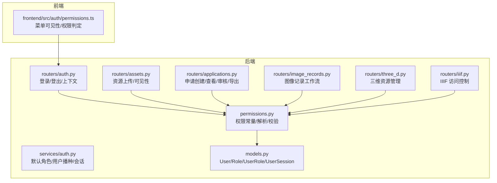
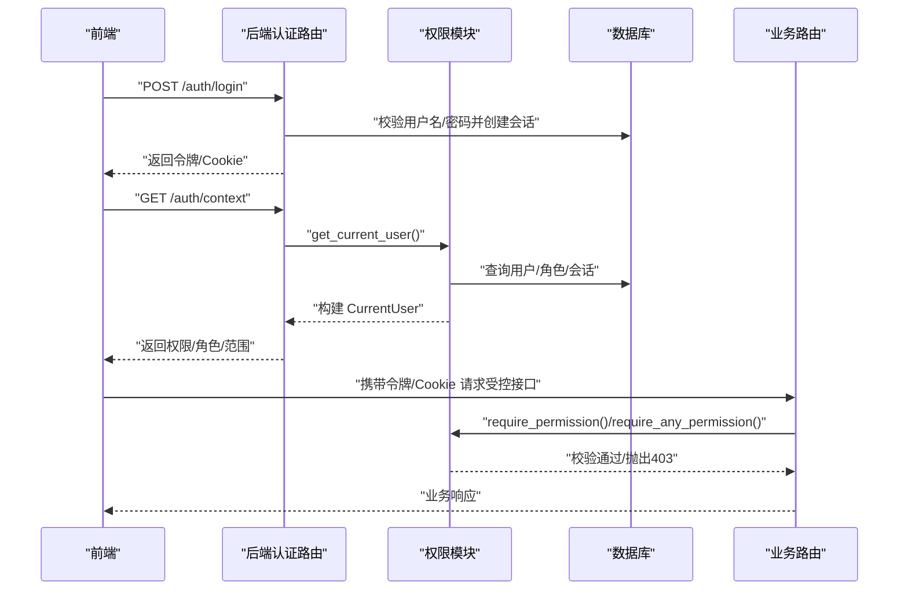
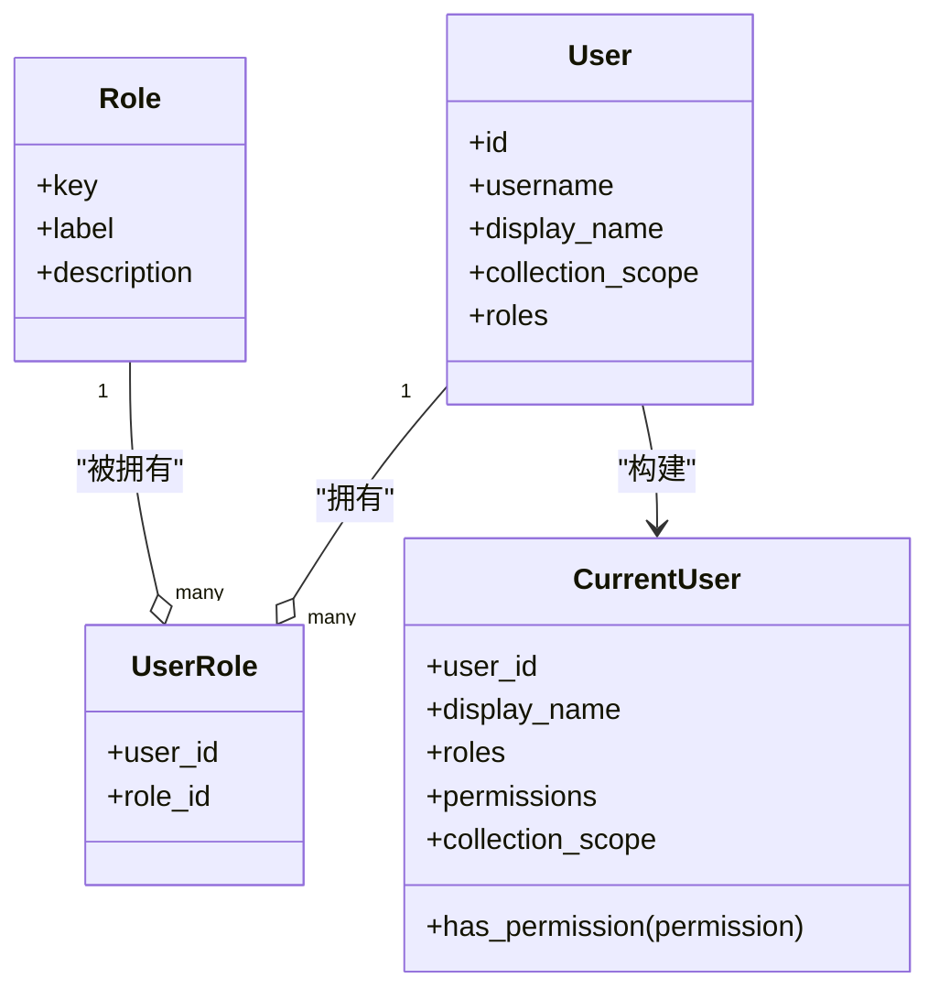
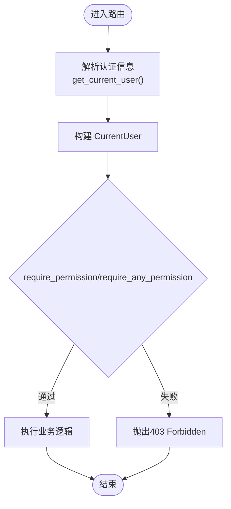
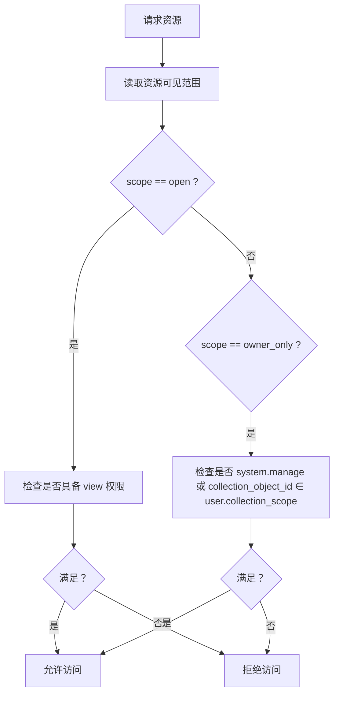
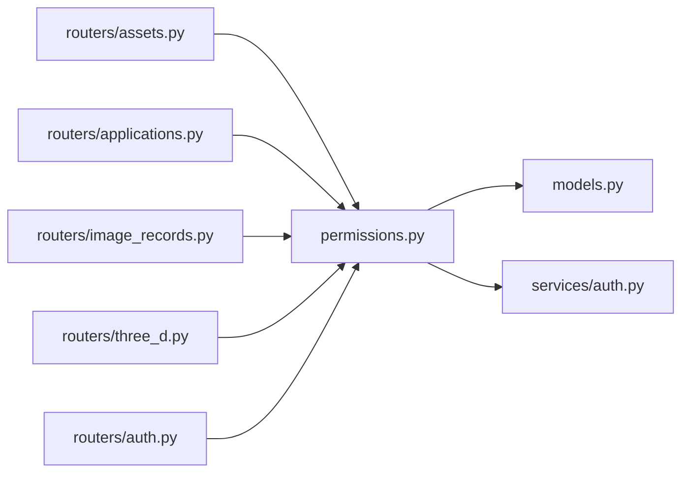

# 角色权限模型

<cite>
**本文引用的文件**
- [backend/app/permissions.py](file://backend/app/permissions.py)
- [backend/app/services/auth.py](file://backend/app/services/auth.py)
- [backend/app/routers/auth.py](file://backend/app/routers/auth.py)
- [backend/app/routers/assets.py](file://backend/app/routers/assets.py)
- [backend/app/routers/applications.py](file://backend/app/routers/applications.py)
- [backend/app/routers/image_records.py](file://backend/app/routers/image_records.py)
- [backend/app/routers/three_d.py](file://backend/app/routers/three_d.py)
- [backend/app/routers/iiif.py](file://backend/app/routers/iiif.py)
- [backend/app/models.py](file://backend/app/models.py)
- [frontend/src/auth/permissions.ts](file://frontend/src/auth/permissions.ts)
- [docs/03-产品与流程/USER_ROLE_PERMISSION_MATRIX.md](file://docs/03-产品与流程/USER_ROLE_PERMISSION_MATRIX.md)
- [backend/tests/test_permissions.py](file://backend/tests/test_permissions.py)
</cite>

## 目录
1. [简介](#简介)
2. [项目结构](#项目结构)
3. [核心组件](#核心组件)
4. [架构总览](#架构总览)
5. [详细组件分析](#详细组件分析)
6. [依赖分析](#依赖分析)
7. [性能考量](#性能考量)
8. [故障排查指南](#故障排查指南)
9. [结论](#结论)
10. [附录](#附录)

## 简介
本文件系统化阐述 MDAMS 原型项目的角色权限模型，围绕基于角色的访问控制（RBAC）展开，覆盖角色定义、权限分配、角色继承、权限矩阵、权限验证机制、数据权限与菜单权限管理、最佳实践与安全考虑，并提供角色权限配置示例与典型使用场景。

## 项目结构
权限体系由后端 RBAC 实现与前端菜单可见性控制协同构成：
- 后端
  - 权限与用户上下文：permissions.py
  - 默认角色与用户播种：services/auth.py
  - 登录/登出与会话：routers/auth.py
  - 路由层权限校验：routers/assets.py、routers/applications.py、routers/image_records.py、routers/three_d.py、routers/iiif.py
  - 数据模型：models.py（用户、角色、用户-角色关联、会话）
- 前端
  - 权限类型与菜单可见性规则：frontend/src/auth/permissions.ts
- 文档
  - 角色与权限矩阵：docs/03-产品与流程/USER_ROLE_PERMISSION_MATRIX.md
  - 权限测试：backend/tests/test_permissions.py

图表来源
- [backend/app/permissions.py:17-94](file://backend/app/permissions.py#L17-L94)
- [backend/app/services/auth.py:15-41](file://backend/app/services/auth.py#L15-L41)
- [backend/app/routers/auth.py:14-27](file://backend/app/routers/auth.py#L14-L27)
- [backend/app/routers/assets.py:54-61](file://backend/app/routers/assets.py#L54-L61)
- [backend/app/routers/applications.py:132-140](file://backend/app/routers/applications.py#L132-L140)
- [backend/app/routers/image_records.py:1115-1116](file://backend/app/routers/image_records.py#L1115-L1116)
- [backend/app/routers/three_d.py:1-38](file://backend/app/routers/three_d.py#L1-L38)
- [backend/app/routers/iiif.py:12-142](file://backend/app/routers/iiif.py#L12-L142)
- [backend/app/models.py:28-111](file://backend/app/models.py#L28-L111)
- [frontend/src/auth/permissions.ts:84-98](file://frontend/src/auth/permissions.ts#L84-L98)

章节来源
- [backend/app/permissions.py:17-94](file://backend/app/permissions.py#L17-L94)
- [backend/app/services/auth.py:15-41](file://backend/app/services/auth.py#L15-L41)
- [backend/app/routers/auth.py:14-27](file://backend/app/routers/auth.py#L14-L27)
- [frontend/src/auth/permissions.ts:84-98](file://frontend/src/auth/permissions.ts#L84-L98)

## 核心组件
- 角色到权限映射
  - 后端通过常量字典集中定义各角色拥有的权限集合，形成“角色 → 权限集合”的映射。
  - 示例路径：[backend/app/permissions.py:17-94](file://backend/app/permissions.py#L17-L94)
- 用户上下文 CurrentUser
  - 包含 user_id、display_name、roles、permissions、collection_scope、auth_mode。
  - 提供权限判定方法，支持“system.manage”超级权限。
  - 示例路径：[backend/app/permissions.py:102-113](file://backend/app/permissions.py#L102-L113)
- 权限解析与聚合
  - 将用户所有角色对应的权限集合并，得到最终权限集合。
  - 示例路径：[backend/app/permissions.py:130-134](file://backend/app/permissions.py#L130-L134)
- 会话与认证
  - 支持 Bearer Token 与 Cookie 两种认证方式；过期自动清理。
  - 示例路径：[backend/app/services/auth.py:102-126](file://backend/app/services/auth.py#L102-L126)
- 权限装饰器
  - require_permission：要求具备指定权限
  - require_any_permission：要求具备任一给定权限之一
  - 示例路径：[backend/app/permissions.py:214-236](file://backend/app/permissions.py#L214-L236)
- 数据权限与可见范围
  - can_access_visibility_scope：根据资源可见范围与用户 collection_scope 判定访问权。
  - 示例路径：[backend/app/permissions.py:239-254](file://backend/app/permissions.py#L239-L254)

章节来源
- [backend/app/permissions.py:102-113](file://backend/app/permissions.py#L102-L113)
- [backend/app/permissions.py:130-134](file://backend/app/permissions.py#L130-L134)
- [backend/app/permissions.py:214-236](file://backend/app/permissions.py#L214-L236)
- [backend/app/permissions.py:239-254](file://backend/app/permissions.py#L239-L254)
- [backend/app/services/auth.py:102-126](file://backend/app/services/auth.py#L102-L126)

## 架构总览
RBAC 在后端以“角色 → 权限”映射为核心，结合“用户角色 → 用户权限”的聚合，形成统一的权限判定入口。前端依据后端返回的权限集合进行菜单可见性控制，确保前后端一致。

图表来源
- [backend/app/routers/auth.py:53-68](file://backend/app/routers/auth.py#L53-L68)
- [backend/app/permissions.py:179-204](file://backend/app/permissions.py#L179-L204)
- [backend/app/permissions.py:214-236](file://backend/app/permissions.py#L214-L236)

## 详细组件分析

### 角色与权限矩阵
- 角色清单与标签/描述
  - 系统内置角色与中文标签/描述来源于播种数据，包含二维编辑、入库、审核、资源管理、元数据录入、摄影上传、三维操作、申请审核、馆藏责任人、资源使用者、系统管理员等。
  - 示例路径：[backend/app/services/auth.py:15-27](file://backend/app/services/auth.py#L15-L27)
- 权限清单
  - 通用：dashboard.view、platform.view、system.manage
  - 二维资源：image.view、image.edit、image.delete、image.upload、image.ingest_review、image.edit_scope
  - 图像记录：image.record.* 系列
  - 三维资源：three_d.view、three_d.edit、three_d.upload、three_d.edit_scope
  - 利用申请：application.create、application.view_own、application.view_all、application.review、application.export
  - 范围：collection.scope
  - 示例路径：[docs/03-产品与流程/USER_ROLE_PERMISSION_MATRIX.md:30-79](file://docs/03-产品与流程/USER_ROLE_PERMISSION_MATRIX.md#L30-L79)
- 角色到权限映射
  - 以 ROLE_PERMISSIONS 为中心，系统管理员拥有全部业务权限并额外拥有 system.manage。
  - 示例路径：[backend/app/permissions.py:17-94](file://backend/app/permissions.py#L17-L94)，[docs/03-产品与流程/USER_ROLE_PERMISSION_MATRIX.md:80-96](file://docs/03-产品与流程/USER_ROLE_PERMISSION_MATRIX.md#L80-L96)

图表来源
- [backend/app/models.py:28-111](file://backend/app/models.py#L28-L111)
- [backend/app/permissions.py:102-113](file://backend/app/permissions.py#L102-L113)

章节来源
- [backend/app/services/auth.py:15-27](file://backend/app/services/auth.py#L15-L27)
- [docs/03-产品与流程/USER_ROLE_PERMISSION_MATRIX.md:30-96](file://docs/03-产品与流程/USER_ROLE_PERMISSION_MATRIX.md#L30-L96)
- [backend/app/permissions.py:17-94](file://backend/app/permissions.py#L17-L94)

### 权限验证机制
- 装饰器使用
  - require_permission：在路由依赖中强制校验单一权限，未满足则返回 403。
  - require_any_permission：在路由依赖中校验“任一权限”，满足其一即可放行。
  - 示例路径：[backend/app/permissions.py:214-236](file://backend/app/permissions.py#L214-L236)
- 权限检查流程
  - get_current_user 解析认证头/Cookie/兼容头，构造 CurrentUser 并注入依赖。
  - has_permission 综合判断是否具备某权限或拥有 system.manage。
  - 示例路径：[backend/app/permissions.py:179-204](file://backend/app/permissions.py#L179-L204)，[backend/app/permissions.py:111-112](file://backend/app/permissions.py#L111-L112)

图表来源
- [backend/app/permissions.py:179-204](file://backend/app/permissions.py#L179-L204)
- [backend/app/permissions.py:214-236](file://backend/app/permissions.py#L214-L236)

章节来源
- [backend/app/permissions.py:179-204](file://backend/app/permissions.py#L179-L204)
- [backend/app/permissions.py:214-236](file://backend/app/permissions.py#L214-L236)

### 数据权限与可见范围
- 可见范围规则
  - open：具备 image.view 或 three_d.view 即可访问。
  - owner_only：系统管理员可直接访问；普通用户需目标资源的 collection_object_id 落入其 collection_scope。
  - 示例路径：[backend/app/permissions.py:239-254](file://backend/app/permissions.py#L239-L254)，[docs/03-产品与流程/USER_ROLE_PERMISSION_MATRIX.md:114-127](file://docs/03-产品与流程/USER_ROLE_PERMISSION_MATRIX.md#L114-L127)
- 资源侧判定
  - 路由层调用 can_access_visibility_scope 进行访问控制，避免越权读取。
  - 示例路径：[backend/app/routers/assets.py:213-214](file://backend/app/routers/assets.py#L213-L214)，[backend/app/routers/three_d.py:1-38](file://backend/app/routers/three_d.py#L1-L38)

图表来源
- [backend/app/permissions.py:239-254](file://backend/app/permissions.py#L239-L254)

章节来源
- [backend/app/permissions.py:239-254](file://backend/app/permissions.py#L239-L254)
- [docs/03-产品与流程/USER_ROLE_PERMISSION_MATRIX.md:114-127](file://docs/03-产品与流程/USER_ROLE_PERMISSION_MATRIX.md#L114-L127)

### 菜单权限与前端联动
- 前端菜单可见性
  - 前端以权限集合为依据，定义菜单键到权限集合的规则，提供 canAccessMenu/getVisibleMenuKeys。
  - 示例路径：[frontend/src/auth/permissions.ts:84-102](file://frontend/src/auth/permissions.ts#L84-L102)
- 后端菜单入口规则
  - 文档中给出菜单键与权限的对应关系，确保前后端一致。
  - 示例路径：[docs/03-产品与流程/USER_ROLE_PERMISSION_MATRIX.md:98-113](file://docs/03-产品与流程/USER_ROLE_PERMISSION_MATRIX.md#L98-L113)

章节来源
- [frontend/src/auth/permissions.ts:84-102](file://frontend/src/auth/permissions.ts#L84-L102)
- [docs/03-产品与流程/USER_ROLE_PERMISSION_MATRIX.md:98-113](file://docs/03-产品与流程/USER_ROLE_PERMISSION_MATRIX.md#L98-L113)

### 典型业务路由与权限组合
- 资源上传
  - 需要 image.upload 权限；同时受可见范围与 collection_scope 控制。
  - 示例路径：[backend/app/routers/assets.py:54-61](file://backend/app/routers/assets.py#L54-L61)
- 申请管理
  - 创建：application.create
  - 查看：application.view_all 或 application.view_own
  - 审核：application.review
  - 导出：application.export
  - 示例路径：[backend/app/routers/applications.py:132-140](file://backend/app/routers/applications.py#L132-L140)，[backend/app/routers/applications.py:177-190](file://backend/app/routers/applications.py#L177-L190)，[backend/app/routers/applications.py:207-208](file://backend/app/routers/applications.py#L207-L208)，[backend/app/routers/applications.py:239-240](file://backend/app/routers/applications.py#L239-L240)
- 图像记录工作流
  - 查看待上传列表：image.record.view_ready_for_upload
  - 查看/编辑/提交/退回/列表：image.record.* 系列
  - 示例路径：[backend/app/routers/image_records.py:1115-1116](file://backend/app/routers/image_records.py#L1115-L1116)

章节来源
- [backend/app/routers/assets.py:54-61](file://backend/app/routers/assets.py#L54-L61)
- [backend/app/routers/applications.py:132-140](file://backend/app/routers/applications.py#L132-L140)
- [backend/app/routers/applications.py:177-190](file://backend/app/routers/applications.py#L177-L190)
- [backend/app/routers/applications.py:207-208](file://backend/app/routers/applications.py#L207-L208)
- [backend/app/routers/applications.py:239-240](file://backend/app/routers/applications.py#L239-L240)
- [backend/app/routers/image_records.py:1115-1116](file://backend/app/routers/image_records.py#L1115-L1116)

## 依赖分析
- 组件耦合
  - 路由层依赖 permissions 的装饰器与工具函数，形成清晰的控制反转。
  - permissions 依赖 models 中的用户/角色实体与服务层的会话查询。
- 外部依赖
  - FastAPI 依赖注入与异常处理；SQLAlchemy ORM 查询。
- 循环依赖
  - 未发现循环导入；权限模块独立于业务路由，仅通过依赖注入使用。

图表来源
- [backend/app/routers/assets.py:10-16](file://backend/app/routers/assets.py#L10-L16)
- [backend/app/routers/applications.py:14-21](file://backend/app/routers/applications.py#L14-L21)
- [backend/app/routers/image_records.py:15-33](file://backend/app/routers/image_records.py#L15-L33)
- [backend/app/routers/three_d.py:14-26](file://backend/app/routers/three_d.py#L14-L26)
- [backend/app/permissions.py:179-204](file://backend/app/permissions.py#L179-L204)
- [backend/app/models.py:28-111](file://backend/app/models.py#L28-L111)
- [backend/app/routers/auth.py:53-68](file://backend/app/routers/auth.py#L53-L68)
- [backend/app/services/auth.py:115-126](file://backend/app/services/auth.py#L115-L126)

章节来源
- [backend/app/routers/assets.py:10-16](file://backend/app/routers/assets.py#L10-L16)
- [backend/app/routers/applications.py:14-21](file://backend/app/routers/applications.py#L14-L21)
- [backend/app/routers/image_records.py:15-33](file://backend/app/routers/image_records.py#L15-L33)
- [backend/app/routers/three_d.py:14-26](file://backend/app/routers/three_d.py#L14-L26)
- [backend/app/permissions.py:179-204](file://backend/app/permissions.py#L179-L204)
- [backend/app/models.py:28-111](file://backend/app/models.py#L28-L111)
- [backend/app/routers/auth.py:53-68](file://backend/app/routers/auth.py#L53-L68)
- [backend/app/services/auth.py:115-126](file://backend/app/services/auth.py#L115-L126)

## 性能考量
- 权限解析复杂度
  - 角色到权限映射为 O(R)（R 为角色数），通常很小；整体开销可忽略。
- 会话查询
  - get_user_by_session_token 为单索引查询，性能稳定。
- 菜单可见性
  - 前端基于权限集合进行布尔判断，时间复杂度低。
- 建议
  - 对高频路由可缓存 CurrentUser（短期有效），减少重复解析。
  - 对批量菜单计算可前端一次性生成并缓存。

## 故障排查指南
- 401 未认证
  - 检查 Authorization 头或 Cookie 是否正确传递；确认会话未过期。
  - 示例路径：[backend/app/permissions.py:186-204](file://backend/app/permissions.py#L186-L204)
- 403 权限不足
  - 使用 require_permission/require_any_permission 的依赖注入处定位具体权限缺失。
  - 示例路径：[backend/app/permissions.py:214-236](file://backend/app/permissions.py#L214-L236)
- 可见范围访问被拒
  - owner_only 场景需确认 collection_object_id 是否在 user.collection_scope 内。
  - 示例路径：[backend/app/permissions.py:239-254](file://backend/app/permissions.py#L239-L254)
- 测试用例参考
  - 资源用户无法使用申请审核权限；馆藏责任人对 owner_only 资源的访问范围。
  - 示例路径：[backend/tests/test_permissions.py:23-43](file://backend/tests/test_permissions.py#L23-L43)

章节来源
- [backend/app/permissions.py:186-204](file://backend/app/permissions.py#L186-L204)
- [backend/app/permissions.py:214-236](file://backend/app/permissions.py#L214-L236)
- [backend/app/permissions.py:239-254](file://backend/app/permissions.py#L239-L254)
- [backend/tests/test_permissions.py:23-43](file://backend/tests/test_permissions.py#L23-L43)

## 结论
MDAMS 的 RBAC 模型以“角色 → 权限”映射为核心，配合会话认证与装饰器式权限校验，实现了清晰、可扩展且可测试的权限控制。通过数据权限与可见范围规则，系统在资源层面提供了细粒度的访问控制。前端菜单与后端接口联动，保证了用户体验与安全策略的一致性。建议在后续迭代中完善后台角色管理界面、细化 owner_only 规则与申请归属控制，并持续优化权限缓存与日志审计。

## 附录

### 角色权限配置示例与使用场景
- 示例一：图像记录工作流
  - 元数据录入员负责创建/编辑/提交记录；摄影上传人员负责补文件与匹配；入库审核员负责审核准备情况。
  - 示例路径：[docs/03-产品与流程/USER_ROLE_PERMISSION_MATRIX.md:154-161](file://docs/03-产品与流程/USER_ROLE_PERMISSION_MATRIX.md#L154-L161)
- 示例二：二维资源治理
  - 结构化编辑员偏元数据结构；入库操作员偏上传与准备；资源管理员偏维护与清理。
  - 示例路径：[docs/03-产品与流程/USER_ROLE_PERMISSION_MATRIX.md:162-169](file://docs/03-产品与流程/USER_ROLE_PERMISSION_MATRIX.md#L162-L169)
- 示例三：资源利用与审核
  - 资源使用者浏览开放资源并提交申请；申请审核员负责审批与导出交付包。
  - 示例路径：[docs/03-产品与流程/USER_ROLE_PERMISSION_MATRIX.md:170-174](file://docs/03-产品与流程/USER_ROLE_PERMISSION_MATRIX.md#L170-L174)
- 示例四：责任范围管理
  - 馆藏责任人通过 collection_scope 限定访问范围，非 system.manage 的情况下仅能访问其责任范围内的资源。
  - 示例路径：[docs/03-产品与流程/USER_ROLE_PERMISSION_MATRIX.md:175-179](file://docs/03-产品与流程/USER_ROLE_PERMISSION_MATRIX.md#L175-L179)

### 权限矩阵速览（节选）
- 通用：dashboard.view、platform.view、system.manage
- 二维资源：image.view、image.edit、image.delete、image.upload、image.ingest_review、image.edit_scope
- 图像记录：image.record.create、image.record.view、image.record.edit、image.record.submit、image.record.return、image.record.list、image.record.view_ready_for_upload、image.file.upload、image.file.match
- 三维资源：three_d.view、three_d.edit、three_d.upload、three_d.edit_scope
- 利用申请：application.create、application.view_own、application.view_all、application.review、application.export
- 范围：collection.scope

章节来源
- [docs/03-产品与流程/USER_ROLE_PERMISSION_MATRIX.md:30-79](file://docs/03-产品与流程/USER_ROLE_PERMISSION_MATRIX.md#L30-L79)
- [docs/03-产品与流程/USER_ROLE_PERMISSION_MATRIX.md:80-96](file://docs/03-产品与流程/USER_ROLE_PERMISSION_MATRIX.md#L80-L96)