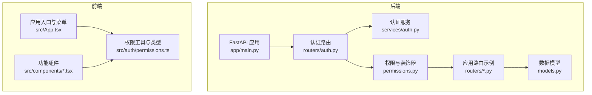
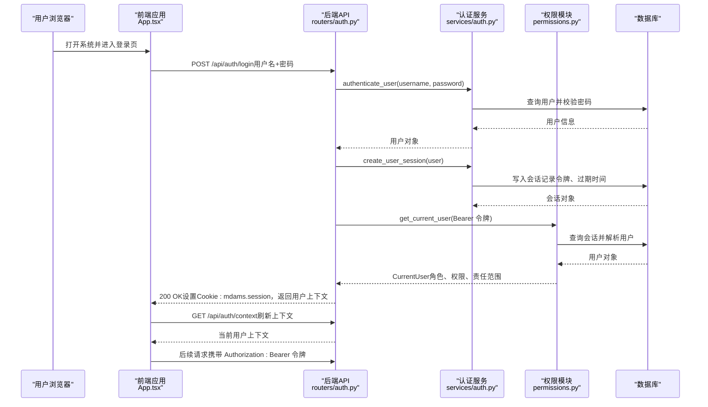
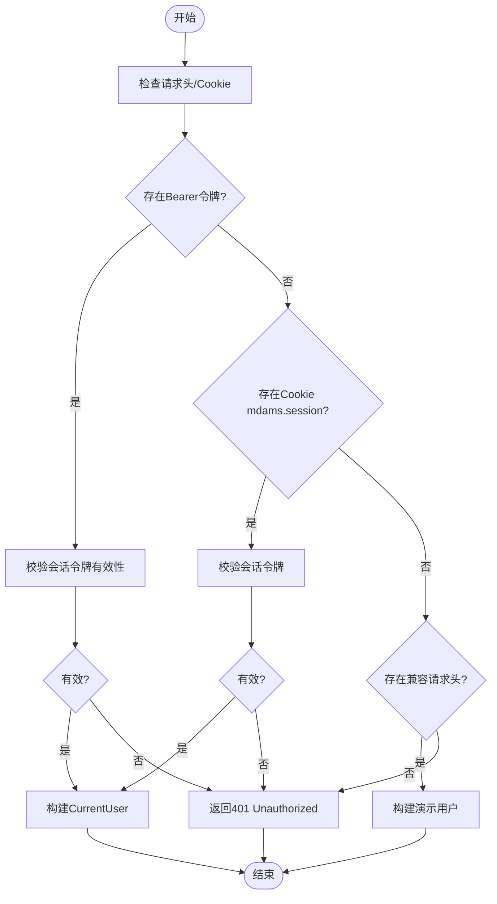
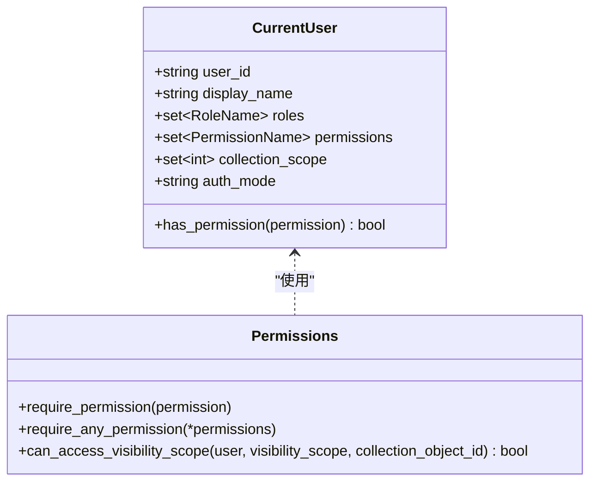
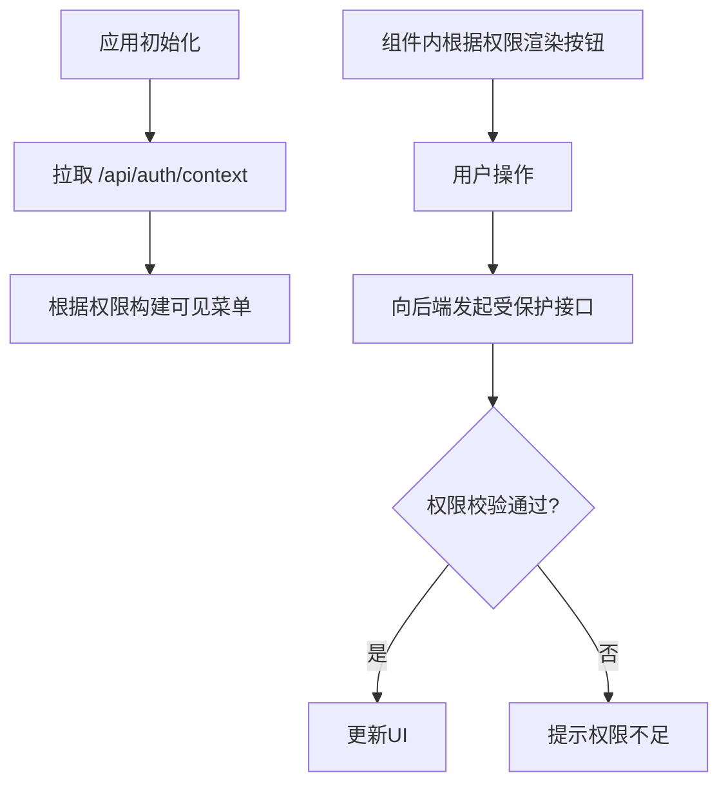
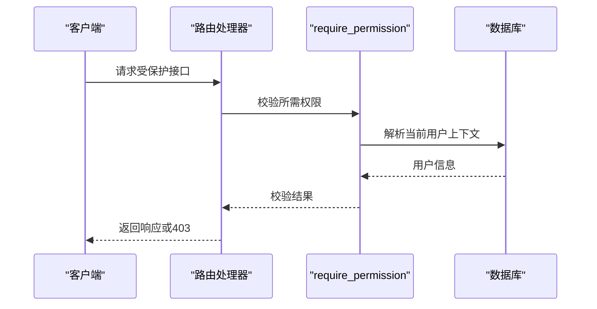
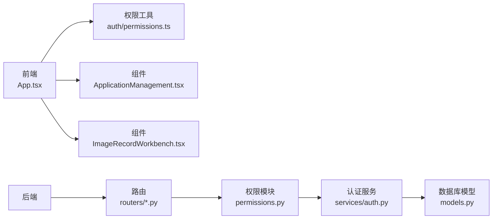

# 认证与权限系统

<cite>
**本文档引用的文件**
- [backend/app/routers/auth.py](file://backend/app/routers/auth.py)
- [backend/app/services/auth.py](file://backend/app/services/auth.py)
- [backend/app/permissions.py](file://backend/app/permissions.py)
- [backend/app/models.py](file://backend/app/models.py)
- [backend/app/main.py](file://backend/app/main.py)
- [frontend/src/auth/permissions.ts](file://frontend/src/auth/permissions.ts)
- [frontend/src/App.tsx](file://frontend/src/App.tsx)
- [frontend/src/components/ApplicationManagement.tsx](file://frontend/src/components/ApplicationManagement.tsx)
- [frontend/src/components/ImageRecordWorkbench.tsx](file://frontend/src/components/ImageRecordWorkbench.tsx)
- [docs/03-产品与流程/USER_ROLE_PERMISSION_MATRIX.md](file://docs/03-产品与流程/USER_ROLE_PERMISSION_MATRIX.md)
- [backend/app/routers/applications.py](file://backend/app/routers/applications.py)
- [backend/app/routers/assets.py](file://backend/app/routers/assets.py)
- [backend/app/routers/iiif.py](file://backend/app/routers/iiif.py)
- [backend/app/routers/image_records.py](file://backend/app/routers/image_records.py)
</cite>

## 目录
1. [简介](#简介)
2. [项目结构](#项目结构)
3. [核心组件](#核心组件)
4. [架构总览](#架构总览)
5. [详细组件分析](#详细组件分析)
6. [依赖关系分析](#依赖关系分析)
7. [性能考量](#性能考量)
8. [故障排查指南](#故障排查指南)
9. [结论](#结论)
10. [附录](#附录)

## 简介
本文件面向MDAMS原型项目的认证与权限系统，系统采用基于会话的认证与基于角色的访问控制（RBAC），结合前后端协同的权限控制机制，覆盖登录流程、会话管理、权限模型、菜单与按钮级控制、数据范围过滤以及后端接口保护等关键环节。文档同时提供角色矩阵、最佳实践与安全建议，帮助开发者与运维人员快速理解并正确使用该系统。

## 项目结构
系统由后端FastAPI服务与前端React应用组成，认证与权限相关的关键模块分布如下：
- 后端
  - 认证路由与服务：/backend/app/routers/auth.py、/backend/app/services/auth.py
  - 权限与装饰器：/backend/app/permissions.py
  - 数据模型：/backend/app/models.py
  - 应用启动与种子数据：/backend/app/main.py
  - 权限使用示例：/backend/app/routers/applications.py、/backend/app/routers/assets.py、/backend/app/routers/iiif.py、/backend/app/routers/image_records.py
- 前端
  - 权限工具与类型：/frontend/src/auth/permissions.ts
  - 应用入口与菜单渲染：/frontend/src/App.tsx
  - 权限驱动的功能组件：/frontend/src/components/ApplicationManagement.tsx、/frontend/src/components/ImageRecordWorkbench.tsx
- 文档矩阵
  - 角色与权限矩阵：/docs/03-产品与流程/USER_ROLE_PERMISSION_MATRIX.md

**图表来源**
- [backend/app/main.py:64-86](file://backend/app/main.py#L64-L86)
- [backend/app/routers/auth.py:10-83](file://backend/app/routers/auth.py#L10-L83)
- [backend/app/services/auth.py:1-143](file://backend/app/services/auth.py#L1-L143)
- [backend/app/permissions.py:17-255](file://backend/app/permissions.py#L17-L255)
- [frontend/src/auth/permissions.ts:1-111](file://frontend/src/auth/permissions.ts#L1-L111)
- [frontend/src/App.tsx:100-905](file://frontend/src/App.tsx#L100-L905)

**章节来源**
- [backend/app/main.py:64-86](file://backend/app/main.py#L64-L86)
- [backend/app/routers/auth.py:10-83](file://backend/app/routers/auth.py#L10-L83)
- [frontend/src/auth/permissions.ts:1-111](file://frontend/src/auth/permissions.ts#L1-L111)
- [frontend/src/App.tsx:100-905](file://frontend/src/App.tsx#L100-L905)

## 核心组件
- 会话认证与上下文
  - 后端通过Cookie存储会话令牌，登录成功后写入httponly Cookie，并返回用户上下文（角色、权限、责任范围等）
  - 前端在登录成功后持久化令牌并在后续请求头中携带
- 权限模型
  - 基于角色的权限映射，支持“任意权限”和“必须权限”的装饰器校验
  - 支持数据范围过滤（如责任范围）
- 前端权限控制
  - 菜单动态渲染、按钮级权限控制、组件内权限判断
- 后端接口保护
  - 使用依赖注入的权限装饰器保护各业务路由

**章节来源**
- [backend/app/routers/auth.py:53-83](file://backend/app/routers/auth.py#L53-L83)
- [backend/app/services/auth.py:102-143](file://backend/app/services/auth.py#L102-L143)
- [backend/app/permissions.py:17-255](file://backend/app/permissions.py#L17-L255)
- [frontend/src/auth/permissions.ts:84-111](file://frontend/src/auth/permissions.ts#L84-L111)
- [frontend/src/App.tsx:116-139](file://frontend/src/App.tsx#L116-L139)

## 架构总览
认证与权限的整体交互流程如下：

**图表来源**
- [backend/app/routers/auth.py:53-83](file://backend/app/routers/auth.py#L53-L83)
- [backend/app/services/auth.py:136-143](file://backend/app/services/auth.py#L136-L143)
- [backend/app/services/auth.py:102-112](file://backend/app/services/auth.py#L102-L112)
- [backend/app/permissions.py:179-204](file://backend/app/permissions.py#L179-L204)
- [frontend/src/App.tsx:404-417](file://frontend/src/App.tsx#L404-L417)

## 详细组件分析

### 认证流程与会话管理
- 登录
  - 后端接收用户名与密码，调用认证服务校验
  - 成功后创建会话，写入数据库并设置Cookie
  - 返回令牌与用户上下文
- 会话校验
  - 优先从Authorization头解析Bearer令牌
  - 其次从Cookie解析mdams.session
  - 支持兼容请求头（X-MDAMS-User）用于演示环境
- 退出登录
  - 清理会话令牌并删除Cookie

**图表来源**
- [backend/app/permissions.py:179-204](file://backend/app/permissions.py#L179-L204)
- [backend/app/services/auth.py:115-134](file://backend/app/services/auth.py#L115-L134)
- [backend/app/routers/auth.py:53-83](file://backend/app/routers/auth.py#L53-L83)

**章节来源**
- [backend/app/routers/auth.py:53-83](file://backend/app/routers/auth.py#L53-L83)
- [backend/app/services/auth.py:102-143](file://backend/app/services/auth.py#L102-L143)
- [backend/app/permissions.py:179-204](file://backend/app/permissions.py#L179-L204)

### 密码策略与安全
- 密码哈希
  - 使用PBKDF2-HMAC-SHA256，固定盐值与迭代次数，确保抗暴力破解
- 默认密码
  - 种子数据中为默认测试用户设置统一默认密码，生产环境应强制修改
- 会话安全
  - 会话Cookie标记httponly、sameSite lax、路径/有效期限制
  - 会话过期自动清理

**章节来源**
- [backend/app/services/auth.py:44-56](file://backend/app/services/auth.py#L44-L56)
- [backend/app/services/auth.py:115-134](file://backend/app/services/auth.py#L115-L134)
- [backend/app/routers/auth.py:60-68](file://backend/app/routers/auth.py#L60-L68)

### 权限模型与RBAC
- 角色到权限映射
  - 每个角色映射一组权限集合，系统管理员额外拥有“system.manage”
- 权限检查
  - require_permission：单一权限校验
  - require_any_permission：任一权限满足即通过
- 数据范围过滤
  - can_access_visibility_scope：根据资源可见范围与用户责任范围判定访问权限

**图表来源**
- [backend/app/permissions.py:102-151](file://backend/app/permissions.py#L102-L151)
- [backend/app/permissions.py:214-236](file://backend/app/permissions.py#L214-L236)
- [backend/app/permissions.py:239-254](file://backend/app/permissions.py#L239-L254)

**章节来源**
- [backend/app/permissions.py:17-94](file://backend/app/permissions.py#L17-L94)
- [backend/app/permissions.py:102-151](file://backend/app/permissions.py#L102-L151)
- [backend/app/permissions.py:214-236](file://backend/app/permissions.py#L214-L236)
- [backend/app/permissions.py:239-254](file://backend/app/permissions.py#L239-L254)

### 前端权限控制机制
- 菜单动态渲染
  - 基于菜单到权限的规则映射，仅展示用户具备相应权限的菜单
- 按钮级控制
  - 组件内部根据权限集合决定按钮是否显示与可点击
- 上下文与本地存储
  - 登录成功后持久化令牌，刷新时拉取用户上下文

**图表来源**
- [frontend/src/App.tsx:116-139](file://frontend/src/App.tsx#L116-L139)
- [frontend/src/App.tsx:526-550](file://frontend/src/App.tsx#L526-L550)
- [frontend/src/auth/permissions.ts:84-111](file://frontend/src/auth/permissions.ts#L84-L111)

**章节来源**
- [frontend/src/App.tsx:116-139](file://frontend/src/App.tsx#L116-L139)
- [frontend/src/App.tsx:526-550](file://frontend/src/App.tsx#L526-L550)
- [frontend/src/auth/permissions.ts:84-111](file://frontend/src/auth/permissions.ts#L84-L111)

### 后端权限验证机制
- 路由装饰器
  - require_permission：保护需要特定权限的接口
  - require_any_permission：保护需要任一权限的接口
- 示例
  - 申请管理：创建、查看、审批、导出等接口均使用相应权限装饰器
  - 资源管理：上传、删除、查看等接口按权限控制
  - IIIF与资产：统一使用“image.view”等权限控制访问

**图表来源**
- [backend/app/routers/applications.py:132-174](file://backend/app/routers/applications.py#L132-L174)
- [backend/app/routers/applications.py:177-200](file://backend/app/routers/applications.py#L177-L200)
- [backend/app/routers/assets.py:213-271](file://backend/app/routers/assets.py#L213-L271)
- [backend/app/routers/iiif.py:142-262](file://backend/app/routers/iiif.py#L142-L262)

**章节来源**
- [backend/app/routers/applications.py:132-174](file://backend/app/routers/applications.py#L132-L174)
- [backend/app/routers/applications.py:177-200](file://backend/app/routers/applications.py#L177-L200)
- [backend/app/routers/assets.py:213-271](file://backend/app/routers/assets.py#L213-L271)
- [backend/app/routers/iiif.py:142-262](file://backend/app/routers/iiif.py#L142-L262)

### 用户角色体系与职责
- 角色与权限矩阵
  - 系统内置角色与对应权限详见角色矩阵文档
  - 主要角色包括：二维结构化编辑员、二维入库操作员、二维入库审核员、二维资源管理员、影像元数据录入员、摄影上传人员、三维操作员、申请审核员、馆藏责任人、资源使用者、系统管理员
- 责任范围
  - 馆藏责任人可通过collection_scope限定可访问的资源集合
  - 可见范围规则支持“公开”和“仅责任人可见”

**章节来源**
- [docs/03-产品与流程/USER_ROLE_PERMISSION_MATRIX.md:14-96](file://docs/03-产品与流程/USER_ROLE_PERMISSION_MATRIX.md#L14-L96)
- [backend/app/permissions.py:239-254](file://backend/app/permissions.py#L239-L254)

### 前端功能组件中的权限控制示例
- 申请管理
  - 根据权限决定是否显示“审批/导出/批量处理”按钮
- 影像记录工作台
  - 根据权限决定是否允许创建、编辑、提交、退回、上传、匹配等操作

**章节来源**
- [frontend/src/components/ApplicationManagement.tsx:103-175](file://frontend/src/components/ApplicationManagement.tsx#L103-L175)
- [frontend/src/components/ImageRecordWorkbench.tsx:257-263](file://frontend/src/components/ImageRecordWorkbench.tsx#L257-L263)

## 依赖关系分析
- 模块耦合
  - 路由层依赖权限模块与认证服务
  - 权限模块依赖数据库模型与认证服务
  - 前端权限工具被应用入口与组件广泛依赖
- 外部依赖
  - FastAPI（后端Web框架）
  - SQLAlchemy（ORM）
  - Ant Design（前端UI）

**图表来源**
- [frontend/src/App.tsx:100-905](file://frontend/src/App.tsx#L100-L905)
- [frontend/src/auth/permissions.ts:1-111](file://frontend/src/auth/permissions.ts#L1-111)
- [frontend/src/components/ApplicationManagement.tsx:1-293](file://frontend/src/components/ApplicationManagement.tsx#L1-L293)
- [frontend/src/components/ImageRecordWorkbench.tsx:1-800](file://frontend/src/components/ImageRecordWorkbench.tsx#L1-L800)
- [backend/app/routers/applications.py:1-200](file://backend/app/routers/applications.py#L1-L200)
- [backend/app/permissions.py:1-255](file://backend/app/permissions.py#L1-L255)
- [backend/app/services/auth.py:1-143](file://backend/app/services/auth.py#L1-L143)
- [backend/app/models.py:1-307](file://backend/app/models.py#L1-L307)

**章节来源**
- [backend/app/routers/applications.py:1-200](file://backend/app/routers/applications.py#L1-L200)
- [backend/app/permissions.py:1-255](file://backend/app/permissions.py#L1-L255)
- [backend/app/services/auth.py:1-143](file://backend/app/services/auth.py#L1-L143)
- [backend/app/models.py:1-307](file://backend/app/models.py#L1-L307)
- [frontend/src/App.tsx:100-905](file://frontend/src/App.tsx#L100-L905)
- [frontend/src/auth/permissions.ts:1-111](file://frontend/src/auth/permissions.ts#L1-L111)

## 性能考量
- 会话校验
  - 令牌校验涉及数据库查询，建议在网关或中间层缓存近期活跃会话
- 权限计算
  - 角色到权限映射为内存集合运算，开销极低
- 前端渲染
  - 菜单与按钮的权限判断在组件内进行，避免不必要的网络请求

## 故障排查指南
- 登录失败
  - 检查用户名是否存在且激活，密码是否与哈希匹配
  - 确认会话是否过期或被清理
- 401未授权
  - 确认请求头Authorization是否携带Bearer令牌
  - 确认Cookie mdams.session 是否存在且未过期
- 403权限不足
  - 检查当前用户角色是否具备所需权限
  - 确认是否满足数据范围过滤条件（如责任范围）
- 前端菜单不显示
  - 检查权限工具中的菜单规则与用户权限集合
  - 确认应用初始化时是否成功拉取用户上下文

**章节来源**
- [backend/app/services/auth.py:136-143](file://backend/app/services/auth.py#L136-L143)
- [backend/app/services/auth.py:115-134](file://backend/app/services/auth.py#L115-L134)
- [backend/app/permissions.py:214-236](file://backend/app/permissions.py#L214-L236)
- [frontend/src/App.tsx:183-205](file://frontend/src/App.tsx#L183-L205)

## 结论
MDAMS原型的认证与权限系统以RBAC为核心，结合会话令牌与前后端协同控制，实现了从登录、会话、权限校验到菜单与按钮级控制的完整闭环。通过角色矩阵与装饰器机制，系统能够灵活支撑不同业务场景下的权限需求。建议在生产环境中强化密码策略、会话安全与审计日志，并持续完善后台角色管理与更细粒度的数据权限控制。

## 附录
- 默认测试用户与密码
  - 系统种子数据包含多类测试用户，默认密码为mdams123
- 角色与权限矩阵
  - 详见角色矩阵文档，涵盖当前已实现的角色、权限与菜单入口规则

**章节来源**
- [backend/app/services/auth.py:29-41](file://backend/app/services/auth.py#L29-L41)
- [docs/03-产品与流程/USER_ROLE_PERMISSION_MATRIX.md:128-150](file://docs/03-产品与流程/USER_ROLE_PERMISSION_MATRIX.md#L128-L150)