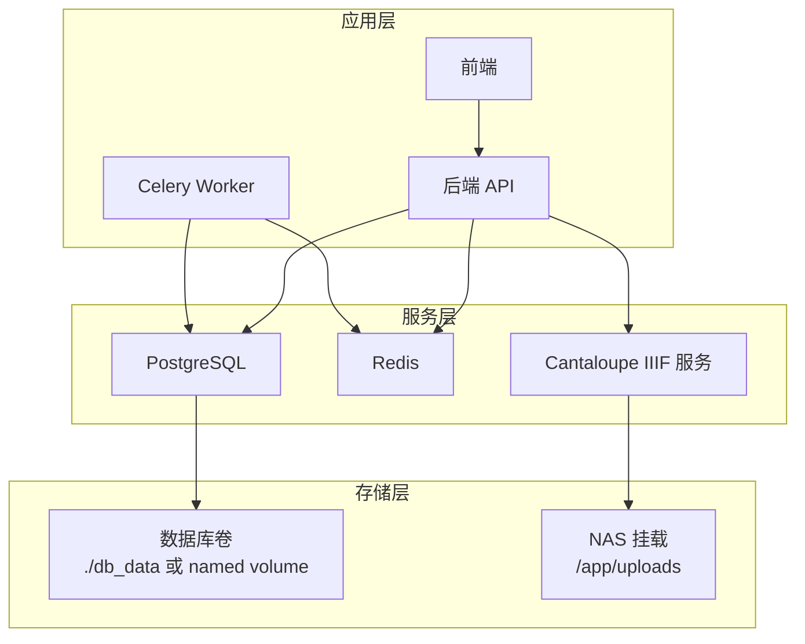
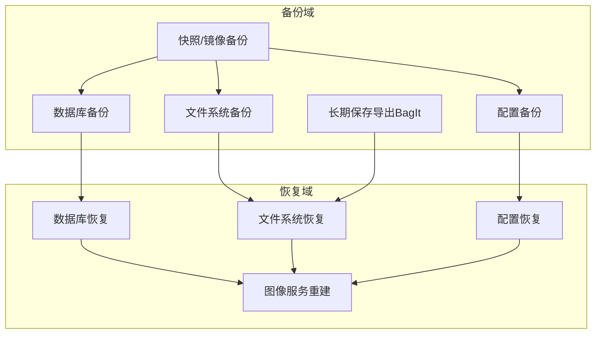
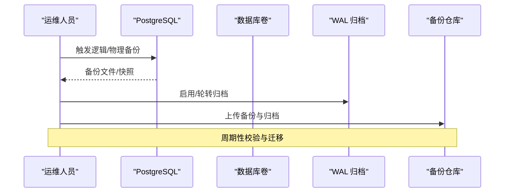
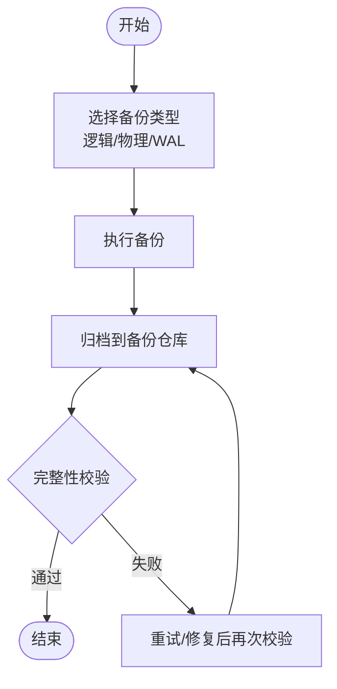
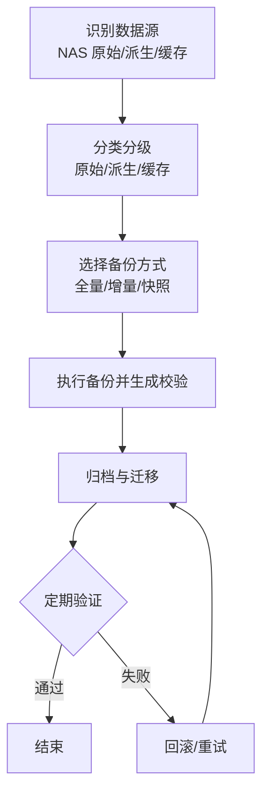
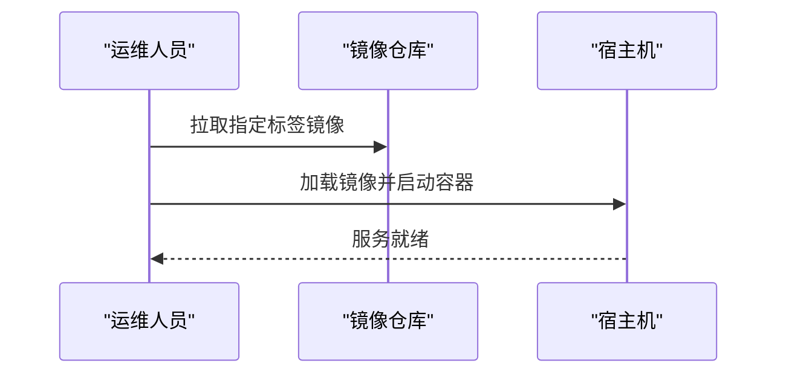
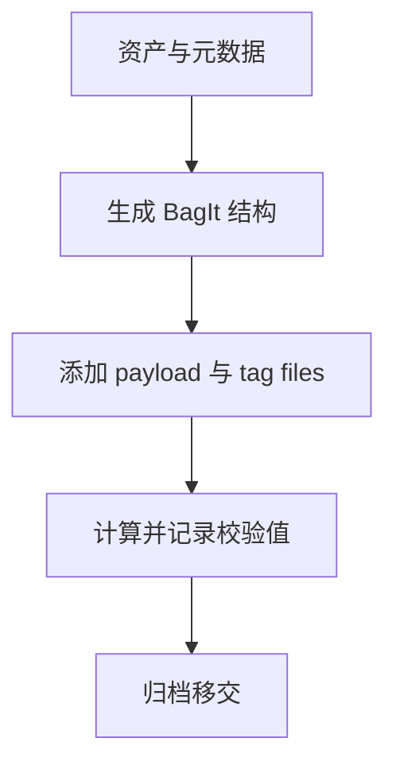
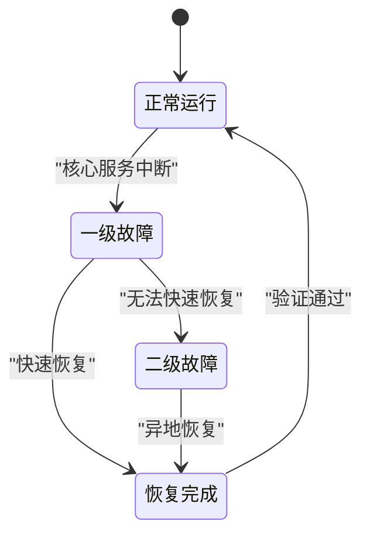
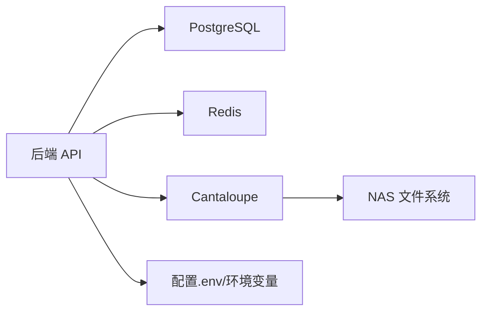

# 备份与恢复

<cite>
**本文引用的文件**
- [README.md](file://README.md)
- [DEPLOYMENT.md](file://DEPLOYMENT.md)
- [docker-compose.yml](file://docker-compose.yml)
- [docker-compose.local-postgres.yml](file://docker-compose.local-postgres.yml)
- [manage_local_postgres.ps1](file://manage_local_postgres.ps1)
- [backend/app/config.py](file://backend/app/config.py)
- [backend/app/database.py](file://backend/app/database.py)
- [cantaloupe.properties](file://cantaloupe.properties)
- [docs/08-研究/长期保存SIP打包说明（BAGIT_SIP_PROFILE）.md](file://docs/08-研究/长期保存SIP打包说明（BAGIT_SIP_PROFILE）.md)
- [docs/02-架构设计/DATA_INGEST_ARCHITECTURE.md](file://docs/02-架构设计/DATA_INGEST_ARCHITECTURE.md)
- [docs/02-架构设计/SYSTEM_ARCHITECTURE.md](file://docs/02-架构设计/SYSTEM_ARCHITECTURE.md)
- [deploy.sh](file://deploy.sh)
- [publish.sh](file://publish.sh)
</cite>

## 目录
1. [简介](#简介)
2. [项目结构](#项目结构)
3. [核心组件](#核心组件)
4. [架构总览](#架构总览)
5. [详细组件分析](#详细组件分析)
6. [依赖关系分析](#依赖关系分析)
7. [性能考量](#性能考量)
8. [故障排查指南](#故障排查指南)
9. [结论](#结论)
10. [附录](#附录)

## 简介
本文件面向 MDAMS 原型项目的备份与恢复，围绕数据备份、配置备份、镜像备份、数据库备份与恢复、文件系统备份、灾难恢复计划、备份验证与测试、备份存储与归档管理等方面，结合现有代码与文档进行系统化梳理与落地建议。目标是在不改变现有架构的前提下，给出可执行的备份策略与恢复流程，确保业务连续性与数据安全。

## 项目结构
- 后端服务通过 Docker Compose 编排，包含数据库、缓存、Web 前端、后端 API、异步任务、图像服务等。
- 数据库使用 PostgreSQL，采用卷持久化；文件系统数据通过 NAS 挂载共享。
- 配置通过环境变量注入，便于集中管理与切换。

图表来源
- [docker-compose.yml:1-131](file://docker-compose.yml#L1-L131)
- [docker-compose.local-postgres.yml:1-19](file://docker-compose.local-postgres.yml#L1-L19)
- [cantaloupe.properties:1-28](file://cantaloupe.properties#L1-L28)

章节来源
- [docker-compose.yml:1-131](file://docker-compose.yml#L1-L131)
- [docker-compose.local-postgres.yml:1-19](file://docker-compose.local-postgres.yml#L1-L19)
- [DEPLOYMENT.md:1-90](file://DEPLOYMENT.md#L1-L90)

## 核心组件
- 数据库（PostgreSQL）
  - 生产数据库通过 named volume 持久化，开发/测试可使用本地卷或独立容器。
  - 通过环境变量 DATABASE_URL 指定连接串。
- 缓存（Redis）
  - 作为 Celery 的消息中间件，也用于会话与临时状态。
- 文件系统
  - 原始文件与处理产物挂载自 NAS，路径映射到容器内 /app/uploads。
- 图像服务（Cantaloupe）
  - 从 NAS 直接读取原图，提供 IIIF 服务。
- 配置与环境
  - 通过 .env 注入，后端读取环境变量并生成连接串与路径。

章节来源
- [backend/app/config.py:1-72](file://backend/app/config.py#L1-L72)
- [backend/app/database.py:1-17](file://backend/app/database.py#L1-L17)
- [docker-compose.yml:1-131](file://docker-compose.yml#L1-L131)
- [cantaloupe.properties:1-28](file://cantaloupe.properties#L1-L28)

## 架构总览
下图展示备份与恢复涉及的关键组件与数据流向：

图表来源
- [docs/08-研究/长期保存SIP打包说明（BAGIT_SIP_PROFILE）.md:43-91](file://docs/08-研究/长期保存SIP打包说明（BAGIT_SIP_PROFILE）.md#L43-L91)
- [docs/02-架构设计/DATA_INGEST_ARCHITECTURE.md:88-107](file://docs/02-架构设计/DATA_INGEST_ARCHITECTURE.md#L88-L107)
- [docker-compose.yml:1-131](file://docker-compose.yml#L1-L131)

## 详细组件分析

### 数据备份（PostgreSQL）
- 备份方式
  - 逻辑备份：使用数据库客户端工具进行逻辑导出，适合跨版本迁移与小规模恢复。
  - 物理备份：基于卷快照或容器停止时的卷拷贝，适合快速恢复。
  - 流式备份：开启 WAL 归档，支持时间点恢复（RTO/RPO 可控）。
- 现状与建议
  - 生产数据库使用 named volume，建议结合定时快照与归档 WAL，形成“快照+归档”的混合策略。
  - 开发/测试可使用独立容器与本地卷，便于快速回滚与对比测试。
- 关键参数与路径
  - 数据库连接串由环境变量 DATABASE_URL 提供。
  - 生产数据库卷路径在 Compose 中定义，开发本地卷在本地目录。

图表来源
- [backend/app/config.py:42-46](file://backend/app/config.py#L42-L46)
- [docker-compose.yml:94-97](file://docker-compose.yml#L94-L97)
- [docker-compose.local-postgres.yml:13-14](file://docker-compose.local-postgres.yml#L13-L14)

章节来源
- [backend/app/config.py:42-46](file://backend/app/config.py#L42-L46)
- [backend/app/database.py:1-17](file://backend/app/database.py#L1-L17)
- [docker-compose.yml:94-97](file://docker-compose.yml#L94-L97)
- [docker-compose.local-postgres.yml:1-19](file://docker-compose.local-postgres.yml#L1-L19)

### 数据库备份与恢复流程
- 逻辑备份
  - 使用数据库客户端工具对业务库与系统库分别导出，保留对象定义与数据。
  - 建议按库拆分，便于选择性恢复。
- 物理备份
  - 基于 named volume 的快照或容器停止时的卷拷贝，适合整库恢复。
- 时间点恢复（RPO 目标）
  - 启用 WAL 归档，配合备份介质，实现到分钟级的精细恢复。
- 恢复验证
  - 在隔离环境还原后，执行健康检查与关键查询，验证完整性与一致性。

图表来源
- [manage_local_postgres.ps1:57-97](file://manage_local_postgres.ps1#L57-L97)
- [docker-compose.local-postgres.yml:1-19](file://docker-compose.local-postgres.yml#L1-L19)

章节来源
- [manage_local_postgres.ps1:1-97](file://manage_local_postgres.ps1#L1-L97)
- [docker-compose.local-postgres.yml:1-19](file://docker-compose.local-postgres.yml#L1-L19)

### 文件系统备份（原始文件、处理产物、配置）
- 原始文件与处理产物
  - 原始文件与派生文件均来自 NAS 挂载目录，建议按“原始/派生/缓存”三层策略备份。
  - 建议对原始文件做哈希校验，派生文件与缓存可按需备份。
- 配置文件
  - 包括 Compose 文件、环境变量文件、图像服务配置等，建议纳入版本控制或单独归档。
- 备份策略
  - 增量备份：基于变更的时间戳或哈希差异。
  - 全量备份：周期性全量，降低恢复时长。
  - 归档保留：按法规与业务需求设定保留期。

图表来源
- [docker-compose.yml:30-32](file://docker-compose.yml#L30-L32)
- [docker-compose.yml:114-116](file://docker-compose.yml#L114-L116)
- [cantaloupe.properties:16-24](file://cantaloupe.properties#L16-L24)

章节来源
- [docker-compose.yml:30-32](file://docker-compose.yml#L30-L32)
- [docker-compose.yml:114-116](file://docker-compose.yml#L114-L116)
- [cantaloupe.properties:16-24](file://cantaloupe.properties#L16-L24)

### 镜像备份与恢复
- 镜像备份
  - 备份后端、前端、图像服务等容器镜像，建议打标签并推送到镜像仓库。
- 恢复流程
  - 从镜像仓库拉取对应标签，结合 Compose 启动，恢复服务。
- 与配置联动
  - 镜像恢复后，优先恢复配置文件，再恢复数据卷，最后启动服务。

图表来源
- [docker-compose.yml:2-109](file://docker-compose.yml#L2-L109)

章节来源
- [docker-compose.yml:2-109](file://docker-compose.yml#L2-L109)

### 长期保存导出（BagIt）
- 现状
  - 系统具备以数字资产为中心的 BagIt ZIP 导出能力，包含原始文件、必要访问衍生与校验信息。
- 备份意义
  - 作为长期保存移交层，满足合规与审计要求。
- 建议
  - 将 BagIt 导出纳入定期归档流程，形成可追溯的移交包。

图表来源
- [docs/08-研究/长期保存SIP打包说明（BAGIT_SIP_PROFILE）.md:43-91](file://docs/08-研究/长期保存SIP打包说明（BAGIT_SIP_PROFILE）.md#L43-L91)

章节来源
- [docs/08-研究/长期保存SIP打包说明（BAGIT_SIP_PROFILE）.md:43-91](file://docs/08-研究/长期保存SIP打包说明（BAGIT_SIP_PROFILE）.md#L43-L91)

### 灾难恢复计划（DRP）
- RTO/RPO 目标
  - RTO：根据业务影响设定，优先恢复核心服务（后端 API、数据库、图像服务）。
  - RPO：结合 WAL 归档与备份频率，目标可细化到分钟级。
- 恢复流程
  - 一级故障：快速切换到备用节点或镜像仓库，恢复镜像与配置，再恢复数据卷。
  - 二级故障：启用异地备份，按恢复顺序执行（配置→数据→服务）。
- 验证测试
  - 定期进行“破坏性演练”，验证从镜像、配置、数据到服务的全链路恢复。
  - 恢复后执行关键业务流程（上传、浏览、导出）与健康检查。

图表来源
- [docs/02-架构设计/DATA_INGEST_ARCHITECTURE.md:88-107](file://docs/02-架构设计/DATA_INGEST_ARCHITECTURE.md#L88-L107)
- [docs/02-架构设计/SYSTEM_ARCHITECTURE.md:62-95](file://docs/02-架构设计/SYSTEM_ARCHITECTURE.md#L62-L95)

章节来源
- [docs/02-架构设计/DATA_INGEST_ARCHITECTURE.md:88-107](file://docs/02-架构设计/DATA_INGEST_ARCHITECTURE.md#L88-L107)
- [docs/02-架构设计/SYSTEM_ARCHITECTURE.md:62-95](file://docs/02-架构设计/SYSTEM_ARCHITECTURE.md#L62-L95)

### 备份验证与测试
- 验证维度
  - 完整性：校验文件与数据库一致性。
  - 可用性：在隔离环境还原后，执行关键查询与业务流程。
  - 性能：验证恢复后服务响应与吞吐。
- 测试方法
  - 周期性抽样恢复演练，覆盖不同故障场景。
  - 对比恢复时间与数据一致性，持续优化备份策略。

章节来源
- [docs/08-研究/长期保存SIP打包说明（BAGIT_SIP_PROFILE）.md:43-91](file://docs/08-研究/长期保存SIP打包说明（BAGIT_SIP_PROFILE）.md#L43-L91)

### 备份存储与归档管理
- 本地备份
  - 使用宿主机本地目录或卷快照，适合快速恢复与日常备份。
- 异地备份
  - 将备份数据迁移到异地存储，满足灾难恢复与合规要求。
- 保留策略
  - 按法规与业务需求设定保留期，定期清理过期备份。
  - 建立备份清单与追踪机制，确保可追溯。

章节来源
- [deploy.sh:14-18](file://deploy.sh#L14-L18)
- [publish.sh:1-19](file://publish.sh#L1-L19)

## 依赖关系分析
- 组件耦合
  - 后端依赖数据库与缓存；图像服务依赖文件系统；配置贯穿所有组件。
- 外部依赖
  - Docker Compose、PostgreSQL、Redis、Cantaloupe、NAS 存储。
- 潜在风险
  - 卷损坏、镜像缺失、配置丢失、网络异常等，需通过多层备份与演练规避。

图表来源
- [docker-compose.yml:1-131](file://docker-compose.yml#L1-L131)
- [backend/app/config.py:1-72](file://backend/app/config.py#L1-L72)

章节来源
- [docker-compose.yml:1-131](file://docker-compose.yml#L1-L131)
- [backend/app/config.py:1-72](file://backend/app/config.py#L1-L72)

## 性能考量
- 备份性能
  - 采用并行与分层策略，减少对业务的影响。
- 恢复性能
  - 优先恢复镜像与配置，再恢复数据卷，缩短停机时间。
- 存储 I/O
  - 热数据与冷数据分离，提升备份与恢复效率。

章节来源
- [DEPLOYMENT.md:55-72](file://DEPLOYMENT.md#L55-L72)

## 故障排查指南
- 数据库
  - 检查容器状态、日志与卷挂载；确认连接串与凭据。
- 文件系统
  - 校验 NAS 挂载权限与路径映射。
- 配置
  - 确认 .env 与环境变量生效；核对公开 URL 与端口映射。
- 镜像与服务
  - 拉取镜像后，按 Compose 顺序启动，观察健康检查。

章节来源
- [DEPLOYMENT.md:73-89](file://DEPLOYMENT.md#L73-L89)
- [README.md:105-118](file://README.md#L105-L118)

## 结论
通过将“逻辑/物理备份+WAL 归档”与“文件系统与配置备份”相结合，并配套镜像备份与长期保存导出，MDAMS 原型可在保证业务连续性的同时，满足合规与审计要求。建议尽快建立自动化备份与演练机制，持续优化 RTO/RPO 目标与恢复流程。

## 附录
- 快速参考
  - 数据库连接串来源：后端配置模块。
  - 数据库卷路径：Compose 中定义。
  - 文件系统挂载：NAS 路径映射到容器。
  - 部署脚本：一键启动与状态检查。
  - 发布脚本：推送至远程仓库与本地裸仓。

章节来源
- [backend/app/config.py:42-46](file://backend/app/config.py#L42-L46)
- [docker-compose.yml:94-97](file://docker-compose.yml#L94-L97)
- [docker-compose.yml:30-32](file://docker-compose.yml#L30-L32)
- [docker-compose.yml:114-116](file://docker-compose.yml#L114-L116)
- [deploy.sh:1-38](file://deploy.sh#L1-L38)
- [publish.sh:1-19](file://publish.sh#L1-L19)