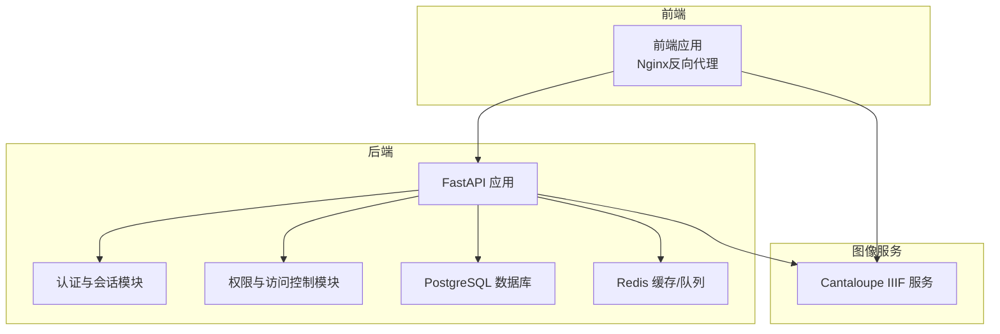
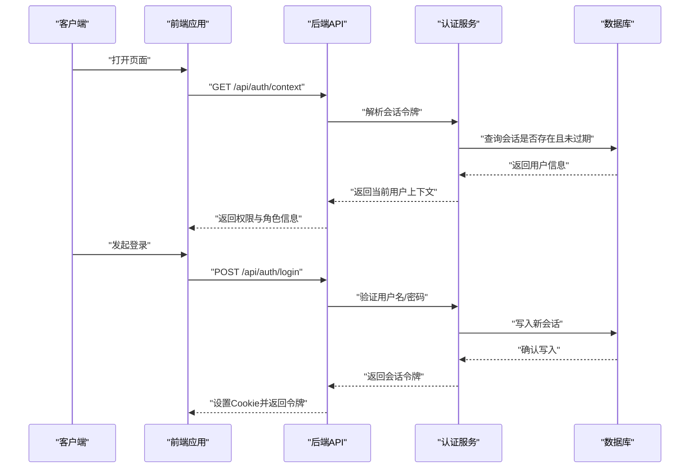
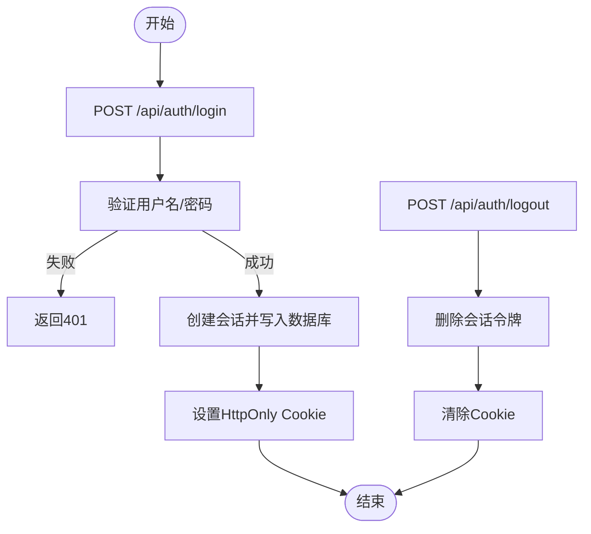
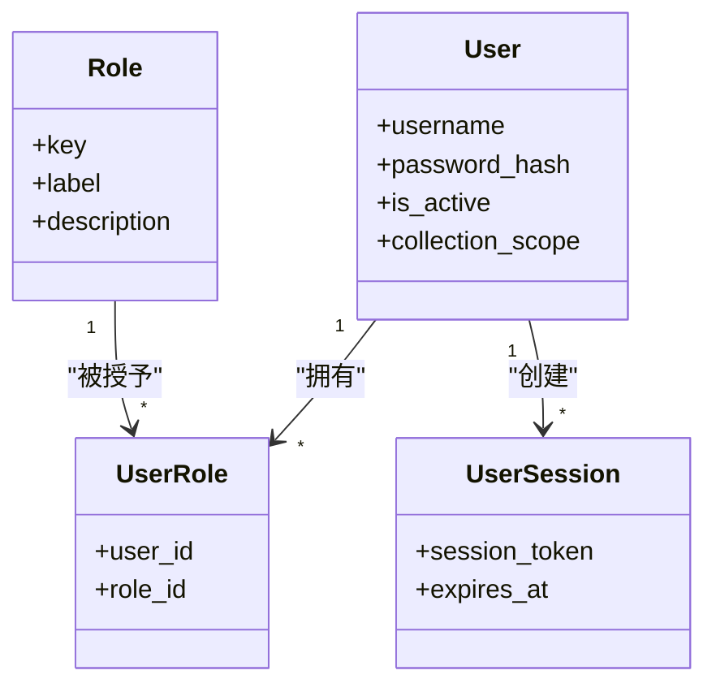
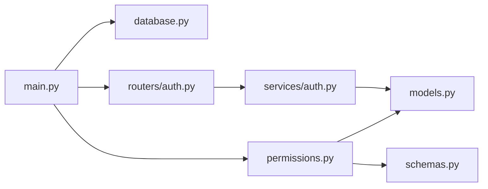

# 安全运维

<cite>
**本文引用的文件**
- [backend/app/main.py](file://backend/app/main.py)
- [backend/app/config.py](file://backend/app/config.py)
- [backend/app/database.py](file://backend/app/database.py)
- [backend/app/permissions.py](file://backend/app/permissions.py)
- [backend/app/routers/auth.py](file://backend/app/routers/auth.py)
- [backend/app/services/auth.py](file://backend/app/services/auth.py)
- [backend/app/models.py](file://backend/app/models.py)
- [backend/app/schemas.py](file://backend/app/schemas.py)
- [docker-compose.yml](file://docker-compose.yml)
- [docs/05-部署与运维/ENVIRONMENT_VARIABLES.md](file://docs/05-部署与运维/ENVIRONMENT_VARIABLES.md)
- [docs/03-产品与流程/USER_ROLE_PERMISSION_MATRIX.md](file://docs/03-产品与流程/USER_ROLE_PERMISSION_MATRIX.md)
- [frontend/src/auth/permissions.ts](file://frontend/src/auth/permissions.ts)
- [frontend/src/App.tsx](file://frontend/src/App.tsx)
- [backend/tests/test_auth_service.py](file://backend/tests/test_auth_service.py)
</cite>

## 目录
1. [简介](#简介)
2. [项目结构](#项目结构)
3. [核心组件](#核心组件)
4. [架构总览](#架构总览)
5. [详细组件分析](#详细组件分析)
6. [依赖分析](#依赖分析)
7. [性能考虑](#性能考虑)
8. [故障排查指南](#故障排查指南)
9. [结论](#结论)
10. [附录](#附录)

## 简介
本文件面向MDAMS原型项目的“安全运维”主题，系统化梳理并说明项目在访问控制、网络安全、数据保护、合规要求、身份认证与授权、会话管理、数据安全、安全审计与合规检查、漏洞管理与补丁更新、安全事件响应等方面的设计与实现现状，并给出可操作的最佳实践与配置建议。文档同时结合后端FastAPI应用、数据库、容器编排与前端权限控制的实际代码与配置进行说明，帮助运维与开发人员在部署与运行阶段落实安全策略。

## 项目结构
MDAMS原型采用前后端分离与容器化部署架构：
- 后端基于FastAPI，提供认证、权限控制、业务接口与健康检查等能力
- 前端基于React/Vite，负责菜单可见性、权限控制与用户交互
- 数据库使用PostgreSQL，会话与用户信息存储于数据库
- 通过Nginx作为反向代理，统一对外暴露API与静态资源
- 服务间通过容器网络通信，环境变量集中管理敏感参数

图表来源
- [docker-compose.yml:1-131](file://docker-compose.yml#L1-L131)
- [backend/app/main.py:1-86](file://backend/app/main.py#L1-L86)

章节来源
- [docker-compose.yml:1-131](file://docker-compose.yml#L1-L131)
- [backend/app/main.py:1-86](file://backend/app/main.py#L1-L86)

## 核心组件
- 认证与会话：后端提供登录、登出、上下文查询与会话持久化，使用数据库存储会话令牌与过期时间
- 权限与访问控制：基于角色的权限矩阵，支持多权限组合校验与资源可见范围控制
- 网络与部署：通过Nginx统一入口，容器内服务间通信，环境变量集中管理敏感配置
- 数据与密钥：数据库连接串、Redis连接串、AI服务密钥等通过环境变量注入
- 前端权限：前端根据后端返回的权限集合控制菜单可见性与功能按钮

章节来源
- [backend/app/routers/auth.py:1-83](file://backend/app/routers/auth.py#L1-L83)
- [backend/app/services/auth.py:1-143](file://backend/app/services/auth.py#L1-L143)
- [backend/app/permissions.py:1-255](file://backend/app/permissions.py#L1-L255)
- [frontend/src/auth/permissions.ts:1-111](file://frontend/src/auth/permissions.ts#L1-L111)
- [docs/05-部署与运维/ENVIRONMENT_VARIABLES.md:1-86](file://docs/05-部署与运维/ENVIRONMENT_VARIABLES.md#L1-L86)

## 架构总览
下图展示认证与权限在系统中的交互流程，包括登录、会话存储、上下文获取与权限校验的关键步骤。

图表来源
- [backend/app/routers/auth.py:53-68](file://backend/app/routers/auth.py#L53-L68)
- [backend/app/services/auth.py:102-142](file://backend/app/services/auth.py#L102-L142)
- [backend/app/permissions.py:179-204](file://backend/app/permissions.py#L179-L204)

## 详细组件分析

### 认证与会话管理
- 登录流程：前端提交用户名/密码，后端调用认证服务验证，成功后创建会话并返回令牌，设置HttpOnly Cookie
- 会话存储：会话令牌与过期时间存储在数据库，支持过期自动清理
- 上下文获取：后端根据Header中的Bearer令牌或Cookie中的会话令牌解析当前用户
- 登出流程：后端删除对应会话令牌，前端清除Cookie

图表来源
- [backend/app/routers/auth.py:53-82](file://backend/app/routers/auth.py#L53-L82)
- [backend/app/services/auth.py:102-134](file://backend/app/services/auth.py#L102-L134)

章节来源
- [backend/app/routers/auth.py:1-83](file://backend/app/routers/auth.py#L1-L83)
- [backend/app/services/auth.py:1-143](file://backend/app/services/auth.py#L1-L143)
- [backend/app/models.py:101-110](file://backend/app/models.py#L101-L110)
- [backend/tests/test_auth_service.py:1-38](file://backend/tests/test_auth_service.py#L1-L38)

### 权限与访问控制
- 角色到权限映射：后端定义角色到权限集合的映射，支持多角色叠加
- 权限校验：提供装饰器与依赖函数，确保接口访问受控
- 可见范围：支持“开放”和“仅责任人可见”两类资源可见范围，结合用户集合范围进行判定
- 前端菜单控制：前端依据后端返回的权限集合动态渲染菜单

图表来源
- [backend/app/models.py:28-110](file://backend/app/models.py#L28-L110)
- [backend/app/permissions.py:17-94](file://backend/app/permissions.py#L17-L94)

章节来源
- [backend/app/permissions.py:1-255](file://backend/app/permissions.py#L1-L255)
- [docs/03-产品与流程/USER_ROLE_PERMISSION_MATRIX.md:1-194](file://docs/03-产品与流程/USER_ROLE_PERMISSION_MATRIX.md#L1-L194)
- [frontend/src/auth/permissions.ts:1-111](file://frontend/src/auth/permissions.ts#L1-L111)

### 网络与部署安全
- 反向代理：前端通过Nginx暴露服务，统一入口便于后续启用HTTPS与WAF
- 容器网络：服务间通过容器网络通信，避免直接暴露数据库与缓存端口
- 环境变量：数据库连接串、Redis连接串、AI服务密钥等通过环境变量注入，避免硬编码
- CORS策略：后端已启用CORS中间件，需结合生产环境域名与路径进行精细化配置

章节来源
- [docker-compose.yml:1-131](file://docker-compose.yml#L1-L131)
- [backend/app/main.py:66-73](file://backend/app/main.py#L66-L73)
- [docs/05-部署与运维/ENVIRONMENT_VARIABLES.md:1-86](file://docs/05-部署与运维/ENVIRONMENT_VARIABLES.md#L1-L86)

### 数据安全与密钥管理
- 密码存储：使用PBKDF2-HMAC-SHA256加盐存储，迭代次数较高，提升抗暴力破解能力
- 会话令牌：使用URL安全随机字符串生成，长度适中，满足安全强度
- 传输安全：建议在生产环境启用TLS终止于Nginx或边缘网关，后端与数据库之间使用加密连接
- 配置隔离：敏感参数通过环境变量注入，避免进入镜像或版本库

章节来源
- [backend/app/services/auth.py:44-59](file://backend/app/services/auth.py#L44-L59)
- [backend/app/config.py:42-72](file://backend/app/config.py#L42-L72)
- [docs/05-部署与运维/ENVIRONMENT_VARIABLES.md:1-86](file://docs/05-部署与运维/ENVIRONMENT_VARIABLES.md#L1-L86)

### 健康检查与可观测性
- 健康检查：后端提供健康检查与就绪检查接口，便于容器编排与负载均衡
- 日志与监控：建议在容器编排中开启应用日志采集与指标上报，结合数据库与缓存的监控指标进行综合观测

章节来源
- [backend/app/main.py:12-12](file://backend/app/main.py#L12-L12)
- [docker-compose.yml:1-131](file://docker-compose.yml#L1-L131)

## 依赖分析
后端应用的主要依赖关系如下：
- 应用启动：初始化数据库表、迁移兼容字段、种子认证数据
- 路由注册：统一注册认证、资产、应用、健康检查等路由
- 中间件：CORS中间件启用
- 服务与模型：认证服务依赖用户、角色、会话模型；权限模块依赖认证服务与数据库

图表来源
- [backend/app/main.py:1-86](file://backend/app/main.py#L1-L86)
- [backend/app/database.py:1-17](file://backend/app/database.py#L1-L17)
- [backend/app/routers/auth.py:1-83](file://backend/app/routers/auth.py#L1-L83)
- [backend/app/services/auth.py:1-143](file://backend/app/services/auth.py#L1-L143)
- [backend/app/permissions.py:1-255](file://backend/app/permissions.py#L1-L255)
- [backend/app/models.py:1-307](file://backend/app/models.py#L1-L307)
- [backend/app/schemas.py:1-652](file://backend/app/schemas.py#L1-L652)

章节来源
- [backend/app/main.py:1-86](file://backend/app/main.py#L1-L86)
- [backend/app/database.py:1-17](file://backend/app/database.py#L1-L17)
- [backend/app/routers/auth.py:1-83](file://backend/app/routers/auth.py#L1-L83)
- [backend/app/services/auth.py:1-143](file://backend/app/services/auth.py#L1-L143)
- [backend/app/permissions.py:1-255](file://backend/app/permissions.py#L1-L255)
- [backend/app/models.py:1-307](file://backend/app/models.py#L1-L307)
- [backend/app/schemas.py:1-652](file://backend/app/schemas.py#L1-L652)

## 性能考虑
- 会话过期：会话有效期为12小时，建议结合业务场景调整，避免频繁登录
- 数据库索引：针对资产与图像记录的关键字段建立索引，有助于查询性能
- 缓存与并发：Redis用于任务与缓存，建议合理设置并发与内存限制
- 图像服务：Cantaloupe通过Nginx代理，建议启用压缩与缓存策略

章节来源
- [backend/app/services/auth.py:13-13](file://backend/app/services/auth.py#L13-L13)
- [backend/app/main.py:21-56](file://backend/app/main.py#L21-L56)
- [docker-compose.yml:65-128](file://docker-compose.yml#L65-L128)

## 故障排查指南
- 登录失败
  - 检查用户名/密码是否正确，确认种子用户与默认密码
  - 查看会话是否过期或被删除
- 权限不足
  - 确认当前用户角色与权限集合
  - 检查资源可见范围与集合范围
- 健康检查异常
  - 检查数据库连接与Redis连通性
  - 查看容器日志与端口映射
- 前端菜单不可见
  - 确认后端返回的权限集合与前端菜单规则一致

章节来源
- [backend/tests/test_auth_service.py:1-38](file://backend/tests/test_auth_service.py#L1-L38)
- [frontend/src/App.tsx:150-205](file://frontend/src/App.tsx#L150-L205)
- [docs/03-产品与流程/USER_ROLE_PERMISSION_MATRIX.md:1-194](file://docs/03-产品与流程/USER_ROLE_PERMISSION_MATRIX.md#L1-L194)

## 结论
MDAMS原型在安全运维方面已具备较为完善的认证与权限控制基础：基于角色的权限矩阵、会话令牌存储与过期管理、前端菜单级权限控制、容器化与环境变量隔离等。建议在生产环境中进一步强化传输安全（TLS）、访问控制（WAF/Nginx策略）、密钥轮换与审计日志，完善漏洞扫描与补丁管理流程，并建立标准化的安全事件响应机制。

## 附录

### 安全配置示例与最佳实践
- 传输安全
  - 在Nginx层启用TLS终止，配置强密码套件与协议版本
  - 强制HTTPS重定向，禁用弱加密算法
- 访问控制
  - 在Nginx中限制来源IP与速率，启用WAF规则
  - CORS白名单限定为受信域名
- 密钥与配置
  - 使用环境变量注入数据库、Redis、AI服务密钥
  - 定期轮换密钥，使用密钥管理服务（如KMS）
- 数据保护
  - 数据库连接使用SSL/TLS
  - 重要日志脱敏，避免泄露敏感信息
- 审计与合规
  - 启用应用与系统日志，保留最少必要日志
  - 建立合规检查清单与定期审计流程
- 漏洞管理与补丁更新
  - 定期扫描容器镜像与依赖库
  - 制定补丁发布流程与回滚预案
- 事件响应
  - 建立事件分级与处置流程
  - 明确检测、通知、处置与复盘机制

### 关键接口与数据模型参考
- 认证接口
  - GET /api/auth/context：获取当前用户上下文
  - POST /api/auth/login：登录并创建会话
  - POST /api/auth/logout：登出会话
- 数据模型
  - 用户、角色、用户角色、用户会话、资产、图像记录、三维资源等

章节来源
- [backend/app/routers/auth.py:25-82](file://backend/app/routers/auth.py#L25-L82)
- [backend/app/models.py:28-307](file://backend/app/models.py#L28-L307)
- [backend/app/schemas.py:622-652](file://backend/app/schemas.py#L622-L652)