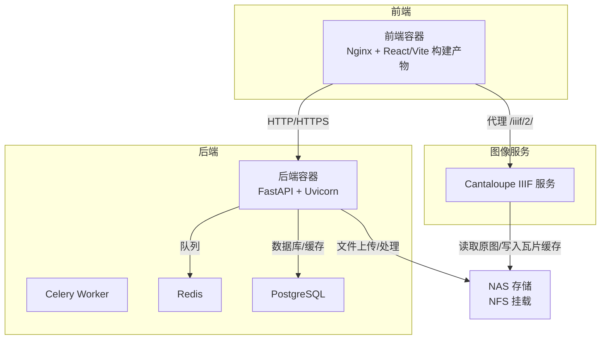
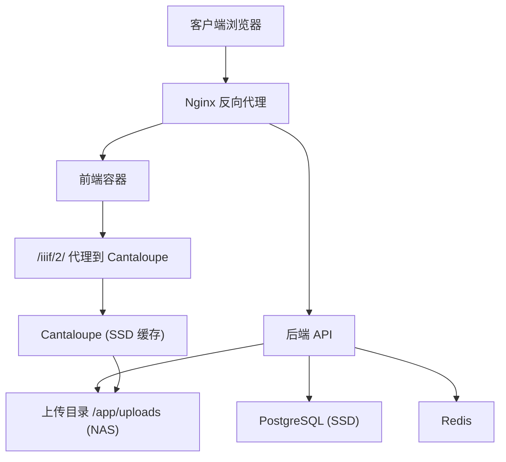
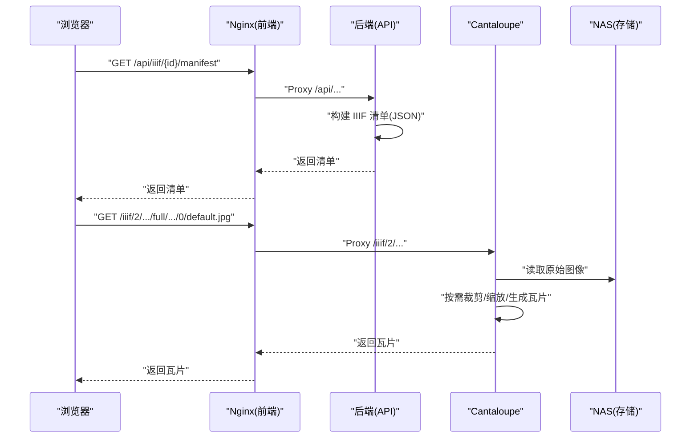
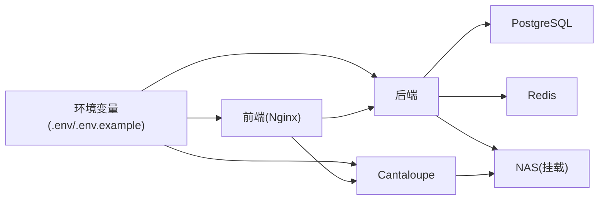

# 性能优化

<cite>
**本文引用的文件**
- [docker-compose.yml](file://docker-compose.yml)
- [backend/Dockerfile](file://backend/Dockerfile)
- [frontend/Dockerfile](file://frontend/Dockerfile)
- [cantaloupe/Dockerfile](file://cantaloupe/Dockerfile)
- [cantaloupe.properties](file://cantaloupe.properties)
- [backend/app/config.py](file://backend/app/config.py)
- [frontend/nginx.conf](file://frontend/nginx.conf)
- [backend/requirements.txt](file://backend/requirements.txt)
- [docs/05-部署与运维/ENVIRONMENT_VARIABLES.md](file://docs/05-部署与运维/ENVIRONMENT_VARIABLES.md)
- [SYSTEM_ARCHITECTURE.md](file://SYSTEM_ARCHITECTURE.md)
- [DEPLOYMENT.md](file://DEPLOYMENT.md)
- [CANTALOUPE_DEPLOY_NOTES.md](file://CANTALOUPE_DEPLOY_NOTES.md)
- [deploy.sh](file://deploy.sh)
</cite>

## 目录
1. [简介](#简介)
2. [项目结构](#项目结构)
3. [核心组件](#核心组件)
4. [架构总览](#架构总览)
5. [详细组件分析](#详细组件分析)
6. [依赖分析](#依赖分析)
7. [性能考虑](#性能考虑)
8. [故障排查指南](#故障排查指南)
9. [结论](#结论)
10. [附录](#附录)

## 简介
本文件面向MDAMS原型项目的性能优化，围绕硬件资源配置、软件调优、存储I/O、网络性能、缓存策略以及监控与测试方法展开，结合仓库中的容器编排、镜像构建与运行配置，给出可落地的优化策略与实操建议。

## 项目结构
项目采用多容器架构，由前端、后端、数据库、Redis、Cantaloupe（IIIF图像服务）组成；数据通过NFS挂载到NAS，热数据走本地SSD，冷数据走NAS，以平衡吞吐与成本。

图表来源
- [docker-compose.yml:1-131](file://docker-compose.yml#L1-L131)
- [frontend/nginx.conf:1-33](file://frontend/nginx.conf#L1-L33)
- [cantaloupe.properties:1-162](file://cantaloupe.properties#L1-L162)

章节来源
- [docker-compose.yml:1-131](file://docker-compose.yml#L1-L131)
- [SYSTEM_ARCHITECTURE.md:62-95](file://SYSTEM_ARCHITECTURE.md#L62-L95)

## 核心组件
- 后端服务（FastAPI/Uvicorn）：负责业务逻辑、元数据管理、图像派生策略与上传处理。
- Celery Worker：异步任务执行，降低请求延迟。
- 前端（Nginx静态服务）：代理后端API与Cantaloupe，提供静态资源分发。
- PostgreSQL：结构化数据存储，本地SSD提升I/O。
- Redis：任务队列与缓存。
- Cantaloupe：IIIF图像服务，按需生成瓦片并缓存到SSD。

章节来源
- [docker-compose.yml:1-131](file://docker-compose.yml#L1-L131)
- [backend/requirements.txt:1-18](file://backend/requirements.txt#L1-L18)
- [SYSTEM_ARCHITECTURE.md:62-95](file://SYSTEM_ARCHITECTURE.md#L62-L95)

## 架构总览
系统采用“热数据本地SSD + 冷数据NAS”的分层存储策略，后端与Cantaloupe均通过卷挂载共享NAS，避免重复存储与跨网传输；Nginx统一反向代理，隐藏后端与Cantaloupe端口，减少直接暴露带来的性能与安全风险。

图表来源
- [frontend/nginx.conf:1-33](file://frontend/nginx.conf#L1-L33)
- [docker-compose.yml:1-131](file://docker-compose.yml#L1-L131)
- [cantaloupe.properties:1-162](file://cantaloupe.properties#L1-L162)

## 详细组件分析

### 内存优化配置
- libvips内存阈值与并发
  - 通过环境变量设置磁盘缓存阈值与并发度，避免大图处理时内存溢出。
  - 推荐值参考：磁盘阈值、并发数。
- ImageMagick安全策略放宽
  - 针对超大TIFF/PSB放宽内存、面积、磁盘限制，保障大图处理。
- Java堆内存限制（Cantaloupe）
  - 通过JVM参数限制堆大小，避免GC压力与OOM。
- Node构建内存上限（前端）
  - 通过NODE_OPTIONS限制Vite构建内存，避免N100上构建失败。
- PostgreSQL容器内存限制
  - 通过compose deploy.resources.limits.memory限制容器内存，避免资源争用。

章节来源
- [docs/05-部署与运维/ENVIRONMENT_VARIABLES.md:57-64](file://docs/05-部署与运维/ENVIRONMENT_VARIABLES.md#L57-L64)
- [backend/Dockerfile:18-41](file://backend/Dockerfile#L18-L41)
- [frontend/Dockerfile:14-18](file://frontend/Dockerfile#L14-L18)
- [docker-compose.yml:98-102](file://docker-compose.yml#L98-L102)
- [cantaloupe/Dockerfile:1-43](file://cantaloupe/Dockerfile#L1-L43)

### 存储I/O优化
- 热数据与冷数据分离
  - 热数据：数据库、缩略图、瓦片缓存走本地NVMe SSD。
  - 冷数据：原始TIFF/PSB大图走NAS（NFS v4）。
- 卷挂载与路径一致性
  - 后端与Cantaloupe均挂载同一NAS路径，避免重复IO与数据冗余。
- 文件系统缓存策略
  - Cantaloupe启用文件系统缓存，目录层级与命名长度合理，降低目录扫描开销。
- 大图派生策略
  - 根据文件大小与像素数选择金字塔TIF或JPEG访问副本，减少不必要的全量解码。

章节来源
- [SYSTEM_ARCHITECTURE.md:62-95](file://SYSTEM_ARCHITECTURE.md#L62-L95)
- [docker-compose.yml:30-32](file://docker-compose.yml#L30-L32)
- [docker-compose.yml:114-116](file://docker-compose.yml#L114-L116)
- [cantaloupe.properties:128-132](file://cantaloupe.properties#L128-L132)
- [backend/app/services/derivative_policy.py:59-85](file://backend/app/services/derivative_policy.py#L59-L85)

### 网络性能优化
- Nginx统一反向代理
  - 前端容器内置Nginx，代理后端API与Cantaloupe，隐藏真实端口，便于统一管理。
- Header透传与路径前缀
  - 代理时透传真实IP与协议头，设置X-Forwarded-Prefix，保证后端与Cantaloupe正确解析URL。
- CORS与认证
  - 开启CORS允许跨域，简化前端访问；公开端点关闭基础认证，避免额外开销。
- Docker构建缓存与配置生效
  - 修改cantaloupe.properties后需重建镜像或破坏构建缓存，确保新配置生效。

章节来源
- [frontend/nginx.conf:1-33](file://frontend/nginx.conf#L1-L33)
- [cantaloupe.properties:138-147](file://cantaloupe.properties#L138-L147)
- [CANTALOUPE_DEPLOY_NOTES.md:79-101](file://CANTALOUPE_DEPLOY_NOTES.md#L79-L101)

### 缓存策略优化
- 服务器端缓存
  - Cantaloupe启用文件系统缓存与派生缓存，内存缓存按需开启，避免占用过多RAM。
  - 后端通过Redis进行任务队列与轻量缓存，降低热点查询压力。
- 前端缓存
  - Nginx静态资源缓存策略（由nginx.conf定义），结合浏览器缓存头可进一步优化。
- CDN缓存
  - 建议在生产环境通过边缘节点缓存IIIF瓦片与常用资源，缩短RTT并减轻后端压力。

章节来源
- [cantaloupe.properties:112-121](file://cantaloupe.properties#L112-L121)
- [docker-compose.yml:65-71](file://docker-compose.yml#L65-L71)
- [frontend/nginx.conf:1-33](file://frontend/nginx.conf#L1-L33)

### 处理流程与关键路径（序列图）
以下序列图展示“生成IIIF清单并请求瓦片”的典型调用链，体现Nginx代理、后端生成清单、Cantaloupe按需生成与缓存的关键步骤。

图表来源
- [frontend/nginx.conf:21-31](file://frontend/nginx.conf#L21-L31)
- [cantaloupe.properties:133-137](file://cantaloupe.properties#L133-L137)
- [docker-compose.yml:103-128](file://docker-compose.yml#L103-L128)

## 依赖分析
- 组件耦合
  - 前端依赖后端API与Cantaloupe；后端依赖数据库与Redis；Cantaloupe依赖NAS存储。
- 外部依赖
  - Python生态（FastAPI、pyvips、Pillow等）、Node生态（React、Vite、Nginx）、Java生态（Cantaloupe）。
- 环境变量契约
  - 数据库URL、Redis URL、上传目录、libvips阈值、JVM参数、公开URL等通过环境变量注入，确保配置集中与可替换。

图表来源
- [backend/app/config.py:42-46](file://backend/app/config.py#L42-L46)
- [docs/05-部署与运维/ENVIRONMENT_VARIABLES.md:1-86](file://docs/05-部署与运维/ENVIRONMENT_VARIABLES.md#L1-L86)
- [docker-compose.yml:8-29](file://docker-compose.yml#L8-L29)

章节来源
- [backend/app/config.py:1-72](file://backend/app/config.py#L1-L72)
- [docs/05-部署与运维/ENVIRONMENT_VARIABLES.md:1-86](file://docs/05-部署与运维/ENVIRONMENT_VARIABLES.md#L1-L86)

## 性能考虑
- 硬件与资源
  - 应用服务器N100 16GB RAM，容器内存限制与JVM堆限制共同约束资源占用。
  - 数据库存储于本地SSD，减少I/O延迟。
- 处理策略
  - 上传采用64KB分块流式写入，避免内存峰值。
  - 大图派生策略根据文件大小与像素数选择合适副本，降低解码与传输成本。
- 缓存与I/O
  - Cantaloupe启用文件系统缓存与派生缓存，瓦片命中率高时显著降低CPU与磁盘压力。
- 网络与代理
  - Nginx统一入口，减少端口暴露与跨域复杂性；透传头部保证后端正确解析URL。

章节来源
- [DEPLOYMENT.md:55-72](file://DEPLOYMENT.md#L55-L72)
- [SYSTEM_ARCHITECTURE.md:71-88](file://SYSTEM_ARCHITECTURE.md#L71-L88)
- [cantaloupe.properties:112-121](file://cantaloupe.properties#L112-L121)
- [frontend/nginx.conf:10-19](file://frontend/nginx.conf#L10-L19)

## 故障排查指南
- 服务启动失败
  - 查看容器日志定位异常，关注端口占用、卷挂载权限与配置文件生效情况。
- 大图预览卡顿
  - 首次访问可能在生成缓存，稍后再试；检查Cantaloupe日志与SSD缓存目录空间。
- 配置未生效
  - 修改cantaloupe.properties后需重建镜像或破坏构建缓存，确保新配置写入容器。
- 权限问题
  - 确认NAS挂载点具备读写权限，容器内用户对上传目录有写权限。

章节来源
- [DEPLOYMENT.md:73-87](file://DEPLOYMENT.md#L73-L87)
- [CANTALOUPE_DEPLOY_NOTES.md:79-101](file://CANTALOUPE_DEPLOY_NOTES.md#L79-L101)
- [deploy.sh:24-30](file://deploy.sh#L24-L30)

## 结论
本项目通过“热数据本地SSD + 冷数据NAS”的分层存储、Nginx统一代理、容器资源限制与合理的缓存策略，在N100硬件条件下实现了较好的性能与稳定性。后续可在生产环境引入CDN、细化缓存粒度与监控告警体系，持续优化热点资源的访问效率与用户体验。

## 附录

### 环境变量与默认值速览
- 数据库与缓存
  - POSTGRES_USER/POSTGRES_PASSWORD/POSTGRES_DB/DATABASE_URL/REDIS_URL
- 公共URL
  - API_PUBLIC_URL/CANTALOUPE_PUBLIC_URL
- 文件路径
  - HOST_MUSEUM_PATH/UPLOAD_DIR
- 图像处理
  - VIPS_DISC_THRESHOLD/VIPS_CONCURRENCY/JAVA_OPTS
- 端口
  - FRONTEND_PORT/BACKEND_PORT/DB_PORT/REDIS_PORT/CANTALOUPE_PORT

章节来源
- [docs/05-部署与运维/ENVIRONMENT_VARIABLES.md:10-86](file://docs/05-部署与运维/ENVIRONMENT_VARIABLES.md#L10-L86)

### 部署与启动要点
- 确保本地数据目录存在，NFS挂载可用。
- 使用脚本一键构建与启动，等待服务初始化完成。
- 通过compose ps检查各容器状态。

章节来源
- [deploy.sh:14-30](file://deploy.sh#L14-L30)