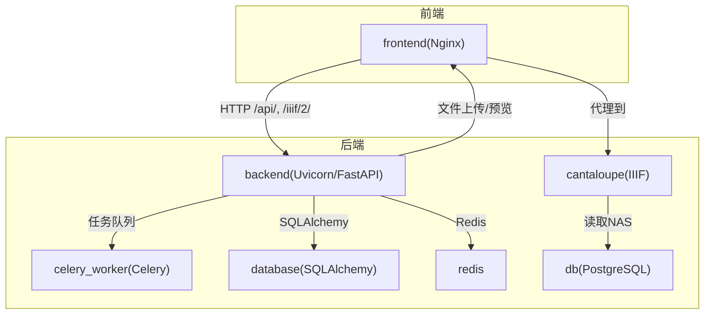
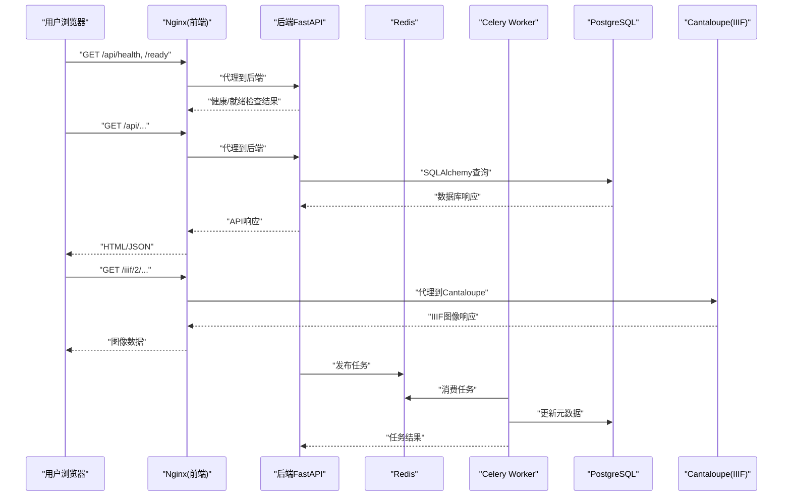
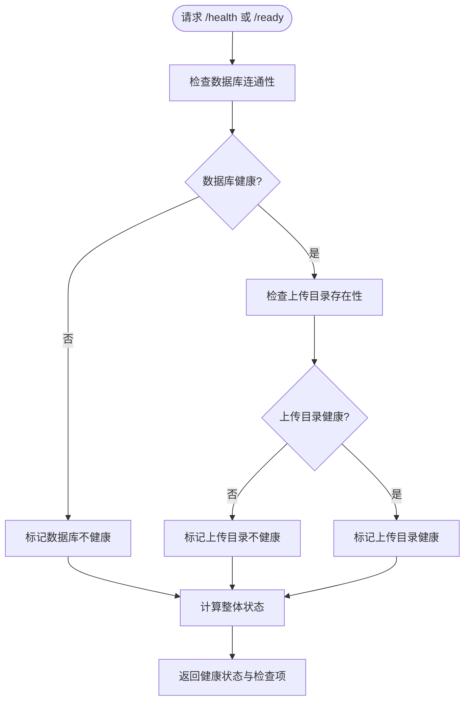
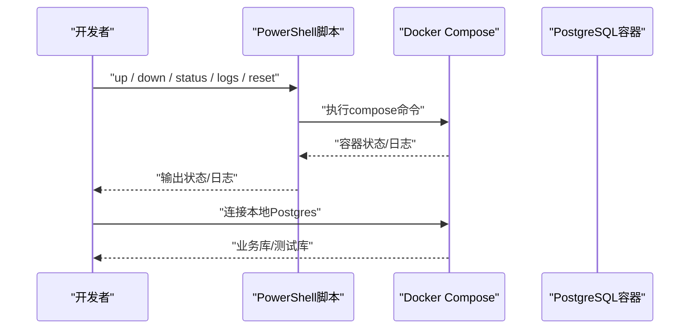
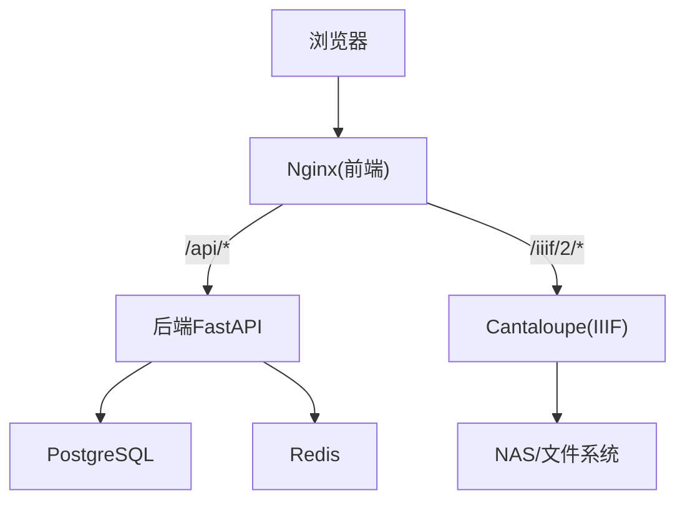
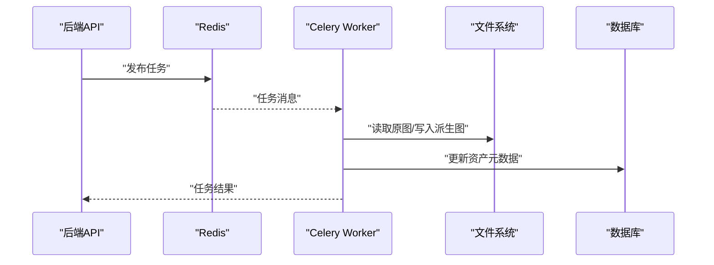
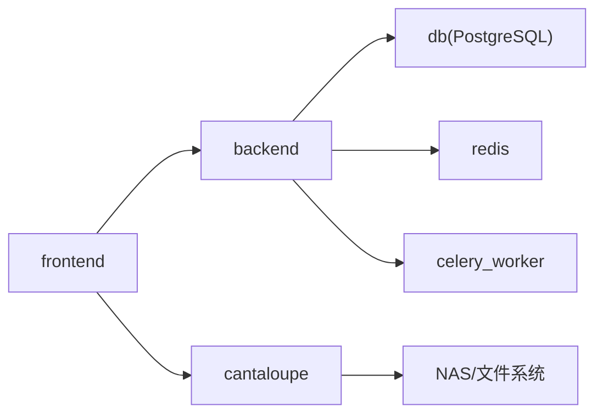

# 故障排除

<cite>
**本文引用的文件**
- [TROUBLESHOOTING.md](file://docs/05-部署与运维/TROUBLESHOOTING.md)
- [DEPLOYMENT.md](file://docs/05-部署与运维/DEPLOYMENT.md)
- [docker-compose.yml](file://docker-compose.yml)
- [backend/Dockerfile](file://backend/Dockerfile)
- [frontend/Dockerfile](file://frontend/Dockerfile)
- [backend/app/config.py](file://backend/app/config.py)
- [backend/app/main.py](file://backend/app/main.py)
- [frontend/nginx.conf](file://frontend/nginx.conf)
- [backend/app/routers/health.py](file://backend/app/routers/health.py)
- [backend/app/database.py](file://backend/app/database.py)
- [backend/app/tasks.py](file://backend/app/tasks.py)
- [cantaloupe.properties](file://cantaloupe.properties)
- [manage_local_postgres.ps1](file://manage_local_postgres.ps1)
- [deploy.sh](file://deploy.sh)
- [publish.sh](file://publish.sh)
- [backend/app/celery_app.py](file://backend/app/celery_app.py)
</cite>

## 目录
1. [简介](#简介)
2. [项目结构](#项目结构)
3. [核心组件](#核心组件)
4. [架构总览](#架构总览)
5. [详细组件分析](#详细组件分析)
6. [依赖关系分析](#依赖关系分析)
7. [性能考虑](#性能考虑)
8. [故障排除指南](#故障排除指南)
9. [结论](#结论)
10. [附录](#附录)

## 简介
本文件面向MDAMS原型项目的运维与开发团队，提供系统化的故障排除指南。内容覆盖权限与配置错误、服务启动失败、网络连接问题、存储挂载异常、健康检查与日志分析、性能瓶颈定位、恢复与应急处理、常用工具与命令，以及预防性措施与最佳实践。所有建议均基于仓库中的实际配置与脚本，确保可操作与可验证。

## 项目结构
MDAMS采用多容器编排，包含后端API、前端、数据库、Redis、Cantaloupe IIIF服务及Celery任务队列。关键配置集中在compose文件、Nginx代理、后端配置与Cantaloupe属性文件中；健康检查与数据库连接由后端路由与数据库模块负责；本地Postgres可通过PowerShell脚本管理。

图表来源
- [docker-compose.yml:1-131](file://docker-compose.yml#L1-L131)
- [frontend/nginx.conf:1-33](file://frontend/nginx.conf#L1-L33)
- [backend/app/main.py:1-86](file://backend/app/main.py#L1-L86)
- [backend/app/database.py:1-17](file://backend/app/database.py#L1-L17)
- [backend/app/celery_app.py:1-19](file://backend/app/celery_app.py#L1-L19)
- [cantaloupe.properties:1-162](file://cantaloupe.properties#L1-L162)

章节来源
- [docker-compose.yml:1-131](file://docker-compose.yml#L1-L131)
- [frontend/nginx.conf:1-33](file://frontend/nginx.conf#L1-L33)
- [backend/app/main.py:1-86](file://backend/app/main.py#L1-L86)
- [backend/app/database.py:1-17](file://backend/app/database.py#L1-L17)
- [backend/app/celery_app.py:1-19](file://backend/app/celery_app.py#L1-L19)
- [cantaloupe.properties:1-162](file://cantaloupe.properties#L1-L162)

## 核心组件
- 后端API与健康检查：提供统一的健康与就绪检查端点，校验数据库连通性与上传目录可用性。
- 健康检查路由：后端健康检查路由返回整体状态与各子系统检查项，便于快速定位问题。
- 数据库连接：通过SQLAlchemy引擎与会话工厂建立连接，支持本地与compose内服务两种场景。
- 前端Nginx代理：统一转发/api/与/iiif/2/请求，避免直接暴露后端与Cantaloupe端口。
- Celery任务队列：异步处理图像派生与人脸识别等重任务，依赖Redis作为Broker与Backend。
- Cantaloupe IIIF：提供高分辨率图像服务，配置文件控制缓存、处理器与CORS。
- 本地Postgres管理：PowerShell脚本封装本地Postgres容器的启停、状态查询、日志查看与重置。

章节来源
- [backend/app/routers/health.py:1-60](file://backend/app/routers/health.py#L1-L60)
- [backend/app/database.py:1-17](file://backend/app/database.py#L1-L17)
- [frontend/nginx.conf:1-33](file://frontend/nginx.conf#L1-L33)
- [backend/app/celery_app.py:1-19](file://backend/app/celery_app.py#L1-L19)
- [cantaloupe.properties:1-162](file://cantaloupe.properties#L1-L162)
- [manage_local_postgres.ps1:1-98](file://manage_local_postgres.ps1#L1-L98)

## 架构总览
下图展示从浏览器到后端、数据库、Redis、Cantaloupe与NAS的典型调用链路，以及健康检查与日志采集的关键节点。

图表来源
- [frontend/nginx.conf:1-33](file://frontend/nginx.conf#L1-L33)
- [backend/app/main.py:1-86](file://backend/app/main.py#L1-L86)
- [backend/app/routers/health.py:1-60](file://backend/app/routers/health.py#L1-L60)
- [backend/app/database.py:1-17](file://backend/app/database.py#L1-L17)
- [backend/app/celery_app.py:1-19](file://backend/app/celery_app.py#L1-L19)
- [cantaloupe.properties:1-162](file://cantaloupe.properties#L1-L162)

## 详细组件分析

### 健康检查与就绪检查
- 后端提供/health与/ready两个端点，内部校验数据库连通性与上传目录存在性，返回整体健康状态与各子系统检查项。
- 健康检查失败时，HTTP状态码非200，便于反向代理与监控系统识别。

图表来源
- [backend/app/routers/health.py:14-41](file://backend/app/routers/health.py#L14-L41)

章节来源
- [backend/app/routers/health.py:1-60](file://backend/app/routers/health.py#L1-L60)

### 数据库连接与本地Postgres
- 后端通过SQLAlchemy引擎连接数据库，支持本地与compose内服务两种场景。
- 本地Postgres容器可通过PowerShell脚本进行启停、状态查询、日志查看与重置，便于开发与测试。

图表来源
- [manage_local_postgres.ps1:57-97](file://manage_local_postgres.ps1#L57-L97)
- [backend/app/database.py:1-17](file://backend/app/database.py#L1-L17)

章节来源
- [backend/app/database.py:1-17](file://backend/app/database.py#L1-L17)
- [manage_local_postgres.ps1:1-98](file://manage_local_postgres.ps1#L1-L98)

### 前端Nginx代理与CORS
- 前端Nginx将/api/代理到后端，将/iiif/2/代理到Cantaloupe，避免直接暴露端口与CORS问题。
- 配置中设置代理头与路径前缀，确保后端与Cantaloupe正确识别来源与上下文。

图表来源
- [frontend/nginx.conf:10-31](file://frontend/nginx.conf#L10-L31)

章节来源
- [frontend/nginx.conf:1-33](file://frontend/nginx.conf#L1-L33)

### Celery任务与图像派生
- Celery Worker从Redis消费任务，执行图像派生与人脸识别等耗时操作。
- 任务执行过程中捕获异常并记录错误，便于后续排查。

图表来源
- [backend/app/celery_app.py:1-19](file://backend/app/celery_app.py#L1-L19)
- [backend/app/tasks.py:151-182](file://backend/app/tasks.py#L151-L182)

章节来源
- [backend/app/celery_app.py:1-19](file://backend/app/celery_app.py#L1-L19)
- [backend/app/tasks.py:1-262](file://backend/app/tasks.py#L1-L262)

### Cantaloupe IIIF配置
- 配置文件启用自动处理器选择、流式检索与文件系统缓存，适配低内存环境。
- CORS已启用，允许跨域访问，便于前端Mirador等查看器加载图像。

章节来源
- [cantaloupe.properties:1-162](file://cantaloupe.properties#L1-L162)

## 依赖关系分析
- 后端依赖数据库与Redis；前端依赖后端与Cantaloupe；Cantaloupe依赖NAS挂载路径与CORS配置。
- compose文件定义了服务间依赖与端口映射，确保容器按序启动与外部可达。

图表来源
- [docker-compose.yml:1-131](file://docker-compose.yml#L1-L131)

章节来源
- [docker-compose.yml:1-131](file://docker-compose.yml#L1-L131)

## 性能考虑
- 内存与并发：后端与Cantaloupe均针对低内存环境做了参数优化（如pyvips与Java堆），建议结合系统监控观察内存峰值与GC行为。
- 磁盘I/O：数据库数据卷映射到本地SSD，建议定期清理无用日志与缓存，避免I/O压力。
- 网络延迟：Nginx代理减少跨域与直接端口暴露，建议在生产环境使用反向代理与CDN以降低延迟。
- 任务队列：Celery并发与Redis内存需与CPU/内存资源匹配，避免任务积压导致延迟。

## 故障排除指南

### 通用排查顺序
- 阅读部署与运维文档，确认环境变量与配置一致性。
- 使用容器状态命令检查各服务运行情况。
- 访问健康与就绪端点，判断整体健康状况。
- 查看具体模块日志，定位异常来源。

章节来源
- [TROUBLESHOOTING.md:6-14](file://docs/05-部署与运维/TROUBLESHOOTING.md#L6-L14)

### 启动类问题
- 前端打不开：检查前端容器状态与宿主端口占用，查看前端容器日志。
- 后端健康检查不通过：检查后端容器状态、数据库与Redis连接字符串，查看后端日志。
- 数据库连不上：检查数据库容器状态、认证凭据与连接串主机名，必要时使用本地Postgres脚本查看状态与日志。
- Redis或Worker异常：检查Redis容器状态与连接串，查看Worker日志。

章节来源
- [TROUBLESHOOTING.md:16-84](file://docs/05-部署与运维/TROUBLESHOOTING.md#L16-L84)
- [docker-compose.yml:84-102](file://docker-compose.yml#L84-L102)
- [manage_local_postgres.ps1:78-86](file://manage_local_postgres.ps1#L78-L86)

### 资源与挂载问题
- 上传后文件找不到：检查宿主机路径映射、目标目录存在性与写权限，确认上传目录位于仓库根目录下的相对路径时的绝对位置。
- 预览图不显示：检查资产是否生成预览图、后端能否读取原始文件。
- 参考资源导入异常：检查参考目录完整性、脚本执行位置与路径可访问性。

章节来源
- [TROUBLESHOOTING.md:86-113](file://docs/05-部署与运维/TROUBLESHOOTING.md#L86-L113)
- [docker-compose.yml:30-32](file://docker-compose.yml#L30-L32)

### IIIF与Mirador问题
- Manifest可打开但图像加载失败：检查Cantaloupe公共URL、Nginx代理配置与Cantaloupe容器状态。
- Mirador完全打不开：检查Manifest地址、用户权限与资源可见性。
- owner_only资源不可见：检查用户角色与集合作用域是否匹配资源可见性。

章节来源
- [TROUBLESHOOTING.md:114-147](file://docs/05-部署与运维/TROUBLESHOOTING.md#L114-L147)
- [frontend/nginx.conf:21-31](file://frontend/nginx.conf#L21-L31)
- [backend/app/config.py:45-46](file://backend/app/config.py#L45-L46)

### 登录与权限问题
- 登录失败：检查用户是否存在、默认密码是否变更、浏览器旧令牌是否失效。
- 菜单与按钮不一致：检查当前角色权限、后端上下文是否刷新、令牌是否过期。
- 能看到菜单但按钮不可用：菜单仅表示页面可进入，页面内部与后端接口还会再次校验权限。

章节来源
- [TROUBLESHOOTING.md:148-179](file://docs/05-部署与运维/TROUBLESHOOTING.md#L148-L179)

### 图像记录工作流问题
- 工作台无内容：检查当前登录角色与所需权限，确认列表/可见性权限。
- 摄影上传人员看不到待上传池：检查记录分配、状态与登录用户身份。

章节来源
- [TROUBLESHOOTING.md:180-202](file://docs/05-部署与运维/TROUBLESHOOTING.md#L180-L202)

### 三维问题
- 三维页面进不去：检查用户权限与菜单显示。
- 三维资源上传后无法查看：检查上传完整性、文件角色识别与详情接口返回。

章节来源
- [TROUBLESHOOTING.md:203-219](file://docs/05-部署与运维/TROUBLESHOOTING.md#L203-L219)

### 申请与导出问题
- 无法提交申请：检查用户是否具备创建权限且申请车中有条目。
- 无法审批或导出：检查用户角色与权限是否生效。

章节来源
- [TROUBLESHOOTING.md:220-235](file://docs/05-部署与运维/TROUBLESHOOTING.md#L220-L235)

### 错误日志分析方法
- Docker日志：使用容器状态命令查看服务状态，再使用容器日志命令查看最近日志。
- 应用日志：后端健康检查路由返回检查项与错误信息；Nginx代理日志可辅助定位API与IIIF请求问题。
- 系统日志：结合操作系统层面的资源监控与容器平台日志，定位内存、磁盘与网络瓶颈。

章节来源
- [TROUBLESHOOTING.md:16-84](file://docs/05-部署与运维/TROUBLESHOOTING.md#L16-L84)
- [frontend/nginx.conf:1-33](file://frontend/nginx.conf#L1-L33)
- [backend/app/routers/health.py:14-41](file://backend/app/routers/health.py#L14-L41)

### 性能瓶颈排查流程
- 内存不足：检查后端与Cantaloupe的内存参数与容器限制，观察GC与OOM事件。
- 磁盘I/O问题：检查数据库数据卷与Cantaloupe缓存目录所在磁盘，清理无用文件。
- 网络延迟：检查Nginx代理链路与CORS配置，必要时引入CDN与缓存策略。

章节来源
- [backend/Dockerfile:1-52](file://backend/Dockerfile#L1-L52)
- [frontend/Dockerfile:1-28](file://frontend/Dockerfile#L1-L28)
- [cantaloupe.properties:103-127](file://cantaloupe.properties#L103-L127)

### 恢复策略与应急处理
- 数据恢复：使用数据库备份与还原流程，确保在维护窗口内执行；本地Postgres脚本支持重置卷与容器。
- 服务重启：优先重启异常服务容器，观察健康检查端点恢复情况。
- 配置回滚：对比最近一次成功的compose与配置文件版本，回滚到上一个稳定版本。

章节来源
- [manage_local_postgres.ps1:87-97](file://manage_local_postgres.ps1#L87-L97)
- [docker-compose.yml:1-131](file://docker-compose.yml#L1-L131)

### 故障排除工具与命令
- 系统诊断：检查Docker守护进程、容器状态与资源使用。
- 网络测试：curl或浏览器访问健康/就绪端点与API/IIIF路径，验证代理链路。
- 数据库检查：使用本地Postgres脚本查看状态与日志，必要时重建测试库。
- 部署与发布：使用部署脚本一键构建与启动，使用发布脚本推送分支到远端与本地裸仓库。

章节来源
- [deploy.sh:1-38](file://deploy.sh#L1-L38)
- [publish.sh:1-19](file://publish.sh#L1-L19)
- [manage_local_postgres.ps1:78-86](file://manage_local_postgres.ps1#L78-L86)

### 故障预防措施与最佳实践
- 环境变量一致性：确保.env与compose环境变量一致，避免主机名与端口冲突。
- 存储挂载验证：在启动前验证宿主机路径存在、可写且映射正确。
- 健康检查集成：在CI/CD中加入健康/就绪检查，确保上线前服务可用。
- 日志轮转与保留：配置应用与容器日志轮转，避免磁盘占满。
- 任务队列监控：监控Redis队列长度与Worker处理耗时，及时扩容或优化任务。

## 结论
通过遵循本文提供的排查顺序与工具命令，结合健康检查与日志分析，可高效定位并解决MDAMS原型项目中的常见问题。建议在日常运维中持续关注环境变量一致性、存储挂载与网络代理配置，并将健康检查纳入自动化流程，以提升系统的稳定性与可维护性。

## 附录
- 推荐继续查看的文档：部署与运维文档、架构设计与集成计划、验收清单与项目状态。

章节来源
- [TROUBLESHOOTING.md:236-242](file://docs/05-部署与运维/TROUBLESHOOTING.md#L236-L242)
- [DEPLOYMENT.md:1-8](file://docs/05-部署与运维/DEPLOYMENT.md#L1-L8)