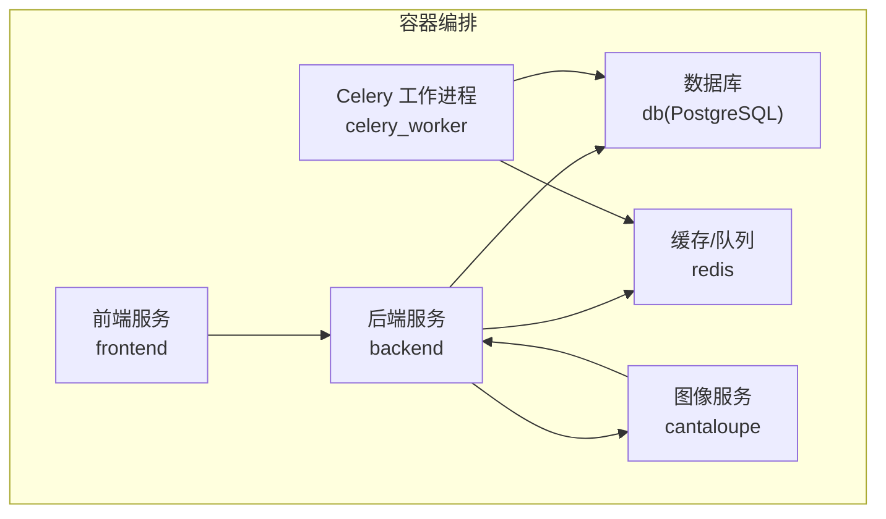
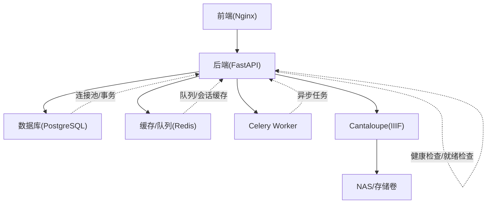
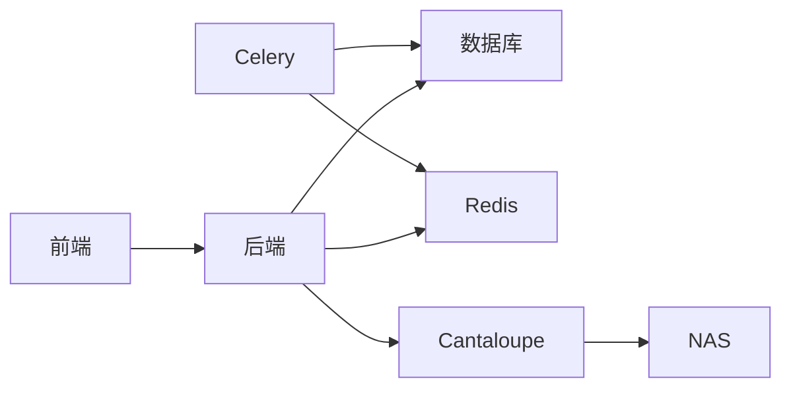

# 运维监控

<cite>
**本文引用的文件**
- [docker-compose.yml](file://docker-compose.yml)
- [docker-compose.local-postgres.yml](file://docker-compose.local-postgres.yml)
- [backend/Dockerfile](file://backend/Dockerfile)
- [frontend/Dockerfile](file://frontend/Dockerfile)
- [cantaloupe/Dockerfile](file://cantaloupe/Dockerfile)
- [cantaloupe.properties](file://cantaloupe.properties)
- [backend/app/config.py](file://backend/app/config.py)
- [backend/app/main.py](file://backend/app/main.py)
- [backend/app/routers/health.py](file://backend/app/routers/health.py)
- [backend/app/database.py](file://backend/app/database.py)
- [backend/app/tasks.py](file://backend/app/tasks.py)
- [backend/app/celery_app.py](file://backend/app/celery_app.py)
- [DEPLOYMENT.md](file://docs/05-部署与运维/DEPLOYMENT.md)
- [TROUBLESHOOTING.md](file://docs/05-部署与运维/TROUBLESHOOTING.md)
- [INSTALL_DOCKER_WINDOWS.md](file://INSTALL_DOCKER_WINDOWS.md)
- [SYSTEM_ARCHITECTURE.md](file://SYSTEM_ARCHITECTURE.md)
- [ARCHITECTURE.md](file://ARCHITECTURE.md)
</cite>

## 目录
1. [简介](#简介)
2. [项目结构](#项目结构)
3. [核心组件](#核心组件)
4. [架构总览](#架构总览)
5. [详细组件分析](#详细组件分析)
6. [依赖关系分析](#依赖关系分析)
7. [性能考量](#性能考量)
8. [故障排查指南](#故障排查指南)
9. [结论](#结论)
10. [附录](#附录)

## 简介
本文件面向MDAMS原型项目的运维监控，围绕容器监控、服务状态监控、性能指标监控、日志与错误追踪、性能分析、工具使用（Docker、PostgreSQL、Cantaloupe）、监控指标与阈值、告警机制、日志管理策略以及监控仪表板搭建与维护进行系统化说明。文档基于仓库现有配置与脚本，结合实际运行参数与容器编排，给出可操作的监控方案与最佳实践。

## 项目结构
项目采用多容器编排，包含后端API、前端、数据库、Redis、任务队列（Celery）与Cantaloupe图像服务。容器间通过Docker Compose进行编排与依赖管理，服务端口、环境变量、卷挂载均在compose文件中集中定义。

图表来源
- [docker-compose.yml:1-131](file://docker-compose.yml#L1-L131)

章节来源
- [docker-compose.yml:1-131](file://docker-compose.yml#L1-L131)

## 核心组件
- 后端服务：基于FastAPI，提供健康检查、认证、资源管理、IIIF接口等；容器内监听8000端口，通过环境变量控制数据库、Redis、上传目录、Cantaloupe公共URL等。
- Celery工作进程：负责异步任务执行，使用独立容器，共享后端环境变量。
- 前端服务：基于Nginx，静态资源托管，监听80端口，依赖后端与Cantaloupe。
- 数据库：PostgreSQL，限制内存上限，持久化数据卷。
- 缓存/队列：Redis，提供任务队列与缓存。
- 图像服务：Cantaloupe，提供IIIF图像服务，监听8182端口，挂载NAS路径与配置文件。

章节来源
- [docker-compose.yml:1-131](file://docker-compose.yml#L1-L131)
- [backend/app/main.py:64-86](file://backend/app/main.py#L64-L86)
- [backend/app/config.py:42-46](file://backend/app/config.py#L42-L46)
- [backend/Dockerfile:51-52](file://backend/Dockerfile#L51-L52)
- [frontend/Dockerfile:20-28](file://frontend/Dockerfile#L20-L28)
- [cantaloupe/Dockerfile:39-43](file://cantaloupe/Dockerfile#L39-L43)

## 架构总览
下图展示容器间的交互关系与数据流向，强调健康检查、数据库连接、任务队列、图像服务与前端访问链路。

图表来源
- [docker-compose.yml:1-131](file://docker-compose.yml#L1-L131)
- [backend/app/main.py:64-86](file://backend/app/main.py#L64-L86)
- [backend/app/database.py](file://backend/app/database.py)
- [backend/app/celery_app.py](file://backend/app/celery_app.py)

## 详细组件分析

### 容器与服务编排
- 后端与Celery工作进程共享环境变量，包括数据库URL、Redis URL、上传目录、Cantaloupe公共URL、人脸识别相关参数等，确保服务一致性。
- 前端通过Nginx反向代理后端与Cantaloupe，减少直接暴露端口带来的风险。
- 数据库与Cantaloupe分别挂载本地SSD与NAS路径，提升I/O性能与数据持久性。
- Redis与数据库设置重启策略，保证服务可用性。

章节来源
- [docker-compose.yml:2-30](file://docker-compose.yml#L2-L30)
- [docker-compose.yml:37-64](file://docker-compose.yml#L37-L64)
- [docker-compose.yml:72-83](file://docker-compose.yml#L72-L83)
- [docker-compose.yml:84-102](file://docker-compose.yml#L84-L102)
- [docker-compose.yml:105-128](file://docker-compose.yml#L105-L128)

### 应用监控配置（日志、错误追踪、性能分析）
- 后端日志：通过环境变量控制日志级别与输出方式，建议在生产环境开启文件日志与滚动策略，便于审计与回溯。
- 错误追踪：建议集成结构化日志（如JSON），统一采集到集中式日志系统（如ELK/Fluentd/Loki+Promtail），并为关键异常打标签。
- 性能分析：对慢查询、长耗时任务、图像处理瓶颈进行采样与指标采集，结合APM工具定位热点。

章节来源
- [backend/app/config.py:42-46](file://backend/app/config.py#L42-L46)
- [backend/app/main.py:64-86](file://backend/app/main.py#L64-L86)

### Docker监控
- 容器资源限制：数据库设置内存上限，避免资源争抢影响整体稳定性。
- 端口映射与暴露：后端、Cantaloupe、Redis、数据库均有明确端口映射，便于外部监控与运维。
- 卷挂载：NAS直挂载到后端与Cantaloupe，需关注存储空间与IO性能。

章节来源
- [docker-compose.yml:98-102](file://docker-compose.yml#L98-L102)
- [docker-compose.yml:6-29](file://docker-compose.yml#L6-L29)
- [docker-compose.yml:114-117](file://docker-compose.yml#L114-L117)

### PostgreSQL监控
- 连接数与锁等待：监控活跃连接、锁等待与慢查询，防止并发写入导致阻塞。
- 表膨胀与索引使用：定期检查表大小、索引选择性与统计信息更新。
- 备份与恢复：结合本地SSD数据卷，制定备份策略与演练计划。

章节来源
- [docker-compose.yml:84-102](file://docker-compose.yml#L84-L102)
- [docker-compose.local-postgres.yml:1-19](file://docker-compose.local-postgres.yml#L1-L19)

### Cantaloupe监控
- 端口与配置：监听8182，启用IIIF v2与CORS，日志级别DEBUG，建议生产关闭或降级。
- 缓存策略：启用文件系统缓存，注意缓存目录权限与磁盘空间。
- 处理器选择：根据图像格式选择合适处理器，避免内存峰值过高。

章节来源
- [docker-compose.yml:105-128](file://docker-compose.yml#L105-L128)
- [cantaloupe.properties:103-127](file://cantaloupe.properties#L103-L127)
- [cantaloupe.properties:133-147](file://cantaloupe.properties#L133-L147)
- [cantaloupe.properties:149-162](file://cantaloupe.properties#L149-L162)

### 健康检查与就绪检查
- 健康检查：后端提供健康检查路由，可用于容器编排的存活探针与就绪探针。
- 就绪检查：建议在后端启动完成后，先完成数据库初始化与种子数据注入，再标记就绪。

章节来源
- [backend/app/main.py:12-12](file://backend/app/main.py#L12-L12)
- [backend/app/routers/health.py](file://backend/app/routers/health.py)

### 任务队列与性能
- Celery并发与日志：工作进程使用固定并发与日志级别，建议按CPU核数与内存容量调整并发度。
- 任务重试与死信：为关键任务配置重试与死信队列，避免单点失败影响整体吞吐。

章节来源
- [docker-compose.yml:37-64](file://docker-compose.yml#L37-L64)
- [backend/app/celery_app.py](file://backend/app/celery_app.py)
- [backend/app/tasks.py](file://backend/app/tasks.py)

## 依赖关系分析
- 后端依赖数据库与Redis，同时作为CORS代理调用Cantaloupe。
- Celery依赖Redis作为消息中间件，依赖数据库进行任务状态持久化。
- 前端依赖后端API与Cantaloupe提供的IIIF资源。
- Cantaloupe依赖NAS存储与配置文件。

图表来源
- [docker-compose.yml:1-131](file://docker-compose.yml#L1-L131)

章节来源
- [docker-compose.yml:1-131](file://docker-compose.yml#L1-L131)

## 性能考量
- 内存与CPU
  - 数据库容器设置内存上限，避免资源抢占。
  - 后端与Cantaloupe通过环境变量控制并发与线程，建议结合负载测试逐步调优。
- 存储
  - 数据库与Cantaloupe分别挂载高性能存储，注意磁盘空间与IO配额。
- 网络
  - 通过Nginx统一入口，减少跨域问题与直接端口暴露风险。
- 图像处理
  - ImageMagick与CImg策略放宽，需关注内存与磁盘占用，必要时启用流式处理。

章节来源
- [docker-compose.yml:98-102](file://docker-compose.yml#L98-L102)
- [backend/Dockerfile:18-41](file://backend/Dockerfile#L18-L41)
- [cantaloupe.properties:122-127](file://cantaloupe.properties#L122-L127)

## 故障排查指南
- 健康检查失败
  - 检查后端健康路由是否可达，确认数据库与Redis连通性。
- 数据库连接异常
  - 核对DATABASE_URL与网络连通性，检查容器日志与端口映射。
- Cantaloupe无法访问
  - 检查端口映射、配置文件挂载、NAS路径权限与磁盘空间。
- 前端静态资源加载失败
  - 检查Nginx配置与后端代理规则，确认CORS设置。
- 任务堆积
  - 检查Redis连通性、并发配置与任务耗时，必要时扩容工作进程。

章节来源
- [backend/app/routers/health.py](file://backend/app/routers/health.py)
- [backend/app/database.py](file://backend/app/database.py)
- [TROUBLESHOOTING.md](file://docs/05-部署与运维/TROUBLESHOOTING.md)

## 结论
本方案以Docker Compose为核心，结合后端健康检查、数据库与缓存配置、Cantaloupe图像服务与前端反向代理，形成完整的容器化监控基础。建议在此基础上引入集中式日志、指标采集与告警平台，完善监控仪表板与自动化运维流程，持续优化性能与可用性。

## 附录

### 监控指标定义与阈值建议
- CPU使用率
  - 后端：建议阈值80%，超过则扩容或优化任务。
  - 数据库：建议阈值75%，避免写入高峰导致延迟。
  - Celery：建议阈值70%，结合任务积压与队列长度综合判断。
- 内存占用
  - 后端：建议阈值85%，超过触发GC与告警。
  - 数据库：已设置内存上限，建议监控峰值与swap使用。
  - Cantaloupe：建议阈值80%，关注图像处理峰值。
- 磁盘空间
  - 数据库卷：建议阈值80%，留出备份与日志空间。
  - NAS挂载：建议阈值85%，定期清理临时文件。
- 网络流量
  - 前端到后端：关注请求量与响应时间。
  - 后端到Cantaloupe：关注图像下载带宽与并发连接数。

### 告警机制配置与管理
- 告警通道：邮件、IM或运维平台通知。
- 告警规则：基于阈值与趋势分析，区分严重、警告与一般级别。
- 自愈策略：自动重启、扩缩容或切换备用实例（需配合编排平台）。

### 日志管理策略
- 日志级别
  - 开发：DEBUG，便于问题定位。
  - 测试/预生产：INFO，保留关键事件。
  - 生产：WARN/WARN+，聚焦异常与错误。
- 日志轮转
  - 文件大小与保留天数策略，避免磁盘占满。
- 日志分析
  - 关键字段提取（请求ID、用户ID、响应码、耗时、错误栈）。
  - 异常聚合与趋势分析，建立根因分析流程。

### 监控仪表板搭建与维护
- 指标采集：Prometheus/Grafana或云监控平台。
- 仪表板维度：容器资源、应用指标（QPS、P95/P99、错误率）、数据库指标（连接数、锁等待、慢查询）、任务队列长度与延迟。
- 维护要点：定期校准阈值、清理过期数据、更新告警规则与责任人。

章节来源
- [backend/app/config.py:42-46](file://backend/app/config.py#L42-L46)
- [cantaloupe.properties:149-162](file://cantaloupe.properties#L149-L162)
- [DEPLOYMENT.md](file://docs/05-部署与运维/DEPLOYMENT.md)
- [INSTALL_DOCKER_WINDOWS.md](file://INSTALL_DOCKER_WINDOWS.md)
- [SYSTEM_ARCHITECTURE.md](file://SYSTEM_ARCHITECTURE.md)
- [ARCHITECTURE.md](file://ARCHITECTURE.md)