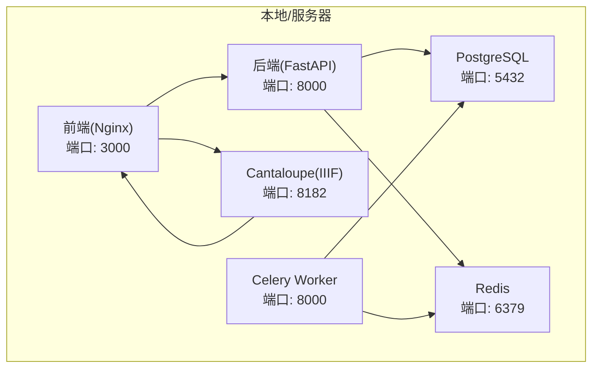
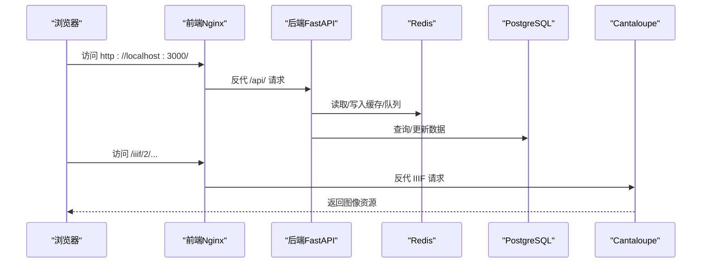
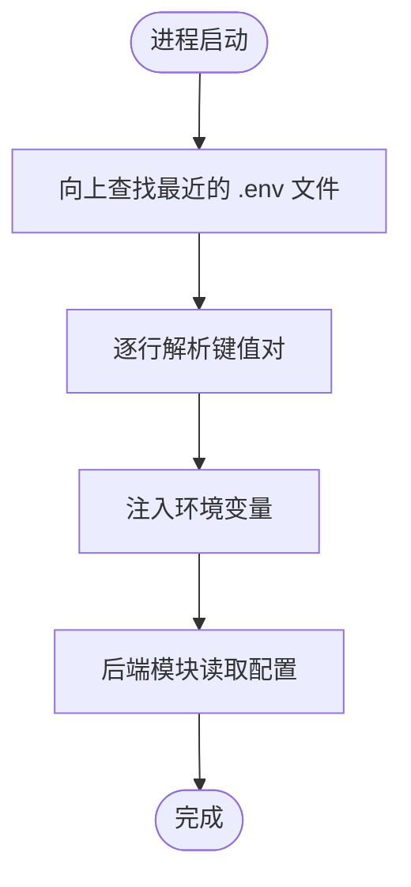
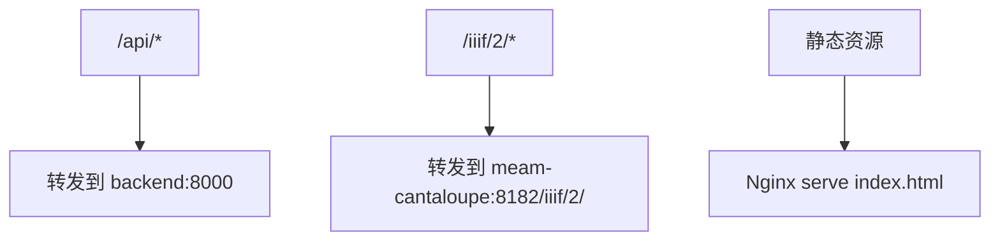
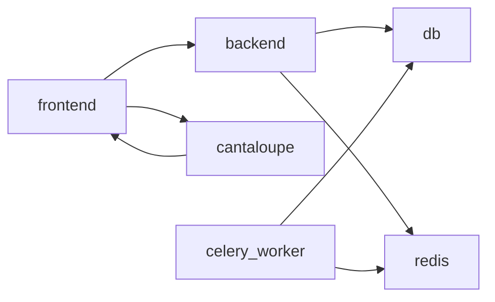
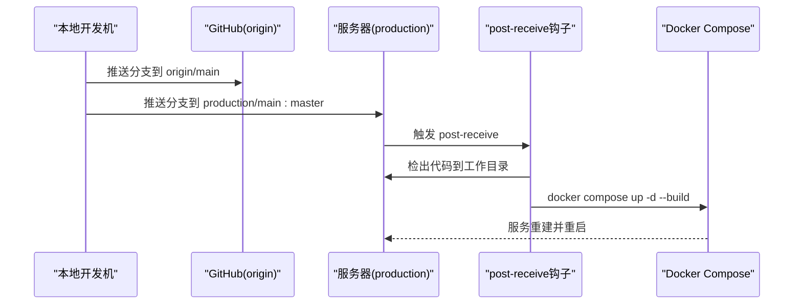
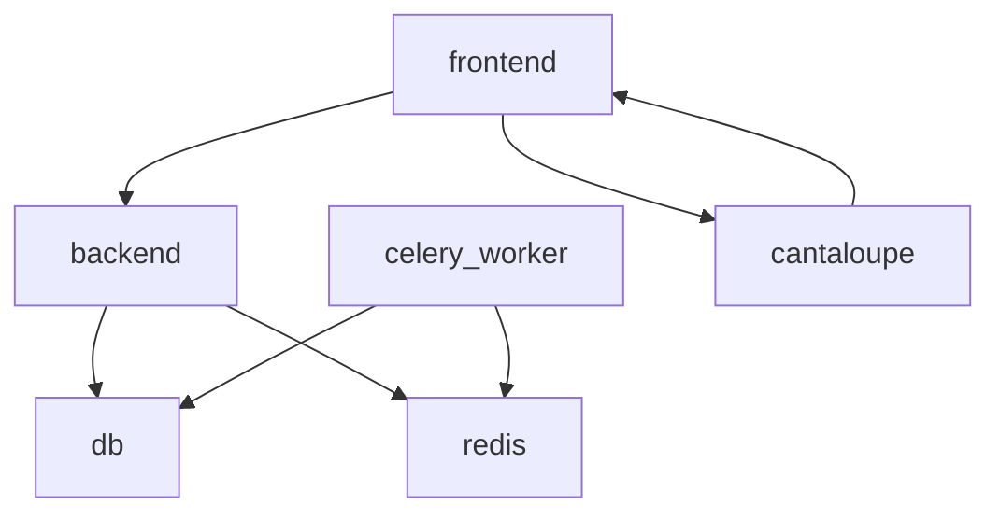
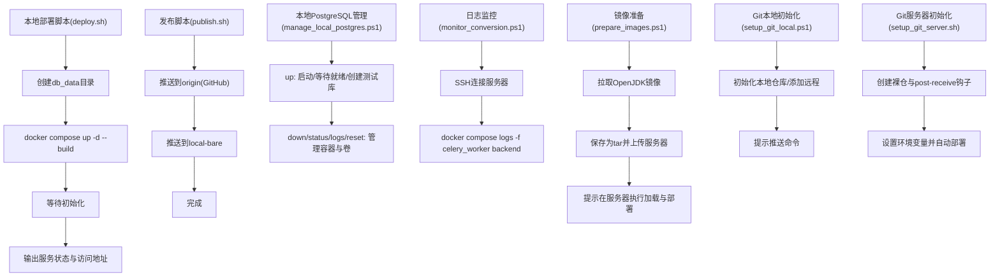

# 部署与运维

<cite>
**本文引用的文件**
- [DEPLOYMENT.md](file://docs/05-部署与运维/DEPLOYMENT.md)
- [SETUP_AND_DEPLOYMENT.md](file://docs/05-部署与运维/SETUP_AND_DEPLOYMENT.md)
- [TROUBLESHOOTING.md](file://docs/05-部署与运维/TROUBLESHOOTING.md)
- [ENVIRONMENT_VARIABLES.md](file://docs/05-部署与运维/ENVIRONMENT_VARIABLES.md)
- [GIT_DEPLOY_GUIDE.md](file://docs/05-部署与运维/GIT_DEPLOY_GUIDE.md)
- [docker-compose.yml](file://docker-compose.yml)
- [backend/app/config.py](file://backend/app/config.py)
- [frontend/nginx.conf](file://frontend/nginx.conf)
- [deploy.sh](file://deploy.sh)
- [publish.sh](file://publish.sh)
- [manage_local_postgres.ps1](file://manage_local_postgres.ps1)
- [monitor_conversion.ps1](file://monitor_conversion.ps1)
- [prepare_images.ps1](file://prepare_images.ps1)
- [setup_git_local.ps1](file://setup_git_local.ps1)
- [setup_git_server.sh](file://setup_git_server.sh)
</cite>

## 目录
1. [简介](#简介)
2. [项目结构](#项目结构)
3. [核心组件](#核心组件)
4. [架构总览](#架构总览)
5. [详细组件分析](#详细组件分析)
6. [依赖分析](#依赖分析)
7. [性能考虑](#性能考虑)
8. [故障排除指南](#故障排除指南)
9. [备份与恢复](#备份与恢复)
10. [扩展与升级策略](#扩展与升级策略)
11. [安全运维实践](#安全运维实践)
12. [运维自动化工具与脚本](#运维自动化工具与脚本)
13. [结论](#结论)
14. [附录](#附录)

## 简介
本文件面向MDAMS原型项目的部署与运维，覆盖从环境准备、依赖安装、数据库初始化、服务启动、健康检查到日常运维监控、故障排除、备份恢复、扩展升级与安全实践的全流程。文档以仓库内的部署与运维文档、Compose编排、Nginx代理配置、后端配置加载逻辑以及各类PowerShell/Shell脚本为基础，结合实际代码结构，形成可操作、可追溯的运维手册。

## 项目结构
- 后端服务采用FastAPI，容器内监听8000端口；Celery Worker负责异步任务；Redis提供队列与缓存；前端通过Nginx反向代理统一暴露API与IIIF服务；PostgreSQL提供数据持久化；Cantaloupe提供IIIF图像服务。
- 本地开发通过docker-compose一键启动；服务器部署支持Git Push-to-Deploy触发自动重建与重启。
- 环境变量集中于.env文件，后端通过自定义dotenv加载逻辑在运行时注入。

图表来源
- [docker-compose.yml:1-131](file://docker-compose.yml#L1-L131)
- [frontend/nginx.conf:1-33](file://frontend/nginx.conf#L1-L33)

章节来源
- [docker-compose.yml:1-131](file://docker-compose.yml#L1-L131)
- [frontend/nginx.conf:1-33](file://frontend/nginx.conf#L1-L33)

## 核心组件
- 后端配置加载：后端通过自定义dotenv加载逻辑，优先从项目根向外查找最近的.env文件，并将键值注入环境变量，供后续模块使用。
- 环境变量：数据库连接串、Redis连接串、API与IIIF公共URL、上传目录、图像处理参数、AI推理相关参数等均通过环境变量控制。
- 前端Nginx代理：统一将/api/与/iiif/2/代理至后端与Cantaloupe，便于浏览器统一访问与跨域控制。
- 服务编排：Compose定义了backend、celery_worker、redis、frontend、db、cantaloupe六个服务及其依赖、端口映射、卷挂载与环境变量。

章节来源
- [backend/app/config.py:1-72](file://backend/app/config.py#L1-L72)
- [ENVIRONMENT_VARIABLES.md:1-86](file://docs/05-部署与运维/ENVIRONMENT_VARIABLES.md#L1-L86)
- [frontend/nginx.conf:1-33](file://frontend/nginx.conf#L1-L33)
- [docker-compose.yml:1-131](file://docker-compose.yml#L1-L131)

## 架构总览
- 访问路径：浏览器统一通过前端Nginx访问，API基址与IIIF基址由环境变量决定；后端根据API_PUBLIC_URL与CANTALOUPE_PUBLIC_URL生成公开链接。
- 数据与文件：上传目录通过卷挂载映射到宿主机，既保证Cantaloupe可直接读取，也便于备份与管理。
- 任务与缓存：Redis作为Celery队列与应用缓存，Celery Worker并发度可在命令行中调整。

图表来源
- [frontend/nginx.conf:10-31](file://frontend/nginx.conf#L10-L31)
- [docker-compose.yml:65-127](file://docker-compose.yml#L65-L127)
- [backend/app/config.py:42-46](file://backend/app/config.py#L42-L46)

章节来源
- [SETUP_AND_DEPLOYMENT.md:32-51](file://docs/05-部署与运维/SETUP_AND_DEPLOYMENT.md#L32-L51)
- [frontend/nginx.conf:10-31](file://frontend/nginx.conf#L10-L31)
- [docker-compose.yml:65-127](file://docker-compose.yml#L65-L127)

## 详细组件分析

### 后端配置加载与环境变量
- dotenv加载：后端在启动时自动向上查找最近的.env文件，逐行解析键值并注入环境变量，确保在不同层级的部署场景中均可生效。
- 关键变量：DATABASE_URL、REDIS_URL、API_PUBLIC_URL、CANTALOUPE_PUBLIC_URL、UPLOAD_DIR、图像处理与AI推理相关参数等。
- 默认值：若未设置，则采用Compose中的默认值或后端内置默认值，保证最小可用配置。

图表来源
- [backend/app/config.py:5-37](file://backend/app/config.py#L5-L37)

章节来源
- [backend/app/config.py:1-72](file://backend/app/config.py#L1-L72)
- [ENVIRONMENT_VARIABLES.md:10-86](file://docs/05-部署与运维/ENVIRONMENT_VARIABLES.md#L10-L86)

### 前端Nginx代理
- /api/代理：将前端请求转发至后端容器的8000端口，设置必要的X-Forwarded-*头，确保后端可感知真实客户端与协议。
- /iiif/2/代理：将IIIF请求转发至Cantaloupe容器的8182端口，避免直接暴露端口与跨域问题。
- 静态资源：前端静态页由Nginx提供，支持SPA路由回退至index.html。

图表来源
- [frontend/nginx.conf:10-31](file://frontend/nginx.conf#L10-L31)

章节来源
- [frontend/nginx.conf:1-33](file://frontend/nginx.conf#L1-L33)

### 服务编排与依赖
- 服务与端口：backend、celery_worker、redis、frontend、db、cantaloupe分别暴露不同端口；前端Nginx将80映射至3000，便于浏览器访问。
- 依赖关系：backend与celery_worker依赖db与redis；frontend依赖backend与cantaloupe；db使用本地卷存储数据；cantaloupe挂载上传目录并读取配置文件。
- 环境变量：所有服务均通过环境变量接收配置，避免硬编码。

图表来源
- [docker-compose.yml:1-131](file://docker-compose.yml#L1-L131)

章节来源
- [docker-compose.yml:1-131](file://docker-compose.yml#L1-L131)

### Git Push-to-Deploy 工作流
- 本地开发机Windows，远程仓库GitHub，实验室服务器Ubuntu，通过SSH推送至服务器裸仓，触发post-receive钩子自动检出、构建与重启服务。
- 服务器端hook会设置API_PUBLIC_URL与CANTALOUPE_PUBLIC_URL，确保容器内生成的公开链接正确。
- 支持重新初始化本地与服务器端的Git远程与钩子。

图表来源
- [GIT_DEPLOY_GUIDE.md:19-49](file://docs/05-部署与运维/GIT_DEPLOY_GUIDE.md#L19-L49)
- [setup_git_server.sh:23-63](file://setup_git_server.sh#L23-L63)

章节来源
- [GIT_DEPLOY_GUIDE.md:1-78](file://docs/05-部署与运维/GIT_DEPLOY_GUIDE.md#L1-L78)
- [setup_git_server.sh:1-70](file://setup_git_server.sh#L1-L70)

## 依赖分析
- 组件耦合：后端与db、redis强耦合；前端与后端、Cantaloupe弱耦合（通过代理）；Celery Worker与db、redis强耦合。
- 外部依赖：Docker、Docker Compose、Git、SSH、PostgreSQL、Redis、Nginx、Cantaloupe。
- 环境变量契约：API_PUBLIC_URL与CANTALOUPE_PUBLIC_URL必须与前端Nginx代理路径一致，否则会导致API与IIIF链接不可用。

图表来源
- [docker-compose.yml:33-82](file://docker-compose.yml#L33-L82)

章节来源
- [docker-compose.yml:1-131](file://docker-compose.yml#L1-L131)

## 性能考虑
- 图像处理：通过VIPS_DISC_THRESHOLD与VIPS_CONCURRENCY优化libvips在低内存环境下的表现；Cantaloupe使用JAVA_OPTS限制堆大小并提供熵源映射以加速启动。
- 数据库：db容器限制内存上限，建议在生产环境为PostgreSQL预留足够资源并使用SSD存储。
- 并发：Celery Worker可通过命令行参数调整并发度，按CPU与内存情况平衡吞吐与稳定性。

章节来源
- [docker-compose.yml:11-13](file://docker-compose.yml#L11-L13)
- [docker-compose.yml:98-102](file://docker-compose.yml#L98-L102)
- [docker-compose.yml:41](file://docker-compose.yml#L41)
- [ENVIRONMENT_VARIABLES.md:57-64](file://docs/05-部署与运维/ENVIRONMENT_VARIABLES.md#L57-L64)

## 故障排除指南
- 建议排查顺序：先阅读部署与配置文档，核对.env与容器状态，再检查健康与就绪接口，最后查看具体模块日志。
- 前端打不开：检查frontend容器状态与FRONTEND_PORT占用；查看前端日志。
- 后端健康检查失败：访问/health与/ready，检查backend容器、DATABASE_URL与REDIS_URL。
- 数据库连不上：检查db容器状态、POSTGRES_USER/PASSWORD/DB与DATABASE_URL主机名。
- Redis或worker异常：检查redis与celery_worker日志。
- 上传文件找不到：确认HOST_MUSEUM_PATH存在且映射到/app/uploads，检查写权限。
- 预览图不显示：确认资产已生成预览图，后端可读取原始文件。
- IIIF/Mirador问题：检查CANTALOUPE_PUBLIC_URL与前端nginx.conf中/iiif/2/代理；确认cantaloupe容器状态。
- 登录与权限：检查用户是否存在、默认密码是否仍为mdams123、token是否过期；确认前端上下文与权限判定。
- 三维与申请导出：检查用户角色与权限位，确认资源可见性与状态。

章节来源
- [TROUBLESHOOTING.md:6-242](file://docs/05-部署与运维/TROUBLESHOOTING.md#L6-L242)
- [SETUP_AND_DEPLOYMENT.md:111-165](file://docs/05-部署与运维/SETUP_AND_DEPLOYMENT.md#L111-L165)

## 备份与恢复
- 数据备份：db容器使用本地卷存储数据，建议定期对db_data目录进行快照或归档备份；可使用pg_dump/pg_restore进行逻辑备份。
- 配置备份：.env与cantaloupe.properties等关键配置文件需纳入版本控制或独立备份。
- 服务器恢复：通过Git Push-to-Deploy快速恢复；如需手动恢复，先恢复db_data与配置，再执行docker compose up -d。
- 业务连续性：建议在服务器端保留两套环境（开发/预发布），通过Git分支与远程仓库隔离变更；必要时回滚到上一个稳定版本。

章节来源
- [docker-compose.yml:94-97](file://docker-compose.yml#L94-L97)
- [SETUP_AND_DEPLOYMENT.md:183-196](file://docs/05-部署与运维/SETUP_AND_DEPLOYMENT.md#L183-L196)
- [GIT_DEPLOY_GUIDE.md:36-49](file://docs/05-部署与运维/GIT_DEPLOY_GUIDE.md#L36-L49)

## 扩展与升级策略
- 水平扩展：增加后端副本数与Celery Worker副本数，提升并发处理能力；Redis可横向扩展为集群（需调整后端配置）。
- 垂直扩展：提升db与Cantaloupe所在宿主机资源；为db容器设置更高内存上限；为Cantaloupe增大JAVA_OPTS。
- 版本升级：通过Git分支管理版本；使用Git Push-to-Deploy一键升级；升级前先备份数据库与配置。
- 兼容性处理：关注后端与Cantaloupe的依赖版本；升级前在预发布环境验证API与IIIF兼容性。

章节来源
- [docker-compose.yml:37-63](file://docker-compose.yml#L37-L63)
- [docker-compose.yml:105-127](file://docker-compose.yml#L105-L127)
- [GIT_DEPLOY_GUIDE.md:36-49](file://docs/05-部署与运维/GIT_DEPLOY_GUIDE.md#L36-L49)

## 安全运维实践
- 访问控制：统一通过前端Nginx暴露服务，避免直接暴露后端与Cantaloupe端口；严格管理API_PUBLIC_URL与CANTALOUPE_PUBLIC_URL。
- 网络安全：在服务器防火墙开放必要端口；使用SSH密钥认证；限制Git推送权限。
- 数据加密：生产环境建议启用数据库与传输加密；敏感配置（如API密钥）放入受控的环境变量或密钥管理服务。
- 合规要求：遵循组织的DevSecOps流程，定期扫描镜像与依赖漏洞；审计日志与变更记录。

章节来源
- [frontend/nginx.conf:10-31](file://frontend/nginx.conf#L10-L31)
- [SETUP_AND_DEPLOYMENT.md:183-196](file://docs/05-部署与运维/SETUP_AND_DEPLOYMENT.md#L183-L196)
- [GIT_DEPLOY_GUIDE.md:71-78](file://docs/05-部署与运维/GIT_DEPLOY_GUIDE.md#L71-L78)

## 运维自动化工具与脚本
- 本地部署脚本：一键创建数据目录、构建并启动服务，等待初始化后输出服务状态与访问地址。
- 发布脚本：同时推送到GitHub与本地裸仓，便于Git Push-to-Deploy。
- 本地PostgreSQL管理：PowerShell脚本封装up/down/status/logs/reset，便于本地测试数据库管理。
- 日志监控：PowerShell脚本通过SSH连接服务器，实时查看Celery与后端日志，便于观察转码进度。
- 服务器镜像准备：PowerShell脚本自动拉取、保存并上传OpenJDK镜像，解决网络受限问题。
- Git本地/服务器端初始化：PowerShell与Shell脚本分别用于本地添加远程与服务器创建裸仓与钩子。

图表来源
- [deploy.sh:1-38](file://deploy.sh#L1-L38)
- [publish.sh:1-19](file://publish.sh#L1-L19)
- [manage_local_postgres.ps1:57-97](file://manage_local_postgres.ps1#L57-L97)
- [monitor_conversion.ps1:1-11](file://monitor_conversion.ps1#L1-L11)
- [prepare_images.ps1:1-56](file://prepare_images.ps1#L1-L56)
- [setup_git_local.ps1:1-29](file://setup_git_local.ps1#L1-L29)
- [setup_git_server.sh:1-70](file://setup_git_server.sh#L1-L70)

章节来源
- [deploy.sh:1-38](file://deploy.sh#L1-L38)
- [publish.sh:1-19](file://publish.sh#L1-L19)
- [manage_local_postgres.ps1:1-98](file://manage_local_postgres.ps1#L1-L98)
- [monitor_conversion.ps1:1-11](file://monitor_conversion.ps1#L1-L11)
- [prepare_images.ps1:1-56](file://prepare_images.ps1#L1-L56)
- [setup_git_local.ps1:1-29](file://setup_git_local.ps1#L1-L29)
- [setup_git_server.sh:1-70](file://setup_git_server.sh#L1-L70)

## 结论
本运维文档基于仓库现有部署与运维文档、Compose编排、Nginx代理配置及脚本，提供了从环境准备、服务启动、健康检查到故障排除、备份恢复、扩展升级与安全实践的完整指南。建议在生产环境中结合Git Push-to-Deploy与自动化脚本，配合严格的环境变量管理与日志监控，确保系统的稳定性与可维护性。

## 附录
- 快速验证清单
  - 检查.env关键变量：DATABASE_URL、REDIS_URL、API_PUBLIC_URL、CANTALOUPE_PUBLIC_URL、HOST_MUSEUM_PATH。
  - 启动服务：docker compose up -d --build。
  - 健康检查：访问/health与/ready。
  - 前端首页与登录测试账号。
  - IIIF与Mirador预览验证。
- 常用命令
  - 查看容器状态：docker compose ps
  - 查看日志：docker compose logs backend/redis/db/cantaloupe/celery_worker
  - 服务器部署：git push production main:master
  - 本地PostgreSQL管理：.\manage_local_postgres.ps1 up/status/logs/reset

章节来源
- [SETUP_AND_DEPLOYMENT.md:153-165](file://docs/05-部署与运维/SETUP_AND_DEPLOYMENT.md#L153-L165)
- [TROUBLESHOOTING.md:10-15](file://docs/05-部署与运维/TROUBLESHOOTING.md#L10-L15)
- [GIT_DEPLOY_GUIDE.md:36-49](file://docs/05-部署与运维/GIT_DEPLOY_GUIDE.md#L36-L49)