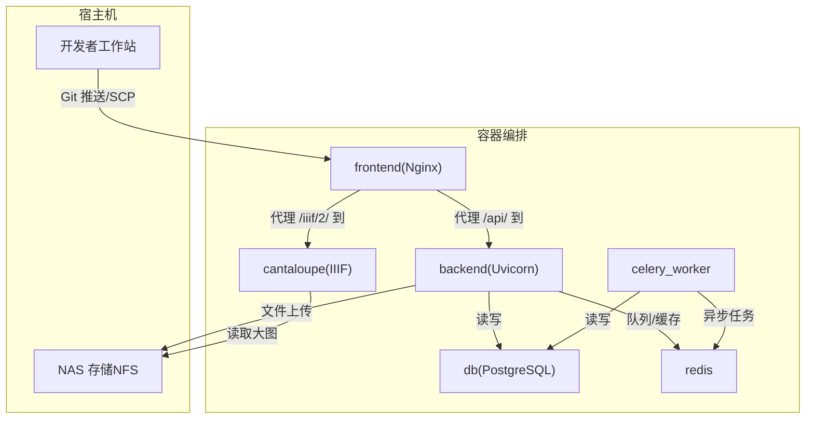
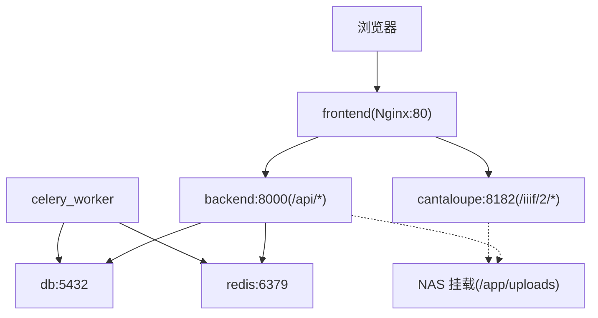
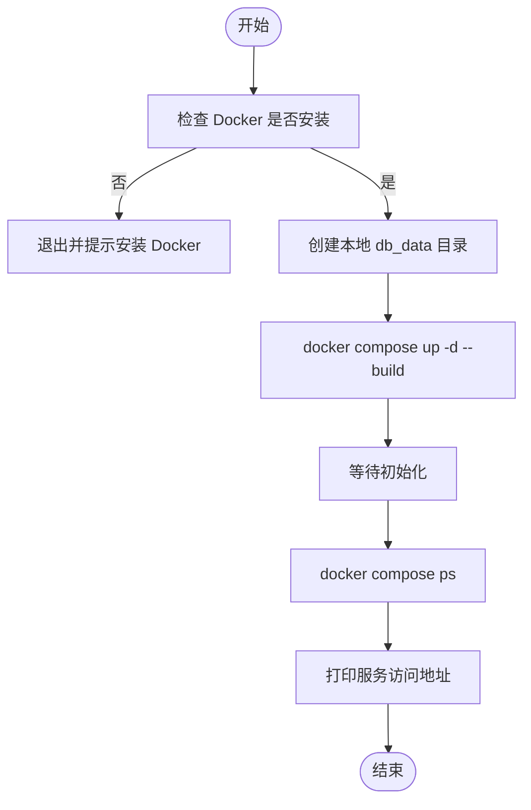
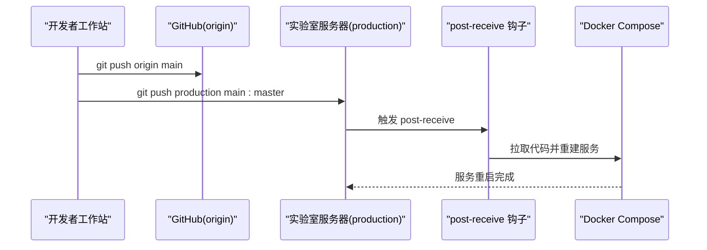
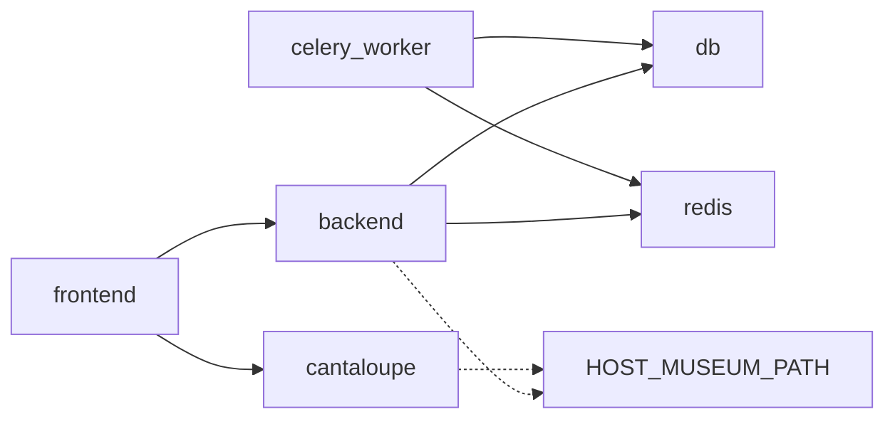

# 部署流程

<cite>
**本文引用的文件**
- [DEPLOYMENT.md](file://DEPLOYMENT.md)
- [deploy.sh](file://deploy.sh)
- [docker-compose.yml](file://docker-compose.yml)
- [docker-compose.local-postgres.yml](file://docker-compose.local-postgres.yml)
- [backend/Dockerfile](file://backend/Dockerfile)
- [frontend/Dockerfile](file://frontend/Dockerfile)
- [cantaloupe/Dockerfile](file://cantaloupe/Dockerfile)
- [backend/requirements.txt](file://backend/requirements.txt)
- [frontend/package.json](file://frontend/package.json)
- [frontend/nginx.conf](file://frontend/nginx.conf)
- [backend/app/config.py](file://backend/app/config.py)
- [docs/05-部署与运维/SETUP_AND_DEPLOYMENT.md](file://docs/05-部署与运维/SETUP_AND_DEPLOYMENT.md)
- [docs/05-部署与运维/ENVIRONMENT_VARIABLES.md](file://docs/05-部署与运维/ENVIRONMENT_VARIABLES.md)
- [docs/05-部署与运维/GIT_DEPLOY_GUIDE.md](file://docs/05-部署与运维/GIT_DEPLOY_GUIDE.md)
- [docs/05-部署与运维/TROUBLESHOOTING.md](file://docs/05-部署与运维/TROUBLESHOOTING.md)
- [cantaloupe.properties](file://cantaloupe.properties)
</cite>

## 目录
1. [简介](#简介)
2. [项目结构](#项目结构)
3. [核心组件](#核心组件)
4. [架构总览](#架构总览)
5. [详细组件分析](#详细组件分析)
6. [依赖分析](#依赖分析)
7. [性能考虑](#性能考虑)
8. [故障排查指南](#故障排查指南)
9. [结论](#结论)
10. [附录](#附录)

## 简介
本文件面向MDAMS原型项目的部署与运维，覆盖从基础设施准备、环境变量配置、依赖安装、代码传输、容器编排到服务启动的全流程。文档同时给出开发、测试、生产三类环境的差异化配置要点，详解deploy.sh脚本的功能、执行流程与错误处理，并提供服务访问配置、端口映射、URL访问与默认账号说明。最后提供部署示例、命令行操作指南与注意事项及最佳实践。

## 项目结构
本项目采用多容器编排，核心服务包括：
- 后端API（FastAPI + Uvicorn）
- 前端（React/Vite + Nginx）
- 数据库（PostgreSQL）
- 缓存与任务（Redis + Celery Worker）
- IIIF图像服务（Cantaloupe）

图表来源
- [docker-compose.yml:1-131](file://docker-compose.yml#L1-L131)
- [frontend/nginx.conf:1-33](file://frontend/nginx.conf#L1-L33)
- [backend/app/config.py:1-72](file://backend/app/config.py#L1-L72)

章节来源
- [docker-compose.yml:1-131](file://docker-compose.yml#L1-L131)
- [frontend/nginx.conf:1-33](file://frontend/nginx.conf#L1-L33)
- [backend/app/config.py:1-72](file://backend/app/config.py#L1-L72)

## 核心组件
- 后端服务（backend）
  - 基于Python 3.12，使用FastAPI/Uvicorn，依赖PostgreSQL、Redis。
  - 通过环境变量控制数据库连接、Redis连接、上传目录、IIIF公共URL、人脸特征开关与模型路径等。
- 前端服务（frontend）
  - 基于Node 18，使用Vite + React，构建产物由Nginx提供静态服务。
  - 通过Nginx代理将/api/转发至后端，/iiif/2/转发至Cantaloupe。
- 数据库（db）
  - PostgreSQL 16，使用本地NVMe SSD提升性能，容器内数据持久化至db_data卷。
- 缓存与任务（redis + celery_worker）
  - Redis提供Celery队列与应用缓存；worker并发为1。
- IIIF服务（cantaloupe）
  - 本地构建，使用GraphicsMagick/FFmpeg增强格式支持，挂载NAS路径作为图像源与缓存目录。

章节来源
- [backend/Dockerfile:1-52](file://backend/Dockerfile#L1-L52)
- [frontend/Dockerfile:1-28](file://frontend/Dockerfile#L1-L28)
- [cantaloupe/Dockerfile:1-43](file://cantaloupe/Dockerfile#L1-L43)
- [docker-compose.yml:1-131](file://docker-compose.yml#L1-L131)
- [backend/requirements.txt:1-18](file://backend/requirements.txt#L1-L18)
- [frontend/package.json:1-42](file://frontend/package.json#L1-L42)

## 架构总览
下图展示容器间依赖与网络拓扑，以及浏览器访问路径与代理策略：

图表来源
- [docker-compose.yml:1-131](file://docker-compose.yml#L1-L131)
- [frontend/nginx.conf:10-31](file://frontend/nginx.conf#L10-L31)

章节来源
- [docker-compose.yml:1-131](file://docker-compose.yml#L1-L131)
- [frontend/nginx.conf:1-33](file://frontend/nginx.conf#L1-L33)

## 详细组件分析

### 部署脚本 deploy.sh
- 功能概述
  - 检查Docker可用性；创建本地db_data目录；执行docker compose构建与启动；等待初始化；输出服务状态与访问地址。
- 执行流程
  - 步骤1：校验Docker安装。
  - 步骤2：创建db_data目录（本地SSD）。
  - 步骤3：执行docker compose up -d --build。
  - 步骤4：短暂等待后查询容器状态。
  - 步骤5：输出前端、后端、FileBrowser、Cantaloupe的访问地址。
- 错误处理
  - Docker未安装时直接退出并提示。
  - 容器启动后通过docker compose ps进行人工核验。
- 适用场景
  - 本地开发与快速验证；服务器端一键启动（结合NFS挂载）。

图表来源
- [deploy.sh:1-38](file://deploy.sh#L1-L38)

章节来源
- [deploy.sh:1-38](file://deploy.sh#L1-L38)

### 环境变量与配置
- 数据库
  - POSTGRES_USER、POSTGRES_PASSWORD、POSTGRES_DB、DATABASE_URL
- 缓存与任务
  - REDIS_URL
- 浏览器可访问地址
  - API_PUBLIC_URL、CANTALOUPE_PUBLIC_URL（浏览器视角，非容器内）
- 文件路径
  - HOST_MUSEUM_PATH（宿主机）、UPLOAD_DIR（容器内）
- 图像处理
  - VIPS_DISC_THRESHOLD、VIPS_CONCURRENCY（libvips）、JAVA_OPTS（Cantaloupe JVM）
- 端口
  - FRONTEND_PORT、BACKEND_PORT、DB_PORT、REDIS_PORT、CANTALOUPE_PORT

章节来源
- [docs/05-部署与运维/ENVIRONMENT_VARIABLES.md:1-86](file://docs/05-部署与运维/ENVIRONMENT_VARIABLES.md#L1-L86)
- [docs/05-部署与运维/SETUP_AND_DEPLOYMENT.md:52-110](file://docs/05-部署与运维/SETUP_AND_DEPLOYMENT.md#L52-L110)
- [backend/app/config.py:42-72](file://backend/app/config.py#L42-L72)

### 服务器部署差异（开发/测试/生产）
- 开发环境
  - 本地Docker Compose，前端端口默认3000，后端8000，数据库5432，Redis 6379，Cantaloupe 8182。
  - HOST_MUSEUM_PATH可为相对路径（如./uploads），便于本地测试。
- 测试环境
  - 可使用本地独立PostgreSQL（仓库提供脚本与compose），便于隔离测试数据库。
- 生产环境
  - 使用NFS挂载NAS路径到HOST_MUSEUM_PATH，确保后端与Cantaloupe均能读写。
  - 严格校验API_PUBLIC_URL与CANTALOUPE_PUBLIC_URL，使其从浏览器可达。
  - 服务器端可通过Git Push-to-Deploy触发自动重建与重启。

章节来源
- [docs/05-部署与运维/SETUP_AND_DEPLOYMENT.md:111-152](file://docs/05-部署与运维/SETUP_AND_DEPLOYMENT.md#L111-L152)
- [docker-compose.local-postgres.yml:1-19](file://docker-compose.local-postgres.yml#L1-L19)
- [docs/05-部署与运维/GIT_DEPLOY_GUIDE.md:1-78](file://docs/05-部署与运维/GIT_DEPLOY_GUIDE.md#L1-L78)

### 服务访问配置
- 本地默认访问
  - 前端：http://localhost:3000
  - 后端文档：http://localhost:8000/docs
  - 健康检查：http://localhost:8000/health
  - 就绪检查：http://localhost:8000/ready
  - Cantaloupe直连：http://localhost:8182
- 统一代理访问（推荐）
  - API基址：http://localhost:3000/api
  - IIIF基址：http://localhost:3000/iiif/2
- 服务器访问
  - 前端：http://<服务器IP>:3000
  - 后端：http://<服务器IP>:8000/docs
  - FileBrowser：http://<服务器IP>:8081
  - Cantaloupe：http://<服务器IP>:8182

章节来源
- [docs/05-部署与运维/SETUP_AND_DEPLOYMENT.md:32-51](file://docs/05-部署与运维/SETUP_AND_DEPLOYMENT.md#L32-L51)
- [DEPLOYMENT.md:46-54](file://DEPLOYMENT.md#L46-L54)

### 默认账号与权限
- 默认测试密码：mdams123
- 常用账号角色：system_admin、resource_user、collection_owner、image_metadata_entry、image_photographer、three_d_operator
- 登录后建议按以下顺序验证功能：健康检查、就绪检查、前端首页、二维列表、统一平台目录、Mirador预览

章节来源
- [docs/05-部署与运维/SETUP_AND_DEPLOYMENT.md:166-182](file://docs/05-部署与运维/SETUP_AND_DEPLOYMENT.md#L166-L182)

### Git Push-to-Deploy 工作流
- 环境概览
  - 开发机（Windows）→ GitHub（备份）→ 实验室服务器（Ubuntu）
- 仓库与远程
  - origin：GitHub
  - production：服务器裸仓库（用于触发部署）
- 工作流
  - 开发机提交 → 推送origin → 推送production触发post-receive钩子 → 服务器检出代码并自动重建容器
- 设置脚本
  - 本地：setup_git_local.ps1
  - 服务器：setup_git_server.sh

图表来源
- [docs/05-部署与运维/GIT_DEPLOY_GUIDE.md:19-49](file://docs/05-部署与运维/GIT_DEPLOY_GUIDE.md#L19-L49)

章节来源
- [docs/05-部署与运维/GIT_DEPLOY_GUIDE.md:1-78](file://docs/05-部署与运维/GIT_DEPLOY_GUIDE.md#L1-L78)

## 依赖分析
- 容器耦合关系
  - backend/worker依赖db与redis；frontend依赖backend与cantaloupe；cantaloupe依赖NAS挂载。
- 端口映射
  - 前端：3000:80；后端：8000:8000；数据库：5432:5432；Redis：6379:6379；Cantaloupe：8182:8182
- 环境变量契约
  - API_PUBLIC_URL与CANTALOUPE_PUBLIC_URL必须与浏览器访问一致，否则IIIF/Mirador加载失败。

图表来源
- [docker-compose.yml:1-131](file://docker-compose.yml#L1-L131)

章节来源
- [docker-compose.yml:1-131](file://docker-compose.yml#L1-L131)

## 性能考虑
- 内存控制
  - 后端libvips：VIPS_DISC_THRESHOLD、VIPS_CONCURRENCY降低内存峰值。
  - Cantaloupe：JAVA_OPTS限制堆大小，禁用内存缓存，依赖SSD文件缓存。
  - PostgreSQL：容器内存上限2G。
- 存储I/O
  - 热数据（数据库、缩略图缓存）走本地NVMe SSD；冷数据（PSB/TIFF大图）走NAS（NFS）。
- 前端构建
  - Node最大堆内存调整，避免N100内存不足导致构建失败。

章节来源
- [DEPLOYMENT.md:55-72](file://DEPLOYMENT.md#L55-L72)
- [backend/Dockerfile:1-52](file://backend/Dockerfile#L1-L52)
- [frontend/Dockerfile:1-28](file://frontend/Dockerfile#L1-L28)
- [docker-compose.yml:98-102](file://docker-compose.yml#L98-L102)

## 故障排查指南
- 启动类问题
  - 前端打不开：检查frontend容器状态、端口占用、compose日志。
  - 后端健康检查失败：检查backend容器、DATABASE_URL、REDIS_URL。
  - 数据库连不上：检查db容器、认证信息、主机名与端口。
  - Redis或worker异常：检查redis状态、CELERY_URL、worker日志。
- 资源与挂载问题
  - 上传后文件找不到：确认HOST_MUSEUM_PATH存在、映射到/app/uploads、可写。
  - 预览图不显示：确认资产已有预览图、后端可读取原始文件。
- IIIF与Mirador问题
  - Manifest能打开但Mirador图像加载失败：优先检查CANTALOUPE_PUBLIC_URL、frontend/nginx.conf的/iiif/2/代理、cantaloupe容器状态。
  - Mirador完全打不开：检查Manifest地址、用户权限、资源可见性。
- 登录与权限问题
  - 登录失败：确认用户存在、默认密码mdams123、token未过期。
  - 菜单与按钮不一致：检查当前角色权限、前端上下文刷新、token状态。

章节来源
- [docs/05-部署与运维/TROUBLESHOOTING.md:1-242](file://docs/05-部署与运维/TROUBLESHOOTING.md#L1-L242)

## 结论
本部署文档提供了从环境准备到服务上线的完整路径，明确了开发、测试、生产三类环境的差异与配置要点，详述了deploy.sh脚本与Git Push-to-Deploy的工作流，并给出了服务访问、默认账号、故障排查与性能优化建议。遵循本文档可高效、稳定地完成MDAMS原型项目的部署与运维。

## 附录

### 部署示例与命令行操作
- 本地开发
  - 复制并编辑.env，确保HOST_MUSEUM_PATH、API_PUBLIC_URL、CANTALOUPE_PUBLIC_URL、DATABASE_URL、REDIS_URL正确。
  - 启动：docker compose up -d --build
  - 验证：docker compose ps、后端健康/就绪接口、前端首页、Mirador预览
- 服务器部署（N100+QNAP NAS）
  - 代码传输：使用SCP将代码传至服务器目标目录
  - 执行部署：chmod +x deploy.sh && ./deploy.sh
  - 访问：http://<服务器IP>:3000、http://<服务器IP>:8000/docs、http://<服务器IP>:8182
- Git Push-to-Deploy
  - 本地推送：git push origin main
  - 服务器触发：git push production main:master
  - 如需重置环境：在本地运行setup_git_local.ps1，在服务器运行setup_git_server.sh

章节来源
- [docs/05-部署与运维/SETUP_AND_DEPLOYMENT.md:111-152](file://docs/05-部署与运维/SETUP_AND_DEPLOYMENT.md#L111-L152)
- [docs/05-部署与运维/GIT_DEPLOY_GUIDE.md:51-78](file://docs/05-部署与运维/GIT_DEPLOY_GUIDE.md#L51-L78)
- [DEPLOYMENT.md:17-45](file://DEPLOYMENT.md#L17-L45)

### 环境变量与默认值速查
- 数据库：POSTGRES_USER、POSTGRES_PASSWORD、POSTGRES_DB、DATABASE_URL
- 缓存与任务：REDIS_URL
- 浏览器可访问地址：API_PUBLIC_URL、CANTALOUPE_PUBLIC_URL
- 文件路径：HOST_MUSEUM_PATH、UPLOAD_DIR
- 图像处理：VIPS_DISC_THRESHOLD、VIPS_CONCURRENCY、JAVA_OPTS
- 端口：FRONTEND_PORT、BACKEND_PORT、DB_PORT、REDIS_PORT、CANTALOUPE_PORT

章节来源
- [docs/05-部署与运维/ENVIRONMENT_VARIABLES.md:10-86](file://docs/05-部署与运维/ENVIRONMENT_VARIABLES.md#L10-L86)

### 服务访问与端口映射
- 本地
  - 前端：3000 → 80
  - 后端：8000 → 8000
  - 数据库：5432 → 5432
  - Redis：6379 → 6379
  - Cantaloupe：8182 → 8182
- 服务器
  - 前端：3000 → 80
  - 后端：8000 → 8000
  - FileBrowser：8081 → 8081
  - Cantaloupe：8182 → 8182

章节来源
- [docs/05-部署与运维/SETUP_AND_DEPLOYMENT.md:101-110](file://docs/05-部署与运维/SETUP_AND_DEPLOYMENT.md#L101-L110)
- [DEPLOYMENT.md:46-54](file://DEPLOYMENT.md#L46-L54)