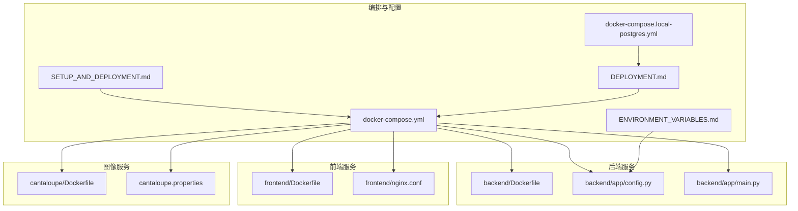
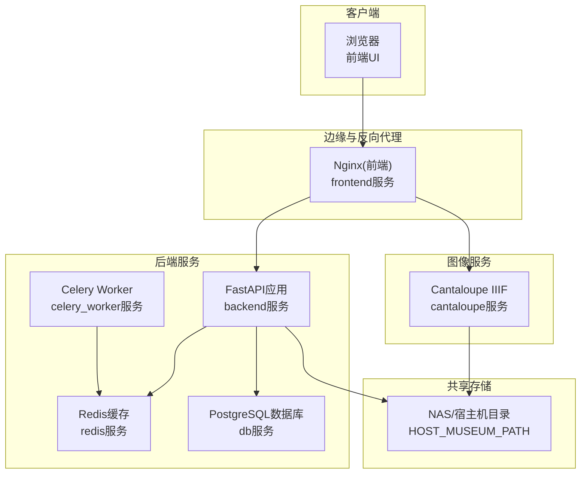
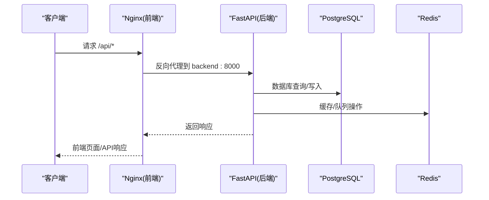
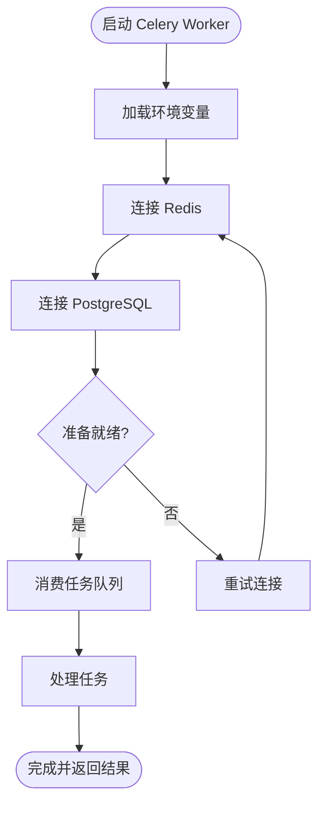
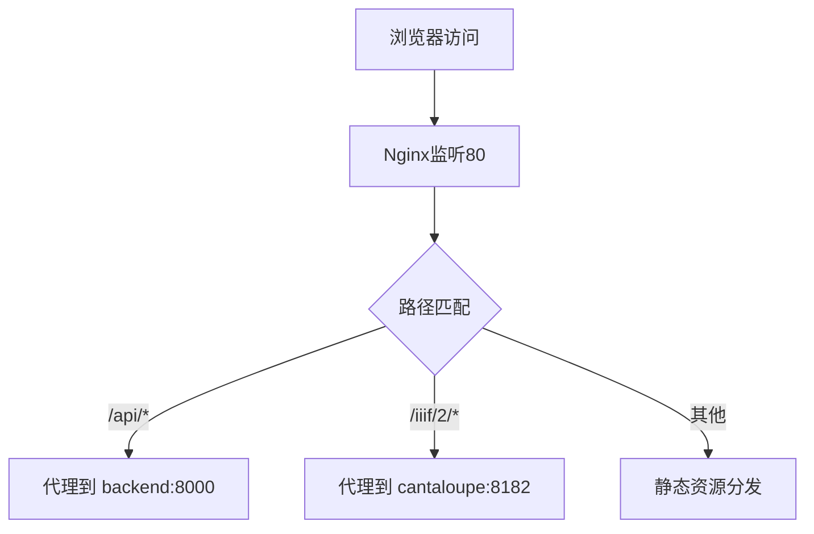
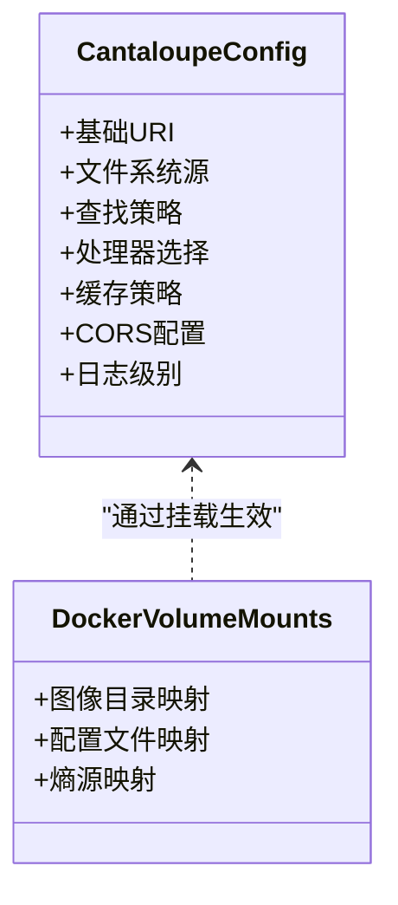
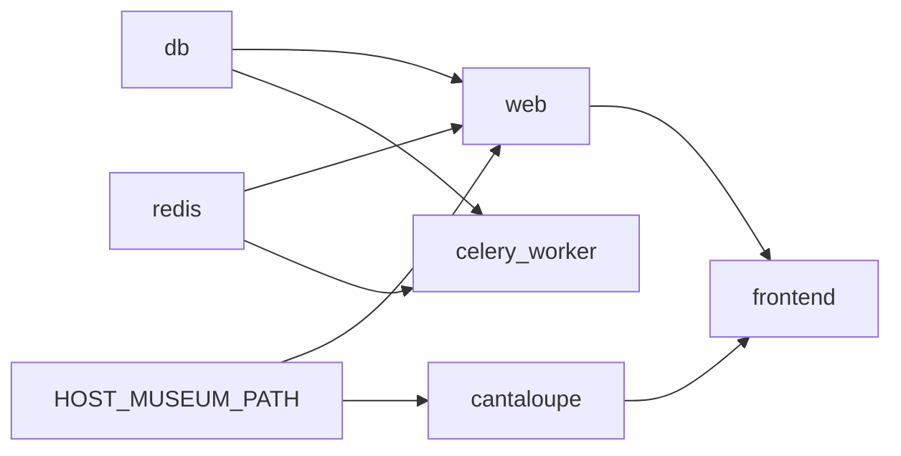

# Docker编排配置

<cite>
**本文引用的文件**
- [docker-compose.yml](file://docker-compose.yml)
- [docker-compose.local-postgres.yml](file://docker-compose.local-postgres.yml)
- [backend/Dockerfile](file://backend/Dockerfile)
- [frontend/Dockerfile](file://frontend/Dockerfile)
- [cantaloupe/Dockerfile](file://cantaloupe/Dockerfile)
- [frontend/nginx.conf](file://frontend/nginx.conf)
- [cantaloupe.properties](file://cantaloupe.properties)
- [backend/app/config.py](file://backend/app/config.py)
- [backend/app/main.py](file://backend/app/main.py)
- [docs/05-部署与运维/ENVIRONMENT_VARIABLES.md](file://docs/05-部署与运维/ENVIRONMENT_VARIABLES.md)
- [docs/05-部署与运维/SETUP_AND_DEPLOYMENT.md](file://docs/05-部署与运维/SETUP_AND_DEPLOYMENT.md)
- [docs/05-部署与运维/DEPLOYMENT.md](file://docs/05-部署与运维/DEPLOYMENT.md)
</cite>

## 目录
1. [简介](#简介)
2. [项目结构](#项目结构)
3. [核心组件](#核心组件)
4. [架构总览](#架构总览)
5. [详细组件分析](#详细组件分析)
6. [依赖关系分析](#依赖关系分析)
7. [性能考虑](#性能考虑)
8. [故障排查指南](#故障排查指南)
9. [结论](#结论)
10. [附录](#附录)

## 简介
本文件面向MDAMS原型项目的Docker编排配置，围绕docker-compose.yml中的服务定义进行系统性说明，覆盖后端FastAPI应用(web)、前端React应用(frontend)、数据库(PostgreSQL)、缓存服务(Redis)、IIIF图像服务(Cantaloupe)、异步任务队列(Celery)等核心服务；同时介绍网络、卷挂载、环境变量、健康检查、服务依赖与启动顺序、本地开发特殊配置、扩展与资源限制、日志配置等高级主题，并提供常见问题解决方案。

## 项目结构
本项目采用多服务单仓库的Compose编排方式，核心文件与目录如下：
- 编排文件：docker-compose.yml、docker-compose.local-postgres.yml
- 服务镜像构建：backend/Dockerfile、frontend/Dockerfile、cantaloupe/Dockerfile
- 服务配置：frontend/nginx.conf、cantaloupe.properties
- 后端配置与入口：backend/app/config.py、backend/app/main.py
- 环境变量与部署说明：docs/05-部署与运维/ENVIRONMENT_VARIABLES.md、docs/05-部署与运维/SETUP_AND_DEPLOYMENT.md、docs/05-部署与运维/DEPLOYMENT.md

**图表来源**
- [docker-compose.yml:1-131](file://docker-compose.yml#L1-L131)
- [docker-compose.local-postgres.yml:1-19](file://docker-compose.local-postgres.yml#L1-L19)
- [backend/Dockerfile:1-52](file://backend/Dockerfile#L1-L52)
- [frontend/Dockerfile:1-28](file://frontend/Dockerfile#L1-L28)
- [cantaloupe/Dockerfile:1-43](file://cantaloupe/Dockerfile#L1-L43)
- [frontend/nginx.conf:1-33](file://frontend/nginx.conf#L1-L33)
- [cantaloupe.properties:1-162](file://cantaloupe.properties#L1-L162)
- [backend/app/config.py:1-72](file://backend/app/config.py#L1-L72)
- [backend/app/main.py:1-86](file://backend/app/main.py#L1-L86)
- [docs/05-部署与运维/ENVIRONMENT_VARIABLES.md:1-86](file://docs/05-部署与运维/ENVIRONMENT_VARIABLES.md#L1-L86)
- [docs/05-部署与运维/SETUP_AND_DEPLOYMENT.md:63-127](file://docs/05-部署与运维/SETUP_AND_DEPLOYMENT.md#L63-L127)
- [docs/05-部署与运维/DEPLOYMENT.md:1-90](file://docs/05-部署与运维/DEPLOYMENT.md#L1-L90)

**章节来源**
- [docker-compose.yml:1-131](file://docker-compose.yml#L1-L131)
- [docker-compose.local-postgres.yml:1-19](file://docker-compose.local-postgres.yml#L1-L19)
- [docs/05-部署与运维/ENVIRONMENT_VARIABLES.md:1-86](file://docs/05-部署与运维/ENVIRONMENT_VARIABLES.md#L1-L86)
- [docs/05-部署与运维/SETUP_AND_DEPLOYMENT.md:63-127](file://docs/05-部署与运维/SETUP_AND_DEPLOYMENT.md#L63-L127)
- [docs/05-部署与运维/DEPLOYMENT.md:1-90](file://docs/05-部署与运维/DEPLOYMENT.md#L1-L90)

## 核心组件
本节对docker-compose.yml中各服务进行逐项解析，涵盖镜像构建、端口映射、环境变量、卷挂载、依赖关系与启动顺序等。

- web服务（后端FastAPI应用）
  - 构建上下文：./backend
  - 容器名：meam-backend
  - 重启策略：always
  - 端口映射：由环境变量控制，默认映射宿主机${BACKEND_PORT}到容器8000
  - 环境变量：数据库连接、Redis连接、IIIF公共URL、上传目录、人脸识别相关参数、libvips内存阈值与并发等
  - 卷挂载：将宿主机博物馆路径映射到容器上传目录，便于直接读写NAS
  - 依赖：db、redis
  - 健康检查：未在compose中定义，但后端路由包含健康检查接口，可用于外部探针或反向代理策略

- celery_worker（异步任务队列工作进程）
  - 构建上下文：./backend
  - 容器名：meam-worker
  - 重启策略：always
  - 命令：指定Celery应用模块、日志级别与并发数
  - 环境变量：与web一致，含数据库、Redis、上传目录、人脸识别等
  - 卷挂载：同web，映射NAS路径
  - 依赖：db、redis

- redis（缓存服务）
  - 镜像：redis:7-alpine
  - 容器名：meam-redis
  - 重启策略：always
  - 端口映射：由环境变量控制，默认映射宿主机${REDIS_PORT}到容器6379

- frontend（前端React应用）
  - 构建上下文：./frontend
  - 容器名：meam-frontend
  - 重启策略：always
  - 端口映射：由环境变量控制，默认映射宿主机${FRONTEND_PORT}到容器80
  - 卷挂载：挂载nginx.conf到容器内默认站点配置，启用Nginx静态服务与反向代理
  - 依赖：backend、cantaloupe

- db（PostgreSQL数据库）
  - 镜像：postgres:16-alpine
  - 容器名：meam-db
  - 重启策略：always
  - 环境变量：用户名、密码、数据库名
  - 端口映射：由环境变量控制，默认映射宿主机${DB_PORT}到容器5432
  - 卷挂载：本地SSD数据目录，提升I/O性能
  - 资源限制：容器级内存上限2G

- cantaloupe（IIIF图像服务）
  - 构建上下文：./cantaloupe
  - 镜像：meam-cantaloupe:local
  - 容器名：meam-cantaloupe
  - 重启策略：always
  - 端口映射：由环境变量控制，默认映射宿主机${CANTALOUPE_PORT}到容器8182
  - 卷挂载：NAS路径映射到图像目录；挂载配置文件；注入熵源/dev/urandom
  - 环境变量：配置文件路径、JVM参数、UTF-8语言环境

- volumes（命名卷）
  - meam_pg_data：用于PostgreSQL数据持久化

- networks（网络）
  - 未在compose中显式声明networks，使用默认桥接网络，服务间通过服务名互访（如backend、cantaloupe）

- 健康检查（healthcheck）
  - compose中未定义healthcheck；建议在生产环境结合后端健康检查路由与反向代理策略实现就绪/存活探针

- 服务依赖与启动顺序
  - web依赖db、redis
  - celery_worker依赖db、redis
  - frontend依赖backend、cantaloupe
  - cantaloupe独立启动，但被frontend通过反向代理访问

**章节来源**
- [docker-compose.yml:1-131](file://docker-compose.yml#L1-L131)
- [backend/app/config.py:42-46](file://backend/app/config.py#L42-L46)
- [frontend/nginx.conf:10-31](file://frontend/nginx.conf#L10-L31)
- [cantaloupe.properties:10-11](file://cantaloupe.properties#L10-L11)

## 架构总览
下图展示服务间的网络与数据流向，以及反向代理与共享存储的关键交互。

**图表来源**
- [docker-compose.yml:1-131](file://docker-compose.yml#L1-L131)
- [frontend/nginx.conf:10-31](file://frontend/nginx.conf#L10-L31)
- [cantaloupe.properties:16-24](file://cantaloupe.properties#L16-L24)

## 详细组件分析

### Web服务（后端FastAPI应用）
- 镜像构建与入口
  - 基于Python 3.12 Slim，安装libvips及相关工具，构建完成后以uvicorn运行应用
- 环境变量与配置
  - 通过后端配置模块读取DATABASE_URL、REDIS_URL、API_PUBLIC_URL、CANTALOUPE_PUBLIC_URL、UPLOAD_DIR等
  - 人脸识别相关参数、libvips阈值与并发等通过环境变量传入
- 卷挂载
  - 将宿主机博物馆路径映射到容器上传目录，实现NAS直挂
- 依赖与启动顺序
  - 依赖db与redis，先于frontend启动
- 健康检查
  - 后端包含健康检查路由，可在外部探针或反向代理中使用

**图表来源**
- [frontend/nginx.conf:10-19](file://frontend/nginx.conf#L10-L19)
- [backend/app/config.py:42-46](file://backend/app/config.py#L42-L46)
- [backend/app/main.py:64-86](file://backend/app/main.py#L64-L86)

**章节来源**
- [backend/Dockerfile:1-52](file://backend/Dockerfile#L1-L52)
- [backend/app/config.py:42-72](file://backend/app/config.py#L42-L72)
- [backend/app/main.py:64-86](file://backend/app/main.py#L64-L86)
- [docker-compose.yml:2-36](file://docker-compose.yml#L2-L36)

### Celery Worker（异步任务队列）
- 构建与命令
  - 复用后端镜像，以Celery Worker模式启动，设置日志级别与并发
- 环境变量
  - 与web一致，确保任务队列与缓存连接正常
- 卷挂载
  - 映射NAS路径，保证任务处理时可直接访问原始图像数据
- 依赖
  - 依赖db与redis，先于frontend启动

**图表来源**
- [docker-compose.yml:37-64](file://docker-compose.yml#L37-L64)
- [backend/app/config.py:42-72](file://backend/app/config.py#L42-L72)

**章节来源**
- [docker-compose.yml:37-64](file://docker-compose.yml#L37-L64)
- [backend/app/config.py:42-72](file://backend/app/config.py#L42-L72)

### Redis（缓存服务）
- 镜像与端口
  - 使用官方redis:7-alpine镜像，容器内6379端口映射到宿主机${REDIS_PORT}
- 用途
  - 为后端与Celery提供消息队列与缓存

**章节来源**
- [docker-compose.yml:65-71](file://docker-compose.yml#L65-L71)

### Frontend（前端React应用）
- 镜像构建
  - 多阶段构建：Node构建产物，Nginx提供静态服务
- 反向代理
  - 通过挂载的nginx.conf将/api/代理到backend:8000，将/iiif/2/代理到cantaloupe:8182
- 端口映射
  - 映射宿主机${FRONTEND_PORT}到容器80

**图表来源**
- [frontend/nginx.conf:1-33](file://frontend/nginx.conf#L1-L33)
- [docker-compose.yml:72-82](file://docker-compose.yml#L72-L82)

**章节来源**
- [frontend/Dockerfile:1-28](file://frontend/Dockerfile#L1-L28)
- [frontend/nginx.conf:1-33](file://frontend/nginx.conf#L1-L33)
- [docker-compose.yml:72-82](file://docker-compose.yml#L72-L82)

### DB（PostgreSQL数据库）
- 镜像与端口
  - 使用postgres:16-alpine，映射宿主机${DB_PORT}到容器5432
- 环境变量
  - 设置用户名、密码、数据库名
- 卷挂载
  - 将本地SSD目录映射到容器数据目录，提升I/O性能
- 资源限制
  - 容器内存上限2G

**章节来源**
- [docker-compose.yml:84-102](file://docker-compose.yml#L84-L102)

### Cantaloupe（IIIF图像服务）
- 镜像构建
  - 基于Eclipse Temurin 11 JRE，下载并解压Cantaloupe发行包，内置GraphicsMagick与FFmpeg
- 端口与配置
  - 暴露8182端口，挂载配置文件与图像目录，注入熵源/dev/urandom
- 环境变量
  - 指定配置文件路径、JVM参数、UTF-8语言环境
- 配置要点
  - 文件系统源启用，映射图像目录；缓存策略与流式检索优化；CORS允许跨域

**图表来源**
- [cantaloupe.properties:8-162](file://cantaloupe.properties#L8-L162)
- [cantaloupe/Dockerfile:1-43](file://cantaloupe/Dockerfile#L1-L43)
- [docker-compose.yml:105-128](file://docker-compose.yml#L105-L128)

**章节来源**
- [cantaloupe/Dockerfile:1-43](file://cantaloupe/Dockerfile#L1-L43)
- [cantaloupe.properties:1-162](file://cantaloupe.properties#L1-L162)
- [docker-compose.yml:105-128](file://docker-compose.yml#L105-L128)

## 依赖关系分析
- 服务间依赖
  - web依赖db与redis
  - celery_worker依赖db与redis
  - frontend依赖backend与cantaloupe
  - cantaloupe独立，但被frontend通过反向代理访问
- 网络与通信
  - 默认桥接网络，服务通过服务名互访（如backend、cantaloupe）
  - 前端通过Nginx反向代理访问后端与图像服务
- 卷与数据持久化
  - db使用本地SSD卷；cantaloupe与后端共享NAS路径，实现原始图像与缓存的统一存储

**图表来源**
- [docker-compose.yml:1-131](file://docker-compose.yml#L1-L131)

**章节来源**
- [docker-compose.yml:1-131](file://docker-compose.yml#L1-L131)

## 性能考虑
- 内存与I/O优化
  - 后端libvips：通过磁盘阈值与并发参数控制内存占用，避免OOM
  - Cantaloupe：JVM堆大小限制与禁用内存缓存，依赖SSD文件缓存
  - 数据库：容器内存上限2G，结合本地SSD数据目录
- 存储策略
  - 热数据（数据库、缩略图缓存）走本地SSD
  - 冷数据（原始PSB/TIFF大图）走NAS（NFS）
- 端口与代理
  - 通过Nginx统一对外端口，避免直接暴露8182端口，减少CORS与安全风险

**章节来源**
- [docs/05-部署与运维/DEPLOYMENT.md:55-72](file://docs/05-部署与运维/DEPLOYMENT.md#L55-L72)
- [backend/Dockerfile:18-41](file://backend/Dockerfile#L18-L41)
- [cantaloupe/Dockerfile:13-21](file://cantaloupe/Dockerfile#L13-L21)
- [docker-compose.yml:98-102](file://docker-compose.yml#L98-L102)

## 故障排查指南
- 权限错误
  - 检查NAS挂载点权限，确保容器内用户对映射目录具备读写权限
- 服务启动失败
  - 查看容器日志，定位数据库连接、Redis连接或端口冲突问题
- 大图预览卡顿
  - 检查Cantaloupe日志，确认缓存生成进度；首次访问可能较慢属正常
- 端口冲突
  - 调整环境变量中的端口映射，确保宿主机端口未被占用
- CORS与代理问题
  - 确认Nginx反向代理配置正确，特别是/api与/iiif/2前缀头设置

**章节来源**
- [docs/05-部署与运维/DEPLOYMENT.md:73-90](file://docs/05-部署与运维/DEPLOYMENT.md#L73-L90)
- [frontend/nginx.conf:10-31](file://frontend/nginx.conf#L10-L31)

## 结论
本编排以“共享存储+反向代理+容器隔离”为核心设计，既满足本地开发的快速迭代，又兼顾生产环境的性能与稳定性。通过明确的环境变量、卷挂载与资源限制策略，系统在N100硬件条件下实现了大图处理与高并发访问的平衡。建议在生产环境中补充健康检查与监控告警，并根据业务增长调整资源配额与存储布局。

## 附录

### 环境变量与默认值
- 数据库
  - POSTGRES_USER、POSTGRES_PASSWORD、POSTGRES_DB、DATABASE_URL
- 缓存与任务
  - REDIS_URL
- 浏览器可访问地址
  - API_PUBLIC_URL、CANTALOUPE_PUBLIC_URL
- 文件路径
  - HOST_MUSEUM_PATH、UPLOAD_DIR
- 图像处理
  - VIPS_DISC_THRESHOLD、VIPS_CONCURRENCY、JAVA_OPTS
- 端口
  - FRONTEND_PORT、BACKEND_PORT、DB_PORT、REDIS_PORT、CANTALOUPE_PORT

**章节来源**
- [docs/05-部署与运维/ENVIRONMENT_VARIABLES.md:10-86](file://docs/05-部署与运维/ENVIRONMENT_VARIABLES.md#L10-L86)
- [backend/app/config.py:42-72](file://backend/app/config.py#L42-L72)

### 本地开发特殊配置
- 本地PostgreSQL替代方案
  - 使用独立Compose文件启动Bitnami PostgreSQL，便于本地开发与测试
  - 该方案提供固定端口与默认凭据，适合快速验证

**章节来源**
- [docker-compose.local-postgres.yml:1-19](file://docker-compose.local-postgres.yml#L1-L19)

### 健康检查与探针建议
- compose中未定义healthcheck，建议结合后端健康检查路由与反向代理策略实现：
  - 就绪探针：检查数据库与Redis可用性
  - 存活探针：调用后端健康检查接口
- 前端可通过Nginx对后端与Cantaloupe进行简单可达性探测

**章节来源**
- [backend/app/main.py:12-12](file://backend/app/main.py#L12-L12)
- [frontend/nginx.conf:10-31](file://frontend/nginx.conf#L10-L31)

### 扩展与资源限制
- 扩容思路
  - web与celery_worker均可通过副本数扩展（需配合Redis与数据库容量评估）
  - 前端可横向扩展多个实例并通过负载均衡对外提供服务
- 资源限制
  - 数据库容器已设置内存上限；可根据实际负载调整
  - 建议为Cantaloupe与后端分别设置CPU/内存配额，避免资源争用

**章节来源**
- [docker-compose.yml:98-102](file://docker-compose.yml#L98-L102)

### 日志配置
- 建议
  - 使用容器日志驱动收集后端、前端、Cantaloupe与Redis日志
  - 前端Nginx可开启访问日志，便于分析请求路径与错误
  - 数据库与缓存日志默认启用，必要时调整日志级别

**章节来源**
- [frontend/nginx.conf:1-33](file://frontend/nginx.conf#L1-L33)
- [cantaloupe.properties:149-162](file://cantaloupe.properties#L149-L162)