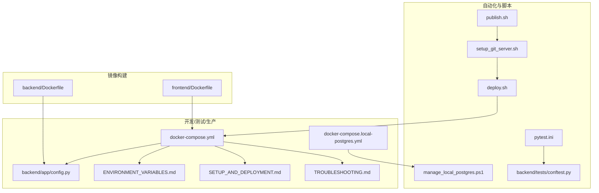
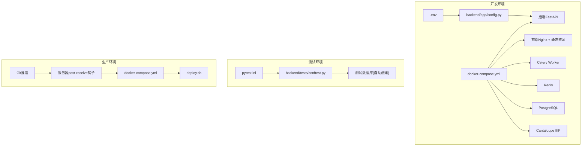
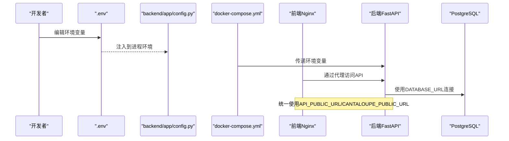
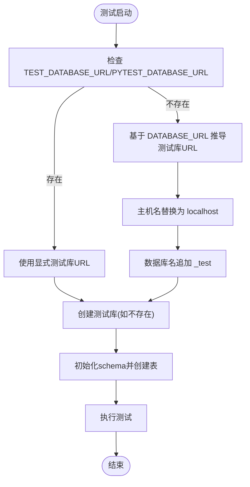
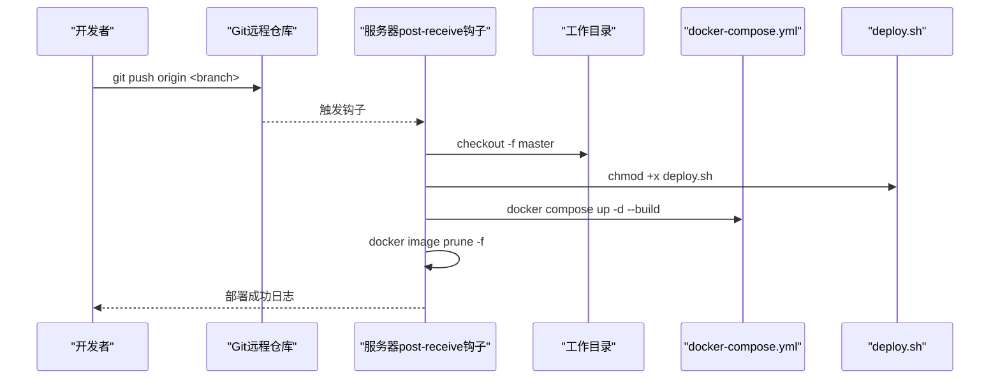
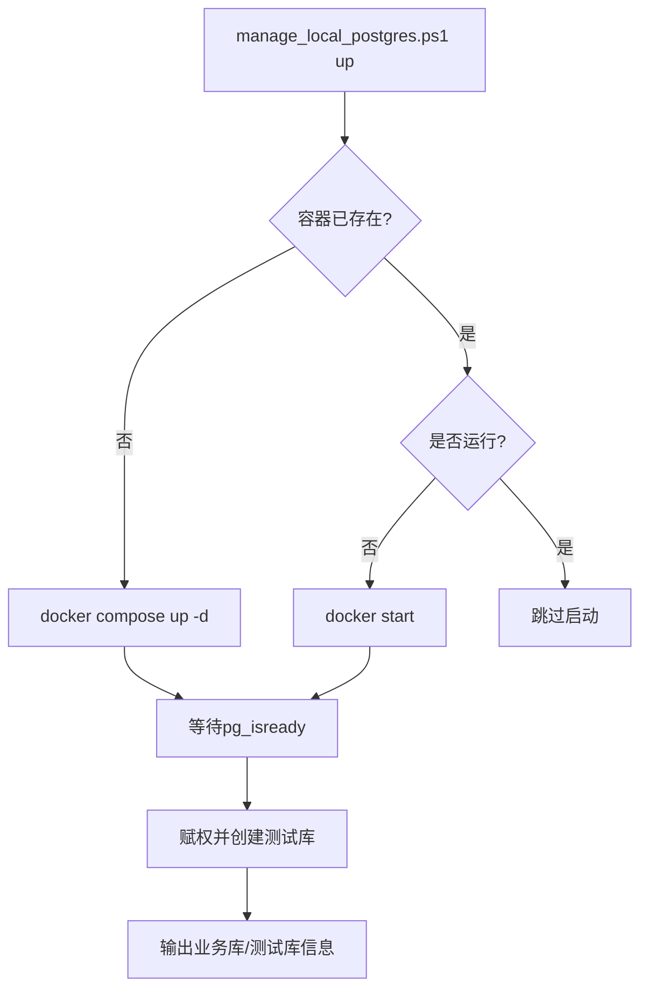
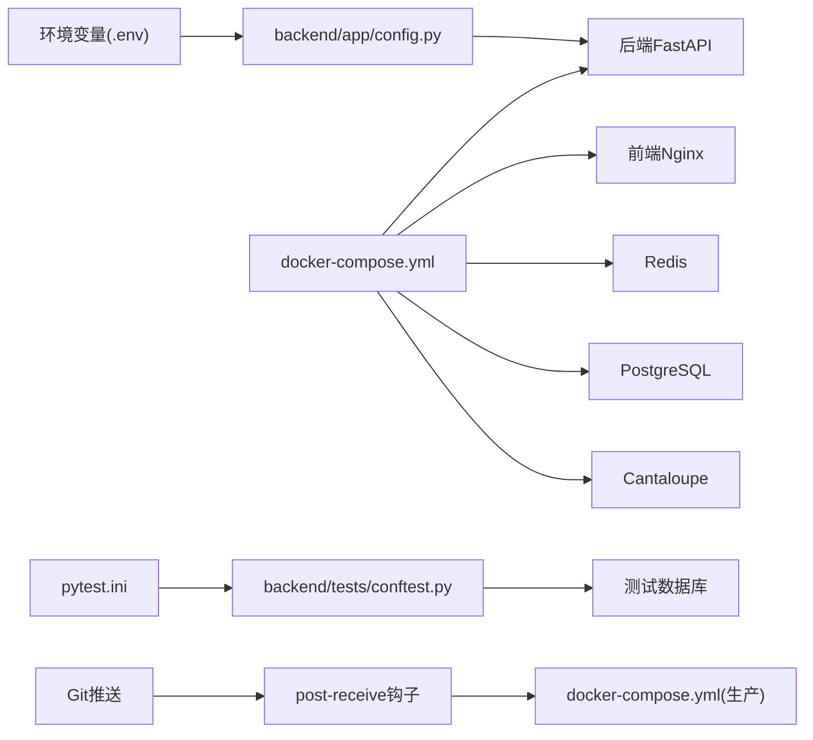

# 多环境配置管理

<cite>
**本文引用的文件**
- [docker-compose.yml](file://docker-compose.yml)
- [docker-compose.local-postgres.yml](file://docker-compose.local-postgres.yml)
- [backend/app/config.py](file://backend/app/config.py)
- [docs/05-部署与运维/ENVIRONMENT_VARIABLES.md](file://docs/05-部署与运维/ENVIRONMENT_VARIABLES.md)
- [docs/05-部署与运维/SETUP_AND_DEPLOYMENT.md](file://docs/05-部署与运维/SETUP_AND_DEPLOYMENT.md)
- [docs/05-部署与运维/TROUBLESHOOTING.md](file://docs/05-部署与运维/TROUBLESHOOTING.md)
- [deploy.sh](file://deploy.sh)
- [publish.sh](file://publish.sh)
- [setup_git_server.sh](file://setup_git_server.sh)
- [manage_local_postgres.ps1](file://manage_local_postgres.ps1)
- [backend/tests/conftest.py](file://backend/tests/conftest.py)
- [pytest.ini](file://pytest.ini)
- [backend/Dockerfile](file://backend/Dockerfile)
- [frontend/Dockerfile](file://frontend/Dockerfile)
</cite>

## 目录
1. [简介](#简介)
2. [项目结构](#项目结构)
3. [核心组件](#核心组件)
4. [架构总览](#架构总览)
5. [详细组件分析](#详细组件分析)
6. [依赖分析](#依赖分析)
7. [性能考虑](#性能考虑)
8. [故障排查指南](#故障排查指南)
9. [结论](#结论)
10. [附录](#附录)

## 简介
本文件面向MDAMS原型项目的多环境配置管理，系统性阐述开发、测试、生产等环境的配置差异与管理策略，覆盖docker-compose环境特定配置、环境变量的环境区分、服务配置的环境定制、本地开发环境的特殊配置（含本地PostgreSQL）、测试环境配置、生产环境要求、配置模板与自动化部署脚本、配置验证与一致性检查机制，以及环境迁移与配置同步的最佳实践。

## 项目结构
围绕多环境配置的关键文件与职责如下：
- docker-compose.yml：定义所有服务及环境变量占位符，统一承载开发与生产的基础编排。
- docker-compose.local-postgres.yml：提供本地独立PostgreSQL服务，便于快速测试与离线开发。
- backend/app/config.py：后端配置加载逻辑，支持从.env向外逐级查找并注入环境变量。
- docs/05-部署与运维/*：环境变量说明、部署与配置、故障排查等权威文档。
- 部署脚本：deploy.sh、publish.sh、setup_git_server.sh、manage_local_postgres.ps1。
- 测试配置：pytest.ini与backend/tests/conftest.py，负责测试数据库URL解析与准备。
- Dockerfile：后端与前端镜像构建，体现镜像源与运行参数。

**图表来源**
- [docker-compose.yml:1-131](file://docker-compose.yml#L1-L131)
- [docker-compose.local-postgres.yml:1-19](file://docker-compose.local-postgres.yml#L1-L19)
- [backend/app/config.py:1-72](file://backend/app/config.py#L1-L72)
- [docs/05-部署与运维/ENVIRONMENT_VARIABLES.md:1-86](file://docs/05-部署与运维/ENVIRONMENT_VARIABLES.md#L1-L86)
- [docs/05-部署与运维/SETUP_AND_DEPLOYMENT.md:1-253](file://docs/05-部署与运维/SETUP_AND_DEPLOYMENT.md#L1-L253)
- [docs/05-部署与运维/TROUBLESHOOTING.md:1-242](file://docs/05-部署与运维/TROUBLESHOOTING.md#L1-L242)
- [deploy.sh:1-38](file://deploy.sh#L1-L38)
- [publish.sh:1-19](file://publish.sh#L1-L19)
- [setup_git_server.sh:1-70](file://setup_git_server.sh#L1-L70)
- [manage_local_postgres.ps1:1-98](file://manage_local_postgres.ps1#L1-L98)
- [backend/tests/conftest.py:1-112](file://backend/tests/conftest.py#L1-L112)
- [pytest.ini:1-9](file://pytest.ini#L1-L9)
- [backend/Dockerfile:1-52](file://backend/Dockerfile#L1-L52)
- [frontend/Dockerfile:1-28](file://frontend/Dockerfile#L1-L28)

**章节来源**
- [docker-compose.yml:1-131](file://docker-compose.yml#L1-L131)
- [docker-compose.local-postgres.yml:1-19](file://docker-compose.local-postgres.yml#L1-L19)
- [backend/app/config.py:1-72](file://backend/app/config.py#L1-L72)
- [docs/05-部署与运维/ENVIRONMENT_VARIABLES.md:1-86](file://docs/05-部署与运维/ENVIRONMENT_VARIABLES.md#L1-L86)
- [docs/05-部署与运维/SETUP_AND_DEPLOYMENT.md:1-253](file://docs/05-部署与运维/SETUP_AND_DEPLOYMENT.md#L1-L253)
- [docs/05-部署与运维/TROUBLESHOOTING.md:1-242](file://docs/05-部署与运维/TROUBLESHOOTING.md#L1-L242)
- [deploy.sh:1-38](file://deploy.sh#L1-L38)
- [publish.sh:1-19](file://publish.sh#L1-L19)
- [setup_git_server.sh:1-70](file://setup_git_server.sh#L1-L70)
- [manage_local_postgres.ps1:1-98](file://manage_local_postgres.ps1#L1-L98)
- [backend/tests/conftest.py:1-112](file://backend/tests/conftest.py#L1-L112)
- [pytest.ini:1-9](file://pytest.ini#L1-L9)
- [backend/Dockerfile:1-52](file://backend/Dockerfile#L1-L52)
- [frontend/Dockerfile:1-28](file://frontend/Dockerfile#L1-L28)

## 核心组件
- 环境变量体系：数据库、Redis、公开URL、AI服务、文件路径、图像处理、端口等，详见环境变量说明文档与后端配置加载逻辑。
- 编排与服务：后端API、Celery Worker、Redis、前端Nginx、PostgreSQL、Cantaloupe IIIF服务。
- 本地PostgreSQL：独立容器，便于测试与离线开发。
- 测试数据库解析：基于pytest环境变量与默认规则，自动推导测试库URL并创建数据库。
- 自动化部署：Git推送触发服务器钩子，自动checkout、重建并重启服务；本地一键部署脚本。

**章节来源**
- [docs/05-部署与运维/ENVIRONMENT_VARIABLES.md:10-86](file://docs/05-部署与运维/ENVIRONMENT_VARIABLES.md#L10-L86)
- [backend/app/config.py:42-72](file://backend/app/config.py#L42-L72)
- [docker-compose.yml:1-131](file://docker-compose.yml#L1-L131)
- [docker-compose.local-postgres.yml:1-19](file://docker-compose.local-postgres.yml#L1-L19)
- [backend/tests/conftest.py:21-71](file://backend/tests/conftest.py#L21-L71)
- [pytest.ini:1-9](file://pytest.ini#L1-L9)
- [deploy.sh:1-38](file://deploy.sh#L1-L38)
- [setup_git_server.sh:19-63](file://setup_git_server.sh#L19-L63)

## 架构总览
多环境配置通过“环境变量 + docker-compose编排 + 后端配置加载 + 自动化脚本”协同实现。开发环境优先使用compose默认配置并通过.env覆盖；测试环境通过pytest约定解析测试数据库；生产环境通过Git推送触发服务器钩子完成部署。

**图表来源**
- [docker-compose.yml:1-131](file://docker-compose.yml#L1-L131)
- [backend/app/config.py:1-72](file://backend/app/config.py#L1-L72)
- [backend/tests/conftest.py:1-112](file://backend/tests/conftest.py#L1-L112)
- [pytest.ini:1-9](file://pytest.ini#L1-L9)
- [setup_git_server.sh:19-63](file://setup_git_server.sh#L19-L63)
- [deploy.sh:1-38](file://deploy.sh#L1-L38)

## 详细组件分析

### 开发环境配置与切换机制
- 环境变量优先级：后端通过自定义加载函数向外逐级查找最近的.env文件并注入环境变量，避免外部依赖。
- docker-compose占位符：所有服务均通过环境变量进行配置，端口、数据库连接、Redis、公开URL、人脸服务等均来自环境变量。
- 前端代理策略：统一通过前端Nginx代理API与IIIF请求，确保浏览器访问地址一致且避免CORS问题。
- 本地PostgreSQL：提供独立容器，便于在无NAS或离线场景下进行开发与测试。

**图表来源**
- [backend/app/config.py:5-37](file://backend/app/config.py#L5-L37)
- [docker-compose.yml:8-29](file://docker-compose.yml#L8-L29)
- [docs/05-部署与运维/SETUP_AND_DEPLOYMENT.md:32-51](file://docs/05-部署与运维/SETUP_AND_DEPLOYMENT.md#L32-L51)

**章节来源**
- [backend/app/config.py:5-37](file://backend/app/config.py#L5-L37)
- [docker-compose.yml:1-131](file://docker-compose.yml#L1-L131)
- [docs/05-部署与运维/SETUP_AND_DEPLOYMENT.md:32-51](file://docs/05-部署与运维/SETUP_AND_DEPLOYMENT.md#L32-L51)

### 测试环境配置与数据库隔离
- 测试数据库URL解析：优先使用TEST_DATABASE_URL或PYTEST_DATABASE_URL，否则基于DATABASE_URL推导，将主机名替换为localhost并将数据库名追加_test后缀。
- 自动创建测试库：通过管理员数据库连接判断并创建测试库，确保测试可重复执行。
- 测试会话：在每个会话开始前清理并重建表结构，保证测试隔离。

**图表来源**
- [backend/tests/conftest.py:21-71](file://backend/tests/conftest.py#L21-L71)
- [pytest.ini:1-9](file://pytest.ini#L1-L9)

**章节来源**
- [backend/tests/conftest.py:21-71](file://backend/tests/conftest.py#L21-L71)
- [pytest.ini:1-9](file://pytest.ini#L1-L9)

### 生产环境配置与自动化部署
- Git推送触发：服务器端post-receive钩子接收推送后，自动checkout到工作目录、赋予部署脚本执行权限、设置公开URL环境变量并重建服务。
- 本地部署脚本：检查Docker、创建数据目录、构建并启动容器、等待初始化、输出服务状态与访问地址。
- 镜像构建：后端与前端分别使用国内镜像源加速，后端针对libvips与ImageMagick进行安全策略放宽与内存限制调整。

**图表来源**
- [setup_git_server.sh:19-63](file://setup_git_server.sh#L19-L63)
- [deploy.sh:1-38](file://deploy.sh#L1-L38)

**章节来源**
- [setup_git_server.sh:19-63](file://setup_git_server.sh#L19-L63)
- [deploy.sh:1-38](file://deploy.sh#L1-L38)
- [backend/Dockerfile:4-41](file://backend/Dockerfile#L4-L41)
- [frontend/Dockerfile:6-17](file://frontend/Dockerfile#L6-L17)

### 本地PostgreSQL与开发工具集成
- 独立PostgreSQL：提供独立容器与卷，便于本地测试与离线开发。
- PowerShell脚本：封装up/down/status/logs/reset操作，自动等待数据库就绪、创建测试库、输出业务库与测试库信息。
- 与测试配置联动：测试数据库URL可直接指向localhost:5432，简化本地测试链路。

**图表来源**
- [manage_local_postgres.ps1:57-71](file://manage_local_postgres.ps1#L57-L71)

**章节来源**
- [docker-compose.local-postgres.yml:1-19](file://docker-compose.local-postgres.yml#L1-L19)
- [manage_local_postgres.ps1:1-98](file://manage_local_postgres.ps1#L1-L98)
- [docs/05-部署与运维/SETUP_AND_DEPLOYMENT.md:143-151](file://docs/05-部署与运维/SETUP_AND_DEPLOYMENT.md#L143-L151)

### 环境变量与服务配置的环境定制
- 数据库：POSTGRES_USER/PASSWORD/DB与DATABASE_URL；测试库TEST_DATABASE_URL。
- 缓存与任务：REDIS_URL。
- 公开URL：API_PUBLIC_URL与CANTALOUPE_PUBLIC_URL，统一浏览器访问口径。
- 文件路径：HOST_MUSEUM_PATH与UPLOAD_DIR，确保NAS挂载与容器内路径一致。
- 图像处理：VIPS_DISC_THRESHOLD/VIPS_CONCURRENCY与JAVA_OPTS。
- 端口：FRONTEND_PORT/BACKEND_PORT/DB_PORT/REDIS_PORT/CANTALOUPE_PORT。

**章节来源**
- [docs/05-部署与运维/ENVIRONMENT_VARIABLES.md:10-86](file://docs/05-部署与运维/ENVIRONMENT_VARIABLES.md#L10-L86)
- [docker-compose.yml:8-29](file://docker-compose.yml#L8-L29)
- [docker-compose.yml:88-127](file://docker-compose.yml#L88-L127)
- [backend/app/config.py:42-72](file://backend/app/config.py#L42-L72)

## 依赖分析
- 组件耦合：后端配置依赖环境变量；docker-compose将环境变量注入各服务；测试配置依赖后端配置与pytest约定；生产部署依赖Git钩子与docker-compose。
- 外部依赖：Docker、Git、PostgreSQL、Redis、Nginx、Cantaloupe。
- 潜在循环：无直接循环依赖，但测试数据库创建与后端配置存在间接耦合（测试URL解析依赖后端默认值）。

**图表来源**
- [docker-compose.yml:1-131](file://docker-compose.yml#L1-L131)
- [backend/app/config.py:1-72](file://backend/app/config.py#L1-L72)
- [backend/tests/conftest.py:1-112](file://backend/tests/conftest.py#L1-L112)
- [pytest.ini:1-9](file://pytest.ini#L1-L9)
- [setup_git_server.sh:19-63](file://setup_git_server.sh#L19-L63)

**章节来源**
- [docker-compose.yml:1-131](file://docker-compose.yml#L1-L131)
- [backend/app/config.py:1-72](file://backend/app/config.py#L1-L72)
- [backend/tests/conftest.py:1-112](file://backend/tests/conftest.py#L1-L112)
- [pytest.ini:1-9](file://pytest.ini#L1-L9)
- [setup_git_server.sh:19-63](file://setup_git_server.sh#L19-L63)

## 性能考虑
- 后端镜像：针对libvips与ImageMagick放宽安全策略并提升内存限制，适配N100硬件条件。
- 前端镜像：使用国内NPM镜像与Node内存上限，减少构建期内存压力。
- 数据库：生产环境限制容器内存，建议结合NAS与SSD提升I/O性能。
- Cantaloupe：通过JAVA_OPTS与熵源映射优化启动速度与稳定性。

**章节来源**
- [backend/Dockerfile:18-41](file://backend/Dockerfile#L18-L41)
- [frontend/Dockerfile:10-17](file://frontend/Dockerfile#L10-L17)
- [docker-compose.yml:98-102](file://docker-compose.yml#L98-L102)
- [docker-compose.yml:122-127](file://docker-compose.yml#L122-L127)

## 故障排查指南
- 启动类问题：优先检查容器状态、健康与就绪接口、端口占用。
- 数据库连不上：核对POSTGRES_USER/PASSWORD/DB与DATABASE_URL，确认主机名与容器网络。
- 上传文件找不到：核对HOST_MUSEUM_PATH与挂载路径，确认容器内上传目录映射。
- IIIF/Mirador问题：核对CANTALOUPE_PUBLIC_URL与前端Nginx代理配置。
- 权限与登录：核对用户角色与权限，确认token有效性与上下文刷新。

**章节来源**
- [docs/05-部署与运维/TROUBLESHOOTING.md:6-242](file://docs/05-部署与运维/TROUBLESHOOTING.md#L6-L242)
- [docs/05-部署与运维/SETUP_AND_DEPLOYMENT.md:197-237](file://docs/05-部署与运维/SETUP_AND_DEPLOYMENT.md#L197-L237)

## 结论
本项目通过“环境变量 + docker-compose + 后端配置加载 + 自动化脚本”的组合，实现了开发、测试、生产的清晰分层与可重复配置。建议在团队内统一遵循“.env优先、尽量不改compose”的原则，配合测试数据库自动创建与Git推送部署，确保配置一致性与交付效率。

## 附录

### 环境变量清单与默认值
- 数据库：POSTGRES_USER、POSTGRES_PASSWORD、POSTGRES_DB、DATABASE_URL、TEST_DATABASE_URL
- 缓存与任务：REDIS_URL
- 公开URL：API_PUBLIC_URL、CANTALOUPE_PUBLIC_URL
- 文件路径：HOST_MUSEUM_PATH、UPLOAD_DIR
- 图像处理：VIPS_DISC_THRESHOLD、VIPS_CONCURRENCY、JAVA_OPTS
- 端口：FRONTEND_PORT、BACKEND_PORT、DB_PORT、REDIS_PORT、CANTALOUPE_PORT

**章节来源**
- [docs/05-部署与运维/ENVIRONMENT_VARIABLES.md:10-86](file://docs/05-部署与运维/ENVIRONMENT_VARIABLES.md#L10-L86)

### 标准化模板与自动化脚本
- 部署脚本：deploy.sh（本地）、publish.sh（发布）、setup_git_server.sh（服务器钩子）、manage_local_postgres.ps1（本地PostgreSQL）。
- 测试配置：pytest.ini与backend/tests/conftest.py，确保测试数据库URL解析与自动创建。

**章节来源**
- [deploy.sh:1-38](file://deploy.sh#L1-L38)
- [publish.sh:1-19](file://publish.sh#L1-L19)
- [setup_git_server.sh:19-63](file://setup_git_server.sh#L19-L63)
- [manage_local_postgres.ps1:1-98](file://manage_local_postgres.ps1#L1-L98)
- [pytest.ini:1-9](file://pytest.ini#L1-L9)
- [backend/tests/conftest.py:21-71](file://backend/tests/conftest.py#L21-L71)

### 配置验证与一致性检查机制
- 启动后验证：docker compose ps、后端健康/就绪接口、前端首页、登录与典型功能验证。
- 测试验证：pytest标记化测试，数据库schema在会话级别重建，确保一致性。
- 文档校验：ENVIRONMENT_VARIABLES.md与SETUP_AND_DEPLOYMENT.md作为权威参考。

**章节来源**
- [docs/05-部署与运维/SETUP_AND_DEPLOYMENT.md:153-165](file://docs/05-部署与运维/SETUP_AND_DEPLOYMENT.md#L153-L165)
- [backend/tests/conftest.py:103-112](file://backend/tests/conftest.py#L103-L112)
- [docs/05-部署与运维/ENVIRONMENT_VARIABLES.md:1-86](file://docs/05-部署与运维/ENVIRONMENT_VARIABLES.md#L1-L86)

### 环境迁移与配置同步最佳实践
- 开发到测试：通过TEST_DATABASE_URL指定测试库，确保与生产DATABASE_URL解耦。
- 测试到生产：通过Git推送触发服务器钩子，统一环境变量与镜像版本。
- 配置同步：集中维护ENVIRONMENT_VARIABLES.md与SETUP_AND_DEPLOYMENT.md，确保团队成员一致理解与执行。

**章节来源**
- [docs/05-部署与运维/ENVIRONMENT_VARIABLES.md:75-86](file://docs/05-部署与运维/ENVIRONMENT_VARIABLES.md#L75-L86)
- [docs/05-部署与运维/SETUP_AND_DEPLOYMENT.md:183-196](file://docs/05-部署与运维/SETUP_AND_DEPLOYMENT.md#L183-L196)
- [setup_git_server.sh:49-54](file://setup_git_server.sh#L49-L54)