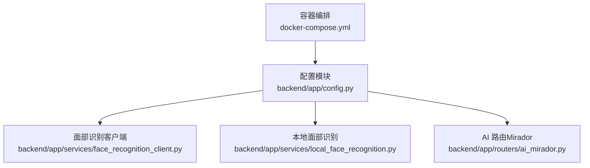
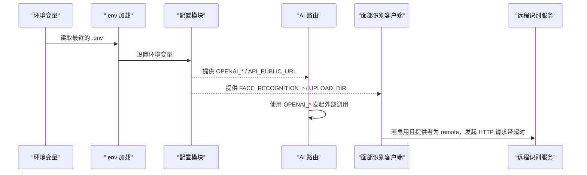
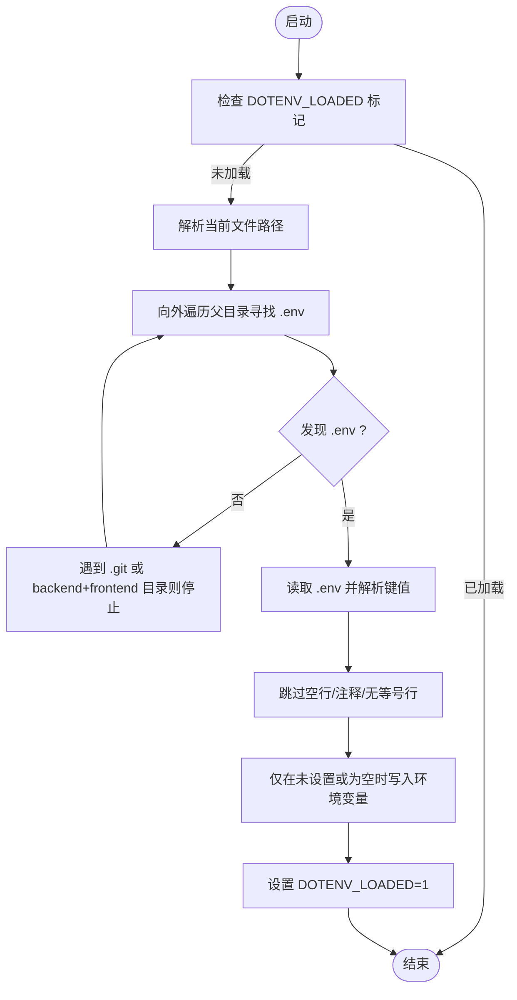
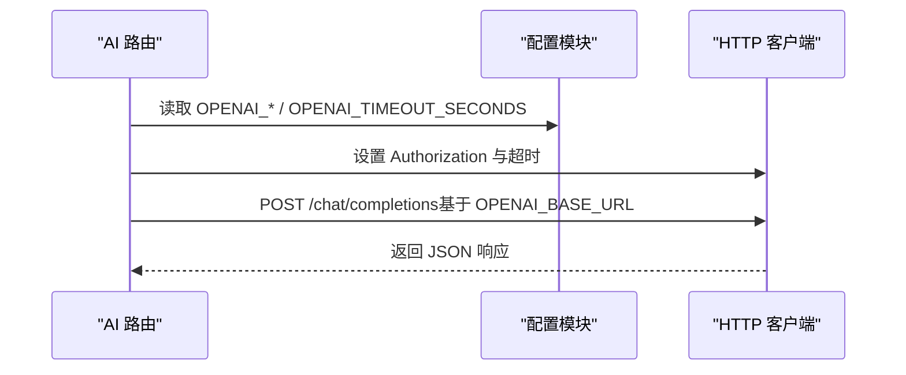
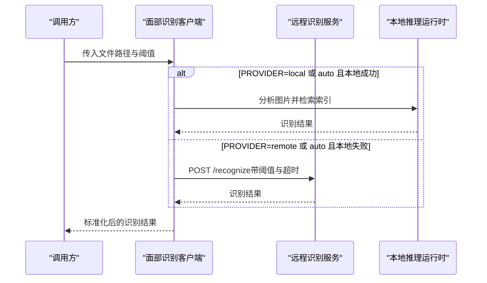
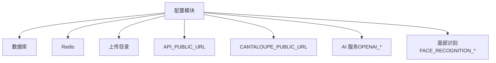

# 环境变量配置

<cite>
**本文引用的文件**
- [backend/app/config.py](file://backend/app/config.py)
- [backend/app/services/face_recognition_client.py](file://backend/app/services/face_recognition_client.py)
- [backend/app/services/local_face_recognition.py](file://backend/app/services/local_face_recognition.py)
- [backend/app/routers/ai_mirador.py](file://backend/app/routers/ai_mirador.py)
- [docker-compose.yml](file://docker-compose.yml)
- [docs/05-部署与运维/ENVIRONMENT_VARIABLES.md](file://docs/05-部署与运维/ENVIRONMENT_VARIABLES.md)
- [docs/05-部署与运维/SETUP_AND_DEPLOYMENT.md](file://docs/05-部署与运维/SETUP_AND_DEPLOYMENT.md)
- [backend/tests/test_config.py](file://backend/tests/test_config.py)
- [backend/tests/test_face_recognition_client.py](file://backend/tests/test_face_recognition_client.py)
</cite>

## 目录
1. [简介](#简介)
2. [项目结构](#项目结构)
3. [核心组件](#核心组件)
4. [架构总览](#架构总览)
5. [详细组件分析](#详细组件分析)
6. [依赖分析](#依赖分析)
7. [性能考虑](#性能考虑)
8. [故障排查指南](#故障排查指南)
9. [结论](#结论)
10. [附录](#附录)

## 简介
本文件系统化梳理 MDAMS 原型项目的环境变量配置，覆盖数据库连接、Redis 连接、文件上传目录、API 公共 URL、Cantaloupe IIIF 地址、AI 服务（Moonshot/OpenAI 兼容）以及面部识别服务（本地/远程）的完整配置项与加载机制。文档同时给出不同环境下的配置示例与最佳实践，帮助开发者快速、安全地完成本地与生产环境的配置。

## 项目结构
围绕环境变量的关键位置与职责如下：
- 配置加载与默认值：backend/app/config.py
- 面部识别客户端与本地推理：backend/app/services/face_recognition_client.py、backend/app/services/local_face_recognition.py
- AI 服务调用（Moonshot/OpenAI 兼容）：backend/app/routers/ai_mirador.py
- 容器编排与变量注入：docker-compose.yml
- 部署与运维文档：docs/05-部署与运维/ENVIRONMENT_VARIABLES.md、docs/05-部署与运维/SETUP_AND_DEPLOYMENT.md
- 行为验证测试：backend/tests/test_config.py、backend/tests/test_face_recognition_client.py

图表来源
- [backend/app/config.py:1-72](file://backend/app/config.py#L1-L72)
- [backend/app/services/face_recognition_client.py:1-134](file://backend/app/services/face_recognition_client.py#L1-L134)
- [backend/app/services/local_face_recognition.py:1-346](file://backend/app/services/local_face_recognition.py#L1-L346)
- [backend/app/routers/ai_mirador.py:1-702](file://backend/app/routers/ai_mirador.py#L1-L702)
- [docker-compose.yml:1-131](file://docker-compose.yml#L1-L131)

章节来源
- [backend/app/config.py:1-72](file://backend/app/config.py#L1-L72)
- [docker-compose.yml:1-131](file://docker-compose.yml#L1-L131)

## 核心组件
本节按功能域分组，逐一说明关键环境变量的定义、用途与默认值来源，并指出其在代码中的使用点。

- 数据库连接
  - 变量：DATABASE_URL
  - 用途：后端应用连接 PostgreSQL 的连接串
  - 默认值来源：backend/app/config.py
  - 使用点：后端数据库初始化与 ORM 连接
  - 章节来源
    - [backend/app/config.py:42](file://backend/app/config.py#L42)
    - [docker-compose.yml:9](file://docker-compose.yml#L9)

- Redis 连接
  - 变量：REDIS_URL
  - 用途：后端与 Celery Worker 连接 Redis
  - 默认值来源：backend/app/config.py
  - 使用点：Celery 任务队列与缓存
  - 章节来源
    - [backend/app/config.py:43](file://backend/app/config.py#L43)
    - [docker-compose.yml:10](file://docker-compose.yml#L10)

- 文件上传目录
  - 变量：UPLOAD_DIR
  - 用途：容器内上传目录（与宿主机目录绑定）
  - 默认值来源：backend/app/config.py
  - 使用点：上传文件存储路径
  - 章节来源
    - [backend/app/config.py:44](file://backend/app/config.py#L44)
    - [docker-compose.yml:20](file://docker-compose.yml#L20)
    - [docs/05-部署与运维/ENVIRONMENT_VARIABLES.md:55](file://docs/05-部署与运维/ENVIRONMENT_VARIABLES.md#L55)

- API 公共 URL
  - 变量：API_PUBLIC_URL
  - 用途：生成对外 API 链接（浏览器视角），用于 IIIF 清单与前端交互
  - 默认值来源：backend/app/config.py
  - 使用点：路由中构建公开链接、AI 路由获取基础 URL
  - 章节来源
    - [backend/app/config.py:45](file://backend/app/config.py#L45)
    - [docker-compose.yml:16](file://docker-compose.yml#L16)
    - [docs/05-部署与运维/ENVIRONMENT_VARIABLES.md:30](file://docs/05-部署与运维/ENVIRONMENT_VARIABLES.md#L30)
    - [backend/app/routers/ai_mirador.py:232-247](file://backend/app/routers/ai_mirador.py#L232-L247)

- Cantaloupe IIIF 服务地址
  - 变量：CANTALOUPE_PUBLIC_URL
  - 用途：浏览器访问 IIIF 服务的公共地址
  - 默认值来源：backend/app/config.py
  - 使用点：生成 IIIF 清单与资源访问链接
  - 章节来源
    - [backend/app/config.py:46](file://backend/app/config.py#L46)
    - [docker-compose.yml:19](file://docker-compose.yml#L19)
    - [docs/05-部署与运维/ENVIRONMENT_VARIABLES.md:31](file://docs/05-部署与运维/ENVIRONMENT_VARIABLES.md#L31)

- AI 服务（Moonshot/OpenAI 兼容）
  - 变量：MOONSHOT_API_KEY、MOONSHOT_BASE_URL、MOONSHOT_MODEL
  - 用途：Moonshot（Kimi）API 的密钥、基础地址与模型名
  - 默认值来源：backend/app/config.py
  - 回退策略：当未显式设置 OPENAI_* 时，自动回退到 MOONSHOT_* 的值
  - 使用点：AI 路由调用 OpenAI 兼容接口
  - 章节来源
    - [backend/app/config.py:51-57](file://backend/app/config.py#L51-L57)
    - [backend/app/routers/ai_mirador.py:504-534](file://backend/app/routers/ai_mirador.py#L504-L534)
    - [docs/05-部署与运维/ENVIRONMENT_VARIABLES.md:37-43](file://docs/05-部署与运维/ENVIRONMENT_VARIABLES.md#L37-L43)

- AI 服务超时设置
  - 变量：OPENAI_TIMEOUT_SECONDS
  - 用途：OpenAI 兼容接口调用超时（秒）
  - 默认值来源：backend/app/config.py
  - 使用点：HTTP 客户端超时配置
  - 章节来源
    - [backend/app/config.py:58](file://backend/app/config.py#L58)
    - [backend/app/routers/ai_mirador.py:525](file://backend/app/routers/ai_mirador.py#L525)

- 面部识别服务（通用）
  - 变量：FACE_RECOGNITION_ENABLED、FACE_RECOGNITION_PROVIDER、FACE_RECOGNITION_BASE_URL、FACE_RECOGNITION_TIMEOUT_SECONDS、FACE_RECOGNITION_THRESHOLD
  - 用途：启用/禁用、提供者选择（local/remote/auto）、远程服务地址、超时、阈值
  - 默认值来源：backend/app/config.py
  - 使用点：客户端根据开关与提供者选择本地或远程识别
  - 章节来源
    - [backend/app/config.py:60-64](file://backend/app/config.py#L60-L64)
    - [backend/app/services/face_recognition_client.py:91-134](file://backend/app/services/face_recognition_client.py#L91-L134)

- 面部识别服务（本地模型）
  - 变量：FACE_RECOGNITION_MODEL_ROOT、FACE_RECOGNITION_MODEL_NAME、FACE_RECOGNITION_INDEX_DIR、FACE_RECOGNITION_STRICT_LOCAL_MODELS
  - 用途：模型根目录、模型名称、索引目录、严格本地模式
  - 默认值来源：backend/app/config.py 与本地推理模块
  - 使用点：本地推理运行时初始化与索引加载
  - 章节来源
    - [backend/app/config.py:65-71](file://backend/app/config.py#L65-L71)
    - [backend/app/services/local_face_recognition.py:103-129](file://backend/app/services/local_face_recognition.py#L103-L129)
    - [backend/app/services/local_face_recognition.py:205-279](file://backend/app/services/local_face_recognition.py#L205-L279)

## 架构总览
环境变量在系统中的流向如下：
- 启动时，后端加载 .env（就近优先），设置环境变量
- 应用读取环境变量，初始化数据库、Redis、上传目录、API/Cantaloupe 公共 URL
- AI 路由使用 OPENAI_*（或回退到 MOONSHOT_*）进行外部调用
- 面部识别客户端根据开关与提供者选择本地或远程识别，远程识别使用 HTTP 客户端并设置超时

图表来源
- [backend/app/config.py:5-37](file://backend/app/config.py#L5-L37)
- [backend/app/routers/ai_mirador.py:504-534](file://backend/app/routers/ai_mirador.py#L504-L534)
- [backend/app/services/face_recognition_client.py:35-88](file://backend/app/services/face_recognition_client.py#L35-L88)

## 详细组件分析

### 环境变量加载机制与优先级
- 加载策略
  - 启动时自动扫描当前文件向外的各级父目录，寻找最近的 .env 文件
  - 仅在未设置或为空时才写入环境变量，避免覆盖已有值
  - 一旦加载过 .env，将设置标记位防止重复加载
- 优先级规则
  - 最近的 .env 优先
  - 已存在的环境变量不会被覆盖
  - 支持在容器中通过 docker-compose.yml 注入变量，最终以容器环境为准
- 行为验证
  - 单元测试验证“就近优先”的行为与标记位防重复加载

图表来源
- [backend/app/config.py:5-37](file://backend/app/config.py#L5-L37)
- [backend/tests/test_config.py:6-35](file://backend/tests/test_config.py#L6-L35)

章节来源
- [backend/app/config.py:5-37](file://backend/app/config.py#L5-L37)
- [backend/tests/test_config.py:6-35](file://backend/tests/test_config.py#L6-L35)

### AI 服务配置（Moonshot/OpenAI 兼容）
- 关键变量
  - MOONSHOT_API_KEY、MOONSHOT_BASE_URL、MOONSHOT_MODEL：Moonshot（Kimi）配置
  - OPENAI_API_KEY、OPENAI_BASE_URL、OPENAI_MODEL：OpenAI 兼容变量
  - OPENAI_TIMEOUT_SECONDS：超时秒数
- 回退策略
  - 若未显式设置 OPENAI_*，将回退到对应的 MOONSHOT_* 值
- 使用点
  - AI 路由在构建请求体与发送请求时使用 OPENAI_*，并设置超时
- 最佳实践
  - 本地开发建议在 .env 中设置 Moonshot 相关变量，后端自动回退到 OPENAI_* 使用
  - 生产环境建议显式设置 OPENAI_* 以避免未来变更带来的影响

图表来源
- [backend/app/config.py:51-58](file://backend/app/config.py#L51-L58)
- [backend/app/routers/ai_mirador.py:504-534](file://backend/app/routers/ai_mirador.py#L504-L534)

章节来源
- [backend/app/config.py:51-58](file://backend/app/config.py#L51-L58)
- [backend/app/routers/ai_mirador.py:504-534](file://backend/app/routers/ai_mirador.py#L504-L534)
- [docs/05-部署与运维/ENVIRONMENT_VARIABLES.md:37-43](file://docs/05-部署与运维/ENVIRONMENT_VARIABLES.md#L37-L43)

### 面部识别服务配置
- 通用配置
  - 开启/禁用：FACE_RECOGNITION_ENABLED
  - 提供者：FACE_RECOGNITION_PROVIDER（local/remote/auto）
  - 远程地址：FACE_RECOGNITION_BASE_URL
  - 超时：FACE_RECOGNITION_TIMEOUT_SECONDS
  - 阈值：FACE_RECOGNITION_THRESHOLD
- 本地模型配置
  - 模型根目录：FACE_RECOGNITION_MODEL_ROOT
  - 模型名称：FACE_RECOGNITION_MODEL_NAME
  - 索引目录：FACE_RECOGNITION_INDEX_DIR
  - 严格本地模式：FACE_RECOGNITION_STRICT_LOCAL_MODELS
- 行为说明
  - 客户端根据开关与提供者选择本地或远程识别
  - 远程识别支持多候选 URL，自动尝试并设置超时
  - 本地识别加载模型与索引，计算相似度并返回识别结果
- 测试验证
  - 单测验证本地/自动模式下的错误回退与远程识别调用

图表来源
- [backend/app/services/face_recognition_client.py:91-134](file://backend/app/services/face_recognition_client.py#L91-L134)
- [backend/app/services/local_face_recognition.py:282-346](file://backend/app/services/local_face_recognition.py#L282-L346)

章节来源
- [backend/app/config.py:60-71](file://backend/app/config.py#L60-L71)
- [backend/app/services/face_recognition_client.py:91-134](file://backend/app/services/face_recognition_client.py#L91-L134)
- [backend/app/services/local_face_recognition.py:282-346](file://backend/app/services/local_face_recognition.py#L282-L346)
- [backend/tests/test_face_recognition_client.py:16-84](file://backend/tests/test_face_recognition_client.py#L16-L84)

## 依赖分析
- 配置模块对各子系统的依赖
  - 数据库/Redis：通过 DATABASE_URL/REDIS_URL 初始化连接
  - 文件上传：通过 UPLOAD_DIR 确定存储路径
  - API/Cantaloupe URL：用于生成对外链接
  - AI 服务：通过 OPENAI_*（回退到 MOONSHOT_*）与超时配置
  - 面部识别：通过通用与本地模型配置驱动客户端与本地推理
- 容器注入
  - docker-compose.yml 将变量注入 backend 与 celery_worker 服务，并挂载上传目录

图表来源
- [backend/app/config.py:42-71](file://backend/app/config.py#L42-L71)
- [docker-compose.yml:9-29](file://docker-compose.yml#L9-L29)

章节来源
- [backend/app/config.py:42-71](file://backend/app/config.py#L42-L71)
- [docker-compose.yml:9-29](file://docker-compose.yml#L9-L29)

## 性能考虑
- libvips 与 JVM 参数
  - VIPS_DISC_THRESHOLD、VIPS_CONCURRENCY：优化图像处理内存与并发
  - JAVA_OPTS：Cantaloupe JVM 参数，建议结合硬件资源调整
- 超时设置
  - OPENAI_TIMEOUT_SECONDS：避免长时间阻塞
  - FACE_RECOGNITION_TIMEOUT_SECONDS：远程识别超时控制
- 端口与网络
  - FRONTEND_PORT、BACKEND_PORT、DB_PORT、REDIS_PORT、CANTALOUPE_PORT：按需调整
- 最佳实践
  - 本地开发优先使用较小并发与较低阈值，生产环境按负载调优
  - 远程识别建议开启 auto 模式，以便在本地失败时自动回退到远程

## 故障排查指南
- .env 未生效或未按预期加载
  - 检查是否已存在同名环境变量覆盖
  - 确认 .env 文件语法（键值对、无注释行、无多余空格）
  - 验证加载逻辑是否被标记位阻止重复加载
  - 参考单元测试验证就近优先行为
- Moonshot/OpenAI 调用失败
  - 确认 OPENAI_API_KEY 是否设置，或是否回退到 MOONSHOT_API_KEY
  - 检查 OPENAI_BASE_URL 与模型名是否正确
  - 调整 OPENAI_TIMEOUT_SECONDS 以适应网络状况
- 面部识别异常
  - 检查 FACE_RECOGNITION_ENABLED 与 PROVIDER 设置
  - 远程识别：确认 FACE_RECOGNITION_BASE_URL 可达，必要时尝试多个候选 URL
  - 本地识别：确认模型与索引目录存在且权限正确，严格模式下缺失文件会报错
- 容器内路径与挂载
  - HOST_MUSEUM_PATH 与 UPLOAD_DIR 的挂载关系需一致
  - 避免将容器内路径硬编码为宿主机绝对路径

章节来源
- [backend/tests/test_config.py:6-35](file://backend/tests/test_config.py#L6-L35)
- [backend/app/routers/ai_mirador.py:504-534](file://backend/app/routers/ai_mirador.py#L504-L534)
- [backend/app/services/face_recognition_client.py:35-88](file://backend/app/services/face_recognition_client.py#L35-L88)
- [backend/app/services/local_face_recognition.py:80-101](file://backend/app/services/local_face_recognition.py#L80-L101)

## 结论
本文件系统化梳理了 MDAMS 原型项目的环境变量配置，明确了关键变量的定义、默认值来源、使用点与加载机制。通过 .env 就近加载、容器注入与回退策略，项目在本地与生产环境中均具备良好的可配置性与可维护性。建议在本地开发中优先修改 .env，在生产环境中显式设置 OPENAI_* 以增强稳定性，并结合单元测试与部署文档持续验证配置有效性。

## 附录
- 不同环境下的配置示例与最佳实践
  - 本地开发
    - 在项目根目录复制并编辑 .env 示例文件
    - 设置 HOST_MUSEUM_PATH、DATABASE_URL、REDIS_URL、API_PUBLIC_URL、CANTALOUPE_PUBLIC_URL
    - 如使用 Moonshot，设置 MOONSHOT_*，后端会自动回退到 OPENAI_* 使用
  - 容器部署
    - 通过 docker-compose.yml 注入变量，确保 backend 与 celery_worker 服务一致
    - 上传目录通过卷挂载，保持 HOST_MUSEUM_PATH 与 UPLOAD_DIR 的一致性
  - 生产环境
    - 显式设置 OPENAI_*，避免未来 API 变更带来的影响
    - 调整 libvips 与 JVM 参数以适配硬件资源
    - 面部识别启用 auto 模式，保障在本地失败时仍可使用远程服务

章节来源
- [docs/05-部署与运维/SETUP_AND_DEPLOYMENT.md:115-127](file://docs/05-部署与运维/SETUP_AND_DEPLOYMENT.md#L115-L127)
- [docs/05-部署与运维/ENVIRONMENT_VARIABLES.md:75-81](file://docs/05-部署与运维/ENVIRONMENT_VARIABLES.md#L75-L81)
- [docker-compose.yml:9-29](file://docker-compose.yml#L9-L29)