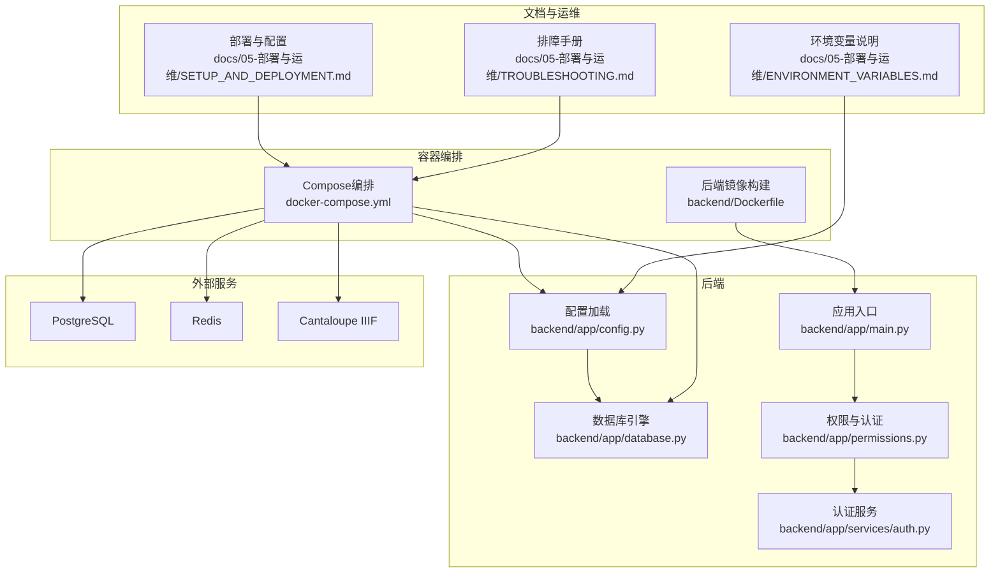
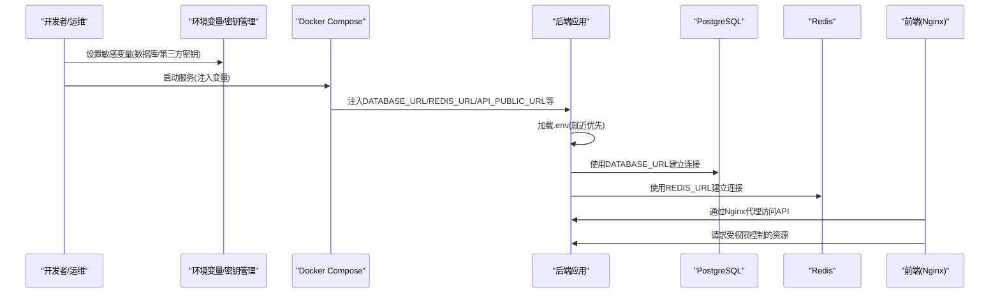
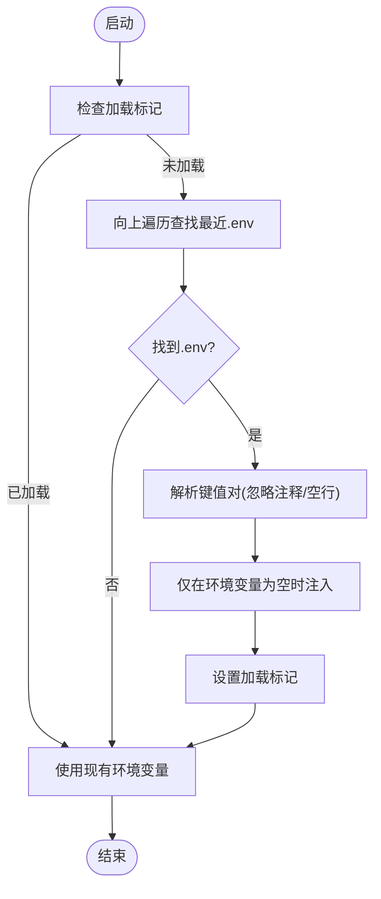
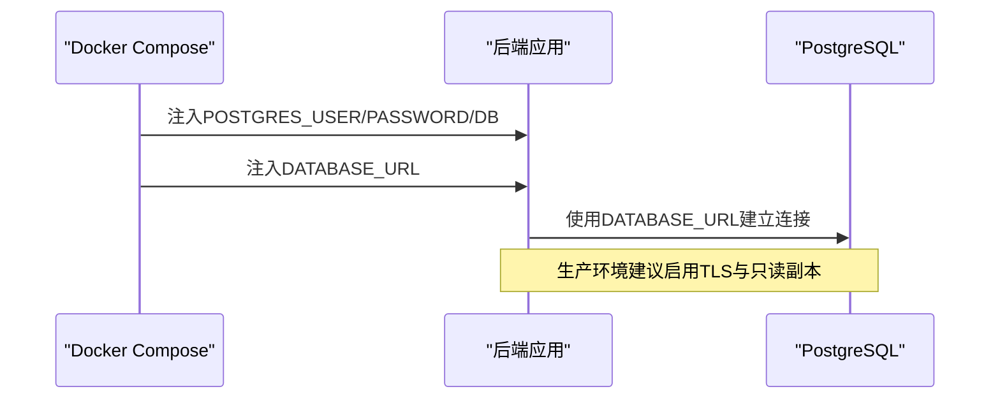
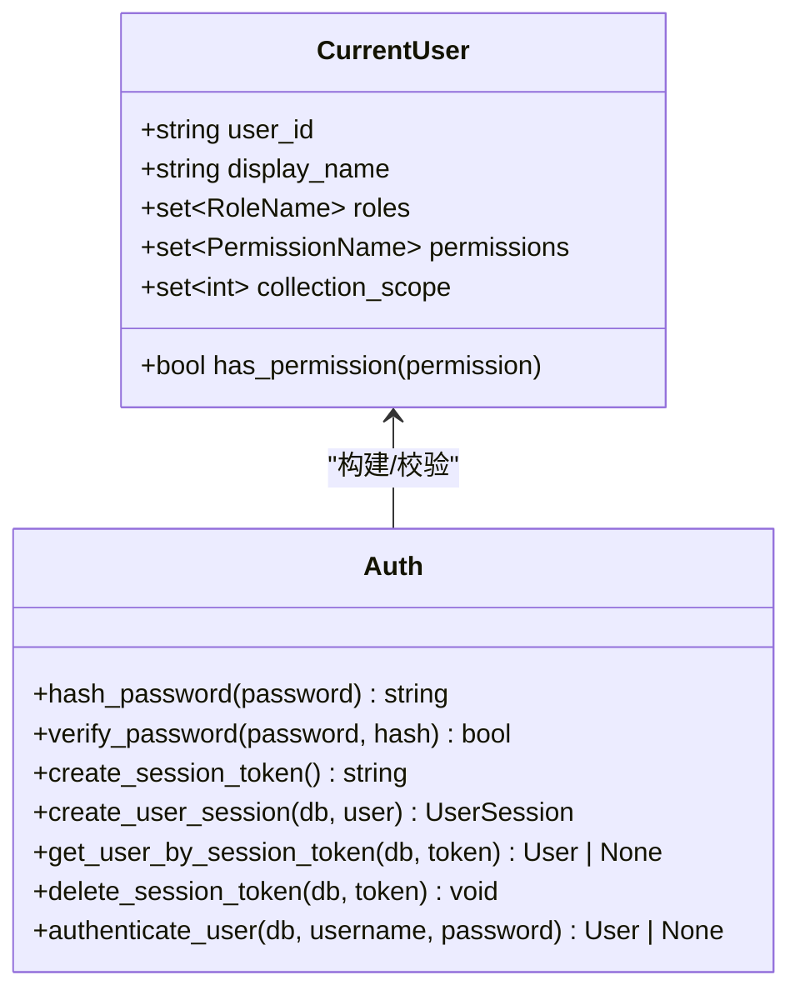
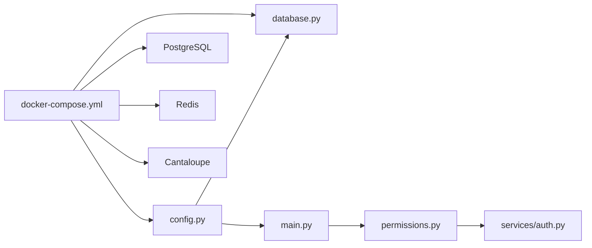

# 配置安全管理

<cite>
**本文引用的文件**
- [backend/app/config.py](file://backend/app/config.py)
- [backend/app/database.py](file://backend/app/database.py)
- [backend/app/main.py](file://backend/app/main.py)
- [backend/app/permissions.py](file://backend/app/permissions.py)
- [backend/app/services/auth.py](file://backend/app/services/auth.py)
- [backend/tests/test_config.py](file://backend/tests/test_config.py)
- [docker-compose.yml](file://docker-compose.yml)
- [backend/Dockerfile](file://backend/Dockerfile)
- [docs/05-部署与运维/ENVIRONMENT_VARIABLES.md](file://docs/05-部署与运维/ENVIRONMENT_VARIABLES.md)
- [docs/05-部署与运维/SETUP_AND_DEPLOYMENT.md](file://docs/05-部署与运维/SETUP_AND_DEPLOYMENT.md)
- [docs/05-部署与运维/TROUBLESHOOTING.md](file://docs/05-部署与运维/TROUBLESHOOTING.md)
- [docker-compose.local-postgres.yml](file://docker-compose.local-postgres.yml)
</cite>

## 目录
1. [简介](#简介)
2. [项目结构](#项目结构)
3. [核心组件](#核心组件)
4. [架构总览](#架构总览)
5. [详细组件分析](#详细组件分析)
6. [依赖分析](#依赖分析)
7. [性能考虑](#性能考虑)
8. [故障排查指南](#故障排查指南)
9. [结论](#结论)
10. [附录](#附录)

## 简介
本文件面向MDAMS原型项目的配置安全管理，围绕敏感配置信息（数据库密码、第三方API密钥、服务令牌等）的采集、存储、传输与访问控制进行系统化梳理，并结合现有代码与文档，提出可落地的安全实践与检查清单。重点覆盖：
- 环境变量与配置文件的安全管理
- 敏感信息的最小权限与访问控制
- 不同环境（开发/测试/生产）的安全差异
- 配置变更的审批、锁定与回滚策略
- 安全配置检查清单与常见漏洞防范

## 项目结构
本项目采用后端Python/FastAPI + 前端Nginx/React + 数据库PostgreSQL + 缓存Redis + IIIF服务Cantaloupe的容器化架构。配置安全的关键落点包括：
- 后端配置加载与环境变量注入
- Docker Compose服务间变量传递
- 权限与认证体系
- 静态与动态配置的分离

图表来源
- [backend/app/config.py:1-72](file://backend/app/config.py#L1-L72)
- [backend/app/database.py:1-17](file://backend/app/database.py#L1-L17)
- [backend/app/main.py:1-86](file://backend/app/main.py#L1-L86)
- [backend/app/permissions.py:1-255](file://backend/app/permissions.py#L1-L255)
- [backend/app/services/auth.py:1-143](file://backend/app/services/auth.py#L1-L143)
- [docker-compose.yml:1-131](file://docker-compose.yml#L1-L131)
- [backend/Dockerfile:1-52](file://backend/Dockerfile#L1-L52)
- [docs/05-部署与运维/ENVIRONMENT_VARIABLES.md:1-86](file://docs/05-部署与运维/ENVIRONMENT_VARIABLES.md#L1-L86)
- [docs/05-部署与运维/SETUP_AND_DEPLOYMENT.md:1-253](file://docs/05-部署与运维/SETUP_AND_DEPLOYMENT.md#L1-L253)
- [docs/05-部署与运维/TROUBLESHOOTING.md:1-242](file://docs/05-部署与运维/TROUBLESHOOTING.md#L1-L242)

章节来源
- [backend/app/config.py:1-72](file://backend/app/config.py#L1-L72)
- [docker-compose.yml:1-131](file://docker-compose.yml#L1-L131)
- [docs/05-部署与运维/ENVIRONMENT_VARIABLES.md:1-86](file://docs/05-部署与运维/ENVIRONMENT_VARIABLES.md#L1-L86)
- [docs/05-部署与运维/SETUP_AND_DEPLOYMENT.md:1-253](file://docs/05-部署与运维/SETUP_AND_DEPLOYMENT.md#L1-L253)

## 核心组件
- 配置加载与环境变量注入
  - 后端通过自研轻量.env加载逻辑，按就近父目录优先原则合并环境变量，避免重复覆盖，确保敏感配置集中于宿主机或CI变量。
  - 关键敏感项：数据库连接串、第三方API密钥、服务间通信URL等均来自环境变量。
- 数据库连接与凭证
  - 数据库引擎基于配置中的连接串创建；PostgreSQL容器凭环境变量初始化用户、密码与数据库名。
- 权限与认证
  - 基于会话令牌的认证与细粒度权限矩阵，配合最小权限原则与集合作用域控制资源可见性。
- 容器化与网络
  - 通过Compose统一注入变量，限制容器间直接暴露端口，前端Nginx统一代理API与IIIF服务，降低敏感信息泄露面。

章节来源
- [backend/app/config.py:1-72](file://backend/app/config.py#L1-L72)
- [backend/app/database.py:1-17](file://backend/app/database.py#L1-L17)
- [backend/app/permissions.py:1-255](file://backend/app/permissions.py#L1-L255)
- [backend/app/services/auth.py:1-143](file://backend/app/services/auth.py#L1-L143)
- [docker-compose.yml:1-131](file://docker-compose.yml#L1-L131)

## 架构总览
下图展示配置与安全相关的关键交互：后端从环境变量加载配置，数据库与缓存由Compose注入连接参数，认证与权限在后端内部实现，前端通过Nginx代理访问后端与IIIF服务。

图表来源
- [backend/app/config.py:1-72](file://backend/app/config.py#L1-L72)
- [docker-compose.yml:1-131](file://docker-compose.yml#L1-L131)
- [docs/05-部署与运维/SETUP_AND_DEPLOYMENT.md:1-253](file://docs/05-部署与运维/SETUP_AND_DEPLOYMENT.md#L1-L253)

## 详细组件分析

### 配置加载与环境变量安全
- 加载策略
  - 自研.env加载函数按最近父目录优先合并变量，避免误覆盖；通过标记位防止重复加载。
  - 仅在环境变量为空时才注入，保证上层传参（如Compose）优先级更高。
- 敏感信息采集
  - 数据库连接串、Redis连接串、AI服务密钥、公开URL等均来自环境变量。
  - 对AI兼容变量（OpenAI/Moonshot）提供回退策略，减少重复配置。
- 测试与验证
  - 单测验证.env就近优先与加载标记行为，确保配置一致性。

图表来源
- [backend/app/config.py:5-37](file://backend/app/config.py#L5-L37)
- [backend/tests/test_config.py:6-35](file://backend/tests/test_config.py#L6-L35)

章节来源
- [backend/app/config.py:1-72](file://backend/app/config.py#L1-L72)
- [backend/tests/test_config.py:1-36](file://backend/tests/test_config.py#L1-L36)

### 数据库连接与凭证安全
- 连接串来源
  - 后端数据库引擎直接使用配置中的连接串；Compose通过环境变量注入数据库凭证。
- 容器化安全
  - 数据库端口默认仅在容器网络内可达，避免直接暴露宿主机端口。
- 本地测试
  - 提供独立本地PostgreSQL服务脚本，便于测试但不建议在生产使用。

图表来源
- [docker-compose.yml:88-97](file://docker-compose.yml#L88-L97)
- [backend/app/database.py:1-17](file://backend/app/database.py#L1-L17)
- [docker-compose.local-postgres.yml:1-18](file://docker-compose.local-postgres.yml#L1-L18)

章节来源
- [backend/app/database.py:1-17](file://backend/app/database.py#L1-L17)
- [docker-compose.yml:88-97](file://docker-compose.yml#L88-L97)
- [docker-compose.local-postgres.yml:1-18](file://docker-compose.local-postgres.yml#L1-L18)

### 权限与认证安全
- 会话与令牌
  - 使用安全随机令牌，带过期时间；会话过期后自动失效。
- 权限矩阵
  - 基于角色的权限集合，支持最小权限与集合作用域控制资源可见性。
- 认证入口
  - 支持多种认证头/Cookie，统一解析为当前用户上下文，缺失时拒绝访问。

图表来源
- [backend/app/permissions.py:102-207](file://backend/app/permissions.py#L102-L207)
- [backend/app/services/auth.py:44-143](file://backend/app/services/auth.py#L44-L143)

章节来源
- [backend/app/permissions.py:1-255](file://backend/app/permissions.py#L1-L255)
- [backend/app/services/auth.py:1-143](file://backend/app/services/auth.py#L1-L143)

### 容器化与网络边界
- 变量注入
  - Compose将敏感变量注入后端与worker，避免硬编码在镜像中。
- 端口与代理
  - 后端与Cantaloupe端口通过Nginx代理对外暴露，减少直接端口暴露风险。
- 构建与依赖
  - 后端镜像构建使用国内镜像源提升可靠性，同时放宽部分图像处理安全策略以适配大图场景。

章节来源
- [docker-compose.yml:1-131](file://docker-compose.yml#L1-L131)
- [backend/Dockerfile:1-52](file://backend/Dockerfile#L1-L52)

## 依赖分析
- 组件耦合
  - 配置模块与数据库模块强耦合（连接串），与权限/认证模块弱耦合（仅间接影响访问控制）。
- 外部依赖
  - PostgreSQL、Redis、Cantaloupe均为外部服务，通过环境变量与Compose进行解耦。
- 潜在风险
  - 若.env或CI变量未清理，可能造成配置泄漏；需确保变量注入路径可控且最小化。

图表来源
- [backend/app/config.py:1-72](file://backend/app/config.py#L1-L72)
- [backend/app/database.py:1-17](file://backend/app/database.py#L1-L17)
- [backend/app/main.py:1-86](file://backend/app/main.py#L1-L86)
- [backend/app/permissions.py:1-255](file://backend/app/permissions.py#L1-L255)
- [backend/app/services/auth.py:1-143](file://backend/app/services/auth.py#L1-L143)
- [docker-compose.yml:1-131](file://docker-compose.yml#L1-L131)

章节来源
- [backend/app/config.py:1-72](file://backend/app/config.py#L1-L72)
- [backend/app/database.py:1-17](file://backend/app/database.py#L1-L17)
- [docker-compose.yml:1-131](file://docker-compose.yml#L1-L131)

## 性能考虑
- 环境变量注入与加载
  - 采用就近优先策略，避免深层目录污染；建议在CI中集中注入变量，减少容器内文件IO。
- 数据库与缓存
  - 连接串与超时参数可通过环境变量调整；生产建议开启连接池与TLS。
- 图像处理
  - 通过JVM与libvips参数优化内存与并发，避免大图处理导致的资源争用。

## 故障排查指南
- 启动与健康检查
  - 按文档建议顺序排查：Compose状态、健康/就绪检查、日志定位。
- 数据库与Redis
  - 检查容器状态、端口占用与连接串；本地测试可使用独立PostgreSQL服务脚本。
- 前端与代理
  - 确认Nginx代理规则与公开URL配置；IIIF地址与Manifest生成需保持一致。
- 权限与认证
  - 检查会话令牌有效性与角色权限；必要时重建会话并刷新前端上下文。

章节来源
- [docs/05-部署与运维/TROUBLESHOOTING.md:1-242](file://docs/05-部署与运维/TROUBLESHOOTING.md#L1-L242)
- [docs/05-部署与运维/SETUP_AND_DEPLOYMENT.md:1-253](file://docs/05-部署与运维/SETUP_AND_DEPLOYMENT.md#L1-L253)

## 结论
本项目在配置安全方面已形成“变量集中、就近加载、最小暴露”的基础框架。建议在现有基础上补充：
- 引入密钥管理服务（KMS/HashiCorp Vault）与配置加密存储
- 在CI/CD中实施配置变更审批与锁定机制
- 明确不同环境的安全基线与强制审计
- 强化容器镜像与运行时最小权限

## 附录

### 不同环境的安全配置差异
- 开发环境
  - 优先使用本地.env与Compose变量；允许简化网络与日志；默认公开URL指向本地代理。
- 测试环境
  - 使用独立测试数据库连接串；最小化暴露端口；启用更严格的日志级别。
- 生产环境
  - 所有敏感变量必须来自密钥管理服务；启用TLS、只读副本与审计日志；严格限制容器网络与端口暴露。

章节来源
- [docs/05-部署与运维/ENVIRONMENT_VARIABLES.md:1-86](file://docs/05-部署与运维/ENVIRONMENT_VARIABLES.md#L1-L86)
- [docs/05-部署与运维/SETUP_AND_DEPLOYMENT.md:1-253](file://docs/05-部署与运维/SETUP_AND_DEPLOYMENT.md#L1-L253)

### 配置变更的安全控制
- 变更审批
  - 所有敏感变量变更需双人复核并在CI中记录。
- 锁定机制
  - 对关键变量（数据库、第三方密钥）实施只读锁定，禁止在运行时修改。
- 回滚策略
  - 变更前备份当前配置快照；回滚时恢复到上一个已批准版本。

### 安全配置检查清单
- 环境变量
  - [ ] 所有敏感变量来自密钥管理服务或CI变量
  - [ ] .env不在仓库中提交；仅用于本地开发
  - [ ] 变量注入路径明确且最小化
- 认证与授权
  - [ ] 会话令牌安全随机生成，过期时间合理
  - [ ] 权限矩阵覆盖所有业务场景，遵循最小权限
  - [ ] 集合作用域与资源可见性一致
- 网络与代理
  - [ ] 后端与IIIF通过Nginx统一代理
  - [ ] 数据库与缓存端口仅在容器网络内可达
- 审计与日志
  - [ ] 关键配置变更记录在CI流水线
  - [ ] 生产环境开启访问与错误审计日志

### 常见安全漏洞与防范
- 配置泄漏
  - 防范：禁用提交.env；使用CI变量注入；定期扫描仓库历史。
- 会话劫持
  - 防范：短会话周期；HTTPS；安全Cookie属性。
- 权限滥用
  - 防范：最小权限；定期权限审查；集合作用域校验。
- 端口暴露
  - 防范：仅代理必要端口；容器网络隔离；防火墙策略。