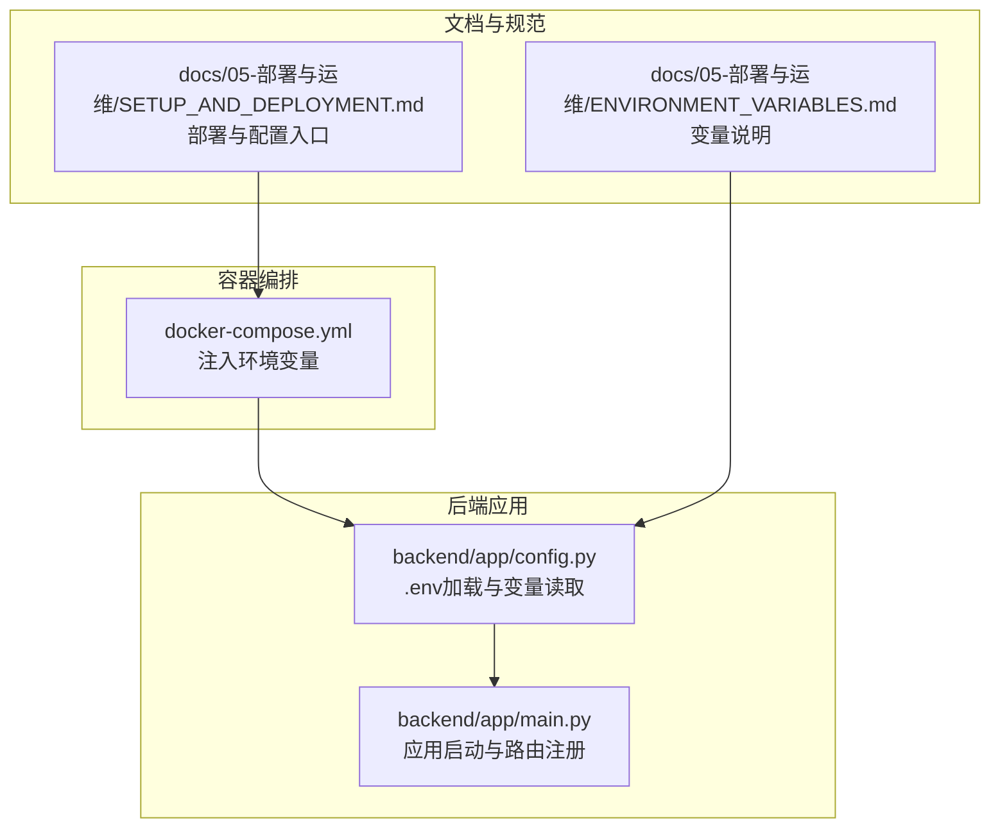
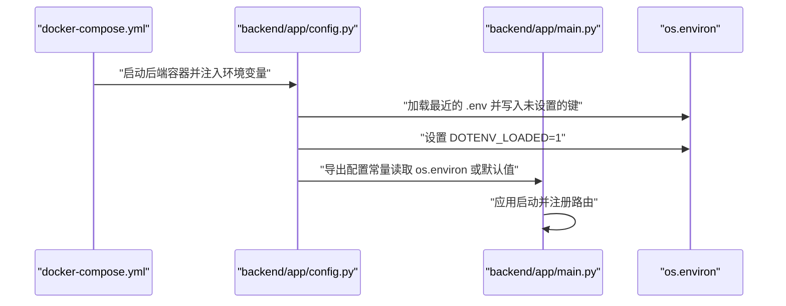
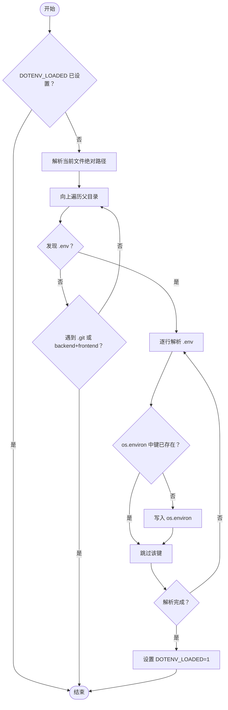
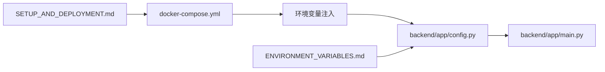

# 配置文件层次结构

<cite>
**本文引用的文件**
- [backend/app/config.py](file://backend/app/config.py)
- [backend/tests/test_config.py](file://backend/tests/test_config.py)
- [docs/05-部署与运维/ENVIRONMENT_VARIABLES.md](file://docs/05-部署与运维/ENVIRONMENT_VARIABLES.md)
- [docs/05-部署与运维/SETUP_AND_DEPLOYMENT.md](file://docs/05-部署与运维/SETUP_AND_DEPLOYMENT.md)
- [docker-compose.yml](file://docker-compose.yml)
- [backend/app/main.py](file://backend/app/main.py)
- [pytest.ini](file://pytest.ini)
</cite>

## 目录
1. [引言](#引言)
2. [项目结构](#项目结构)
3. [核心组件](#核心组件)
4. [架构总览](#架构总览)
5. [详细组件分析](#详细组件分析)
6. [依赖分析](#依赖分析)
7. [性能考虑](#性能考虑)
8. [故障排查指南](#故障排查指南)
9. [结论](#结论)
10. [附录](#附录)

## 引言
本文件面向MDAMS原型项目的配置文件层次结构，系统性阐述配置来源、加载顺序、解析规则、优先级策略与最佳实践。重点覆盖：
- .env文件的加载机制与搜索路径算法
- 解析规则（忽略注释与空行、键值对格式）
- 环境变量覆盖优先级与回退策略
- 配置继承与合并策略（默认值、环境变量优先级、冲突解决）
- 不同环境的配置分离策略（开发、测试、生产）
- 敏感信息保护、配置模板化与版本控制建议
- 结合仓库现有文件给出具体示例与加载过程演示

## 项目结构
本项目采用“容器内环境变量 + 本地 .env”的双层配置模式：
- 顶层通过 docker-compose.yml 注入环境变量到各容器
- 应用启动时在Python模块初始化阶段加载最近的 .env 文件
- 应用通过 os.getenv 读取变量，支持默认值与回退逻辑

图表来源
- [docker-compose.yml:1-131](file://docker-compose.yml#L1-L131)
- [backend/app/config.py:1-72](file://backend/app/config.py#L1-L72)
- [backend/app/main.py:1-86](file://backend/app/main.py#L1-L86)
- [docs/05-部署与运维/ENVIRONMENT_VARIABLES.md:1-86](file://docs/05-部署与运维/ENVIRONMENT_VARIABLES.md#L1-L86)
- [docs/05-部署与运维/SETUP_AND_DEPLOYMENT.md:1-253](file://docs/05-部署与运维/SETUP_AND_DEPLOYMENT.md#L1-L253)

章节来源
- [docker-compose.yml:1-131](file://docker-compose.yml#L1-L131)
- [backend/app/config.py:1-72](file://backend/app/config.py#L1-L72)
- [docs/05-部署与运维/SETUP_AND_DEPLOYMENT.md:1-253](file://docs/05-部署与运维/SETUP_AND_DEPLOYMENT.md#L1-L253)

## 核心组件
- .env加载器：在模块导入时执行，向外遍历目录寻找最近的 .env 文件，逐行解析并写入 os.environ（若未被设置），并标记 DOTENV_LOADED 防止重复加载。
- 变量读取与回退：通过 os.getenv 读取变量，提供默认值；对部分AI相关变量实现“OpenAI兼容回退”策略（优先Moonshot，再回退到OpenAI兼容变量）。
- 容器注入：docker-compose.yml 将变量注入到 backend、celery_worker、cantaloupe、db 等服务。

章节来源
- [backend/app/config.py:5-37](file://backend/app/config.py#L5-L37)
- [backend/app/config.py:42-72](file://backend/app/config.py#L42-L72)
- [docker-compose.yml:8-29](file://docker-compose.yml#L8-L29)

## 架构总览
下图展示从启动到配置生效的关键流程：容器编排注入变量 → Python模块初始化加载 .env → 应用读取环境变量。

图表来源
- [docker-compose.yml:1-131](file://docker-compose.yml#L1-L131)
- [backend/app/config.py:1-72](file://backend/app/config.py#L1-L72)
- [backend/app/main.py:1-86](file://backend/app/main.py#L1-L86)

## 详细组件分析

### .env加载机制与搜索路径算法
- 加载时机：模块导入时自动执行，确保在应用其他逻辑之前完成。
- 搜索路径：从当前文件所在目录向外逐级向上遍历父目录，直到遇到 .git 目录或同时存在 backend 与 frontend 的目录为止；若在某层级找到 .env，则停止向上。
- 解析规则：
  - 忽略空行与以 # 开头的注释行
  - 跳过不含 = 的行
  - 键值对按第一个 = 分割，去除首尾空白，去除引号包裹的值（单引号或双引号）
  - 仅当 os.environ 中该键为空或不存在时才写入，保证容器注入的变量优先级更高
  - 成功加载后设置 DOTENV_LOADED=1，防止后续重复加载

图表来源
- [backend/app/config.py:5-37](file://backend/app/config.py#L5-L37)

章节来源
- [backend/app/config.py:5-37](file://backend/app/config.py#L5-L37)
- [backend/tests/test_config.py:6-35](file://backend/tests/test_config.py#L6-L35)

### 解析规则与优先级策略
- 行为规则
  - 忽略空行与注释行（以 # 开头）
  - 跳过不含 = 的行
  - 键值对按第一个 = 分割，去除首尾空白，去除引号包裹的值
- 优先级
  - 容器注入的环境变量优先于 .env 中的同名变量
  - DOTENV_LOADED=1 防止重复加载
- 回退策略
  - 对AI相关变量提供“OpenAI兼容回退”：若未显式设置 OPENAI_*，则回退到 MOONSHOT_* 的值

章节来源
- [backend/app/config.py:20-28](file://backend/app/config.py#L20-L28)
- [backend/app/config.py:55-57](file://backend/app/config.py#L55-L57)

### 配置继承与合并策略
- 默认值：所有变量均通过 os.getenv 提供默认值，确保在缺少环境变量时仍可运行
- 环境变量优先：容器注入的变量优先于 .env
- 冲突解决：.env 仅在 os.environ 中对应键未设置或为空时才写入
- 继承示例：OPENAI_* 变量回退到 MOONSHOT_*，从而在未显式配置时仍可使用兼容的默认值

章节来源
- [backend/app/config.py:42-72](file://backend/app/config.py#L42-L72)

### 不同环境的配置分离策略
- 开发环境：优先修改 .env，保持 docker-compose.yml 不变，便于本地快速迭代
- 测试环境：可通过 TEST_DATABASE_URL 等变量区分测试库连接串
- 生产环境：通过容器编排注入变量，避免将敏感信息提交到版本库

章节来源
- [docs/05-部署与运维/ENVIRONMENT_VARIABLES.md:10-18](file://docs/05-部署与运维/ENVIRONMENT_VARIABLES.md#L10-L18)
- [docs/05-部署与运维/SETUP_AND_DEPLOYMENT.md:111-151](file://docs/05-部署与运维/SETUP_AND_DEPLOYMENT.md#L111-L151)

### 配置文件示例与加载过程演示
- 示例变量（来自文档与配置文件）：
  - 数据库：POSTGRES_USER、POSTGRES_PASSWORD、POSTGRES_DB、DATABASE_URL、TEST_DATABASE_URL
  - 缓存：REDIS_URL
  - 公共URL：API_PUBLIC_URL、CANTALOUPE_PUBLIC_URL
  - AI相关：MOONSHOT_*、OPENAI_*、OPENAI_TIMEOUT_SECONDS
  - 文件路径：HOST_MUSEUM_PATH、UPLOAD_DIR
  - 图像处理：VIPS_DISC_THRESHOLD、VIPS_CONCURRENCY、JAVA_OPTS
  - 端口：FRONTEND_PORT、BACKEND_PORT、DB_PORT、REDIS_PORT、CANTALOUPE_PORT
- 加载过程演示（基于测试用例）：
  - 在测试中，将 .env 放置在 repo 根、backend 目录与临时目录，验证“最近优先”的加载行为
  - 通过断言确认：最接近目标文件的 .env 中的键优先于更外层的同名键

章节来源
- [docs/05-部署与运维/ENVIRONMENT_VARIABLES.md:10-86](file://docs/05-部署与运维/ENVIRONMENT_VARIABLES.md#L10-L86)
- [backend/tests/test_config.py:6-35](file://backend/tests/test_config.py#L6-L35)

## 依赖分析
- docker-compose.yml 将变量注入到 backend、celery_worker、cantaloupe、db 等服务
- backend/app/config.py 依赖 os 与 pathlib，负责 .env 加载与变量读取
- backend/app/main.py 依赖数据库初始化与路由注册，间接依赖 config 中的变量

图表来源
- [docker-compose.yml:1-131](file://docker-compose.yml#L1-L131)
- [backend/app/config.py:1-72](file://backend/app/config.py#L1-L72)
- [backend/app/main.py:1-86](file://backend/app/main.py#L1-L86)
- [docs/05-部署与运维/ENVIRONMENT_VARIABLES.md:1-86](file://docs/05-部署与运维/ENVIRONMENT_VARIABLES.md#L1-L86)
- [docs/05-部署与运维/SETUP_AND_DEPLOYMENT.md:1-253](file://docs/05-部署与运维/SETUP_AND_DEPLOYMENT.md#L1-L253)

章节来源
- [docker-compose.yml:1-131](file://docker-compose.yml#L1-L131)
- [backend/app/config.py:1-72](file://backend/app/config.py#L1-L72)
- [backend/app/main.py:1-86](file://backend/app/main.py#L1-L86)

## 性能考虑
- .env解析为一次性操作，仅在模块导入时执行，对启动时间影响极小
- 通过 DOTENV_LOADED 防止重复加载，避免不必要的IO与解析
- 容器注入变量减少Python层的字符串拼接与转换成本

## 故障排查指南
- .env未生效
  - 检查是否设置了 DOTENV_LOADED=1（重复加载保护）
  - 确认 .env 文件路径是否在目标文件的最近父目录范围内
  - 排查是否存在 .git 或 backend+frontend 目录导致提前终止遍历
- 变量被覆盖
  - 确认容器注入的变量是否在 docker-compose.yml 中正确设置
  - 检查 .env 中的键是否与容器注入的同名变量冲突
- AI相关变量未生效
  - 若未显式设置 OPENAI_*，请确认 MOONSHOT_* 是否已正确设置
- 测试库连接串
  - 使用 TEST_DATABASE_URL 区分主机侧测试库连接串

章节来源
- [backend/app/config.py:5-37](file://backend/app/config.py#L5-L37)
- [docs/05-部署与运维/ENVIRONMENT_VARIABLES.md:10-18](file://docs/05-部署与运维/ENVIRONMENT_VARIABLES.md#L10-L18)
- [docs/05-部署与运维/SETUP_AND_DEPLOYMENT.md:111-151](file://docs/05-部署与运维/SETUP_AND_DEPLOYMENT.md#L111-L151)

## 结论
本项目的配置体系以“容器注入 + 本地 .env”为核心，通过明确的加载顺序与优先级策略，实现了灵活且可控的配置管理。.env加载器采用“最近优先”的搜索路径与严格的解析规则，配合容器注入的高优先级，确保开发与生产环境的一致性与安全性。建议在日常开发中优先修改 .env，避免频繁改动 docker-compose.yml，并遵循敏感信息保护与版本控制最佳实践。

## 附录
- 最佳实践
  - 敏感信息保护：不在版本库中提交 .env；使用 .gitignore 屏蔽
  - 配置模板化：保留 .env.example 作为模板，随仓库更新同步字段
  - 版本控制：仅提交必要的配置模板与文档，不提交运行时私有配置
  - 环境分离：通过 TEST_DATABASE_URL 等变量区分测试环境；生产环境通过容器注入变量
- 相关文件
  - 变量说明：[ENVIRONMENT_VARIABLES.md](file://docs/05-部署与运维/ENVIRONMENT_VARIABLES.md)
  - 部署与配置入口：[SETUP_AND_DEPLOYMENT.md](file://docs/05-部署与运维/SETUP_AND_DEPLOYMENT.md)
  - 容器编排：[docker-compose.yml](file://docker-compose.yml)
  - 配置加载与变量读取：[backend/app/config.py](file://backend/app/config.py)
  - 应用启动与路由注册：[backend/app/main.py](file://backend/app/main.py)
  - 测试用例（验证 .env 加载顺序）：[backend/tests/test_config.py](file://backend/tests/test_config.py)
  - 测试标记配置：[pytest.ini](file://pytest.ini)