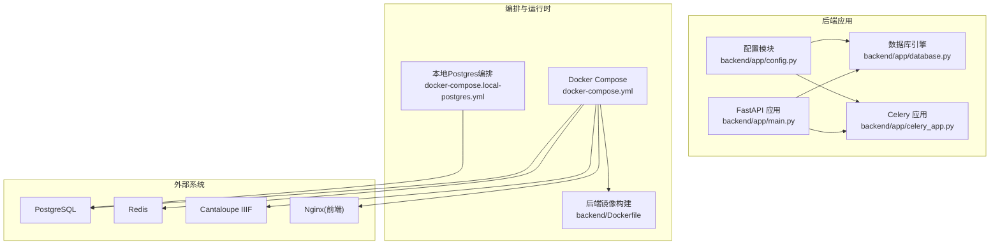
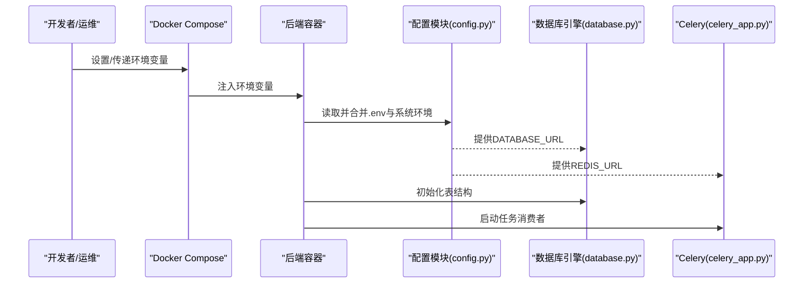
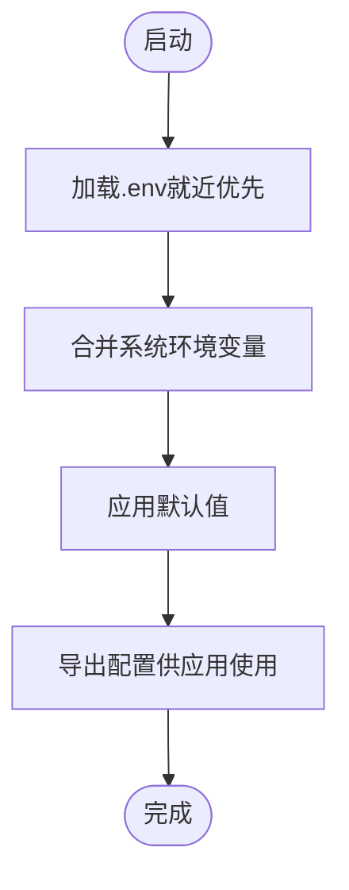
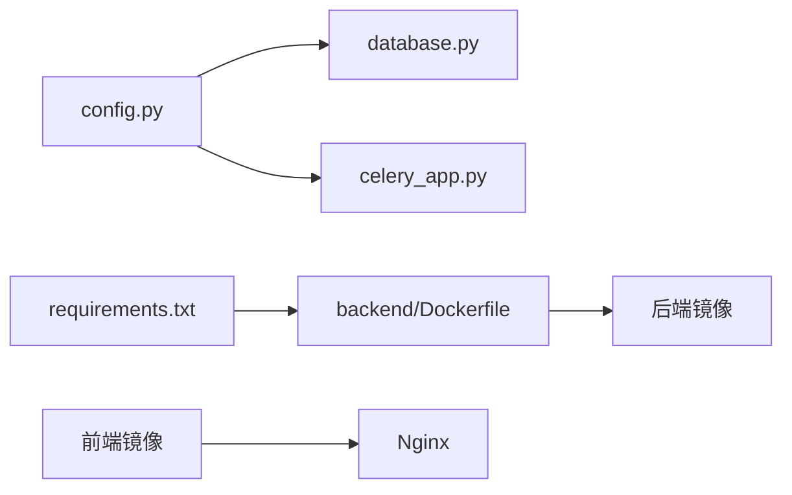

# 配置管理

<cite>
**本文引用的文件**
- [backend/app/config.py](file://backend/app/config.py)
- [backend/app/database.py](file://backend/app/database.py)
- [backend/app/celery_app.py](file://backend/app/celery_app.py)
- [backend/app/main.py](file://backend/app/main.py)
- [backend/Dockerfile](file://backend/Dockerfile)
- [backend/requirements.txt](file://backend/requirements.txt)
- [backend/tests/test_config.py](file://backend/tests/test_config.py)
- [docker-compose.yml](file://docker-compose.yml)
- [docker-compose.local-postgres.yml](file://docker-compose.local-postgres.yml)
- [docs/05-部署与运维/ENVIRONMENT_VARIABLES.md](file://docs/05-部署与运维/ENVIRONMENT_VARIABLES.md)
- [docs/04-实施方案/CONFIG_REFACTOR_PLAN.md](file://docs/04-实施方案/CONFIG_REFACTOR_PLAN.md)
</cite>

## 目录
1. [简介](#简介)
2. [项目结构](#项目结构)
3. [核心组件](#核心组件)
4. [架构总览](#架构总览)
5. [详细组件分析](#详细组件分析)
6. [依赖分析](#依赖分析)
7. [性能考虑](#性能考虑)
8. [故障排查指南](#故障排查指南)
9. [结论](#结论)
10. [附录](#附录)

## 简介
本文件面向MDAMS原型项目的配置管理，系统性阐述环境变量配置、Docker编排、配置层次结构、安全管理、动态更新与热重载、多环境差异与切换策略、配置验证与错误处理，以及最佳实践与示例。目标是帮助开发者与运维人员在不同环境下一致地部署与维护系统。

## 项目结构
- 后端通过独立的配置模块集中读取环境变量，数据库与任务队列均基于该配置模块提供的连接参数运行。
- Docker Compose定义了后端、前端、数据库、Redis、Cantaloupe等服务及其网络、卷挂载、环境变量传递。
- 文档提供了环境变量清单、默认值与使用建议，确保配置一致性与可追溯性。

图表来源
- [backend/app/config.py:1-72](file://backend/app/config.py#L1-L72)
- [backend/app/database.py:1-17](file://backend/app/database.py#L1-L17)
- [backend/app/celery_app.py:1-19](file://backend/app/celery_app.py#L1-L19)
- [backend/app/main.py:1-86](file://backend/app/main.py#L1-L86)
- [docker-compose.yml:1-131](file://docker-compose.yml#L1-L131)
- [docker-compose.local-postgres.yml:1-19](file://docker-compose.local-postgres.yml#L1-L19)
- [backend/Dockerfile:1-52](file://backend/Dockerfile#L1-L52)

章节来源
- [backend/app/config.py:1-72](file://backend/app/config.py#L1-L72)
- [docker-compose.yml:1-131](file://docker-compose.yml#L1-L131)
- [docs/05-部署与运维/ENVIRONMENT_VARIABLES.md:1-86](file://docs/05-部署与运维/ENVIRONMENT_VARIABLES.md#L1-L86)

## 核心组件
- 环境变量加载与默认值
  - 后端通过内置函数按“就近优先”的原则从最近的父级目录加载.env文件，避免重复覆盖已存在的环境变量，且仅在未标记加载状态时执行一次。
  - 关键配置项包括数据库连接、Redis连接、上传目录、对外API与IIIF地址、AI提供商兼容参数、人脸识别开关与参数等。
- 数据库与任务队列
  - 数据库引擎与会话工厂从统一配置读取连接字符串；Celery从统一配置读取Redis作为消息中间件与结果后端。
- 应用启动
  - FastAPI应用在启动时初始化数据库表结构、CORS策略，并注册路由模块。

章节来源
- [backend/app/config.py:5-37](file://backend/app/config.py#L5-L37)
- [backend/app/config.py:42-72](file://backend/app/config.py#L42-L72)
- [backend/app/database.py:1-17](file://backend/app/database.py#L1-L17)
- [backend/app/celery_app.py:1-19](file://backend/app/celery_app.py#L1-L19)
- [backend/app/main.py:58-86](file://backend/app/main.py#L58-L86)

## 架构总览
下图展示配置在系统中的流向：Docker Compose将环境变量注入容器；后端配置模块读取这些变量并提供给数据库与任务队列；应用启动时使用这些配置完成初始化。

图表来源
- [docker-compose.yml:8-29](file://docker-compose.yml#L8-L29)
- [docker-compose.yml:42-57](file://docker-compose.yml#L42-L57)
- [backend/app/config.py:42-72](file://backend/app/config.py#L42-L72)
- [backend/app/database.py:6](file://backend/app/database.py#L6)
- [backend/app/celery_app.py:5-10](file://backend/app/celery_app.py#L5-L10)

## 详细组件分析

### 环境变量配置与管理
- 数据库
  - 通过DATABASE_URL或POSTGRES_USER/PASSWORD/DB组合连接数据库；测试环境可使用TEST_DATABASE_URL。
- 缓存与任务
  - REDIS_URL用于Celery与应用缓存；Celery结果过期时间已配置。
- 外部服务地址
  - API_PUBLIC_URL与CANTALOUPE_PUBLIC_URL用于生成公开链接与IIIF资源地址。
- 文件与存储
  - UPLOAD_DIR为容器内上传目录；HOST_MUSEUM_PATH为宿主机NAS挂载点，映射到容器内上传目录。
- AI与图像处理
  - OPENAI/MOONSHOT兼容参数用于外部模型调用；VIPS与JVM参数用于图像处理性能优化。
- 端口与代理
  - FRONTEND_PORT、BACKEND_PORT、DB_PORT、REDIS_PORT、CANTALOUPE_PORT用于各服务端口映射。

章节来源
- [docs/05-部署与运维/ENVIRONMENT_VARIABLES.md:10-81](file://docs/05-部署与运维/ENVIRONMENT_VARIABLES.md#L10-L81)
- [backend/app/config.py:42-72](file://backend/app/config.py#L42-L72)
- [docker-compose.yml:6-29](file://docker-compose.yml#L6-L29)
- [docker-compose.yml:42-57](file://docker-compose.yml#L42-L57)

### Docker编排配置
- 服务定义
  - 后端与Celery Worker共享后端镜像与构建上下文，分别通过不同命令启动。
  - 前端使用Nginx镜像，挂载构建产物与配置文件。
  - 数据库使用PostgreSQL镜像，持久化数据卷。
  - IIIF服务Cantaloupe本地构建，挂载图像源与配置文件。
- 网络与端口
  - 各服务端口通过环境变量映射到宿主机，便于多环境切换。
- 卷挂载
  - 上传目录与图像目录均挂载宿主机路径，保证数据持久化与共享。
- 环境变量传递
  - 所有服务均从Compose顶层environment接收变量，确保配置一致。
- 健康检查
  - 当前编排未定义健康检查探针，建议在生产环境补充。

章节来源
- [docker-compose.yml:1-131](file://docker-compose.yml#L1-L131)
- [docker-compose.local-postgres.yml:1-19](file://docker-compose.local-postgres.yml#L1-L19)
- [backend/Dockerfile:1-52](file://backend/Dockerfile#L1-L52)
- [frontend/Dockerfile:1-28](file://frontend/Dockerfile#L1-L28)

### 配置层次结构
- 默认配置
  - 在配置模块中为关键变量提供合理默认值，确保最小可用配置。
- 环境特定配置
  - 通过Docker Compose的environment与.vagrant或宿主机环境覆盖默认值。
- 用户自定义配置
  - 通过.env文件就近覆盖，遵循“最近优先”规则，避免全局污染。
- 验证与测试
  - 单元测试验证.env加载逻辑与优先级，确保配置合并行为符合预期。

图表来源
- [backend/app/config.py:5-37](file://backend/app/config.py#L5-L37)
- [backend/tests/test_config.py:6-36](file://backend/tests/test_config.py#L6-L36)

章节来源
- [backend/app/config.py:5-37](file://backend/app/config.py#L5-L37)
- [backend/tests/test_config.py:6-36](file://backend/tests/test_config.py#L6-L36)
- [docs/04-实施方案/CONFIG_REFACTOR_PLAN.md:10-14](file://docs/04-实施方案/CONFIG_REFACTOR_PLAN.md#L10-L14)

### 安全管理
- 敏感信息保护
  - 将密钥与密码置于环境变量中，避免硬编码于代码或镜像。
- 访问控制
  - 通过网络隔离与端口映射限制外部访问；前端通过Nginx代理统一入口。
- 密钥与证书
  - 建议在生产环境使用密钥管理服务或编排平台的密钥注入机制，不在仓库中提交敏感信息。
- 日志与审计
  - 生产环境开启结构化日志与审计记录，避免在日志中输出敏感配置。

章节来源
- [docs/05-部署与运维/ENVIRONMENT_VARIABLES.md:10-81](file://docs/05-部署与运维/ENVIRONMENT_VARIABLES.md#L10-L81)
- [docker-compose.yml:1-131](file://docker-compose.yml#L1-L131)

### 动态更新与热重载机制
- 后端应用
  - 当前未实现配置热重载；建议在需要时引入配置中心或信号触发重启。
- Celery
  - 任务消费者通常不支持热重载，建议通过编排平台滚动更新或重启容器。
- 前端
  - 构建时的静态配置在容器内固定；可通过重新构建镜像或挂载配置文件实现更新。

章节来源
- [backend/app/celery_app.py:1-19](file://backend/app/celery_app.py#L1-L19)
- [backend/Dockerfile:51](file://backend/Dockerfile#L51)

### 多环境差异与切换策略
- 开发环境
  - 使用本地Postgres替代Compose内置数据库，便于快速迭代；前端端口映射至3000。
- 测试环境
  - 使用独立测试数据库URL；CI中通过环境变量覆盖默认值。
- 生产环境
  - 使用强口令与密钥管理；启用更严格的JVM与libvips参数；限制容器权限与网络访问。

章节来源
- [docker-compose.local-postgres.yml:1-19](file://docker-compose.local-postgres.yml#L1-L19)
- [docs/05-部署与运维/ENVIRONMENT_VARIABLES.md:10-81](file://docs/05-部署与运维/ENVIRONMENT_VARIABLES.md#L10-L81)

### 配置验证与错误处理
- 加载验证
  - .env加载函数对注释、空行与格式进行过滤；若无法读取则回退到上层目录或终止搜索。
- 行为验证
  - 单元测试断言“最近优先”的加载顺序，确保配置合并正确。
- 错误处理
  - 数据库连接失败与Redis不可达会在启动阶段暴露；建议增加重试与降级策略。

章节来源
- [backend/app/config.py:5-37](file://backend/app/config.py#L5-L37)
- [backend/tests/test_config.py:6-36](file://backend/tests/test_config.py#L6-L36)

## 依赖分析
- 组件耦合
  - 数据库引擎与会话工厂依赖统一的DATABASE_URL；Celery依赖REDIS_URL。
- 外部依赖
  - 后端镜像安装libvips及相关工具以支撑图像处理；前端镜像使用Nginx提供静态服务。
- 潜在风险
  - 若环境变量缺失，将使用默认值；建议在CI中加入配置校验步骤。

图表来源
- [backend/app/config.py:42-72](file://backend/app/config.py#L42-L72)
- [backend/app/database.py:6](file://backend/app/database.py#L6)
- [backend/app/celery_app.py:5-10](file://backend/app/celery_app.py#L5-L10)
- [backend/requirements.txt:1-18](file://backend/requirements.txt#L1-L18)
- [backend/Dockerfile:1-52](file://backend/Dockerfile#L1-L52)

章节来源
- [backend/app/config.py:42-72](file://backend/app/config.py#L42-L72)
- [backend/app/database.py:1-17](file://backend/app/database.py#L1-L17)
- [backend/app/celery_app.py:1-19](file://backend/app/celery_app.py#L1-L19)
- [backend/requirements.txt:1-18](file://backend/requirements.txt#L1-L18)
- [backend/Dockerfile:1-52](file://backend/Dockerfile#L1-L52)

## 性能考虑
- 图像处理
  - 通过VIPS_DISC_THRESHOLD与VIPS_CONCURRENCY优化内存与并发；Cantaloupe使用JAVA_OPTS限制堆大小并注入熵源。
- 数据库
  - 本地SSD挂载提升I/O性能；容器内存限制避免资源争用。
- 前端
  - Node构建内存上限与Nginx静态分发减少运行时开销。

章节来源
- [docs/05-部署与运维/ENVIRONMENT_VARIABLES.md:57-64](file://docs/05-部署与运维/ENVIRONMENT_VARIABLES.md#L57-L64)
- [docker-compose.yml:98-127](file://docker-compose.yml#L98-L127)

## 故障排查指南
- 环境变量未生效
  - 检查是否被更高优先级的环境覆盖；确认.DOTENV_LOADED标志未阻止重复加载。
- 数据库连接失败
  - 校验DATABASE_URL或POSTGRES_*变量；确认容器网络可达与凭据正确。
- Redis不可达
  - 校验REDIS_URL；确认Redis服务已启动且端口映射正确。
- 上传目录为空
  - 检查HOST_MUSEUM_PATH与UPLOAD_DIR映射是否一致；确认挂载权限。
- 前端无法访问
  - 检查FRONTEND_PORT映射与Nginx配置；确认后端与Cantaloupe健康状态。

章节来源
- [backend/app/config.py:5-37](file://backend/app/config.py#L5-L37)
- [docker-compose.yml:6-29](file://docker-compose.yml#L6-L29)
- [docker-compose.yml:76-82](file://docker-compose.yml#L76-L82)

## 结论
本项目采用“就近.env + 系统环境变量 + 默认值”的三层配置策略，配合Docker Compose实现跨环境一致部署。建议在生产环境完善健康检查、密钥管理与配置热重载机制，持续提升安全性与可维护性。

## 附录
- 环境变量清单与默认值参见部署运维文档。
- 配置重构原则与使用建议参见实施方案文档。

章节来源
- [docs/05-部署与运维/ENVIRONMENT_VARIABLES.md:1-86](file://docs/05-部署与运维/ENVIRONMENT_VARIABLES.md#L1-L86)
- [docs/04-实施方案/CONFIG_REFACTOR_PLAN.md:1-15](file://docs/04-实施方案/CONFIG_REFACTOR_PLAN.md#L1-L15)