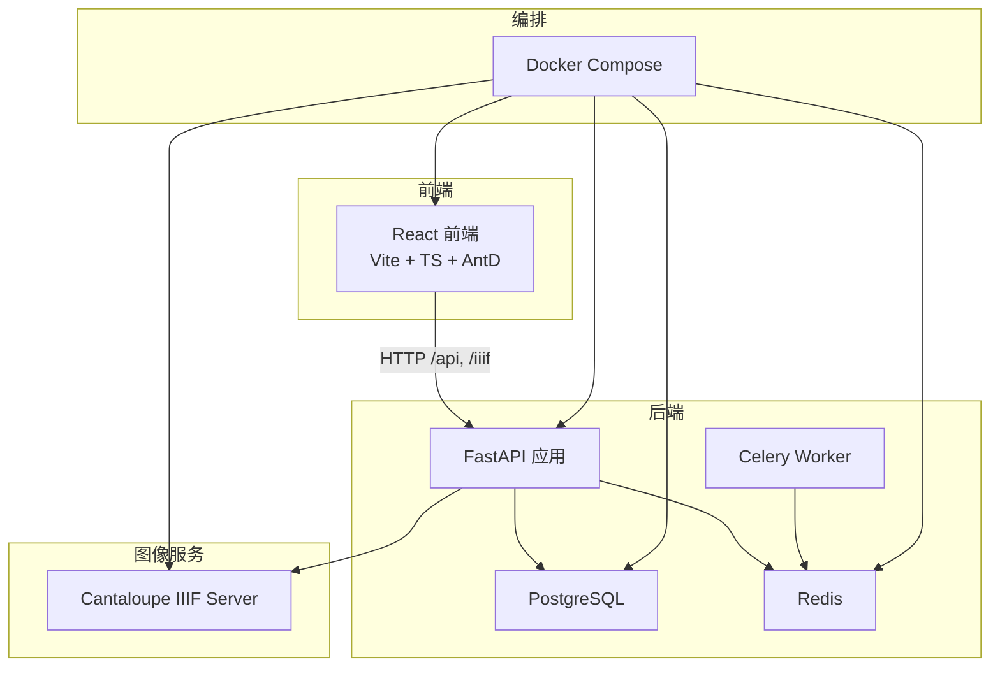
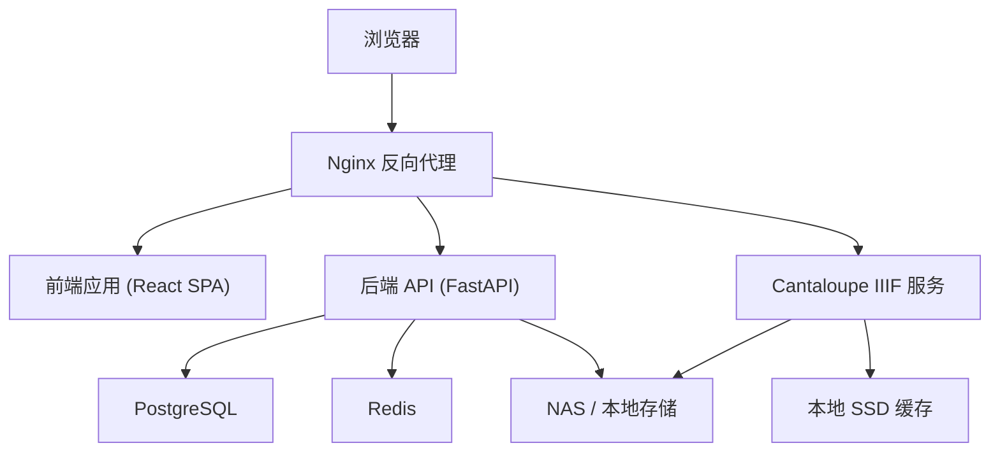
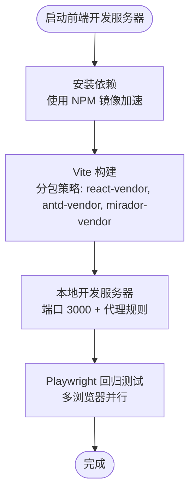
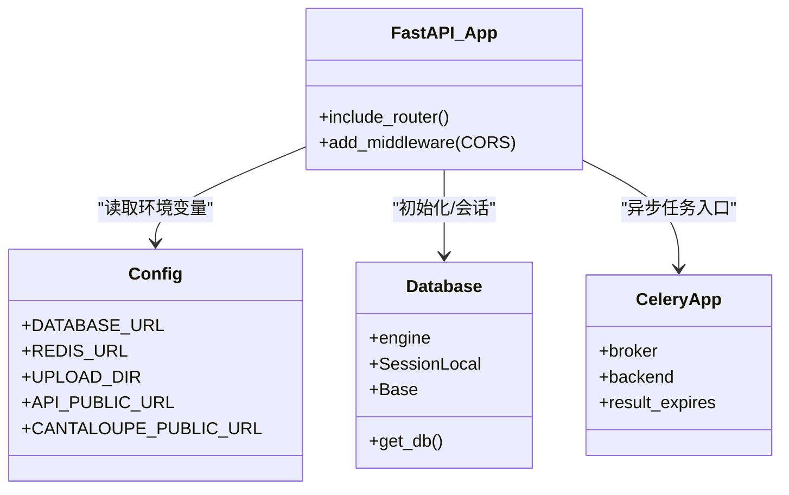
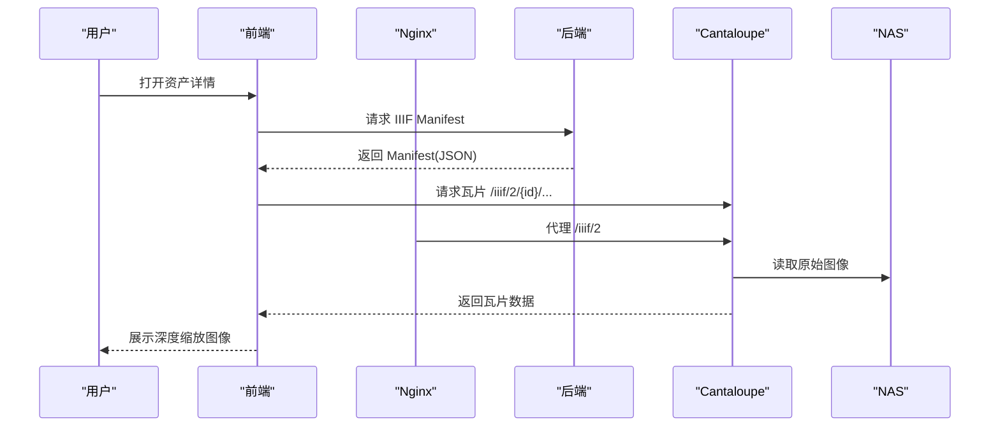
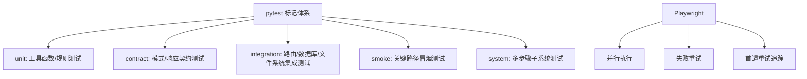
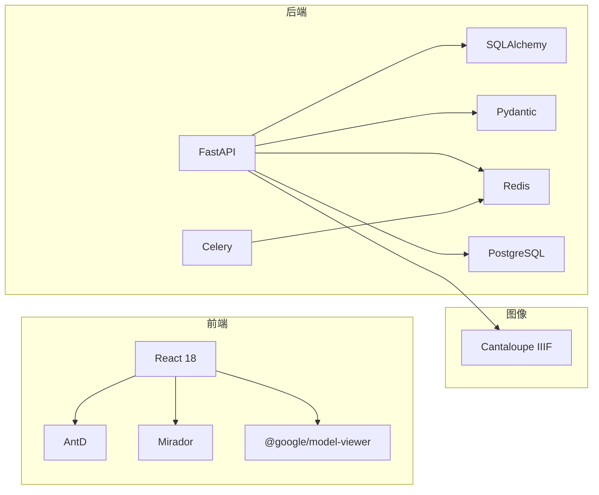

# 技术栈与架构

<cite>
**本文引用的文件**
- [backend/Dockerfile](file://backend/Dockerfile)
- [frontend/Dockerfile](file://frontend/Dockerfile)
- [docker-compose.yml](file://docker-compose.yml)
- [backend/requirements.txt](file://backend/requirements.txt)
- [frontend/package.json](file://frontend/package.json)
- [backend/app/main.py](file://backend/app/main.py)
- [backend/app/config.py](file://backend/app/config.py)
- [backend/app/database.py](file://backend/app/database.py)
- [backend/app/celery_app.py](file://backend/app/celery_app.py)
- [frontend/vite.config.ts](file://frontend/vite.config.ts)
- [frontend/playwright.config.ts](file://frontend/playwright.config.ts)
- [pytest.ini](file://pytest.ini)
- [ARCHITECTURE.md](file://ARCHITECTURE.md)
- [SYSTEM_ARCHITECTURE.md](file://SYSTEM_ARCHITECTURE.md)
- [docs/02-架构设计/SYSTEM_ARCHITECTURE.md](file://docs/02-架构设计/SYSTEM_ARCHITECTURE.md)
</cite>

## 目录
1. [引言](#引言)
2. [项目结构](#项目结构)
3. [核心组件](#核心组件)
4. [架构总览](#架构总览)
5. [详细组件分析](#详细组件分析)
6. [依赖分析](#依赖分析)
7. [性能考虑](#性能考虑)
8. [故障排查指南](#故障排查指南)
9. [结论](#结论)
10. [附录](#附录)

## 引言
本文件面向MDAMS原型项目，提供技术栈与架构概览。重点覆盖：
- 前端技术栈：React 18 + Vite + TypeScript + Ant Design；专用组件：Mirador（二维图像预览）、@google/model-viewer（三维模型展示）
- 后端技术栈：FastAPI + SQLAlchemy + Pydantic；数据库：PostgreSQL；异步任务：Celery + Redis；图像服务：Cantaloupe IIIF Server
- 测试技术栈：pytest（后端）+ Playwright（前端回归测试）
- 整体架构：前后端分离的微服务架构，容器化部署，Docker Compose服务编排
- 关键设计决策与架构模式：分层架构、事件驱动（异步任务）、插件化（平台适配器）

## 项目结构
项目采用前后端分离与容器化微服务架构，核心目录与职责如下：
- backend：Python后端服务，包含FastAPI应用、路由、服务层、数据库与Celery异步任务
- frontend：React前端应用，包含页面组件、类型声明、构建与测试配置
- cantaloupe：自定义构建的Cantaloupe IIIF服务镜像
- docs：架构、部署与实施方案文档
- docker-compose.yml：服务编排与环境变量注入

图表来源
- [docker-compose.yml:1-131](file://docker-compose.yml#L1-L131)
- [backend/app/main.py:1-86](file://backend/app/main.py#L1-L86)
- [backend/app/config.py:42-46](file://backend/app/config.py#L42-L46)
- [backend/app/celery_app.py:1-19](file://backend/app/celery_app.py#L1-L19)

章节来源
- [docker-compose.yml:1-131](file://docker-compose.yml#L1-L131)
- [ARCHITECTURE.md:1-90](file://ARCHITECTURE.md#L1-L90)
- [SYSTEM_ARCHITECTURE.md:1-119](file://SYSTEM_ARCHITECTURE.md#L1-L119)

## 核心组件
- 前端
  - React 18 + Vite + TypeScript + Ant Design
  - 专用组件：Mirador（二维图像预览）、@google/model-viewer（三维模型展示）
  - 构建与代理：Vite配置、Nginx反向代理
  - 测试：Playwright回归测试
- 后端
  - FastAPI + SQLAlchemy + Pydantic
  - 数据库：PostgreSQL
  - 异步任务：Celery + Redis
  - 图像服务：Cantaloupe IIIF Server
  - 配置：环境变量加载与参数注入
- 测试
  - 后端：pytest（含标记体系）
  - 前端：Playwright（多浏览器并行）

章节来源
- [frontend/package.json:13-26](file://frontend/package.json#L13-L26)
- [frontend/vite.config.ts:1-42](file://frontend/vite.config.ts#L1-L42)
- [frontend/playwright.config.ts:1-36](file://frontend/playwright.config.ts#L1-L36)
- [backend/requirements.txt:1-18](file://backend/requirements.txt#L1-L18)
- [backend/app/config.py:1-72](file://backend/app/config.py#L1-L72)
- [pytest.ini:1-9](file://pytest.ini#L1-L9)

## 架构总览
系统采用容器化微服务架构，前后端分离，通过Nginx统一入口转发API与IIIF请求至后端与图像服务。数据库与缓存独立运行，图像服务直接从NAS读取原始图像并进行动态裁剪与缩放。

图表来源
- [ARCHITECTURE.md:7-50](file://ARCHITECTURE.md#L7-L50)
- [SYSTEM_ARCHITECTURE.md:22-34](file://SYSTEM_ARCHITECTURE.md#L22-L34)
- [docker-compose.yml:1-131](file://docker-compose.yml#L1-L131)

章节来源
- [ARCHITECTURE.md:1-90](file://ARCHITECTURE.md#L1-L90)
- [SYSTEM_ARCHITECTURE.md:1-119](file://SYSTEM_ARCHITECTURE.md#L1-L119)

## 详细组件分析

### 前端技术栈与组件
- 技术栈
  - React 18 + Vite + TypeScript + Ant Design
  - 构建优化：分包策略、目标环境、禁用SourceMap
  - 代理配置：将/api、/auth、/iiif代理至后端
- 专用组件
  - Mirador：用于二维图像深度缩放与多窗口对比
  - @google/model-viewer：用于三维模型展示
- 测试
  - Playwright：多浏览器并行、重试与追踪配置

图表来源
- [frontend/Dockerfile:1-28](file://frontend/Dockerfile#L1-L28)
- [frontend/package.json:6-12](file://frontend/package.json#L6-L12)
- [frontend/vite.config.ts:5-41](file://frontend/vite.config.ts#L5-L41)
- [frontend/playwright.config.ts:1-36](file://frontend/playwright.config.ts#L1-L36)

章节来源
- [frontend/package.json:1-42](file://frontend/package.json#L1-L42)
- [frontend/vite.config.ts:1-42](file://frontend/vite.config.ts#L1-L42)
- [frontend/playwright.config.ts:1-36](file://frontend/playwright.config.ts#L1-L36)
- [frontend/Dockerfile:1-28](file://frontend/Dockerfile#L1-L28)

### 后端技术栈与组件
- 技术栈
  - FastAPI + SQLAlchemy + Pydantic
  - 数据库：PostgreSQL
  - 异步任务：Celery + Redis
  - 图像处理：libvips、OpenCV、Pillow等
- 关键模块
  - 应用入口：注册路由、中间件、数据库初始化
  - 配置：环境变量加载、数据库/Redis/上传目录/API与Cantaloupe公共URL
  - 数据库：引擎、会话工厂、基础模型
  - 异步：Celery应用与任务注册

图表来源
- [backend/app/main.py:1-86](file://backend/app/main.py#L1-L86)
- [backend/app/config.py:1-72](file://backend/app/config.py#L1-L72)
- [backend/app/database.py:1-17](file://backend/app/database.py#L1-L17)
- [backend/app/celery_app.py:1-19](file://backend/app/celery_app.py#L1-L19)

章节来源
- [backend/app/main.py:1-86](file://backend/app/main.py#L1-L86)
- [backend/app/config.py:1-72](file://backend/app/config.py#L1-L72)
- [backend/app/database.py:1-17](file://backend/app/database.py#L1-L17)
- [backend/app/celery_app.py:1-19](file://backend/app/celery_app.py#L1-L19)
- [backend/requirements.txt:1-18](file://backend/requirements.txt#L1-L18)

### 图像服务与IIIF集成
- 服务：Cantaloupe IIIF Server
- 配置要点：禁用堆内存缓存、使用文件系统缓存、强制Java2d处理器、NFS直读NAS
- 与前端协作：Nginx代理/iiif请求至Cantaloupe，Mirador解析Manifest并请求瓦片

图表来源
- [SYSTEM_ARCHITECTURE.md:80-88](file://SYSTEM_ARCHITECTURE.md#L80-L88)
- [docker-compose.yml:105-127](file://docker-compose.yml#L105-L127)

章节来源
- [SYSTEM_ARCHITECTURE.md:55-61](file://SYSTEM_ARCHITECTURE.md#L55-L61)
- [docker-compose.yml:103-127](file://docker-compose.yml#L103-L127)

### 测试技术栈
- 后端测试：pytest，支持标记分类（unit、contract、integration、smoke、system）
- 前端测试：Playwright，多浏览器并行、重试与追踪

图表来源
- [pytest.ini:1-9](file://pytest.ini#L1-L9)
- [frontend/playwright.config.ts:1-36](file://frontend/playwright.config.ts#L1-L36)

章节来源
- [pytest.ini:1-9](file://pytest.ini#L1-L9)
- [frontend/playwright.config.ts:1-36](file://frontend/playwright.config.ts#L1-L36)

## 依赖分析
- 前端依赖
  - React 18、Ant Design、Mirador、@google/model-viewer、Axios、Three.js等
  - 开发依赖：Vite、TypeScript、ESLint、Playwright
- 后端依赖
  - FastAPI、SQLAlchemy、Pydantic、Celery、Redis、PostgreSQL驱动、图像处理库
- 容器与编排
  - Docker Compose编排：后端、前端、数据库、Redis、Cantaloupe、NAS挂载
  - 环境变量：数据库连接、Redis连接、上传目录、API与Cantaloupe公共URL、人脸识别等

图表来源
- [frontend/package.json:13-26](file://frontend/package.json#L13-L26)
- [backend/requirements.txt:1-18](file://backend/requirements.txt#L1-L18)
- [docker-compose.yml:1-131](file://docker-compose.yml#L1-L131)

章节来源
- [frontend/package.json:1-42](file://frontend/package.json#L1-L42)
- [backend/requirements.txt:1-18](file://backend/requirements.txt#L1-L18)
- [docker-compose.yml:1-131](file://docker-compose.yml#L1-L131)

## 性能考虑
- 前端构建优化
  - Vite分包策略降低首屏体积
  - 禁用SourceMap减少产物体积
  - Node构建内存上限提升，缓解N100内存压力
- 后端性能
  - libvips优化图像处理，适配低内存环境
  - Celery并发与结果过期配置
  - PostgreSQL使用本地SSD提升I/O性能
- 图像服务
  - 禁用堆内存缓存，仅使用文件系统缓存
  - 强制Java2d处理器稳定内存占用
  - 直接NFS读取NAS原始图像，避免额外拷贝

章节来源
- [frontend/vite.config.ts:7-21](file://frontend/vite.config.ts#L7-L21)
- [frontend/Dockerfile:14-18](file://frontend/Dockerfile#L14-L18)
- [backend/Dockerfile:7-16](file://backend/Dockerfile#L7-L16)
- [backend/app/celery_app.py:13-15](file://backend/app/celery_app.py#L13-L15)
- [SYSTEM_ARCHITECTURE.md:57-60](file://SYSTEM_ARCHITECTURE.md#L57-L60)

## 故障排查指南
- 端口冲突与服务不可达
  - 检查docker-compose端口映射与宿主机占用
  - 确认Nginx代理规则是否正确转发/api与/iiif
- 数据库连接失败
  - 校验DATABASE_URL与凭据
  - 确认PostgreSQL容器健康与卷挂载
- Redis连接异常
  - 校验REDIS_URL与网络连通
  - 检查Celery Worker日志
- Cantaloupe图像无法加载
  - 校验CANTALOUPE_PUBLIC_URL与Nginx代理
  - 确认NAS挂载路径与文件权限
- 前端代理无效
  - 检查Vite代理配置与端口
  - 确认后端CORS中间件允许跨域

章节来源
- [docker-compose.yml:6-30](file://docker-compose.yml#L6-L30)
- [backend/app/config.py:42-46](file://backend/app/config.py#L42-L46)
- [frontend/vite.config.ts:22-40](file://frontend/vite.config.ts#L22-L40)

## 结论
MDAMS原型项目通过前后端分离与容器化微服务架构，结合FastAPI、React、Cantaloupe等成熟技术栈，在N100低功耗服务器与NAS混合存储环境下，实现了IIIF原生支持与高分辨率图像深度缩放能力。测试体系覆盖后端pytest与前端Playwright，保障关键路径稳定性。后续可在元数据提取、OCR叠加与权限控制等方面持续演进。

## 附录
- 关键设计决策与架构模式
  - 分层架构：路由/服务/数据层清晰分离
  - 事件驱动：异步任务解耦长耗时流程
  - 插件化：平台适配器与图像服务可替换
- 技术选型优势与适用场景
  - 前端：React生态完善、AntD组件丰富、Vite构建高效
  - 后端：FastAPI高性能与自动生成文档、SQLAlchemy ORM易维护、Pydantic数据校验强
  - 图像：Cantaloupe IIIF标准化、NFS直读NAS、文件系统缓存稳定
  - 测试：pytest标记体系明确、Playwright跨浏览器回归