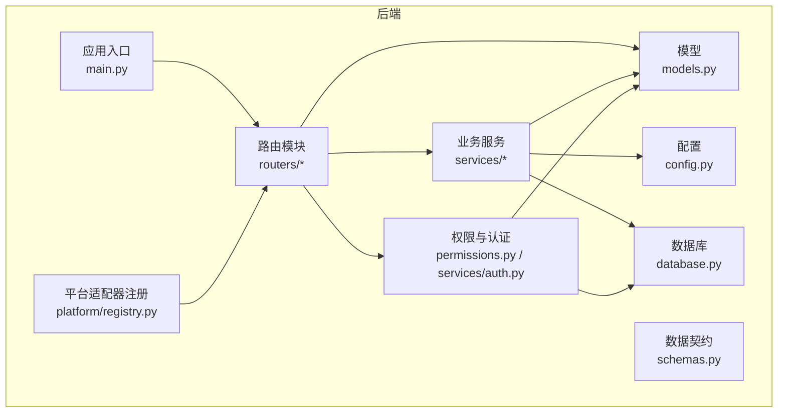
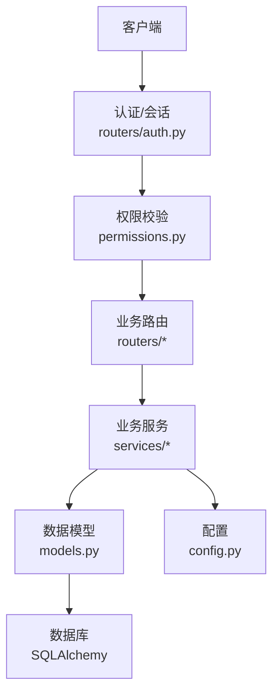
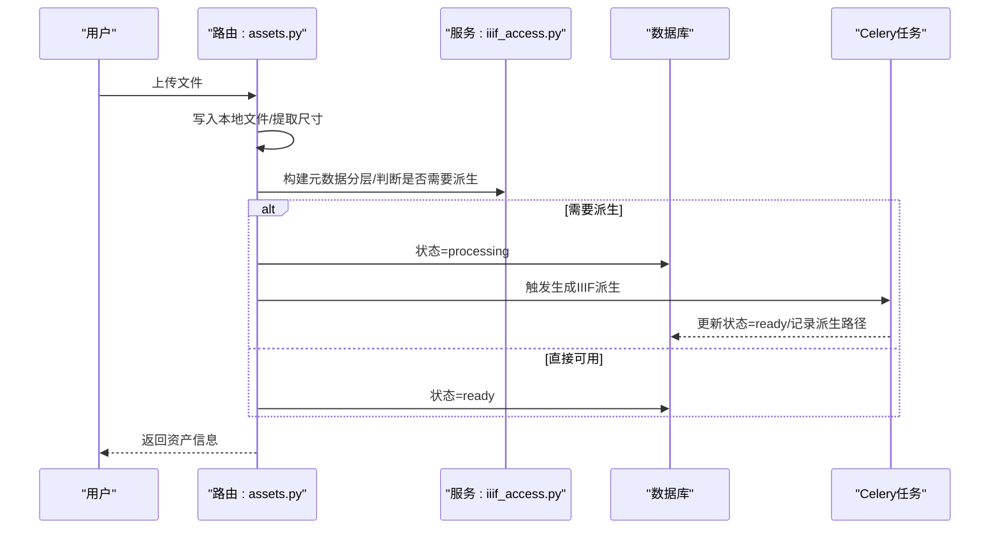
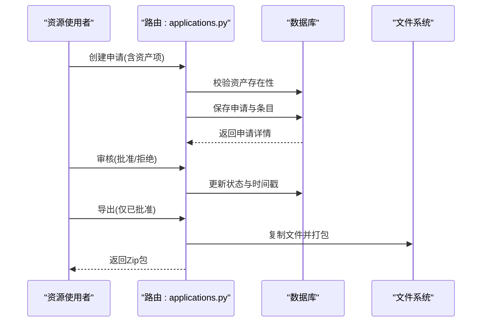
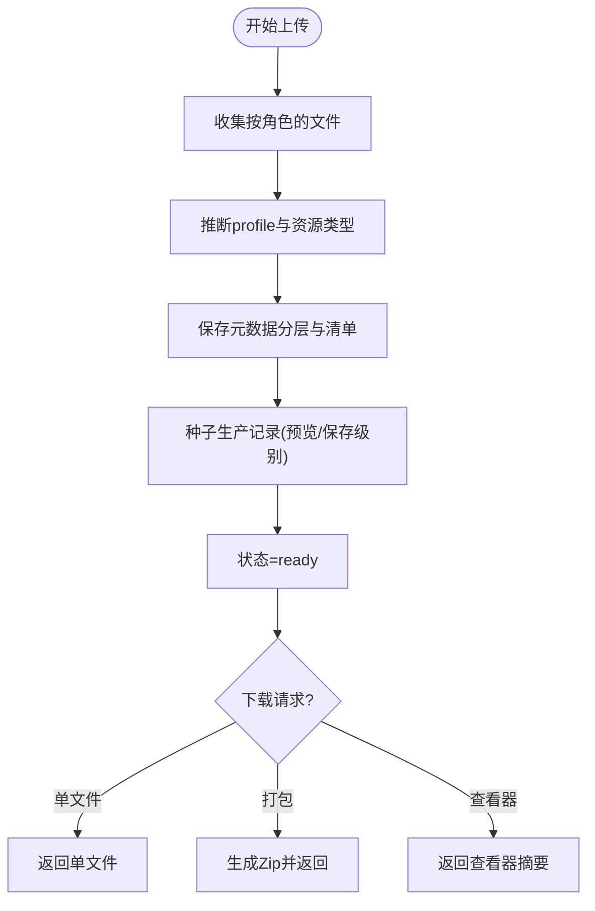
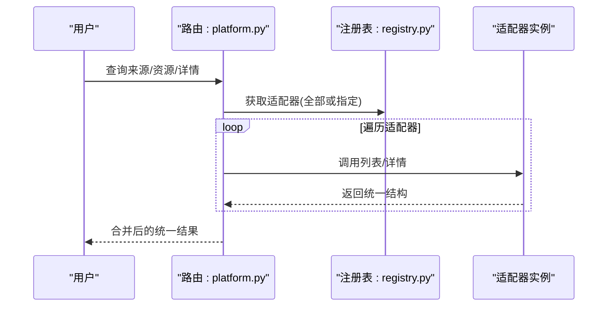
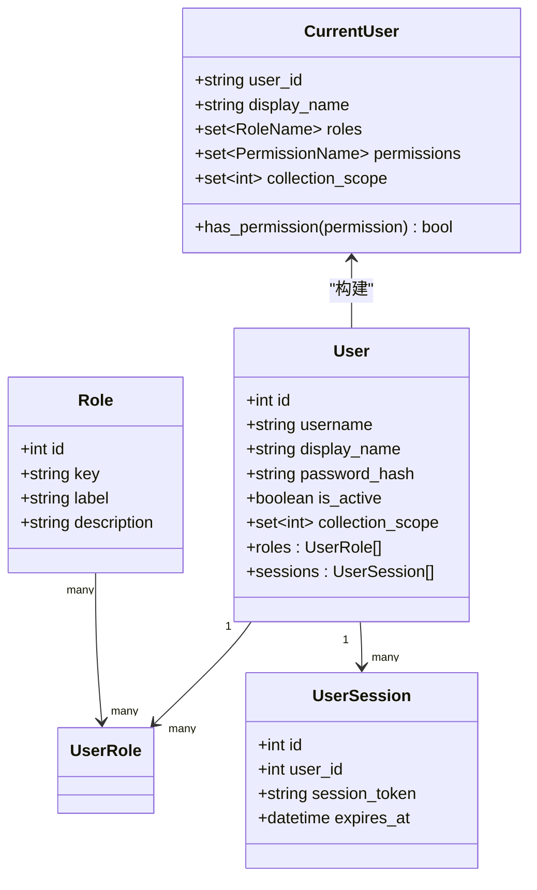
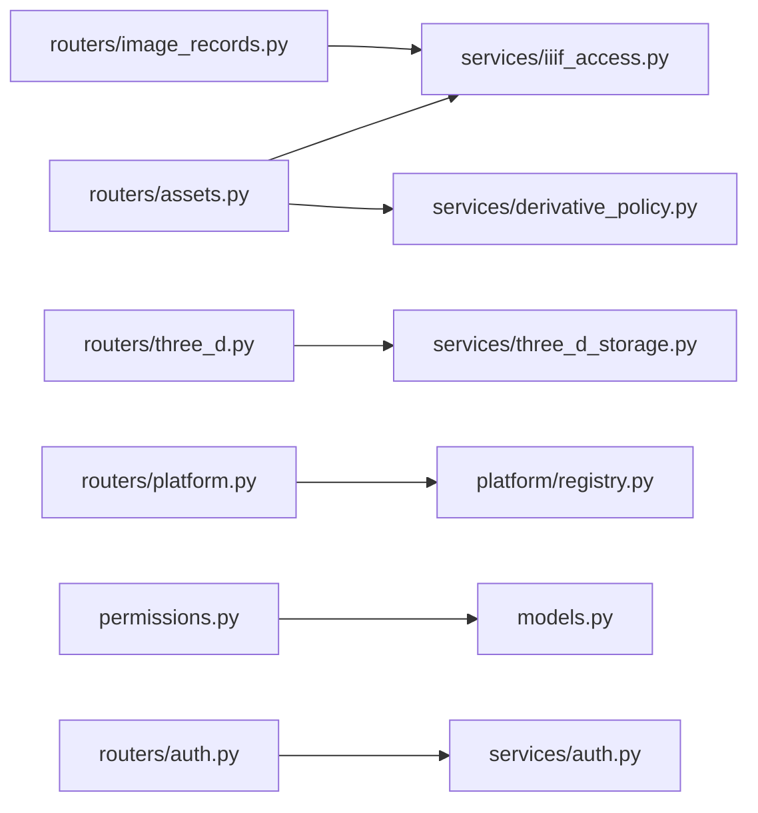

# 核心功能模块概览

<cite>
**本文档引用的文件**
- [backend/app/main.py](file://backend/app/main.py)
- [backend/app/models.py](file://backend/app/models.py)
- [backend/app/schemas.py](file://backend/app/schemas.py)
- [backend/app/config.py](file://backend/app/config.py)
- [backend/app/database.py](file://backend/app/database.py)
- [backend/app/routers/assets.py](file://backend/app/routers/assets.py)
- [backend/app/routers/image_records.py](file://backend/app/routers/image_records.py)
- [backend/app/routers/applications.py](file://backend/app/routers/applications.py)
- [backend/app/routers/three_d.py](file://backend/app/routers/three_d.py)
- [backend/app/routers/platform.py](file://backend/app/routers/platform.py)
- [backend/app/routers/auth.py](file://backend/app/routers/auth.py)
- [backend/app/permissions.py](file://backend/app/permissions.py)
- [backend/app/services/auth.py](file://backend/app/services/auth.py)
- [backend/app/services/iiif_access.py](file://backend/app/services/iiif_access.py)
- [backend/app/services/derivative_policy.py](file://backend/app/services/derivative_policy.py)
- [backend/app/platform/registry.py](file://backend/app/platform/registry.py)
</cite>

## 目录
1. [简介](#简介)
2. [项目结构](#项目结构)
3. [核心组件](#核心组件)
4. [架构总览](#架构总览)
5. [详细组件分析](#详细组件分析)
6. [依赖分析](#依赖分析)
7. [性能考虑](#性能考虑)
8. [故障排除指南](#故障排除指南)
9. [结论](#结论)

## 简介
本文件面向MDAMS原型项目的五大核心能力模块，提供面向使用者与开发者的综合概览。内容涵盖：
- 二维影像资产管理：资产上传、列表、详情与预览图、图像记录录入、文件匹配与校验、IIIF Manifest生成与Mirador预览、原文件下载与BagIt下载、衍生文件策略与IIIF访问流程
- 利用申请流程：申请车、申请单提交、审批通过/拒绝、交付包导出
- 三维资源管理：三维对象与版本管理、多文件资源包上传、模型/点云/倾斜摄影等角色区分、Web查看摘要与对象详情
- 统一平台目录：统一来源注册、统一资源目录、统一资源详情、按状态/类型/profile/预览能力筛选
- 权限与登录框架：内置测试用户与角色播种、登录/会话/上下文接口、前端菜单按角色裁剪、后端权限校验与范围控制、collection_owner责任范围过滤

## 项目结构
后端采用FastAPI + SQLAlchemy架构，路由按功能域划分，服务层封装业务规则，模型定义数据结构，权限与认证贯穿各模块。

**图表来源**
- [backend/app/main.py:1-86](file://backend/app/main.py#L1-L86)
- [backend/app/database.py:1-17](file://backend/app/database.py#L1-L17)
- [backend/app/config.py:1-72](file://backend/app/config.py#L1-L72)
- [backend/app/models.py:1-307](file://backend/app/models.py#L1-L307)
- [backend/app/schemas.py:1-652](file://backend/app/schemas.py#L1-L652)
- [backend/app/permissions.py:1-255](file://backend/app/permissions.py#L1-L255)
- [backend/app/services/auth.py:1-143](file://backend/app/services/auth.py#L1-L143)
- [backend/app/platform/registry.py:1-24](file://backend/app/platform/registry.py#L1-L24)

**章节来源**
- [backend/app/main.py:1-86](file://backend/app/main.py#L1-L86)
- [backend/app/database.py:1-17](file://backend/app/database.py#L1-L17)
- [backend/app/config.py:1-72](file://backend/app/config.py#L1-L72)

## 核心组件
- 应用入口与路由聚合：集中注册健康检查、认证、资产、图像记录、申请、三维、平台目录、下载、IIIF等路由
- 数据模型：统一资产、用户、角色、会话、图像记录、申请、三维资源等实体及关联关系
- 数据契约：Pydantic模型定义对外响应结构，确保前后端一致的数据形态
- 权限与认证：基于角色的权限矩阵、会话令牌、集合范围过滤、多入口认证支持
- 业务服务：IIIF访问派生、衍生策略、元数据分层、三维存储与清单、平台适配器注册

**章节来源**
- [backend/app/main.py:75-86](file://backend/app/main.py#L75-L86)
- [backend/app/models.py:6-275](file://backend/app/models.py#L6-L275)
- [backend/app/schemas.py:7-601](file://backend/app/schemas.py#L7-L601)
- [backend/app/permissions.py:17-94](file://backend/app/permissions.py#L17-L94)
- [backend/app/services/iiif_access.py:1-259](file://backend/app/services/iiif_access.py#L1-L259)
- [backend/app/services/derivative_policy.py:1-168](file://backend/app/services/derivative_policy.py#L1-L168)

## 架构总览
系统以“路由-服务-模型-权限”分层组织，统一通过权限中间件进行鉴权与授权；平台目录通过适配器注册机制对接多来源数据。

**图表来源**
- [backend/app/routers/auth.py:1-83](file://backend/app/routers/auth.py#L1-L83)
- [backend/app/permissions.py:179-255](file://backend/app/permissions.py#L179-L255)
- [backend/app/routers/assets.py:1-292](file://backend/app/routers/assets.py#L1-L292)
- [backend/app/routers/image_records.py:1-800](file://backend/app/routers/image_records.py#L1-L800)
- [backend/app/routers/applications.py:1-254](file://backend/app/routers/applications.py#L1-L254)
- [backend/app/routers/three_d.py:1-742](file://backend/app/routers/three_d.py#L1-L742)
- [backend/app/routers/platform.py:1-65](file://backend/app/routers/platform.py#L1-L65)
- [backend/app/services/iiif_access.py:1-259](file://backend/app/services/iiif_access.py#L1-L259)
- [backend/app/services/derivative_policy.py:1-168](file://backend/app/services/derivative_policy.py#L1-L168)
- [backend/app/models.py:1-307](file://backend/app/models.py#L1-L307)
- [backend/app/config.py:1-72](file://backend/app/config.py#L1-L72)

## 详细组件分析

### 二维影像资产管理模块
- 核心功能
  - 资产上传：接收文件、写入本地存储、提取尺寸、构建元数据分层、决定是否直接可用或需生成IIIF派生
  - 列表与详情：按可见性范围过滤返回；详情包含结构、技术元数据、生命周期、输出链接等
  - 预览图：生成并提供预览图下载
  - 文件匹配与校验：图像记录上传时的重复检测、哈希比对、绑定验证
  - IIIF访问与Mirador预览：根据衍生策略生成pyramidal TIFF或回退到原始文件；提供Manifest与预览链接
  - 下载：原文件下载与批量Zip/Bagit打包（通过应用导出）
- 业务价值
  - 提供稳定的IIIF访问与可视化体验，支撑大规模图像检索与浏览
  - 通过衍生策略自动适配不同源文件规模，兼顾性能与合规
- 技术实现要点
  - 上传流程：写文件 → 元数据分层 → 判断是否需要派生 → 异步任务生成派生
  - 可见性控制：基于visibility_scope与collection_object_id结合角色范围
  - IIIF派生：依据文件大小/像素阈值选择pyramidal TIFF或保持原图

**图表来源**
- [backend/app/routers/assets.py:54-134](file://backend/app/routers/assets.py#L54-L134)
- [backend/app/services/iiif_access.py:182-259](file://backend/app/services/iiif_access.py#L182-L259)
- [backend/app/tasks.py:1-200](file://backend/app/tasks.py#L1-L200)

**章节来源**
- [backend/app/routers/assets.py:27-292](file://backend/app/routers/assets.py#L27-L292)
- [backend/app/services/iiif_access.py:45-180](file://backend/app/services/iiif_access.py#L45-L180)
- [backend/app/services/derivative_policy.py:72-168](file://backend/app/services/derivative_policy.py#L72-L168)

### 利用申请流程模块
- 核心功能
  - 申请车：由资源使用者发起，选择资产与交付格式
  - 申请单提交：校验资产存在性与权限
  - 审批：审核员批准/拒绝，并记录意见
  - 交付包导出：生成Zip包，包含物理文件与清单
- 业务价值
  - 规范化利用申请与交付流程，保障合规与可追溯
- 技术实现要点
  - 申请单与资产项一对多；导出过程复制物理文件并生成清单

**图表来源**
- [backend/app/routers/applications.py:132-254](file://backend/app/routers/applications.py#L132-L254)

**章节来源**
- [backend/app/routers/applications.py:1-254](file://backend/app/routers/applications.py#L1-L254)

### 三维资源管理模块
- 核心功能
  - 多文件资源包上传：按角色归类（模型/点云/倾斜摄影），推断资源类型与profile
  - 对象与版本：三维对象统一管理，版本标签/顺序、当前版本标记、Web预览开关
  - 清单与下载：生成包清单，支持单文件直下与Zip打包
  - 查看器摘要：根据文件角色与预览状态提供Web查看能力
- 业务价值
  - 支撑多形态三维数据的统一入库、版本演进与访问
- 技术实现要点
  - 角色推断与profile映射；元数据分层与生产记录种子；预览状态与存储层级

**图表来源**
- [backend/app/routers/three_d.py:371-742](file://backend/app/routers/three_d.py#L371-L742)
- [backend/app/services/three_d_storage.py:1-200](file://backend/app/services/three_d_storage.py#L1-L200)

**章节来源**
- [backend/app/routers/three_d.py:1-742](file://backend/app/routers/three_d.py#L1-L742)

### 统一平台目录模块
- 核心功能
  - 统一来源注册：通过适配器注册机制接入多来源
  - 统一资源目录：跨来源聚合查询，支持按状态/类型/profile/预览筛选
  - 统一资源详情：按统一ID定位来源系统与记录
- 业务价值
  - 打破数据孤岛，提供一站式检索与导航
- 技术实现要点
  - 适配器注册表统一管理；路由聚合调用各适配器

**图表来源**
- [backend/app/routers/platform.py:15-65](file://backend/app/routers/platform.py#L15-L65)
- [backend/app/platform/registry.py:8-24](file://backend/app/platform/registry.py#L8-L24)

**章节来源**
- [backend/app/routers/platform.py:1-65](file://backend/app/routers/platform.py#L1-L65)
- [backend/app/platform/registry.py:1-24](file://backend/app/platform/registry.py#L1-L24)

### 权限与登录框架模块
- 核心功能
  - 登录/会话/上下文：支持Cookie/Bearer/X-MDAMS头多种认证方式
  - 角色与权限：内置角色到权限映射，支持系统管理员与集合范围
  - 菜单裁剪与访问控制：前端按角色显示，后端严格校验
  - collection_owner范围过滤：基于集合范围限制可见与操作
- 业务价值
  - 实现最小权限原则与责任范围隔离
- 技术实现要点
  - 多入口认证解析；会话持久化与过期清理；权限矩阵动态计算

**图表来源**
- [backend/app/permissions.py:102-152](file://backend/app/permissions.py#L102-L152)
- [backend/app/models.py:28-111](file://backend/app/models.py#L28-L111)
- [backend/app/services/auth.py:15-41](file://backend/app/services/auth.py#L15-L41)

**章节来源**
- [backend/app/routers/auth.py:1-83](file://backend/app/routers/auth.py#L1-L83)
- [backend/app/permissions.py:17-94](file://backend/app/permissions.py#L17-L94)
- [backend/app/services/auth.py:62-143](file://backend/app/services/auth.py#L62-L143)

## 依赖分析
- 路由到服务：各路由依赖对应服务模块（如资产路由依赖IIIF服务、衍生策略）
- 权限到模型：权限模块读取用户/角色/会话模型，动态计算权限
- 平台适配器：平台目录通过注册表统一调度

**图表来源**
- [backend/app/routers/assets.py:1-292](file://backend/app/routers/assets.py#L1-L292)
- [backend/app/services/iiif_access.py:1-259](file://backend/app/services/iiif_access.py#L1-L259)
- [backend/app/services/derivative_policy.py:1-168](file://backend/app/services/derivative_policy.py#L1-L168)
- [backend/app/routers/image_records.py:1-800](file://backend/app/routers/image_records.py#L1-L800)
- [backend/app/routers/three_d.py:1-742](file://backend/app/routers/three_d.py#L1-L742)
- [backend/app/services/three_d_storage.py:1-200](file://backend/app/services/three_d_storage.py#L1-L200)
- [backend/app/routers/platform.py:1-65](file://backend/app/routers/platform.py#L1-L65)
- [backend/app/platform/registry.py:1-24](file://backend/app/platform/registry.py#L1-L24)
- [backend/app/permissions.py:1-255](file://backend/app/permissions.py#L1-L255)
- [backend/app/models.py:1-307](file://backend/app/models.py#L1-L307)
- [backend/app/routers/auth.py:1-83](file://backend/app/routers/auth.py#L1-L83)
- [backend/app/services/auth.py:1-143](file://backend/app/services/auth.py#L1-L143)

**章节来源**
- [backend/app/routers/assets.py:1-292](file://backend/app/routers/assets.py#L1-L292)
- [backend/app/routers/image_records.py:1-800](file://backend/app/routers/image_records.py#L1-L800)
- [backend/app/routers/applications.py:1-254](file://backend/app/routers/applications.py#L1-L254)
- [backend/app/routers/three_d.py:1-742](file://backend/app/routers/three_d.py#L1-L742)
- [backend/app/routers/platform.py:1-65](file://backend/app/routers/platform.py#L1-L65)
- [backend/app/routers/auth.py:1-83](file://backend/app/routers/auth.py#L1-L83)
- [backend/app/permissions.py:1-255](file://backend/app/permissions.py#L1-L255)
- [backend/app/services/auth.py:1-143](file://backend/app/services/auth.py#L1-L143)

## 性能考虑
- 上传与派生：大文件优先生成pyramidal TIFF以提升IIIF渲染性能；小文件可回退原图
- 缓存与预览：预览图生成后按需缓存，避免重复计算
- 查询优化：列表接口支持分页与排序；平台目录按适配器聚合，减少跨系统往返
- 会话与鉴权：会话令牌过期清理，避免无效连接占用

## 故障排除指南
- 上传失败或派生未就绪
  - 检查文件尺寸/像素阈值与衍生策略；确认派生任务是否触发
  - 关注状态字段与process_message提示
- 预览图不可用
  - 确认预览图生成服务可用；检查文件是否存在
- 权限不足
  - 核对角色与权限矩阵；确认collection_scope是否包含目标集合
- 会话失效
  - 检查Cookie/Bearer头是否正确；确认会话未过期

**章节来源**
- [backend/app/services/iiif_access.py:176-259](file://backend/app/services/iiif_access.py#L176-L259)
- [backend/app/permissions.py:239-255](file://backend/app/permissions.py#L239-L255)
- [backend/app/services/auth.py:102-143](file://backend/app/services/auth.py#L102-L143)

## 结论
MDAMS原型项目围绕五大核心模块构建了从数据入库、元数据治理、访问服务到权限控制的完整闭环。通过统一的平台目录与适配器机制，实现多来源数据的聚合与统一呈现；借助IIIF与衍生策略，保障大规模图像的高效访问；通过角色权限与集合范围，实现细粒度的访问控制与责任隔离。该架构既满足原型验证需求，也为后续扩展与生产化奠定基础。