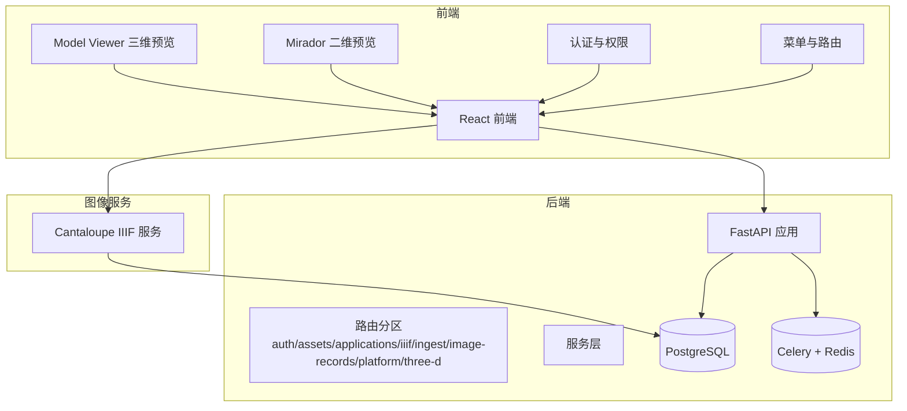
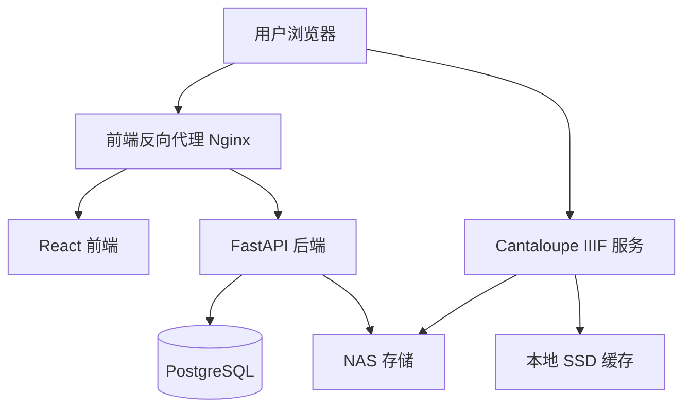
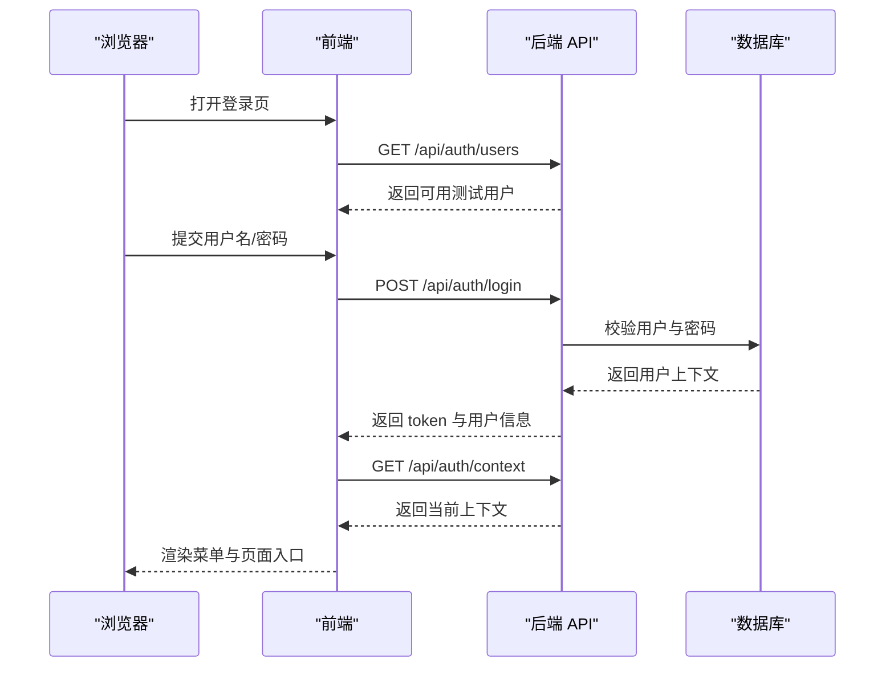
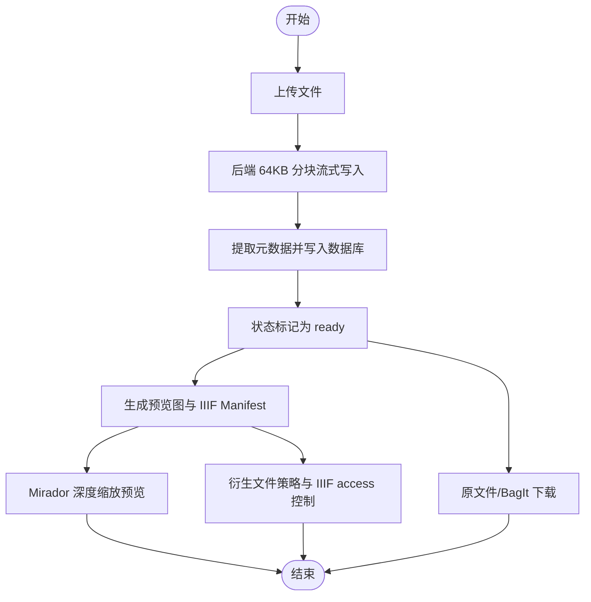
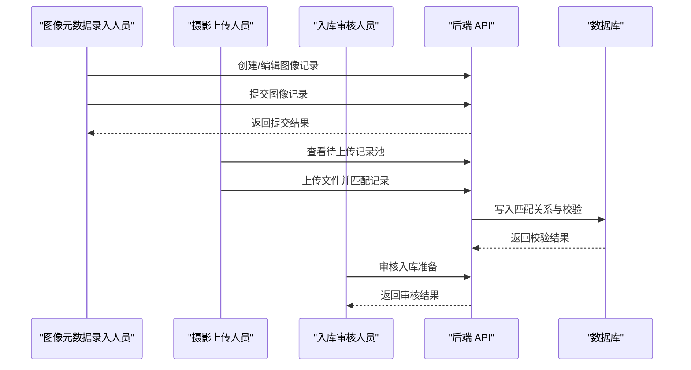
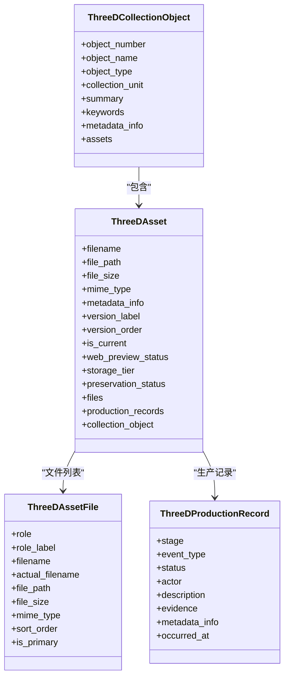
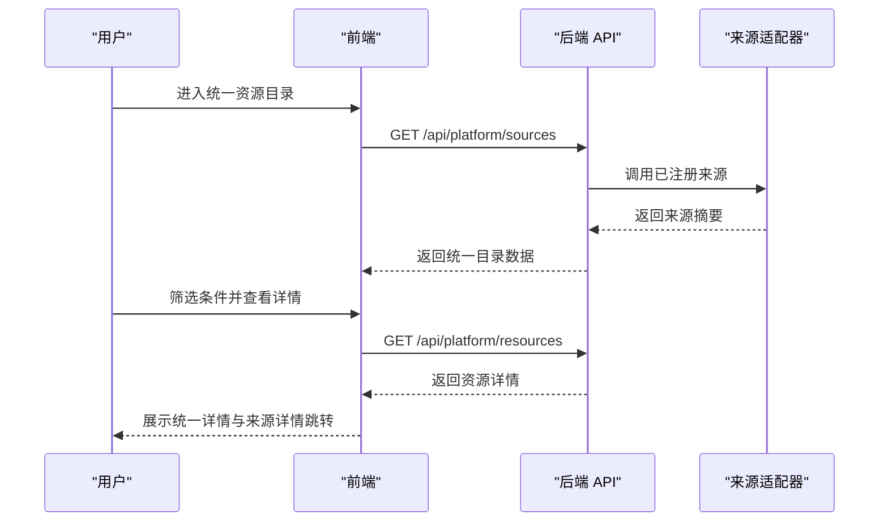
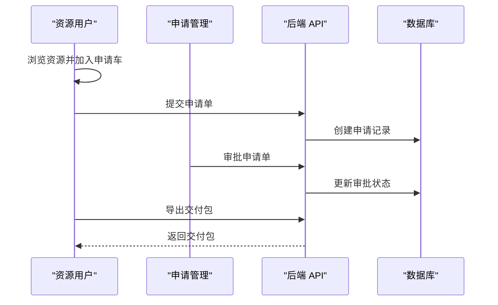
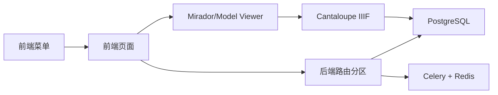

# 项目介绍与定位

<cite>
**本文引用的文件**
- [README.md](file://README.md)
- [docs/README.md](file://docs/README.md)
- [docs/01-总览/PROJECT_STATUS.md](file://docs/01-总览/PROJECT_STATUS.md)
- [docs/02-架构设计/SYSTEM_ARCHITECTURE.md](file://docs/02-架构设计/SYSTEM_ARCHITECTURE.md)
- [docs/03-产品与流程/USER_ROLE_PERMISSION_MATRIX.md](file://docs/03-产品与流程/USER_ROLE_PERMISSION_MATRIX.md)
- [docs/03-产品与流程/WORKFLOW_GUIDE.md](file://docs/03-产品与流程/WORKFLOW_GUIDE.md)
- [docs/01-总览/NEXT_PHASE_PLAN.md](file://docs/01-总览/NEXT_PHASE_PLAN.md)
- [docs/04-实施方案/OBJECT_DETAIL_PHASE2_PLAN.md](file://docs/04-实施方案/OBJECT_DETAIL_PHASE2_PLAN.md)
- [docs/01-总览/ACCEPTANCE_CHECKLIST.md](file://docs/01-总览/ACCEPTANCE_CHECKLIST.md)
- [memory/prototype_design.md](file://memory/prototype_design.md)
- [backend/app/main.py](file://backend/app/main.py)
- [frontend/src/App.tsx](file://frontend/src/App.tsx)
- [backend/app/models.py](file://backend/app/models.py)
- [frontend/package.json](file://frontend/package.json)
</cite>

## 目录
1. [引言](#引言)
2. [项目结构](#项目结构)
3. [核心组件](#核心组件)
4. [架构总览](#架构总览)
5. [详细组件分析](#详细组件分析)
6. [依赖分析](#依赖分析)
7. [性能考量](#性能考量)
8. [故障排查指南](#故障排查指南)
9. [结论](#结论)
10. [附录](#附录)

## 引言
MDAMS 原型项目面向馆内数字资源管理场景，已从最初的“二维影像上传 PoC”发展为包含二维影像、三维资源、统一平台目录、利用申请流程、登录与权限框架在内的可持续开发底座。当前阶段定位为“可稳定运行、可持续迭代、可用于演示与验证的馆内数字资源管理原型，而非完整生产级 DAMS”。项目覆盖多条主链路，包括二维资产上传与 IIIF 预览、图像记录协作工作流、三维对象与版本管理、统一平台聚合浏览、资源申请与交付闭环、以及基于角色的权限与责任范围控制。

项目目标用户群体与业务场景聚焦于博物馆、美术馆等文化机构，满足其在数字资源采集、治理、访问控制、批量利用与交付等方面的现实需求。核心价值主张体现在统一管理、可控访问、批量处理与演示验证能力，同时明确项目边界与限制，特别是在长期保存、治理与审计等方面的能力现状。

## 项目结构
项目采用前后端分离与容器化编排，后端以 FastAPI 为核心，数据库为 PostgreSQL，异步任务由 Celery + Redis 支撑，图像服务采用 Cantaloupe IIIF Server，前端基于 React 18 + Vite + TypeScript + Ant Design，二维预览集成 Mirador，三维展示集成 @google/model-viewer。

图表来源
- [docs/02-架构设计/SYSTEM_ARCHITECTURE.md:16-68](file://docs/02-架构设计/SYSTEM_ARCHITECTURE.md#L16-L68)
- [backend/app/main.py:1-86](file://backend/app/main.py#L1-L86)
- [frontend/src/App.tsx:1-120](file://frontend/src/App.tsx#L1-L120)
- [frontend/package.json:13-26](file://frontend/package.json#L13-L26)

章节来源
- [README.md:67-80](file://README.md#L67-L80)
- [docs/README.md:9-27](file://docs/README.md#L9-L27)
- [docs/02-架构设计/SYSTEM_ARCHITECTURE.md:16-68](file://docs/02-架构设计/SYSTEM_ARCHITECTURE.md#L16-L68)

## 核心组件
- 二维影像子系统：资产上传、列表、详情、预览图、IIIF Manifest、Mirador 预览、原文件与 BagIt 下载、衍生文件策略与 IIIF access 流程。
- 图像记录工作流：ImageRecord 的创建、提交、退回、待上传池、文件与记录匹配、基础校验与重复检测，实现“元数据与文件分离协作”。
- 三维资源子系统：对象与版本管理、多文件资源包上传、模型/点云/倾斜摄影角色区分、Web 查看摘要与对象详情、平台聚合接入。
- 统一平台层：来源注册表、统一资源目录、统一资源详情、按状态/类型/profile/预览能力筛选。
- 权限与登录框架：内置测试用户与角色播种、登录/会话/上下文接口、前端菜单按角色裁剪、后端权限校验与范围控制、collection_owner 责任范围过滤。
- 利用申请流程：申请车、申请单提交、审批通过/拒绝、交付包导出。
- 测试与工程支撑：后端 pytest 测试、前端 Playwright 回归测试、参考资源导入与校验脚本、工作日志与阶段文档。

章节来源
- [README.md:9-54](file://README.md#L9-L54)
- [docs/01-总览/PROJECT_STATUS.md:21-108](file://docs/01-总览/PROJECT_STATUS.md#L21-L108)
- [docs/03-产品与流程/WORKFLOW_GUIDE.md:12-21](file://docs/03-产品与流程/WORKFLOW_GUIDE.md#L12-L21)

## 架构总览
系统采用微服务架构与容器化编排，前端通过 Nginx 反向代理访问 React 应用与 API；后端提供 REST API、IIIF Manifest 生成与流式上传；图像服务 Cantaloupe 提供 IIIF 图像服务；数据库 PostgreSQL 存储元数据与状态；Celery + Redis 处理异步任务；NAS 作为大文件存储，SSD 作为缓存与热数据存储。

图表来源
- [docs/02-架构设计/SYSTEM_ARCHITECTURE.md:20-34](file://docs/02-架构设计/SYSTEM_ARCHITECTURE.md#L20-L34)

章节来源
- [docs/02-架构设计/SYSTEM_ARCHITECTURE.md:1-119](file://docs/02-架构设计/SYSTEM_ARCHITECTURE.md#L1-L119)

## 详细组件分析

### 权限与登录框架
- 角色与权限：系统内置多类角色与权限，覆盖二维资源、图像记录、三维资源、利用申请、范围控制等维度；前端按权限裁剪菜单入口，后端进行接口访问控制与 collection_scope 责任范围过滤。
- 登录与会话：提供登录、会话、上下文接口，支持系统管理员与资源用户的典型场景；默认测试用户与密码统一，便于演示与回归测试。
- 范围控制：支持 open 与 owner_only 两种可见范围，owner_only 通过 collection_scope 限定资源可见性。

图表来源
- [docs/03-产品与流程/WORKFLOW_GUIDE.md:22-38](file://docs/03-产品与流程/WORKFLOW_GUIDE.md#L22-L38)
- [docs/03-产品与流程/USER_ROLE_PERMISSION_MATRIX.md:128-151](file://docs/03-产品与流程/USER_ROLE_PERMISSION_MATRIX.md#L128-L151)

章节来源
- [docs/03-产品与流程/USER_ROLE_PERMISSION_MATRIX.md:12-194](file://docs/03-产品与流程/USER_ROLE_PERMISSION_MATRIX.md#L12-L194)
- [docs/03-产品与流程/WORKFLOW_GUIDE.md:22-38](file://docs/03-产品与流程/WORKFLOW_GUIDE.md#L22-L38)

### 二维影像与 IIIF 预览
- 资产生命周期：上传、列表、详情、预览图生成、IIIF Manifest 生成、Mirador 预览、原文件与 BagIt 下载、衍生文件策略与 IIIF access 处理。
- 技术实现：后端以 64KB 分块流式写入，避免内存峰值；Cantaloupe 提供 IIIF 图像服务，Mirador 解析 Manifest 进行深度缩放与平移。

图表来源
- [docs/02-架构设计/SYSTEM_ARCHITECTURE.md:73-88](file://docs/02-架构设计/SYSTEM_ARCHITECTURE.md#L73-L88)

章节来源
- [docs/02-架构设计/SYSTEM_ARCHITECTURE.md:71-89](file://docs/02-架构设计/SYSTEM_ARCHITECTURE.md#L71-L89)

### 图像记录协作工作流
- 角色分工：图像元数据录入人员负责创建与维护图像记录，摄影上传人员负责从待上传池领取并补文件，入库审核人员负责审核入库准备情况。
- 工作流闭环：记录创建、提交、退回、待上传池、文件上传与匹配、基础校验与重复检测，实现“元数据与文件分离协作”。

图表来源
- [docs/03-产品与流程/WORKFLOW_GUIDE.md:63-84](file://docs/03-产品与流程/WORKFLOW_GUIDE.md#L63-L84)

章节来源
- [docs/03-产品与流程/WORKFLOW_GUIDE.md:59-84](file://docs/03-产品与流程/WORKFLOW_GUIDE.md#L59-L84)

### 三维资源管理与 Web 查看
- 对象与版本：三维对象与版本信息、多文件上传、模型/点云/倾斜摄影角色区分、对象详情与查看摘要、Web 展示链路。
- 平台聚合：统一平台可继续聚合三维来源，支持按类型/状态/profile 筛选。

图表来源
- [backend/app/models.py:215-307](file://backend/app/models.py#L215-L307)

章节来源
- [docs/03-产品与流程/WORKFLOW_GUIDE.md:103-120](file://docs/03-产品与流程/WORKFLOW_GUIDE.md#L103-L120)
- [backend/app/models.py:215-307](file://backend/app/models.py#L215-L307)

### 统一平台目录与详情
- 聚合入口：统一资源目录从已注册来源适配器聚合资源，支持按条件筛选；统一资源详情支持跨来源跳转。
- 能力边界：平台聚合已可用，但统一检索与更多来源接入仍需继续扩展。

图表来源
- [docs/03-产品与流程/WORKFLOW_GUIDE.md:85-102](file://docs/03-产品与流程/WORKFLOW_GUIDE.md#L85-L102)

章节来源
- [docs/03-产品与流程/WORKFLOW_GUIDE.md:85-102](file://docs/03-产品与流程/WORKFLOW_GUIDE.md#L85-L102)

### 利用申请与交付
- 申请车：资源浏览后加入申请车，填写用途与范围。
- 审批与导出：申请管理页面支持审批通过/拒绝，审批通过后可导出交付包，状态进入 fulfilled。

图表来源
- [docs/03-产品与流程/WORKFLOW_GUIDE.md:120-132](file://docs/03-产品与流程/WORKFLOW_GUIDE.md#L120-L132)

章节来源
- [docs/03-产品与流程/WORKFLOW_GUIDE.md:120-132](file://docs/03-产品与流程/WORKFLOW_GUIDE.md#L120-L132)

## 依赖分析
- 后端路由分区：auth、assets、applications、downloads、health、iiif、ingest、image-records、platform、three-d、ai，覆盖认证、资产、申请、下载、健康检查、IIIF、入库、图像记录、平台、三维、AI 面板等模块。
- 前端页面：仪表盘、二维资源、申请车、入库处理、统一资源目录、统一资源详情、三维管理、申请管理、图像记录工作台，与后端路由形成一一对应或组合关系。
- 技术栈：前端 React 18 + Vite + TypeScript + Ant Design，二维预览 Mirador，三维展示 @google/model-viewer；后端 FastAPI + SQLAlchemy + Pydantic，数据库 PostgreSQL，异步任务 Celery + Redis，图像服务 Cantaloupe，测试 pytest + Playwright。

图表来源
- [README.md:170-186](file://README.md#L170-L186)
- [frontend/src/App.tsx:526-550](file://frontend/src/App.tsx#L526-L550)
- [docs/02-架构设计/SYSTEM_ARCHITECTURE.md:38-68](file://docs/02-架构设计/SYSTEM_ARCHITECTURE.md#L38-L68)

章节来源
- [README.md:170-186](file://README.md#L170-L186)
- [frontend/src/App.tsx:526-550](file://frontend/src/App.tsx#L526-L550)

## 性能考量
- 上传性能：后端采用 64KB 分块流式写入，避免内存峰值，适用于大文件上传。
- 图像服务：Cantaloupe 通过文件系统缓存与本地 SSD 缓存降低堆内存压力，适配低功耗服务器硬件。
- 前端构建：针对 N100 内存限制调整构建时内存堆栈上限，保证前端构建稳定性。

章节来源
- [docs/02-架构设计/SYSTEM_ARCHITECTURE.md:44-61](file://docs/02-架构设计/SYSTEM_ARCHITECTURE.md#L44-L61)

## 故障排查指南
- 环境与登录：检查 docker compose 配置与服务状态，确认健康检查与就绪检查接口可用；登录后菜单应随角色变化。
- 二维影像主链路：验证前端资源列表、上传、详情、IIIF Manifest、Mirador 预览与下载功能；资源可见范围会影响可访问结果。
- 三维资源：验证三维列表、对象聚合、Web 查看器、文件构成与对象关联。
- 统一平台：验证统一资源目录筛选、统一详情跳转与不同角色下的可见内容差异。
- 权限与范围：验证 system_admin、resource_user、collection_owner、application_reviewer 等角色的功能边界。

章节来源
- [docs/01-总览/ACCEPTANCE_CHECKLIST.md:1-96](file://docs/01-总览/ACCEPTANCE_CHECKLIST.md#L1-L96)

## 结论
MDAMS 原型项目已完成从单一二维影像上传 PoC 到多条主链路可用的演进，形成可稳定运行、可持续迭代、可用于演示与验证的馆内数字资源管理原型。当前已覆盖二维影像、图像记录协作、三维资源、统一平台、利用申请与权限控制等核心能力，但仍处于原型阶段，在长期保存、治理、审计、迁移与监控等方面的能力尚需后续补齐。项目边界与限制明确，适合在文化机构场景中进行持续开发与验证。

## 附录
- 项目状态与阶段定位：可持续开发与演示阶段，主链路可用、模块边界清晰、可继续平台化。
- 下一阶段计划：主链路稳定化、工程化与可维护性提升、最小业务模型补齐、扩展能力预留。
- 文档入口：建议优先阅读 docs/README.md 与各专题文档，收敛历史重复文档，统一正式文档入口。

章节来源
- [docs/01-总览/PROJECT_STATUS.md:1-153](file://docs/01-总览/PROJECT_STATUS.md#L1-L153)
- [docs/01-总览/NEXT_PHASE_PLAN.md:1-190](file://docs/01-总览/NEXT_PHASE_PLAN.md#L1-L190)
- [docs/README.md:28-76](file://docs/README.md#L28-L76)