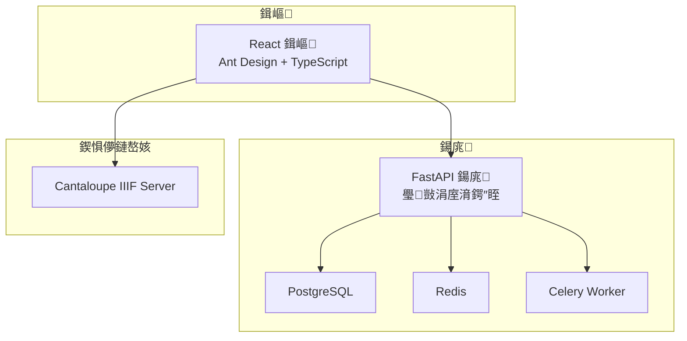
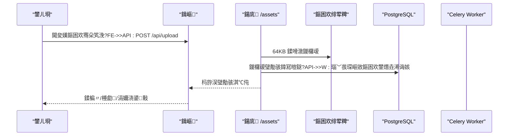

# 椤圭洰姒傝堪

<cite>
**鏈枃寮曠敤鐨勬枃浠?*
- [README.md](file://README.md)
- [docs/README.md](file://docs/README.md)
- [docs/01-鎬昏/PROJECT_STATUS.md](file://docs/01-鎬昏/PROJECT_STATUS.md)
- [docs/02-鏋舵瀯璁捐/API_ROUTE_MAP.md](file://docs/02-鏋舵瀯璁捐/API_ROUTE_MAP.md)
- [docs/03-浜у搧涓庢祦绋?USER_ROLE_PERMISSION_MATRIX.md](file://docs/03-浜у搧涓庢祦绋?USER_ROLE_PERMISSION_MATRIX.md)
- [SYSTEM_ARCHITECTURE.md](file://SYSTEM_ARCHITECTURE.md)
- [ARCHITECTURE.md](file://ARCHITECTURE.md)
- [backend/app/main.py](file://backend/app/main.py)
- [frontend/src/App.tsx](file://frontend/src/App.tsx)
- [backend/app/routers/assets.py](file://backend/app/routers/assets.py)
- [backend/app/routers/applications.py](file://backend/app/routers/applications.py)
- [backend/app/routers/three_d.py](file://backend/app/routers/three_d.py)
- [backend/app/routers/platform.py](file://backend/app/routers/platform.py)
- [backend/app/routers/auth.py](file://backend/app/routers/auth.py)
- [backend/requirements.txt](file://backend/requirements.txt)
- [frontend/package.json](file://frontend/package.json)
- [docker-compose.yml](file://docker-compose.yml)
</cite>

## 鐩綍
1. [绠€浠媇(#绠€浠?
2. [椤圭洰缁撴瀯](#椤圭洰缁撴瀯)
3. [鏍稿績缁勪欢](#鏍稿績缁勪欢)
4. [鏋舵瀯鎬昏](#鏋舵瀯鎬昏)
5. [璇︾粏缁勪欢鍒嗘瀽](#璇︾粏缁勪欢鍒嗘瀽)
6. [渚濊禆鍒嗘瀽](#渚濊禆鍒嗘瀽)
7. [鎬ц兘鑰冭檻](#鎬ц兘鑰冭檻)
8. [鏁呴殰鎺掓煡鎸囧崡](#鏁呴殰鎺掓煡鎸囧崡)
9. [缁撹](#缁撹)
10. [闄勫綍](#闄勫綍)

## 绠€浠?MDAMS 鍘熷瀷椤圭洰鏄竴涓潰鍚戦鍐呬笟鍔″満鏅殑鏁板瓧璧勬簮绠＄悊鍘熷瀷绯荤粺锛屽凡浠庘€滀簩缁村奖鍍忎笂浼?PoC鈥濇紨杩涗负鍖呭惈浜岀淮褰卞儚銆佷笁缁磋祫婧愩€佺粺涓€骞冲彴鐩綍銆佸埄鐢ㄧ敵璇锋祦绋嬨€佺櫥褰曟潈闄愭鏋跺湪鍐呯殑鍙寔缁紑鍙戝簳搴с€傚綋鍓嶉樁娈靛畾浣嶄负鈥滃彲绋冲畾杩愯銆佸彲鎸佺画杩唬銆佸彲鐢ㄤ簬婕旂ず涓庨獙璇佺殑棣嗗唴鏁板瓧璧勬簮绠＄悊鍘熷瀷鈥濄€傞」鐩鐩栬兘鍔涘寘鎷簩缁村奖鍍忚祫浜х鐞嗕笌 IIIF 棰勮銆佸浘鍍忚褰曞伐浣滄祦銆佷笁缁磋祫婧愮鐞嗐€佺粺涓€骞冲彴鐩綍涓庤鎯呫€佹潈闄愪笌鐧诲綍鎺у埗銆佸埄鐢ㄧ敵璇蜂笌浜や粯瀵煎嚭銆佸熀纭€娴嬭瘯浣撶郴绛夈€?
- 褰撳墠闃舵瀹氫綅锛氬師鍨嬮樁娈碉紝鍏峰婕旂ず涓庢寔缁紑鍙戣兘鍔涳紝灏氭湭杩涘叆瀹屾暣浜у搧鍖栦笌娌荤悊闃舵銆?- 宸茶鐩栬兘鍔涳細浜岀淮褰卞儚璧勪骇涓?IIIF 棰勮銆佸浘鍍忚褰曞伐浣滄祦銆佷笁缁磋祫婧愬璞′笌澶氭枃浠惰祫婧愬寘绠＄悊銆佺粺涓€骞冲彴鐩綍涓庣粺涓€璇︽儏銆佺櫥褰曘€佽鑹层€佹潈闄愪笌璐ｄ换鑼冨洿鎺у埗銆佽祫婧愮敵璇枫€佸鎵逛笌浜や粯瀵煎嚭銆佸熀纭€娴嬭瘯浣撶郴涓庡伐浣滄棩蹇椼€?- 鎶€鏈爤姒傝锛氬墠绔?React 18 + Vite + TypeScript + Ant Design锛涘悗绔?FastAPI + SQLAlchemy + Pydantic锛涙暟鎹簱 PostgreSQL锛涘紓姝ヤ换鍔?Celery + Redis锛涘浘鍍忔湇鍔?Cantaloupe IIIF Server锛涙祴璇?pytest + Playwright銆?
**绔犺妭鏉ユ簮**
- [README.md:1-213](file://README.md#L1-L213)
- [docs/01-鎬昏/PROJECT_STATUS.md:1-153](file://docs/01-鎬昏/PROJECT_STATUS.md#L1-L153)

## 椤圭洰缁撴瀯
椤圭洰閲囩敤鍓嶅悗绔垎绂讳笌瀹瑰櫒鍖栫紪鎺掞紝鏍稿績鐩綍涓庤亴璐ｅ涓嬶細
- backend锛欶astAPI 鍚庣 API銆佹湇鍔″眰銆佽剼鏈€佹祴璇曚笌閰嶇疆
- frontend锛歊eact 鍓嶇銆丳laywright 鍥炲綊娴嬭瘯銆侀潤鎬佽祫婧愪笌鏋勫缓閰嶇疆
- docs锛氶」鐩寮忔枃妗ｄ富鐩綍锛屾寜涓婚鍒嗗尯缁勭粐
- cantaloupe锛欳antaloupe IIIF 鍥惧儚鏈嶅姟鏋勫缓涓庨厤缃?- docker-compose.yml锛氬鍣ㄧ紪鎺掑畾涔夛紝鍖呭惈鍚庣銆佸墠绔€佹暟鎹簱銆丷edis銆丆antaloupe 绛夋湇鍔?- 鐜鍙橀噺涓庨儴缃诧細閫氳繃 .env 绀轰緥涓庨儴缃茶剼鏈繘琛屾湰鍦颁笌 CI/CD 閮ㄧ讲



**鍥捐〃鏉ユ簮**
- [docker-compose.yml:1-131](file://docker-compose.yml#L1-L131)
- [SYSTEM_ARCHITECTURE.md:16-34](file://SYSTEM_ARCHITECTURE.md#L16-L34)

**绔犺妭鏉ユ簮**
- [README.md:67-79](file://README.md#L67-L79)
- [docs/README.md:9-27](file://docs/README.md#L9-L27)

## 鏍稿績缁勪欢
- 浜岀淮褰卞儚璧勪骇涓?IIIF 棰勮锛氭敮鎸佷笂浼犮€佸垪琛ㄣ€佽鎯呫€佸垹闄ゃ€侀瑙堝浘銆佸師鏂囦欢涓?BagIt 涓嬭浇銆佽鐢熸枃浠剁瓥鐣ヤ笌 IIIF access 娴佺▼銆?- 鍥惧儚璁板綍宸ヤ綔娴侊細鏀寔璁板綍鍒涘缓銆佺紪杈戙€佹彁浜ゃ€侀€€鍥炪€佸緟涓婁紶姹犮€佹枃浠朵笂浼犱笌璁板綍鍖归厤銆佺粦瀹氬悗鍩虹鏍￠獙涓庨噸澶嶆娴嬨€?- 鍒╃敤鐢宠涓庝氦浠橈細鏀寔鐢宠杞︺€佺敵璇峰崟鍒涘缓銆佸鎵归€氳繃/鎷掔粷銆佸鍑轰氦浠樺寘銆?- 涓夌淮璧勬簮绠＄悊锛氭敮鎸佸璞′笌鐗堟湰绠＄悊銆佸鏂囦欢璧勬簮鍖呬笂浼犮€佹ā鍨?鐐逛簯/鍊炬枩鎽勫奖瑙掕壊鍖哄垎銆乄eb 鏌ョ湅鎽樿涓庡璞¤鎯呫€?- 缁熶竴骞冲彴鐩綍锛氭敮鎸佹潵婧愭敞鍐岃〃銆佹潵婧愭憳瑕佹帴鍙ｃ€佺粺涓€璧勬簮鐩綍銆佺粺涓€璧勬簮璇︽儏銆佹寜鐘舵€?绫诲瀷/profile/棰勮鑳藉姏绛涢€夈€?- 鏉冮檺涓庣櫥褰曪細鏀寔鍐呯疆娴嬭瘯鐢ㄦ埛涓庤鑹叉挱绉嶃€佺櫥褰?浼氳瘽/涓婁笅鏂囨帴鍙ｃ€佸墠绔彍鍗曟寜瑙掕壊瑁佸壀銆佸悗绔潈闄愭牎楠屼笌鑼冨洿鎺у埗銆乧ollection_owner 璐ｄ换鑼冨洿杩囨护銆?
**绔犺妭鏉ユ簮**
- [README.md:9-48](file://README.md#L9-L48)
- [docs/01-鎬昏/PROJECT_STATUS.md:21-98](file://docs/01-鎬昏/PROJECT_STATUS.md#L21-L98)

## 鏋舵瀯鎬昏
绯荤粺閲囩敤寰湇鍔℃灦鏋勶紝鍓嶅悗绔垎绂伙紝瀹瑰櫒鍖栭儴缃层€傚墠绔€氳繃 Nginx 鍙嶅悜浠ｇ悊璁块棶鍚庣 API 涓?IIIF 鍥惧儚鏈嶅姟锛屽悗绔繛鎺?PostgreSQL 瀛樺偍缁撴瀯鍖栧厓鏁版嵁锛屾枃浠剁郴缁熷瓨鍌ㄩ潪缁撴瀯鍖栧ぇ鏂囦欢锛堝浘鍍忥級锛孋antaloupe 鎻愪緵 IIIF 鍥惧儚鏈嶅姟涓庣紦瀛樸€?
```mermaid
graph TB
Browser["娴忚鍣?] --> Nginx["Nginx 鍙嶅悜浠ｇ悊"]
Nginx --> FE["React 鍓嶇"]
Nginx --> API["FastAPI 鍚庣"]
API --> DB["PostgreSQL"]
API --> NAS["NAS 鏂囦欢瀛樺偍"]
Browser --> IIIF["Cantaloupe IIIF 鏈嶅姟"]
IIIF --> NAS
```

**鍥捐〃鏉ユ簮**
- [ARCHITECTURE.md:7-50](file://ARCHITECTURE.md#L7-L50)
- [SYSTEM_ARCHITECTURE.md:22-34](file://SYSTEM_ARCHITECTURE.md#L22-L34)

**绔犺妭鏉ユ簮**
- [ARCHITECTURE.md:1-90](file://ARCHITECTURE.md#L1-L90)
- [SYSTEM_ARCHITECTURE.md:1-119](file://SYSTEM_ARCHITECTURE.md#L1-L119)

## 璇︾粏缁勪欢鍒嗘瀽

### 浜岀淮褰卞儚璧勪骇绠＄悊锛坅ssets锛?- 鑳藉姏鑼冨洿锛氫笂浼犮€佸垪琛ㄣ€佽鎯呫€佸垹闄ゃ€侀瑙堝浘銆佸師鏂囦欢涓?BagIt 涓嬭浇銆佽鐢熸枃浠剁瓥鐣ヤ笌 IIIF access 娴佺▼銆?- 鍏抽敭瀹炵幇锛氬悗绔矾鐢辨彁渚涗笂浼犳帴鍙ｏ紝閲囩敤 64KB 鍒嗗潡鍐欏叆绛栫暐闄嶄綆鍐呭瓨鍗犵敤锛涚敓鎴愰瑙堝浘涓庡厓鏁版嵁灞傦紱瑙﹀彂寮傛琛嶇敓鏂囦欢鐢熸垚浠诲姟锛涙潈闄愭帶鍒跺熀浜?visibility_scope 涓?collection_object_id銆?- 鍓嶇闆嗘垚锛氬墠绔〃鏍煎睍绀鸿祫浜у垪琛紝鏀寔棰勮涓庝笅杞斤紱鐧诲綍涓婁笅鏂囬┍鍔ㄨ彍鍗曚笌鏉冮檺銆?


**鍥捐〃鏉ユ簮**
- [backend/app/routers/assets.py:54-133](file://backend/app/routers/assets.py#L54-L133)
- [backend/app/tasks.py](file://backend/app/tasks.py)

**绔犺妭鏉ユ簮**
- [backend/app/routers/assets.py:1-292](file://backend/app/routers/assets.py#L1-L292)
- [frontend/src/App.tsx:213-251](file://frontend/src/App.tsx#L213-L251)

### 鍥惧儚璁板綍宸ヤ綔娴侊紙image-records锛?- 鑳藉姏鑼冨洿锛氳褰曞垱寤?缂栬緫/鎻愪氦/閫€鍥炪€佸緟涓婁紶姹犮€佹枃浠朵笂浼犲垎鏋愩€佹槑纭粦瀹?鏇挎崲銆佸熀纭€鏍￠獙涓庨噸澶嶆娴嬨€?- 鍏抽敭瀹炵幇锛氳褰曚笌璧勪骇缁戝畾銆侀噸澶嶆娴嬶紙鍩轰簬 SHA256锛夈€佺姸鎬佹祦杞紙鑽夌/寰呬笂浼?宸蹭笂浼犲緟楠岃瘉/灏辩华锛夈€佸璁¤建杩硅褰曘€?- 鍓嶇闆嗘垚锛氬浘鍍忚褰曞伐浣滃彴銆佸緟涓婁紶姹犲睍绀轰笌鎿嶄綔銆?
```mermaid
flowchart TD
Start(["寮€濮?]) --> Create["鍒涘缓/缂栬緫璁板綍"]
Create --> Submit["鎻愪氦璁板綍"]
Submit --> Review{"鏄惁閫氳繃瀹℃牳?"}
Review --> |鍚 Return["閫€鍥炲苟淇敼"]
Review --> |鏄瘄 Ready["杩涘叆寰呬笂浼犳睜"]
Ready --> Upload["鎽勫奖甯堜笂浼犳枃浠?]
Upload --> Match["鏂囦欢涓庤褰曞尮閰?]
Match --> Bind{"鏄惁缁戝畾鎴愬姛?"}
Bind --> |鏄瘄 Validate["鍩虹鏍￠獙涓庨噸澶嶆娴?]
Validate --> Done(["瀹屾垚"])
Bind --> |鍚 Retry["閲嶆柊鍖归厤/鏇挎崲"]
Retry --> Match
```

**鍥捐〃鏉ユ簮**
- [backend/app/routers/image_records.py:1-800](file://backend/app/routers/image_records.py#L1-L800)

**绔犺妭鏉ユ簮**
- [docs/01-鎬昏/PROJECT_STATUS.md:34-44](file://docs/01-鎬昏/PROJECT_STATUS.md#L34-L44)
- [backend/app/routers/image_records.py:1-800](file://backend/app/routers/image_records.py#L1-L800)

### 鍒╃敤鐢宠涓庝氦浠橈紙applications锛?- 鑳藉姏鑼冨洿锛氱敵璇疯溅銆佺敵璇峰崟鍒涘缓銆佸鎵归€氳繃/鎷掔粷銆佸鍑轰氦浠樺寘銆?- 鍏抽敭瀹炵幇锛氱敵璇峰崟鐘舵€佹満锛坰ubmitted/approved/rejected/fulfilled锛夈€佷氦浠樺寘鎵撳寘涓庝笅杞姐€佹潈闄愭帶鍒讹紙鍒涘缓/瀹℃壒/瀵煎嚭锛夈€?- 鍓嶇闆嗘垚锛氱敵璇疯溅缁勪欢銆佺敵璇风鐞嗛〉闈€佸鎵逛笌瀵煎嚭鎿嶄綔銆?
```mermaid
sequenceDiagram
participant U as "鐢ㄦ埛"
participant FE as "鍓嶇"
participant API as "鍚庣 /applications"
participant DB as "PostgreSQL"
U->>FE : 娣诲姞璧勬簮鍒扮敵璇疯溅
FE->>API : POST /api/applications
API->>DB : 淇濆瓨鐢宠鍗曚笌鏉＄洰
U->>FE : 鎻愪氦鐢宠
FE->>API : 瀹℃壒/鎷掔粷
API->>DB : 鏇存柊鐘舵€?U->>FE : 瀵煎嚭浜や粯鍖?FE->>API : GET /api/applications/{id}/export
API-->>FE : ZIP 鍖呬笅杞?```

**鍥捐〃鏉ユ簮**
- [backend/app/routers/applications.py:132-254](file://backend/app/routers/applications.py#L132-L254)

**绔犺妭鏉ユ簮**
- [docs/01-鎬昏/PROJECT_STATUS.md:46-55](file://docs/01-鎬昏/PROJECT_STATUS.md#L46-L55)
- [backend/app/routers/applications.py:1-254](file://backend/app/routers/applications.py#L1-L254)
- [frontend/src/App.tsx:307-402](file://frontend/src/App.tsx#L307-L402)

### 涓夌淮璧勬簮绠＄悊锛坱hree-d锛?- 鑳藉姏鑼冨洿锛氬璞′笌鐗堟湰绠＄悊銆佸鏂囦欢涓婁紶銆佹ā鍨?鐐逛簯/鍊炬枩鎽勫奖瑙掕壊鍖哄垎銆乄eb 鏌ョ湅鎽樿涓庡璞¤鎯呫€佷笅杞戒笌鎵撳寘銆?- 鍏抽敭瀹炵幇锛氳祫婧愮粍涓庣増鏈帶鍒躲€佹枃浠惰鑹叉帹鏂笌涓绘枃浠堕€夋嫨銆佸厓鏁版嵁瀛楀吀涓庣敓浜ц褰曠瀛愩€乄eb 棰勮鐘舵€佺鐞嗐€?- 鍓嶇闆嗘垚锛氫笁缁寸鐞嗛〉闈€佹煡鐪嬪櫒鎽樿涓庤鎯呫€?
```mermaid
flowchart TD
Upload["涓婁紶澶氭枃浠?] --> Role["鎺ㄦ柇鏂囦欢瑙掕壊"]
Role --> Profile["纭畾璧勬簮绫诲瀷涓庢。妗堥敭"]
Profile --> Meta["鏋勫缓鍏冩暟鎹眰"]
Meta --> Manifest["鐢熸垚鍖呮竻鍗?]
Manifest --> Save["淇濆瓨璧勬簮涓庢枃浠惰褰?]
Save --> Preview["鐢熸垚/鏇存柊棰勮鐘舵€?]
Preview --> Done["瀹屾垚"]
```

**鍥捐〃鏉ユ簮**
- [backend/app/routers/three_d.py:371-636](file://backend/app/routers/three_d.py#L371-L636)

**绔犺妭鏉ユ簮**
- [docs/01-鎬昏/PROJECT_STATUS.md:57-67](file://docs/01-鎬昏/PROJECT_STATUS.md#L57-L67)
- [backend/app/routers/three_d.py:1-742](file://backend/app/routers/three_d.py#L1-L742)

### 缁熶竴骞冲彴鐩綍锛坧latform锛?- 鑳藉姏鑼冨洿锛氭潵婧愭敞鍐岃〃銆佺粺涓€璧勬簮鐩綍銆佺粺涓€璧勬簮璇︽儏銆佹寜鏉′欢绛涢€夈€?- 鍏抽敭瀹炵幇锛氬钩鍙伴€傞厤鍣ㄦ敞鍐屼笌鑱氬悎銆佺粺涓€璧勬簮 ID 瑙ｆ瀽銆佽法鏉ユ簮璧勬簮鍚堝苟涓庢帓搴忋€?- 鍓嶇闆嗘垚锛氱粺涓€璧勬簮鐩綍涓庤鎯呴〉闈€?
```mermaid
sequenceDiagram
participant FE as "鍓嶇"
participant API as "鍚庣 /platform"
participant REG as "骞冲彴娉ㄥ唽琛?
participant AD as "閫傞厤鍣?
FE->>API : GET /api/platform/resources
API->>REG : 鑾峰彇鎵€鏈夐€傞厤鍣?loop 閬嶅巻閫傞厤鍣?API->>AD : list_unified_resources(...)
AD-->>API : 璧勬簮鍒楄〃
end
API-->>FE : 鍚堝苟鍚庣殑璧勬簮鍒楄〃
```

**鍥捐〃鏉ユ簮**
- [backend/app/routers/platform.py:20-48](file://backend/app/routers/platform.py#L20-L48)

**绔犺妭鏉ユ簮**
- [docs/01-鎬昏/PROJECT_STATUS.md:68-78](file://docs/01-鎬昏/PROJECT_STATUS.md#L68-L78)
- [backend/app/routers/platform.py:1-65](file://backend/app/routers/platform.py#L1-L65)

### 鏉冮檺涓庣櫥褰曪紙auth锛?- 鑳藉姏鑼冨洿锛氬唴缃祴璇曠敤鎴蜂笌瑙掕壊鎾銆佺櫥褰?浼氳瘽/涓婁笅鏂囨帴鍙ｃ€佸墠绔彍鍗曟寜瑙掕壊瑁佸壀銆佸悗绔潈闄愭牎楠屼笌鑼冨洿鎺у埗銆?- 鍏抽敭瀹炵幇锛氳鑹插埌鏉冮檺鏄犲皠銆乧ollection_scope 璐ｄ换鑼冨洿杩囨护銆佹潈闄愭敞瑙ｄ笌涓婁笅鏂囧簭鍒楀寲銆?- 鍓嶇闆嗘垚锛氱櫥褰曢〉銆佽彍鍗曞彲瑙佹€с€佽鑹叉爣绛句笌璁よ瘉妯″紡鏄剧ず銆?
```mermaid
sequenceDiagram
participant U as "鐢ㄦ埛"
participant FE as "鍓嶇"
participant API as "鍚庣 /auth"
participant DB as "PostgreSQL"
U->>FE : 杈撳叆鐢ㄦ埛鍚?瀵嗙爜
FE->>API : POST /api/auth/login
API->>DB : 鏍￠獙鐢ㄦ埛骞跺垱寤轰細璇?API-->>FE : 杩斿洖 Token 涓庝笂涓嬫枃
FE->>API : GET /api/auth/context
API-->>FE : 杩斿洖鏉冮檺涓庤寖鍥?FE-->>U : 娓叉煋鑿滃崟涓庡姛鑳?```

**鍥捐〃鏉ユ簮**
- [backend/app/routers/auth.py:53-83](file://backend/app/routers/auth.py#L53-L83)
- [frontend/src/App.tsx:150-205](file://frontend/src/App.tsx#L150-L205)

**绔犺妭鏉ユ簮**
- [docs/03-浜у搧涓庢祦绋?USER_ROLE_PERMISSION_MATRIX.md:12-96](file://docs/03-浜у搧涓庢祦绋?USER_ROLE_PERMISSION_MATRIX.md#L12-L96)
- [backend/app/routers/auth.py:1-83](file://backend/app/routers/auth.py#L1-L83)
- [frontend/src/App.tsx:116-139](file://frontend/src/App.tsx#L116-L139)

## 渚濊禆鍒嗘瀽
- 鎶€鏈爤渚濊禆锛氬墠绔?React 18 + Vite + TypeScript + Ant Design锛涘悗绔?FastAPI + SQLAlchemy + Pydantic锛涙暟鎹簱 PostgreSQL锛涘紓姝ヤ换鍔?Celery + Redis锛涘浘鍍忔湇鍔?Cantaloupe IIIF Server锛涙祴璇?pytest + Playwright銆?- 瀹瑰櫒缂栨帓锛歞ocker-compose 瀹氫箟鍚庣銆佸墠绔€佹暟鎹簱銆丷edis銆丆antaloupe 鏈嶅姟鍙婂叾绔彛鏄犲皠涓庣幆澧冨彉閲忋€?- 鍚庣渚濊禆锛歳equirements.txt 鎸囧畾 FastAPI銆丼QLAlchemy銆丳ydantic銆丆elery銆丷edis銆丳illow銆乴ibvips銆丱penCV銆丱NNX Runtime銆両nsightFace 绛夈€?
```mermaid
graph LR
FE["鍓嶇渚濊禆<br/>React + AntD + Axios"] --> API["鍚庣渚濊禆<br/>FastAPI + SQLAlchemy + Pydantic"]
API --> DB["PostgreSQL"]
API --> REDIS["Redis"]
API --> CELERY["Celery"]
API --> IIIF["Cantaloupe IIIF"]
FE --> TEST["娴嬭瘯<br/>Playwright"]
API --> TEST2["娴嬭瘯<br/>pytest"]
```

**鍥捐〃鏉ユ簮**
- [frontend/package.json:13-26](file://frontend/package.json#L13-L26)
- [backend/requirements.txt:1-18](file://backend/requirements.txt#L1-L18)
- [docker-compose.yml:1-131](file://docker-compose.yml#L1-L131)

**绔犺妭鏉ユ簮**
- [README.md:56-66](file://README.md#L56-L66)
- [backend/requirements.txt:1-18](file://backend/requirements.txt#L1-L18)
- [frontend/package.json:1-42](file://frontend/package.json#L1-L42)
- [docker-compose.yml:1-131](file://docker-compose.yml#L1-L131)

## 鎬ц兘鑰冭檻
- 鍓嶇鏋勫缓浼樺寲锛氶拡瀵?N100 浣庡唴瀛樼幆澧冭皟鏁?Node 鏋勫缓鍙傛暟锛屽噺灏戝唴瀛樺崰鐢ㄣ€?- 鍚庣涓婁紶浼樺寲锛氶噰鐢?64KB 鍒嗗潡娴佸紡鍐欏叆锛岄伩鍏嶅ぇ鏂囦欢涓婁紶鏃剁殑鍐呭瓨宄板€笺€?- 鍥惧儚鏈嶅姟浼樺寲锛欳antaloupe 绂佺敤鍫嗗唴瀛樼紦瀛橈紝浣跨敤鏂囦欢绯荤粺缂撳瓨锛岀粨鍚堟湰鍦?SSD 涓?NAS 鐨勬贩鍚堝瓨鍌紝骞宠　鎬ц兘涓庢垚鏈€?- 鏁版嵁搴撴€ц兘锛歅ostgreSQL 浣跨敤鏈湴 NVMe SSD 瀛樺偍锛屾彁鍗囨煡璇㈡€ц兘銆?
**绔犺妭鏉ユ簮**
- [SYSTEM_ARCHITECTURE.md:38-68](file://SYSTEM_ARCHITECTURE.md#L38-L68)

## 鏁呴殰鎺掓煡鎸囧崡
- 鍋ュ悍妫€鏌ヤ笌灏辩华妫€鏌ワ細閫氳繃 /health 涓?/ready 鎺ュ彛杩涜绯荤粺鍋ュ悍鐘舵€佹鏌ャ€?- 鏃ュ織涓庤皟璇曪細鍓嶇鐧诲綍椤典笌浠〃鐩樻彁渚涜璇佷笂涓嬫枃涓庤彍鍗曞彲瑙佹€т俊鎭紝渚夸簬瀹氫綅鏉冮檺涓庤鑹查棶棰樸€?- 閰嶇疆涓庣幆澧冨彉閲忥細纭繚 HOST_MUSEUM_PATH銆丏ATABASE_URL銆丷EDIS_URL銆丄PI_PUBLIC_URL銆丆ANTALOUPE_PUBLIC_URL 绛夊彉閲忔纭缃€?- 閮ㄧ讲涓庤繍缁达細鍙傝€冮儴缃叉枃妗ｄ笌鎺掗殰鎸囧崡锛屽叧娉ㄧ鍙ｆ槧灏勩€佸鍣ㄤ緷璧栦笌瀛樺偍鎸傝浇銆?
**绔犺妭鏉ユ簮**
- [docs/01-鎬昏/PROJECT_STATUS.md:99-108](file://docs/01-鎬昏/PROJECT_STATUS.md#L99-L108)
- [README.md:81-118](file://README.md#L81-L118)

## 缁撹
MDAMS 鍘熷瀷椤圭洰宸插畬鎴愪粠鍗曚竴浜岀淮褰卞儚涓婁紶 PoC 鍒板寘鍚簩缁村奖鍍忋€佷笁缁磋祫婧愩€佺粺涓€骞冲彴鐩綍銆佸埄鐢ㄧ敵璇锋祦绋嬩笌鏉冮檺鐧诲綍妗嗘灦鐨勫師鍨嬬郴缁熸紨杩涖€傚綋鍓嶇郴缁熷浜庘€滃彲绋冲畾杩愯銆佸彲鎸佺画杩唬銆佸彲鐢ㄤ簬婕旂ず涓庨獙璇佲€濈殑闃舵锛屽叿澶囨竻鏅扮殑妯″潡杈圭晫涓庡熀纭€娴嬭瘯鏀拺銆傚悗缁彲鍦ㄧ粺涓€妫€绱笌鏇村鏉ユ簮鎺ュ叆銆佷笁缁磋鑼冨寲涓庡吋瀹规€с€佹潈闄愪笌娌荤悊鑳藉姏绛夋柟闈㈢户缁畬鍠勩€?
## 闄勫綍
- 蹇€熷紑濮嬶細澶嶅埗 .env.example 涓?.env锛岃缃繀瑕佺幆澧冨彉閲忥紝浣跨敤 docker compose 鍚姩锛岃闂墠绔笌鍚庣 API 鏂囨。銆?- 甯哥敤寮€鍙戝懡浠わ細鍓嶇 npm run dev/build/test锛屽悗绔?python -m pytest锛涗篃鍙湪鏈満鍚姩鐙珛 PostgreSQL 娴嬭瘯搴撹繘琛屾祴璇曘€?- 鏂囨。鍏ュ彛锛歞ocs/README.md 鎻愪緵鎸変富棰樺垎鍖虹殑鏂囨。绱㈠紩涓庡缓璁槄璇婚『搴忋€?
**绔犺妭鏉ユ簮**
- [README.md:81-169](file://README.md#L81-L169)
- [docs/README.md:28-76](file://docs/README.md#L28-L76)
