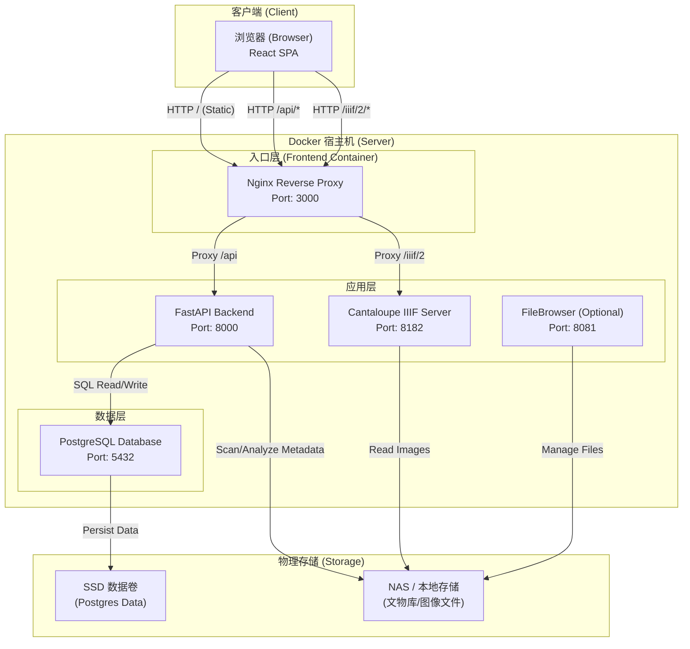
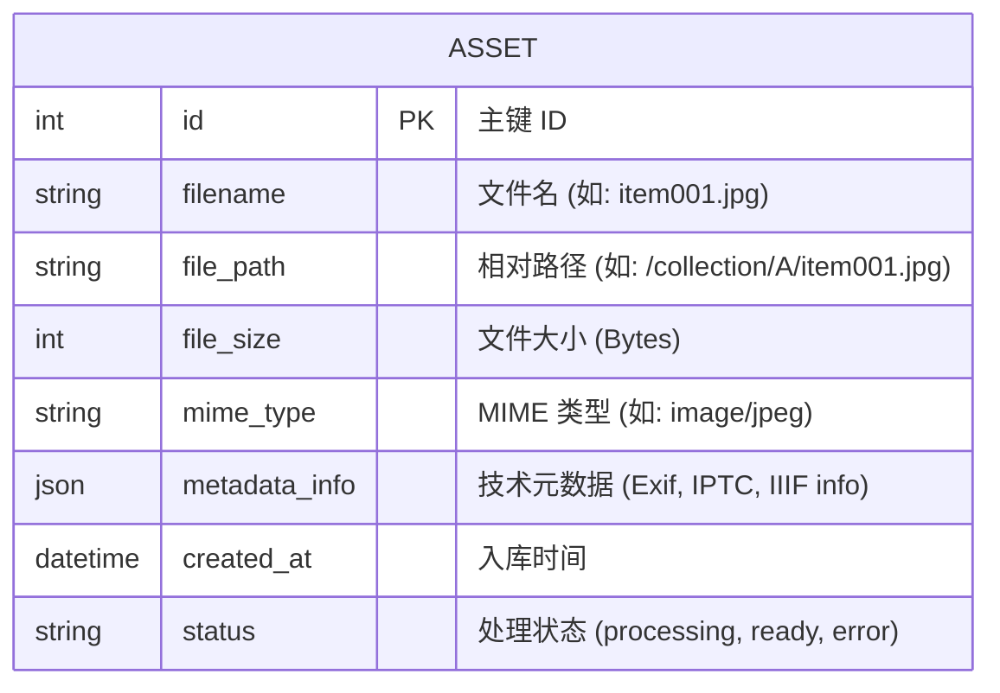

# MEAM 项目架构文档

## 1. 系统架构图 (System Architecture)

该图展示了系统的各个容器组件、网络流向以及它们与底层存储的交互关系。

## 2. 核心数据结构 (Core Data Structure)

系统以 **Asset (资产)** 为核心实体，采用 PostgreSQL 存储结构化元数据，而将非结构化的大型文件（图像）存储在文件系统中。

### 字段详细说明

*   **`file_path`**: 存储的是相对于挂载点（`/sunjing/project/文物库`）的路径，而不是绝对路径。这使得系统在不同环境下迁移更灵活。
*   **`metadata_info` (JSON)**: 这是一个灵活的 JSONB 字段，用于存储提取出的非结构化数据，例如：
    *   `width`: 图像宽度 (px)
    *   `height`: 图像高度 (px)
    *   `format`: 原始格式
    *   `exif`: 拍摄设备信息等
*   **`status`**: 
    *   `processing`: 正在提取元数据或生成缓存
    *   `ready`: 资产已就绪，可正常访问
    *   `error`: 处理过程中出错

## 3. 关键交互流程

1.  **资产入库**: 
    *   Backend 扫描 NAS 目录 -> 创建 `Asset` 记录 (Status: `processing`) -> 提取元数据 -> 更新 `Asset` (Status: `ready`)。
2.  **图像浏览**:
    *   前端请求 `/api/assets` -> Backend 查询 DB 返回 JSON 列表。
    *   前端请求高清图 -> 构造 IIIF URL (`/iiif/2/...`) -> Nginx 转发给 Cantaloupe -> Cantaloupe 读取 NAS 文件 -> 动态裁剪/缩放 -> 返回图片数据。
