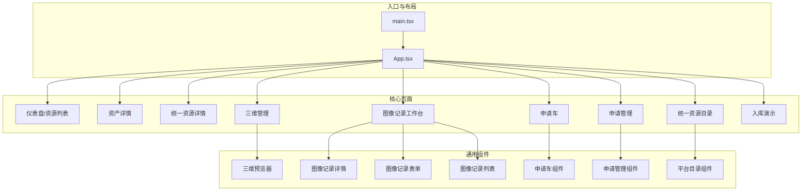
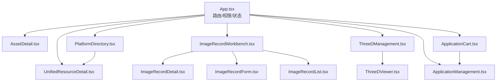
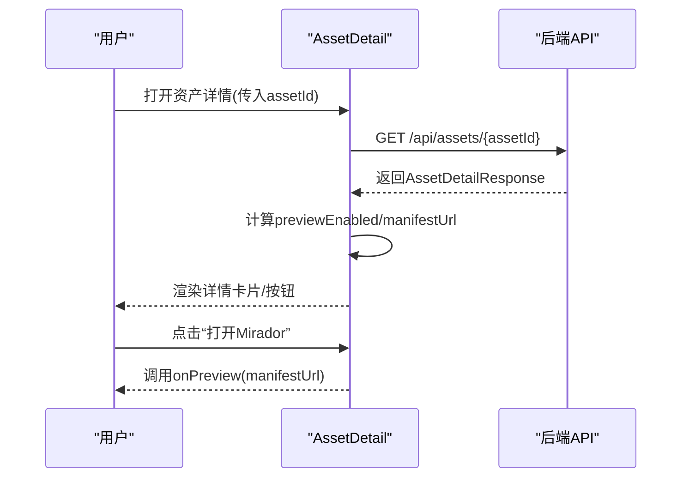
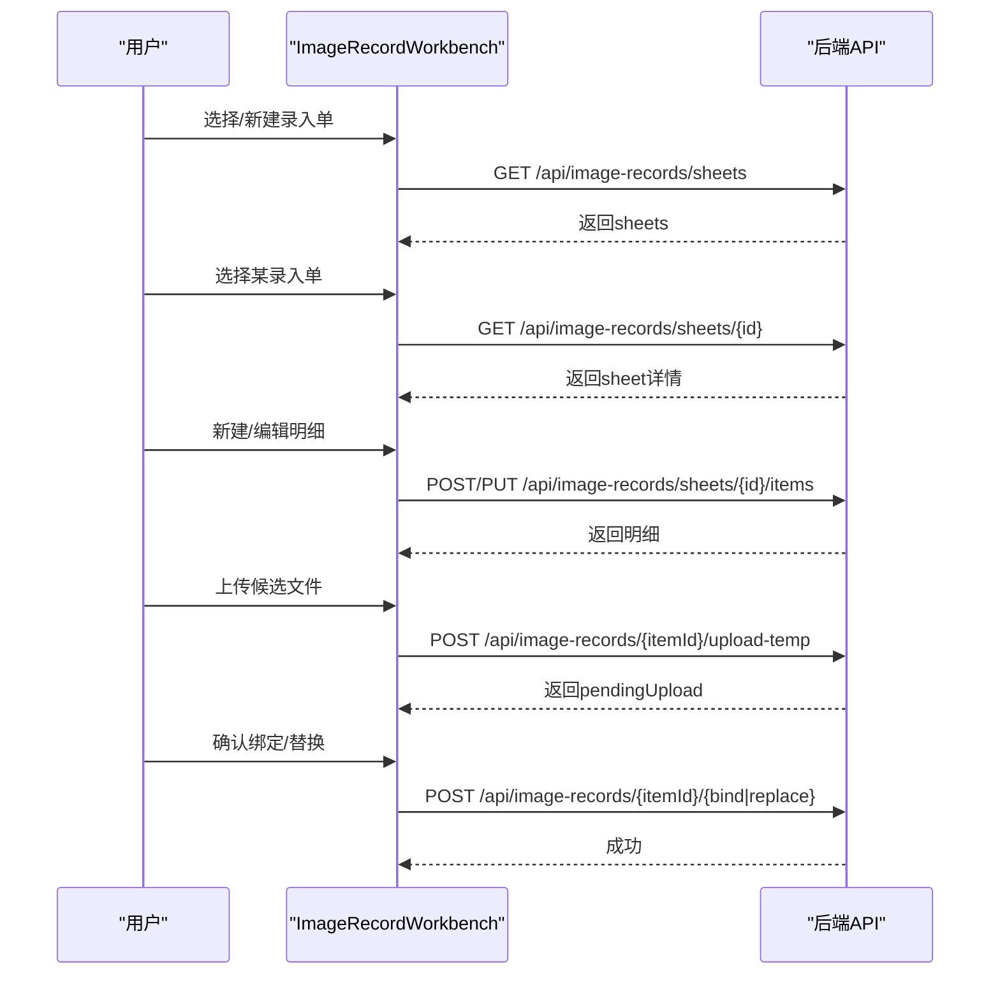
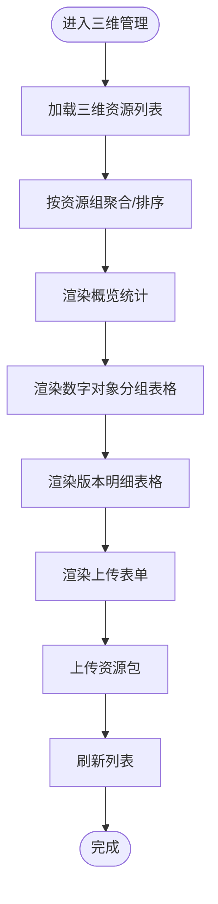
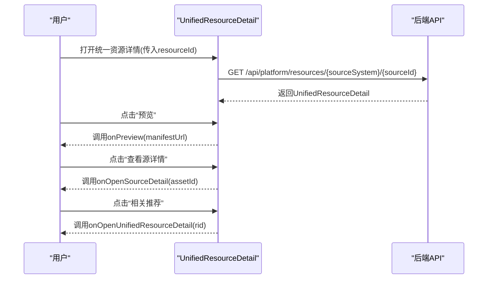
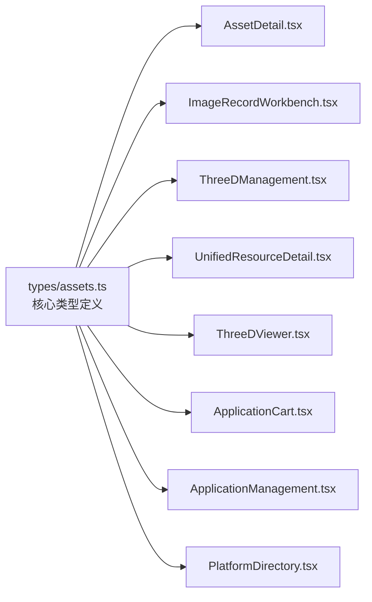

# 前端组件详解

<cite>
**本文引用的文件**
- [frontend/src/components/AssetDetail.tsx](file://frontend/src/components/AssetDetail.tsx)
- [frontend/src/components/ImageRecordWorkbench.tsx](file://frontend/src/components/ImageRecordWorkbench.tsx)
- [frontend/src/components/ThreeDManagement.tsx](file://frontend/src/components/ThreeDManagement.tsx)
- [frontend/src/components/UnifiedResourceDetail.tsx](file://frontend/src/components/UnifiedResourceDetail.tsx)
- [frontend/src/components/ThreeDViewer.tsx](file://frontend/src/components/ThreeDViewer.tsx)
- [frontend/src/components/ImageRecordDetail.tsx](file://frontend/src/components/ImageRecordDetail.tsx)
- [frontend/src/components/ImageRecordForm.tsx](file://frontend/src/components/ImageRecordForm.tsx)
- [frontend/src/components/ImageRecordList.tsx](file://frontend/src/components/ImageRecordList.tsx)
- [frontend/src/components/ApplicationCart.tsx](file://frontend/src/components/ApplicationCart.tsx)
- [frontend/src/components/ApplicationManagement.tsx](file://frontend/src/components/ApplicationManagement.tsx)
- [frontend/src/components/PlatformDirectory.tsx](file://frontend/src/components/PlatformDirectory.tsx)
- [frontend/src/components/IngestDemo.tsx](file://frontend/src/components/IngestDemo.tsx)
- [frontend/src/types/assets.ts](file://frontend/src/types/assets.ts)
- [frontend/src/App.tsx](file://frontend/src/App.tsx)
- [frontend/src/main.tsx](file://frontend/src/main.tsx)
</cite>

## 目录
1. [简介](#简介)
2. [项目结构](#项目结构)
3. [核心组件](#核心组件)
4. [架构总览](#架构总览)
5. [详细组件分析](#详细组件分析)
6. [依赖分析](#依赖分析)
7. [性能考虑](#性能考虑)
8. [故障排查指南](#故障排查指南)
9. [结论](#结论)
10. [附录](#附录)

## 简介
本文件面向 MDAMS 原型项目的前端组件系统，聚焦于资产详情、图像记录工作台、三维管理、统一资源详情等关键 UI 组件。文档从 props 接口、事件处理、状态管理、样式定制、组件通信、可复用性与扩展性、样式系统、国际化与本地化、最佳实践与性能优化等方面进行系统化梳理，并提供可视化图示与使用场景说明，帮助开发者快速理解与高效复用。

## 项目结构
前端采用基于功能域的模块化组织，核心组件位于 components 目录，类型定义集中在 types 目录，应用入口在 main.tsx 中挂载 App 根组件。各功能页面通过 App 的侧边栏路由切换呈现。

图表来源
- [frontend/src/main.tsx:1-11](file://frontend/src/main.tsx#L1-L11)
- [frontend/src/App.tsx:100-905](file://frontend/src/App.tsx#L100-L905)
- [frontend/src/components/AssetDetail.tsx:194-488](file://frontend/src/components/AssetDetail.tsx#L194-L488)
- [frontend/src/components/UnifiedResourceDetail.tsx:86-470](file://frontend/src/components/UnifiedResourceDetail.tsx#L86-L470)
- [frontend/src/components/ImageRecordWorkbench.tsx:235-1214](file://frontend/src/components/ImageRecordWorkbench.tsx#L235-L1214)
- [frontend/src/components/ThreeDManagement.tsx:142-1043](file://frontend/src/components/ThreeDManagement.tsx#L142-L1043)
- [frontend/src/components/PlatformDirectory.tsx:31-273](file://frontend/src/components/PlatformDirectory.tsx#L31-L273)
- [frontend/src/components/ApplicationCart.tsx:22-131](file://frontend/src/components/ApplicationCart.tsx#L22-L131)
- [frontend/src/components/ApplicationManagement.tsx:27-293](file://frontend/src/components/ApplicationManagement.tsx#L27-L293)
- [frontend/src/components/IngestDemo.tsx:18-395](file://frontend/src/components/IngestDemo.tsx#L18-L395)
- [frontend/src/components/ThreeDViewer.tsx:31-129](file://frontend/src/components/ThreeDViewer.tsx#L31-L129)
- [frontend/src/components/ImageRecordDetail.tsx:42-261](file://frontend/src/components/ImageRecordDetail.tsx#L42-L261)
- [frontend/src/components/ImageRecordForm.tsx:81-246](file://frontend/src/components/ImageRecordForm.tsx#L81-L246)
- [frontend/src/components/ImageRecordList.tsx:104-173](file://frontend/src/components/ImageRecordList.tsx#L104-L173)

章节来源
- [frontend/src/main.tsx:1-11](file://frontend/src/main.tsx#L1-L11)
- [frontend/src/App.tsx:100-905](file://frontend/src/App.tsx#L100-L905)

## 核心组件
本节对四大关键组件进行深入解析：资产详情、图像记录工作台、三维管理、统一资源详情。重点覆盖 props 接口、状态管理、事件处理、数据渲染策略与交互行为。

- 资产详情（AssetDetail）
  - 功能：展示二维资产的生命周期、处理时间线、文件结构、技术元数据、分层元数据、访问与输出等。
  - 关键 props：assetId、onBack、onPreview。
  - 状态：detail、loading、error；内部维护 manifestUrl、previewEnabled 等派生状态。
  - 事件：点击“返回”触发 onBack；点击“打开 Mirador”调用 onPreview。
  - 数据来源：/api/assets/{assetId}；轮询处理中状态。
  - 渲染：卡片 + 描述列表 + 列表 + 分割线 + 按钮组；支持复制粘贴链接、下载等。
  - 复用性：以 props 驱动，可嵌入任意容器；通过 onBack/onPreview 与父组件解耦。

- 图像记录工作台（ImageRecordWorkbench）
  - 功能：批量化录入与管理图像记录，支持新建/编辑录入单、新增/编辑明细、上传候选文件、匹配资产、提交/退回等。
  - 关键 props：authContext、availableUsers。
  - 状态：sheetForm/itemForm、sheets、selectedSheet、selectedItem、loading、actionLoading、uploading 等。
  - 事件：保存录入单、保存明细、提交、退回、上传临时文件、确认绑定/替换。
  - 数据来源：/api/image-records/*、/api/image-records/sheets/*、/api/image-records/artifact-lookup。
  - 渲染：左右分栏布局，左侧录入单列表，右侧录入单头信息与明细表格；动态渲染 profile 字段。
  - 复用性：权限控制通过 authContext 注入；表单与表格均使用 Ant Design 组件，易于扩展。

- 三维管理（ThreeDManagement）
  - 功能：三维资源的上传、分组聚合、版本管理、Web 预览、下载与删除。
  - 关键 props：无（内部封装）。
  - 状态：items、loading、uploading、selectedModelFiles 等；分组聚合 groupColumns/versionColumns。
  - 事件：上传资源包、打开详情、下载、删除。
  - 数据来源：/api/three-d/resources、/api/three-d/collection-objects、/api/three-d/upload、/api/three-d/resources/{id}。
  - 渲染：概览统计 + 测试模型 + 上传表单 + 数字对象分组 + 版本明细 + 三维预览器。
  - 复用性：ThreeDViewer 作为子组件复用；分组逻辑抽取为工具函数，便于扩展。

- 统一资源详情（UnifiedResourceDetail）
  - 功能：统一平台视角下的资源详情，聚合生命周期、结构与文件、技术元数据、相关推荐等。
  - 关键 props：resourceId、onBack、onPreview、onOpenSourceDetail、onOpenUnifiedResourceDetail。
  - 状态：detail、loading、error、relatedResources、relatedLoading。
  - 事件：预览、查看 Manifest、下载、查看源详情。
  - 数据来源：/api/platform/resources/{resourceId}；相关推荐通过相同来源/类型的资源筛选。
  - 渲染：网格布局 + 卡片 + 列表 + 描述 + 预览图 + 相关推荐卡片网格。
  - 复用性：通过回调 onOpenSourceDetail/onOpenUnifiedResourceDetail 实现跨页面导航。

章节来源
- [frontend/src/components/AssetDetail.tsx:16-488](file://frontend/src/components/AssetDetail.tsx#L16-L488)
- [frontend/src/components/ImageRecordWorkbench.tsx:197-1214](file://frontend/src/components/ImageRecordWorkbench.tsx#L197-L1214)
- [frontend/src/components/ThreeDManagement.tsx:142-1043](file://frontend/src/components/ThreeDManagement.tsx#L142-L1043)
- [frontend/src/components/UnifiedResourceDetail.tsx:32-470](file://frontend/src/components/UnifiedResourceDetail.tsx#L32-L470)

## 架构总览
下图展示了组件间的数据流向与交互关系：App 作为根容器负责路由与权限控制，四大关键组件分别承担不同领域职责；子组件如 ThreeDViewer、ImageRecordDetail/Form/List、ApplicationCart/Management、PlatformDirectory 等提供通用能力与复用。

图表来源
- [frontend/src/App.tsx:100-905](file://frontend/src/App.tsx#L100-L905)
- [frontend/src/components/AssetDetail.tsx:194-488](file://frontend/src/components/AssetDetail.tsx#L194-L488)
- [frontend/src/components/UnifiedResourceDetail.tsx:86-470](file://frontend/src/components/UnifiedResourceDetail.tsx#L86-L470)
- [frontend/src/components/ImageRecordWorkbench.tsx:235-1214](file://frontend/src/components/ImageRecordWorkbench.tsx#L235-L1214)
- [frontend/src/components/ThreeDManagement.tsx:142-1043](file://frontend/src/components/ThreeDManagement.tsx#L142-L1043)
- [frontend/src/components/ThreeDViewer.tsx:31-129](file://frontend/src/components/ThreeDViewer.tsx#L31-L129)
- [frontend/src/components/ImageRecordDetail.tsx:42-261](file://frontend/src/components/ImageRecordDetail.tsx#L42-L261)
- [frontend/src/components/ImageRecordForm.tsx:81-246](file://frontend/src/components/ImageRecordForm.tsx#L81-L246)
- [frontend/src/components/ImageRecordList.tsx:104-173](file://frontend/src/components/ImageRecordList.tsx#L104-L173)
- [frontend/src/components/ApplicationCart.tsx:22-131](file://frontend/src/components/ApplicationCart.tsx#L22-L131)
- [frontend/src/components/ApplicationManagement.tsx:27-293](file://frontend/src/components/ApplicationManagement.tsx#L27-L293)
- [frontend/src/components/PlatformDirectory.tsx:31-273](file://frontend/src/components/PlatformDirectory.tsx#L31-L273)

## 详细组件分析

### 资产详情组件（AssetDetail）
- Props 接口
  - assetId: number
  - onBack: () => void
  - onPreview?: (manifestUrl: string) => void
- 状态管理
  - detail: AssetDetailResponse | null
  - loading: boolean
  - error: string | null
  - 内部派生：previewEnabled、manifestUrl
- 事件处理
  - 加载失败/无数据时显示提示并提供返回按钮
  - 预览按钮根据 previewEnabled 与 manifestUrl 控制可用性
- 数据渲染
  - 资源基础信息、生命周期、处理时间线、文件结构（主文件/原始文件/衍生文件）、打包信息
  - 技术元数据、分层元数据（核心/共享管理/技术/类型专属/原始元数据）
  - 访问与输出（Manifest 地址、下载链接、打开 Mirador）
- 可复用性
  - 通过 onBack/onPreview 与上层解耦，适合内嵌到统一资源详情或平台目录
- 性能
  - 处理中状态定时轮询，避免频繁刷新；格式化函数与 memo 化减少重渲染

图表来源
- [frontend/src/components/AssetDetail.tsx:194-488](file://frontend/src/components/AssetDetail.tsx#L194-L488)

章节来源
- [frontend/src/components/AssetDetail.tsx:16-488](file://frontend/src/components/AssetDetail.tsx#L16-L488)

### 图像记录工作台（ImageRecordWorkbench）
- Props 接口
  - authContext: AuthContext
  - availableUsers: AuthUserSummary[]
- 状态管理
  - 表单：sheetForm、itemForm
  - 列表：sheets、selectedSheet、selectedItem、selectedItemId
  - 加载：loadingSheets、loadingSheetDetail、loadingItemDetail、savingSheet、savingItem、actionLoading、uploading、sampleLoading、lookupLoading
  - 采样与查询：sampleOptions、lookupHint
- 事件处理
  - 新建/保存录入单、新建/保存明细、提交/退回、上传临时文件、确认绑定/替换
  - 文物号查询与自动填充
- 数据渲染
  - 录入单列表 + 录入单头信息表单 + 明细表格（含状态标签）
  - 动态 profile 字段渲染（按影像类型切换）
- 可复用性
  - ImageRecordDetail/Form/List 子组件解耦，便于独立复用
  - 权限控制通过 authContext 注入，适配多角色

图表来源
- [frontend/src/components/ImageRecordWorkbench.tsx:235-1214](file://frontend/src/components/ImageRecordWorkbench.tsx#L235-L1214)

章节来源
- [frontend/src/components/ImageRecordWorkbench.tsx:197-1214](file://frontend/src/components/ImageRecordWorkbench.tsx#L197-L1214)
- [frontend/src/components/ImageRecordDetail.tsx:14-261](file://frontend/src/components/ImageRecordDetail.tsx#L14-L261)
- [frontend/src/components/ImageRecordForm.tsx:56-246](file://frontend/src/components/ImageRecordForm.tsx#L56-L246)
- [frontend/src/components/ImageRecordList.tsx:16-173](file://frontend/src/components/ImageRecordList.tsx#L16-L173)

### 三维管理（ThreeDManagement）
- Props 接口：无（内部封装）
- 状态管理
  - items、loading、uploading、selectedModelFiles/PointCloudFiles/ObliqueFiles
  - detailOpen/detail、collectionObjects、sampleModelUrl、form
- 事件处理
  - 上传资源包（多文件类型）、打开详情、下载、删除
  - 选择示例模型并使用 ThreeDViewer 预览
- 数据渲染
  - 概览统计（对象数/版本数/可展示对象/文件总数）
  - 数字对象分组表格 + 版本明细表格
  - 上传表单（标题/资源组/版本/Web 展示/模板类型/技术参数/保存信息等）
- 可复用性
  - ThreeDViewer 作为子组件复用，支持本地/远程示例模型
  - 分组聚合逻辑抽取为工具函数，便于扩展

图表来源
- [frontend/src/components/ThreeDManagement.tsx:142-1043](file://frontend/src/components/ThreeDManagement.tsx#L142-L1043)
- [frontend/src/components/ThreeDViewer.tsx:31-129](file://frontend/src/components/ThreeDViewer.tsx#L31-L129)

章节来源
- [frontend/src/components/ThreeDManagement.tsx:142-1043](file://frontend/src/components/ThreeDManagement.tsx#L142-L1043)
- [frontend/src/components/ThreeDViewer.tsx:25-129](file://frontend/src/components/ThreeDViewer.tsx#L25-L129)

### 统一资源详情（UnifiedResourceDetail）
- Props 接口
  - resourceId: string
  - onBack: () => void
  - onPreview?: (manifestUrl: string) => void
  - onOpenSourceDetail?: (assetId: number) => void
  - onOpenUnifiedResourceDetail?: (resourceId: string) => void
- 状态管理
  - detail、loading、error、relatedResources、relatedLoading
- 事件处理
  - 预览、查看 Manifest、下载、查看源详情、查看相关推荐
- 数据渲染
  - 左侧预览图 + 右侧卡片信息（标题/来源/分类/状态/预览/更新时间/操作）
  - 生命周期、结构与文件、技术元数据、相关推荐卡片网格
- 可复用性
  - 通过回调 onOpenSourceDetail/onOpenUnifiedResourceDetail 与平台目录联动

图表来源
- [frontend/src/components/UnifiedResourceDetail.tsx:86-470](file://frontend/src/components/UnifiedResourceDetail.tsx#L86-L470)

章节来源
- [frontend/src/components/UnifiedResourceDetail.tsx:32-470](file://frontend/src/components/UnifiedResourceDetail.tsx#L32-L470)

### 三维预览器（ThreeDViewer）
- Props 接口
  - viewer: ThreeDDetailResponse['viewer'] | null | undefined
  - title?: string
  - onOpenPreview?: (url: string) => void
- 渲染逻辑
  - 当 viewer.enabled 且存在 previewUrl 时渲染 model-viewer 预览
  - 不可用时显示提示与候选文件信息
  - 支持打开预览文件、下载预览文件、新标签页打开

章节来源
- [frontend/src/components/ThreeDViewer.tsx:25-129](file://frontend/src/components/ThreeDViewer.tsx#L25-L129)

### 图像记录详情/表单/列表（ImageRecordDetail/Form/List）
- ImageRecordDetail
  - 展示记录状态、验证结果、管理元数据、profile 元数据、上传与匹配区域
- ImageRecordForm
  - 根据 profile_key 动态渲染专属字段；保存草稿
- ImageRecordList
  - 列表展示与搜索/筛选；打开详情

章节来源
- [frontend/src/components/ImageRecordDetail.tsx:14-261](file://frontend/src/components/ImageRecordDetail.tsx#L14-L261)
- [frontend/src/components/ImageRecordForm.tsx:56-246](file://frontend/src/components/ImageRecordForm.tsx#L56-L246)
- [frontend/src/components/ImageRecordList.tsx:16-173](file://frontend/src/components/ImageRecordList.tsx#L16-L173)

### 申请车与申请管理（ApplicationCart/ApplicationManagement）
- ApplicationCart
  - 申请车列表、申请信息表单、批量备注；提交申请单
- ApplicationManagement
  - 申请单列表、状态筛选、批量审批/拒绝/导出；弹窗填写审批说明

章节来源
- [frontend/src/components/ApplicationCart.tsx:8-131](file://frontend/src/components/ApplicationCart.tsx#L8-L131)
- [frontend/src/components/ApplicationManagement.tsx:10-293](file://frontend/src/components/ApplicationManagement.tsx#L10-L293)

### 平台目录（PlatformDirectory）
- 功能：统一资源目录检索与展示，来源汇总，预览/统一详情/来源详情跳转
- 关键 props：onPreview、onOpenAssetDetail、onOpenUnifiedResourceDetail

章节来源
- [frontend/src/components/PlatformDirectory.tsx:25-273](file://frontend/src/components/PlatformDirectory.tsx#L25-L273)

### 入库演示（IngestDemo）
- 功能：客户端入库处理演示（Web Worker + 哈希计算 + 元数据提取 + SIP 上传 + 服务端校验）
- 关键 props：onViewManifest、onOpenAssetDetail
- 事件：选择文件、开始处理、上传 SIP、查看结果

章节来源
- [frontend/src/components/IngestDemo.tsx:13-395](file://frontend/src/components/IngestDemo.tsx#L13-L395)

## 依赖分析
- 组件耦合
  - App 作为根容器，通过 props 将权限上下文与导航回调注入各页面组件
  - 子组件之间通过回调解耦（onPreview/onOpen*），降低直接依赖
- 外部依赖
  - Ant Design UI 组件库用于布局与交互
  - axios 用于前后端通信
  - model-viewer 用于三维预览
- 类型系统
  - types/assets.ts 定义了资产、图像记录、三维资源、统一资源、应用等核心类型，保证组件间数据契约一致

图表来源
- [frontend/src/types/assets.ts:1-621](file://frontend/src/types/assets.ts#L1-L621)
- [frontend/src/components/AssetDetail.tsx:5-12](file://frontend/src/components/AssetDetail.tsx#L5-L12)
- [frontend/src/components/ImageRecordWorkbench.tsx:27-38](file://frontend/src/components/ImageRecordWorkbench.tsx#L27-L38)
- [frontend/src/components/ThreeDManagement.tsx:25-26](file://frontend/src/components/ThreeDManagement.tsx#L25-L26)
- [frontend/src/components/UnifiedResourceDetail.tsx:23-28](file://frontend/src/components/UnifiedResourceDetail.tsx#L23-L28)
- [frontend/src/components/ThreeDViewer.tsx:5](file://frontend/src/components/ThreeDViewer.tsx#L5)
- [frontend/src/components/ApplicationCart.tsx:4](file://frontend/src/components/ApplicationCart.tsx#L4)
- [frontend/src/components/ApplicationManagement.tsx:6](file://frontend/src/components/ApplicationManagement.tsx#L6)
- [frontend/src/components/PlatformDirectory.tsx:5](file://frontend/src/components/PlatformDirectory.tsx#L5)

章节来源
- [frontend/src/types/assets.ts:1-621](file://frontend/src/types/assets.ts#L1-L621)

## 性能考虑
- 状态与渲染优化
  - 使用 useMemo/memo 化派生状态与复杂计算（如文件大小格式化、标签颜色映射）
  - 列表与表格分页/懒加载，避免一次性渲染大量节点
- 网络与轮询
  - 处理中状态定时轮询（3 秒），静默刷新避免阻塞 UI
  - 批量请求合并（目录页同时获取 sources 与 resources）
- 资源加载
  - 图像缩略图懒加载，占位图降级
  - 三维预览器按需加载 model-viewer
- 客户端处理
  - 入库演示使用 Web Worker 进行哈希与元数据提取，避免主线程阻塞

## 故障排查指南
- 加载失败
  - 资产详情/统一资源详情：捕获 axios 错误，显示友好提示并提供返回按钮
  - 图像记录工作台：消息提示加载失败并清空数据
- 权限不足
  - App 中通过 can(...) 判断权限，未授权时隐藏菜单项与操作按钮
- 上传/匹配问题
  - 上传临时文件失败时提示并保留 pendingUpload 信息；确认绑定/替换失败时提示并保持状态
- 三维预览不可用
  - 当前版本未标记为 Web 展示时显示警告，引导切换到可展示版本或下载文件

章节来源
- [frontend/src/components/AssetDetail.tsx:199-250](file://frontend/src/components/AssetDetail.tsx#L199-L250)
- [frontend/src/components/UnifiedResourceDetail.tsx:99-178](file://frontend/src/components/UnifiedResourceDetail.tsx#L99-L178)
- [frontend/src/components/ImageRecordWorkbench.tsx:558-593](file://frontend/src/components/ImageRecordWorkbench.tsx#L558-L593)
- [frontend/src/components/ThreeDViewer.tsx:115-124](file://frontend/src/components/ThreeDViewer.tsx#L115-L124)

## 结论
MDAMS 原型前端组件系统以清晰的职责划分与良好的解耦设计为核心，围绕资产详情、图像记录工作台、三维管理、统一资源详情构建了完整的 UI 生态。通过类型系统、权限注入、回调驱动与子组件复用，系统具备良好的可维护性与扩展性。建议在后续迭代中进一步完善国际化与主题系统、增强组件插槽与高阶组件抽象，并持续优化网络与渲染性能。

## 附录
- 组件使用最佳实践
  - 优先通过 props 与回调解耦，避免直接依赖 DOM 或全局状态
  - 对复杂计算与派生状态使用 useMemo/useCallback 缓存
  - 对长列表与大图采用懒加载与分页策略
  - 对网络错误与权限不足提供明确的用户反馈
- 样式系统与主题
  - 项目采用 Ant Design 组件库，遵循其默认样式体系
  - 可通过主题变量与 CSS 变量进行定制，建议在 index.css 中集中管理
- 国际化与本地化
  - 组件文本以中文为主，建议引入 i18n 方案并在类型与文案处预留键值映射
- 性能优化建议
  - 对高频渲染区域使用 React.memo 与 keys 优化
  - 对网络请求使用防抖/节流与缓存策略
  - 对大文件与三维模型采用渐进式加载与预览策略