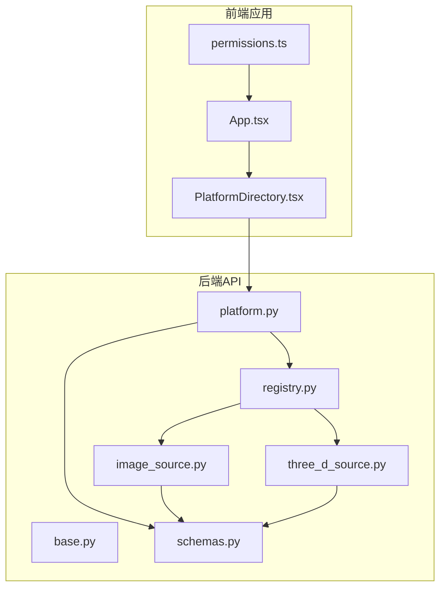
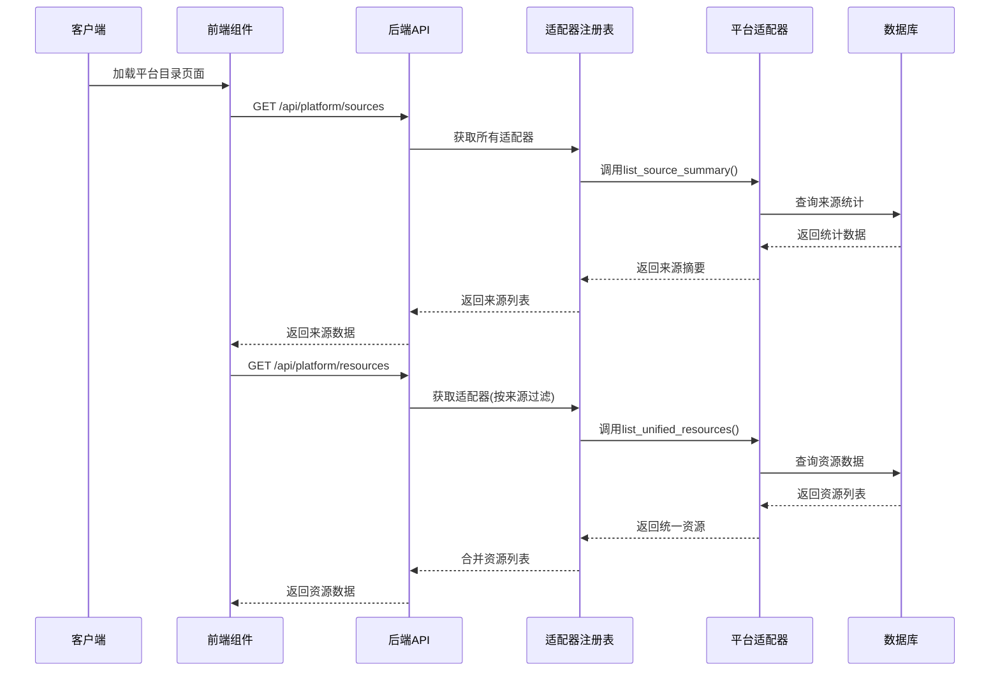
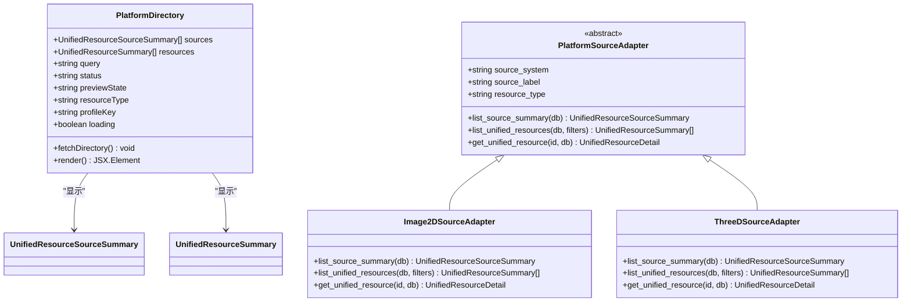
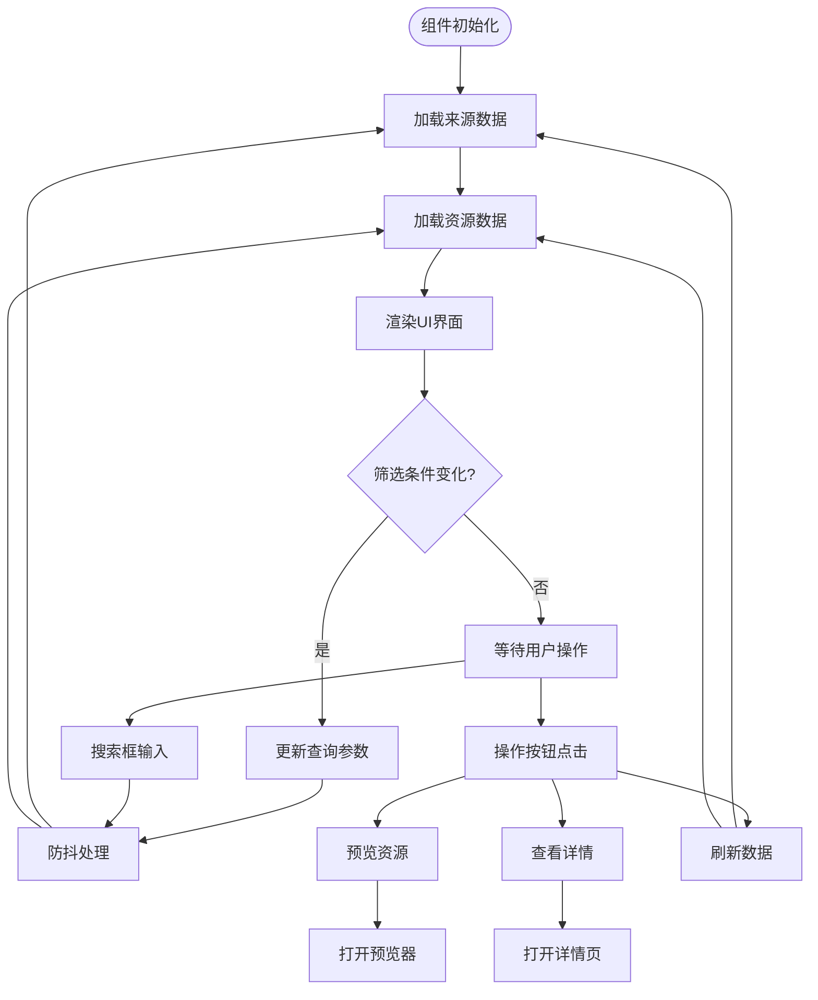
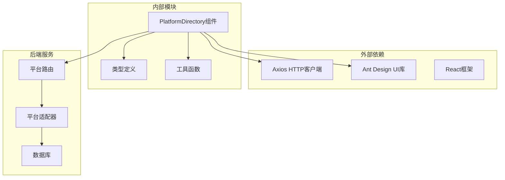

# 平台目录组件

<cite>
**本文引用的文件**
- [PlatformDirectory.tsx](file://frontend/src/components/PlatformDirectory.tsx)
- [platform.py](file://backend/app/routers/platform.py)
- [base.py](file://backend/app/platform/base.py)
- [registry.py](file://backend/app/platform/registry.py)
- [image_source.py](file://backend/app/platform/image_source.py)
- [three_d_source.py](file://backend/app/platform/three_d_source.py)
- [schemas.py](file://backend/app/schemas.py)
- [permissions.ts](file://frontend/src/auth/permissions.ts)
- [App.tsx](file://frontend/src/App.tsx)
- [API_ROUTE_MAP.md](file://docs/02-架构设计/API_ROUTE_MAP.md)
- [test_platform_directory.py](file://backend/tests/test_platform_directory.py)
</cite>

## 目录
1. [简介](#简介)
2. [项目结构](#项目结构)
3. [核心组件](#核心组件)
4. [架构概览](#架构概览)
5. [详细组件分析](#详细组件分析)
6. [依赖分析](#依赖分析)
7. [性能考虑](#性能考虑)
8. [故障排除指南](#故障排除指南)
9. [结论](#结论)
10. [附录](#附录)

## 简介
平台目录组件是统一平台的核心入口，负责展示和管理来自多个子系统的统一资源目录。该组件提供了统一的目录树结构、平台列表展示、平台详情查看、搜索过滤、以及与后端API的完整交互能力。组件支持多维度筛选（状态、预览能力、资源类型、模板），并集成了权限控制和访问限制机制。

## 项目结构
平台目录组件位于前端src/components目录下，后端路由位于backend/app/routers目录中，采用前后端分离的架构设计：

**图表来源**
- [PlatformDirectory.tsx:1-273](file://frontend/src/components/PlatformDirectory.tsx#L1-L273)
- [platform.py:1-65](file://backend/app/routers/platform.py#L1-L65)
- [base.py:1-42](file://backend/app/platform/base.py#L1-L42)

**章节来源**
- [PlatformDirectory.tsx:1-273](file://frontend/src/components/PlatformDirectory.tsx#L1-L273)
- [platform.py:1-65](file://backend/app/routers/platform.py#L1-L65)

## 核心组件
平台目录组件采用React函数式组件设计，集成了Ant Design UI组件库，提供了完整的资源目录管理功能：

### 组件架构设计
- **状态管理**: 使用React Hooks进行状态管理，包括资源数据、过滤条件、加载状态等
- **数据获取**: 通过Axios异步获取平台来源和资源数据
- **UI渲染**: 基于Ant Design的卡片、表格、描述列表等组件构建
- **事件处理**: 支持搜索、筛选、预览、详情查看等用户交互

### 数据模型
组件使用统一的资源数据模型，包括：
- 统一资源来源摘要：包含来源系统标识、标签、资源类型、健康状态等
- 统一资源摘要：包含资源ID、标题、状态、预览能力、更新时间等
- 统一资源详情：包含来源详情链接、源记录等扩展信息

**章节来源**
- [PlatformDirectory.tsx:25-44](file://frontend/src/components/PlatformDirectory.tsx#L25-L44)
- [schemas.py:147-177](file://backend/app/schemas.py#L147-L177)

## 架构概览
平台目录组件采用分层架构设计，实现了清晰的职责分离：

**图表来源**
- [platform.py:15-48](file://backend/app/routers/platform.py#L15-L48)
- [registry.py:8-20](file://backend/app/platform/registry.py#L8-L20)
- [image_source.py:36-47](file://backend/app/platform/image_source.py#L36-L47)

## 详细组件分析

### 组件类结构

**图表来源**
- [PlatformDirectory.tsx:25-273](file://frontend/src/components/PlatformDirectory.tsx#L25-L273)
- [base.py:14-41](file://backend/app/platform/base.py#L14-L41)
- [image_source.py:196-227](file://backend/app/platform/image_source.py#L196-L227)
- [three_d_source.py:192-223](file://backend/app/platform/three_d_source.py#L192-L223)

### 数据流处理
组件实现了完整的数据流处理机制：

**图表来源**
- [PlatformDirectory.tsx:45-76](file://frontend/src/components/PlatformDirectory.tsx#L45-L76)
- [PlatformDirectory.tsx:119-149](file://frontend/src/components/PlatformDirectory.tsx#L119-L149)

### 搜索和过滤功能
组件提供了多维度的搜索和过滤功能：

#### 搜索功能
- **关键词搜索**: 支持在标题、文件名、MIME类型、资源标识等字段中搜索
- **模糊匹配**: 实现了全文本搜索，支持部分匹配
- **实时搜索**: 输入时自动触发搜索，但带有防抖机制避免频繁请求

#### 过滤功能
- **状态过滤**: 支持就绪、处理中、异常三种状态
- **预览能力过滤**: 支持可预览和仅可下载两种能力
- **资源类型过滤**: 支持二维影像、三维模型、点云、倾斜摄影、三维包等
- **模板过滤**: 支持多种专业模板分类

**章节来源**
- [PlatformDirectory.tsx:160-226](file://frontend/src/components/PlatformDirectory.tsx#L160-L226)
- [image_source.py:110-130](file://backend/app/platform/image_source.py#L110-L130)
- [three_d_source.py:110-135](file://backend/app/platform/three_d_source.py#L110-L135)

### 平台管理操作
组件支持多种平台管理操作：

#### 资源操作
- **预览功能**: 通过IIIF协议提供资源预览
- **详情查看**: 打开统一资源详情页面
- **来源详情**: 查看具体来源系统的资源详情
- **批量操作**: 支持刷新、重置等批量操作

#### 用户体验优化
- **响应式设计**: 支持不同屏幕尺寸的自适应布局
- **加载状态**: 提供加载指示器和空状态处理
- **错误处理**: 包含完整的错误提示和恢复机制
- **键盘导航**: 支持键盘快捷键操作

**章节来源**
- [PlatformDirectory.tsx:119-149](file://frontend/src/components/PlatformDirectory.tsx#L119-L149)
- [App.tsx:741-772](file://frontend/src/App.tsx#L741-L772)

### 权限控制和访问限制
组件集成了完整的权限控制系统：

#### 前端权限控制
- **菜单权限**: 基于用户角色和权限决定菜单可见性
- **功能权限**: 控制具体功能按钮的显示和可用性
- **数据权限**: 限制用户可访问的数据范围

#### 后端权限控制
- **API访问控制**: 所有API端点都受到认证和授权保护
- **数据访问控制**: 基于用户集合范围限制数据访问
- **操作权限控制**: 严格验证用户的操作权限

**章节来源**
- [permissions.ts:84-102](file://frontend/src/auth/permissions.ts#L84-L102)
- [App.tsx:135-138](file://frontend/src/App.tsx#L135-L138)

### 与后端API的交互
组件通过RESTful API与后端进行数据交互：

#### API端点
- **来源数据**: `GET /api/platform/sources` - 获取平台来源汇总
- **资源列表**: `GET /api/platform/resources` - 获取统一资源列表
- **资源详情**: `GET /api/platform/resources/{source_system}/{source_id}` - 获取资源详情

#### 请求参数
- **q**: 搜索关键词
- **status**: 资源状态
- **resource_type**: 资源类型
- **profile_key**: 模板键
- **preview_enabled**: 预览能力开关
- **source_system**: 来源系统标识

#### 响应格式
- **来源摘要**: 包含系统标识、标签、资源数量、健康状态等
- **资源摘要**: 包含统一资源ID、标题、状态、预览能力等
- **资源详情**: 包含来源详情链接、源记录等

**章节来源**
- [platform.py:15-48](file://backend/app/routers/platform.py#L15-L48)
- [API_ROUTE_MAP.md:115-122](file://docs/02-架构设计/API_ROUTE_MAP.md#L115-L122)

## 依赖分析
平台目录组件的依赖关系清晰明确：

**图表来源**
- [PlatformDirectory.tsx:1-8](file://frontend/src/components/PlatformDirectory.tsx#L1-L8)
- [platform.py:1-12](file://backend/app/routers/platform.py#L1-L12)

### 组件耦合度
- **低耦合**: 前端组件与后端API通过标准化接口通信
- **高内聚**: 组件内部功能模块化，职责单一
- **可扩展性**: 基于适配器模式，易于添加新的平台来源

**章节来源**
- [base.py:14-41](file://backend/app/platform/base.py#L14-L41)
- [registry.py:8-20](file://backend/app/platform/registry.py#L8-L20)

## 性能考虑
平台目录组件在设计时充分考虑了性能优化：

### 前端性能优化
- **虚拟滚动**: 大数据量时使用虚拟滚动提升渲染性能
- **防抖机制**: 搜索输入采用防抖避免频繁请求
- **缓存策略**: 合理使用React.memo和useMemo避免不必要的重渲染
- **懒加载**: 图片和预览内容采用懒加载策略

### 后端性能优化
- **数据库索引**: 关键查询字段建立适当索引
- **分页查询**: 默认分页避免一次性返回大量数据
- **并发处理**: 使用Promise.all并行获取多个数据源
- **结果排序**: 在数据库层面进行排序减少前端处理

### 缓存策略
- **HTTP缓存**: 利用浏览器缓存机制
- **内存缓存**: 组件内部缓存最近查询结果
- **服务端缓存**: 后端适配器层缓存统计信息

## 故障排除指南
常见问题及解决方案：

### 数据加载问题
- **症状**: 页面空白或长时间加载
- **原因**: API请求失败或网络连接问题
- **解决**: 检查网络连接，查看浏览器开发者工具中的网络面板

### 权限访问问题
- **症状**: 无法看到某些功能或数据
- **原因**: 用户权限不足
- **解决**: 检查用户角色和权限配置，联系系统管理员

### 搜索功能异常
- **症状**: 搜索结果不准确或无结果
- **原因**: 搜索关键词格式问题或数据未完全索引
- **解决**: 尝试简化搜索关键词，等待数据索引完成

### 预览功能问题
- **症状**: 预览无法正常显示
- **原因**: IIIF服务不可用或资源状态异常
- **解决**: 检查IIIF服务状态，确认资源预览能力

**章节来源**
- [PlatformDirectory.tsx:38-70](file://frontend/src/components/PlatformDirectory.tsx#L38-L70)
- [test_platform_directory.py:38-107](file://backend/tests/test_platform_directory.py#L38-L107)

## 结论
平台目录组件是一个功能完整、架构清晰的统一资源管理组件。它成功地将多个子系统的资源进行统一聚合，提供了直观易用的用户界面和强大的搜索过滤功能。组件采用现代化的技术栈和最佳实践，具有良好的可扩展性和维护性。

组件的主要优势包括：
- **统一入口**: 为用户提供统一的资源访问入口
- **灵活过滤**: 支持多维度的搜索和筛选
- **权限控制**: 完整的权限管理和访问控制
- **响应式设计**: 优秀的用户体验和跨设备兼容性
- **可扩展架构**: 基于适配器模式，易于添加新平台来源

## 附录

### 最佳实践
1. **权限管理**: 始终在前端和后端同时实施权限控制
2. **错误处理**: 实现完善的错误处理和用户反馈机制
3. **性能监控**: 建立性能监控指标，定期评估组件性能
4. **测试覆盖**: 保持充足的单元测试和集成测试覆盖率
5. **文档维护**: 及时更新技术文档和用户指南

### 维护指南
1. **代码审查**: 建立严格的代码审查流程
2. **版本管理**: 使用语义化版本控制，明确变更日志
3. **依赖更新**: 定期更新第三方依赖，关注安全补丁
4. **性能优化**: 持续监控和优化组件性能表现
5. **用户反馈**: 建立用户反馈机制，持续改进用户体验