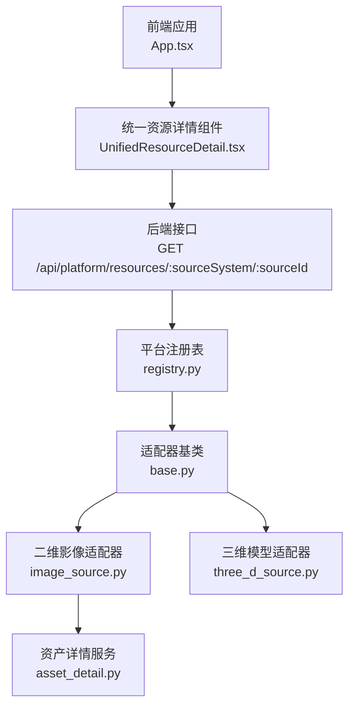
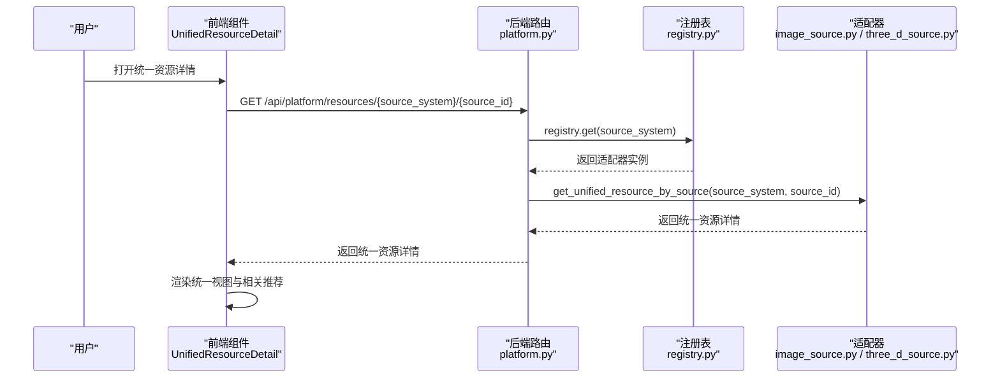
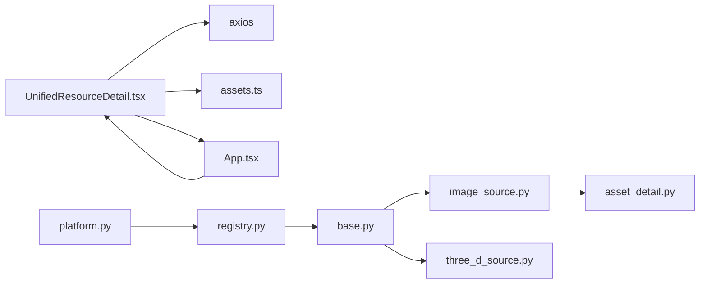

# 统一资源详情

<cite>
**本文引用的文件**
- [UnifiedResourceDetail.tsx](file://frontend/src/components/UnifiedResourceDetail.tsx)
- [assets.ts](file://frontend/src/types/assets.ts)
- [App.tsx](file://frontend/src/App.tsx)
- [platform.py](file://backend/app/routers/platform.py)
- [registry.py](file://backend/app/platform/registry.py)
- [base.py](file://backend/app/platform/base.py)
- [image_source.py](file://backend/app/platform/image_source.py)
- [three_d_source.py](file://backend/app/platform/three_d_source.py)
- [asset_detail.py](file://backend/app/services/asset_detail.py)
- [permissions.ts](file://frontend/src/auth/permissions.ts)
</cite>

## 目录
1. [简介](#简介)
2. [项目结构](#项目结构)
3. [核心组件](#核心组件)
4. [架构总览](#架构总览)
5. [组件详解](#组件详解)
6. [依赖关系分析](#依赖关系分析)
7. [性能考量](#性能考量)
8. [故障排查指南](#故障排查指南)
9. [结论](#结论)
10. [附录](#附录)

## 简介
本文件围绕“统一资源详情”组件进行系统化文档化说明，目标是帮助开发者与产品人员理解该组件的设计理念、实现方式与扩展策略。组件通过统一抽象不同来源系统的资源，屏蔽后端差异，提供一致的用户交互体验；同时在前端层面实现多态渲染、状态管理、数据适配与权限集成，确保在不改变用户体验的前提下支持多种资源类型。

## 项目结构
- 前端组件位于 frontend/src/components，统一资源详情组件为 UnifiedResourceDetail.tsx。
- 类型定义位于 frontend/src/types/assets.ts，涵盖统一资源详情、源资源详情、生命周期、文件记录等。
- 应用入口 App.tsx 中负责路由切换与组件挂载，包含对统一资源详情的调用逻辑。
- 后端提供统一资源接口 /api/platform/resources/{resource_id}，并由平台注册表与适配器模式对接多个来源系统（如二维影像、三维模型）。

图表来源
- [App.tsx:742-763](file://frontend/src/App.tsx#L742-L763)
- [UnifiedResourceDetail.tsx:99-150](file://frontend/src/components/UnifiedResourceDetail.tsx#L99-L150)
- [platform.py:51-65](file://backend/app/routers/platform.py#L51-L65)
- [registry.py:8-24](file://backend/app/platform/registry.py#L8-L24)
- [base.py:14-42](file://backend/app/platform/base.py#L14-L42)
- [image_source.py:196-227](file://backend/app/platform/image_source.py#L196-L227)
- [three_d_source.py:192-223](file://backend/app/platform/three_d_source.py#L192-L223)
- [asset_detail.py:189-200](file://backend/app/services/asset_detail.py#L189-L200)

章节来源
- [App.tsx:742-763](file://frontend/src/App.tsx#L742-L763)
- [UnifiedResourceDetail.tsx:86-467](file://frontend/src/components/UnifiedResourceDetail.tsx#L86-L467)
- [platform.py:12-65](file://backend/app/routers/platform.py#L12-L65)

## 核心组件
- 统一资源详情组件（UnifiedResourceDetail）
  - 职责：拉取统一资源详情、渲染统一视图、加载相关推荐、触发预览与下载等操作。
  - 多态渲染：根据资源类型与来源系统动态呈现不同区块（生命周期、结构与文件、技术元数据、相关推荐）。
  - 数据适配：将后端统一资源响应映射为前端展示所需字段，并兼容不同来源系统的差异。
  - 状态管理：加载中、错误、空数据三种状态，以及相关资源加载中的状态。
  - 可扩展性：通过资源类型映射与后端适配器扩展新资源类型。
  - 权限集成：通过应用上下文控制菜单与按钮可见性，结合后端接口鉴权。

章节来源
- [UnifiedResourceDetail.tsx:86-467](file://frontend/src/components/UnifiedResourceDetail.tsx#L86-L467)
- [assets.ts:426-429](file://frontend/src/types/assets.ts#L426-L429)

## 架构总览
统一资源详情的前后端交互遵循“统一接口 + 多源适配”的架构：
- 前端：统一资源详情组件通过 /api/platform/resources/{resource_id} 获取统一资源详情，再根据 detail.source_record 渲染源系统详情。
- 后端：平台路由聚合各适配器，适配器负责将源系统数据转换为统一资源响应。
- 注册表：集中管理适配器实例，按 source_system 分发请求。

图表来源
- [UnifiedResourceDetail.tsx:99-150](file://frontend/src/components/UnifiedResourceDetail.tsx#L99-L150)
- [platform.py:51-65](file://backend/app/routers/platform.py#L51-L65)
- [registry.py:15-16](file://backend/app/platform/registry.py#L15-L16)
- [image_source.py:154-193](file://backend/app/platform/image_source.py#L154-L193)
- [three_d_source.py:161-189](file://backend/app/platform/three_d_source.py#L161-L189)

## 组件详解

### 设计理念与多态渲染
- 统一抽象：前端通过统一资源类型（UnifiedResourceDetail）屏蔽来源差异，统一展示资源标识、标题、来源、分类、状态、预览与下载等关键信息。
- 多态渲染：根据 detail.source_record 是否存在，决定是否渲染源系统详情区块（生命周期、结构与文件、技术元数据）。对于某些来源系统（如三维模型），可能不直接提供源详情，组件仍保持一致的布局与交互。
- 资源类型映射：前端维护资源类型标签映射表，将后端资源类型字符串映射为中文标签，提升可读性。

章节来源
- [UnifiedResourceDetail.tsx:52-68](file://frontend/src/components/UnifiedResourceDetail.tsx#L52-L68)
- [UnifiedResourceDetail.tsx:155-166](file://frontend/src/components/UnifiedResourceDetail.tsx#L155-L166)

### 数据适配层
- 前端适配：组件接收后端统一资源详情，提取 source_record 并将其映射为前端展示字段；同时计算预览图片、生命周期列表、衍生文件列表等。
- 后端适配：适配器将源系统数据转换为统一资源响应，包括统一 ID、来源系统与标签、资源类型、预览状态、Manifest 地址、详情页地址、更新时间以及可选的源详情。
- 典型适配器：
  - 二维影像适配器：基于资产详情服务构建统一详情，预览状态由 IIIF 就绪状态决定。
  - 三维模型适配器：基于三维详情服务构建统一详情，预览状态由核心元数据与状态综合判断。

章节来源
- [UnifiedResourceDetail.tsx:155-166](file://frontend/src/components/UnifiedResourceDetail.tsx#L155-L166)
- [image_source.py:154-193](file://backend/app/platform/image_source.py#L154-L193)
- [three_d_source.py:161-189](file://backend/app/platform/three_d_source.py#L161-L189)
- [asset_detail.py:189-200](file://backend/app/services/asset_detail.py#L189-L200)

### 通用性设计
- 统一接口：前端通过统一资源接口获取数据，避免针对不同来源系统分别调用。
- 统一布局：卡片式网格布局与区块化展示，保证不同资源类型在视觉上的一致性。
- 功能开关：根据资源是否具备预览、下载等能力动态启用按钮，避免无效操作。
- 相关推荐：按来源系统与资源类型筛选相似资源，增强发现性。

章节来源
- [UnifiedResourceDetail.tsx:133-143](file://frontend/src/components/UnifiedResourceDetail.tsx#L133-L143)
- [UnifiedResourceDetail.tsx:307-351](file://frontend/src/components/UnifiedResourceDetail.tsx#L307-L351)

### 状态管理
- 加载状态：首次进入时显示加载提示，避免空白页面。
- 错误状态：捕获网络错误与后端错误，展示错误提示并提供返回按钮。
- 空状态：当后端未返回详情时，提示暂无数据。
- 相关资源加载：在 detail 变更后异步加载同来源同类型的资源，避免阻塞主详情渲染。

章节来源
- [UnifiedResourceDetail.tsx:93-118](file://frontend/src/components/UnifiedResourceDetail.tsx#L93-L118)
- [UnifiedResourceDetail.tsx:124-153](file://frontend/src/components/UnifiedResourceDetail.tsx#L124-L153)

### 可扩展性设计
- 新增资源类型步骤：
  1) 在后端新增适配器，实现 list_unified_resources 与 get_unified_resource，并注册到注册表。
  2) 在前端 assets.ts 中完善类型定义（如 UnifiedResourceDetail、UnifiedResourceSummary）。
  3) 在前端组件中补充资源类型标签映射与必要的展示逻辑。
- 适配器契约：通过适配器基类约束接口，确保新增适配器遵循统一规范。

章节来源
- [base.py:14-42](file://backend/app/platform/base.py#L14-L42)
- [registry.py:8-24](file://backend/app/platform/registry.py#L8-L24)
- [image_source.py:196-227](file://backend/app/platform/image_source.py#L196-L227)
- [three_d_source.py:192-223](file://backend/app/platform/three_d_source.py#L192-L223)

### 与权限系统的集成
- 前端权限：通过权限工具模块判断菜单可见性与功能按钮可用性，避免无权限用户看到不可用的操作。
- 后端鉴权：统一资源接口由平台路由处理，适配器内部可结合业务规则与鉴权上下文返回数据或抛出错误。
- 实践建议：在 App.tsx 中根据权限控制菜单项与按钮显隐，在组件内根据 detail 的可用字段动态启用/禁用操作按钮。

章节来源
- [permissions.ts:96-106](file://frontend/src/auth/permissions.ts#L96-L106)
- [App.tsx:692-702](file://frontend/src/App.tsx#L692-L702)

### 使用最佳实践与扩展指南
- 最佳实践
  - 统一资源 ID 规范：使用 “source_system:source_id” 的形式，便于后端解析与适配器定位。
  - 错误处理：始终处理 axios 错误与空数据场景，提供明确的用户提示与回退路径。
  - 性能优化：对相关推荐采用分页或数量限制，避免一次性加载过多数据。
  - 可访问性：为图片与按钮提供替代文本与键盘导航支持。
- 扩展指南
  - 新增来源系统：在后端注册适配器并实现统一资源接口；在前端完善类型与展示逻辑。
  - 新增资源类型：在前端补充资源类型标签映射；在后端适配器中正确设置资源类型与预览状态。
  - UI 一致性：保持区块标题、描述文案与按钮风格一致，减少认知负担。

章节来源
- [platform.py:51-65](file://backend/app/routers/platform.py#L51-L65)
- [image_source.py:154-193](file://backend/app/platform/image_source.py#L154-L193)
- [three_d_source.py:161-189](file://backend/app/platform/three_d_source.py#L161-L189)
- [UnifiedResourceDetail.tsx:52-68](file://frontend/src/components/UnifiedResourceDetail.tsx#L52-L68)

## 依赖关系分析
- 前端依赖
  - 组件依赖 Ant Design UI 组件库与图标库，用于布局、状态提示与交互按钮。
  - 组件依赖 axios 进行 HTTP 请求，类型定义来自 assets.ts。
  - 组件依赖 App.tsx 提供的回调函数（返回、预览、打开源详情、打开统一详情）。
- 后端依赖
  - 平台路由依赖注册表与适配器，适配器依赖服务层（如资产详情服务）。
  - 适配器依赖数据库模型与元数据层，将源系统数据转换为统一资源响应。

图表来源
- [UnifiedResourceDetail.tsx:1-28](file://frontend/src/components/UnifiedResourceDetail.tsx#L1-L28)
- [assets.ts:426-429](file://frontend/src/types/assets.ts#L426-L429)
- [App.tsx:742-763](file://frontend/src/App.tsx#L742-L763)
- [platform.py:12-65](file://backend/app/routers/platform.py#L12-L65)
- [registry.py:8-24](file://backend/app/platform/registry.py#L8-L24)
- [base.py:14-42](file://backend/app/platform/base.py#L14-L42)
- [image_source.py:14-18](file://backend/app/platform/image_source.py#L14-L18)
- [three_d_source.py:8-13](file://backend/app/platform/three_d_source.py#L8-L13)
- [asset_detail.py:1-24](file://backend/app/services/asset_detail.py#L1-L24)

章节来源
- [UnifiedResourceDetail.tsx:1-28](file://frontend/src/components/UnifiedResourceDetail.tsx#L1-L28)
- [assets.ts:426-429](file://frontend/src/types/assets.ts#L426-L429)
- [App.tsx:742-763](file://frontend/src/App.tsx#L742-L763)
- [platform.py:12-65](file://backend/app/routers/platform.py#L12-L65)

## 性能考量
- 异步加载：详情与相关推荐均采用异步加载，避免阻塞首屏渲染。
- 条件渲染：仅在 detail 存在时加载相关推荐，减少不必要的请求。
- 数据缓存：可在组件外层或全局状态管理中引入缓存策略，降低重复请求。
- 图片懒加载：预览图片在可视区域内再加载，减少初始带宽占用。
- 错误重试：在网络错误时提供重试机制，提升稳定性。

## 故障排查指南
- 常见问题
  - 统一资源详情为空：检查 resourceId 是否符合 “source_system:source_id” 格式；确认后端适配器是否存在对应资源。
  - 预览不可用：检查资源的预览状态字段与 Manifest 地址；确认后端适配器是否正确设置。
  - 相关推荐为空：确认同来源同类型的资源是否存在；检查后端过滤参数与查询条件。
  - 权限不足：确认用户权限与菜单可见性；检查后端接口鉴权逻辑。
- 排查步骤
  - 前端：打印 detail 与 relatedResources，检查字段完整性；查看网络面板中的请求与响应。
  - 后端：验证平台路由参数解析与适配器调用；检查服务层数据构建逻辑。

章节来源
- [UnifiedResourceDetail.tsx:99-150](file://frontend/src/components/UnifiedResourceDetail.tsx#L99-L150)
- [platform.py:51-65](file://backend/app/routers/platform.py#L51-L65)
- [image_source.py:154-193](file://backend/app/platform/image_source.py#L154-L193)
- [three_d_source.py:161-189](file://backend/app/platform/three_d_source.py#L161-L189)

## 结论
统一资源详情组件通过统一接口与多源适配，实现了跨系统的资源统一展示与一致交互体验。其多态渲染、状态管理与数据适配层设计，既保证了通用性，又为后续扩展提供了清晰路径。配合权限系统与后端鉴权，组件在安全性与可用性方面也具备良好基础。建议在实际落地中持续完善类型体系、错误处理与性能优化，以进一步提升稳定性与用户体验。

## 附录
- 关键接口
  - GET /api/platform/resources/{source_system}/{source_id}：获取统一资源详情
  - GET /api/platform/resources：按来源系统与资源类型筛选统一资源列表
- 关键类型
  - UnifiedResourceDetail：统一资源详情
  - UnifiedResourceSummary：统一资源摘要
  - AssetDetailResponse：源资源详情（二维影像）
  - ThreeDDetailResponse：源资源详情（三维模型）

章节来源
- [platform.py:20-65](file://backend/app/routers/platform.py#L20-L65)
- [assets.ts:426-429](file://frontend/src/types/assets.ts#L426-L429)
- [assets.ts:220-286](file://frontend/src/types/assets.ts#L220-L286)
- [assets.ts:488-611](file://frontend/src/types/assets.ts#L488-L611)