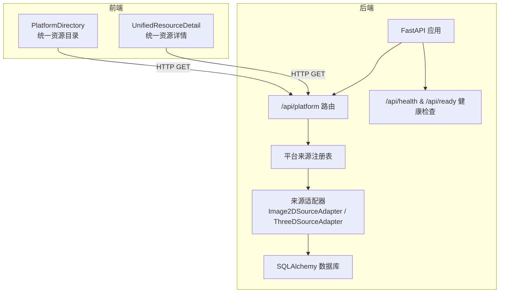
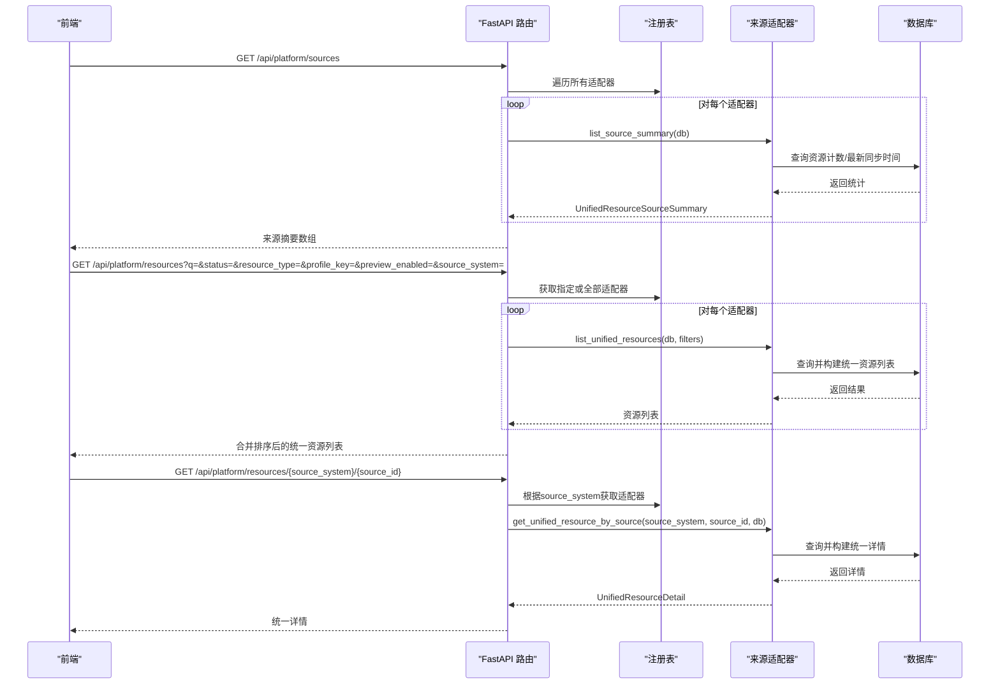
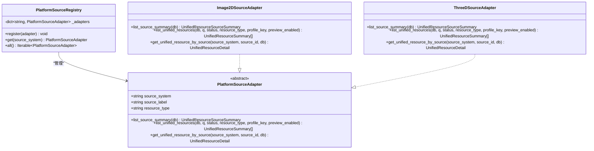
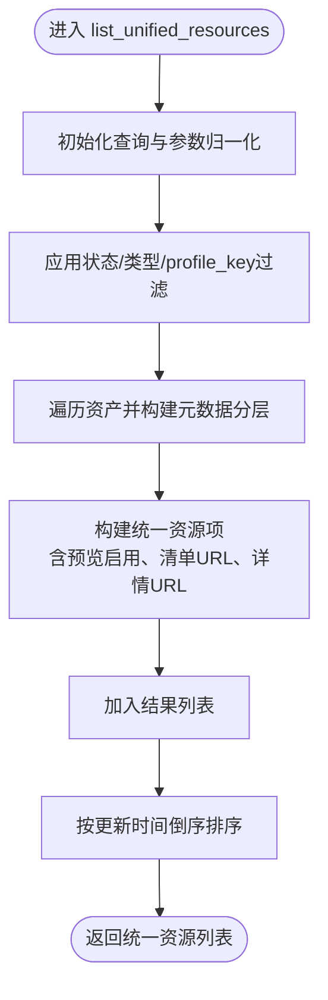
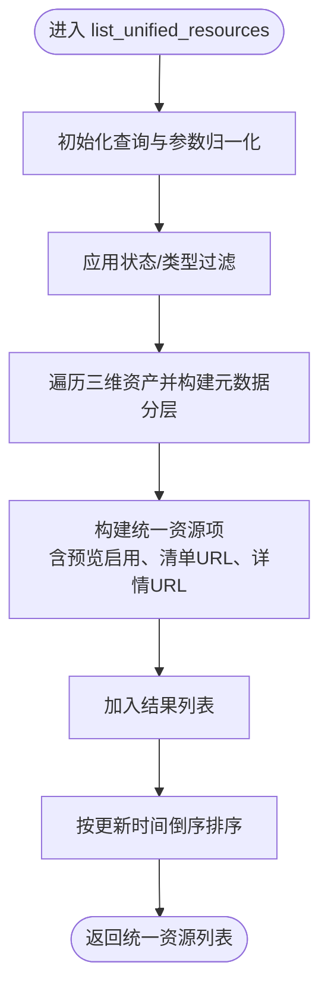
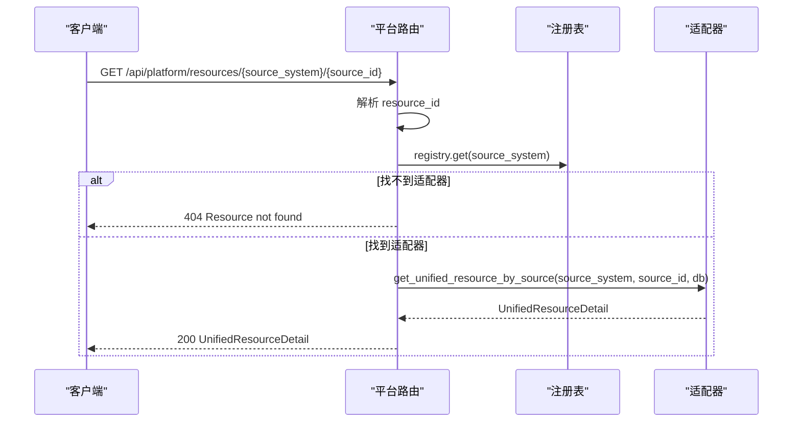
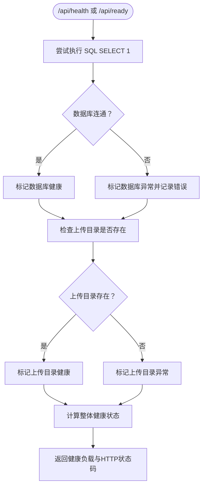
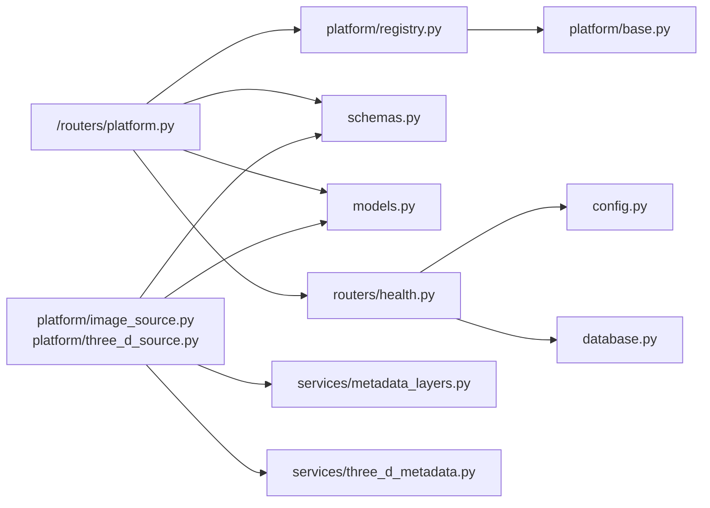

# 来源注册管理

<cite>
**本文引用的文件**
- [backend/app/platform/registry.py](file://backend/app/platform/registry.py)
- [backend/app/platform/base.py](file://backend/app/platform/base.py)
- [backend/app/platform/image_source.py](file://backend/app/platform/image_source.py)
- [backend/app/platform/three_d_source.py](file://backend/app/platform/three_d_source.py)
- [backend/app/routers/platform.py](file://backend/app/routers/platform.py)
- [backend/app/routers/health.py](file://backend/app/routers/health.py)
- [backend/app/config.py](file://backend/app/config.py)
- [backend/app/database.py](file://backend/app/database.py)
- [backend/app/schemas.py](file://backend/app/schemas.py)
- [backend/app/models.py](file://backend/app/models.py)
- [backend/app/services/metadata_layers.py](file://backend/app/services/metadata_layers.py)
- [backend/app/services/three_d_metadata.py](file://backend/app/services/three_d_metadata.py)
- [docs/02-架构设计/PLATFORM_SOURCE_ADAPTERS.md](file://docs/02-架构设计/PLATFORM_SOURCE_ADAPTERS.md)
- [frontend/src/components/PlatformDirectory.tsx](file://frontend/src/components/PlatformDirectory.tsx)
- [frontend/src/components/UnifiedResourceDetail.tsx](file://frontend/src/components/UnifiedResourceDetail.tsx)
</cite>

## 目录
1. [简介](#简介)
2. [项目结构](#项目结构)
3. [核心组件](#核心组件)
4. [架构总览](#架构总览)
5. [详细组件分析](#详细组件分析)
6. [依赖分析](#依赖分析)
7. [性能考虑](#性能考虑)
8. [故障排除指南](#故障排除指南)
9. [结论](#结论)
10. [附录](#附录)

## 简介
本文件面向MDAMS原型项目的来源注册管理系统，围绕“统一平台来源适配器”展开，系统性阐述平台注册流程（注册申请、资质审核、配置验证、上线流程）、适配器配置管理（连接参数、认证配置、超时与重试策略）、连接测试机制（连通性检测、性能测试、可用性监控、故障诊断）、状态监控体系（健康检查、异常告警、日志记录、统计分析），并提供操作指南与故障排除方案。同时给出注册配置示例与管理界面说明，帮助非技术用户也能理解与使用。

## 项目结构
- 后端采用FastAPI + SQLAlchemy，平台层通过适配器聚合多来源系统，不直接存储新实体，而是读取现有资产与三维对象并转换为统一视图。
- 前端提供统一资源目录与详情页面，调用平台路由完成聚合查询与详情获取。
- 健康检查路由提供基础服务健康度判断，结合环境变量配置上传目录与数据库连通性。

图表来源
- [backend/app/routers/platform.py:1-65](file://backend/app/routers/platform.py#L1-L65)
- [backend/app/platform/registry.py:1-24](file://backend/app/platform/registry.py#L1-L24)
- [backend/app/platform/image_source.py:1-228](file://backend/app/platform/image_source.py#L1-L228)
- [backend/app/platform/three_d_source.py:1-224](file://backend/app/platform/three_d_source.py#L1-L224)
- [backend/app/routers/health.py:1-60](file://backend/app/routers/health.py#L1-L60)

章节来源
- [docs/02-架构设计/PLATFORM_SOURCE_ADAPTERS.md:1-122](file://docs/02-架构设计/PLATFORM_SOURCE_ADAPTERS.md#L1-L122)
- [backend/app/routers/platform.py:1-65](file://backend/app/routers/platform.py#L1-L65)
- [backend/app/routers/health.py:1-60](file://backend/app/routers/health.py#L1-L60)

## 核心组件
- 平台来源注册表：集中注册与管理各来源适配器，提供按source_system获取与遍历能力。
- 来源适配器基类：定义统一接口（来源摘要、统一资源列表、统一资源详情）。
- 二维来源适配器：基于资产表构建统一资源视图，支持全文检索、状态过滤、预览开关、profile键过滤。
- 三维来源适配器：基于三维资产表构建统一资源视图，关注对象/版本/多文件角色与Web预览状态。
- 平台路由：聚合来源摘要、统一目录与统一详情；支持多参数筛选与排序。
- 健康检查：数据库与上传目录健康度检测，返回整体健康状态与HTTP状态码。
- 配置模块：集中管理数据库URL、Redis、上传目录、公开访问URL、大模型API兼容配置、人脸识别相关参数等。
- 元数据分层服务：为二维与三维来源提供统一元数据分层构建，支撑profile键解析、字段合并与技术元数据推断。

章节来源
- [backend/app/platform/registry.py:1-24](file://backend/app/platform/registry.py#L1-L24)
- [backend/app/platform/base.py:1-42](file://backend/app/platform/base.py#L1-L42)
- [backend/app/platform/image_source.py:1-228](file://backend/app/platform/image_source.py#L1-L228)
- [backend/app/platform/three_d_source.py:1-224](file://backend/app/platform/three_d_source.py#L1-L224)
- [backend/app/routers/platform.py:1-65](file://backend/app/routers/platform.py#L1-L65)
- [backend/app/routers/health.py:1-60](file://backend/app/routers/health.py#L1-L60)
- [backend/app/config.py:1-72](file://backend/app/config.py#L1-L72)
- [backend/app/services/metadata_layers.py:1-636](file://backend/app/services/metadata_layers.py#L1-L636)
- [backend/app/services/three_d_metadata.py:1-360](file://backend/app/services/three_d_metadata.py#L1-L360)

## 架构总览
平台层通过注册表统一调度各来源适配器，路由层对外暴露统一接口，适配器从各自数据源读取并转换为统一模型。健康检查路由提供基础可用性保障，配置模块集中管理运行时参数。

图表来源
- [backend/app/routers/platform.py:1-65](file://backend/app/routers/platform.py#L1-L65)
- [backend/app/platform/registry.py:1-24](file://backend/app/platform/registry.py#L1-L24)
- [backend/app/platform/image_source.py:50-151](file://backend/app/platform/image_source.py#L50-L151)
- [backend/app/platform/three_d_source.py:70-189](file://backend/app/platform/three_d_source.py#L70-L189)

## 详细组件分析

### 平台来源注册表与适配器基类
- 注册表：维护适配器字典，按source_system注册与查找，提供遍历所有适配器的能力。
- 适配器基类：定义三个抽象方法，确保各来源适配器提供统一能力：来源摘要、统一资源列表、统一资源详情。

图表来源
- [backend/app/platform/base.py:14-42](file://backend/app/platform/base.py#L14-L42)
- [backend/app/platform/registry.py:8-22](file://backend/app/platform/registry.py#L8-L22)
- [backend/app/platform/image_source.py:196-227](file://backend/app/platform/image_source.py#L196-L227)
- [backend/app/platform/three_d_source.py:192-223](file://backend/app/platform/three_d_source.py#L192-L223)

章节来源
- [backend/app/platform/registry.py:1-24](file://backend/app/platform/registry.py#L1-L24)
- [backend/app/platform/base.py:1-42](file://backend/app/platform/base.py#L1-L42)

### 二维来源适配器（Image2DSourceAdapter）
- 能力范围：从资产表读取二维资源，复用元数据分层，生成统一资源摘要、列表与详情；支持全文检索、状态过滤、预览开关、profile键过滤。
- 列表构建：按条件过滤、构建统一资源项（含预览启用判断、清单URL与详情URL），并对更新时间倒序排序。
- 详情构建：根据资源ID解析来源系统与ID，查询资产并构建统一详情，包含来源记录与访问路径。

图表来源
- [backend/app/platform/image_source.py:69-151](file://backend/app/platform/image_source.py#L69-L151)

章节来源
- [backend/app/platform/image_source.py:1-228](file://backend/app/platform/image_source.py#L1-L228)
- [backend/app/services/metadata_layers.py:1-636](file://backend/app/services/metadata_layers.py#L1-L636)

### 三维来源适配器（ThreeDSourceAdapter）
- 能力范围：从三维资产表读取对象，复用三维元数据层，汇总标题、profile、版本、预览状态，返回统一详情。
- 列表构建：支持状态/类型过滤，构建统一资源项；预览启用与Web预览状态相关。
- 详情构建：根据资源ID解析来源系统与ID，查询三维资产并构建统一详情，包含来源记录与访问路径。

图表来源
- [backend/app/platform/three_d_source.py:70-158](file://backend/app/platform/three_d_source.py#L70-L158)

章节来源
- [backend/app/platform/three_d_source.py:1-224](file://backend/app/platform/three_d_source.py#L1-L224)
- [backend/app/services/three_d_metadata.py:1-360](file://backend/app/services/three_d_metadata.py#L1-L360)

### 平台路由（/api/platform/*）
- /api/platform/sources：遍历注册表中的所有适配器，返回来源摘要数组。
- /api/platform/resources：支持多参数筛选（全文检索、状态、资源类型、profile键、预览开关、来源系统），按更新时间倒序返回统一资源列表。
- /api/platform/resources/{resource_id}：按统一资源ID解析来源系统，调用对应适配器获取统一详情，处理未知ID与资源不存在的情况。

图表来源
- [backend/app/routers/platform.py:51-65](file://backend/app/routers/platform.py#L51-L65)

章节来源
- [backend/app/routers/platform.py:1-65](file://backend/app/routers/platform.py#L1-L65)

### 健康检查与状态监控
- 健康检查：检测数据库连通性与上传目录存在性，返回overall_status与http_status；健康则200，否则503。
- 状态监控：平台层通过来源摘要中的healthy字段与last_synced_at反映来源健康度与同步时间；路由层对资源列表进行倒序排序便于观察最新变化。

图表来源
- [backend/app/routers/health.py:14-41](file://backend/app/routers/health.py#L14-L41)

章节来源
- [backend/app/routers/health.py:1-60](file://backend/app/routers/health.py#L1-L60)

### 配置管理与连接参数
- 数据库连接：DATABASE_URL，用于创建引擎与会话。
- 缓存与队列：REDIS_URL。
- 上传目录：UPLOAD_DIR，健康检查会验证该目录存在性。
- 公开访问URL：API_PUBLIC_URL、CANTALOUPE_PUBLIC_URL。
- 大模型兼容配置：OPENAI_*系列参数默认回退到Moonshot，便于统一接入。
- 人脸识别配置：开关、提供方、超时、阈值、模型根目录、索引目录、严格本地模式等。

章节来源
- [backend/app/config.py:1-72](file://backend/app/config.py#L1-L72)
- [backend/app/database.py:1-17](file://backend/app/database.py#L1-L17)

### 管理界面与操作指南
- 统一资源目录（PlatformDirectory）：支持来源系统概览、资源数量统计、多参数筛选（状态、预览开关、资源类型、profile键、全文检索），并分页展示统一资源列表。
- 统一资源详情（UnifiedResourceDetail）：展示统一资源的来源系统、标题、状态、预览启用、清单URL、详情URL、生命周期与结构文件等；支持查看源详情与下载输出。

章节来源
- [frontend/src/components/PlatformDirectory.tsx:31-272](file://frontend/src/components/PlatformDirectory.tsx#L31-L272)
- [frontend/src/components/UnifiedResourceDetail.tsx:99-379](file://frontend/src/components/UnifiedResourceDetail.tsx#L99-L379)

## 依赖分析
- 组件耦合：平台路由依赖注册表；注册表依赖适配器基类；适配器依赖数据库与元数据分层服务；健康检查依赖数据库与配置模块。
- 外部依赖：数据库引擎、Redis、上传目录、缓存与队列、大模型服务（OpenAI兼容）、人脸识别服务。
- 可能的循环依赖：当前文件间无循环导入迹象，适配器通过注册表解耦。

图表来源
- [backend/app/routers/platform.py:1-65](file://backend/app/routers/platform.py#L1-L65)
- [backend/app/platform/registry.py:1-24](file://backend/app/platform/registry.py#L1-L24)
- [backend/app/platform/base.py:1-42](file://backend/app/platform/base.py#L1-L42)
- [backend/app/platform/image_source.py:1-228](file://backend/app/platform/image_source.py#L1-L228)
- [backend/app/platform/three_d_source.py:1-224](file://backend/app/platform/three_d_source.py#L1-L224)
- [backend/app/routers/health.py:1-60](file://backend/app/routers/health.py#L1-L60)
- [backend/app/config.py:1-72](file://backend/app/config.py#L1-L72)
- [backend/app/database.py:1-17](file://backend/app/database.py#L1-L17)
- [backend/app/schemas.py:1-652](file://backend/app/schemas.py#L1-L652)
- [backend/app/models.py:1-307](file://backend/app/models.py#L1-L307)
- [backend/app/services/metadata_layers.py:1-636](file://backend/app/services/metadata_layers.py#L1-L636)
- [backend/app/services/three_d_metadata.py:1-360](file://backend/app/services/three_d_metadata.py#L1-L360)

章节来源
- [docs/02-架构设计/PLATFORM_SOURCE_ADAPTERS.md:1-122](file://docs/02-架构设计/PLATFORM_SOURCE_ADAPTERS.md#L1-L122)

## 性能考虑
- 列表查询：适配器层对数据库查询进行必要过滤（状态、类型、profile键），避免全量扫描；前端按更新时间倒序展示，利于快速定位最新资源。
- 元数据分层：统一构建元数据分层，减少重复计算；技术元数据推断与字段合并在服务层完成，降低适配器复杂度。
- 健康检查：仅执行轻量SQL与目录存在性检查，避免阻塞。
- 建议：对高频查询字段建立索引（如状态、资源类型、创建时间等）；对全文检索可引入专用搜索引擎以提升性能。

## 故障排除指南
- 健康检查返回503：
  - 检查数据库连通性与URL配置。
  - 检查上传目录是否存在且可访问。
- 统一资源详情返回400/404：
  - 确认统一资源ID格式正确（source_system:source_id）。
  - 确认对应来源适配器已注册且可用。
- 列表为空或筛选无效：
  - 检查筛选参数（状态、资源类型、profile键、预览开关、来源系统）是否与实际数据匹配。
  - 确认适配器内部过滤逻辑与元数据分层是否正确。
- 前端无法加载：
  - 检查后端路由是否可达、CORS与代理配置。
  - 查看浏览器网络面板与后端日志。

章节来源
- [backend/app/routers/health.py:14-41](file://backend/app/routers/health.py#L14-L41)
- [backend/app/routers/platform.py:51-65](file://backend/app/routers/platform.py#L51-L65)

## 结论
来源注册管理系统通过统一平台来源适配器实现了多来源聚合与统一视图输出，配合健康检查与配置管理，提供了稳定可靠的运行保障。前端界面直观展示了来源汇总与统一资源目录，便于用户进行检索与查看详情。未来可在统一全文检索索引、扩展更多外部来源适配器、完善统一详情模型等方面持续演进。

## 附录

### 平台注册流程（注册申请、资质审核、配置验证、上线流程）
- 注册申请：在平台侧提交来源注册请求，明确source_system、source_label、resource_type等元信息。
- 资质审核：由管理员在平台侧审核来源信息与权限配置，确认合规性。
- 配置验证：检查数据库连接、上传目录、公开访问URL、大模型与人脸识别等关键配置项。
- 上线流程：完成适配器开发与单元测试，注册到注册表并通过健康检查与目录查询验证，正式对外提供服务。

### 适配器配置管理要点
- 连接参数设置：DATABASE_URL、REDIS_URL、API_PUBLIC_URL、CANTALOUPE_PUBLIC_URL。
- 认证配置：大模型API兼容配置（OPENAI_*），默认回退到Moonshot。
- 超时设置：OPENAI_TIMEOUT_SECONDS、人脸识别超时参数。
- 重试策略：当前未见通用重试封装，建议在调用外部服务时增加指数退避与熔断保护。

### 连接测试机制
- 连通性检测：健康检查路由对数据库与上传目录进行检测。
- 性能测试：建议对高频接口（统一目录、详情）进行压测，识别瓶颈。
- 可用性监控：结合健康检查与日志记录，监控服务可用性与响应时间。
- 故障诊断：通过统一资源ID解析来源系统、查看适配器内部查询与元数据分层构建过程定位问题。

### 状态监控系统
- 健康检查：/api/health与/api/ready，返回overall_status与http_status。
- 异常告警：建议在网关或进程监控层对503与慢请求进行告警。
- 日志记录：后端打印错误与异常信息，前端捕获并提示用户。
- 统计分析：来源摘要中的资源数量与最后同步时间可用于趋势分析。

### 注册配置示例与管理界面说明
- 注册配置示例（环境变量）：
  - DATABASE_URL：数据库连接字符串
  - UPLOAD_DIR：上传目录路径
  - OPENAI_*：大模型API配置（默认回退到Moonshot）
  - FACE_RECOGNITION_*：人脸识别相关配置
- 管理界面说明：
  - 统一资源目录：支持来源系统概览、资源数量统计、多参数筛选与分页展示。
  - 统一资源详情：展示统一资源的来源系统、标题、状态、预览启用、清单URL、详情URL、生命周期与结构文件等。

章节来源
- [backend/app/config.py:1-72](file://backend/app/config.py#L1-L72)
- [backend/app/routers/health.py:14-41](file://backend/app/routers/health.py#L14-L41)
- [frontend/src/components/PlatformDirectory.tsx:31-272](file://frontend/src/components/PlatformDirectory.tsx#L31-L272)
- [frontend/src/components/UnifiedResourceDetail.tsx:99-379](file://frontend/src/components/UnifiedResourceDetail.tsx#L99-L379)