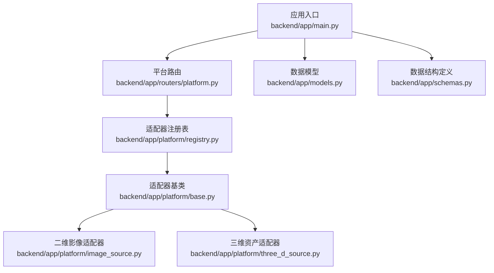
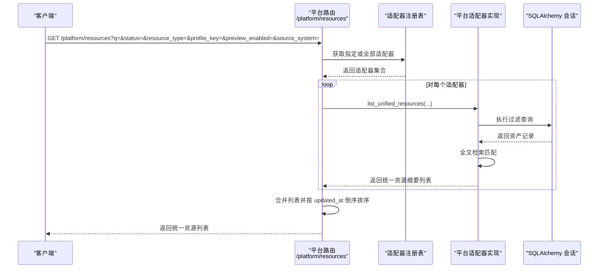
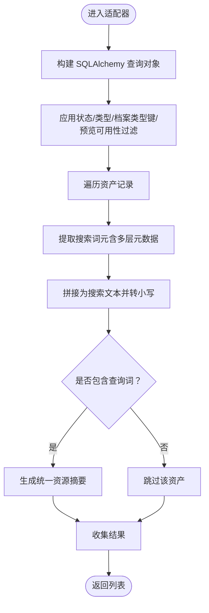
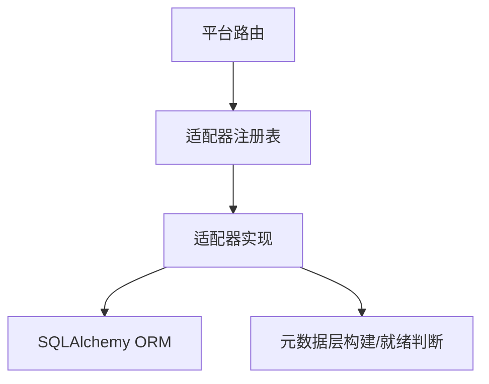

# 统一检索接口

<cite>
**本文引用的文件**
- [backend/app/main.py](file://backend/app/main.py)
- [backend/app/models.py](file://backend/app/models.py)
- [backend/app/schemas.py](file://backend/app/schemas.py)
- [backend/app/routers/platform.py](file://backend/app/routers/platform.py)
- [backend/app/platform/registry.py](file://backend/app/platform/registry.py)
- [backend/app/platform/base.py](file://backend/app/platform/base.py)
- [backend/app/platform/image_source.py](file://backend/app/platform/image_source.py)
- [backend/app/platform/three_d_source.py](file://backend/app/platform/three_d_source.py)
</cite>

## 目录
1. [简介](#简介)
2. [项目结构](#项目结构)
3. [核心组件](#核心组件)
4. [架构总览](#架构总览)
5. [详细组件分析](#详细组件分析)
6. [依赖分析](#依赖分析)
7. [性能考虑](#性能考虑)
8. [故障排查指南](#故障排查指南)
9. [结论](#结论)
10. [附录：API 使用示例与最佳实践](#附录api-使用示例与最佳实践)

## 简介
本文件面向 MDAMS 原型项目的“统一检索接口”，系统性阐述其查询语法设计、过滤条件实现、排序规则配置、分页机制设计以及查询性能优化策略。该接口通过平台适配器聚合多个子系统的资源，提供跨源的统一检索与详情查询能力。

统一检索接口的关键特性：
- 查询语法：支持全文检索（在统一资源摘要中拼接多字段构建搜索词元），并可结合布尔过滤条件进行筛选。
- 过滤条件：支持状态过滤、类型过滤、来源系统过滤、预览可用性过滤、档案类型过滤等。
- 排序规则：按更新时间倒序统一排序，确保最新条目优先展示。
- 分页机制：当前采用偏移分页（skip/limit）与列表切片组合；建议在大规模数据场景下引入游标分页以提升性能。
- 性能优化：通过索引、缓存、查询计划与并发控制等手段保障检索效率。

## 项目结构
统一检索接口位于后端应用的平台适配器体系中，核心由以下模块组成：
- 应用入口与数据库初始化：负责注册路由、初始化数据库表与索引。
- 平台适配器基类与注册表：定义统一的适配器契约与适配器注册机制。
- 子系统适配器：二维影像与三维资产分别实现各自的统一资源列表与详情查询逻辑。
- 路由层：对外暴露统一检索与详情查询的 HTTP 接口。



图表来源
- [backend/app/main.py:64-86](file://backend/app/main.py#L64-L86)
- [backend/app/routers/platform.py:12-48](file://backend/app/routers/platform.py#L12-L48)
- [backend/app/platform/registry.py:8-24](file://backend/app/platform/registry.py#L8-L24)
- [backend/app/platform/base.py:14-42](file://backend/app/platform/base.py#L14-L42)
- [backend/app/platform/image_source.py:196-228](file://backend/app/platform/image_source.py#L196-L228)
- [backend/app/platform/three_d_source.py:192-224](file://backend/app/platform/three_d_source.py#L192-L224)

章节来源
- [backend/app/main.py:64-86](file://backend/app/main.py#L64-L86)
- [backend/app/routers/platform.py:12-48](file://backend/app/routers/platform.py#L12-L48)
- [backend/app/platform/registry.py:8-24](file://backend/app/platform/registry.py#L8-L24)
- [backend/app/platform/base.py:14-42](file://backend/app/platform/base.py#L14-L42)
- [backend/app/platform/image_source.py:196-228](file://backend/app/platform/image_source.py#L196-L228)
- [backend/app/platform/three_d_source.py:192-224](file://backend/app/platform/three_d_source.py#L192-L224)

## 核心组件
- 平台适配器基类：定义统一的资源汇总与详情查询契约，包括来源统计、统一资源列表与详情。
- 二维影像适配器：基于资产表进行过滤与全文检索，生成统一资源摘要。
- 三维资产适配器：基于三维资产表进行过滤与全文检索，生成统一资源摘要。
- 平台路由：聚合各适配器结果，统一返回并按更新时间排序。

章节来源
- [backend/app/platform/base.py:14-42](file://backend/app/platform/base.py#L14-L42)
- [backend/app/platform/image_source.py:50-151](file://backend/app/platform/image_source.py#L50-L151)
- [backend/app/platform/three_d_source.py:70-158](file://backend/app/platform/three_d_source.py#L70-L158)
- [backend/app/routers/platform.py:20-48](file://backend/app/routers/platform.py#L20-L48)

## 架构总览
统一检索接口采用“适配器模式”聚合多源数据，路由层负责参数解析与结果合并，适配器内部完成各自的数据过滤与全文检索。



图表来源
- [backend/app/routers/platform.py:20-48](file://backend/app/routers/platform.py#L20-L48)
- [backend/app/platform/registry.py:8-24](file://backend/app/platform/registry.py#L8-L24)
- [backend/app/platform/base.py:25-36](file://backend/app/platform/base.py#L25-L36)
- [backend/app/platform/image_source.py:50-151](file://backend/app/platform/image_source.py#L50-L151)
- [backend/app/platform/three_d_source.py:70-158](file://backend/app/platform/three_d_source.py#L70-L158)

## 详细组件分析

### 查询语法设计
- 全文搜索
  - 二维影像：在适配器内部，对每条资产记录构建“搜索词元”，涵盖标识、文件名、路径、MIME 类型、标题、资源类型、标签、档案类型标签、管理元数据、技术元数据、档案字段与原始元数据等，最终将所有词元拼接为搜索文本，执行包含匹配。
  - 三维资产：同样对每条资产记录构建搜索词元，涵盖标识、文件名、路径、MIME 类型、标题、资源类型、标签、版本标签、预览状态、资源组、角色汇总、管理元数据、收藏元数据、技术元数据、档案字段、保存与原始元数据等，执行包含匹配。
- 字段过滤
  - 支持按状态、资源类型、档案类型键、预览可用性进行过滤。
  - 来源系统过滤：通过 source_system 参数限定仅查询某适配器。
- 布尔查询与通配符
  - 当前实现为“包含匹配”，未见显式布尔查询与通配符支持。若需扩展，可在适配器的 list_unified_resources 中增加更复杂的解析与构造逻辑。



图表来源
- [backend/app/platform/image_source.py:69-151](file://backend/app/platform/image_source.py#L69-L151)
- [backend/app/platform/three_d_source.py:70-158](file://backend/app/platform/three_d_source.py#L70-L158)

章节来源
- [backend/app/platform/image_source.py:69-151](file://backend/app/platform/image_source.py#L69-L151)
- [backend/app/platform/three_d_source.py:70-158](file://backend/app/platform/three_d_source.py#L70-L158)

### 过滤条件实现
- 状态过滤：根据资产状态精确匹配。
- 类型过滤：根据资源类型精确匹配。
- 档案类型过滤：对二维与三维适配器均支持 profile_key 的精确匹配，若传入未知档案类型键则直接返回空列表。
- 预览可用性过滤：二维影像通过 IIIF 就绪状态判断；三维资产通过核心元数据与资产状态综合判断。
- 来源系统过滤：平台路由根据 source_system 参数选择特定适配器或全量适配器。

章节来源
- [backend/app/platform/image_source.py:84-88](file://backend/app/platform/image_source.py#L84-L88)
- [backend/app/platform/image_source.py:107-108](file://backend/app/platform/image_source.py#L107-L108)
- [backend/app/platform/image_source.py:131-133](file://backend/app/platform/image_source.py#L131-L133)
- [backend/app/platform/three_d_source.py:80-83](file://backend/app/platform/three_d_source.py#L80-L83)
- [backend/app/platform/three_d_source.py:106-108](file://backend/app/platform/three_d_source.py#L106-L108)
- [backend/app/platform/three_d_source.py:137-139](file://backend/app/platform/three_d_source.py#L137-L139)
- [backend/app/routers/platform.py:30-36](file://backend/app/routers/platform.py#L30-L36)

### 排序规则配置
- 统一按 updated_at 倒序排序，确保最新条目优先展示。
- 适配器内部先按创建时间倒序再按 ID 倒序，保证稳定排序。

章节来源
- [backend/app/platform/image_source.py:90](file://backend/app/platform/image_source.py#L90)
- [backend/app/platform/three_d_source.py:85](file://backend/app/platform/three_d_source.py#L85)
- [backend/app/routers/platform.py:47](file://backend/app/routers/platform.py#L47)

### 分页机制设计
- 当前实现
  - 平台路由对合并后的统一资源列表进行排序后，直接返回；未见显式的分页参数（如 skip/limit）处理。
  - 二维资产列表接口已内置偏移分页（skip/limit）与切片返回，但统一检索接口未沿用此机制。
- 建议改进
  - 在统一检索接口增加分页参数（如 page/size 或 cursor/limit），并在路由层对合并结果进行分页切片。
  - 引入游标分页以避免深度偏移带来的性能问题，尤其在大规模数据场景。

章节来源
- [backend/app/routers/platform.py:47](file://backend/app/routers/platform.py#L47)
- [backend/app/routers/assets.py:209-220](file://backend/app/routers/assets.py#L209-L220)

### 类与关系图
```mermaid
classDiagram
class 平台路由 as "platform.py"
class 注册表 as "registry.py"
class 适配器基类 as "base.py"
class 二维影像适配器 as "image_source.py"
class 三维资产适配器 as "three_d_source.py"
平台路由 --> 注册表 : "获取适配器"
注册表 --> 适配器基类 : "注册/获取"
适配器基类 <|-- 二维影像适配器 : "继承"
适配器基类 <|-- 三维资产适配器 : "继承"
```

图表来源
- [backend/app/routers/platform.py:12-48](file://backend/app/routers/platform.py#L12-L48)
- [backend/app/platform/registry.py:8-24](file://backend/app/platform/registry.py#L8-L24)
- [backend/app/platform/base.py:14-42](file://backend/app/platform/base.py#L14-L42)
- [backend/app/platform/image_source.py:196-228](file://backend/app/platform/image_source.py#L196-L228)
- [backend/app/platform/three_d_source.py:192-224](file://backend/app/platform/three_d_source.py#L192-L224)

## 依赖分析
- 组件耦合
  - 平台路由依赖注册表以获取适配器实例；适配器实现依赖各自的数据模型与服务层工具（如元数据层构建、IIIF 就绪判断）。
  - 适配器内部对数据库查询使用 SQLAlchemy ORM，具备良好的可维护性。
- 外部依赖
  - SQLAlchemy ORM 用于数据访问与查询。
  - FastAPI 路由装饰器与 Pydantic 数据结构用于接口定义与序列化。



图表来源
- [backend/app/routers/platform.py:12-48](file://backend/app/routers/platform.py#L12-L48)
- [backend/app/platform/registry.py:8-24](file://backend/app/platform/registry.py#L8-L24)
- [backend/app/platform/base.py:25-36](file://backend/app/platform/base.py#L25-L36)
- [backend/app/platform/image_source.py:50-151](file://backend/app/platform/image_source.py#L50-L151)
- [backend/app/platform/three_d_source.py:70-158](file://backend/app/platform/three_d_source.py#L70-L158)

章节来源
- [backend/app/routers/platform.py:12-48](file://backend/app/routers/platform.py#L12-L48)
- [backend/app/platform/registry.py:8-24](file://backend/app/platform/registry.py#L8-L24)
- [backend/app/platform/base.py:25-36](file://backend/app/platform/base.py#L25-L36)
- [backend/app/platform/image_source.py:50-151](file://backend/app/platform/image_source.py#L50-L151)
- [backend/app/platform/three_d_source.py:70-158](file://backend/app/platform/three_d_source.py#L70-L158)

## 性能考虑
- 索引设计
  - 数据模型中已为常用过滤字段建立索引（如状态、资源类型、档案类型键、创建时间等），有助于加速过滤与排序。
  - 建议在统一检索接口中针对 q 参数涉及的高频字段建立复合索引或全文索引（取决于数据库能力）。
- 缓存策略
  - 对于稳定的来源统计与资源概览，可引入短期缓存（如 Redis）减少重复计算。
- 查询计划
  - 适配器内部先做精确过滤，再进行全文匹配，避免不必要的全表扫描。
  - 建议在高并发场景下对查询结果进行分页与游标分页，降低单次响应数据量。
- 并发控制
  - 在统一检索接口中限制最大分页大小与并发请求数，防止资源耗尽。
  - 对热门资源可采用读写分离与只读副本，减轻主库压力。

## 故障排查指南
- 统一资源 ID 格式错误
  - 现象：返回 400 错误提示未知统一资源 ID。
  - 原因：资源 ID 必须为“来源系统:源ID”的格式且源ID为数字。
  - 处理：检查资源 ID 格式与来源系统是否匹配。
- 未知来源系统
  - 现象：返回空列表或 404。
  - 原因：未找到对应适配器或来源系统不正确。
  - 处理：确认 source_system 参数与已注册适配器一致。
- 档案类型键无效
  - 现象：返回空列表。
  - 原因：传入的 profile_key 不在档案定义中。
  - 处理：核对档案类型键是否正确。
- 预览不可用
  - 现象：preview_enabled 为 false。
  - 原因：IIIF 就绪状态或三维资产预览状态非“ready”。
  - 处理：等待处理完成或检查资产状态。

章节来源
- [backend/app/routers/platform.py:53-64](file://backend/app/routers/platform.py#L53-L64)
- [backend/app/platform/image_source.py:107-108](file://backend/app/platform/image_source.py#L107-L108)
- [backend/app/platform/three_d_source.py:106-108](file://backend/app/platform/three_d_source.py#L106-L108)
- [backend/app/platform/three_d_source.py:137-139](file://backend/app/platform/three_d_source.py#L137-L139)

## 结论
统一检索接口通过平台适配器模式实现了多源资源的统一检索与详情查询，具备清晰的过滤与排序机制。当前实现以包含匹配为核心查询方式，支持状态、类型、档案类型与预览可用性过滤，并按更新时间统一排序。建议在后续迭代中引入更丰富的查询语法（布尔与通配符）、游标分页与缓存策略，以进一步提升检索体验与性能表现。

## 附录：API 使用示例与最佳实践
- 统一检索资源列表
  - 方法与路径：GET /platform/resources
  - 查询参数
    - q：全文检索关键词
    - status：状态过滤
    - resource_type：资源类型过滤
    - profile_key：档案类型键过滤
    - preview_enabled：预览可用性过滤（true/false）
    - source_system：来源系统过滤（如 image_2d、three_d）
  - 返回：统一资源摘要数组，按 updated_at 倒序排列
- 统一资源详情
  - 方法与路径：GET /platform/resources/{source_system}/{source_id}
  - 资源 ID 格式：{source_system}:{source_id}
  - 返回：统一资源详情，包含来源系统、来源记录等信息

最佳实践
- 使用来源系统过滤缩小检索范围，减少适配器遍历成本。
- 控制档案类型键的有效性，避免无效键导致空结果。
- 在高并发场景下启用分页与游标分页，限制单次返回数量。
- 对热点资源与来源统计结果进行缓存，降低数据库压力。
- 在适配器内部保持过滤优先、全文匹配靠后的顺序，提高整体性能。

章节来源
- [backend/app/routers/platform.py:20-48](file://backend/app/routers/platform.py#L20-L48)
- [backend/app/routers/platform.py:51-64](file://backend/app/routers/platform.py#L51-L64)