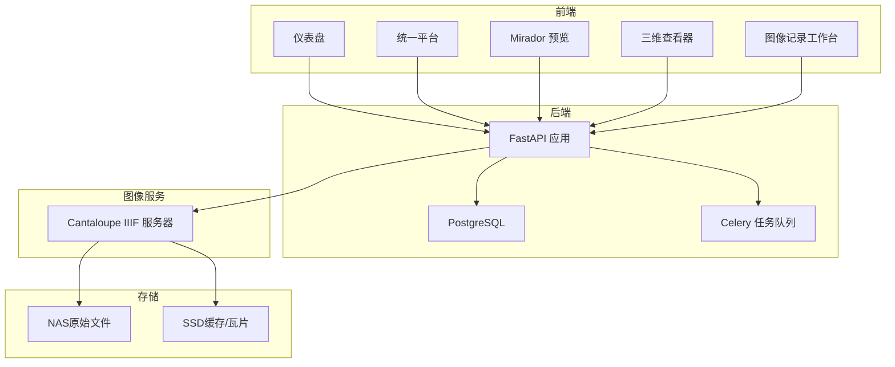
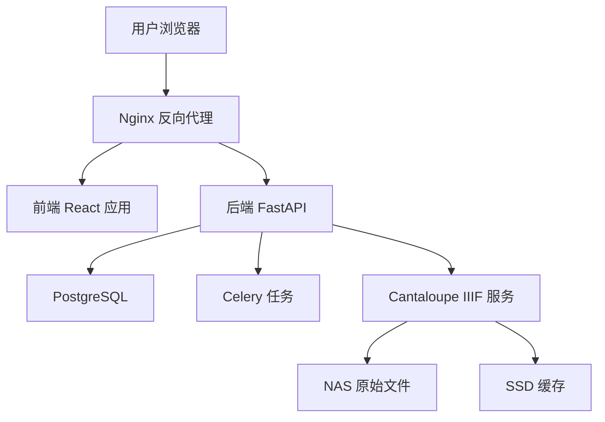
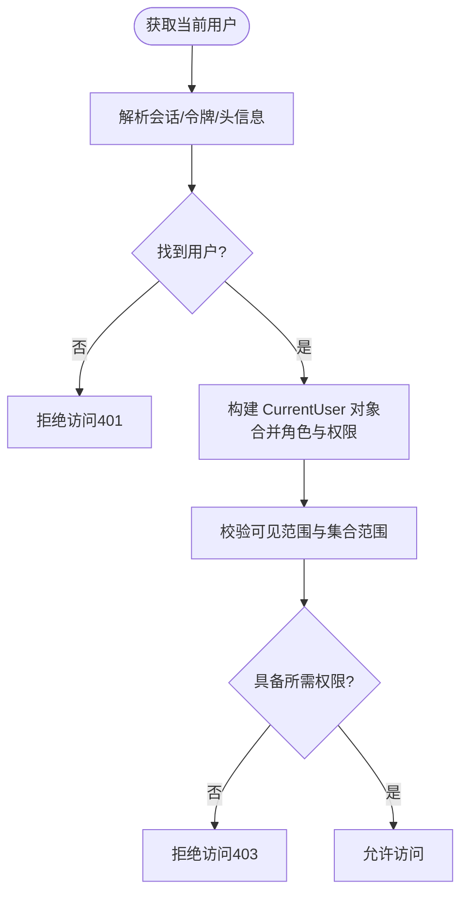
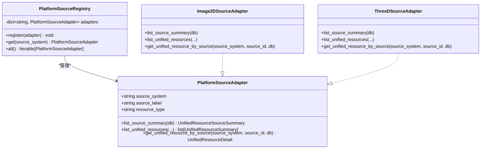
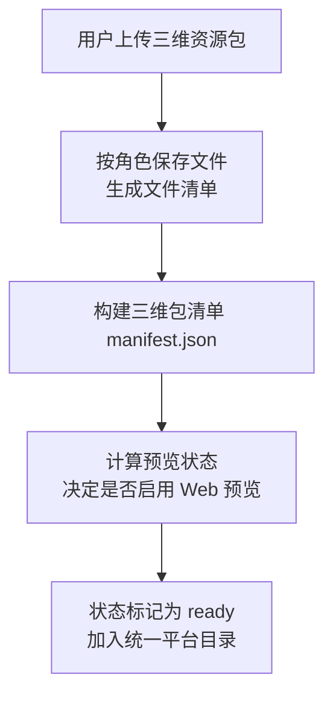
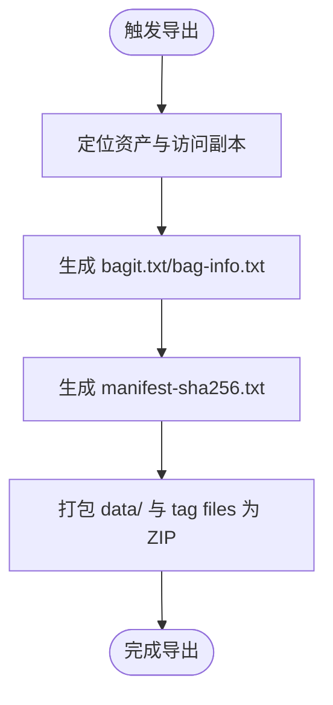
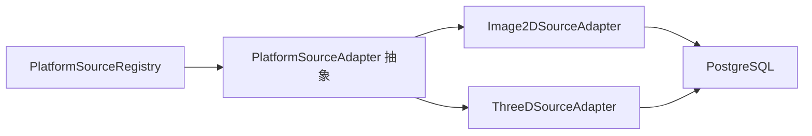

# 当前状态与边界

<cite>
**本文引用的文件**
- [README.md](file://README.md)
- [PROJECT_STATUS.md](file://docs/01-总览/PROJECT_STATUS.md)
- [ACCEPTANCE_CHECKLIST.md](file://docs/01-总览/ACCEPTANCE_CHECKLIST.md)
- [SYSTEM_ARCHITECTURE.md](file://docs/02-架构设计/SYSTEM_ARCHITECTURE.md)
- [main.py](file://backend/app/main.py)
- [base.py](file://backend/app/platform/base.py)
- [registry.py](file://backend/app/platform/registry.py)
- [image_source.py](file://backend/app/platform/image_source.py)
- [three_d_source.py](file://backend/app/platform/three_d_source.py)
- [permissions.py](file://backend/app/permissions.py)
- [models.py](file://backend/app/models.py)
- [three_d_storage.py](file://backend/app/services/three_d_storage.py)
- [BAGIT_SIP_PROFILE.md](file://docs/08-研究/长期保存SIP打包说明（BAGIT_SIP_PROFILE）.md)
- [CROSS_SYSTEM_EVENT_BOUNDARY.md](file://docs/08-研究/跨子系统最小事件边界（CROSS_SYSTEM_EVENT_BOUNDARY）.md)
- [DATA_INGEST_ARCHITECTURE.md](file://docs/02-架构设计/DATA_INGEST_ARCHITECTURE.md)
- [OAIS_SCOPE_MAP.md](file://docs/08-研究/OAIS范围对照（OAIS_SCOPE_MAP）.md)
</cite>

## 目录
1. [引言](#引言)
2. [项目结构](#项目结构)
3. [核心组件](#核心组件)
4. [架构总览](#架构总览)
5. [详细组件分析](#详细组件分析)
6. [依赖分析](#依赖分析)
7. [性能考虑](#性能考虑)
8. [故障排查指南](#故障排查指南)
9. [结论](#结论)
10. [附录](#附录)

## 引言
本文件面向 MDAMS 原型项目的使用者与观察者，系统阐述当前原型所处的阶段、已实现能力、边界与限制，以及未来发展方向。项目当前定位为“可稳定运行、可持续迭代、可用于演示与验证”的馆内数字资源管理原型，而非完整生产级 DAMS。围绕权限模型、平台聚合、三维子系统、长期保存与治理能力等方面，本文件给出明确的现状说明与边界提示，帮助用户正确理解系统能力与使用注意事项。

## 项目结构
- 前端：React + Vite + TypeScript + Ant Design，提供仪表盘、资源列表、Mirador 预览、三维查看器、统一平台、图像记录工作台等界面。
- 后端：FastAPI + SQLAlchemy + Pydantic，提供认证授权、资产与记录管理、IIIF 清单、下载导出、三维资源管理、统一平台目录等接口。
- 图像服务：Cantaloupe IIIF Server，提供高清图像切片与缓存。
- 数据存储：PostgreSQL（元数据与结构化数据），NAS（原始大文件），SSD（缓存与缩略图）。
- 测试：后端 pytest、前端 Playwright，覆盖关键模块与回归验证。

图表来源
- [SYSTEM_ARCHITECTURE.md](file://docs/02-架构设计/SYSTEM_ARCHITECTURE.md)
- [main.py](file://backend/app/main.py)

章节来源
- [README.md](file://README.md)
- [SYSTEM_ARCHITECTURE.md](file://docs/02-架构设计/SYSTEM_ARCHITECTURE.md)

## 核心组件
- 权限与登录：内置测试用户与角色，支持会话与上下文接口；前端菜单按角色裁剪，后端权限校验与范围控制生效。
- 二维影像：资产上传、列表、详情、预览图、IIIF 清单生成、Mirador 预览、原文件与 BagIt 下载、衍生文件策略与 IIIF access 流程。
- 三维资源：对象与版本管理、多文件资源包上传、角色区分（模型/点云/倾斜摄影等）、Web 查看摘要与对象详情。
- 统一平台：来源注册、统一资源目录、统一详情、按状态/类型/profile/预览能力筛选。
- 利用申请：申请车、申请单提交、审批、交付包导出。
- 测试与工程支撑：后端 pytest、前端 Playwright 回归、参考资源导入与校验脚本、工作日志与阶段文档。

章节来源
- [README.md](file://README.md)
- [PROJECT_STATUS.md](file://docs/01-总览/PROJECT_STATUS.md)

## 架构总览
系统采用微服务与容器化编排，前端通过反向代理访问后端 API；后端连接数据库与文件存储，图像服务负责 IIIF 切片与缓存。当前原型已形成主链路可用、模块边界清晰、可继续平台化的阶段，但仍处于原型阶段，尚未进入完整产品化、治理与标准化阶段。

图表来源
- [SYSTEM_ARCHITECTURE.md](file://docs/02-架构设计/SYSTEM_ARCHITECTURE.md)

章节来源
- [SYSTEM_ARCHITECTURE.md](file://docs/02-架构设计/SYSTEM_ARCHITECTURE.md)

## 详细组件分析

### 权限与登录边界
- 已建立的权限模型与范围控制：
  - 角色与权限矩阵明确，覆盖图像与三维资源的视图、编辑、上传、审核、导出等能力。
  - 支持 collection_owner 的责任范围过滤与 owner_only 可见范围控制。
  - 登录、会话、上下文接口可用，前端菜单按权限裁剪。
- 仍需补齐的能力：
  - 生产级身份治理（含更细粒度的权限编排、审计与合规）尚未完整落地。
  - 当前权限模型已可用，但距离完整生产级身份治理仍有差距。

图表来源
- [permissions.py](file://backend/app/permissions.py)

章节来源
- [permissions.py](file://backend/app/permissions.py)
- [README.md](file://README.md)

### 平台聚合与统一检索边界
- 已实现能力：
  - 统一来源注册表与适配器抽象，支持二维与三维来源接入。
  - 统一资源目录与详情，支持按状态、类型、profile、预览能力筛选。
- 仍需完善的方面：
  - 统一检索能力仍在持续完善，来源接入与跨来源聚合仍在扩展中。
  - 当前平台已成立，但统一检索与更多来源接入仍需继续扩展。

图表来源
- [base.py](file://backend/app/platform/base.py)
- [registry.py](file://backend/app/platform/registry.py)
- [image_source.py](file://backend/app/platform/image_source.py)
- [three_d_source.py](file://backend/app/platform/three_d_source.py)

章节来源
- [base.py](file://backend/app/platform/base.py)
- [registry.py](file://backend/app/platform/registry.py)
- [image_source.py](file://backend/app/platform/image_source.py)
- [three_d_source.py](file://backend/app/platform/three_d_source.py)
- [PROJECT_STATUS.md](file://docs/01-总览/PROJECT_STATUS.md)

### 三维子系统边界
- 已实现能力：
  - 对象与版本管理、多文件资源包上传、角色区分（模型/点云/倾斜摄影/贴图/辅助/其他）。
  - Web 查看摘要与对象详情、浏览链路贯通。
- 仍需增强的方面：
  - 规范化程度与兼容性仍需继续加强，对象版本与浏览链路的标准化仍需提升。

图表来源
- [three_d_storage.py](file://backend/app/services/three_d_storage.py)

章节来源
- [three_d_storage.py](file://backend/app/services/three_d_storage.py)
- [three_d_source.py](file://backend/app/platform/three_d_source.py)

### 长期保存、治理、审计、迁移与监控边界
- 已实现能力：
  - BagIt ZIP 导出：基于资产的 SIP-like 打包，包含 bagit.txt、bag-info.txt、manifest-sha256.txt，payload 放在 data/ 目录，最终输出 ZIP。
  - 原始文件与独立 IIIF access 文件可共同进入包，具备基本完整性校验。
- 仍需补齐的能力：
  - 完整 OAIS SIP/AIP/DIP 体系尚未 formalize，接收端 profile 适配尚未明确。
  - 事件审计层尚未统一持久化，当前以 detail/测试层的最小事件边界为基础。
  - 治理、审计、迁移与监控能力仍需后续补齐。

图表来源
- [BAGIT_SIP_PROFILE.md](file://docs/08-研究/长期保存SIP打包说明（BAGIT_SIP_PROFILE）.md)

章节来源
- [BAGIT_SIP_PROFILE.md](file://docs/08-研究/长期保存SIP打包说明（BAGIT_SIP_PROFILE）.md)
- [CROSS_SYSTEM_EVENT_BOUNDARY.md](file://docs/08-研究/跨子系统最小事件边界（CROSS_SYSTEM_EVENT_BOUNDARY）.md)
- [OAIS_SCOPE_MAP.md](file://docs/08-研究/OAIS范围对照（OAIS_SCOPE_MAP）.md)

### 数据入库与对象模型边界
- 入库架构已从“文件上传”升级为“文件接收 + 哈希校验 + 元数据分层 + 资源状态管理 + 导出能力”，支持 IIIF、Mirador、三维查看器与申请交付的统一入口。
- 数据模型涵盖资产、用户、角色、会话、图像记录、申请与应用项等，支撑当前主链路。

章节来源
- [DATA_INGEST_ARCHITECTURE.md](file://docs/02-架构设计/DATA_INGEST_ARCHITECTURE.md)
- [models.py](file://backend/app/models.py)

## 依赖分析
- 组件耦合与内聚：
  - 平台适配器通过注册表集中管理，降低模块间耦合，便于新增来源。
  - 权限模块通过依赖注入贯穿各路由，保证统一的访问控制。
- 外部依赖与集成点：
  - 前端与后端通过 REST API 通信；后端与图像服务通过 IIIF 协议交互；后端与文件系统通过 NAS 挂载读写。
- 潜在循环依赖：
  - 平台适配器与注册表之间为单向依赖，无循环风险。
- 接口契约与实现细节：
  - 平台适配器定义统一接口，具体来源实现遵循该契约，确保扩展一致性。

图表来源
- [registry.py](file://backend/app/platform/registry.py)
- [base.py](file://backend/app/platform/base.py)
- [image_source.py](file://backend/app/platform/image_source.py)
- [three_d_source.py](file://backend/app/platform/three_d_source.py)

章节来源
- [registry.py](file://backend/app/platform/registry.py)
- [base.py](file://backend/app/platform/base.py)
- [image_source.py](file://backend/app/platform/image_source.py)
- [three_d_source.py](file://backend/app/platform/three_d_source.py)

## 性能考虑
- 前端构建针对低功耗服务器（N100）进行了内存堆栈上限调整，以适配有限内存环境。
- 图像服务采用文件系统缓存策略，禁用堆内存缓存，以适应 16GB 总内存限制。
- 上传采用小块流式写入，避免大文件上传时的内存峰值。

章节来源
- [SYSTEM_ARCHITECTURE.md](file://docs/02-架构设计/SYSTEM_ARCHITECTURE.md)

## 故障排查指南
- 启动与健康检查：确认 docker compose 配置解析、容器状态、健康与就绪检查接口可用。
- 登录与权限：确认登录成功、菜单按角色变化、权限校验生效。
- 二维链路：资源列表、详情、IIIF 清单与 Mirador 可用，可见范围影响访问结果。
- 三维链路：三维列表、版本聚合、Web 查看器可用，文件构成与关联关系正确。
- 统一平台：目录筛选、详情跳转、角色可见差异正常。
- 回归验证：至少通过一条登录态的前端回归用例。

章节来源
- [ACCEPTANCE_CHECKLIST.md](file://docs/01-总览/ACCEPTANCE_CHECKLIST.md)

## 结论
MDAMS 原型已进入“主链路可用、模块边界清晰、可继续平台化”的阶段，具备演示与持续开发能力。当前边界与限制明确：权限模型已可用但非完整生产级身份治理；平台聚合已成立但统一检索与更多来源接入仍在扩展；三维链路已贯通但规范化程度仍需增强；长期保存、治理、审计、迁移与监控能力尚未补齐。建议用户在使用时关注上述边界，结合验收清单进行本地验证，并期待后续在统一平台、三维兼容性与保存能力、权限与治理能力方面的持续完善。

## 附录
- 项目定位与阶段判断：可持续开发与演示阶段，已形成稳定板块与主链路可用。
- 下一步优先方向：收敛正式文档入口、补齐专题文档、稳定统一平台与跨来源聚合、完善角色范围与治理能力、扩展测试矩阵与回归覆盖面。

章节来源
- [PROJECT_STATUS.md](file://docs/01-总览/PROJECT_STATUS.md)