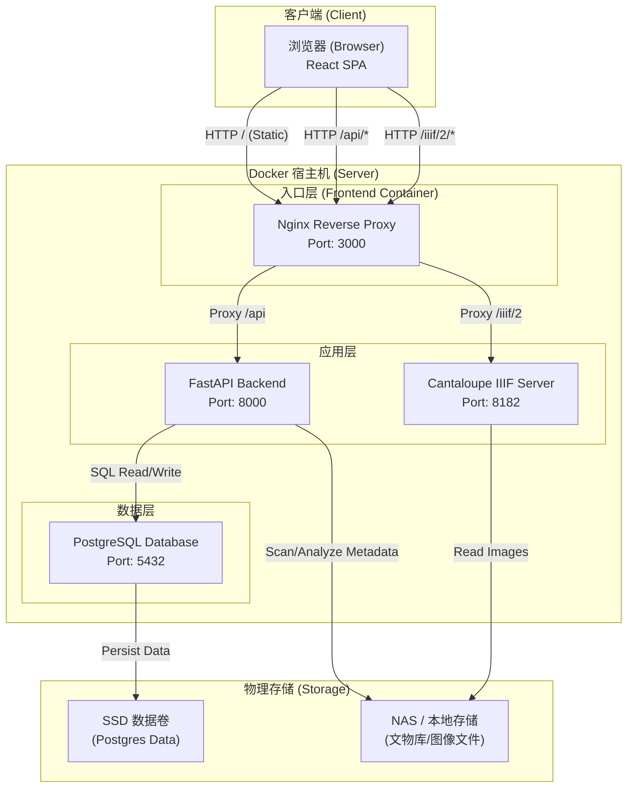

# MDAMS 项目架构文档（快速概览）

> ⚠️ **本文档已归档为快速概览，不再作为当前事实入口。** 
> 当前系统架构事实入口请见：[docs/02-架构设计/SYSTEM_ARCHITECTURE.md](../02-架构设计/SYSTEM_ARCHITECTURE.md) 
> API 路由请见：[docs/02-架构设计/API_ROUTE_MAP.md](../02-架构设计/API_ROUTE_MAP.md)

## 1. 系统架构图 (System Architecture)

该图展示了系统的各个容器组件、网络流向以及它们与底层存储的交互关系。

## 2. 核心数据结构 (Core Data Structure)

系统以 **Asset (资产)** 为核心实体，同时包含 `ImageRecord`（图像记录）、`Application`（利用申请）、`ThreeDAsset`（三维资产）、`User` / `UserRole`（用户与角色）等数据模型。完整模型定义见：[backend/app/models.py](../../backend/app/models.py)。

`Asset` 核心字段简要说明：

*   **`file_path`**: 存储的是相对于挂载点的路径，而不是绝对路径。这使得系统在不同环境下迁移更灵活。
*   **`metadata_info` (JSONB)**: 灵活的 JSONB 字段，用于存储 Exif、IPTC、IIIF info、人脸识别结果等动态元数据。
*   **`status`**: `processing`（处理中）、`ready`（就绪）、`error`（错误）。
*   **`visibility_scope`**: 可见范围控制（`open` / `restricted`）。
*   **`resource_type`**: 资源类型标识（如 `image_2d_cultural_object`）。

## 3. 关键交互流程（概要）

1.  **资产入库**: Backend 接收上传 / 扫描目录 -> 创建 `Asset` 记录 (Status: `processing`) -> 异步提取元数据 -> 更新 `Asset` (Status: `ready`)。
2.  **图像浏览**: 前端请求 `/api/iiif/{asset_id}/manifest` -> Backend 生成 IIIF Manifest -> Mirador 解析后通过 `/api/iiif/{asset_id}/service/...` 代理访问 Cantaloupe -> Cantaloupe 读取文件并返回图像瓦片。

> 完整交互流程和当前架构事实见 [docs/02-架构设计/SYSTEM_ARCHITECTURE.md](../02-架构设计/SYSTEM_ARCHITECTURE.md)。
