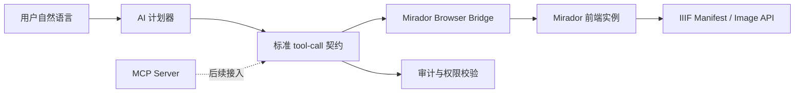

# AI 操控 Mirador 分阶段规划

更新日期：2026-04-12

## 1. 当前基线

当前项目已经具备一条可运行的 AI 操控 Mirador 链路：

- 后端 `backend/app/routers/ai_mirador.py` 接收自然语言指令，返回单步操作计划。
- 前端 `frontend/src/MiradorAiPanel.tsx` 作为 Mirador 浏览器端执行器，调用 Mirador store / actions / OpenSeadragon viewport 完成缩放、平移、重置、适配、打开比较图和切换比较模式。
- IIIF 清单由 `backend/app/routers/iiif.py` 输出，Mirador 仍通过 Manifest 与 Image API 消费影像。

这条链路本质上是“AI 计划器 + 前端执行器 + IIIF 服务”，还不是 MCP。它的优点是实现直接、用户可立即测试；局限是工具能力、参数契约、审计和跨客户端复用还没有被标准化。

## 2. 总体目标

目标不是用 MCP 替代 Mirador 或 IIIF，而是把 AI 对 Mirador 的控制能力抽象成标准工具层：

- Mirador 继续作为前端 IIIF 浏览器和交互执行环境。
- IIIF 继续负责图像内容、Manifest、Image API 与访问服务。
- AI 控制层负责把用户意图转换为结构化工具调用。
- 后续 MCP server 暴露这些工具，统一给模型、自动化流程或其他客户端调用。

推荐架构如下：



## 3. 工具契约草案

第一阶段先在现有 REST API 返回中并行提供 `action` 与 `tool_call`，保持前端兼容。后续 MCP 化时优先使用 `tool_call`。

```json
{
  "action": "open_compare",
  "assistant_message": "已找到候选图像，请确认后打开比较。",
  "requires_confirmation": true,
  "tool_call": {
    "name": "mirador.window.open_compare",
    "version": "mirador-control.v1",
    "arguments": {
      "mode": "side_by_side",
      "query": "青花瓷瓶",
      "target_asset": {
        "asset_id": 42,
        "manifest_url": "http://localhost:3000/api/iiif/42/manifest"
      }
    }
  }
}
```

首批工具名称：

- `mirador.viewport.zoom`：视口缩放，参数为 `direction`、`factor`。
- `mirador.viewport.pan`：视口平移，参数为 `direction`、`pixels`。
- `mirador.viewport.reset`：重置视口。
- `mirador.viewport.fit`：适配窗口。
- `mirador.workspace.switch_mode`：切换单图或比较工作区，参数为 `mode`。
- `mirador.window.open_compare`：打开比较目标，参数为 `target_asset`、`mode`。
- `mirador.window.close_compare`：关闭比较窗口。
- `asset.search`：搜索可用于比较或打开的影像资产。
- `mirador.noop`：无法确定意图或无需执行。

## 4. 分阶段实施

### Phase 1：REST 兼容层标准化

目标：在不破坏现有页面的前提下，让后端返回标准 `tool_call`，并让前端可见。

实施内容：

- 后端 `MiradorAIPlan` 增加 `tool_call` 字段。
- OpenAI 计划提示词要求返回 `action` 和 `tool_call`。
- 后端支持从 `tool_call` 反推现有 `action`，保证未来模型只返回工具调用时也能兼容。
- 前端当前计划卡片显示工具调用名称，执行路径仍复用现有 `action`。
- 增加单元测试覆盖 `tool_call -> action` 与 `action -> tool_call`。

验收标准：

- 自然语言“放大、左移、打开比较、切换比较模式”仍可执行。
- `/api/ai/mirador/interpret` 响应中包含 `tool_call`。
- 前端计划卡片能看到工具调用名称。

### Phase 2：工具注册表与权限审计

目标：把工具能力从散落逻辑整理为可发现、可审计、可授权的注册表。

实施内容：

- 新增后端工具注册表，声明工具名、参数 schema、权限要求、是否需要确认。
- 将 `asset.search` 与 `iiif.manifest.get` 纳入同一能力注册体系。
- 每次 AI 计划与用户确认写入审计日志或操作记录。
- 对危险或影响状态的动作强制确认，例如打开比较、关闭比较、批量窗口操作。

验收标准：

- 后端可返回工具清单。
- 每个工具有参数约束和权限声明。
- 操作日志可追踪“谁、什么时候、让 AI 计划了什么、执行了什么”。

### Phase 3：浏览器执行桥接

目标：为 MCP server 做准备，解决“模型在服务端、Mirador 在浏览器端”的执行位置问题。

实施内容：

- 前端建立 session-bound browser bridge。
- 后端通过 WebSocket 或 SSE 将待执行工具调用发送到当前 Mirador 页面。
- 前端执行后回传结果，包括成功、失败、窗口 ID、视口变化摘要。
- 增加执行超时、页面离线、窗口不存在等错误处理。

验收标准：

- 后端可以把一个 `mirador.viewport.zoom` 工具调用发送到指定浏览器会话。
- 前端执行后返回结构化结果。
- 页面刷新或离线时，服务端能给出明确失败原因。

### Phase 4：MCP Server 化

目标：将 Mirador 控制能力正式封装为 MCP tools，让模型通过标准协议调用。

实施内容：

- 新增 `mcp-mirador` 服务或后端内嵌 MCP 入口。
- 暴露 `tools/list`、`tools/call`。
- MCP tools 内部复用 Phase 2 注册表与 Phase 3 浏览器桥接。
- 对 `iiif.manifest.get`、`asset.search`、`mirador.window.open_manifest` 等工具提供统一返回结构。

验收标准：

- MCP 客户端可以发现 Mirador 工具。
- MCP 客户端调用 `mirador.viewport.zoom` 后，浏览器中的 Mirador 页面实际变化。
- 权限和确认策略与 Web 前端一致。

### Phase 5：高级任务编排

目标：从单步控制升级为可解释、可回放的多步视觉工作流。

实施内容：

- 支持多步计划，例如搜索候选图、打开比较、同步缩放、定位局部、记录观察笔记。
- 支持“只预览计划，不执行”和“一步一步确认执行”。
- 支持把 Mirador 操作结果写入业务元数据、审核记录或研究笔记。
- 与业务影像人脸识别、二维文物代表影像、三维预览等功能形成统一 AI 工具层。

验收标准：

- 用户可查看完整操作计划。
- 每一步可单独确认、重试或跳过。
- 工作流结果可持久化并作为后续业务证据。

## 5. 当前开发建议

当前最合适的落点是 Phase 1。它能在不重构运行架构的情况下，先把“AI 控制 Mirador”从非标准动作字符串推进到可 MCP 化的工具调用结构。

Phase 1 完成后，下一步建议直接做 Phase 2 的工具注册表，而不是立即启动 MCP server。原因是 MCP server 本身并不能直接操作浏览器里的 Mirador，它仍然需要清晰的工具 schema、权限策略和浏览器执行桥接。先把工具层打稳，后续 MCP 化会更自然，也更少返工。
