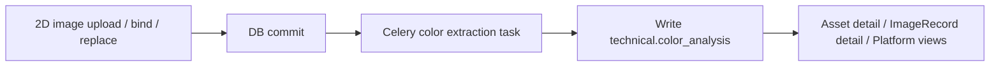

# IMAGE_COLOR_EXTRACTION_METADATA_INTEGRATION_PLAN

## Purpose

This document defines how to adapt `mdams-prototype` so that color features are extracted during 2D image ingest and written back as metadata.

The intended outcome is:

- the ingest flow stays non-blocking
- color analysis becomes part of the asset metadata contract
- the same metadata can be read from asset detail, image-record detail, and platform views
- the implementation fits the repository鈥檚 existing `Asset` / `ImageRecord` / `metadata_info` / `Celery` pattern

## Current Baseline in `mdams-prototype`

The repository already has the right structural pieces:

- `backend/app/routers/assets.py` handles direct 2D asset upload
- `backend/app/routers/image_records.py` handles record binding and replacement
- `backend/app/tasks.py` already uses Celery for post-ingest work
- `backend/app/services/metadata_layers.py` already normalizes layered metadata into `core / management / technical / profile / raw_metadata`
- `backend/app/services/preview_images.py` and `backend/app/services/iiif_access.py` show the current pattern for file-derived enrichment
- `backend/requirements.txt` already includes `Pillow`, `numpy`, and `opencv-python-headless`, so a first implementation does not need new runtime dependencies

This means color extraction should be added as a post-ingest enrichment step, not as a blocking step inside the upload request.

## Recommended Integration Model

### 1. Add a dedicated color extraction service

Create a backend service such as:

- `backend/app/services/color_extraction.py`

The service should expose one entry point, for example:

```python
extract_color_features(file_path, *, image_type=None, mask_path=None) -> dict
```

The returned payload should be a single structured object that can be stored under technical metadata. A practical shape is:

```json
{
  "status": "done",
  "algorithm": "museum-color-extractor",
  "algorithm_version": "0.1",
  "predicted_image_type": "artifact_photo",
  "dominant_color": {...},
  "secondary_colors": [...],
  "signature_colors": [...],
  "color_distribution": [...],
  "quality_flags": [],
  "sampled_pixel_count": 50000,
  "mask_strategy": "artifact_photo_auto",
  "extracted_at": "2026-04-14T12:00:00Z"
}
```

### 2. Trigger extraction asynchronously

Add a Celery task in:

- `backend/app/tasks.py`

The task should:

- load the final stored image file
- run color extraction
- write the result back to the database
- never block the user-facing ingest request

Recommended task name:

- `extract_image_colors`

Recommended trigger points:

- after `assets.upload_file` commits the new `Asset`
- after `image_records.confirm_bind_image_record` commits the bound `Asset`
- after `image_records.confirm_replace_image_record_asset` commits the replacement `Asset`

This matches the existing `generate_iiif_access_derivative.delay(...)` pattern.

### 3. Store results in technical metadata

The color payload should be written into:

- `Asset.metadata_info.technical.color_analysis`
- `ImageRecord.metadata_info.technical.color_analysis`

That placement is important:

- it keeps color as derived technical metadata, not raw provenance
- it keeps the contract aligned with existing technical fields like width, height, fixity, and conversion method
- it makes the data visible in the existing detail views without inventing a new metadata namespace

Because the current metadata builder canonicalizes layered JSON, the safest implementation is:

1. call the existing metadata builder first
2. append `technical.color_analysis`
3. assign the full JSON object back to the ORM field

Do not store the color payload only in `raw_metadata`. That makes it harder to query and less consistent with the rest of the system.

## Recommended Flow



The key design choice is that color extraction runs after the file has a stable path on disk. It does not need to wait for IIIF derivative generation to finish.

## Metadata Contract

At minimum, the technical payload should include:

- `status`
- `algorithm`
- `algorithm_version`
- `predicted_image_type`
- `dominant_color`
- `secondary_colors`
- `signature_colors`
- `color_distribution`
- `quality_flags`
- `sampled_pixel_count`
- `mask_strategy`
- `extracted_at`

Recommended nested color item fields:

- `hex`
- `name`
- `rgb`
- `lab`
- `ratio`
- `role`
- `saturation`
- `visual_contrast`
- `rarity_in_category`
- `feature_score`

This is enough for both display and later search/facet work.

## API and Schema Changes

### Backend

Add a small schema or typed dict for the returned color analysis payload if you want stronger validation.

Update the asset detail response path so the technical metadata remains visible through:

- `backend/app/services/asset_detail.py`
- `backend/app/services/metadata_layers.py`

If the same payload is mirrored to `ImageRecord`, the existing record detail response will automatically be able to carry it through `metadata_info`.

### Frontend

Add optional display only, not workflow logic, to:

- `frontend/src/components/AssetDetail.tsx`
- `frontend/src/components/ImageRecordDetail.tsx`
- `frontend/src/types/assets.ts`

The frontend should read the technical block and render:

- dominant color
- top secondary colors
- signature colors
- quality flags

No new UI state machine is needed for the first version.

## Validation Strategy

The first version should be considered correct if all of the following hold:

1. a newly ingested 2D image gets a `technical.color_analysis` object
2. bind and replace flows both produce the same enrichment
3. a failed color extraction does not block ingest completion
4. asset detail and image-record detail can read the stored payload
5. the payload survives JSON round-trip in PostgreSQL

Recommended tests:

- service-level unit test for a small synthetic image
- router or task test for post-commit enqueue behavior
- metadata round-trip test for `technical.color_analysis`

## Phase Boundary

This plan intentionally stays on the low-risk side of the architecture.

In phase 1:

- keep the implementation inside the existing backend
- keep color extraction asynchronous
- keep the result as metadata JSON
- avoid adding a separate color-feature table unless a search or aggregation requirement is already fixed

In phase 2:

- add normalized color tables if the project needs filtering, ranking, or analytics over many assets
- add indexes only after query patterns are confirmed

## Writing-Ready Summary

`mdams-prototype` can support color extraction as a technical-metadata enrichment step attached to its existing 2D ingest pipeline. The implementation does not require a new ingest subsystem. It can be added by introducing a dedicated color-analysis service, invoking it through Celery after asset commit, and writing the result into `metadata_info.technical.color_analysis` on both the `Asset` and `ImageRecord` sides. This keeps color data aligned with the repository鈥檚 layered metadata model and makes the result immediately available to existing detail views and future search functions.
