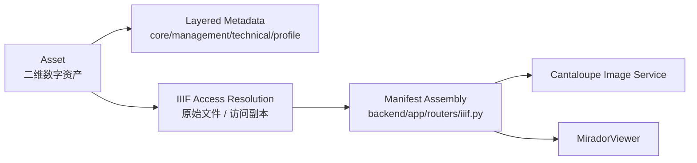

# IIIF清单配置说明（IIIF_MANIFEST_PROFILE）

## 目的

本文档用于说明 MDAMS Prototype 当前 IIIF Manifest 输出层的实际定位、实现锚点、稳定能力、边界和后续 formalization 方向。

截至 **2026-04-08**，它优先回答：
- 当前 IIIF 支持在哪些代码和工作流里真实存在；
- 当前 Manifest 输出最适合被理解为哪一种最小 profile；
- 哪些字段/结构可以稳定宣称；
- 哪些复杂能力目前仍不应贸然声称。

## 一、实现锚点

当前 IIIF 能力最直接的实现锚点包括：
- `backend/app/routers/iiif.py`
- `backend/app/services/iiif_access.py`
- `backend/app/services/metadata_layers.py`
- `backend/tests/test_asset_visibility.py`
- 前端 `frontend/src/MiradorViewer.tsx`

这意味着当前 IIIF 不是停留在路线图，而是已经进入：
- 后端路由；
- 访问副本解析；
- Manifest 组装；
- 查看器消费；
- 权限回归测试。

## 二、当前判断

在 MDAMS 当前架构中，IIIF 仍然是最强、最直接、最可展示的标准实现层之一。

根据当前实现，可以稳定确认系统已经具备：
- 动态 IIIF Manifest 生成；
- 基于 `API_PUBLIC_URL` 和 `CANTALOUPE_PUBLIC_URL` 的公共 URL 结构；
- 基于 Cantaloupe 的图像服务链；
- 与 Mirador 的稳定消费路径；
- 对隐藏资源的可见性控制；
- 原始文件与 IIIF access 副本之间的区分。

因此，当前最稳妥的研究与实现表达是：

> MDAMS 已经具备一个**面向单资产图像访问的最小 IIIF Manifest 输出层**，足以支撑原型展示与查看器互操作，但尚不应被表述为“全面 IIIF 平台”。

## 三、IIIF 在当前系统中的角色

### 1. 访问表示层
IIIF 在当前项目中的主要职责不是保存建模，而是：
- 提供图像访问表示；
- 作为查看器消费入口；
- 把内部资产对象投影成可访问结构。

### 2. 主链路关键节点
当前最强二维主链路中，IIIF 位于：

1. 文件进入系统；
2. 资产登记；
3. 技术元数据处理与访问副本准备；
4. Manifest 生成；
5. Mirador 消费与展示。

### 3. 与其他标准分工不同
需要明确：
- IIIF 主要服务访问与展示；
- 不替代 PREMIS 事件模型；
- 不替代 BagIt 导出包；
- 不承担 OAIS 意义上的完整保存信息包建模。

## 四、当前最小 Manifest Profile

结合当前实现和查看器路径，MDAMS 当前 Manifest 最适合被理解为：

> **面向单一数字资产图像访问的最小 IIIF Presentation profile**

也就是说，当前稳定支持的重点是：
- 单资产导向；
- 单 Canvas 图像访问导向；
- Mirador 兼容优先；
- 图像服务集成优先；
- 不预设复杂叙事结构。

### 这个最小 profile 的当前特征
- Manifest `id` 稳定可构造；
- `type` 为 `Manifest`；
- `label` 由资产标题或文件名生成；
- `summary`、`homepage` 已输出；
- `metadata` 已包含基础系统字段与 layered metadata 映射；
- `items` 中包含 Canvas、AnnotationPage、Annotation；
- `body.service` 指向 Cantaloupe 图像服务；
- 图像尺寸可从 layered metadata 推导，缺失时有兜底值。

## 五、当前可稳定宣称的能力

### 1. 动态 Manifest 生成
Manifest 由 `backend/app/routers/iiif.py` 动态组装，而不是静态手写 JSON。

### 2. 与访问副本策略协同
Manifest 并不直接假定一定使用原始文件，而是通过 `iiif_access.py` 优先解析：
- IIIF access 副本；
- 无副本时的原始文件回退；
- 尚未准备完成时的 `409` 状态。

### 3. 与图像服务协同
Manifest 中的 `body.service` 当前直接指向 Cantaloupe 图像服务 URL，而不是抽象占位符。

### 4. 与 Mirador 的真实消费路径
前端 `MiradorViewer.tsx` 当前直接加载 Manifest URL 并读取 metadata/title 等信息，说明当前输出已经进入真实 viewer 路径。

### 5. 权限边界已进入 Manifest 输出
`test_asset_visibility.py` 已验证隐藏资源对无权限用户返回 `403`，这说明 IIIF 输出不是绕过权限的旁路。

## 六、建议纳入“稳定支持”的字段/结构

| 字段/结构 | 当前状态 | 说明 |
|---|---|---|
| `id` | 稳定支持 | Manifest 标识 |
| `type` | 稳定支持 | 固定为 `Manifest` |
| `label` | 稳定支持 | 来自资产标题/文件名 |
| `summary` | 稳定支持 | 基础摘要 |
| `homepage` | 稳定支持 | 资产详情入口 |
| `metadata` | 稳定支持 | 基础系统字段 + layered metadata |
| `items` | 稳定支持 | Canvas 链 |
| `Canvas` | 稳定支持 | 单页图像访问 |
| `AnnotationPage` | 稳定支持 | viewer 兼容结构 |
| `Annotation` | 稳定支持 | painting annotation |
| `body` | 稳定支持 | 图像资源与访问 URL |
| `service` | 稳定支持 | Cantaloupe 图像服务 |

## 七、当前不宜贸然宣称已支持的能力

为了保持研究表达准确，以下能力当前仍不应轻易宣称已经完整支持：

### 1. 复杂多对象叙事结构
- 多层 ranges
- 复杂章节逻辑
- 多序列阅读路径

### 2. 丰富注释生态
- 用户注释
- 外部 annotation targeting
- 复杂语义批注

### 3. 多媒体混合对象
- 音频/视频/3D 与图像混排
- 时间轴驱动的对象展示

### 4. 全覆盖 Presentation API
当前更准确的表达仍是：
- 选择性支持核心访问结构；
- 针对当前图像访问路径稳定输出；
- 不宣称完整 API 覆盖。

## 八、当前实现链理解

从落地角度看，当前 IIIF 输出链可被理解为：

这里的关键判断是：
- IIIF 是访问投影层；
- 不是内部对象总模型；
- 也不是保存层对象。

## 九、当前缺口

### 1. Manifest 输出字段仍未逐项样本化
虽然代码路径清晰，但还没有配一份真实 Manifest 样本逐字段说明。

### 2. 当前 profile 仍是“事实归纳”，还不是正式 capability matrix
后续仍应把“稳定支持字段”“条件存在字段”“暂不支持能力”做成更明确表格。

### 3. 兼容性说明仍主要依赖 Mirador 路径
当前最强验证来自 Mirador 消费路径，但尚未形成更广的 viewer/validator 说明。

## 十、对项目推进的建议

1. 补一个真实 Manifest 样本并逐字段注释
2. 增加一张 capability matrix，区分 stable / conditional / unsupported
3. 在研究写作中持续把 IIIF 写成访问表示层，而不是总对象模型
4. 把 IIIF 与图像 access 副本策略、权限控制和 Mirador 路径一起叙述，而不是只写“支持 IIIF”

## 十一、当前结论

当前 MDAMS 的 IIIF 能力最适合被描述为：

> 一个围绕单资产图像访问场景构建的、具有真实后端路由、访问副本解析、图像服务集成、权限控制和查看器消费路径的最小 IIIF Manifest 输出层。

它已经足以作为原型系统最重要的可展示标准能力之一，但当前仍应避免把它表述为复杂对象导向、完整生态级的 IIIF 平台实现。
