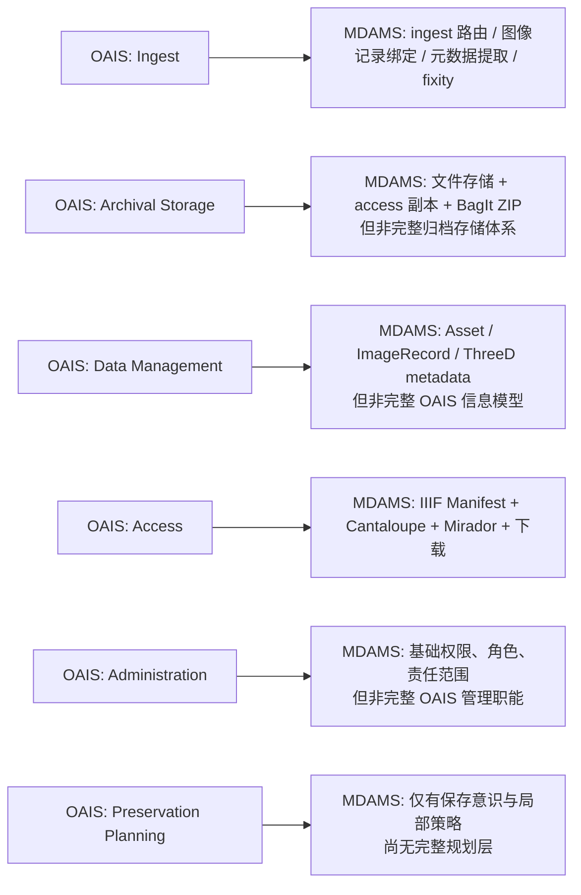

# OAIS范围对照

## 目的

本文档用于把 MDAMS 当前实现与 OAIS 参考模型进行**轻量范围对照**。

它的目标不是证明 MDAMS 已实现 OAIS，而是帮助研究写作清楚说明：
- 当前系统哪些方面受 OAIS 思维启发；
- 哪些方面只表现出概念对齐；
- 哪些 OAIS 职能域仍明显不在当前原型范围内。

## 一、当前总体判断

截至 **2026-04-08**，MDAMS 与 OAIS 的关系最准确的描述仍是：

> MDAMS **受 OAIS 思维启发并在局部表现出 SIP-like、生命周期导向和访问/导出分层意识，但并不是完整 OAIS 仓储系统。**

当前可以稳定支撑这一说法的事实包括：
- ingest / SIP 风格入库语言与接口；
- fixity、metadata extraction、conversion 等过程链；
- IIIF 访问表示层；
- BagIt SIP-like 打包层；
- 原件、访问表示、导出表示之间的分层；
- 研究线中对保存意识和边界的持续说明。

## 二、OAIS范围图

## 三、按 OAIS 职能域对照

| OAIS 职能域 | 当前 MDAMS 对应 | 对齐判断 | 说明 |
|---|---|---|---|
| Ingest | `ingest` 路由、图像记录绑定、fixity、metadata extraction、转换 | 部分且最强 | 当前最接近 OAIS 的实现面 |
| Archival Storage | 文件存储、访问副本、BagIt ZIP | 部分 | 有保存导向痕迹，但不是完整归档存储体系 |
| Data Management | `Asset`、`ImageRecord`、三维 metadata 分层、平台视图 | 部分 | 有对象和元数据管理，但未 formalize 为 OAIS 信息模型 |
| Access | IIIF Manifest、Cantaloupe、Mirador、普通下载、三维 viewer | 明显概念对齐 | 访问层是当前最成熟的对外表现层 |
| Administration | 角色权限、责任范围、测试用户、审批 | 有限对齐 | 属系统治理基础，但不等于 OAIS 管理域 |
| Preservation Planning | 保存意识、访问副本策略、BagIt 边界说明 | 弱对齐 | 目前更多体现在设计取向，而非正式子系统 |

## 四、信息包视角对照

| OAIS 信息包概念 | 当前 MDAMS 现实 | 当前判断 |
|---|---|---|
| SIP | ingest 输入、manifest 型输入、BagIt SIP-like 导出语义 | 有概念与局部实现，但未统一 formalize |
| AIP | 无正式一等实体 | 当前不在范围内 |
| DIP | IIIF Manifest、普通下载、申请交付包等输出对象 | 有输出层现实，但未以 OAIS DIP 术语 formalize |

## 五、当前最可靠的 OAIS 对齐点

### 1. 生命周期意识
系统已经不是简单上传下载工具，而是存在：
- ingest；
- 校验；
- 元数据提取；
- 转换；
- 访问表示；
- 导出表示。

### 2. 输入、访问、输出分层
当前至少已形成：
- 输入/接收语义；
- 访问表示语义；
- 输出/打包语义。

### 3. preservation-aware 表达
当前研究线可以合理使用的表述是：
- preservation-aware
- SIP-like
- lifecycle-oriented

而不应直接写成：
- fully OAIS compliant
- complete OAIS repository

## 六、当前明显不在范围内的内容

以下能力当前不应宣称已经实现：

### 1. 完整 AIP 体系
当前没有把 AIP 建模为正式对象。

### 2. 完整 OAIS 职能域实现
尤其是：
- Preservation Planning
- Administration
- Archival Storage

都没有形成完整独立子系统。

### 3. 正式 OAIS 信息模型映射
当前仍没有把 `Asset`、`ImageRecord`、三维对象、导出包一一映射成 OAIS 信息对象体系。

## 七、论文写作可直接复用的表述

### 简短版
MDAMS 当前并不宣称实现完整 OAIS，而是以 OAIS 作为概念性保存框架，在 ingest、生命周期分层、访问表示和输出打包等方面体现 preservation-aware 的原型取向。

### 稍长版
MDAMS Prototype 与 OAIS 的关系主要体现在概念层和局部实现层：系统采用了 SIP-like 的 ingest 语言、区分原始对象与访问表示、提供 preservation-aware 的 BagIt 打包输出，并围绕 fixity、元数据提取、转换和访问建立了生命周期导向的工作流。然而，系统尚未把 SIP/AIP/DIP 建模为完整实体，也未覆盖 OAIS 的全部职能域，因此更适合被描述为一个受 OAIS 思维启发的研究型原型，而不是完整 OAIS 仓储。

## 八、当前工作结论

OAIS 当前最适合作为 MDAMS 的**概念解释层和边界校准工具**。

它帮助当前项目回答的不是“我们是否已经实现 OAIS”，而是：

> 为什么这个系统虽然不是完整保存仓储，却仍然能够被合理地解释为一个具有保存意识、生命周期意识和信息分层意识的数字资产管理原型。
