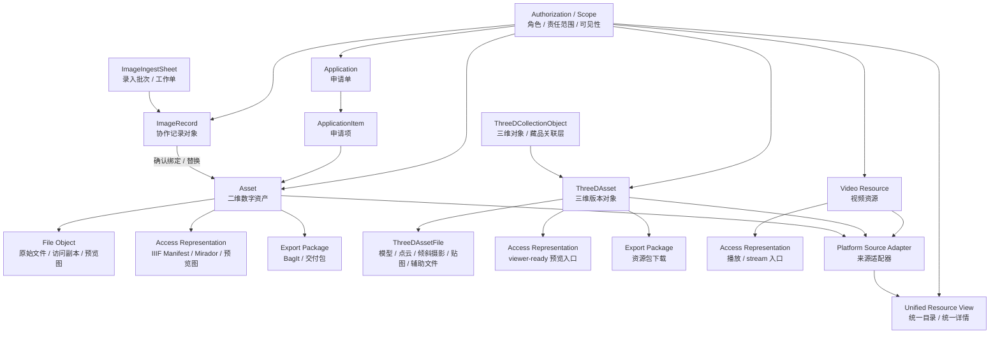

# 统一对象模型（UNIFIED_OBJECT_MODEL）

## 目的

本文档用于把 MDAMS 当前已经存在的主要对象收敛成一组可解释、可复用的统一对象模型。它服务两个场景：

- 实现侧：帮助后续事件模型、元数据 profile、统一平台聚合和工作流设计保持对象边界一致；
- 论文侧：把二维资产、图像记录、三维资源、视频资源、申请交付和权限控制解释为同一个原型框架，而不是一组零散功能。

## 核心判断

截至 **2026-05-17**，MDAMS 最稳定的对象模型判断是：

> 数字资源仍是系统核心管理对象，但它已经由二维 `Asset` 扩展为多来源资源体系；统一平台是聚合视图层，不是新的单一资源本体。

当前系统形成了四组核心对象：

- 资源本体对象：`Asset`、`ThreeDAsset`、视频资源记录；
- 协作对象：`ImageRecord`、申请单、申请项；
- 表示与交付对象：IIIF Manifest、预览图、viewer-ready 文件、BagIt ZIP、资源包；
- 控制语义对象：角色、权限、`collection_scope`、`visibility_scope`。

## 稳定术语

| 对象 | 当前实现锚点 | 当前角色 | 说明 |
|---|---|---|---|
| 二维数字资产 | `Asset` | 核心资源对象 | 承载文件、元数据、状态、可见性、IIIF、下载和申请链路 |
| 图像记录 | `ImageRecord` | 协作记录对象 | 表示“元数据先行、影像后绑定”的工作流记录，不等同于资产本体 |
| 三维对象 / 版本 | `ThreeDCollectionObject` / `ThreeDAsset` | 扩展资源对象 | 表示对象、版本、文件包和 viewer 契约 |
| 三维文件对象 | `ThreeDAssetFile` | 技术载体对象 | 表示模型、点云、倾斜摄影、贴图和辅助文件等角色 |
| 视频资源 | `/api/video/resources` | 扩展资源对象 | 表示视频文件、播放入口、元数据与统一平台来源 |
| 访问表示 | IIIF Manifest、预览图、viewer-ready 文件、播放流 | 表示层对象 | 用于浏览和展示，不等于原始保存对象 |
| 导出表示 | BagIt ZIP、交付包 | 输出层对象 | 面向打包、传输、交付和长期保存叙述 |
| 统一资源视图 | platform adapter / directory / detail | 聚合视图对象 | 统一目录和统一详情中的摘要与详情，不是新的本体对象 |
| 申请对象 | `Application` / `ApplicationItem` | 业务流程对象 | 表示申请、审批、导出和交付流程 |
| 权限范围 | role / `collection_scope` / `visibility_scope` | 控制语义对象 | 决定对象可见性、可执行动作和责任边界 |

## 当前对象关系

## 解释规则

### 1. `Asset` 仍是二维主链路的核心对象

`Asset` 当前直接承载文件路径、大小、MIME type、可见性范围、`metadata_info`、IIIF、Mirador、BagIt 和申请链路。因此在二维资源叙述中，仍应把 `Asset` 视为最稳定的资源本体。

### 2. `ImageRecord` 是先于资产的协作对象

`ImageRecord` 的作用是录入、提交、退回、待上传、绑定和替换。它连接元数据录入角色与摄影上传角色，表达“记录和媒体文件分离协作”的业务语义。

### 3. 三维资源采用对象 + 版本 + 文件包结构

三维实现已经显示出对象层、版本层和文件角色层。它不是“又一种单文件资产”，而是当前原型中的扩展资源体系。

### 4. 视频资源已经进入统一平台来源体系

视频资源通过 `/api/video/resources` 管理，并通过平台适配器进入统一资源目录。论文或说明中应把视频写成当前已有的多模态来源示例。

### 5. 统一平台是视图层

统一平台通过 `image_2d`、`three_d`、`video` 三类来源适配器聚合资源。它提供统一目录、统一详情和跨来源跳转，但不取代各来源系统的本体对象。

### 6. 访问表示和导出表示不是资源本体

IIIF Manifest、预览图、viewer-ready 文件、播放流、BagIt ZIP 和交付包都属于资源的外部表达。这个区分对于 IIIF / BagIt 标准映射、PREMIS 事件模型和保存导向叙述都很重要。

### 7. 权限与范围控制是结构性语义

权限当前影响菜单可见性、资源可见性、责任范围、申请动作、图像记录协作和统一平台访问。因此它应作为对象模型中的控制语义层显式保留。

## 当前边界

这个统一对象模型仍未完全 formalize，当前仍有三类后续问题：

1. `Asset`、三维资源和视频资源未来是否需要进一步收束为更高层的 `DigitalResourceObject`；
2. `ImageRecord` 与藏品对象、申请对象之间是否需要更强关系模型；
3. 访问表示、导出表示和事件对象是否需要独立数据库级建模。

## 当前结论

当前最稳妥的研究表达不是把所有对象合并成单一 schema，而是承认 MDAMS 已经形成一个：

> 以数字资源为核心、以协作对象和扩展对象为补充、以视图层和表示层为外部表达、以权限范围为控制语义的统一对象框架。
